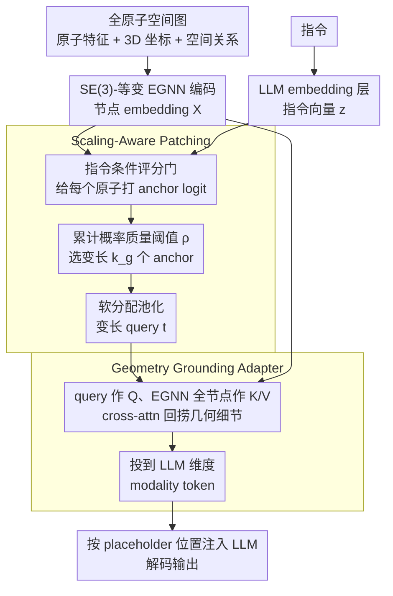

# Scaling-Aware Adapter for Structure-Grounded LLM Reasoning

**会议**: ICML2026  
**arXiv**: [2602.02780](https://arxiv.org/abs/2602.02780)  
**代码**: https://github.com/zihao-jing/Cuttlefish  
**领域**: 多模态VLM / 结构-语言对齐 / All-Atom LLM  
**关键词**: Cuttlefish, Scaling-Aware Patching, Geometry Grounding, 结构幻觉, EGNN, Q-Former 替代  

## 一句话总结
Cuttlefish 把 Q-Former 那种"固定长度查询 token"换成了"按结构复杂度自适应增长的指令条件 patch token"，再用 cross-attention 把 EGNN 抽出的几何特征作为 modality token 注入 LLM，从而在分子 / 蛋白 / DNA / RNA 四种全原子模态上同时降幻觉、扛 scaling，超过一众模态专用 baseline。

## 研究背景与动机

**领域现状**：把 LLM 扩到分子、蛋白、核酸等"科学结构"模态时，主流做法基本两类——一类是直接把 SMILES、氨基酸序列当文本喂给 LLM (MolT5、ProtST、RNA-GPT)；另一类是 Q-Former 风格的"固定长度可学查询 token" 把图结构压成一组固定 token 再接 LLM (3D-MoLM、Mol-Llama、ProtChatGPT 等)。

**现有痛点**：作者用一个非常直观的 Mol-Instructions captioning 实验（Fig. 1）撕开了 Q-Former 路线的伤口——把分子按长度分箱后，**长分子上所有指标全面塌方**。原因很硬：固定 32/64 个查询 token，对小分子是"挥霍"，对大分子是"过度压缩"。同时表 1 的幻觉测试显示，纯序列输入（无几何）模型在 200 个分子/蛋白上的 hallucination rate 高达 0.28–0.34，明显高于带结构的版本（0.06–0.12）。

**核心矛盾**：(1) **预算 scaling**——结构复杂度横跨数十到上千原子，固定 query 长度天然失配；(2) **结构幻觉**——序列输入根本就没编码几何，LLM 只能"瞎编"长程空间关系。Q-Former 把这两个矛盾耦合在一起，谁也救不了。

**本文目标**：在一个统一连接器里同时解决预算自适应和几何 grounding，并且要能横扫 4 种全原子模态。

**切入角度**：作者的关键观察是 query token 应该是"指令条件"的——给定不同问题，对同一个分子要关注的原子子集不同；而且应该让 query 数量随结构信息量"长出来"，而不是预先固定。

**核心 idea**：用一个 instruction-conditioned gate 选 anchor 原子，再以累计概率质量阈值 $\rho$ 决定每个图取多少个 anchor，软分配 patch 后做加权池化得到变长 query；再让这些 query 通过 cross-attention 从 EGNN 全节点 embedding 里"回捞"几何细节，最后投影成 modality token 注入 LLM。

## 方法详解

### 整体框架
Cuttlefish 想替换掉 Q-Former 那个"固定长度 query"的连接器：给定一个全原子空间图（原子特征 + 3D 坐标 + 空间关系）和一句指令，它要按指令把图压成一组**数量随结构复杂度变化**、又带可验证几何证据的 modality token，再注入 LLM。具体怎么转：空间图先过一层 SE(3)-等变 EGNN，编码出节点 embedding $\boldsymbol{X}\in\mathbb{R}^{N\times D_{enc}}$，指令 token 过 LLM embedding 层得到 $\boldsymbol{z}$；随后一个指令条件的评分门给每个原子打 anchor logit，用累计概率质量阈值挑出变长的 $k_g$ 个 anchor 并软分配池化成变长 query $\boldsymbol{t}$；这组 query 再通过 cross-attention 从 EGNN 全节点 embedding 里"回捞"被池化平均掉的几何细节，refine 成 modality token $\widehat{\boldsymbol{T}}$，按指令序列里的 placeholder 位置插入后送进 LLM 解码。整套连接器靠三阶段冻结训练协议落地。

### 关键设计

**1. Scaling-Aware Patching：让 query 数量随结构信息量"长出来"**

固定 32/64 个 query token 对小分子是挥霍、对大分子是过度压缩，长分子上指标全面塌方——这是这篇要解决的第一个痛点。Cuttlefish 的做法是把 query 数量做成指令条件的函数：先用评分门算 anchor logits $\boldsymbol{\ell}=G_{anc}(\boldsymbol{z},\boldsymbol{X},\boldsymbol{b})$，对每个图 $\mathrm{Softmax}$ 后按概率从大到小排序，取**最小的 $k_g$ 使累计概率质量达标** $\sum_{j=1}^{k_g}\boldsymbol{prob}_{\pi_j}\geq \rho$。这一步是关键——$k_g$ 不再是超参，而是由"要凑够 $\rho$ 的信息量需要几个 anchor"决定：信息稀疏的小分子可能 $k_g=4$ 就够，复杂蛋白能自动拉到几十个。选完 anchor 后再把每个 anchor 扩成一个 soft patch，用空间距离加语义偏置算软分配权重

$$\boldsymbol{W}_{i,a}=\frac{\exp(-\|\mathbf{P}_i-\mathbf{P}_a\|_2^2+\boldsymbol{\ell}_a)}{\sum_{a'}\exp(-\|\mathbf{P}_i-\mathbf{P}_{a'}\|_2^2+\boldsymbol{\ell}_{a'})}$$

最后归一化池化成变长 query $\boldsymbol{t}_a=\sum_i \boldsymbol{W}_{i,a}\boldsymbol{X}_i/\sum_j\boldsymbol{W}_{j,a}$。注意 anchor logit $\boldsymbol{\ell}_a$ 同时进了两处：一处决定"选哪几个原子当 anchor"，一处作为 softmax 偏置决定"每个 anchor 圈多大领地"——相关性高的 anchor 自动获得更大感受野，等于把"注意力"和"领地大小"用同一组 logit 绑在一起。

**2. Geometry Grounding Adapter：把池化丢掉的几何细节再捞回来**

第二个痛点是结构幻觉——纯序列输入根本没编码几何，LLM 只能瞎编长程空间关系。但即便用了上一步的池化，in-patch 加权平均也会把键角、距离、长程接触这些高分辨率几何抹平。所以这一步不是二次选 anchor，而是 retrieval-and-refinement：把概要 query $\boldsymbol{t}$ 投成 $\mathcal{Q}$，把 EGNN 全节点 embedding $\boldsymbol{X}$ 投成 $\mathcal{K},\mathcal{V}$，经 $L_f$ 层 self-attn → cross-attn → FFN 的 fusion block，最后投到 LLM 维度 $D_{LLM}$ 得 $\widehat{\boldsymbol{T}}$；注入时在指令序列里定位 modality placeholder $y_{ins}$ 的位置 $\boldsymbol{p}$，把 $\widehat{\boldsymbol{T}}$ 嵌进去并同步 attention/label mask。anchor 此前已经把范围锁定到 instruction-relevant 区域，cross-attn 要做的就是在这块区域内恢复被平均掉的几何证据。这正是降幻觉的物理基础：每个 modality token 都对应一份可验证的几何细节，而不是抽象可学向量。

**3. 三阶段训练协议：先编码器、再 connector、最后才动 LLM**

为了既对齐新模态又不破坏 LLM 的语言先验，训练拆成三段冻结推进。先单独预训练 EGNN 编码器，同时优化原子类型预测、距离回归、方向噪声去噪三个目标 $\mathcal{L}_{enc}=\mathcal{L}_{type}+\lambda_d\mathcal{L}_{dist}+\lambda_u\mathcal{L}_{dir}$；再进 Modality Alignment 阶段，冻结 EGNN 和 LLM，只训 Scaling-Aware Patching 和 Geometry Grounding Adapter；最后 LLM Adaptation 阶段用小学习率解冻 LLM 做收尾微调。和 Q-Former 流派必须靠重型对比预训练对齐不同，Cuttlefish 的 query 是结构动态生成、自带几何语义的，所以跳过对比阶段、直接用指令监督就能对齐，分阶段冻结也保证了语言先验不被冲掉。

### 损失函数 / 训练策略
编码器阶段如上；后两阶段都是标准 instruction tuning 的 next-token cross-entropy，在自建的 GEO-AT 数据集上训练。论文还在附录给了两个理论分析——"指令加权压缩失真界"和"几何 grounding 降低 Bayes 风险"，分别为变长 patching 和几何注入提供了形式化支撑。

## 实验关键数据

### 主实验

在自建的 GEO-AT 全原子基准上（METEOR / BERTScore，4 模态平均）对比通用 LLM baseline：

| Backbone | Molecule METEOR | Protein METEOR | DNA METEOR | RNA METEOR | 平均 METEOR |
|---|---|---|---|---|---|
| Llama-3.1-8B-Instruct (纯序列) | 0.229 | 0.178 | 0.175 | 0.175 | 0.186 |
| Mistral-3-8B-Reasoning (推理型, tokenizer 增强) | 0.185 | 0.192 | 0.149 | 0.288 | 0.220 |
| **Cuttlefish + Llama-3.1-8B** | **0.391** | **0.417** | **0.529** | 0.403 | **0.428** |
| **Cuttlefish + Qwen3-8B** | 0.389 | 0.377 | 0.391 | **0.491** | **0.428** |

在 Mol-Instructions captioning 任务上（前面让 Q-Former 系列塌方的长度分箱场景），换上 Cuttlefish 后所有 length bin 上的指标基本拉平，长分子区间相比 Mol-Llama 的提升尤其显著。功能基团幻觉测试上，配上 Cuttlefish 的 Mol-Llama 把 HR 从 0.28 砍到 0.12，ProtChatGPT 从 0.34 砍到 0.10。

### 消融实验

论文给出的核心消融围绕两大模块和训练阶段：

| 配置 | 现象 | 说明 |
|---|---|---|
| 完整 Cuttlefish | 4 模态平均 METEOR 0.428 | 标准配置 |
| 去掉 Scaling-Aware Patching（退回固定 query 长度） | 长分子段指标显著下滑 | 印证 Fig. 1 中 Q-Former 的失败模式 |
| 去掉 Geometry Grounding Adapter | 幻觉率回升 | cross-attn 回捞几何细节不可省 |
| 跳过 LLM Adaptation 阶段（只训 connector） | 平均掉点 | 语言端也需要为新 modality 留出适配空间 |
| 跨 backbone（Qwen2.5/Llama-3/Mistral-3/GLM-4/Qwen3/R1） | 一致正向 | 表明 connector 设计与具体 LLM 解耦 |

### 关键发现
- **变长 query 是关键**：固定 query 长度在小分子上浪费、大分子上塌方；按累计概率质量自适应分配后，模型在所有长度区间表现都被拉平。
- **几何 grounding 直接降幻觉**：所有 4 种模态上 Cuttlefish 都把幻觉率压到非结构模型的 1/2 到 1/3，且这是从训练目标外"白送"的——没有显式 anti-hallucination loss。
- **不需要对比预训练**：相比 Q-Former 系列必须重型对比对齐，Cuttlefish 的 query 自带几何语义，直接指令微调就能对齐，工程上轻很多。
- **跨 backbone 通用**：从 7B 到 9B、推理型到非推理型、Qwen / Llama / Mistral / GLM 全谱系加上 Cuttlefish 都收益，说明这是一个"连接器层"的通用改造。

## 亮点与洞察
- **Q-Former 的"固定预算"被认真挑战了**：之前大家都默认 query 数量是个超参数，这篇直接把它做成"指令条件的累计概率质量阈值的函数"，相当于把 token 预算变成可学的自适应量——这个思路完全可以反哺一般 VLM（让长图、视频自动获得更多 token）。
- **anchor logit 同时做"选哪几个原子"和"每个 anchor 长多大领地"**：复用同一组 logit 同时驱动选择和软分配权重 ($\boldsymbol{W}_{i,a}$ 公式里的偏置项)，把"重要性"和"感受野"耦合得很自然。
- **几何幻觉的可观测性**：作者特意构造了 functional group 的幻觉测试 (HR/HPM/AR)，让"结构幻觉"成为可量化指标——这种 benchmark 思路在科学 LLM 领域非常有价值。
- **三个阶段冻结策略**：先 connector-only 再 LLM 微调，把"对齐"和"语言能力保留"解耦，可以直接迁移到任何想给 LLM 加新模态的项目。

## 局限与展望
- **依赖结构可获得性**：蛋白用 AlphaFold2 fallback，分子和核酸也得有 3D 坐标——对那些只有序列的现实场景，几何 grounding 退化为纯序列编码，优势会被削弱。
- **mass threshold $\rho$ 是手工调的**：虽然 $k_g$ 自适应，但阈值 $\rho$ 本身仍是超参，论文未详细讨论它对预算-性能权衡的敏感性。
- **EGNN 容量是瓶颈**：所有几何信息都先过 EGNN，等变 GNN 在超大蛋白复合物上的表达力是公开问题，更换成更强的等变 Transformer 可能直接拔高上限。
- **没有 inference-time 计算预算控制**：变长 query 意味着不同样本占用不同 KV-cache，部署时如何 batch、如何控制最大延迟是工程难点。

## 相关工作与启发
- **vs Q-Former / 3D-MoLM / Mol-Llama**：他们用固定数量可学 query token，Cuttlefish 把数量做成累计概率质量的函数，把"压缩瓶颈"从架构常量变成数据相关量；同时 query 不再是抽象可学向量，而是带几何含义的 anchor patch 池化结果。
- **vs Graph2Token**：Graph2Token 用离散化 bridge 缓解了固定容量问题，但仍然有量化损失；Cuttlefish 走的是"连续变长 + 软分配"，理论上信息保留更完整。
- **vs ChatNT**：ChatNT 统一了 DNA/RNA/Protein 但只用序列输入，Cuttlefish 把模态范围进一步扩展到含几何的全原子，并把"统一接口"做得更深。

## 评分
- 新颖性: ⭐⭐⭐⭐ 把"变长指令条件 query"做进 modality connector，是对 Q-Former 范式很认真的一次手术
- 实验充分度: ⭐⭐⭐⭐⭐ 4 模态 × 多 backbone × 幻觉/scaling/消融/结构可用性等十多个分析视角，做得非常完整
- 写作质量: ⭐⭐⭐⭐ Challenge 1/2 + Fig. 1/Tab. 1 的开篇很有说服力，方法用两个算法框图 + 三个公式讲清楚了
- 价值: ⭐⭐⭐⭐ 给"LLM + 科学结构"方向提供了一套通用 connector，且思路（变长 query、几何 retrieval）可迁移到一般 VLM

<!-- RELATED:START -->

## 相关论文

- [\[ICML 2026\] Reasoning Structure of Large Language Models](reasoning_structure_of_large_language_models.md)
- [\[ACL 2026\] Budget-Aware Anytime Reasoning with LLM-Synthesized Preference Data](../../ACL2026/llm_reasoning/budget-aware_anytime_reasoning_with_llm-synthesized_preference_data.md)
- [\[ICLR 2026\] From Assumptions to Actions: Turning LLM Reasoning into Uncertainty-Aware Planning](../../ICLR2026/llm_reasoning/from_assumptions_to_actions_turning_llm_reasoning_into_uncertainty-aware_plannin.md)
- [\[ICLR 2026\] SceneCOT: Eliciting Grounded Chain-of-Thought Reasoning in 3D Scenes](../../ICLR2026/llm_reasoning/scenecot_eliciting_grounded_chain-of-thought_reasoning_in_3d_scenes.md)
- [\[ACL 2026\] SHAPE: Stage-aware Hierarchical Advantage via Potential Estimation for LLM Reasoning](../../ACL2026/llm_reasoning/shape_stage-aware_hierarchical_advantage_via_potential_estimation_for_llm_reason.md)

<!-- RELATED:END -->
