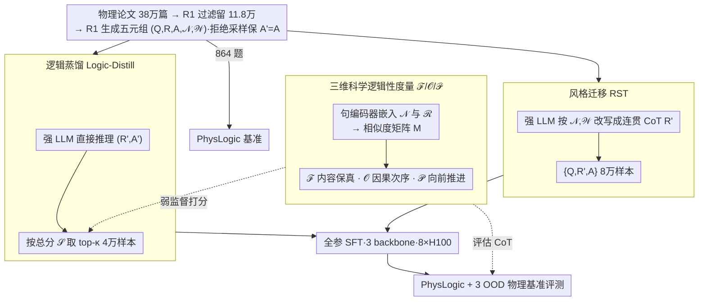

# Scientific Logicality Enriched Methodology for LLM Reasoning: A Practice in Physics

**会议**: ICML2026  
**arXiv**: [2605.17104](https://arxiv.org/abs/2605.17104)  
**代码**: https://github.com/ScienceOne-AI/PhysLogic  
**领域**: LLM 推理 / 科学推理 / 物理 QA  
**关键词**: 科学逻辑性、逻辑性评估、SFT 数据筛选、物理推理、PhysLogic

## 一句话总结
本文首次系统研究 LLM 科学推理中的"逻辑性"，提出"逻辑保真度 / 因果连接 / 推理进展" 三维评估指标，并基于该指标构造两种 SFT 数据采样方法（风格迁移 RST、逻辑蒸馏 Logic-Distill），在自建的 PhysLogic 基准与三个公开物理 benchmark 上把 7B 模型的逻辑性与答题准确率同时提了一大截。

## 研究背景与动机

**领域现状**：当前把 LLM 用于科学问答的研究主流是"堆数据 + 堆长 CoT"——通过收集更大规模、含长链思维的数学/物理/化学语料对 DeepSeek-R1、o1 等 reasoning 模型做 SFT 或 RL，以 GPQA、SciBench、PhysReason 这类 QA benchmark 的最终准确率作为唯一评价。

**现有痛点**：作者观察到 R1 这类模型在物理题上的思维链虽然冗长，却经常是"回忆 + 复述 + 自我反思"的拼接，缺乏专业人员从问题形式化、模型构建、证据生成、证据评估到结论得出的环环相扣的"逻辑链"。Figure 1 把 R1 和物理学家解同一道题的过程并排放，差异肉眼可见。

**核心矛盾**：科学推理的本质（logicality）—— 即一组保证推理步骤有效、结论可靠的概念/方法/原则 —— 被现有的"端到端 NLP 任务"建模彻底丢掉了。光看最终答案对错既无法解释 CoT 哪里出了问题，也无法指导训练去改善推理质量。

**本文目标**：（1）建立可量化的科学逻辑性评估方法；（2）基于这套指标构造高逻辑性 SFT 数据；（3）验证更强的逻辑性是否真的能转化成更好的答题表现。

**切入角度**：作者借鉴 Fischer 等人对科学探究的"认知活动"定义，把一道科学题的解题过程拆成若干"logical nexus"（关键逻辑节点）$\mathcal{N}=\{\nu_1,\dots,\nu_n\}$ 并赋以重要性权重 $\mathcal{W}=\{w_1,\dots,w_n\}$，把模型 CoT 切成句级序列 $\mathcal{R}=\{r_1,\dots,r_m\}$，再用 sentence encoder 把两边都嵌到向量空间，从而把"逻辑性"变成可计算的几何关系。

**核心 idea**：用"句子 vs. 逻辑节点"的相似度矩阵 $M\in\mathbb{R}^{n\times m}$ 同时刻画 *内容覆盖、因果次序、向前推进* 三件事，并把这三维分数当作 SFT 训练数据的筛选信号。

## 方法详解

### 整体框架
这篇论文要解决的是"怎么把 CoT 有没有逻辑变成一个能算的数，再用它去挑训练数据"。整套方法分两条主线。评估线：给定一道带 ground-truth 逻辑节点 $(\mathcal{N},\mathcal{W})$ 的科学题和模型推理 $\mathcal{R}$，先用 all-MiniLM-L6-v2 把节点和句子两边都编成向量 $V_\mathcal{N},V_\mathcal{R}$，算出相似度矩阵 $M$，再从 $M$ 上读出三个分数 $\mathcal{F},\mathcal{O},\mathcal{P}$。数据线：从 arXiv + 期刊抓 38 万篇物理论文，R1 过滤掉综述/工具类剩 11.8 万篇，再让 R1 多轮对话从每篇论文的推导链里生成 $(Q,R,A,\mathcal{N},\mathcal{W})$ 五元组（rejection sampling 保证 $A'=A$，最多重试 5 次），留 864 道做 PhysLogic benchmark，其余 8 万和 4 万分别走 RST 与 Logic-Distill 两种采样策略喂给 SFT。最后用 LlamaFactory 在 8×H100 上对 Llama-3.1-8B、Qwen2.5-7B-Instruct、DeepSeek-R1-Distill-Qwen-7B 三种 backbone 做全参 SFT（lr $5\times10^{-6}$、cosine、2 epoch、cutoff 32768），再回到 PhysLogic 和 3 个公开 benchmark 上闭环评测。

### 关键设计

**1. 三维科学逻辑性度量 $\mathcal{F},\mathcal{O},\mathcal{P}$：把"有没有逻辑"拆成内容、次序、进展三件能独立算的事**

传统准确率只判最终答案，过程类指标（如 ProcessBench）只看局部步骤对错，两者都分不清"答对但乱推"和"答对且严谨"。本文的做法是先在相似度矩阵 $M$ 上跑一遍贪心一对一匹配（阈值 $\tau$）得到匹配对集合 $\mathcal{C}$，然后在它之上算三个分量。**Logical Fidelity**（内容覆盖）用加权 recall $\rho=\sum_{(i,j)\in\mathcal{C}} w_i M_{ij}/\sum_k w_k$ 和 precision $\pi=|\mathcal{C}|/m$ 的调和平均得到 $\mathcal{F}=2\pi\rho/(\pi+\rho)$，衡量 CoT 把关键逻辑节点覆盖得全不全（权重 $w_i$ 让重要节点漏了扣分更狠）。**Causal Connection**（因果次序）先给每个节点 $\nu_i$ 算它在推理里的"语义重心" $P_i=\sum_j j\cdot M_{ij}/\sum_j M_{ij}$，即这个节点大致落在第几句，再统计实际重心顺序与 ground-truth 顺序一致的 nexus 对的加权占比得到 $\mathcal{O}$。**Inferential Progress**（向前推进）把每步 $r_j$ 表示成它对所有 nexus 的相似度向量 $\vec{S_j}$，定义这步的新颖度为 $1-\max_{k<j}\cos(\vec{S_j},\vec{S_k})$，$\mathcal{P}$ 取整条路径上的平均新颖度——一直在复述自己、原地打转的 CoT 这一项就低。三维一拆，"漏关键步骤""次序颠倒""自我循环不前进"三种失败模式各有归属，也顺势给后面按分数筛数据提供了可解释的多目标信号。

**2. Reasoning Style Transfer（RST）：把离散的逻辑骨架翻译成科学家式的自然 CoT**

直接拿 R1 的 native CoT 来蒸馏（Direct-Distill）会把"复述 + 自我怀疑"这些坏习惯一并学过去，可单纯把 nexus 列成 bullet 又不像自然思维链，模型学不到流畅推理。RST 走中间路线：用一个强 reasoning LLM $\mathcal{L}$ 做风格迁移 $R'=\mathcal{L}(Q,\mathcal{N},\mathcal{W})$，让它依照论文给定的逻辑节点和权重写出一段连贯、第一人称、带 `<think>` 标签的推理，最终 SFT 样本是 $\{Q,R',A\}$，其中答案 $A$ 直接取自论文而非模型自己生成。这样拿到的样本"骨架来自论文逻辑、皮肤来自强模型语言"，逻辑严密和自然 think 风格两头都占。表 5 显示这是三种 backbone 上 in-domain 逻辑性与准确率同时最高的方案。

**3. Logic-Distill：用三维分数当弱监督，直接从强模型海量 CoT 里挑严密的那批**

RST 必须先有 ground-truth nexus 才能改写，工程成本高、难扩展。Logic-Distill 反过来把同一套三维指标只当成"无需重新生成、纯做样本排序"的弱监督信号：让 $\mathcal{L}$ 直接对 $Q$ 推理得到 $(R',A')$，对每条 $R'$ 算出 $\pi,\rho,\mathcal{O},\mathcal{P}$；为消除四个分量的量纲差异，先对每个分量做 z-score 归一再过 sigmoid 得 $\tilde X=\sigma((X-\mu_X)/\sigma_X)$，然后融合成总分

$$\mathcal{S}=\delta_\mathcal{F}\cdot\frac{2\tilde\pi\tilde\rho}{\tilde\pi+\tilde\rho}+\delta_\mathcal{O}\tilde{\mathcal{O}}+\delta_\mathcal{P}\tilde{\mathcal{P}},$$

最后按 $\mathcal{S}$ 取全集的 top-$\kappa$ 百分位 $D=\mathrm{Top}_\kappa(D_{\text{full}},\mathrm{key}=\mathcal{S})$ 做 SFT。本质上就是把强模型那一堆 CoT 里 *碰巧逻辑严密* 的 40k 挑出来，用一半数据量逼近全量蒸馏的效果——评估器在这里被复用成了采样器，特别适合迁移到数学、化学等其他学科。

### 损失函数 / 训练策略
标准 SFT 交叉熵，无额外辅助 loss；逻辑性完全通过"喂什么数据"注入，而不改训练目标。具体用 LlamaFactory 做全参微调，BF16 + DeepSpeed ZeRO-3 + FlashAttention-2 + gradient checkpointing，per-device batch=1、grad accum=2、cutoff 32768、2 epoch、seed 42、warmup 0.03，跑在 8×H100 上。

## 实验关键数据

### 主实验（in-domain，PhysLogic benchmark）
RST 在三种 backbone 上对最强 baseline 的提升（averages of $\mathcal{F},\mathcal{O},\mathcal{P}$ 与最终 Acc）：

| Backbone | 第二名 baseline | 平均逻辑性 Δ | Acc Δ |
|----------|----------------|--------------|-------|
| Llama-3.1-8B | MegaScience (42.35 / 31.02) | **+3.59** → 45.94 | **+13.65** → 44.67 |
| Qwen2.5-7B-Instruct | MegaScience (43.12 / 39.81) | **+1.94** → 45.06 | **+3.01** → 42.82 |
| R1-Distill-Qwen-7B | SCP-116k (42.68 / 46.30) | **+3.30** → 45.98 | **+1.15** → 47.45 |

Out-of-domain 三个公开物理 benchmark（GPQA-physics / SciBench-physics / PhysReason）平均准确率：

| Backbone | 最强 baseline | Ours Logic-Distill (40k) | Ours RST (80k) |
|----------|--------------|--------------------------|----------------|
| Llama-3.1-8B | SCP-116k 35.08 | 35.14 | 30.98 |
| Qwen2.5-7B-Instruct | SCP-116k 34.72 | **45.04** (+10.32) | 41.41 |
| R1-Distill-Qwen-7B | SCP-116k 47.34 | **53.42** (+6.08) | 52.26 |

### 消融实验（Logic-Distill 中各分量的贡献）

| 配置 | Llama 逻辑/Acc | Qwen 逻辑/Acc | R1-7B 逻辑/Acc |
|------|----------------|---------------|-----------------|
| Logic-Distill (full) | 45.50 / 36.54 | 42.78 / 44.02 | 44.14 / 49.73 |
| w/o $\mathcal{F}$ | -1.60 / -2.69 | -2.75 / -3.43 | -2.56 / -4.65 |
| w/o $\mathcal{O}$ | -1.85 / **-5.23** | -4.43 / **-5.77** | -2.76 / **-11.05** |
| w/o $\mathcal{P}$ | -1.44 / -2.82 | -2.01 / -5.30 | -2.45 / -4.55 |
| Random 取样 | -1.83 / -4.61 | -1.03 / -15.25 | -3.90 / -7.95 |

### 关键发现
- 三个维度里，**Causal Connection $\mathcal{O}$ 去掉后 Acc 掉得最狠**（Llama -5.23、Qwen -5.77、R1-7B 高达 -11.05），说明"步骤顺序"是物理题答对与否的最关键过程信号。
- 第三方一致性验证（Table 3）：$\mathcal{F},\mathcal{O},\mathcal{P}$ 与人类物理专家和 GPT-5 评分的 Pearson 相关都在 0.69–0.83，$p<0.001$，证明这三个自动指标不是闭门造车。
- 同一题答对 / 答错两组（Table 4）的三维指标存在显著差距（Avg. 43.9 vs 39.7，$p<0.001$），从经验上验证"高逻辑性 → 高准确率"。
- **数据效率**：Logic-Distill 只用 40k 样本就在 Qwen 和 R1-7B 上拿到 OOD 最佳，比 80k 的 RST 还略好；说明"选得准"比"选得多"在科学推理上回报更高。
- 在 PhysReason 上把一个 SFT 后的 7B 模型推到了能压过 14B / 32B 同类，甚至闭源模型平均逻辑性榜首（Appendix 图 5–8）。

## 亮点与洞察
- **把"逻辑性"几何化的视角很巧**：用句嵌入 + 相似度矩阵把"内容覆盖 / 顺序 / 进展"三件事统一在一个 $M$ 上算，每个分数都解释得通、复现成本低（开源 all-MiniLM-L6-v2 就够），是一种典型的"用嵌入空间几何替代符号化逻辑判定"的科学推理评估范式。
- **过程指标既是评估又是数据筛选信号**：Logic-Distill 把同一套 $\mathcal{F},\mathcal{O},\mathcal{P}$ 当成弱监督排序器，等价于用零成本"读题不会但能挑出会做的题"的能力来做数据精选，这种"评估器复用为采样器"的思路可以直接迁移到数学、化学、生物，乃至代码推理。
- **Causal Connection 是最被低估的过程信号**：消融显示去 $\mathcal{O}$ 比去 $\mathcal{F}$ 还伤准确率，意味着大量物理错题不是"漏步骤"而是"顺序乱、因果反"，这给后续 process-reward / step-level RL 设计指了一个明确的优先方向。
- **学科特异性权重 $\mathcal{W}$ 把"哪种 nexus 更重要"显式建模**进了评估和损失，避免了"每一步同权"的简化假设，对跨学科泛化很有想象空间。

## 局限与展望
- 评估的 ground truth $(\mathcal{N},\mathcal{W})$ 完全由 DeepSeek-R1 自动生成，再交给三种 backbone 评测，存在"R1 给自己打分"的潜在偏差；虽然作者用人类专家 + GPT-5 做了 200 题的一致性验证，但样本量相对 80k 训练集偏小。
- 句嵌入 + 余弦相似度难以区分"形似但符号错"（如把 $E=mc^2$ 写成 $E=mc^3$），物理推理中数值/公式的细粒度正确性还得靠符号 / 数值校验补刀。
- 局限在物理，且训练数据全部来自 arXiv 论文的"推导链"，对实验性、工程性、非演绎型问题（如实验设计、近似论证）覆盖有限，PhysLogic 的题型分布也偏理论。
- RST 与 Logic-Distill 都没和 RL（PRM、process reward、GRPO）做正面比较，未来很自然的方向是把三维指标当 process reward，用 RL 直接优化而非只做 SFT 数据筛选。

## 相关工作与启发
- **vs Direct-Distill / NaturalReasoning / MegaScience / SCP-116k / Sci-Instruct**：这些 baseline 把"更多更长 CoT"当唯一抓手；本文把"哪些 CoT 真的有逻辑"作为一阶问题，所以在同等数据量甚至一半数据量下显著超越。
- **vs PhysReason / PRISM-PHYSICS**：现有物理 benchmark 即便引入"步骤验证"也只到"步骤对错"层级，PhysLogic 是首个同时覆盖步骤、顺序、进展三维过程指标的物理基准，并且跨高中、本科、研究生三个难度与四种题型（MCQ / 表达式计算 / 数值计算 / 证明）。
- **vs ProcessBench / PRM 类工作**：那条线在数学题里给每步打 0/1，本文则把"过程质量"做成连续多维信号，并把这个信号闭环用回训练数据筛选，提供了 process-aware data curation 的一个可执行范式。

## 评分
- 新颖性: ⭐⭐⭐⭐ 三维逻辑性指标 + 把评估器复用为数据筛选器的 pipeline 在科学推理里比较新；构造上偏工程整合而非理论原创。
- 实验充分度: ⭐⭐⭐⭐ 三个 backbone × in-domain + 三个 OOD benchmark + 第三方一致性 + 完整消融 + 数据规模对比，覆盖面够。
- 写作质量: ⭐⭐⭐⭐ 符号体系一致、图 1/2/3 把动机 / 指标 / 流程讲得很清楚；公式略密，对非物理读者门槛偏高。
- 价值: ⭐⭐⭐⭐ 给"科学 LLM 训练数据"提供了可解释、可复用的过程信号，PhysLogic 基准与 PhysLogic 训练集开源后对社区有实际推动。

<!-- RELATED:START -->

## 相关论文

- [\[ICML 2026\] Scaling-Aware Adapter for Structure-Grounded LLM Reasoning](scaling-aware_adapter_for_structure-grounded_llm_reasoning.md)
- [\[ICLR 2026\] Nudging the Boundaries of LLM Reasoning](../../ICLR2026/llm_reasoning/nudging_the_boundaries_of_llm_reasoning.md)
- [\[ICML 2026\] R2-Router: A New Paradigm for LLM Routing with Reasoning](r2-router_a_new_paradigm_for_llm_routing_with_reasoning.md)
- [\[ICML 2026\] TRACE: 用 Toulmin 论证模型评 LLM CoT 推理过程质量](trace_toulmin-based_reasoning_assessment_through_constructive_elements_for_llm_c.md)
- [\[ICML 2026\] Are Tools Always Beneficial? Learning to Invoke Tools Adaptively for Dual-Mode Multimodal LLM Reasoning](are_tools_always_beneficial_learning_to_invoke_tools_adaptively_for_dual-mode_mu.md)

<!-- RELATED:END -->
