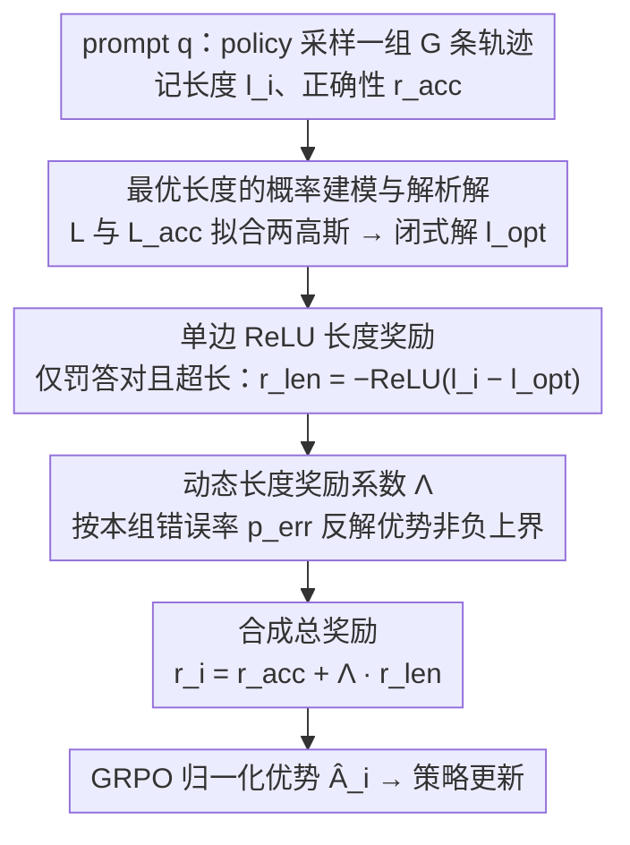

# SmartThinker: Progressive Chain-of-Thought Length Calibration for Efficient Large Language Model Reasoning

**会议**: ICML 2026  
**arXiv**: [2603.08000](https://arxiv.org/abs/2603.08000)  
**代码**: https://github.com/SJTU-RTEAS/SmartThinker (有)  
**领域**: LLM推理 / 强化学习后训练 / 效率优化  
**关键词**: GRPO、CoT 长度校准、动态奖励、过度思考、最优推理长度

## 一句话总结
本文提出 SmartThinker，一种基于 GRPO 的高效推理后训练方法，通过对每个 prompt 的"全部轨迹长度分布"与"正确轨迹长度分布"做高斯建模，解析推导出"使正确率最大的最优长度"$l^{\text{opt}}$，并配合一个动态长度奖励系数 $\Lambda$ 保证正确轨迹的归一化优势非负，从而在最多压缩 52.6% token 的同时把 AIME25 准确率相对提升最多 16.6%。

## 研究背景与动机

**领域现状**：以 OpenAI o1、DeepSeek-R1 为代表的大推理模型（LRM）通过冗长的 chain-of-thought（CoT）取得高准确率，但 CoT 越长，token 消耗与延迟越高，且简单题被"想偏"的风险也越大——即所谓 overthinking。为压缩 CoT，社区主流方案是在 GRPO 基础上加一个鼓励短输出的 length reward，例如 ShorterBetter、ThinkPrune、LASER-DE、L1 等。

**现有痛点**：作者观察到这些方法的 reward 设计是"静态"的，存在两个根本问题。其一，长度奖励 $r_i^{\text{len}}$ 只看自身轨迹的长度，不考虑同组其他轨迹的长度-正确性联合分布，因此无法感知题目当前对该模型的相对难度；其二，长度奖励的权重系数 $\lambda$ 是固定超参，在 GRPO 把奖励减均值归一化后，"长但正确"的轨迹很容易被赋予负优势，与"错误轨迹"无法区分，从而抑制必要的探索。

**核心矛盾**：CoT 长度与正确率呈倒 U 型——存在一个使条件概率 $\Pr(r^{\text{acc}}=1 \mid l, q; \theta)$ 最大的中间长度 $l^{\text{opt}}$，简单粗暴的线性长度惩罚会越过这个最优点、过度压缩；同时静态 $\lambda$ 又破坏了 GRPO 优势符号的语义，让"正确"和"过长"在梯度信号里混在一起。

**本文目标**：在 GRPO 框架内同时解决两件事——（1）如何"按题目难度"动态估计 $l^{\text{opt}}$；（2）如何"按本组准确率"动态调节长度奖励权重，使得所有正确轨迹的优势非负、所有错误轨迹的优势非正。

**切入角度**：利用 GRPO 本身一次 rollout 就有 $G$ 条轨迹这一事实——同组的长度集合 $\mathcal{L}$ 与正确轨迹的长度集合 $\mathcal{L}^{\text{acc}}$ 天然给出两个分布的样本。如果假设二者都近似高斯，就可以用贝叶斯反推 $\Pr(r^{\text{acc}}=1\mid l)$，并解析地求出最优长度。

**核心 idea**：把"想多久"变成一个"按当前 policy 和当前题目动态算出来"的目标，而不是一个超参；同时把"长度惩罚的权重"也动态算出来，保证 GRPO 优势的符号语义不被长度项污染。

## 方法详解

### 整体框架
SmartThinker 在 GRPO 的训练循环里插入两个动态计算步骤。对每个 prompt $q$，policy $\pi_\theta$ 先 rollout 一组 $G$ 条轨迹 $\{o_1,\dots,o_G\}$，记长度 $l_i$、正确性 $r_i^{\text{acc}}\in\{0,1\}$。根据这一组样本：（i）用 $\mathcal{L}$ 与 $\mathcal{L}^{\text{acc}}$ 估计两个高斯分布 $(\hat\mu_1,\hat\sigma_1)$、$(\hat\mu_2,\hat\sigma_2)$，解析求出最优长度 $\hat l^{\text{opt}}$；（ii）按 $\hat l^{\text{opt}}$ 给每条正确轨迹算一个 ReLU 形式的长度惩罚 $r_i^{\text{len}}$；（iii）按本组错误率 $p^{\text{err}}$ 计算长度权重 $\Lambda$；（iv）合成总奖励 $r_i = r_i^{\text{acc}} + \Lambda \cdot r_i^{\text{len}}$，再走标准 GRPO 的归一化优势 $\hat A_i$ 与策略更新。整个机制不需要价值网络、不引入额外采样、可作为 plug-in 嵌到 AutoThink、ThinkPrune 等多阶段框架的某一阶段。

### 关键设计

**1. 最优长度的概率建模与解析解：给 length reward 一个有理论依据的靶子**

以往方法（如 ShorterBetter）直接拿"最短正确轨迹长度"当目标，但那是长度分布的边缘点，逼近它反而掉点。SmartThinker 改去找"使条件正确率最大"的那个长度。它假设同组全部轨迹长度服从 $N(\mu_1,\sigma_1^2)$、其中正确轨迹长度服从 $N(\mu_2,\sigma_2^2)$，套贝叶斯公式就能写出条件正确率 $\Pr(r^{\text{acc}}=1\mid l)$ 关于 $l$ 的解析式。论文进一步证明：当且仅当 $\sigma_1^2>\sigma_2^2$ 时这条曲线存在唯一有限极大点，闭式解为 $l^{\text{opt}} = \frac{\sigma_1^2 \mu_2 - \sigma_2^2 \mu_1}{\sigma_1^2 - \sigma_2^2}$；其余情形分别退化为 $\max(\mathcal L)$ 或 $\min(\mathcal L)$。实际训练里直接用样本均值方差代入，再把结果 clip 到 $[\min\mathcal L, \max\mathcal L]$ 防止外推。

这个靶子最关键的好处是能跟着 policy 对题目的相对难度自动伸缩：简单题正确轨迹普遍偏短、$\hat l^{\text{opt}}$ 跟着偏短，鼓励精炼；难题正确轨迹偏长、$\hat l^{\text{opt}}$ 偏长，给探索留出空间——这正是"按题目难度动态估 $l^{\text{opt}}$"目标的落地。

**2. 基于最优长度的单边 ReLU 长度奖励：只罚"对但太长"**

现有方法常对所有轨迹做对称或线性长度惩罚，结果是答对的长轨迹和答错的长轨迹被同等对待，模型分不清"探索性的长"和"绕远绕错的长"。SmartThinker 把惩罚域精确切到"答对但超出最优长度"这一段：定义 $r_i^{\text{len}} = 0$（若 $r_i^{\text{acc}}=0$），否则 $r_i^{\text{len}} = -\operatorname{ReLU}(l_i - \hat l^{\text{opt}})$。错误轨迹完全不进长度信号，避免"既错又被罚长度"的双重负优势诱导模型去抄错误样本的捷径。

这个设计还自带一个开关：当 $\hat l^{\text{opt}} \geq \max(\mathcal L^{\text{acc}})$、即正确轨迹都没超过最优长度时，全组长度奖励为 0，SmartThinker 自动退化成原版 GRPO，把训练目标切回单纯提升推理能力——构成一种"够短就停止压缩"的按需机制。

**3. 动态长度奖励系数 $\Lambda$：让长度项不污染 GRPO 优势的符号语义**

固定权重 $\lambda$ 的根本毛病是：GRPO 把奖励减均值归一化后，"长但正确"的轨迹很容易拿到负优势，在梯度信号里和"错误轨迹"混成一类。SmartThinker 不再手调 $\lambda$，而是直接从约束反解它。它要求对所有正确轨迹满足 $1+\lambda r_i^{\text{len}} \geq \operatorname{mean}(\boldsymbol r^{\text{acc}} + \lambda \boldsymbol r^{\text{len}})$（即正确轨迹归一化后优势非负），代入 $r_i^{\text{len}}\leq 0$ 解出 $\lambda$ 的可行上界 $\lambda \leq \frac{p^{\text{err}}}{\operatorname{mean}(\boldsymbol r^{\text{len}}) - \min(\boldsymbol r^{\text{len}})}$，其中 $p^{\text{err}}$ 是本组错误率。为最大化压缩效率取上界，即 $\Lambda = \frac{p^{\text{err}}}{\operatorname{mean}(\boldsymbol r^{\text{len}}) - \min(\boldsymbol r^{\text{len}})}$。

这个公式把权重和本组错误率绑在一起，恰好编码出符合直觉的难度感知：错误轨迹越多（题目越难）惩罚越强；全组都答对时 $p^{\text{err}}=0$、$\Lambda=0$，等于自动关掉长度奖励，难题保留探索、简单题大胆压缩，同时彻底免除手工调参。

### 损失函数 / 训练策略
总奖励为 $r_i = r_i^{\text{acc}} + \Lambda(\boldsymbol r^{\text{acc}}, \boldsymbol r^{\text{len}}) \cdot r_i^{\text{len}}$，归一化得 $\hat A_i = (r_i - \operatorname{mean}\{r_j\}) / \operatorname{std}\{r_j\}$，再走标准 GRPO 目标 $\max_\theta \frac{\pi_\theta(o_i\mid q)}{\pi_{\text{old}}(o_i\mid q)} \hat A_i$。基于 verl 实现，batch=64、group=8、minibatch=16、max length=8000、lr $=1\times 10^{-6}$、省略 KL loss；1.5B/7B/4B 分别只训 150/75/50 步。

## 实验关键数据

### 主实验

在 MATH500、AIME25、AMC23 上以三种 base 模型对比静态长度奖励基线（DeepSeek-R1-Distill-Qwen-1.5B 结果）：

| 方法 | Math500 Len/Acc | AIME25 Len/Acc | AMC23 Len/Acc | 平均 Acc | AE↑ |
|------|------------------|-----------------|----------------|----------|-----|
| Base Model | 5420 / 84.9 | 15199 / 24.2 | 9320 / 73.1 | 60.7 | N/A |
| ShorterBetter | 1008 / 71.0 | 3727 / 19.0 | 2246 / 66.9 | 52.3 | 0.07 |
| ThinkPrune-4k | 2744 / 84.1 | 7462 / 22.5 | 4201 / 76.3 | 60.95 | 0.53 |
| LASER-DE-4096 | 2720 / 85.1 | 7706 / 22.5 | 4330 / 71.9 | 59.8 | 0.42 |
| **SmartThinker** | 2645 / 84.5 | 8431 / **25.0** | 4421 / **76.3** | **61.9** | **0.54** |

7B 模型上 AIME25 准确率从 35.0 → 40.8（相对提升 16.6%），Qwen3-4B-Thinking-2507 上平均 token 从 13040 → 7747（压缩 ~41%）的同时平均准确率从 88.5 → 89.0。

### 消融实验

DeepSeek-R1-Distill-Qwen-1.5B 上对两个动态机制做消融：

| 配置 | 平均 Len | 平均 Acc | 说明 |
|------|-----------|----------|------|
| Fixed Coefficient | 3644 | 57.5 | 用固定 $\lambda$，正确长轨迹被错误地拉负优势，准确率掉 4.4 |
| Symmetric | 5530 | 60.2 | 把所有正确轨迹都拉向 $\hat l^{\text{opt}}$，不再单边，压缩反而变弱 |
| Linear | 4242 | 58.2 | 用线性长度奖励替代 ReLU，准确率掉 3.7 |
| **SmartThinker** | 5169 | **61.9** | 单边 ReLU + 动态 $\Lambda$ 同时启用 |

OOD（MMLU、MathQA、LiveCodeBench、HumanEval）上 1.5B 平均长度 5575→3583、Acc 55.78→56.50；4B 长度 5781.5→4231.25、Acc 83.97→84.43——只在数学上训，效率收益迁移到通用任务。

### 关键发现
- 动态长度奖励系数 $\Lambda$ 的贡献最大：去掉后 Fixed Coefficient 平均准确率掉 4.4 个点，说明"保证正确轨迹优势非负"是这套设计能 work 的关键。
- SmartThinker 是表中唯一在所有 base 上一致提升平均准确率的方法，证明"按题动态算靶子长度"避免了静态压缩在难题上的精度损失。
- 训练过程中观察到 $\hat l^{\text{opt}}$ 长期低于实际输出长度，说明 overthinking 普遍存在，且最优长度本身随 policy 动态变化——这反向验证了"必须动态"。
- 作为 plug-in 嵌入 AutoThink/ThinkPrune 的最后阶段，比原方法多阶段训练更短、效果更好（AE 0.55 vs 0.50；0.58 vs 0.54）。

## 亮点与洞察
- **把"该想多久"变成可解析推导的量**：用两个高斯分布 + 贝叶斯反推得到 $l^{\text{opt}}$ 的闭式解，给 length reward 第一次提供了基于条件正确率的理论靶点，而非来自启发式直觉。
- **用本组错误率反解长度权重**：$\Lambda = p^{\text{err}}/(\operatorname{mean}-\min)$ 这个公式直接来自"优势符号约束"的解析解，既消掉了手调超参，又把"题难就重罚长、题简单就轻罚长"的语义编码进权重——这种"从 GRPO 优势的归一化机制反推 reward 形状"的思路可以迁移到任何带辅助奖励的 GRPO 设计。
- **单边 ReLU + 自动退化机制**：$\hat l^{\text{opt}}\geq\max(\mathcal L^{\text{acc}})$ 时长度奖励自动归零、退回原版 GRPO，等价于内置一个"够短就停止压缩、回去继续学正确率"的自适应开关，避免了过度压缩到崩塌。

## 局限与展望
- 高斯假设是高度理想化的：当组内样本很少或长度分布严重多峰时，$\hat\mu,\hat\sigma$ 估计噪声大，$\hat l^{\text{opt}}$ 可能不稳；论文用 clip 到 $[\min\mathcal L,\max\mathcal L]$ 缓解但未根除。
- 只在 GRPO 上验证，对 DAPO、GSPO、SAPO 等 GRPO 变体是否同样可插入未做实证。
- 只能处理可判定正误的任务（数学/代码），对开放式生成、无法定义 $r^{\text{acc}}\in\{0,1\}$ 的场景失效。
- 仍是 outcome-only reward，没有 process reward 监督，无法发现 CoT 内部的细粒度有益模式；作者把"SmartThinker + process reward"列为未来方向。

## 相关工作与启发
- **vs ShorterBetter**：同样在 GRPO 里加 length reward 并按 prompt 动态算目标长度，但 ShorterBetter 直接取"最短正确轨迹长度"作为 target，处于分布边缘易掉点；SmartThinker 改成"使条件正确率最大"的解析极值，鲁棒得多，且对错误轨迹完全不施加长度信号。
- **vs ThinkPrune / LASER-DE**：这两者用 4k/4096 等固定 token 上限作为 budget，本质是"用一个全局阈值切所有题"。SmartThinker 的 $\hat l^{\text{opt}}$ 是 per-prompt、per-step 自适应的，因此在难题（AIME25）上不会过度压缩。
- **vs L1 / AutoThink 等多阶段方法**：L1 在 prompt 里直接 condition 期望长度，AutoThink 用多阶段课程逐级压缩；SmartThinker 是单阶段、即插即用，论文实验显示替换 AutoThink 的 stage3 反而效果更好，提示"动态 reward 设计"可能优于"多阶段课程"。

## 评分
- 新颖性: ⭐⭐⭐⭐ 把"最优 CoT 长度"建模成两个高斯的条件概率极值并解析求解，是相对干净且首次给出的理论 framing。
- 实验充分度: ⭐⭐⭐⭐ 三个 base 模型 + 三个数学 benchmark + 四个 OOD 任务 + 两种多阶段框架插入 + 三种 reward 配置消融，覆盖面足够。
- 写作质量: ⭐⭐⭐⭐ 动机—理论—算法—实验的逻辑链清晰，Section 2.3 把"静态"问题拆成两类讲得很到位。
- 价值: ⭐⭐⭐⭐ 设计可作为现有 GRPO 长度压缩方法的 drop-in 替换，最大压缩 52.6% 同时不掉点甚至涨点，对工程部署直接有用。

<!-- RELATED:START -->

## 相关论文

- [\[AAAI 2026\] Incorporating Self-Rewriting into Large Language Model Reasoning Reinforcement](../../AAAI2026/llm_reasoning/incorporating_self-rewriting_into_large_language_model_reasoning_reinforcement.md)
- [\[ICLR 2026\] Training Large Reasoning Models Efficiently via Progressive Thought Encoding](../../ICLR2026/llm_reasoning/training_large_reasoning_models_efficiently_via_progressive_thought_encoding.md)
- [\[ICML 2026\] DecepChain: Inducing Deceptive Reasoning in Large Language Models](decepchain_inducing_deceptive_reasoning_in_large_language_models.md)
- [\[ICML 2026\] On the Generalization Gap in Self-Evolving Language Model Reasoning](on_the_generalization_gap_in_self-evolving_language_model_reasoning.md)
- [\[ICML 2026\] GRPO is Secretly a Process Reward Model](grpo_is_secretly_a_process_reward_model.md)

<!-- RELATED:END -->
