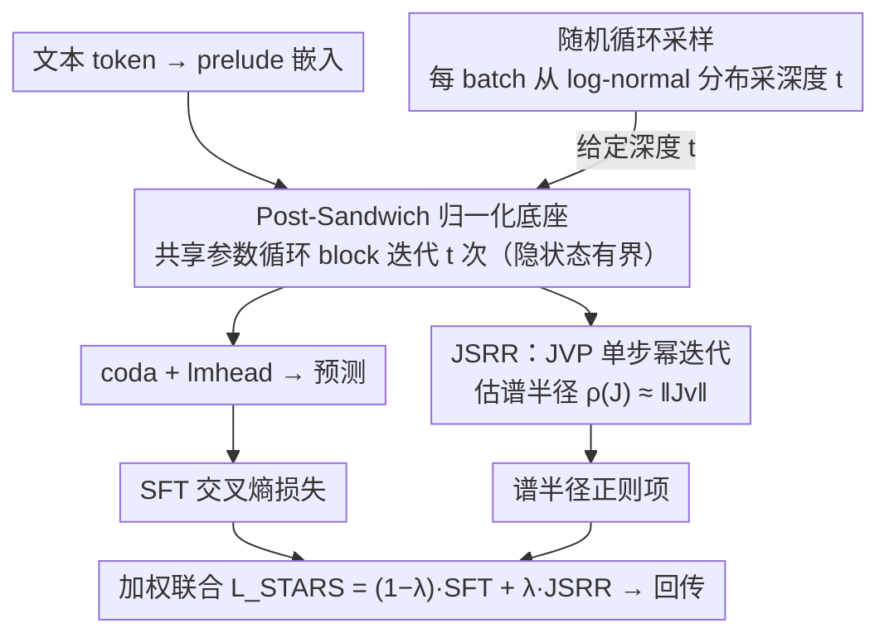

# Stabilizing Recurrent Dynamics for Test-Time Scalable Latent Reasoning in Looped Language Models

**会议**: ICML 2026  
**arXiv**: [2605.26733](https://arxiv.org/abs/2605.26733)  
**代码**: https://github.com/njuyxw/STARS (有)  
**领域**: LLM 推理 / 潜在推理 / 循环 Transformer  
**关键词**: Looped LM、Test-time Scaling、Jacobian 谱半径、动力系统稳定性、随机循环采样

## 一句话总结
本文从动力系统视角诊断 Looped Language Model (LoopLM) 在 test-time 扩展深度时"先涨后崩"的根因——归一化位置导致的"稳定—有效"二元困境，并提出 STARS：用 Jacobian 谱半径正则化 (JSRR) + 随机循环采样把潜在轨迹拉向"渐近稳定的有效不动点"，在 GSM8K 上把 8 步循环的性能跌幅从 20.47% 压到 8.26%，同时峰值提升 4.01%。

## 研究背景与动机

**领域现状**：LLM test-time scaling 的主流路径是显式扩展输出长度（CoT、多采样投票、ToT、MCTS），但这些都受限于自然语言序列的带宽和效率。近年兴起的 Looped Language Models (LoopLM, 例如 Huginn、Ouro) 走另一条路：通过对同一组共享参数的 Transformer block 进行深度递归，把"思考"放进连续潜空间，理论上迭代越多次表征越精炼，且不需扩长 context。

**现有痛点**：作者发现这种"想得越久越准"的假设并不成立。在 GSM8K 上 Ouro-1.4B 的准确率在某个迭代深度达到峰值后会"急剧崩塌"——直接 SFT 后峰值更高，但 8 步时从 70.46% 跌到 52.97%。这意味着 LoopLM 并没有真正学到"可扩展的潜在推理能力"，只是过拟合了训练时使用的固定迭代深度。

**核心矛盾**：作者从动力系统视角做诊断实验，把循环 block 看成一个离散时间映射 $\mathbf{h}^{(t+1)}=\Phi_\theta(\mathbf{h}^{(t)})$，发现 LoopLM 存在一个被忽略的根本性二元困境——**有效性与稳定性由 LayerNorm 的位置决定，且二者不可兼得**：
- **内部归一化**（Pre-Norm / Pre-Sandwich）：残差跳过归一化，信息高速公路畅通（有效），但更新向量直接累加到 backbone 上，隐状态范数随迭代指数级膨胀，轨迹偏离数据流形 → 性能崩塌。
- **外部归一化**（Post-Norm / Post-Sandwich）：归一化包住残差，隐状态有界（稳定），但推理浅，训练时性能就上不去。

作者还系统验证了常见补救手段——加 Prelude/Coda 非循环层、L2 正则、随机循环采样——**都无法同时破解这个 deadlock**。

**本文目标**：让 LoopLM 真正具备 test-time scalable 的潜在推理能力，即：迭代越深，潜在状态越收敛、性能越稳健。

**切入角度**：作者把"推理"概念化为"不确定性的迭代消减过程"。从动力学语言讲，这意味着隐状态应该收敛到一个既"稳定"（不发散、不振荡）又"有效"（停在能解出题的位置）的不动点。光稳定不行（思想浅），光有效不行（思维混乱）。

**核心 idea**：用 Lyapunov 线性化定理——不动点的稳定性由 Jacobian 谱半径决定——把"渐近稳定"显式写成训练时的正则项 $\rho(J) < 1$，再用随机循环采样把约束推广到整条轨迹，从而让模型自己学会收敛到"既稳又准"的不动点。

## 方法详解

### 整体框架

STARS (STAbility-driven Recurrent Scaling) 是一个套在任意已有 LoopLM 上的训练框架（论文用 Ouro-1.4B 做 fine-tune），它的核心主张是：要让"迭代越深越准"成立，得在训练时把循环映射逼成一个渐近稳定的吸引子。整条 pipeline 和标准 LoopLM 训练几乎一样——文本 token 经 prelude 嵌入后进入共享参数的循环 block $\Phi_\theta = \mathcal{M}^L$，迭代 $t$ 次再过 coda + lmhead 输出；唯一改动落在损失上：每个 batch 先从一个 log-normal 分布 $\mathcal{P}$ 随机采一个循环深度 $t$，再在该深度同时算标准 SFT 交叉熵 $\mathcal{L}_{SFT}^{(t)}$ 和 Jacobian 谱半径正则 $\mathcal{L}_{JSRR}^{(t)}$，加权回传。推理阶段零额外开销，照常按所需迭代数前向即可。

### 关键设计

**1. 动力系统诊断与 Post-Sandwich 归一化底座：先选对架构再谈优化**

在动手改训练之前，作者先回答一个更根本的问题——哪种架构本身就有"被救活"的潜力。他们在 4 位加法这个完全可控的小实验上，把 12 种归一化结构（LayerNorm / RMSNorm / SimpleNorm × Pre / Post / Pre-Sandwich / Post-Sandwich）穷举训练，再用 PCA 把潜在轨迹投影出来，同时看轨迹"尺度"和准确率随测试迭代数 $T_{test}$ 的演化。结论很干净：决定动力学的是归一化的**位置**而非**类型**——内部归一化（Pre / Pre-Sandwich）系列轨迹尺度在 PCA 图上直接 explode，隐状态范数指数膨胀冲出数据流形；外部归一化（Post / Post-Sandwich）系列轨迹紧凑有界，却又推理太浅、准确率撑不到测试期。更关键的是 Prelude/Coda 非循环层、L2 正则、随机循环采样这些常见补救手段单独用时都破不了这个 deadlock。正因如此，STARS 把底座定在 **Post-Sandwich LayerNorm** 上：它天然有界、容易收敛到吸引子，剩下要做的只是再主动注入一道"让吸引子落在有效位置"的引导。这一节本身就是论文最有价值的负面结果，它把后续方法牢牢约束在"以外部归一化为底座、显式补稳定性约束"这条唯一可行的路上。

**2. Jacobian 谱半径正则化（JSRR）：用 Lyapunov 条件把不动点压到渐近稳定侧**

外部归一化解决了"有界"，但吸引子未必落在能解题的位置，这一项就是要在训练时显式压低循环映射 $\Phi_\theta$ 的 Jacobian 谱半径 $\rho(J)$，把收敛点拉向"渐近稳定且有效"。理论依据是 Lyapunov 线性化定理：离散系统 $\mathbf{h}^{(t+1)}=\Phi_\theta(\mathbf{h}^{(t)})$ 在不动点 $\mathbf{h}^\star$ 处的局部稳定性由谱半径 $\rho(J(\mathbf{h}^\star)) = \max_i |\lambda_i|$ 决定，只要 $\rho<1$ 就保证小扰动指数衰减、迭代收敛。难点在于 $J\in\mathbb{R}^{D\times D}$（$D=M\cdot d$）维度巨大、直接求特征值不可行，作者改用**单步幂迭代 + Jacobian-vector product (JVP)**：随机初始化向量 $\mathbf{v}$，用 PyTorch 的 JVP 直接算 $J\mathbf{v}$ 而无需显式构造 $J$，把谱半径估成 $\rho(J)\approx \|J\mathbf{v}\|_2$，正则项即 $\mathcal{L}_{JSRR}^{(t)} = \frac{1}{N}\sum_i \|J^{(t,i)} \mathbf{v}^{(t,i)}\|_2^2$；由于训练时真不动点 $\mathbf{h}^\star$ 未知，索性用当前迭代 $t$ 的隐状态 $\mathbf{h}^{(t)}$ 作代理点算谱半径。之所以直接管谱半径而不像 DEQ (Bai 2019, 2021) 那样正则 Frobenius 范数 $\|J\|_F$，是因为 $\rho(J)\le\|J\|$ 只是宽松上界，压 $\|J\|$ 会连带过度压缩模型表达力，而管谱半径数学上精确、只挤压"最不稳定"那条主方向；选单步而非多步幂迭代，则是因为多步会引入容易爆炸的二阶梯度依赖，单步虽单样本噪声大、但 batch 平均后优化方向统计正确，且显存与计算几乎零额外开销。

**3. 随机循环采样 × JSRR：把单点稳定性推广成整条轨迹的全局约束**

只在某一个深度 $t$ 上压谱半径，并不能保证更深的迭代也收敛，而且模型还会过拟合那个固定训练深度——这一项就是把约束"撒"到整条轨迹上。每个 batch 都从分布 $\mathcal{P}$（论文取 log-normal $\mu=1.7, \sigma=0.4$、range $[1,16]$）随机采一个循环步数 $t$，再按 $\mathcal{L}_{STARS} = \mathbb{E}_{t\sim\mathcal{P}}[(1-\lambda)\cdot\mathcal{L}_{SFT}^{(t)} + \lambda\cdot\mathcal{L}_{JSRR}^{(t)}]$ 联合优化（$\lambda=0.1$）。这样 SFT 项覆盖各种深度、不再绑死单一 $T_{train}$，JSRR 项也随之把谱半径约束施加到 $\mathcal{P}$ 支撑集的每一个深度上。两件事缺一不可：诊断实验显示单纯随机循环采样虽能让性能在训练范围外多撑一阵，却拦不住内部归一化的状态漂移、也保证不了外部归一化的吸引子是"有益"的；单点 JSRR 又管不到更深的迭代。只有把"局部稳定性"和"全局轨迹覆盖"叠在一起，才真正凑齐"全程有界 + 全程有效"的统一约束。

### 损失函数 / 训练策略

最终训练目标（公式 4）：

$\mathcal{L}_{STARS} = \mathbb{E}_{t\sim\mathcal{P}}\left[(1-\lambda)\cdot\mathcal{L}_{SFT}^{(t)} + \lambda\cdot\mathcal{L}_{JSRR}^{(t)}\right]$

数学推理实验中：基于 Ouro-1.4B 在 NuminaMath-1.5 的 400K 子集上 fine-tune 1 epoch，4×A800 + AdamW + cosine schedule + 起始 lr $1\times10^{-6}$；随机循环 log-normal $\mu=1.7, \sigma=0.4$, range $[1,16]$，$\lambda=0.1$。加法实验则用 log-normal $\mu=2, \sigma=0.7$, range $[1,100]$，lr $1\times10^{-4}$。

## 实验关键数据

### 主实验（数学推理，Ouro-1.4B fine-tune）

| 模型 | 循环步数 | GSM8K | MATH500 | ASDiv | SVAMP | AMC23 | 平均 |
|------|---------|-------|---------|-------|-------|-------|------|
| Ouro-1.4B (base) | 4 | 75.21 | 59.60 | 76.57 | 75.67 | 50.00 | 67.41 |
| Ouro-1.4B (base) | 8 | 58.23 | 40.80 | 70.07 | 66.33 | 40.00 | 55.09 |
| Ouro-1.4B-SFT | 4 | 80.06 | 64.60 | 83.47 | 76.67 | 47.50 | 70.46 |
| Ouro-1.4B-SFT | 8 | 60.05 | 39.20 | 75.10 | 68.00 | 22.50 | 52.97 |
| **Ouro-1.4B-STARS** | 4 | **81.96** | **67.40** | **84.73** | **84.33** | **52.50** | **74.18** |
| **Ouro-1.4B-STARS** | 8 | 74.45 | 54.80 | 82.52 | 81.00 | 35.00 | 65.55 |

关键对比：GSM8K 上从峰值（4 步）到 8 步的相对跌幅 Ouro 是 20.47%，SFT 是 25.0%，STARS 只有 8.26%；同时 STARS 的 4 步峰值 81.96% 比 SFT 还高 1.90%。多位加法任务上 STARS 在 4–100 步范围内准确率稳定 100%。

### 消融实验（Figure 4 右图，4 个数学 benchmark 平均）

| 配置 | 趋势特征 |
|------|---------|
| Ouro-1.4B (base) | 4 步后急剧下降 |
| + Random Loop only | 下降变缓，但仍有明显衰退 |
| + JSRR only | 下降变缓，与 Random Loop 互补 |
| **Full STARS (RL+JSRR)** | 下降最慢、峰值最高，两者都不可少 |

### 关键发现
- **归一化位置才是 LoopLM 命门**：12 种结构穷举显示归一化类型几乎无影响，但 Pre vs Post 决定潜空间是发散还是收敛；这是论文最值得迁移的洞察。
- **常见补救方案全数失败**：Prelude/Coda 层、L2 正则、纯随机循环采样都无法同时实现稳定与有效，论文用这一连串"负面消融"把读者推向"必须有显式稳定性约束"的结论。
- **JSRR 与 Random Loop 互为补充**：JSRR 给"局部稳定性"，Random Loop 把约束推广到全局轨迹，两者缺一不可，单独使用都不够。

## 亮点与洞察
- **从动力系统视角重审 LoopLM**：把 LoopLM 的"想得越久越差"翻译成"轨迹不收敛到不动点"，并用 PCA 投影把潜在轨迹真的画出来——这种"先做诊断再开药"的范式比直接 propose loss 要可靠得多，整篇论文的说服力很大程度来自第 4 节的可视化。
- **JSRR 用 Lyapunov 借力打力**：把控制论里 70 年代就成熟的稳定性条件直接搬到 Transformer 训练里，再用 JVP 把不可计算的全 Jacobian 谱半径降到 $O(D)$ 的单步幂迭代，工程上几乎零成本。这一招对所有用循环/平衡结构的工作（DEQ、Neural ODE、Universal Transformer）都可以复用。
- **"既稳又准的不动点"是个可推广的设计哲学**：把"推理"形式化为不动点收敛过程，那么所有 latent reasoning / continuous CoT 方法（Coconut、SIM-CoT、CODI 等）都可以用同样的稳定性—有效性二元框架重新审视，谁的潜在状态轨迹更接近收敛，谁就更"想得清楚"。

## 局限与展望
- **代理点而非真不动点**：JSRR 实际约束的是当前迭代 $\mathbf{h}^{(t)}$ 处的谱半径，而非真正不动点 $\mathbf{h}^\star$ 处，理论保证不严格——只能说期望意义下统计正确。
- **只在 1.4B 规模验证**：实验止步于 Ouro-1.4B + 400K NuminaMath 子集 + 1 epoch，没在更大基座或更长循环深度（>16）上验证；8 步以上的衰退也只是变缓，并未根除。
- **8 步处与峰值仍有 8.62 个点的差距**：方法把崩塌延后了但没有完全消除，说明"深度无穷扩展即性能单调上升"这一终极目标尚未达成。
- **改进方向**：将 JSRR 与显式 fixed-point solver（DEQ 式 implicit differentiation）结合、引入二阶幂迭代多步估计、把 $\lambda$ 改为可学习/自适应、把 STARS 推广到 Coconut 等 sequential 形 latent reasoning。

## 相关工作与启发
- **vs Geiping et al. (Huginn) / Zhu et al. (Ouro)**：他们直接训练 LoopLM 并依靠 Prelude/Coda 缓解；本文证明这些非循环层只能"略微减缓"内部归一化系统的漂移、并把外部归一化系统的吸引子变紧但非良性。STARS 在他们的基础上加 JSRR 才真正解决可扩展性。
- **vs DEQ (Bai et al. 2019, 2021)**：DEQ 用 Frobenius 范数 $\|J\|_F$ 正则化平衡模型，但 $\|J\|$ 是 $\rho(J)$ 的宽松上界，会过度压缩表达力；本文直接管谱半径，更精确、对模型干扰更小，且首次把这种思想用到大规模 LoopLLM 上。
- **vs Coconut / SIM-CoT / CODI 等 continuous CoT**：这些方法沿"序列维"扩展潜在表征，本质上仍受 token 生成带宽约束；LoopLM 走"深度维"，STARS 让这条路真正可扩展，二者未来可能结合（在 Coconut 内部把 latent thought block 套上 JSRR）。
- **vs Universal Transformer / Looped Transformer (Giannou et al.)**：早期循环 Transformer 工作多在小规模/理论层面，缺乏稳定性分析；本文用动力系统语言把这一系工作和 DEQ 联通起来，是后续"recurrent depth for reasoning"路线的方法论坐标。

## 评分
- 新颖性: ⭐⭐⭐⭐⭐ 首次用动力系统视角系统诊断 LoopLM scaling 失败，并把 Lyapunov 谱半径以可微方式注入 LLM 训练。
- 实验充分度: ⭐⭐⭐⭐ 4 位加法可控实验 + 5 个数学 benchmark + 12 种归一化结构穷举 + 完整消融，缺规模上推。
- 写作质量: ⭐⭐⭐⭐⭐ 故事线"诊断 → 矛盾 → 哲学 → 方法 → 实验"环环相扣，PCA 可视化和负面结果都用得极好。
- 价值: ⭐⭐⭐⭐⭐ 对所有走"深度循环"路线的 latent reasoning 工作（DEQ、Huginn、Ouro、Coconut）都直接可借鉴，是 LoopLM 走向真正 test-time scalable 的关键一步。

<!-- RELATED:START -->

## 相关论文

- [\[ICML 2026\] Prioritize the Process, Not Just the Outcome: Rewarding Latent Thought Trajectories Improves Reasoning in Looped Language Models](prioritize_the_process_not_just_the_outcome_rewarding_latent_thought_trajectorie.md)
- [\[ICML 2026\] Prism: Efficient Test-Time Scaling via Hierarchical Search and Self-Verification for Discrete Diffusion Language Models](prism_efficient_test-time_scaling_via_hierarchical_search_and_self-verification_.md)
- [\[ACL 2026\] Parallel Test-Time Scaling for Latent Reasoning Models](../../ACL2026/llm_reasoning/parallel_test-time_scaling_for_latent_reasoning_models.md)
- [\[ICML 2026\] Dynamics Within Latent Chain-of-Thought: An Empirical Study of Causal Structure](dynamics_within_latent_chain-of-thought_an_empirical_study_of_causal_structure.md)
- [\[ICLR 2026\] Efficient Test-Time Scaling for Small Vision-Language Models](../../ICLR2026/llm_reasoning/efficient_test-time_scaling_for_small_vision-language_models.md)

<!-- RELATED:END -->
