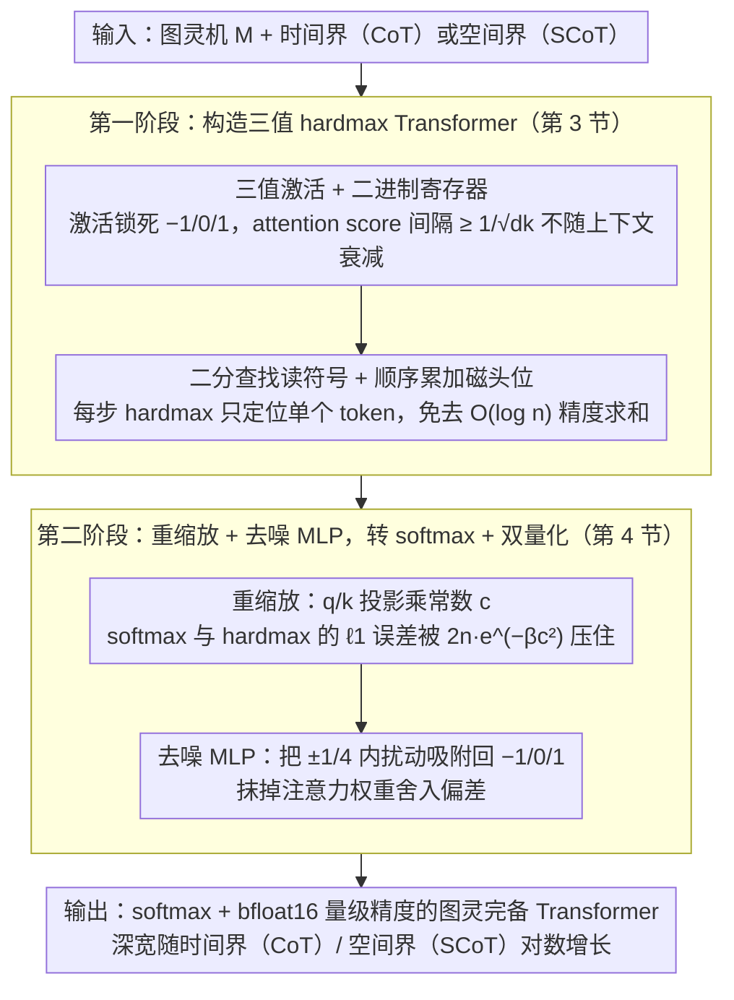

# The Expressive Power of Low Precision Softmax Transformers with (Summarized) Chain-of-Thought

**会议**: ICML 2026  
**arXiv**: [2605.18079](https://arxiv.org/abs/2605.18079)  
**代码**: https://github.com/moritzbroe/transformer-expressivity (有)  
**领域**: LLM 推理 / Transformer 表达力理论  
**关键词**: 低精度 softmax、Chain-of-Thought、图灵机模拟、三值激活、Summarized CoT

## 一句话总结
本文首次证明：使用 softmax 注意力 + bfloat16 量级精度（激活与注意力权重都四舍五入）的标准 Transformer 解码器，只要深度、宽度对数地随上下文增长，就能借助 CoT 模拟任意图灵机；并进一步证明 Summarized CoT 把规模从时间界 $\hat{t}$ 降到空间界 $\hat{s}$，且在 Sudoku 任务上实测发现"加深度而不是加精度"才是 CoT 长上下文失败的真正解药。

## 研究背景与动机

**领域现状**：Transformer 表达力理论已经证明它能模拟图灵机，但代价是模型与现实严重脱节——主流构造（Merrill & Sabharwal 2024；Yang et al. 2025）都依赖 hardmax 注意力 + 至少 $\mathcal{O}(\log \hat{t})$ 的激活精度，部分还引入非标准位置编码。

**现有痛点**：现代 LLM 普遍用 softmax 注意力 + bfloat16/int8 精度，且通过加深加宽提升能力。理论里的"对数精度 + 常数深宽"和实践里的"常数精度 + 对数深宽"完全是两个方向，理论结果对实践几乎没有预测力。

**核心矛盾**：硬把已有 hardmax 构造改成 softmax，需要把 query/key 投影乘上一个常数 $c$ 使 softmax 尖锐化逼近 hardmax；但已有构造里 attention scores 的间隔 $\beta$ 随序列长度多项式衰减，导致 $c$ 也得多项式增长——参数幅度爆炸，破坏"uniform"性质，更别提还要 $\mathcal{O}(\log \hat{t})$ 精度才能存住这种数。

**本文目标**：构造一个真正贴合实践的 Transformer 模型——softmax 注意力、bfloat16 量级精度、参数幅度温和——证明它依然图灵完备；同时回答 CoT 与 SCoT 各自需要多少深度/宽度/精度。

**切入角度**：与其在已有 hardmax 构造上贴补丁，不如**从头构造一类"易于 softmax 化"的 hardmax Transformer**：激活全部限制在 $\{-1, 0, 1\}$（三值），attention scores 间隔不随上下文衰减（始终 $\geq 1/\sqrt{d_k}$），这样温和的 $c = \mathcal{O}((\log \hat{l})^{3/4})$ 就够把 softmax 误差压住。

**核心 idea**：用"三值激活 + 二进制位置寄存器 + 二分查找读符号"代替"对数精度的浮点累加"，使 hardmax→softmax 转换的代价降到对数级别；并对 SCoT 范式也走同一套构造路径。

## 方法详解

整篇论文是个两段式构造证明加一组小型实证：先给出一个激活全为三值的 hardmax Transformer（第 3 节），再用统一的"重缩放 + MLP 去噪"机制把它无损转成带精度量化的 softmax 版本（第 4 节），最后训小 Transformer 解 Sudoku 来验证理论对建模选择的预测（第 5 节）。

### 整体框架

给定一台多带图灵机 $M$ 和一个时间界 $\hat{t}$（或空间界 $\hat{s}$），第一阶段构造 hardmax Transformer $T$：激活全限制在 $\{-1,0,1\}$，深宽随 $\mathcal{O}(\log \hat{t})$ 增长，能用 CoT/SCoT 在 $\mathcal{O}(t_M(w)+|w|)$ 步内输出 $f_M(w)$；第二阶段把 $T$ 的 query/key 投影乘上常数 $c$、将 hardmax 换成 softmax，再插入去噪 MLP 抹掉注意力权重舍入引入的偏差，得到对所有合法输入都与 $T$ 输出完全一致的 softmax 版 $\tilde T_c$。最终的精度账是 $c = \mathcal{O}((\log \hat{l})^{3/4})$、激活指数位 $\mathcal{O}(\log\log\log \hat{l})$、注意力权重指数位 $\mathcal{O}(\log\log \hat{l})$，意味着 bfloat16 在 $\hat{l} \approx 10^{38}$ 之前都够用。CoT 与 SCoT 的差别只在第二阶段喂的 bound：CoT 全靠时间界 $\hat{t}$、整条解码序列都挤在同一上下文里；SCoT 允许写 `<summ>...</summ>` 块作"中断点"，每段非汇总区长度只 $\mathcal{O}(s_M(w))$，所以模型尺寸随空间界对数增长，对 Sudoku 这种"空间小但时间大"的任务收益巨大。

### 关键设计

**1. 三值激活 + 二进制寄存器：让 attention score 间隔不随上下文衰减**

构造的第一步是把图灵机配置（状态、磁头位、磁带符号）全编码进 $\{-1,0,1\}^d$ 的残差流：每个隐藏维度承担明确语义——若干位是位置寄存器（绝对 token 位置加各带磁头位的二进制表示），若干位是状态/符号 one-hot，若干位是区分 token 类型的 flag；MLP 在 ternary 域内做拷贝、清零、加一减一等位运算，attention 负责从历史 token 抽寄存器，位置编码也换成二进制（每位频率几何递减，类似正弦但摆脱了对精度的依赖）。把激活锁死在三个点是整条路线的命门：一旦激活只能取 $\{-1,0,1\}$，无论上下文多长，attention scores 的初始间隔 $\beta \geq 1/\sqrt{d_k}$ 都不会被序列长度稀释，这正是后面 softmax 化只需温和的 $c = \mathcal{O}((\log \hat{l})^{3/4})$ 而非多项式增长的根本原因；同时去噪 MLP（设计 3）只有在 ternary 三个离散点上才能做"硬吸附"，换成任意连续激活集就不可行。

**2. 二分查找读符号 + 顺序累加磁头位：把"全局求和"换成"对数次定位"**

hardmax 模式下每生成一个 run token 都要回答"当前磁头位上最近一次写的符号是什么"。本文的做法是每隔 $r$ 个 run token 插入一个 `
...
` 块显式写出磁头当前坐标，token 内部用顺序层逐位累加磁头移动 $\{L,S,R\}$；读符号则在 $r=\mathcal{O}(\log \hat{t})$ 层里做二分查找，每层用 hardmax 裁掉一半候选历史 token，最终锁定"最近一次写入该坐标"的那个 token 并把符号 attention 回来。这与 Merrill & Sabharwal 2024 用"对历史 token 做均匀 attention 求和再除以 $n$"的思路形成鲜明对比——后者要 $\mathcal{O}(\log n)$ 精度才能存住 $1/n$；二分查找每次定位只 hardmax 选一个 token，attention scores 间隔始终不衰减，这正是 ternary 路线在微观层面跑得通的原因。

**3. 重缩放 + 去噪 MLP：hardmax→softmax 的无损桥梁**

把 hardmax 构造转成 softmax 加双量化版本时，先给所有 query/key 投影乘 $c$，使 softmax 与 hardmax 输出的 $\ell_1$ 误差被 $2n e^{-\beta c^2}$ 控制；仅做激活舍入时（Theorem 4.1），ternary 值在浮点格式里可精确表示、扰动后再舍入最多翻倍，端到端可控。麻烦在于真实 attention 权重 $\alpha_{ij}$ 形如 $1/k$（多 token 命中时的均分），无论 $c$ 多大都没法精确浮点表示——本文于是在每层注意力后插入一个坐标级去噪 MLP：它实现一个分段函数 $f$，把落在 $(-\tfrac{5}{4},-\tfrac{3}{4}),(-\tfrac{1}{4},\tfrac{1}{4}),(\tfrac{3}{4},\tfrac{5}{4})$ 内的任意值经 $x \mapsto x+f(x)$ 吸附回 $-1,0,1$，只要 attention 引入的误差压在 $\pm 1/4$ 内，下一层看到的激活就跟 hardmax 完全一致。正是这个 MLP 把注意力权重的精度需求从线性增长压到 $\mathcal{O}(\log\log \hat{l})$，而它能成立又恰好依赖设计 1 的 ternary 约束——若激活值域线性增长，去噪 MLP 自身规模也线性增长、整条路线坍塌（这就是 Merrill & Sabharwal 2024 / Yang et al. 2025 走不通这条路的原因）。

### 训练策略
理论部分无训练。实证部分（Section 5）训练小 Transformer 模仿一个确定性 MRV 深度优先搜索 Sudoku 求解器：用 sudoku-extreme 数据集（约 400 万题），SCoT 每段 512 个非汇总 token、汇总块编码求解器完整配置；20B token 训练，bfloat16 混合精度，温度 0 贪心解码，输出正确解才算对。

## 实验关键数据

### 主实验：小模型在 SCoT vs CoT 下的可学习性

**SCoT 模型尺寸扫描**（$d=512$, $H=8$，random 10k 测试子集准确率）：

| Depth $L$ | 4 | 5 | 6 | 7 | 8 |
|-----------|---|---|---|---|---|
| Acc (%) | 16.3 | 97.2 | 99.5 | 99.7 | 99.6 |

性能在 $L=6$ 处饱和；同尺寸 CoT 模型在 $N=2^{14}$ 训练上下文下，远未到长度上界就准确率塌方。

### 关键对照：加深度 vs 加精度（破解 CoT 长上下文失败）

| 设置 | 最大训练上下文 $N$ | 现象 | 一句话结论 |
|------|-------------------|------|------------|
| $L=6$, bf16 (baseline) | $2^{14}$ | CoT 远未到 $N$ 就失败 | 模型不够大 |
| $L=8$, bf16 | $2^{14}$ | CoT 全程稳定 | **加深度有效** |
| $L=6$, **fp32** | $2^{14}$ | 与 bf16 几乎重合，仍失败 | **加精度无效** |

### 长尾泛化（SCoT 独有）
更大的 SCoT 模型（$d=768, L=12, H=12$）只在 $N \leq 2^{12}$ 上训练，却能在 10k 测试集达到 99.96%，并解出 100 题最难 Sudoku 中的 92 题——这些题各自需要 100 万到 900 万 CoT token，远超训练长度。

### 关键发现
- **理论给出的可学习性预测胜过对数精度结果**：对数精度理论建议"加精度"，本文理论建议"加模型尺寸"；实测明确支持后者。这是首次把表达力理论的"模型选择含义"做了实证验证。
- **SCoT 的空间界优势在实操层面真实存在**：因 Sudoku 求解算法空间需求恒定与难度无关，SCoT 模型一旦在中等长度上学会算法，就能外推到 9 个数量级以上的总 token 数。
- **bfloat16 与 fp32 在长上下文 CoT 上无差异**，与社区"混合精度基本不掉点"的经验吻合，但本文给出了首个理论侧的解释路径。

## 亮点与洞察
- **"易于 softmax 化的 hardmax 构造"这一构造哲学非常巧妙**：与其在已有构造上打补丁应付 softmax，不如反向设计——让 hardmax 构造自带"恒定 attention score 间隔"，softmax 化的成本就降到对数。这种"为转换而设计原型"的思路在很多理论-实践桥接问题里都可以复用。
- **去噪 MLP 是把"连续噪声"截断为"离散符号"的标准抽象**：只要把状态空间限制在离散小集合（ternary），就总可以用一个固定规模的 MLP 吸附扰动。这一技巧（Wei et al. 2022a 已用过）在本文里被放到了 attention 权重舍入的关键位置，是表达力证明能闭环的最后一块砖。
- **理论结果第一次对"加深 vs 加精度"给出可证伪的预测，并被实验证伪/支持**：表达力理论长期被诟病"不可证伪"，本文做了一个干净的对照实验，把抽象的 $\mathcal{O}(\log \hat{t})$ 翻译成具体的"depth $L=6$ vs $L=8$"以及"bf16 vs fp32"，是表达力理论方法论上的一次升级。
- **稀疏注意力的"理论合法性"**：Section 4.3 顺手证明 1-sparse attention 不损失表达力，给 Reformer/Unlimiformer 这类 MIPS-based sparse attention 提供了表达力背书。

## 局限与展望
- **作者承认**：表达力 $\neq$ 可学习性。即便对数深宽 + bfloat16 足够"能表达"，能否被 SGD 找到仍是开放问题；正则语言学习就是个反例（Liu et al. 2023 显示 automaton 任务很难训）。
- **构造尚未达到完全 uniform**：深宽随 $\hat{t}/\hat{s}$ 对数增长，理论上还不如 Merrill & Sabharwal 2024 的"常数深宽 + 对数精度"那样"参数与输入完全解耦"；不过本文已经讨论 RoPE 能在双对数精度内重建二进制位置编码，向实践再迈一步。
- **实证只覆盖 Sudoku 一个任务**：算法虽然典型，但与自然语言推理差异很大；SCoT 的"恒定段长泛化"是否在 LLM 真实推理任务（数学、代码）上仍然成立，缺乏直接证据。
- **改进思路**：把同样的"加深度替代加精度"对照实验推到 GSM8K / MATH / 长链代码生成，验证理论预测在 LLM 主战场是否依旧成立；另外可以研究本文构造对 MoE / 线性 attention 的迁移性。

## 相关工作与启发
- **vs Merrill & Sabharwal 2024**：他们用常数深宽 + $\mathcal{O}(\log \hat{t})$ 精度 + hardmax；本文用对数深宽 + $\mathcal{O}(\log\log \hat{t})$ 精度 + softmax。两者均能模拟图灵机，但本文模型更接近实践，且对 long-context 失败给出不同的补救建议。
- **vs Yang et al. 2025 (SCoT)**：同样在 SCoT 框架下做表达力证明，Yang 用 hardmax + 对数精度，本文用 softmax + 双对数精度，且证明深宽必须对数增长才能维持 ternary 激活的优势。
- **vs Li et al. 2024**：同样使用对数宽度做位置编码（与本文同方向），但他们需要任务特定的位置编码，导致参数数量超线性增长；本文用通用二进制位置编码 + RoPE 兼容，参数仅 $\mathcal{O}((\log \hat{l})^3)$。
- **vs Jiang et al. 2026**：目前唯一另一个"真正 uniform softmax 图灵完备"的结果，但代价是指数级慢下来 + 线性精度，本文以 log 级深宽换取实际可行的精度，路径不同。
- **启发**：理论侧"为转换设计原型"的思路可用于"高精度训练 → 低精度部署"的模型蒸馏；实证侧"加深度替代加精度"对 long-context LLM 设计有直接指导意义。

## 评分
- 新颖性: ⭐⭐⭐⭐⭐ 首个匹配实践精度的图灵完备构造，且把 SCoT 范式纳入统一理论框架
- 实验充分度: ⭐⭐⭐⭐ Sudoku 实验干净有力但单一任务，自然语言推理上尚缺验证
- 写作质量: ⭐⭐⭐⭐⭐ 主定理表格直接给出与所有前作的渐近对照，"构造 outline + 关键技术点"的写法非常清晰
- 价值: ⭐⭐⭐⭐⭐ 把"表达力理论"和"实际模型设计选择"之间的桥真正打通了，且给出可证伪的预测

<!-- RELATED:START -->

## 相关论文

- [\[NeurIPS 2025\] Exact Expressive Power of Transformers with Padding](../../NeurIPS2025/llm_reasoning/exact_expressive_power_of_transformers_with_padding.md)
- [\[ICML 2026\] Clustering as Reasoning: A $k$-Means Interpretation of Chain-of-Thought Graph Learning](clustering_as_reasoning_a_k-means_interpretation_of_chain-of-thought_graph_learn.md)
- [\[NeurIPS 2025\] A Little Depth Goes a Long Way: The Expressive Power of Log-Depth Transformers](../../NeurIPS2025/llm_reasoning/a_little_depth_goes_a_long_way_the_expressive_power_of_logde.md)
- [\[ICML 2026\] How Far Ahead Do LLMs Plan? Uncovering the Latent Horizon in Chain-of-Thought Reasoning](how_far_ahead_do_llms_plan_uncovering_the_latent_horizon_in_chain-of-thought_rea.md)
- [\[ICML 2026\] A Formal Comparison Between Chain of Thought and Latent Thought](a_formal_comparison_between_chain_of_thought_and_latent_thought.md)

<!-- RELATED:END -->
