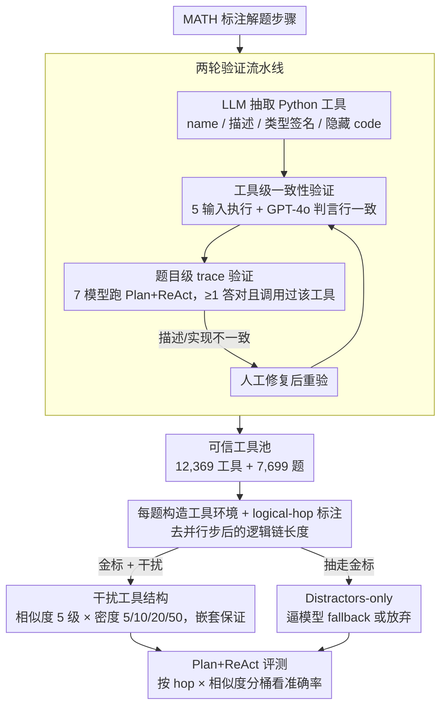

# ToolMATH: A Math Tool Benchmark for Realistic Long-Horizon Multi-Tool Reasoning

**会议**: ICML 2026  
**arXiv**: [2602.21265](https://arxiv.org/abs/2602.21265)  
**代码**: 无  
**领域**: LLM Agent / 工具使用基准  
**关键词**: 工具调用评测, 长程多工具推理, 干扰工具, 工具缺失场景, Plan+ReAct

## 一句话总结
作者把 MATH 数据集的人工标注解题步骤逐步翻译成"带描述与类型签名的可复用 Python 工具"，构造出含 8K 题 + 12K 工具的 ToolMATH 基准；它同时覆盖长程多工具组合（hop 1-8+）、可控的干扰工具相似度（5 级 × 4 种密度）、以及"金标工具被全部移除"的工具缺失场景，验证显示模型失败的主导因素不是工具选择而是推理本身——thought error 占 90%+，而干扰工具会把早期的小偏差放大成不可逆的执行漂移。

## 研究背景与动机
**领域现状**：工具增强 LLM (tool-augmented LLM) 已经成为标准 agent 范式，从 Toolformer、Gorilla 到 BFCL、ToolLLM 一系列工作把 function calling 标准化。但已有 benchmark 大多在两个轴里抓 1-2 个：(i) 标准化 schema 比较 (BFCL)、(ii) 工具不可用下的鲁棒性 (Treviño et al. 2025)、(iii) 工具控制接口 (ReAct/DFSDT)、(iv) 工具依赖图构造 (TaskBench)。

**现有痛点**：现实部署里 agent 面对的是"巨大且语义重叠的工具目录 + 长程多步依赖 + 偶尔缺失关键能力"的复杂联合场景，但还没有一个 benchmark 在**单一可自动验证**的任务上同时覆盖这三个维度。已有数学推理 benchmark（GSM8K、MATH）有客观对错可验证但没有工具维度；已有工具 benchmark 多用人工对错评判或缺乏长程依赖。

**核心矛盾**：要同时具备 (i) **客观自动可验证**（不靠 LLM judge）、(ii) **天然长程依赖**（步骤前后耦合）、(iii) **可控干扰工具结构**、(iv) **可受控的工具缺失场景**——四个特性同时满足才能精确剖析 agent 失败模式。MATH 的逐步解题恰好提供：每步可抽出成 Python 工具，步骤逻辑硬耦合，答案可机器判定。

**本文目标**：(i) 把 MATH 解题步骤转化为可复用工具，构造长程组合任务；(ii) 设计干扰工具采样策略与"缺失工具 (Distractors-only)"环境，可控变化干扰相似度和密度；(iii) 通过工具级 + 题目级两轮验证 + 人工审核保证 benchmark 信度；(iv) 用 hop count 把长程难度从干扰难度里解耦出来。

**切入角度**：把数学的"步骤逻辑链"作为天然工具组合脚手架——每步对应一个 Python 实现 + 自然语言描述 + 类型签名，模型只能看到描述与 schema、看不到代码。这样错一步全错的特性让"长程推理失败"和"工具选择失败"都能放大暴露。

**核心 idea**：用 MATH 的步骤-工具映射 + 干扰工具 + 缺失工具三种独立维度，构造一个能同时剖析"工具选择 / 长程规划 / 缺工具回退"的 benchmark。

## 方法详解

### 整体框架
ToolMATH 把"数学逐步解题"当成天然的工具组合脚手架来用，全流程分两阶段。第一阶段是**工具抽取与验证**：把 MATH 标注的每一步解题动作喂给 LLM，让它吐出一批小的 Python 函数（含 name、description、typed input schema、code），再经过工具级和题目级两轮自动验证 + 人工修复，沉淀出可信的工具池。第二阶段是**工具化评测**：给每道题 $p$ 配一个环境，里面既有金标工具集 $\mathcal G(p)$，又掺入从全局池采样的干扰工具 $\mathcal D_{\ell,k}(p)$（相似度 5 级、密度 $k\in\{5,10,20,50\}$）；另设 Distractors-only 模式直接抽走 $\mathcal G(p)$，逼模型在没有趁手工具时回退。每题还独立标注一个 hop count，把"长程难度"从"干扰难度"里解耦出来。模型只看得到工具描述与 schema、看不到实现代码，所以错一步往往全错，长程推理与工具选择的失败都会被放大暴露。

### 关键设计

**1. MATH 步骤 → 可复用工具的两轮验证流水线：把人工解题步骤变成可信工具池，而不是 benchmark 噪声**

如果只是让 LLM 把解题步骤随手翻译成函数，很容易混进"描述对但行为错"或"根本没人会调用"的脏工具，污染整个评测。作者用两道关卡过滤：**工具级一致性验证**给每个抽出的工具准备 5 个 schema-valid 输入，实际执行拿到输出，再让 GPT-4o 当 judge 判断描述与执行行为是否一致（允许浮点 tolerance），5 条全过才放行；**题目级 trace 验证**则把题目 + 金标工具集（无代码）交给 7 个验证模型 {GPT-4o-mini, Llama 3-8B, Mistral-7B, Qwen2-7B, Qwen2.5-7B, Phi-3 Medium, Yi 1.5-9B} 跑 Plan+ReAct，只要至少一个模型答对且 trace 里成功调用了工具 $t$，就认定 $t$ 是真正可用的；过不了的进入人工修复循环（改描述/实现后重跑验证）。两关分工互补——前者保证工具自身言行一致，后者保证工具在真实解题里确实有人用，避免把工具自身的错误误算到模型头上。最终落地为主集 12,369 个工具 + 7,699 道题，外加 329 道无法自动验证的 ToolMATH-Hard 硬题。

**2. 5 级相似度 × 4 级密度的干扰工具结构：把"工具目录有多大"和"工具有多容易混淆"拆成两个可调旋钮**

以往 benchmark 的干扰要么太弱（语义重叠低、模型一眼能挑对）、要么固定死（没有梯度），没法定量回答"工具越像、模型越容易选错吗"。作者给干扰工具排了一条相似度阶梯：Level 1（different-category random）→ Level 2（pure random）→ Level 3（same-category random）→ Level 4（embedding 相似度检索）→ Level 5（关键词重叠 + embedding 决胜），语义重叠逐级升高。密度维度取 $k\in\{5,10,20,50\}$，并施加**嵌套保证** $\mathcal D_{\ell,k_1}(p)\subseteq\mathcal D_{\ell,k_2}(p)$，让随密度变化的对比只反映"干扰变多"而非"换了一批样本"；整个采样用固定种子 + 固定工具池序列化顺序，确定性可复现。这样作者就能画出干净的"准确率 vs 干扰相似度"曲线（Figure 2），明确证明高相似度干扰会放大长程失败。

**3. Distractors-only + logical-hop 标注：把"工具是否可用"和"推理有多长"两个失败轴彻底分开**

模型表现差时，过去很难判断到底是题目本身难、还是工具环境乱。作者用两个独立机制拆开这两件事。**Distractors-only** 移除全部金标工具只留干扰，逼模型要么 fallback 到无工具推理、要么放弃，单独考察"缺关键能力时的回退"。**logical-hop 标注**用"步骤抽取 + 并行性检查"两步 LLM prompt 算出每题的 hop count——不是简单数工具数量，而是去掉可并行步骤后剩下的逻辑链长度，作为长程难度的纯净刻度。评测时按 hop 分桶画 accuracy 曲线，得到两个清楚结论：accuracy 随 hop 单调下降（连 No-tools baseline 也如此，说明 hop 真的抓到了固有难度），而高相似度干扰主要在高 hop 桶上把下降幅度进一步放大。Distractors-only 还顺带揭示一个有趣现象：Qwen2.5-7B 能用通用干扰工具拼出替代解法，印证数学题往往有多条解题路径。

### 损失函数 / 训练策略
纯 benchmark / 评估论文，不训练任何模型。主评估协议为 Plan+ReAct（先写 plan，再交替 reasoning 与结构化工具调用），评估模型取 {GPT-4o-mini, Llama 3-8B, Qwen 2.5-7B}，指标用标准归一化后的 exact-match accuracy。ToolMATH-Hard 上额外对比 ReAct、DFSDT、Plan+ReAct 三种 framework。

## 实验关键数据

### 主实验
gold-present 平均准确率随 hop 与相似度变化（GPT-4o-mini 代表）：

| 设置 | hop 1-2 | hop 5 | hop 7 | hop 8+ |
|---|---|---|---|---|
| No tools | ~高 | 中 | 低 | 极低 |
| Gold-only | 接近天花板 | 高 | 中 | 低（hop 8+ 仍崩） |
| Gold + Level 1-2 干扰 | 接近 Gold-only | 中-高 | 中 | 低 |
| Gold + Level 4-5 干扰 | 仍较高 | 明显掉 | 急速掉 | 最差 |

ToolMATH-Hard framework 比较（gold-only）：

| Framework | 低 hop | 高 hop | 整体趋势 |
|---|---|---|---|
| No tools | 高 | 急降 | 长程必崩 |
| ReAct | 高 | 中 | 局部推理有限 |
| DFSDT | 中-高 | 中-高 | 中段最好 |
| **Plan+ReAct** | 高 | **最强** | 长程不掉 |

### 消融实验（失败类型人工标注，每模型 100 题）

| 失败类型 | Llama 3-8B | Qwen 2.5-7B | GPT-4o-mini |
|---|---|---|---|
| Thought Error | >90% | >90% | >90% |
| Plan Error | **89** | 中 | 中 |
| Incomplete Execution | 59 | **8** | 中 |
| Observation Omission | 中 | **63** | 中 |
| Repeated Call | 中 | 中 | **67** |
| Tool Hallucination | 低 | 低 | 低 |
| Wrong Parameter Value | 中 | 中 | 中 |

### 关键发现
- Thought Error 在所有模型上 >90%，证明**推理能力本身**而非工具理解是 agent 主要瓶颈。
- 模型有显著的行为画像：Llama 3-8B 保守且脆弱（高 Plan Error + Incomplete）、Qwen 2.5-7B 冲动（最低 Incomplete 但最高 Observation Omission，强行交答案）、GPT-4o-mini 总体最强但有"重复调用悖论"（陷入循环时无自纠机制）。
- Plan+ReAct 在高 hop 上显著优于 ReAct/DFSDT，说明"显式全局规划"在长程执行中价值随 hop 增长而上升；低 hop 三者接近，规划开销得不偿失。
- 高相似度干扰不是直接造成错误，而是**放大早期偏差**，让 hop 8+ 上的失败率比低相似度场景更陡峭。
- Distractors-only 下 Qwen 2.5-7B 能用非金标工具替代金标完成任务（精度高于 No-tools baseline），说明数学问题的多解性允许"用错工具但答对"。

## 亮点与洞察
- **MATH 步骤 = 天然工具脚手架**这个观察非常巧妙：把人类逐步解题翻译成 Python 函数 + 描述，既保留 step-by-step 的逻辑硬耦合，又让"工具描述/schema"成为模型必须正确理解的对象。这种"用数学的严格性建工具评测"的思路可以推广到代码、定理证明等领域。
- **"thought error 是主要瓶颈"是个反直觉发现**：工具调用社区长期把精力放在 function calling schema 标准化、ReAct/DFSDT 控制流上，本工作量化证明这些都不是主要矛盾——真正的瓶颈在 reasoning。这把研究优先级重新校准。
- **行为画像（Llama 保守 / Qwen 冲动 / GPT 循环）**是个非常有价值的工程参考：选型 agent 时可以根据任务特性匹配模型脾气。

## 局限与展望
- 数学领域专一，缺乏现实世界的开放性、模糊性、欠规约目标；不能直接外推到 web agent、coding agent、scientific agent 等。
- 工具一致性靠 LLM judge，5 个测试用例的覆盖率有限，可能漏判工具的 corner-case 行为不一致。
- 评估 framework 限于 Plan+ReAct/ReAct/DFSDT，新出现的 reasoning model agent (o1/R1 系列内嵌的 reasoning + tool use) 没有评估，可能 thought error 比例已经下降。
- ToolMATH-Hard 仅 329 题，统计 power 有限，hop 8+ 桶里样本更稀疏。
- 改进方向：扩展到非数学领域（特别是有客观对错的代码任务）；加入 reasoning model agent 与 self-correction loop 类 baseline；做 hop 与 distractor 的因子分析估计独立贡献。

## 相关工作与启发
- **vs ToolLLM / API-Bank**：那些用大规模 API 测 function calling 标准化，缺少长程多步依赖和客观自动评分；ToolMATH 用 MATH 的硬逻辑链补这两块短板。
- **vs BFCL (Patil et al. 2025)**：BFCL 关注 function calling 格式正确性、缺失工具行为，但工具间无组合依赖；ToolMATH 用 hop count 把长程组合显式化。
- **vs TaskBench (Shen et al. 2024)**：TaskBench 用图结构生成工具依赖任务但偏合成；ToolMATH 来源于人工解题步骤，依赖更真实。
- **vs Treviño et al. 2025（工具失败 benchmark）**：他们关注 tool unavailability，ToolMATH 把它作为 Distractors-only 一个子轴并与长程难度联合评估。

## 评分
- 新颖性: ⭐⭐⭐⭐ "用 MATH 步骤当工具脚手架"是个简洁但被忽视的好点子，三维度联合评估也是真实部署亟需。
- 实验充分度: ⭐⭐⭐⭐ 3 个模型 × 5 干扰相似度 × 4 干扰密度 × 8+ hop 桶 × 3 framework，加上 ToolMATH-Hard 与 100 题人工失败分析，cover 度很高。
- 写作质量: ⭐⭐⭐⭐ 三个 challenge 与三个 design 一一对应，逻辑清晰；缺一些主表的具体数值（多用 figure），读者要查附录。
- 价值: ⭐⭐⭐⭐ 给 agent 研究社区提供了急需的客观可验证 benchmark，且"thought error 是主要瓶颈"的发现可以指导未来研究方向。

<!-- RELATED:START -->

## 相关论文

- [\[ICML 2026\] The Deterministic Horizon: When Extended Reasoning Fails and Tool Delegation Becomes Necessary](the_deterministic_horizon_when_extended_reasoning_fails_and_tool_delegation_beco.md)
- [\[ACL 2026\] Evo-Attacker: Memory-Augmented Reinforcement Learning for Long-Horizon Tool Attacks on LLM-MAS](../../ACL2026/llm_reasoning/evo-attacker_memory-augmented_reinforcement_learning_for_long-horizon_tool_attac.md)
- [\[ICML 2026\] MOSAIC: Learning When to Act or Refuse — Guarding Agentic Reasoning Models for Safe Multi-step Tool Use](learning_when_to_act_or_refuse_guarding_agentic_reasoning_models_for_safe_multi-.md)
- [\[ICML 2026\] Diversity Over Frequency: Rethinking Tool Use in Visual Chain-of-Thought Agents](diversity_over_frequency_rethinking_tool_use_in_visual_chain-of-thought_agents.md)
- [\[ICML 2026\] DenseSteer: Steering Small Language Models towards Dense Math Reasoning](densesteer_steering_small_language_models_towards_dense_math_reasoning.md)

<!-- RELATED:END -->
