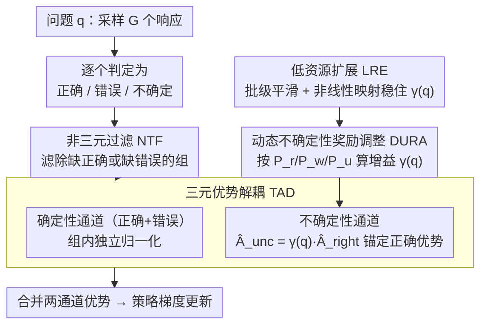

# UCPO：不确定性感知的策略优化

**会议**: ICML2026  
**arXiv**: [2601.22648](https://arxiv.org/abs/2601.22648)  
**代码**: https://github.com/xzhouzeng/ucpo  
**领域**: LLM推理  
**关键词**: 不确定性表达, 强化学习, 策略优化, 可信AI, 过度自信缓解  

## 一句话总结
UCPO 通过三元优势解耦（TAD）和动态不确定性奖励调整（DURA）两个机制，解决了现有RL范式中固定不确定性奖励导致的优势偏差问题，使LLM能在知识边界处可靠地表达不确定性，在Qwen3-8B上数学推理PAQ达到79.63%。

## 研究背景与动机

**领域现状**：LLM在复杂推理任务上表现出色，但在面对超出自身知识边界的问题时倾向于过度自信地给出错误断言（hallucination），这是高风险场景部署的核心障碍。构建可信AI要求模型具备"知道自己不知道"的元认知能力。

**现有痛点**：现有的不确定性对齐方法分两条路线：(1) SFT路线——用带有弃权标签的数据集做模仿学习，但数据合成成本高且静态数据无法捕捉推理时的动态不确定性；(2) RL路线——给不确定响应分配固定中间奖励（如0.5），但这种静态奖励对超参数极度敏感。在高难度任务上模型会"奖励黑客"——通过过度拒绝来获取稳定奖励（回避退化）；在简单任务上不确定性信号被正确答案的高奖励淹没，导致模型仍然过度自信。

**核心矛盾**：GRPO等RL框架在引入三元奖励（正确/错误/不确定）后产生了根本性的"优势偏差"——在高性能区间，不确定样本的优势变为负值（多数人压制），模型被惩罚而非鼓励表达怀疑；在低性能区间，不确定样本的优势主导梯度（奖励黑客），模型退化为全部输出不确定。

**本文目标**：设计一个自适应的RL框架，在不需要穷举调超参数的情况下，让LLM在三元决策空间（正确/错误/不确定）中达到动态平衡。

**切入角度**：从理论上分析固定奖励在GRPO框架中导致优势偏差的数学机制——不同性能区间下不确定样本的优势函数符号会翻转，这是静态奖励无法解决的结构性问题。

**核心 idea**：将确定性路径和不确定性路径解耦到独立通道进行优势估计（消除语义干扰），同时根据模型实时能力和样本难度动态调整不确定性奖励权重。

## 方法详解

### 整体框架
UCPO 想解决的是：在 GRPO 里引入"正确/错误/不确定"三元奖励后，不确定样本的优势会随模型性能区间翻转符号——高性能区间被压成负值（模型该谨慎时反被惩罚），低性能区间又主导梯度（模型集体退化为弃权）。它在标准 GRPO 上做两处手术：对于一个问题 $q$，模型先采样 $G$ 个响应并逐个判为正确、错误或不确定；接着不再做全局优势归一化，而是用三元优势解耦（TAD）把确定性样本和不确定性样本拆进两条独立通道分别算优势；不确定通道的强度则交给动态不确定性奖励调整（DURA），按当前这一组里正确/错误/不确定的实时比例算出增益系数 $\gamma(q)$，让奖励随模型能力自适应而不再靠人手调一个固定值。极端分布与小组高方差则由非三元过滤（NTF）和低资源扩展（LRE）兜底。

### 关键设计

**1. 三元优势解耦（TAD）：把不确定信号从全局平均里捞出来，单开通道算优势**

病根在于 GRPO 的全局归一化是按"和组内平均比高低"来分配优势的。当模型变强、正确样本占多数时，一个合理的不确定响应也会因为"奖励低于平均"被拉成负优势——明明该鼓励的谨慎，反被当成劣质回答惩罚，这就是"多数人压制"。TAD 的做法是把 $G$ 个 rollout 切成确定性集合 $\mathcal{S}_{det}$（正确+错误）和不确定性集合 $\mathcal{S}_{unc}$，两条通道互不干扰。确定性通道内部独立归一化 $\hat{A}_{i,t}^{det} = (r_i - \text{mean}(\mathbf{r}_{det})) / (\text{std}(\mathbf{r}_{det}) + \epsilon)$，正确路径拿正强化、错误路径拿负惩罚，跟原来一样。关键在不确定性通道——它的优势不再独立算，而是锚定到正确样本的优势上做动态投影：

$$\hat{A}_{i,t}^{unc} = \gamma(q) \cdot \hat{A}_{right}$$

也就是说，把正确样本的优势当成"性能锚点"，让弃权的激励自动随模型当前最高推理能力缩放。这样不确定信号既不再和全局平均争高低（躲开压制效应），其强度又始终和"模型这道题到底能做多好"挂钩。若某组 rollout 缺正确或缺错误样本，则交给下面的 NTF 直接丢弃。

**2. 动态不确定性奖励调整（DURA）：让弃权奖励随能力和难度自己调，不靠手调固定值**

固定中间奖励 $r_u$（如 0.5）的麻烦是它一刀切：训练中模型能力在涨、不同题难度也不同，同一个 $r_u$ 在高难任务上会诱发"过度拒绝换稳定奖励"的回避退化，在简单任务上又被正确答案的高奖励淹没。DURA 把上面那个增益系数 $\gamma(q)$ 拆成一推一拉两项：

$$\gamma(q) = \underbrace{\frac{P_w}{P_u + P_w + \epsilon}(1 - P_u)}_{\text{不确定性增益项}} - \underbrace{w \cdot \frac{P_r}{P_r + P_w + \epsilon}P_u}_{\text{不确定性抑制项}}$$

其中 $P_r, P_w, P_u$ 是当前组里正确/错误/不确定 rollout 的比例。增益项在错误率高（$P_w$ 大）时放大弃权激励，把模型从"错误断言"推向"诚实怀疑"，同时乘 $(1-P_u)$ 防止它一路饱和到全员弃权；抑制项在模型变强（$P_r$ 增大）时反过来惩罚不必要的回避，推它去给确定的正确答案。两项一拉扯，不确定通道就成了一个"调节缓冲区"：训练早期压幻觉、后期催精度，全程不用人去扫描 $r_u$。

**3. 非三元过滤（NTF）与低资源扩展（LRE）：堵住极端分布和小组带来的方差**

DURA 的 $\gamma(q)$ 是靠组内三元比例算出来的，组太小或分布太极端时这个估计会很抖。NTF 负责前者的极端情况：缺正确或缺错误 rollout 的组直接过滤掉，逻辑上等同标准 GRPO 对全对/全错组做零优势处理。LRE 负责小组高方差：当 $G$ 很小（如 $G=4$）时单组比例噪声大、$\gamma(q)$ 容易剧烈波动，LRE 用批级平滑加非线性映射把增益估计稳住。两者合起来保证小 rollout 预算下训练不发散。

## 实验关键数据

### 主实验（数学推理，PAQ指标）

| 方法 | AIME24 | AMC | MATH500 | Minerva | OlympiadBench | 平均PAQ |
|------|--------|-----|---------|---------|---------------|---------|
| Qwen3-8B Baseline | 73.33 | 91.57 | 96.80 | 45.96 | 69.63 | 75.46 |
| GRPO | 77.01 | 88.35 | 96.46 | 47.18 | 69.22 | 75.64 |
| GRPO-UC (r_u=0.2) | 83.75 | 88.98 | 96.31 | 48.60 | 70.68 | 77.66 |
| **UCPO** | **86.11** | **91.95** | **97.28** | **49.15** | **73.67** | **79.63** |
| Llama-3.1-8B Baseline | 3.33 | 15.66 | 45.80 | 15.81 | 14.96 | 19.11 |
| GRPO-UC (r_u=0.5) | 0.00 | 21.43 | 57.61 | 26.16 | 19.28 | 24.90 |
| **UCPO** | **5.13** | **28.12** | **60.95** | **22.50** | **25.56** | **28.45** |

### 消融实验（Llama-3.1-8B，数学推理）

| 配置 | 不确定性比例 | PAQ | F1 |
|------|-------------|-----|-----|
| w/o TAD | 50.33 | 22.56 | 16.21 |
| w/o DURA | 79.91 | 35.22 | 13.16 |
| w/o NTF | 37.96 | 28.51 | 22.93 |
| w/o LRE | 43.19 | 27.83 | 21.12 |
| Full UCPO | **39.09** | **28.45** | **22.65** |

### 关键发现
- GRPO-UC的固定奖励极度脆弱：在Llama-3.1-8B的数学任务上，$r_u \geq 0.5$ 触发奖励黑客，不确定性比例飙升至100%，F1崩溃到个位数（9.01）；而在通用任务上 $r_u = 0.2$ 又不够激励不确定性学习
- 去掉TAD后PAQ大幅下降（28.45→22.56），去掉DURA后不确定性比例飙升到79.91%（奖励黑客），证明两个组件各自不可或缺
- UCPO在Qwen3-8B上平均PAQ达79.63%，比最佳GRPO-UC变体高出约2个百分点，且无需调节 $r_u$ 超参数
- 组大小 $G=8$ 在PAQ上最优，$G=16$ 在F1上更好，说明更大的组提供更稳定的优势估计

## 亮点与洞察
- **将不确定性优势锚定到正确样本优势** $\hat{A}_{unc} = \gamma(q) \cdot \hat{A}_{right}$ 是一个优雅的设计：它让不确定性的激励自动跟随模型当前的推理峰值能力缩放，既避免了全局归一化的压制效应，又防止了固定奖励的黑客风险。这个"性能锚定"思路可迁移到任何需要多类型奖励平衡的RL场景
- DURA的双项公式实现了一个自稳定系统：错误多时鼓励弃权，能力强时抑制弃权。这种自适应机制相比手动调 $r_u$ 是本质性的进步——从"一个超参数适配所有"变为"根据当前状态自动调节"
- 论文对三元不平衡问题的理论分析非常清晰——用三元图可视化不同性能区间下优势函数的行为，直观揭示了固定奖励失败的数学机制

## 局限与展望
- 作者承认 rollout 类型分布（$P_r, P_w, P_u$ 的初始比例）可能影响不确定性学习，但未充分探索
- 在多选题场景下，F1可能因将"碰巧猜对"转为不确定而下降——UCPO优化的是可靠性（PAQ）而非覆盖率
- DURA的增益公式依赖组内统计量，在极端分布下（如全部正确或全部错误）可能退化，需要NTF兜底
- 未来可探索连续化的不确定性表达（如置信度分数）而非离散的弃权决策

## 相关工作与启发
- TruthRL / KnowRL：使用固定中间奖励进行不确定性对齐的代表方法，超参数敏感性是其核心瓶颈
- GRPO / DeepSeek-R1：UCPO的基础RL框架，UCPO在其上引入三元决策空间
- DAPO / Dr.GRPO：改进GRPO训练稳定性的并行工作，关注采样策略和裁剪机制而非不确定性建模

<!-- RELATED:START -->

## 相关论文

- [\[ICML 2026\] Are Tools Always Beneficial? Learning to Invoke Tools Adaptively for Dual-Mode Multimodal LLM Reasoning](are_tools_always_beneficial_learning_to_invoke_tools_adaptively_for_dual-mode_mu.md)
- [\[ICLR 2026\] Slow-Fast Policy Optimization: Reposition-Before-Update for LLM Reasoning](../../ICLR2026/llm_reasoning/slow-fast_policy_optimization_reposition-before-update_for_llm_reasoning.md)
- [\[CVPR 2026\] APPO: Attention-guided Perception Policy Optimization for Video Reasoning](../../CVPR2026/llm_reasoning/appo_attention-guided_perception_policy_optimization_for_video_reasoning.md)
- [\[ACL 2026\] Think Outside the Policy: In-Context Steered Policy Optimization](../../ACL2026/llm_reasoning/think_outside_the_policy_in-context_steered_policy_optimization.md)
- [\[ICML 2026\] Verifying Meta-Awareness via Predictive Rewards in Reasoning Models](verifying_meta-awareness_via_predictive_rewards_in_reasoning_models.md)

<!-- RELATED:END -->
