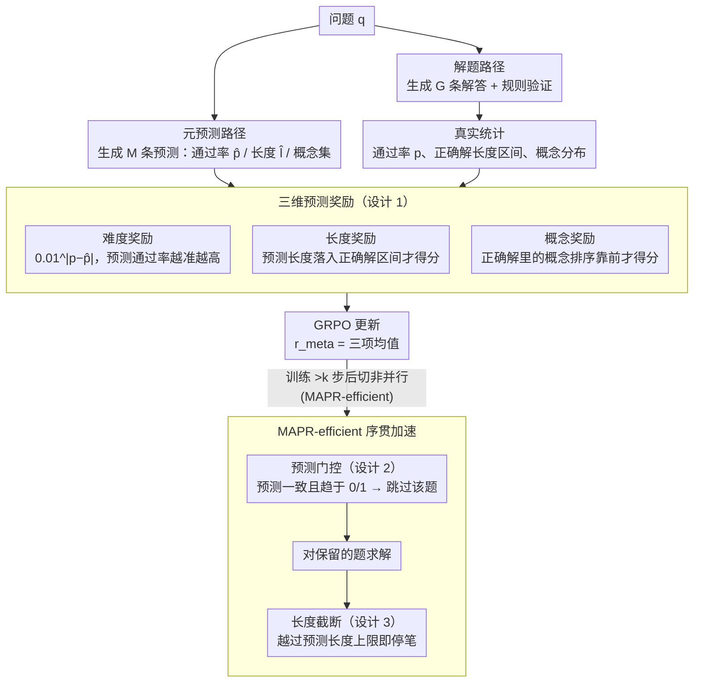

# Verifying Meta-Awareness via Predictive Rewards in Reasoning Models

**会议**: ICML 2026  
**arXiv**: [2510.03259](https://arxiv.org/abs/2510.03259)  
**代码**: https://github.com/akatigre/MAPR-RL  
**领域**: LLM 推理  
**关键词**: 元认知, 推理模型, 强化学习, 预测奖励

## 一句话总结
通过让推理模型自预测解法长度、通过率和所需概念，用预测结果与真实统计对齐来优化模型元认知——从而显著提升数学推理性能并加速训练。

## 研究背景与动机

**领域现状**：大规模推理模型（LRM）通过 GRPO 等 RL 算法进行后训练，能显著增强 LLM 数学推理能力。然而当前方法仅依赖答案级别验证，缺乏对模型自身知识边界和思维过程的认知。

**现有痛点**：传统方法存在三个关键问题——（1）模型无法准确估计自身解决能力（知识边界模糊）；（2）生成超长但错误推理路径浪费计算；（3）缺乏对问题本质难度的自我认识无法自适应分配计算资源。

**核心矛盾**：模型的"元认知"与实际推理能力之间存在显著偏差。GRPO 训练的模型表现出明显过度自信——预测难度与真实通过率严重不对齐。

**本文目标**：构建自验证的元认知优化框架，使模型能通过自生成的预测与真实统计的一致性得到优化信号，无需外部监督。

**切入角度**：模型可并行生成两条推理轨迹——一条解题，一条元预测。将两条轨迹的预测值与实际统计量对齐让模型学习准确的自我评估。

**核心 idea**：用"预测奖励"（让模型预测难度、长度、概念再与真实值对齐）代替传统"答案奖励"，驱动模型元认知对齐。

## 方法详解

### 整体框架
MAPR 让模型对同一个问题并行走两条推理路径：**解题路径**照常生成 G 条响应、用规则验证得到真实通过率 $p$ 和正确解的长度范围 $[l_{\min}, l_{\max}]$；**元预测路径**则生成 M 条"元预测"，让模型在动手解题前先报出自己估计的通过率 $\hat{p}$、期望长度 $\hat{l}$ 和这道题需要的概念集合 $\hat{\mathcal{G}}_{\text{notion}}$。两条路径共享同一套参数、同在 GRPO 框架下更新，最终把"预测得准不准"也变成可优化的奖励信号（**三维预测奖励**）。这是基础版 MAPR；训练跑过 k 步、元预测变稳之后，加速版 **MAPR-efficient** 把并行改成序贯——先跑元预测、用**预测门控**筛掉平凡/不可解的题，再对留下的题求解并施加**长度截断**，把元认知带来的省算力收益落到实处（也可顺带把预测的概念当作提示喂给解题路径）。

### 关键设计

**1. 三维预测奖励：让模型在难度、长度、概念三个维度上自我校准**

GRPO 训练出来的模型有个老毛病——过度自信，自报的难度和真实通过率严重对不上。MAPR 把这种"自知之明"拆成三个可验证的维度，各给一项奖励。难度上用指数衰减 $r_{\text{difficulty}}=0.01^{|p-\hat{p}|}$，预测通过率 $\hat{p}$ 离真实 $p$ 稍有偏差奖励就急剧塌缩，逼模型给出精确而非粗粒度的估计；长度上用指示函数 $r_{\text{length}}=\mathbb{1}[l_{\min}\leq\hat{l}\leq l_{\max}]$，预测长度落进正确解的真实区间才得分；概念上用 $r_{\text{notion}}=\mathbb{E}_{n}[\mathbb{1}[c_{\text{corr,n}}>c_{\text{wrong,n}}]]$，奖励模型把正确解里出现的概念排在错误解概念之前。三维分解之所以有效，是因为它把"理解一道题"从单一的难度猜测，扩展到"要花多长、用哪些知识点"的多面认知，任何一维偏差都拿不到满分。

**2. 预测门控（Predictive Gating）：解题前就把平凡题和不可解题筛掉**

并行采样最浪费算力的地方，是反复去解那些"闭眼都对"或"怎么都不对"的题。MAPR 利用元预测路径做前置过滤：当 M 条元预测的难度标准差 $\sigma<\sigma_{\text{pg}}$（模型众口一词）且平均预测逼近 0 或 1（一致认为必错或必对）时，就触发门控、直接跳过这道题的求解，门控仅在训练 k 步、元预测稳定后才启用。与 DAPO 那种"先解完再后验剪枝"相反，预测门控把判断前移到求解之前，靠元认知省掉无效采样，实测过滤精度 0.94、召回 0.87，可靠地剔除零方差问题。

**3. 长度截断（Length Cutoff）：到了预测上限就立刻停笔**

长度是推理正确性的强信号——超长往往意味着模型在错误路径上原地打转。经过 MAPR 训练后 $\hat{l}$ 对正确解长度的预测已相当准，于是直接设一个硬上限 $l_{\text{limit}}=\hat{l}\times l_{\text{LC}}$，生成一旦越过这条线就强制截断，因为超出此长度后几乎不再产出正确答案。这等于把模型自己的长度预测反过来当成生成约束，省下大量冗余 token 而几乎不损正确率。

### 训练策略
MAPR 整体基于 GRPO：解题路径的奖励 $r_{\text{sol}}$ 来自规则验证，元预测路径的奖励取三维均值 $r_{\text{meta}}=\frac{r_{\text{difficulty}}+r_{\text{length}}+r_{\text{notion}}}{3}$。其加速版 MAPR-efficient 在第 k=80 步后从并行切到非并行：先跑元预测触发门控筛题，再对留下的题执行解题，从而把元认知带来的省算力收益落到实处。

## 实验关键数据

### 主实验

在六个数学基准上与 GRPO 基线对比（Qwen3-4B/8B/14B）：

| 数据集 | GRPO (4B) | MAPR (4B) | 提升 | GRPO (8B) | MAPR (8B) | 提升 |
|--------|-----------|-----------|------|-----------|-----------|------|
| AIME'24 | 17.50±4.00 | 26.15±3.32 | +49.43% | 28.54±4.12 | 34.17±5.54 | +19.72% |
| AIME'25 | 11.77±4.56 | 21.56±4.40 | +83.18% | 22.19±3.63 | 28.44±5.41 | +28.17% |
| AMC23 | 59.30±6.40 | 70.16±4.78 | +18.11% | 73.67±5.60 | 79.53±4.26 | +7.95% |
| MATH500 | 79.61±0.91 | 84.52±0.74 | +6.17% | 85.75±0.66 | 88.05±0.82 | +2.68% |
| Minerva | 42.27±1.53 | 41.12±2.00 | -3.18% | 43.21±2.12 | 47.21±1.74 | +9.26% |
| OlympiadBench | 44.47±1.04 | 53.38±0.96 | +20.04% | 54.03±1.22 | 56.86±0.85 | +5.24% |
| **平均** | **42.49** | **49.48** | **+13.04%** | **51.23** | **55.71** | **+8.74%** |

### 消融

| 配置 | AIME'24 | AIME'25 | AMC23 | 说明 |
|------|---------|---------|-------|------|
| 仅难度奖励 | 23.41 | 18.92 | 66.28 | 单维预测不足 |
| 仅长度奖励 | 24.67 | 20.13 | 68.55 | 长度信号较弱 |
| 仅概念奖励 | 22.89 | 19.56 | 65.87 | 概念维度最弱 |
| **全三维** | **26.15** | **21.56** | **70.16** | 完整模型最优 |

Shapley 值分解：难度奖励贡献最大（43%），其次长度（35%）和概念（22%）。

### 关键发现
- MAPR 在中等难度题（AIME/AMC/Olympiad）获最大提升（+20%-+83%），易题（MATH500）饱和。
- 元认知改善驱动性能超过训练步数——同等 step 下 $\Delta r_{\text{pred}}$ 增长 vs 性能增长斜率为 1.8 倍。
- 预测门控精度 94%、召回 87%，可靠过滤零方差问题。
- MAPR-efficient 加速——达到基线性能仅需 0.78 倍计算或等计算量下性能提升 15%。

## 亮点与洞察
- **元认知作为内部信号**：突破传统 RL 只用答案奖励范式。通过并行"思考过程预测"让模型自验证自身能力估计。
- **预测→控制的反演**：通常预测被动了解系统；本文反转为主动用预测结果驱动计算资源调度。
- **三维分解的可迁移性**：难度+长度+概念分解框架通用于任何需要自适应推理的任务。

## 局限与展望
- 概念预测精度有限——概念维度 Shapley 仅 22%，主因概念匹配需人工规则。
- 模型规模效应递减——4B 模型 13% 提升，8B 8.7%，14B 6.6%。
- 数据集偏差——仅在 DeepScaleR 训练。
- 改进：用可学习概念提取器替代规则匹配；探索更细粒度元预测（如中间步骤正确率）；跨任务泛化。

## 相关工作与启发
- **vs DAPO**：DAPO 后验剪枝；MAPR 先验过滤更高效。
- **vs 信心阈值停止**：传统启发式缺乏真正元认知对齐；MAPR 通过奖励强制自我校准。
- **vs 外部验证器**：外部 PRM 或多智能体验证需额外模型；MAPR 自验证更轻量。

## 评分
- 新颖性: ⭐⭐⭐⭐⭐  元认知+预测奖励的结合创新。
- 实验充分度: ⭐⭐⭐⭐⭐  6 数学基准 + 3 模型规模 + 详细消融 + Shapley 分解。
- 写作质量: ⭐⭐⭐⭐  主要思路清晰，部分概念描述略仓促。
- 价值: ⭐⭐⭐⭐⭐  不仅提升性能（13%+）更加速训练 1.28 倍。

<!-- RELATED:START -->

## 相关论文

- [\[ICLR 2026\] Dynamics-Predictive Sampling for Active RL Finetuning of Large Reasoning Models](../../ICLR2026/llm_reasoning/dynamics-predictive_sampling_for_active_rl_finetuning_of_large_reasoning_models.md)
- [\[ICML 2026\] Hidden Error Awareness in Chain-of-Thought Reasoning: The Signal Is Diagnostic, Not Causal](hidden_error_awareness_in_chain-of-thought_reasoning_the_signal_is_diagnostic_no.md)
- [\[ICLR 2026\] Verifying Chain-of-Thought Reasoning via Its Computational Graph](../../ICLR2026/llm_reasoning/verifying_chain-of-thought_reasoning_via_its_computational_graph.md)
- [\[ACL 2026\] Self-Awareness before Action: Mitigating Logical Inertia via Proactive Cognitive Awareness](../../ACL2026/llm_reasoning/self-awareness_before_action_mitigating_logical_inertia_via_proactive_cognitive_.md)
- [\[NeurIPS 2025\] Smaller Models, Smarter Rewards: A Two-Sided Approach to Process and Outcome Rewards](../../NeurIPS2025/llm_reasoning/smaller_models_smarter_rewards_a_two-sided_approach_to_process_and_outcome_rewar.md)

<!-- RELATED:END -->
