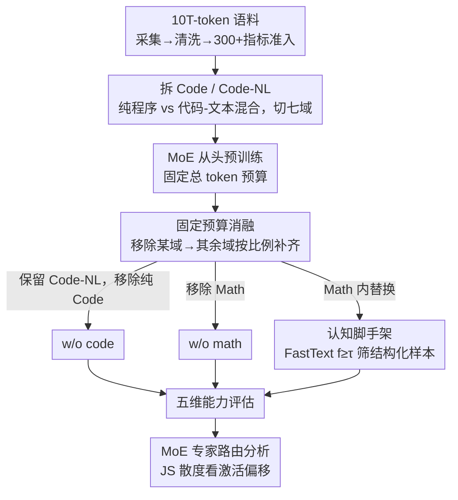

# What Really Improves Mathematical Reasoning: Structured Reasoning Signals Beyond Pure Code

**会议**: ICML2026  
**arXiv**: [2605.19762](https://arxiv.org/abs/2605.19762)  
**代码**: 匿名仓库，缓存未提供公开 URL  
**领域**: LLM 预训练 / 数学推理  
**关键词**: 数据配比, 数学推理, 代码预训练, MoE, 认知脚手架  

## 一句话总结
这篇论文通过 10T-token 语料和 MoE 从头预训练的控制实验指出，真正提升复杂数学推理的不是纯可执行代码本身，而是跨域结构化推理信号，尤其是数学语料中显式暴露中间步骤的“认知脚手架”。

## 研究背景与动机
**领域现状**：现代通用 LLM 的预训练语料通常包含相当比例的代码数据，很多经验结论认为代码的严格语法、控制流和算法结构不仅提升编程能力，也会外溢到数学、逻辑和科学推理。另一个相关方向是数据混合与数据选择，即在固定 token 预算下如何分配 Web、Code、Math、Wikipedia、Books 等不同域的数据。

**现有痛点**：过去许多研究把“代码”当作一个粗粒度整体，常常把可执行代码、notebook、Markdown、HTML/CSS、题解文本、带代码片段的数学推导都算进同一类。这样得到的“代码提升推理”结论可能混合了两种不同信号：一种是纯编程语法和可执行程序，另一种是自然语言、数学符号和过程结构交织的跨域推理轨迹。

**核心矛盾**：在固定训练预算下，加入某个域的数据并不是白送收益，而是会挤占其他域。纯代码可能增强编程，却减少模型接触知识密集或数学复杂推导的机会；数学数据也可能增强竞赛编程，却削弱某些综合推理任务。问题因此从“代码有没有用”变成“哪类结构信号在什么任务上有用，以及代价是什么”。

**本文目标**：作者希望用更细粒度的数据定义重新检验代码、数学与推理之间的关系：先把 Code 和 Code-NL 分开，再在 10T-token 语料上做固定预算消融，最后从数学域中筛出具有显式步骤结构的 cognitive scaffolds，观察它们是否能提升复杂数学推理而不显著损害编程能力。

**切入角度**：论文把“结构”从“代码文件”中抽离出来。纯 Code 被严格定义为可执行函数、脚本和程序片段，排除注释和说明；Code-NL 则保留混合代码和自然语言的结构化材料。随后作者用 FastText 结构分类器在数学语料中寻找带有子目标、分步推导、符号操作、验证过程的样本，作为更直接的推理脚手架。

**核心 idea**：与其笼统提高代码比例，不如在固定数学预算内提高结构化数学推理样本密度，用可见的中间推理轨迹训练模型解决高难数学问题。

## 方法详解

### 整体框架
这篇论文不提新架构，而是把"代码到底有没有帮助数学推理"做成一套大规模数据因果归因实验。作者先把 10T-token 语料严格切成 Web、Code、Code-NL、Math、Wikipedia、Books、Multilingual 七个域（每个域过 300+ 质量指标准入），再从头预训练核心模型——20 层自回归 MoE，hidden size 2048、16 heads，每层 16 个专家做 top-2 routing。真正的实验在数据配置上：从 full data 出发，分别去掉纯 Code、去掉 Math、或在 Math 内部把普通样本换成结构化样本，然后看五类能力维度怎么变。整套设计的关键约束是**固定总训练 token**——移除某个域时剩余域按比例上采样补齐，所以分数差异反映的是"数据替换效应"而不是训练量缩水，最后再用专家路由分布从机制层解释数据配比如何改写了模型内部激活。

### 关键设计

**1. 把 Code 和 Code-NL 拆成两类，分离纯程序的边际贡献**

过去研究常把可执行程序、notebook、Markdown、题解、带代码片段的数学推导都算作"代码"，于是"代码提升推理"这个结论其实混进了两种完全不同的信号。作者的做法是把纯 Code 严格限定为可执行函数、脚本、程序片段——要求 executable code density 超过阈值，再过语法、长度、去重和低质量过滤；而网页、notebook、问答、Markdown、HTML/CSS 这类自然语言、公式和代码交织的材料单独归为 Code-NL。做消融时只移除纯 Code，Code-NL 始终保留。这样一来，如果移除纯 Code 后数学推理并没掉、甚至更好，就说明此前观察到的推理收益更可能来自 Code-NL 里的结构化讲解和数学推导，而非可执行程序本身——这个拆分让实验第一次能干净地估计纯代码的边际贡献。

**2. 固定预算消融，逼出数据域之间的竞争与负耦合**

真实大模型训练最硬的约束是 token 预算固定，加某个域的数据从来不是白送收益，而是挤占别的域。作者据此从 full corpus 分别训练 w/o code 和 w/o math 两个模型，移除某域后不减总 token、而由其他域按比例补齐，再把评估拆成 general knowledge、programming ability、mathematical ability、comprehensive reasoning、professional knowledge 五个维度。这个设置的价值在于它能暴露负耦合：纯代码可能增强编程却压低数学复杂推导的接触机会，数学数据可能帮到竞赛编程却干扰部分混合代码推理——问题因此从"代码有没有用"变成"哪类信号在什么任务上有用、代价是什么"。

**3. 用 FastText 筛认知脚手架，再用 MoE 路由验证它是跨域稳定信号**

如果有效信号真是"显式中间推理结构"而非代码语义，那就应该能在数学域内部直接把这种结构密度提上去。作者用 20 万代码样本当正例、20 万非代码样本当负例训练一个轻量 FastText 分类器，让它学会识别外显结构模式（子目标、分步推导、符号操作、验证过程），再把分类器投到 Math 语料，选出打分 $f_\theta(x)\geq\tau$ 的样本作为 cognitive scaffolds——这里 $f_\theta(x)$ 是分类器对样本结构化程度的打分，$\tau$ 是准入阈值。分类器本身很可信：验证集 accuracy 0.9696、positive precision 0.9998、recall 0.9665；而被选中的脚手架虽然没靠手写规则，事后统计却显示它们符号密度更高、推导步数更多、缩进比例更高、文本更长。更关键的是路由分析：删掉 Code 或 Math 会让对应域专家分布明显偏移，但替换成脚手架造成的偏移更小更分散，说明它不像一个新的窄域、而更像一个跨域稳定的推理信号。

### 损失函数 / 训练策略
模型用标准自回归语言建模目标。MoE 侧采用 dropless routing、load-balancing loss、router z-loss，并在早期加 stochastic routing warmup——把 learned routing logits 和随机 logits 按 $\alpha=\min(t_c/t_w,1)$ 插值，缓解早期专家拥塞。优化器 AdamW，学习率 $5\times10^{-5}$，2000 steps warmup，bfloat16 + FP8 混合精度，训 24000 iterations、每 1200 iterations 存一次 checkpoint。cognitive scaffolds 不单独当一个新域调度，而是在固定 Math budget 内替换普通数学样本，保证对比的是结构密度而非数学数据总量。

## 实验关键数据

### 主实验
| 实验问题 | 指标 / 数据集 | 关键结果 | 对照 | 结论 |
|--------|------|------|----------|------|
| 纯代码是否提升数学推理 | 数学能力平均 | full data 比 w/o code 低 14.38% | Code-NL 保持不变 | 纯可执行代码不是通用数学推理增强器 |
| 代码对复杂数学任务影响 | Minerva-Math / OlympiadBench / MATH | -71.53% / -47.16% / -22.64% | w/o code 更好 | 代码在高难数学上与数学知识/推导预算竞争明显 |
| 数学数据对编程影响 | CodeForces / LiveCodeBench | +37.11% / +11.26% | w/o math 更差 | 数学数据能帮助竞赛编程类算法任务 |
| 数学数据的负耦合 | CruxEval / MBPP | -17.30% / -6.12% | w/o math 更好 | 数学数据也会干扰部分混合代码推理任务 |
| cognitive scaffolds | 数学能力平均 | +17.56% | 固定 Math token budget | 结构化数学样本能显著提升复杂数学推理 |

### 消融实验
| 配置 | 关键指标 | 说明 |
|------|---------|------|
| full data (32e) | Math overall 36.20 / Programming overall 26.94 | 32-expert MoE 的完整语料基线 |
| w/o code (32e) | Math overall 38.52 / Programming overall 14.25 | 去掉纯 Code 后数学平均更高，但编程能力大幅下降 |
| w/o math (32e) | Math overall 17.71 / Programming overall 24.25 | 去掉 Math 后数学能力崩塌，编程平均略低于 full |
| cognitive scaffold replacement | College Math +30.05%, MATH +23.17%, OlympiadBench +47.78%, MathBench +14.51% | 固定数学预算内提高结构化样本密度，复杂任务收益最大 |
| scaffold side effect | GSM8K -6.29%, CMath -2.00%, code benchmarks 约 -1% | 对简单自然语言数学题有轻微竞争，对代码能力影响很小 |

### 关键发现
- 论文反驳的是“纯代码天然提升推理”的粗粒度说法，而不是否认结构化数据有用。真正有效的信号来自显式步骤、符号操作、层级分解和验证过程。
- Code-NL 是解释分歧的关键控制变量。过去把 Markdown、HTML、题解、notebook 等算作代码时，观察到的推理收益可能来自这些混合结构化文本。
- cognitive scaffolds 对复杂数学任务收益显著，但对 GSM8K、CMath 这类可以用较直接自然语言解决的题目反而略有伤害，说明“结构越多越好”并不成立。
- MoE 路由结果显示，去掉 Code 或 Math 会让对应域专家分布明显偏移，而去掉 scaffolds 造成的偏移更小、更分散，支持它们作为跨域稳定推理信号的解释。

## 亮点与洞察
- 这篇论文把预训练数据讨论从“哪个域比例更大”推进到“同一域内部哪种结构特征有效”。这比简单争论 code ratio 更有操作价值，因为它能指导数据选择而不只是数据配比。
- 固定预算设计很重要。很多数据消融如果只是减少 token，会混淆数据质量与训练量；本文保持总 token 不变，更贴近真实大模型训练中的资源分配问题。
- FastText 结构分类器的设计很朴素但有效。作者没有训练复杂 reward model，而是用代码样本学习可迁移的外显结构，再投到 Math 域筛选推理轨迹，体现了低成本数据工程思路。
- 专家路由分析让结论不只停留在下游分数。虽然路由模式不是严格因果解释，但它提供了机制层证据：不同数据配置确实改变了 MoE 内部的专家使用方式。

## 局限与展望
- cognitive scaffold 的定义仍是操作性定义，不是普适理论。FastText 学到的“结构”可能包含格式、长度、缩进等表面特征，尽管作者做了污染审计和事后统计。
- 论文没有系统扫描 scaffold replacement ratio，因此不能推出“脚手架比例越高越好”。当前结论只是在某个固定替换设置下成立。
- 训练成本很高，复现实验门槛大。10T-token 语料和从头训练 MoE 让结论可信度提升，但也限制了外部验证。
- 评估主要在预训练能力维度上，尚未充分覆盖 instruction tuning、RLHF 后以及 tool-use agent 场景中这些数据效应是否保留。

## 相关工作与启发
- **vs To Code or Not to Code / code-ratio studies**: 既有工作常把代码和结构化文本混在一起讨论，本文通过保留 Code-NL、只消融 pure Code，指出推理收益可能来自混合结构化样本。
- **vs DoReMi / REGMIX**: 数据混合方法关注域级比例优化，本文进一步说明域内实例结构同样关键；未来可以把 cognitive scaffold 作为一个可学习的子域加入混合优化。
- **vs 数据选择方法**: 本文的 scaffold 筛选可以看成面向推理的离线数据选择。与通用质量打分不同，它强调中间步骤可见性和符号过程结构。
- **启发**: 对 LLM 预训练来说，提升数学推理不一定要增加整个 Math 域比例，可以在固定预算内提高“可追踪推理轨迹”的密度；对代码数据也应区分可执行程序、题解、notebook 和带注释推导。

## 评分
- 新颖性: ⭐⭐⭐⭐ 主题本身已有不少代码数据研究，但把 Code/Code-NL 拆开并定位 cognitive scaffolds 的贡献很有启发。
- 实验充分度: ⭐⭐⭐⭐⭐ 10T 语料、MoE/dense 多规模、固定预算消融和路由分析组合很扎实。
- 写作质量: ⭐⭐⭐⭐ 主线清楚，数字充分，但附录表格解析较重，读者需要小心区分相对变化和原始分数。
- 价值: ⭐⭐⭐⭐⭐ 对预训练数据工程非常实用，直接指出“结构化推理样本密度”比笼统增加代码更可控。

<!-- RELATED:START -->

## 相关论文

- [\[ICML 2026\] Biases in the Blind Spot: Detecting What LLMs Fail to Mention](biases_in_the_blind_spot_detecting_what_llms_fail_to_mention.md)
- [\[ACL 2025\] STRICTA: Structured Reasoning in Critical Text Assessment for Peer Review and Beyond](../../ACL2025/llm_reasoning/stricta_structured_reasoning_peer_review.md)
- [\[ICML 2026\] Beyond Test-Time Memory: State-Space Optimal Control for LLM Reasoning](beyond_test-time_memory_state-space_optimal_control_for_llm_reasoning.md)
- [\[ICML 2026\] FloorplanQA: A Benchmark for Spatial Reasoning in LLMs Using Structured Representations](floorplanqa_a_benchmark_for_spatial_reasoning_in_llms_using_structured_represent.md)
- [\[NeurIPS 2025\] Beyond Accuracy: Dissecting Mathematical Reasoning for LLMs Under Reinforcement Learning](../../NeurIPS2025/llm_reasoning/beyond_accuracy_dissecting_mathematical_reasoning_for_llms_u.md)

<!-- RELATED:END -->
