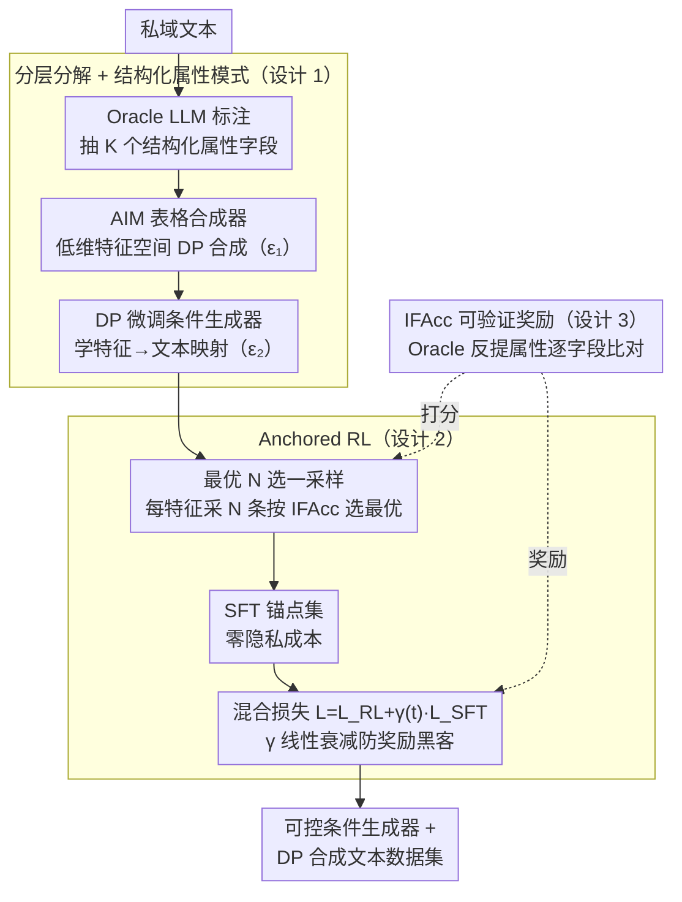

# ACTG-ARL: Differentially Private Conditional Text Generation with RL-Boosted Control

**会议**: ICML 2026  
**arXiv**: [2510.18232](https://arxiv.org/abs/2510.18232)  
**代码**: https://github.com/actg-arl/ACTG-ARL  
**领域**: 差分隐私 / 文本生成 / 强化学习对齐  
**关键词**: 隐私合成数据, 条件文本生成, 属性控制, 指令跟随, 奖励黑客

## 一句话总结
本文提出一个分层框架 ACTG，将隐私文本生成分解为特征学习与条件文本生成两个子任务；进一步引入 Anchored RL，通过混合强化学习目标与基于最优 N 选一的 SFT 锚点，在保持文本保真度的前提下提升条件生成器的指令跟随能力，在生物医学数据上相比先前工作提升 20% MAUVE。

## 研究背景与动机

**领域现状**
现代 AI 应用依赖大量用户数据（手机输入、推荐历史、对话偏好等），这些数据隐私风险高。生成隐私合成数据是一个有前景的范式，允许下游任务复用合成数据而不需额外隐私成本。DP 合成文本是一个热点，但现有工作主要关注生成静态数据集，忽视了精细控制的实际需求。

**现有痛点**
1. **CTCL 局限**：依赖预训练通用主题模型，可能与私域数据不匹配，用粗颗粒主题强行分类细微文本，导致话题推断不准确；当数据集小相对于主题数时，直方图含有大量空值，降噪后信号淹没在噪声中。
2. **控制与保真平衡困难**：传统 RL 优化会导致奖励黑客（reward hacking），模型学会生成形式上满足约束但文本质量下降的输出（如 TL;DR 风格摘要）。

**核心矛盾**
分布匹配目标鼓励从 $P(X,Y)$ 的高密度区域采样（模型已有信心的区域），而数据增强的价值源于低密度区域（模型不确定的边界或欠覆盖群体）——这导致生成器和增强任务的目标错位。

**本文目标**
1. 构建模块化框架，通过系统消融识别最优配置。
2. 在保持隐私的前提下，改进条件生成器的指令跟随能力。

**切入角度**
从"属性条件化"出发，利用结构化表格模式作为特征，配合 DP 特征生成器和 DP 微调条件生成器。进一步，将强化学习与特征约束结合，构建可验证的奖励信号。

**核心 idea**
分层分解：先从私域数据提取模式化特征 $\mathcal{D}_{\text{priv}}^f$，用 DP 表格合成器生成隐私特征 $\mathcal{D}_{\text{syn}}^{\tilde{f}}$；再用 DP 微调学习从特征到文本的条件映射；最后通过 Anchored RL 用最优 N 选一数据作为 SFT 锚点，防止强化学习漂移，实现 $\mathcal{L}=\mathcal{L}_{\text{RL}}+\gamma\cdot\mathcal{L}_{\text{SFT}}$ 的混合优化。

## 方法详解

### 整体框架
ACTG-ARL 把"隐私条件文本生成"拆成一条流水线：先用 Oracle LLM 从私域文本抽出结构化属性矩阵，再用表格合成器在低维特征空间做差分隐私合成，然后 DP 微调一个"特征→文本"的条件生成器 $G_{x|f}$；最后用 Anchored RL 在不碰原始私域数据的前提下，把这个生成器的指令跟随能力进一步拉高。整条链路按隐私预算切成 $\varepsilon_1$（特征合成）和 $\varepsilon_2$（条件微调）两段，RL 阶段则完全免费——它只从模型自身采样。

### 关键设计

**1. 分层分解 + 结构化属性模式：把隐私预算花在刀刃上**

直接 DP 微调 LLM 去端到端学私域文本分布，会把有限的隐私预算摊薄到海量 token 上，质量很差；CTCL 改用通用主题做条件，又会遇到 domain mismatch——预训练主题模型和私域数据对不上，粗主题硬分细文本，且数据集相对主题数偏小时直方图全是空桶，加噪后信号被淹没。本文的做法是把问题切成两层：第一层只学**特征的边际分布**——这是个低维表格空间，可以用成熟的 AIM 合成器，对隐私预算的利用率远高于在文本空间硬扛；第二层学**特征条件下的文本分布** $G_{x|f}$，用 DP 微调。关键是属性模式不再是通用主题，而是由 Oracle LLM 或领域专家在私域数据上设计的 $K$ 个结构化字段（每个字段有预定义选项），天然贴合数据的内在结构。这样隐私预算被集中花在"关键维度"上，既绕开了稀疏直方图，又对齐了数据的自然层次。

**2. Anchored RL：用模型自采样当锚点，零隐私成本防奖励黑客**

如果直接上标准 PPO 去优化指令跟随，会触发奖励黑客——模型学会生成形式上满足属性约束、但文本质量崩坏的输出（消融里标准 PPO 把 MAUVE 从 0.73 砸到 0.42）。本文的解法借鉴了 RLHF 里"用 reference KL 把策略锚在参考分布附近"的思想，但换了一个不泄露隐私的锚点来源：对每个特征 $f$，从已经 DP 微调好的 $G_{x|f}$ 自己采 $N$ 个候选，按指令跟随精度 IFAcc 挑出最优的一条，攒成 SFT 锚点集 $D_{\text{SFT}_N}$。因为这些样本完全来自已隐私化的模型，构造锚点**不增加任何隐私成本**。训练时用混合损失 $\mathcal{L}=\mathcal{L}_{\text{RL}}+\gamma(t)\cdot\mathcal{L}_{\text{SFT}}$，其中权重 $\gamma(t)$ 线性衰减——早期 $\gamma$ 大，强约束保真度不漂；后期逐步放宽，给指令跟随留出提升空间。最终在维持 MAUVE 的同时把 IFAcc 从 0.53 拉到 0.62。

**3. 指令跟随精度 IFAcc：把"守不守约束"变成可验证奖励**

RL 在生成任务里最难的就是没有清晰、可自动评估的 reward，而结构化属性空间恰好天然提供了一个。对一条生成文本，用 Oracle LLM 反向提取它的属性 $\hat{f}$，与目标特征 $f$ 逐字段比对，定义指令跟随精度：

$$\text{IFAcc}=\mathbb{E}_f\Big[\tfrac{1}{K}\sum_{k=1}^K\mathbb{I}(f_k=\hat{f}_k)\Big]$$

这个指标一物两用——既当 RL 阶段的奖励信号，又当最优 N 选一筛选锚点的打分标准，把"文本是否遵守属性约束"这个原本模糊的语义判断，转化成了形式化、可自动验证的属性提取问题。

### 损失函数与训练策略
总隐私预算按两阶段相加 $\varepsilon=\varepsilon_1+\varepsilon_2$，对每个总预算 $\varepsilon\in\{1,4,\infty\}$ 都独立调优 $(\varepsilon_1,\varepsilon_2)$ 的分割，$\delta=1/(n\log n)$；实验显示 $\varepsilon=4$ 时最优分割大约落在 $(1.5,2.5)$ 或 $(2,2)$，说明两段都需要充分预算。RL 阶段的混合损失 $\mathcal{L}=\mathcal{L}_{\text{RL}}+\gamma(t)\mathcal{L}_{\text{SFT}}$ 从 $G_{x|f}$ 的检查点出发，$\gamma(t)$ 线性衰减以平衡保真度与指令跟随。

## 实验关键数据

### 主实验

| 数据集 | 方法 | MAUVE | F1分类 | NTP精度 | IFAcc | $d_{\text{JS}}^f$ |
|--------|------|-------|--------|--------|-------|----------|
| bioRxiv(ε=4) | Aug-PE | 0.68 | 0.72 | - | - | 0.15 |
| | vanilla DP-FT | 0.62 | 0.68 | 0.41 | 0.53 | 0.18 |
| | CTCL | 0.64 | 0.70 | 0.42 | 0.48 | 0.16 |
| | ACTG | 0.73 | 0.76 | 0.56 | 0.53 | 0.09 |
| | ACTG-ARL | **0.74** | **0.79** | **0.58** | **0.62** | **0.08** |
| PMC-Patients(ε=4) | CTCL | 0.59 | 0.64 | 0.38 | 0.48 | 0.20 |
| | ACTG | **0.71** | 0.75 | 0.51 | 0.50 | 0.10 |
| | ACTG-ARL | 0.70 | **0.77** | **0.53** | **0.58** | **0.09** |

### 消融实验

| 组件 | 移除/替换 | MAUVE | IFAcc | $d_{\text{JS}}^f$ | 说明 |
|------|---------|-------|-------|----------|------|
| 特征模型 | 用 CTCL 通用主题 | 0.64 | 0.48 | 0.16 | 通用主题性能明显下降 |
| 特征生成器 | DP-FT 替代 AIM | 0.68 | 0.50 | 0.12 | AIM 表现更优（更少浪费预算） |
| 条件生成器 | 直接提示替代 DP 微调 | 0.61 | 0.55 | 0.14 | 微调版本更稳定 |
| 完整 ACTG | - | 0.73 | 0.53 | 0.09 | 基线 |
| +标准 PPO | 无锚点 | 0.42 | 0.68 | 0.22 | 严重奖励黑客，MAUVE 崩溃 |
| +Anchored RL | 完整方法 | 0.74 | 0.62 | 0.08 | 改进 IFAcc 同时维持保真度 |

### 关键发现
- **特征设计关键**：结构化属性模式显著优于通用主题，在 bioRxiv 上 MAUVE 从 0.64 提升到 0.73（+14%）。
- **表格 vs 文本特征生成**：AIM（表格）相比 DP-FT（文本）节省隐私预算，错误 $d_{\text{JS}}^f$ 更小（0.12 vs 0.14）。
- **RL 奖励黑客严重**：标准 PPO 将 MAUVE 从 0.73 摧毁到 0.42，而 Anchored RL 恢复到 0.74（IFAcc 从 0.53→0.62）。
- **最优 N 选一效果**：用 N=5 或 10 个候选选出最优，能产生高质量、多样的 SFT 数据集，无隐私成本增加。
- **隐私预算分割**：在 $\varepsilon=4$ 下，最优分割大约 $(\varepsilon_1,\varepsilon_2)\approx(1.5,2.5)$ 或 $(2,2)$，表明两阶段都需要充分预算。

## 亮点与洞察
- **分层设计的优雅性**：将复杂的端到端 DP 文本生成问题分解为低维表格合成 + 条件文本生成，既提升了模块化，又让每个模块用最优工具（AIM vs LLM 微调）。
- **Anchored RL 的实用巧妙**：最优 N 选一从模型自身提取参考，避免访问私域数据，完全无隐私成本，却能有效防止奖励黑客——这是对 RLHF 在隐私场景下的一个聪明适配。
- **属性匹配作为奖励**：利用结构化属性空间本身作为 IFAcc 度量的基础，将文本理解问题转化为形式化的属性提取问题，便于自动化和验证。

## 局限与展望
- **有限的模型和数据范围**：实验仅在 gemma-3-1b-pt（biomedical 领域）进行，未覆盖法律、金融、对话等其他领域，也未探索大模型的表现。
- **假设属性空间设计**：论文未详细讨论如何自动化设计最优属性模式，目前依赖人工或 Oracle LLM，这可能成为应用瓶颈。
- **隐私预算分割优化**：$(\varepsilon_1,\varepsilon_2)$ 分割通过超参数调优确定，缺乏理论指导或自适应策略。

## 相关工作与启发
- **vs DP-FT**: 直接应用 DP 微调 LLM，不考虑条件控制或结构化特征，质量下降明显。本文通过分层和属性条件化改进。
- **vs CTCL**: 同样采用条件化思想，但 CTCL 用固定通用主题，本文用数据特定的属性模式，显著提升模式-数据匹配度。
- **vs Aug-PE (Private Evolution)**: PE 通过 LLM 迭代精炼，本文用直接微调 + RL，在 bio 领域 ACTG-ARL 更稳定。

## 评分
- 新颖性: ⭐⭐⭐⭐ 分层框架和 Anchored RL 都是新贡献；最优 N 选一的无成本锚点思想巧妙。
- 实验充分度: ⭐⭐⭐⭐ 两个 biomedical 数据集，多维度评估，充分消融。缺点是未涵盖多个数据集族群。
- 写作质量: ⭐⭐⭐⭐ 清晰的问题描述，算法伪代码完整，实验细节充分。
- 价值: ⭐⭐⭐⭐ DP 合成文本的实际需求得到解决（+20% MAUVE），条件控制在隐私应用中首次系统探索，具有高度实用价值。

<!-- RELATED:START -->

## 相关论文

- [\[ACL 2026\] Differentially Private Synthetic Text Generation for Retrieval-Augmented Generation (RAG)](../../ACL2026/llm_safety/differentially_private_synthetic_text_generation_for_retrieval-augmented_generat.md)
- [\[ICML 2026\] Privacy Amplification in Differentially Private Zeroth-Order Optimization with Hidden States](privacy_amplification_in_differentially_private_zeroth-order_optimization_with_h.md)
- [\[ICML 2026\] Differentially Private Preference Data Synthesis for Large Language Model Alignment](differentially_private_preference_data_synthesis_for_large_language_model_alignm.md)
- [\[ICML 2026\] Optimizing Token Choice for Code Watermarking: An RL Approach](optimizing_token_choice_for_code_watermarking_an_rl_approach.md)
- [\[ICML 2026\] AliMark: Enhancing Robustness of Sentence-Level Watermarking Against Text Paraphrasing](alimark_enhancing_robustness_of_sentence-level_watermarking_against_text_paraphr.md)

<!-- RELATED:END -->
