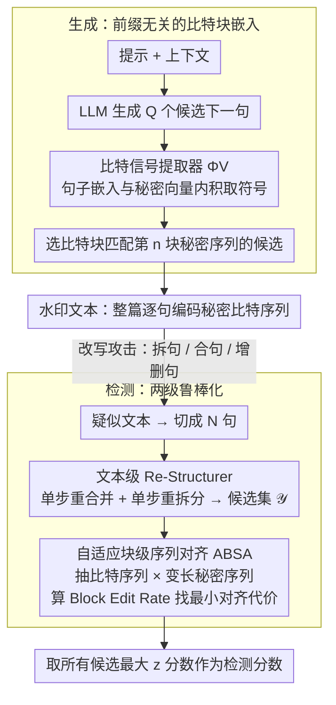

# AliMark: Enhancing Robustness of Sentence-Level Watermarking Against Text Paraphrasing

**会议**: ICML 2026  
**arXiv**: [2605.29434](https://arxiv.org/abs/2605.29434)  
**代码**: https://github.com/imethanlee/AliMark  
**领域**: LLM安全 / 文本水印  
**关键词**: 句子级水印, 文本改写鲁棒性, 序列对齐, 结构扰动, 水印检测  

## 一句话总结
AliMark 将句子级文本水印从“前缀条件下的逐句检测”改写为“全局秘密比特序列的编码与对齐”，通过重构候选文本和自适应块编辑距离显著提升了对 DIPPER、GPT-3.5 等强改写攻击的检测鲁棒性。

## 研究背景与动机
**领域现状**：LLM 文本水印通常分为 token 级和句子级两类。token 级方法在解码时偏置采样分布，检测时统计 token 级信号；句子级方法则把水印锚定在语义嵌入空间，希望在同义改写后仍能保留检测信号。

**现有痛点**：token 级水印容易被同义替换和重写破坏，句子级水印虽然更抗词面改写，但很多方法沿用了 KGW 式前缀设计：某一句的水印信号取决于前一句或上下文。当改写器把一句拆成两句、把两句合成一句，或者插入删除句子时，后续句子的“前缀”全部错位，检测信号会级联丢失。

**核心矛盾**：句子级水印希望依赖语义稳定性，但前缀条件又把每个句子的检测绑定到局部结构。强改写器破坏的往往不是语义，而是句子边界和上下文顺序，因此局部前缀哈希会把结构扰动放大成多句信号失效。

**本文目标**：论文想解决三个具体问题：如何在生成阶段嵌入不依赖局部前缀的句子级信号，如何在检测阶段容忍句子拆分与合并，如何在不显著牺牲文本质量的情况下维持强改写后的低误报检测能力。

**切入角度**：作者观察到 GPT-3.5 改写 C4 文本时经常改变句子数量，说明“句子边界变化”不是边缘攻击，而是强 paraphraser 的常规行为。于是他们借鉴 token 水印中处理插入删除的序列对齐思想，把整篇文本看成一个比特块序列来匹配秘密序列。

**核心 idea**：用全局秘密比特序列替代前缀依赖的句间伪随机关系，再用文本重构和块级编辑距离对齐来吸收句子拆分、合并、插入和删除造成的偏移。

## 方法详解
AliMark 的关键不是再设计一个更复杂的局部 hash，而是把“每一句是否命中绿色区域”换成“整篇文本是否像一段秘密比特序列”。这个视角改变了生成和检测两端的接口：生成时每个句子负责承载一个固定长度的比特块，检测时允许抽取出的比特块序列和秘密序列之间存在块级插入、删除与替换。

### 整体框架
生成阶段，给定提示和已有上下文，LLM 一次生成 $Q$ 个候选下一句。AliMark 用句子嵌入器把每个候选句映射到语义向量，再和一组正交秘密向量做内积；第 $m$ 个内积的符号决定该句子的第 $m$ 个水印比特。全局秘密序列被切成长度为 $M$ 的块，第 $n$ 个句子需要匹配第 $n$ 个秘密块。若有候选句完全匹配，随机选一个；若没有，则选匹配位数最多的候选。

检测阶段，输入文本先被切成句子，然后进入两级鲁棒化流程。第一级 Re-Structurer 对文本做一轮可能的重合并和重拆分，形成原文本、每个相邻句对合并后的文本、每个句子拆分后的文本。第二级 Adaptive Bit Sequence Alignment 对每个候选文本抽取比特块序列，并把它和不同长度的秘密序列候选做动态规划对齐。最终取所有候选中的最大水印得分作为检测分数。

### 关键设计
**1. 前缀无关的比特块嵌入：让信号挂在句子自身、不依赖前缀。** 前缀式句子级水印的命门是把每句的检测区域绑定到前一句，改写器一旦拆句、合句或增删句子改变了句子边界，后续句子的“前缀”就全部错位，检测信号级联丢失。AliMark 改用一条全局秘密比特序列 $\mathbf{s}$ 作为与上下文无关的水印钥匙，切成长度为 $M$ 的块，第 $n$ 句负责承载第 $n$ 块。生成时对每个候选句的语义嵌入 $\mathbf{e}$ 和一组预定义正交秘密向量 $\mathbf{v}_m$ 算内积，第 $m$ 位比特由内积符号决定（$\langle \mathbf{e},\mathbf{v}_m\rangle<0$ 记 0，否则记 1），$M$ 位符号合成该句的比特块；再从 $Q$ 个候选里挑比特块完全命中第 $n$ 块的句子，若没有就挑匹配位数最多的。这样信号只挂在当前句子的语义上、与前缀解耦，单处边界变动不再拖垮后面所有句子，整篇文本被编码成一段可从全局视角对齐的比特序列。

**2. 文本级 Re-Structurer（RS）：检测前主动复原被改写器破坏的句子边界。** 既然攻击破坏的主要是句子边界而非语义，RS 就在比特对齐之前先试着把边界“掰回去”：对 $N$ 句文本枚举 $N-1$ 个相邻句对的单步重合并候选 $\mathcal{X}^-$ 和 $N$ 个单句的单步重拆分候选 $\mathcal{X}^+$，连同原文本一起组成候选集 $\mathcal{Y}$ 交给下游对齐。如果文本本是水印文本，总有某个重构候选能部分恢复原始结构、让比特块重新对上，从而抬高整篇得分；而对人写文本，这些重构不会带来一致的对齐增益。论文刻意只做单步操作而非枚举多步组合——DIPPER、GPT-3.5 最常见的结构扰动就是一两处拆分或合并，单步候选能以可控代价覆盖绝大多数情形。

**3. 自适应块级序列对齐（ABSA + BER）：用块级编辑距离吸收剩余错位。** RS 之后仍可能残留句子数偏差，ABSA 在比特层把每个重构候选的比特序列 $\mathbf{b}_{\mathbf{Y}}$ 和一组块数在 $[\alpha N', \beta N']$ 之间变化的变长秘密序列候选逐一对齐，应对结构没完全复原（含对抗性增删句）的情况。对齐代价用 Block Edit Rate（BER）衡量——它把标准 Levenshtein 距离升级到块级：块的插入与删除代价为 $M$，块替换代价为两个比特块的汉明距离，经动态规划求最小块编辑距离并归一化，再转换成水印 $z$ 分数。关键在于结构扰动通常以整句为单位整块影响比特，普通比特级编辑距离会低估这种块级偏移，BER 的错误粒度才与句子级水印对得上。最终所有重构候选 × 变长秘密序列的对齐里取最大 $z$ 分数当作检测分数。

### 损失函数 / 训练策略
AliMark 本身不是一个需要端到端训练的水印模型，主要依赖冻结的 LLM、冻结的句子嵌入器和随机生成的秘密向量。生成端的核心超参是每句比特块大小 $M$ 和候选句预算 $Q$；检测端的核心超参是重构候选数量、秘密序列长度范围 $[\alpha N',\beta N']$ 以及 BER 动态规划。作者默认使用 all-mpnet-base-v2 作为句子嵌入器，并用 vLLM 降低生成多个候选句的 KV-cache 开销。

## 实验关键数据

### 主实验
论文在 Booksum 和 C4 上各采样 500 个样本，用 OPT-1.3B 和 Qwen3-1.7B 作为生成骨干，并用 Pegasus、Parrot、DIPPER、GPT-3.5 四类 paraphraser 攻击。下面摘取 OPT-1.3B 下最能体现结构扰动鲁棒性的 TPR@5% 结果。

| 数据集 | 攻击 | AliMark TPR@5% | 最强基线 TPR@5% | 主要差距 |
|--------|------|----------------|------------------|----------|
| Booksum | DIPPER | 61.6 | 30.4 (PMark) | +31.2 |
| Booksum | GPT-3.5 | 66.6 | 33.0 (PMark) | +33.6 |
| C4 | DIPPER | 49.8 | 29.6 (PMark) | +20.2 |
| C4 | GPT-3.5 | 51.6 | 28.2 (PMark) | +23.4 |
| Booksum | Pegasus | 95.6 | 86.0 (PMark) | +9.6 |
| C4 | Parrot | 91.2 | 89.4 (PMark) | +1.8 |

### 消融实验
作者从嵌入器、候选预算和检测模块三个角度做分析。下表保留最关键的数值：嵌入器和候选预算用 TPR@5%，检测模块用运行时间说明额外鲁棒性的代价。

| 配置 | 关键指标 | 说明 |
|------|---------|------|
| all-mpnet-base-v2 | Booksum/GPT-3.5 TPR@5% 66.6 | 默认嵌入器，整体最稳 |
| all-distilroberta-v1 | Booksum/GPT-3.5 TPR@5% 56.8 | 可用但强改写下明显下降 |
| multi-qa-mpnet-base-dot-v1 | Booksum/GPT-3.5 TPR@5% 55.2 | 语义空间不如默认嵌入器适配水印块 |
| $Q=8$ | Booksum/GPT-3.5 TPR@5% 29.6 | 候选句太少，很难匹配秘密块 |
| $Q=64$ | Booksum/GPT-3.5 TPR@5% 66.6 | 更高候选预算显著提升可嵌入性 |
| AliMark 检测 | 128 句耗时 0.34s | RS 和自适应对齐带来可接受开销 |
| w/o RS | 128 句耗时 0.07s | 更快，但强结构扰动下检测率下降最大 |
| w/o Ada | 128 句耗时 0.27s | 少了可变长度对齐，对删除插入更弱 |

### 关键发现
- AliMark 的优势主要出现在 DIPPER 和 GPT-3.5 这种会改变句子结构的强 paraphraser 上，说明论文抓住的是句子级水印最脆弱的核心失效模式。
- Re-Structurer 比自适应长度对齐更关键；去掉 RS 后强改写场景下降更明显，因为拆分和合并首先破坏的是句子边界。
- 文本质量影响较小。OPT-1.3B 和 Qwen3-1.7B 在不同 $M$ 下的 PPL 与无水印输出接近，但 $M$ 太大时会让候选句语义空间更受约束。

## 亮点与洞察
- 把 sentence-level watermark 改写成 sequence alignment 是这篇论文最强的抽象。它没有继续修补前缀哈希，而是承认句子边界会漂移，并把漂移看成可对齐的序列偏移。
- BER 的设计很贴合任务粒度。句子拆分或合并不是独立 bit 错误，而是整块错位；用块插入、块删除和块替换刻画错误，比普通编辑距离更自然。
- 单步重构是一个务实选择。它不能解决所有复杂改写，但覆盖常见结构扰动，并把检测开销控制到可部署范围。

## 局限与展望
- RS 只做单步拆分或合并，面对多处连续结构变化、语义重排或段落级改写时恢复能力有限。
- 生成端依赖较大的候选句预算 $Q$，虽然 vLLM 能缓解开销，但对低延迟生成场景仍是负担。
- 检测仍依赖句子分割和嵌入器质量，跨语言、代码混杂文本或极短文本上的稳定性还需要进一步验证。
- 未来可以学习一个轻量级结构恢复器，按概率选择最可能被拆分或合并的位置，而不是枚举所有单步候选。

## 相关工作与启发
- **vs KGW / SynthID 等 token 级水印**: token 级方法高效但依赖词面分布偏置，强改写后信号容易消失；AliMark 把信号放到句子语义块上，更适合 paraphrase 鲁棒检测。
- **vs SemStamp / k-SemStamp**: 这些句子级方法依赖前缀关系，结构扰动会级联破坏后续句子；AliMark 使用全局秘密序列和对齐，避免局部前缀错位放大。
- **vs PMark / SimMark**: 这些方法在弱改写下已经较强，但对句子拆合仍敏感；AliMark 的增益说明水印鲁棒性需要显式建模结构扰动，而不仅是语义相似性。
- **启发**: 任何把长文本切成局部单元做认证、溯源或一致性检测的任务，都可以借鉴“局部信号 + 全局序列对齐”的框架来吸收插入删除错误。

## 评分
- 新颖性: ⭐⭐⭐⭐☆ 关键创新是把句子级水印检测重构为块级序列对齐，思路清晰且击中真实攻击模式。
- 实验充分度: ⭐⭐⭐⭐☆ 覆盖多个数据集、骨干、paraphraser 和模块消融，但更复杂的人类改写与跨语言场景还不够。
- 写作质量: ⭐⭐⭐⭐☆ 动机分析、方法拆解和实验问题组织得比较顺，公式和算法能支撑实现。
- 价值: ⭐⭐⭐⭐☆ 对文本水印落地很有参考价值，尤其适合需要抵抗自动 paraphrase 的溯源场景。

<!-- RELATED:START -->

## 相关论文

- [\[ACL 2026\] Subject-level Inference for Realistic Text Anonymization Evaluation](../../ACL2026/llm_safety/subject-level_inference_for_realistic_text_anonymization_evaluation.md)
- [\[NeurIPS 2025\] Enhancing CLIP Robustness via Cross-Modality Alignment](../../NeurIPS2025/llm_safety/enhancing_clip_robustness_via_crossmodality_alignment.md)
- [\[NeurIPS 2025\] Adversarial Paraphrasing: A Universal Attack for Humanizing AI-Generated Text](../../NeurIPS2025/llm_safety/adversarial_paraphrasing_a_universal_attack_for_humanizing_ai-generated_text.md)
- [\[ICLR 2026\] PMark: Towards Robust and Distortion-free Semantic-level Watermarking with Channel Constraints](../../ICLR2026/llm_safety/pmark_towards_robust_and_distortion-free_semantic-level_watermarking_with_channe.md)
- [\[ICML 2026\] Watermarking LLM Agent Trajectories (ACTHOOK)](watermarking_llm_agent_trajectories.md)

<!-- RELATED:END -->
