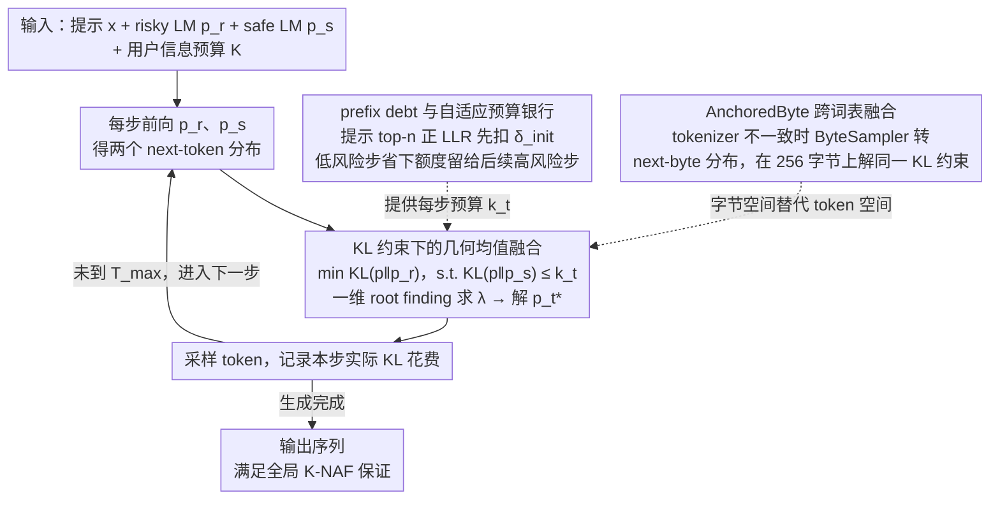

# Anchored Decoding: Provably Reducing Copyright Risk for Any Language Model

**会议**: ICML2026  
**arXiv**: [2602.07120](https://arxiv.org/abs/2602.07120)  
**代码**: 无公开代码链接（本地缓存未包含代码仓库）  
**领域**: LLM安全 / 版权风险缓解  
**关键词**: 版权记忆, 推理解码, 安全参考模型, KL约束, ByteSampler  

## 一句话总结
本文提出 Anchored Decoding：在推理时把高性能但可能复现训练数据的 risky LM 锚定到只用开放许可数据训练的 safe LM 附近，用可调的信息预算在版权复制风险和生成质量之间给出有形式保证的折中。

## 研究背景与动机
**领域现状**：大语言模型的能力很大程度来自大规模网页语料预训练，而这些语料常常混合了开放许可文本、版权保护文本和来源不清的内容。已有研究表明，模型不只学习抽象模式，也可能记住训练集中出现过的片段，并在特定提示下逐字输出书籍、新闻或其他受保护文本。

**现有痛点**：如果想从根源上消除版权材料，最直接的办法是清洗数据后重新训练模型，但这对前沿模型几乎不可承受，而且版权文本往往质量高，简单剔除会牺牲下游能力。部署阶段常见的系统提示、n-gram 阻断或检索式拒绝策略又比较脆弱：系统提示难以显著降低复制，硬阻断依赖外部片段库，且容易把表面重复和真正侵权风险混在一起。

**核心矛盾**：高能力 risky LM 具有更强的流畅性、事实性和长尾知识，但也更可能复现受保护训练样本；safe LM 的训练来源更干净，却通常规模更小、能力更弱。本文要解决的不是“只用安全模型”或“只用强模型”，而是在每一步生成中控制 risky LM 偏离 safe LM 的程度，让输出尽量保留强模型效用，同时不会无限制地跟随可能来自记忆的分布峰值。

**本文目标**：作者希望得到一种无需重训练、无需访问原始训练数据、能接到任意可输出 logits 的语言模型上的推理时方法。这个方法需要有一个用户可调的风险旋钮，能够在序列级别满足相对于 safe LM 的 $K$-NAF 信息预算约束，并且在真实长文本复制评测中比现有缓解方法保持更好的效用。

**切入角度**：论文把 safe LM 看作“可信锚点分布”，把 risky LM 看作“高效用候选分布”。如果 risky LM 对某个续写特别自信，而 safe LM 并不支持，这种分布差异往往对应训练数据记忆或版权敏感状态；因此可以把两者的 KL 差异作为风险信号，并把每一步的解码分布投影到 safe LM 附近。

**核心 idea**：用 KL 预算约束下的分布投影，把 risky LM 和 safe LM 的 next-token 分布融合成一个既接近 risky LM、又被 safe LM 严格锚定的解码分布。

## 方法详解
Anchored Decoding 的核心是一个推理时两模型融合器。它不改动模型参数，也不要求知道 risky LM 训练集中到底包含了哪些文本；只要能拿到 risky LM 与 safe LM 在当前前缀下的 logits，就可以在每个解码步计算一个新的采样分布。这个新分布不是简单线性插值，而是由“尽量接近 risky LM，同时相对 safe LM 的 KL 不超过当前预算”这一局部优化问题推出。

### 整体框架
输入是一段用户提示 $x$、一个可能含版权记忆的 risky LM $p_r$、一个只用开放许可数据训练的 safe LM $p_s$、最大生成长度 $T_{max}$，以及用户选择的全局信息预算 $K$。系统先根据提示本身计算 prefix debt，用来判断提示是否已经强烈触发了 risky LM 的记忆模式。然后在每个解码步同时前向 $p_r$ 和 $p_s$，得到两个 next-token 分布。

如果当前剩余预算较宽，融合分布会更靠近 $p_r$，从而保留高性能模型的语言质量和事实性；如果当前前缀看起来风险高，或之前步骤已经花掉了较多预算，融合分布会更靠近 $p_s$。最终生成序列的每一步局部 KL 花费都会被记录进累积账本。论文证明，只要每步预算之和不超过 $K$，整个序列分布就满足相对于 safe LM 的全局 $K$-NAF 保证。

为了突破共享 tokenizer 的限制，论文还提出 AnchoredByte Decoding。它借助 ByteSampler 把 token-level LM 转成精确的 next-byte 分布，在 256 个字节上做同样的 KL 约束融合。这样 safe LM 和 risky LM 即使用不同 BPE tokenizer，也可以在字节层面组合。

### 关键设计
1. **KL 约束下的几何均值融合**:

	- 功能：在每个解码步构造一个新的分布 $p_t^*$，让它尽量接近 risky LM 的分布，同时保持在 safe LM 的局部 KL 预算内。
	- 核心思路：局部问题可以写成 $\min_p D_{KL}(p \| p_r)$，约束是 $D_{KL}(p \| p_s) \le k_t$。其闭式形式是两个分布的加权几何均值：$p_t^* \propto p_s^{\lambda/(1+\lambda)} p_r^{1/(1+\lambda)}$。拉格朗日乘子 $\lambda$ 由一维 root finding 求出；当预算很小，$\lambda$ 较大，分布靠近 $p_s$，预算较大时则靠近 $p_r$。
	- 设计动机：线性插值只能给经验折中，难以直接对应序列级风险保证；这个投影形式从优化目标推出，因此每一步的“效用最大化”和“风险边界”是同一个数学问题的两面。

2. **prefix debt 与自适应预算银行**:

	- 功能：把提示本身的风险纳入解码预算，并允许低风险步骤省下预算给后续高风险步骤使用。
	- 核心思路：论文计算提示中每个位置的 log-likelihood ratio，形式为 $\ell_i(x)=\log p_r(x_i|x_{<i})/p_s(x_i|x_{<i})$，取最大的若干个正 LLR 的平均作为 $\delta_{init}(x)$。如果提示像著名小说开头那样明显更受 $p_r$ 支持，就先扣掉一部分预算，使早期解码更依赖 $p_s$。随后每步预算设为 $k_t=\max(0,(t+1)k-\sum_{i<t}a_i-\delta_{init})$，其中 $a_i$ 是实际 KL 花费。
	- 设计动机：复制事件在实验中明显前置，开头几步最容易顺着记忆文本滑下去；固定每步预算又会在模型自然一致的步骤浪费安全额度。prefix debt 负责“开头更保守”，预算银行负责“该省则省、该花再花”。

3. **AnchoredByte 的跨词表融合**:

	- 功能：让 safe LM 和 risky LM 不共享 tokenizer 时仍能使用同一套锚定思想。
	- 核心思路：ByteSampler 根据模型 token 分布和当前字节前缀，精确边缘化得到 next-byte 分布；AnchoredByte 在字节空间 $\mathcal{B}=\{0x00,\ldots,0xFF\}$ 上解同样的 KL 约束问题。由于英文中一个 token 大约对应 4 个字节，论文把字节生成长度设为 $B_{max}\approx 4T_{max}$，并把总预算写成 $K=kB_{max}$。
	- 设计动机：版权安全场景下最可信的 safe 模型未必和热门 risky 模型用同一个 tokenizer，例如 Comma 7B 使用自定义 tokenizer。字节层融合牺牲一些推理效率，但显著扩大了可组合模型对。

### 损失函数 / 训练策略
Anchored Decoding 本身不训练 risky LM，也不微调 safe LM；它是纯推理时算法。唯一新增模型是 TinyComma 1.8B：作者为了和 Llama 3.1 tokenizer 对齐，训练了一个 decoder-only safe LM，使用 Common Pile 中 169.5B 个开放许可 token。训练分两阶段：先在整个 Common Pile 上训练 156B token，再用 13.5B token 的高质量混合数据 cooldown，其中包含 70% Wikimedia、15% DOAB 和 15% Data Provenance Initiative 数据。

TinyComma 1.8B 的模型规模约 17.6 亿参数，hidden size 为 2048，24 层，32 个注意力头，并使用 Llama 3 系列的 128K 词表。作者强调 TinyComma 的目的不是刷新小模型榜单，而是提供一个来源清晰、tokenizer 兼容、足够可用的安全锚点。

## 实验关键数据

### 主实验
论文用 Books 域评估版权复制风险，包含 CopyBench 中 16 本仍受美国版权保护、且被认为容易被 LLM 记住的小说片段。复制风险不是单一指标，而是 ROUGE-1、ROUGE-L、MinHash、ACS、word-level LCS 和 character-level LCS 的归一化平均，记为 Normalized Copyright Reduction（NCR）。NCR 表示相对 risky baseline 到 safe reference 的复制差距关闭了多少，论文把 NCR 至少 75% 定义为 high-protection operating point。

效用分两类：Books 续写的流畅性由 Prometheus-v2 按 1 到 5 分评价；事实性在 Bios biography prompts 上用 FActScore 的 supported claim precision 衡量。主实验覆盖六组 safe/risky 模型对，其中 token-level 只用于 TinyComma 1.8B + Llama 3.1 70B，其余 tokenizer 不匹配的组合使用 byte-level 方法。

| 方法 | 模型对 / 粒度 | 高保护阈值下事实性 | 高保护阈值下流畅性 | 关键信息 |
|------|---------------|-------------------|-------------------|----------|
| Safe reference | TinyComma 1.8B / Llama 3.1 70B，token | 0.09 | 3.00 | 风险低但质量弱 |
| MemFree | 同上，token | 0.37 | 3.18 | 能到阈值，但效用损失大 |
| RCAD | 同上，token | 0.37 | 3.38 | 比 MemFree 流畅，但仍低于两模型方法 |
| CP-Fuse | 同上，token | 0.20 | 3.21 | 假设更强，效用不理想 |
| TokenSwap | 同上，token | 0.44 | 3.77 | 最强基线之一，但依赖 token seed list |
| Anchored Decoding | 同上，token | 0.53 | 4.02 | 达到 high-protection 的同时保留最高效用 |
| AnchoredByte Decoding | Comma 7B / Llama 3.1 70B，byte | 0.52 | 4.23 | 跨 tokenizer 场景下优于 RCAD、CP-Fuse、TokenSwap |
| AnchoredByte Decoding | Comma 7B / Llama 4 Scout 17Bx16E，byte | 0.56 | 4.46 | 六组模型对中仍保持强 Pareto 表现 |

从主结果看，Anchored/AnchoredByte 在高保护区间内基本定义了新的 Pareto frontier。尤其是 token-level TinyComma + Llama 3.1 70B 组合中，它把事实性提升到 0.53、流畅性提升到 4.02，而强基线 TokenSwap 只有 0.44 / 3.77。byte-level 场景也类似，例如 Comma 7B + Llama 3.1 70B 下 AnchoredByte 达到 0.52 / 4.23，明显高于 CP-Fuse 的 0.23 / 3.75 和 RCAD 的 0.46 / 3.46。

### 消融实验
论文选择 TinyComma 1.8B + Llama 3.1 70B 的 token-level 设置做三类消融：优化目标、prefix debt、预算分配。图 3 的结论是，完整 Anchored Decoding 在事实性和流畅性两个方向都更接近右上角。

| 配置 | 被替换的设计 | 观察到的影响 | 说明 |
|------|--------------|--------------|------|
| NoOpt | 不做 KL 投影，只在 risky 分布满足预算时采 risky，否则采 safe | Pareto 曲线明显变差 | 说明闭式投影不是装饰，而是在局部保留效用的关键 |
| ColdStart | 前若干步只采 safe，之后采 risky | 比完整方法差 | 固定冷启动不能适配不同提示的实际风险 |
| Anchored Decoding∞ | 用 $\infty$-Rényi divergence 替代 KL | 流畅性较强但事实性较弱 | 提供更偏 worst-case 的替代保证 |
| NoDebt | 移除 prefix debt | 风险-效用曲线退化 | 提示级风险信号对前置复制很重要 |
| AvgDebt | 用所有 prefix LLR 平均而非 top-n tail statistic | 稳定劣于 top-n debt | 高风险来自尾部异常，而不是整体均值 |
| Fixed | 每步固定预算，不滚动未使用额度 | 比自适应预算保守 | 低风险步骤浪费预算，高风险步骤不够用 |
| Global | 一开始给全局预算，用完后切 safe | 效果不如预算银行 | 容易早期过度花费，后续生成质量断崖式下降 |

### 关键发现
- 高保护阈值下，Anchored Decoding 不只是降低复制风险，还比基线保留更多事实性和流畅性；这说明“锚定到 safe LM”比简单阻断或系统提示更细粒度。
- prefix debt 的 top-n LLR 设计和实验现象一致：版权文本提示的 LLR 右尾更重，而复制事件也集中在生成开头，因此开局保守能精准打击风险峰值。
- 自适应预算比固定预算更合理，因为模型间差异是非均匀的；在普通步骤省下来的 KL 预算可以用于偶发的高风险但仍有用的步骤。
- 效率上，token-level Anchored Decoding 的 wall-clock TPS slowdown 约 1.1×，TTFT 为 195.9 ms；相比 RCAD 的 2.0× slowdown，它更接近部署可接受范围。
- byte-level 版本解决了 tokenizer mismatch，但 prefix debt 的首字节延迟较高。附录报告 AnchoredByte 的 prefix debt 会使 TTFB 明显上升，作者建议预计算 prefix LLR 或在部分场景省略 debt。
- 下游任务 sanity check 中，Anchored Decoding 在 $k=1.5$ 的高保护代表点上接近 Llama 3.1 70B：TruthfulQA MC1 为 0.303 对 0.300，MC2 为 0.472 对 0.473，CNN/DailyMail ROUGE 为 0.139 对 0.156，HumanEval pass@1 为 0.488 对 0.506。

## 亮点与洞察
- **把版权风险写成推理时分布约束**：很多版权缓解方法停留在提示工程或后处理过滤，本文把问题变成“生成分布相对 safe reference 的信息距离不能超过预算”。这样做的好处是风险旋钮有数学含义，且能和效用目标一起优化。
- **safe LM 不是替代品，而是锚点**：论文没有要求 safe LM 本身足够强到直接部署，而是用它定义允许 risky LM 偏离的边界。这种思路对安全领域很有启发：可信模型可以弱一些，只要它能提供合规参考分布。
- **prefix debt 抓住了复制的时间结构**：作者不是机械地全程收紧，而是发现复制更常发生在早期，并用提示 LLR 尾部统计来提前扣预算。这比固定冷启动更细，因为只有像书籍开头这样的高风险提示才会显著触发 debt。
- **字节层融合很实用**：安全参考模型和商业/开源强模型通常不会共享 tokenizer。AnchoredByte 虽有额外开销，但把理论方法从“少数同词表模型对”推广到现实可用的跨模型组合。
- **评测设计较贴近部署权衡**：论文没有追求复制指标为零，而是以 safe LM 为安全基线，计算 risky 到 safe 的 gap 关闭比例。这避免了把自然语言中不可避免的常见表达重合误判为完全不可接受。

## 局限与展望
- **不能证明法律意义上的无侵权**：$K$-NAF 保证的是生成分布相对 safe LM 的 divergence 有界，而不是法庭意义上的版权合规证书。safe LM 自身的训练来源、许可边界和潜在泄漏仍然决定了这个保证的实际含义。
- **无法完全消除复制概率**：Anchored Decoding 是采样策略，不是离散过滤器。即使严格贴近 safe LM，只要 safe LM 对某些受保护片段也有非零概率，风险就只能被控制而不是被清零。
- **局部优化不等于全局最优**：论文把序列级约束分解为每步局部投影，这是计算上必要的近似，但不保证得到原始序列级优化问题的全局最优解。
- **KL 差异不只表示版权风险**：risky LM 与 safe LM 的差异也可能来自有价值的长尾事实或领域知识。若 safe LM 规模过小或覆盖不足，锚定会误伤非版权知识，尤其影响稀有人物事实、专业内容或长尾代码能力。
- **依赖可靠的数据来源证明**：方法要求 safe model 真正只由开放许可数据训练。如果开放许可语料中混入了受保护名句、论坛转载或引用片段，Anchored Decoding 只能把风险界定到这个含噪参考模型附近。
- **威胁模型主要覆盖参数记忆**：论文不处理用户显式把版权文本放进 prompt 后要求转换、翻译或续写的情况。这类 in-prompt 注入更像输入治理和策略执行问题，需要和检索、过滤、拒答机制结合。
- **未来方向**：作者建议把 reference-anchored paradigm 扩展到图像、视频、代码安全、隐私泄漏和企业许可语料约束等场景。只要有一个可信参考分布，就可以把高能力生成器限制在该参考附近。

## 相关工作与启发
- **vs System prompt**: 系统提示通过自然语言指令要求模型避免版权输出，但主实验中几乎不能稳定达到 high-protection threshold。Anchored Decoding 不依赖模型服从指令，而是在 logits 层改变采样分布，因此对 base model 和 instruct model 都更直接。
- **vs MemFree**: MemFree 用 n-gram blocklist 阻断精确复现，优点是机制明确，缺点是依赖参考库和表面匹配。Anchored Decoding 不需要知道具体受保护文本，通过 safe/risky 分布差异处理更广泛的记忆风险，但也不提供硬过滤式零重复保证。
- **vs RCAD**: RCAD 通过有无上下文的 logits 对比来下调受上下文强烈推动的 token，但需要额外 risky-model forward，并且在高保护区间效用下降明显。Anchored Decoding 的额外 forward 来自小得多的 safe LM，因此 token-level 开销更低，且质量保留更好。
- **vs CP-Fuse**: CP-Fuse 同样受 $K$-NAF 启发，但假设模型对称且训练数据可拆成更干净的 shard。本文使用非对称 safe/risky pairing，更符合现实部署：一个小的许可安全模型约束一个大的高效用模型。
- **vs TokenSwap**: TokenSwap 依赖预定义 function words 等 token seed list，并借助“小模型少记忆”的经验假设。Anchored Decoding 直接使用经过许可约束训练的 safe LM，并在整个分布上施加 KL 预算，对语言、词表和复制 token 类型的依赖更少。
- **启发**: 对很多安全问题，最有价值的不一定是训练一个完美安全且同样强的模型，而是训练一个可信参考模型，再让强模型在推理时被它约束。这个框架很适合与企业内部许可语料、隐私红线语料或领域政策模型结合。

## 评分
- 新颖性: ⭐⭐⭐⭐⭐ 用 KL 预算把版权风险缓解、safe reference 和两模型解码统一起来，并给出 token/byte 两种可部署形式。
- 实验充分度: ⭐⭐⭐⭐ 覆盖六组模型对、主风险效用评测、消融、效率和额外下游任务，但法律风险和非文字复制仍只做技术近似。
- 写作质量: ⭐⭐⭐⭐⭐ 论文从理论保证到算法细节再到部署约束铺陈清楚，表格、图和附录把关键假设解释得比较完整。
- 价值: ⭐⭐⭐⭐⭐ 对需要在强模型能力和版权合规之间折中的部署方很有参考价值，也为“可信锚点约束强生成器”提供了可复用范式。

<!-- RELATED:START -->

## 相关论文

- [\[ACL 2026\] RISK: A Framework for GUI Agents in E-commerce Risk Management](../../ACL2026/llm_safety/risk_a_framework_for_gui_agents_in_e-commerce_risk_management.md)
- [\[ICML 2026\] dgMARK: Decoding-Guided Watermarking for Diffusion Language Models](dgmark_decoding-guided_watermarking_for_diffusion_language_models.md)
- [\[ICML 2026\] COFT: Counterfactual-Conformal Decoding for Fair Chain-of-Thought Reasoning in Large Language Models](coft_counterfactual-conformal_decoding_for_fair_chain-of-thought_reasoning_in_la.md)
- [\[ICLR 2026\] Self-Destructive Language Model](../../ICLR2026/llm_safety/self-destructive_language_model.md)
- [\[ICML 2026\] From Parameter Dynamics to Risk Scoring: Quantifying Sample-Level Safety Degradation in LLM Fine-tuning](from_parameter_dynamics_to_risk_scoring_quantifying_sample-level_safety_degradat.md)

<!-- RELATED:END -->
