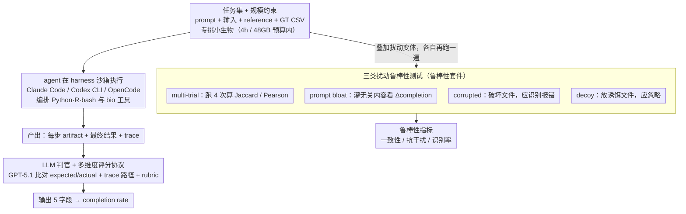

# BioAgent Bench: An AI Agent Evaluation Suite for Bioinformatics

**会议**: ICML 2026  
**arXiv**: [2601.21800](https://arxiv.org/abs/2601.21800)  
**代码**: https://github.com/bioagent-bench/bioagent-bench  
**领域**: LLM Agent / Benchmark / 生物信息学  
**关键词**: agent 评测, 生物信息学 pipeline, LLM 判官, 鲁棒性扰动测试

## 一句话总结
BioAgent Bench 给"用 LLM agent 跑生物信息学 pipeline"这件事造了一个端到端的评测套件——10 个真实 bioinformatics 任务 × 10 个 frontier/open-weight 模型 × 3 个 agent harness，配合 LLM 判官评分和 corrupted/decoy/prompt-bloat 三类扰动测试，发现前沿模型能完成 90%+ pipeline 但鲁棒性堪忧。

## 研究背景与动机
**领域现状**：LLM agent 在软件工程（SWE-bench）、通用 tool-use（AgentBench、ToolBench）上已经有成熟 benchmark；生物医学方向也有 BioML-bench、LAB-Bench、BixBench 等。但这些基准要么把任务退化成 QA / code generation，要么聚焦"数据分析"而非"完整 pipeline 执行"。

**现有痛点**：生物信息学的真实工作流极复杂——要串联命令行工具、管理异构文件格式、解释中间产物，而且评估困难，因为同一份数据有多套合理 pipeline、参数选择对结果影响巨大、很多步骤没法用 pass/fail 严格判定。直接照搬 SWE-bench 的硬匹配评测方式根本走不通。

**核心矛盾**：(1) 真实 bioinformatics 任务长（数小时）、消耗大（数十 GB 内存），而 benchmark 需要可重现、可大规模运行；(2) 多解的存在让"自动判分"和"严格 ground truth"打架；(3) 临床/IP 敏感数据无法发给闭源 API，迫使必须评估 open-weight 模型，但 open-weight 又远弱于 frontier。

**本文目标**：(i) 造一个能在合理算力预算（<4h、<48GB）下跑完的、端到端 pipeline 风格的 bioinformatics 任务集；(ii) 设计能容忍多解、用 LLM 当判官的评分协议；(iii) 在 vanilla 之外加扰动测试，分别检验 agent 对损坏数据、诱饵文件、prompt 膨胀的鲁棒性；(iv) 系统对比 5 个闭源 + 5 个开源模型在 3 个 harness 下的表现。

**切入角度**：把任务规模刻意限定在"小生物（细菌、病毒、霉菌）"的样本上，从而把 reference data 也直接打包成输入文件，规避了"agent 还要自己去下载几十 GB 基因组"这种基础设施问题，让评测专注于 pipeline 编排能力本身。

**核心 idea**：用"任务 prompt + 输入数据 + reference 数据 + 期望 CSV/TSV 输出格式"作为统一任务规范，让 LLM 判官比对 trace + outcome 给出 step-level 完成度评分，再配三类扰动测试探测"高层 pipeline 构造对 vs 低层 step-level 推理对"是否同时成立。

## 方法详解

### 整体框架
BioAgent Bench 要回答一个很实际的问题：把一个 LLM agent 丢进真实的生物信息学工作流里，它到底能不能从头到尾把 pipeline 跑通、跑稳。整套 benchmark 由三个组件咬合而成。**任务集**给出 10 个端到端任务，覆盖 RNA-seq、变异调用、元基因组、转录组定量、实验进化等子领域，每个任务打包成「自然语言 prompt + input 数据 + reference 数据 + ground-truth CSV/TSV」的统一规范。**评估 harness** 在一个 hashed 的 sandbox 目录里运行 agent，让它在 Claude Code / Codex CLI / OpenCode 三个 harness 之一中工作，可以调通用 Python 包或专用 bioinformatics 工具，最后把每一步的产物加最终结果文件交给 grader。**LLM grader** 则用 GPT-5.1 读入 input/reference 路径、expected outcome、agent 实际产出的 outcome、trace（只给文件路径不给内容）和一份 grading rubric，输出 `steps_completed` / `steps_to_completion` / `final_result_reached` / `results_match` / `f1_score` 五个字段。整套评测的 primary metric 是 completion rate，即「通过的必要 step 数 / 总 step 数」。在 vanilla 跑通之外，benchmark 还叠了一套鲁棒性套件，把「能搭出 pipeline」和「真懂每一步生物推理」拆开来探。

### 关键设计

**1. 任务集与规模约束：让端到端 pipeline 能在一张普通显卡的预算里跑完**

真实 bioinformatics 工作流动辄数小时、吃掉几十 GB 内存，还要 agent 自己去下载几十 GB 的参考基因组——这些都让大规模、可重现的评测寸步难行。BioAgent Bench 的破局点是把任务规模刻意压到 <4h、<48GB，办法是专挑「小生物」做样本：小鼠 Alzheimer 模型、E. coli 实验进化、海豚病毒元基因组等，它们的 reference data 小到能直接塞进任务输入文件里，于是「找参考、下载、stage」这类基础设施杂活被整体跳过，评测得以聚焦在 pipeline 编排能力本身。10 个任务横跨 bulk/single-cell RNA-seq、比较基因组学、变异调用（细菌进化 + GIAB NA12878 + 囊性纤维化）、病毒元基因组、转录定量等，实现语言混用 Python / R / bash；其中 4 个（cystic-fibrosis、giab、transcript-quant、viral-metagenomics）是 "verifiable" 的，可做二元 pass/fail 判定。每个任务都硬性要求「端到端执行 + 结构化 CSV 输出」。作者特意把整个 benchmark 定位成「软件工程类」而非「生物数据分析类」，因为前者更便于未来接 RL / distillation 等训练用途——代价是放弃了对人类基因组级真实工作流的覆盖。

**2. LLM 判官 + 多维度评分协议：用软判分替硬匹配，给「方向对、格式错」的 agent 部分信用**

bioinformatics 任务天然多解——同一份变异调用既能用 GATK4 HaplotypeCaller 也能用 DeepVariant，硬编码一份 ground-truth 去做精确匹配根本走不通。BioAgent Bench 改用 GPT-5.1 当 grader，喂给它 (input/reference 路径, expected CSV, agent 产出的 CSV, trace 的文件路径树, grading rubric)，rubric 明确优先看「pipeline 完成度」而非数值精确性，输出五个字段：`steps_completed`（已完成步数）、`steps_to_completion`（任务所需总步数估计）、`final_result_reached`（是否产出最终 artifact）、`results_match`（rubric 规则下的正确性 flag）、`f1_score`（仅 giab 适用）。关键巧思有两处：让 grader 读 trace 而不是只看最终输出，就能给「高层把 pipeline 搭对了、只是最后输出格式没对齐」的情况发部分信用，这比 SWE-bench 式的硬 pass/fail 更接近人类专家的打分直觉；而 trace 只暴露文件路径树、不暴露文件内容，既保护了敏感的临床/IP 数据，又压低了 grader 的 token 消耗。

**3. 三类扰动鲁棒性测试：把「跑得通」和「靠谱」分开，专门探 agent 是真懂还是模式匹配**

作者的核心论点是 high-level pipeline construction ≠ reliable step-level reasoning——只看 vanilla completion rate 会系统性高估 agent 的生物推理能力。为此他们在 vanilla 之外加了三类正交的扰动，每类瞄准一种失败模式。**Multi-trial 一致性**让同一任务跑 4 次，对分类结果（KEGG pathways、Gene IDs）算 Jaccard、对数值结果（p-value、abundance）算 Pearson，看 agent 每次跑出来的中间决策稳不稳。**Prompt bloat** 在原 prompt 上灌大段无关内容，观察 completion rate 的变化量 $\Delta$，测的是抗干扰鲁棒性。**Corrupted input** 人为破坏 FASTQ/BAM 等输入文件，理想的 agent 应当识别并报错（标 ✓ 表示成功识别），测的是认知能力。**Decoy input** 则在目录里多放几个不该用的诱饵文件，理想的 agent 应当忽略它们（标 ✗ 表示没被诱骗），测的是「先验地知道该用哪个文件」的注意力判断。把 corrupted / decoy / bloat 拆成三个独立探针，比笼统跑一次 stress test 更能精确定位 agent 到底栽在哪一环。

### 损失函数 / 训练策略
benchmark 性质，无训练；评测端用 GPT-5.2 在 Codex CLI harness 作为主 robustness 评估模型，"high" reasoning effort 默认开启。

## 实验关键数据

### 主实验
在 vanilla setting 下 10 个任务的 average completion rate（Codex CLI harness）：

| 模型类型 | 模型 | 平均 completion% |
|----------|------|------------------|
| 闭源 frontier | Claude Opus 4.5 | **100** |
| 闭源 frontier | Gemini 3 Pro / GPT-5.2 / Sonnet 4.5 | >90 |
| Open-weight 最佳 | GLM-4.7 | 82.5 |
| Open-weight 其它 | 各种 | 低至 ~65 |

**Planning vs Execution**：仅给"高层 pipeline 计划"打分（GPT-5.1 用 1-5 评判），与 end-to-end completion rate 的 Pearson r=0.61，相关但不决定性——例如 Gemini-Pro-3 计划评分弱但执行强，说明 open-weight 的瓶颈更多在"多轮 agentic 能力"而非"领域知识"。

### 消融实验
Multi-trial 稳定性（GPT-5.2 在 Codex CLI 跑 4 次，对每个任务算 Jaccard / Pearson）：

| 任务 | Jaccard | Pearson | 说明 |
|------|---------|---------|------|
| transcript-quant | 1.000 | 1.000 | 完全确定性 |
| cystic-fibrosis | 1.000 | NA | 高一致性 |
| deseq | 0.978 | 0.995 | 几乎稳定 |
| viral-metagenomics | 0.667 | 1.000 | 数值稳但分类有抖动 |
| metagenomics | 0.395 | 0.746 | 中等 |
| alzheimer | 0.160 | 0.219 | 不稳定 |
| comparative-genomics | 0.004 | NA | 几乎完全不一致 |
| evolution | 0.000 | NA | 完全不一致 |

平均 Jaccard 0.43、Pearson 0.73——同一 agent 跑同一任务 4 次，分类结果重叠不到一半。

扰动测试（GPT-5.2 单 trial，Δ% 为 prompt-bloat 后 completion 变化）：

| 任务 | 识别出 corrupted? | 抵御 decoy? | Δ completion (%) |
|------|-------------------|-------------|------------------|
| alzheimer-mouse | ✗ | ✗ | -12.5 |
| comparative-genomics | ✗ | ✓ | -20.0 |
| deseq | ✓ | ✗ | **-100.0** |
| evolution | ✓ | ✗ | +75.0 |
| giab | ✓ | ✗ | — |

### 关键发现
- **前沿模型不需要复杂 scaffolding**——Claude Opus 4.5 用裸 Codex CLI 就能 100% 完成 pipeline，挑战了"必须造 agentic 框架"的假设。
- **Pipeline 构造 ≠ step-level 推理**——多次 trial 之间结果差异极大（comparative-genomics、evolution 几乎完全不一致），说明 agent 即便能"跑完"，每次跑的中间决策（参数、规范化、统计假设）也不稳定。
- **Corrupted data 识别率低**——多数任务 agent 不会识别人为损坏的输入，会傻乎乎照跑得出错误结果；唯一例外是 deseq（识别后直接报错 completion 掉 100%），反而比"硬跑"更不利。
- **Decoy 鲁棒性差**——大多数任务 agent 会被诱饵文件误用，缺少"先验地知道该用哪个文件"的判断力。
- **隐私场景下开源模型有价值**——尽管 frontier 闭源更强，但敏感患者数据不能外发，open-weight 仍是必要选项；本文给 open-weight 模型在 bioinformatics 上提供了首份系统 baseline。

## 亮点与洞察
- **任务规模 vs 评测可行性的精妙折衷**——刻意挑小生物，让 reference data 可以塞进输入文件，规避了"agent 还要自己下载 30GB human reference"的基础设施开销，这是 benchmark 能 scale 的关键。
- **LLM grader 看 trace 文件路径树而不是文件内容**——既保护了敏感数据，也降低了 grader 的 token 消耗，是个很务实的协议设计。
- **三类扰动设计**——把 corrupted（认知）/ decoy（注意力）/ bloat（鲁棒性）拆开测试，比单一 "stress test" 更能定位 agent 的失败模式。
- **首次系统对比 5 个闭源 + 5 个开源 agent 在 bioinformatics 上**，给社区一份能直接复用的 leaderboard 基础。

## 局限与展望
- **任务规模偏小**——刻意排除了 human-scale 真实工作流（如完整 30× WGS variant calling），现实部署中的"找参考、下载、stage"等基础设施步骤被完全跳过，generalization 到生产场景有限。
- **LLM 评分本身有偏**——grader 也是 LLM（GPT-5.1/5.2），可能对某些 trace 模式有偏好；且 grader 与被评 agent 同代际，存在"用 LLM 评 LLM"的循环依赖。
- **扰动测试是单 trial**——只跑一次就下结论，统计噪声大；correlation 表格里有些任务（comparative、evolution）4 次重复差异比扰动差异还大，应当报告 perturbation × seeds 的 2D 表。
- **Open-weight 仅评 pass@1**，robustness 部分完全没在 open-weight 上跑，是个明显遗憾。
- **缺少 agent loop 失败模式的定量分析**——只说"有些 frontier 模型会陷入 error-correction 循环或过早终止"，没给 trace 长度/loop 次数等量化指标。

## 相关工作与启发
- **vs SWE-bench (Jimenez et al., 2024)**：SWE-bench 用单元测试 pass/fail 严判，BioAgent Bench 用 LLM judge 软判 + step-level partial credit，更适合多解的科学计算工作流。
- **vs BioML-bench (Miller et al., 2025)**：BioML 偏 ML 流程（蛋白工程、单细胞、影像、药发），BioAgent Bench 偏 bioinformatics 工具链编排，互补关系。
- **vs LAB-Bench (Laurent et al., 2024)**：LAB-Bench 是多选题为主的"研究技能"评测，BioAgent Bench 强调实际执行能力。
- **vs BixBench (Mitchener et al., 2025)**：BixBench 偏数据分析推理，BioAgent Bench 强调端到端 pipeline 执行 + 鲁棒性扰动。
- **启示**：在任何"多解 + 多步 + 中间产物海量"的领域（量子化学、地球科学 pipeline、机器人技能链），都可以借鉴本文"LLM judge + 任务规模约束 + 三类扰动"的协议设计来造可 scale 的 agent benchmark。

## 评分
- 新颖性: ⭐⭐⭐ 协议设计务实，但任务格式和 LLM-judge 范式不算开创性
- 实验充分度: ⭐⭐⭐ 10 任务 × 10 模型 × 3 harness 覆盖较广，但扰动测试单 trial、open-weight 没做 robustness 是硬伤
- 写作质量: ⭐⭐⭐⭐ 概念清晰（task/trial/grader/harness/suite 严格区分），结果章节直白
- 价值: ⭐⭐⭐⭐ 给"用 agent 做 bioinformatics"这件事的可行性提供了首个系统答案，对实际部署有参考意义

<!-- RELATED:START -->

## 相关论文

- [\[ACL 2026\] ACIArena: Toward Unified Evaluation for Agent Cascading Injection](../../ACL2026/llm_safety/aciarena_toward_unified_evaluation_for_agent_cascading_injection.md)
- [\[ICML 2026\] Watermarking LLM Agent Trajectories (ACTHOOK)](watermarking_llm_agent_trajectories.md)
- [\[ICLR 2026\] Unlearning Evaluation through Subset Statistical Independence](../../ICLR2026/llm_safety/unlearning_evaluation_through_subset_statistical_independence.md)
- [\[ACL 2026\] Responsible Federated LLMs via Safety Filtering and Constitutional AI](../../ACL2026/llm_safety/responsible_federated_llms_via_safety_filtering_and_constitutional_ai.md)
- [\[ACL 2026\] PIArena: A Platform for Prompt Injection Evaluation](../../ACL2026/llm_safety/piarena_a_platform_for_prompt_injection_evaluation.md)

<!-- RELATED:END -->
