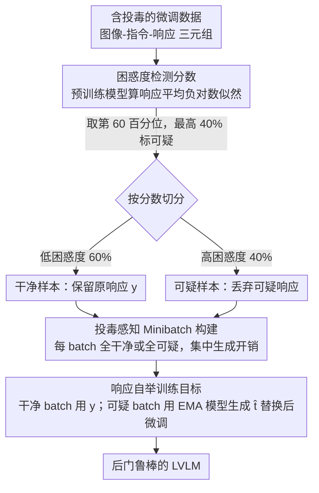

# BYORn: Bootstrap Your Own Responses to Defend Large Vision-Language Models Against Backdoor Attacks

**会议**: ICML 2026  
**arXiv**: [2606.02947](https://arxiv.org/abs/2606.02947)  
**代码**: https://github.com/ivansabolic/BYORn  
**领域**: LLM安全  
**关键词**: 后门防御, 视觉语言模型, 鲁棒微调, 响应引导, 数据投毒

## 一句话总结

BYORn 通过检测与输入语义不一致的高困惑度目标响应来识别投毒样本，并用模型自身生成的干净响应动态替换，从而打破后门触发器与恶意输出之间的关联，在保持干净任务性能的同时将攻击成功率平均降低 40 个百分点。

## 研究背景与动机

**领域现状**：监督微调（SFT）是将预训练视觉语言模型（LVLM）适配到下游任务的主流方法。通过在标注的图像-指令-响应三元组上训练，模型能够在图像描述、视觉问答等任务上获得良好表现。

**现有痛点**：近期研究揭示 SFT 极易受后门攻击影响——攻击者只需在微调数据集中注入少量投毒样本（如在图像中嵌入视觉触发器、在指令中插入特定词汇、将响应替换为恶意内容），就能让模型在推理时遇到触发器后产生指定的恶意输出。现有防御方法要么专为图像分类设计（无法处理开放式生成），要么只关注单模态触发器（如 ONION 只检测文本触发器），要么假设特定触发模式（无法应对多样化攻击）。

**核心矛盾**：开放式多模态生成场景中，防御方法必须同时应对视觉和文本两种模态的触发器，且不能依赖对触发器类型的先验假设，这使得传统分类场景中的防御策略完全失效。

**切入角度**：作者观察到投毒样本的目标响应通常与对应的图像-文本输入在语义上不一致，因此在预训练模型下具有较低的条件似然（高困惑度）。这一分布特征为无需假设触发器类型的通用检测提供了基础。

**核心 idea**：用预训练模型的困惑度分数检测可疑投毒样本，然后用模型 EMA 版本生成的干净响应替换被标记样本的目标，从而"自举"出干净的训练信号。

## 方法详解

### 整体框架

BYORn 想解决的是：怎样在不知道触发器长什么样的前提下，把混进微调数据里的投毒样本"中和"掉。它分两步走——先用预训练模型给每个样本的响应算一个困惑度分数，按百分位阈值把数据切成"干净"和"可疑"两堆；再做鲁棒微调，干净样本照原响应训练，可疑样本则丢掉它那条可疑响应、改用模型自己（EMA 版本）现场生成的响应来训练，两堆样本还按专用 minibatch 分组以省下生成开销。整套流程的优化目标，可以证明等价于在干净数据分布上最小化总体风险的一个上界。

### 关键设计

**1. 困惑度检测分数：不假设触发器类型，靠"语义对不上"揪出投毒样本**

后门防御最难的地方在于攻击者的触发器五花八门——可能藏在图像里、藏在指令词里、或者两者混合，传统方法一旦假设了某种触发模式就会被绕过。BYORn 干脆不碰触发器，只盯响应：投毒样本的恶意目标（比如不管图里是什么都要求输出 "banana"）在语义上和输入是脱节的，预训练模型自然给它很低的似然。于是对每个样本 $(\mathbf{x}, \mathbf{q}, \mathbf{y})$ 算目标响应的平均负对数似然 $s(\mathbf{y}|\mathbf{x},\mathbf{q},\theta) = -\frac{1}{K}\sum_{l=1}^{K}\ln p_\theta(y_l|\mathbf{y}_{<l},\mathbf{x},\mathbf{q})$（$K$ 为响应 token 数，除以 $K$ 是为了归掉响应长度的影响），再取第 60 百分位阈值 $\delta_{0.6}$，把困惑度最高的 40% 样本全标成可疑。阈值故意压得偏激进，宁可错杀也要保证对真投毒样本的高召回——因为后面的自举训练会把误标的干净样本"救"回来。整个检测既不需要干净参考集，也对触发器模态完全无感。

**2. 响应自举训练目标：可疑样本不删，而是换成模型自己生成的干净响应**

最直白的防御是把可疑样本直接扔掉（这就是消融里的 BYORn-F），但 40% 数据一删，干净任务性能跟着崩。BYORn 的做法是只换响应、保留输入：引入潜在干净响应 $\mathbf{t}$ 和投毒指示变量 $u$，干净样本继续用原响应 $\mathbf{y}$，可疑样本则用模型的 EMA 版本 $\theta_{\text{EMA}}^t = \lambda \cdot \theta_{\text{EMA}}^{t-1} + (1-\lambda) \cdot \theta^{t-1}$ 现场采样出替代响应 $\hat{\mathbf{t}}$ 来训练。混合目标写成 $\tilde{\mathcal{R}}_{\text{BY}} = \frac{1}{|\mathcal{D}_p|}\sum[(1-P_{\hat{u}})\cdot\mathcal{L}(\theta|\mathbf{y},\cdot) + P_{\hat{u}}\cdot\mathcal{L}(\theta|\hat{\mathbf{t}},\cdot)]$。这样触发器和恶意输出之间的关联被切断了，但那张带触发器的图、那条指令仍作为正常的视觉-文本信号参与学习，数据利用率不打折——CIDEr 从 42.4 跳到 62.0 正是这一步的功劳。用 EMA 而非当前模型来生成，是为了让替代响应的质量更稳、不被训练早期的抖动带偏。理论上，借 Donsker-Varadhan 上界和 Hoeffding 引理可证明这个目标的梯度恰好等于干净数据分布上总体风险上界的梯度，也就是说优化它真的在逼近"只在干净数据上训练"的效果。

**3. 投毒感知 Minibatch 构建：把生成开销集中起来，别让每个 batch 都卡在自回归上**

自举要为可疑样本现场生成响应，自回归解码很贵；如果按朴素随机混合，每个 batch 里都掺着可疑样本，等于每步训练都要跑一遍生成，实测训练时间翻 6 倍以上。BYORn 把检测放在训练前一次性做完，然后按干净/可疑给数据分组，让每个 minibatch 要么全干净、要么全可疑——干净 batch 直接跳过生成，可疑 batch 把生成集中批处理，可疑 batch 再在整个训练过程中均匀铺开。这一调度把额外开销从 6 倍压到 2.2 倍，而且不损模型精度。

## 实验关键数据

### 主实验：图像描述（四种攻击平均）

| 模型 | 防御方法 | Flickr CIDEr↑ | Flickr ASR↓ | COCO CIDEr↑ | COCO ASR↓ |
|------|---------|---------------|-------------|-------------|-----------|
| LLaVA | SFT (无防御) | 51.4 | 57.3% | 74.9 | 48.0% |
| LLaVA | ONION | 51.3 | 23.0% | 74.8 | 20.7% |
| LLaVA | BYE | 54.7 | 62.4% | 80.6 | 54.8% |
| LLaVA | **BYORn-F** | 42.4 | **0.3%** | 60.6 | 1.6% |
| LLaVA | **BYORn** | **62.0** | **0.0%** | **90.9** | **0.4%** |
| Qwen-VL | SFT | 60.7 | 100.0% | 66.9 | 89.8% |
| Qwen-VL | **BYORn** | 52.2 | **2.1%** | 59.6 | **2.7%** |
| InternVL | SFT | 57.3 | 99.8% | 64.9 | 71.6% |
| InternVL | **BYORn** | 56.0 | **0.8%** | 65.1 | **2.8%** |

### 消融与分析

| 实验配置 | CIDEr↑ | ASR↓ | 说明 |
|---------|--------|------|------|
| BYORn-F（仅过滤） | 42.4 | 0.3% | 丢弃 40% 数据导致 CIDEr 下降 |
| BYORn（完整方法） | 62.0 | 0.0% | 自举响应恢复性能，甚至超越 SFT |
| 阈值 p=0.3 | 55.6 | 0.0% | 标记过多干净样本，CIDEr 略降 |
| 阈值 p=0.6（默认） | 62.2 | 0.0% | 最佳平衡点 |
| 阈值 p=0.95 | 60.4 | 1.1% | 低召回但 BYORn 仍鲁棒，BYORn-F 失效（ASR 57.6%） |
| 投毒率 1% | 62.0 | 0.0% | 全投毒率范围内稳定 |
| 投毒率 50% | 61.5 | 0.2% | 极端投毒下仍有效 |
| 自适应攻击（Patch） | 62.0 | 1.6% | 语义对齐触发器下仍鲁棒 |
| 自适应攻击（对抗扰动） | 60.1 | 0.2% | PGD 优化触发器下仍鲁棒 |

### 关键发现

- BYORn 在所有模型和攻击设置下均达到 Pareto 最优（鲁棒性-泛化性最佳权衡），LLaVA 上甚至超过无防御 SFT 的 CIDEr（62.0 vs 51.4）
- 即使检测器召回率仅 50%（p=0.95），BYORn 仍能将 ASR 压至 1.1%，而 BYORn-F 在相同条件下 ASR 飙升至 57.6%——说明自举训练目标本身具有内在鲁棒性
- 面对三种自适应攻击（语义对齐触发器、PGD 对抗扰动、近似 clean-label 攻击），BYORn 均保持有效，ASR 不超过 8.4%

## 亮点与洞察

- **困惑度即安全信号**：利用预训练模型的困惑度分数作为投毒检测器，无需任何干净参考集或对触发器类型的假设，简洁且通用。这一思路可迁移到任何需要检测训练数据异常的场景（如标签噪声过滤）
- **自举替换优于简单过滤**：BYORn 相比 BYORn-F 的核心优势在于不丢弃数据——将可疑样本的目标替换为模型生成的响应，既打破了后门关联，又保留了输入端的视觉-文本信息用于正常学习。CIDEr 从 42.4 跃升至 62.0 证实了这一设计的价值
- **理论保证**：通过 Donsker-Varadhan 上界推导出 BYORn 目标等价于最小化干净数据分布上的风险上界，为实践中的超参选择（如阈值和 EMA 衰减率）提供了理论指导

## 局限与展望

- 当前防御依赖投毒响应与输入语义不一致的假设，对真正的 clean-label 攻击（恶意响应在语义上完全合理）可能失效，作者将其列为开放挑战
- 自举响应的质量受限于 EMA 模型的生成能力，在训练早期或模型容量较小时可能引入噪声
- 投毒感知 minibatch 策略虽有效降低开销，但完整 BYORn 的训练时间仍为标准 SFT 的约 3 倍（含检测 20 分钟 + 每 epoch 约 135 分钟 vs 45 分钟）
- 实验覆盖了四种攻击和三种自适应攻击，但未测试更复杂的多步攻击或多轮对话场景下的后门

## 相关工作与启发

- **ONION**：仅检测文本触发词（删除高困惑度词汇），对视觉触发器无效
- **BYE**：通过注意力分数过滤低注意力图像-文本对，但对全图触发器（Blend, VL-Trojan）失效
- **VL-Trojan / DualKey / BadNets / Blend**：本文评估的四种代表性攻击，覆盖图像补丁、全图覆盖、双模态等触发器类型
- **启发**：BYORn 的"检测-替换"框架可推广到 LLM 的指令微调安全——用困惑度检测 RLHF 数据中的恶意标注、用模型自身生成替代响应

<!-- RELATED:START -->

## 相关论文

- [\[ACL 2026\] ATAAT: Adaptive Threat-Aware Adversarial Tuning Framework against Backdoor Attacks on Vision-Language-Action Models](../../ACL2026/llm_safety/ataat_adaptive_threat-aware_adversarial_tuning_framework_against_backdoor_attack.md)
- [\[CVPR 2026\] Towards Robust Multimodal Large Language Models Against Jailbreak Attacks](../../CVPR2026/llm_safety/towards_robust_multimodal_large_language_models_against_jailbreak_attacks.md)
- [\[ACL 2025\] Merge Hijacking: Backdoor Attacks to Model Merging of Large Language Models](../../ACL2025/llm_safety/merge_hijacking_backdoor_attacks_to_model_merging_of_large_language_models.md)
- [\[ICML 2026\] TCAP: Tri-Component Attention Profiling for Unsupervised Backdoor Detection in MLLM Fine-Tuning](tcap_tri-component_attention_profiling_for_unsupervised_backdoor_detection_in_ml.md)
- [\[ACL 2025\] ELBA-Bench: An Efficient Learning Backdoor Attacks Benchmark for Large Language Models](../../ACL2025/llm_safety/elba-bench_an_efficient_learning_backdoor_attacks_benchmark_for_large_language_m.md)

<!-- RELATED:END -->
