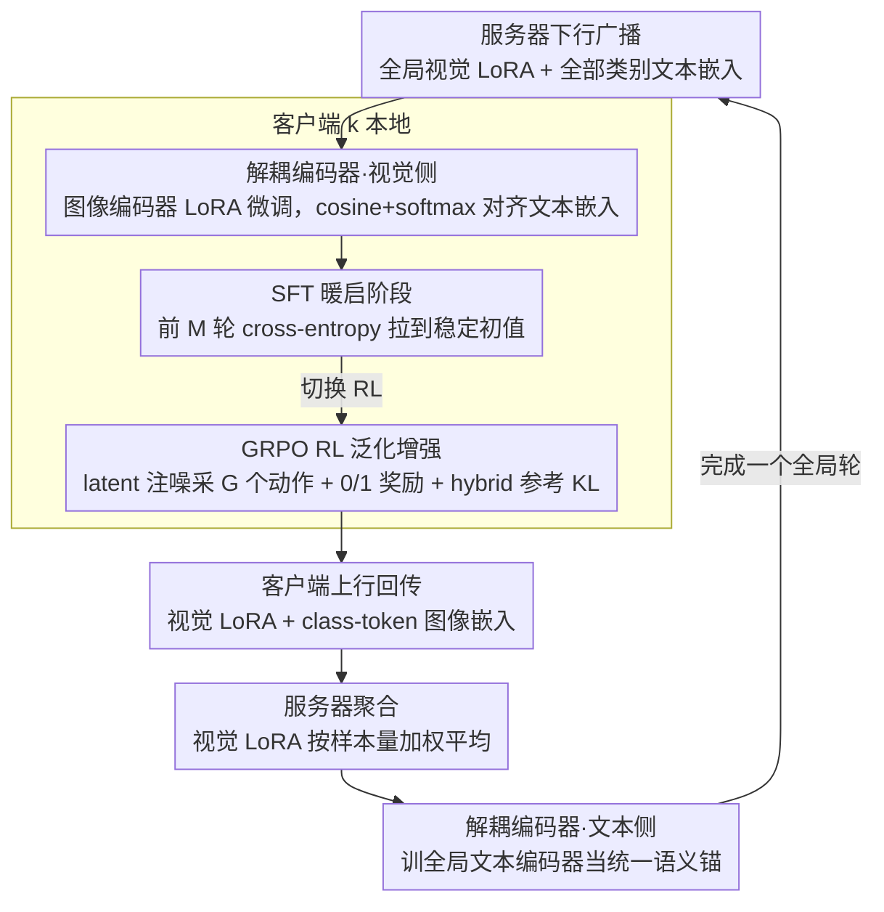

# Decoupled Training with Local Reinforcement Fine-Tuning in Federated Learning

**会议**: ICML 2026  
**arXiv**: [2605.27900](https://arxiv.org/abs/2605.27900)  
**代码**: 待确认  
**领域**: 联邦学习 / 视觉-语言模型 / 强化学习微调  
**关键词**: 联邦学习, CLIP, LoRA, GRPO, 解耦训练

## 一句话总结
FedDTL 把 CLIP 的图像编码器留在客户端、文本编码器搬到服务器做"全局语义锚"，再用 SFT 暖启 + GRPO 风格 RL 的两阶段本地微调，在异构和 full-data 联邦场景下同时缓解客户端间优化不一致与客户端内过拟合。

## 研究背景与动机

**领域现状**：联邦学习里把 CLIP 等预训练 VLM 引入下游任务已成主流，通常冻结 backbone，只在客户端做 prompt / adapter / LoRA 等 PEFT，然后服务器做参数平均聚合。

**现有痛点**：在 Non-IID 和 full-data 条件下，长轨迹的纯本地优化会同时产生两个问题：(i) **客户端间优化不一致**——每个客户端的本地目标错位、梯度方向不同，参数平均后得不到一个连贯的全局语义；(ii) **客户端内过度专门化**——本地 PEFT 参数被偏置的标签频率和特征统计"吃进去"，对未见类/未见域的泛化变差。

**核心矛盾**：现有方法基本都是"纯本地优化 + 服务器平均"+ 附加正则/对齐损失，依然依赖参数平均做跨客户端知识传递，**无法系统性解决表征层面的 client drift**；同时绝大多数评测只在 few-shot 下做，掩盖了 full-data 场景下两个问题被放大的真实情况。

**本文目标**：在 few-shot 与 full-data、label skew 与 feature shift 多种联邦数据分布下，**同时**改善全局任务适应（base 类）和泛化能力（novel 类）。

**切入角度**：作者发现 CLIP 自身的"模态解耦+对齐"和"服务器-客户端广播"在结构上高度同构——图像必须在客户端处理以保护隐私，但文本编码器只吃类别名，天然适合搬到服务器；同时 Chu et al. (2025) 的结论"SFT 倾向记忆、RL 更利泛化"提示 RL 可以替代附加正则。

**核心 idea**：**编码器跨端解耦 + SFT→RL 两阶段本地微调**——服务器训文本编码器提供统一的语义"锚"，客户端只在视觉端 LoRA 微调，本地训练先 SFT 暖启再切到 GRPO 风格 RL 抑制过度专门化。

## 方法详解

### 整体框架
FedDTL 要在 $K$ 个客户端、各持私有数据 $\mathcal{D}_k=\{(x_i,y_i)\}_{i=1}^{N_k}$ 的联邦场景下，同时压住"客户端间优化不一致"和"客户端内过拟合"两个老问题。它的招法是把 CLIP 的两塔拆到不同物理位置——图像编码器留在客户端、文本编码器搬到服务器——再在客户端本地用"先 SFT 暖启再 RL"两阶段微调。

每个全局轮 $t$ 的数据流是：服务器**下行广播**上一轮的全局视觉 LoRA $\Delta\mathbf{W}_g^{t-1}$ 和全部类别的全局文本嵌入 $\{\bar z_{\text{text}}^{c,t-1}\}_{c=1}^{C}$；客户端拿 LoRA-tuned 图像编码器 $\mathcal{V}_k$ 把本地图像编码成 $\bar z_v$、跟收到的文本嵌入算 cosine+softmax 做分类，前 $M$ 轮走 SFT、之后切 RL；本地训完只**上行**回传视觉 LoRA $\Delta\mathbf{W}_k$ 和归一化后的图像类别嵌入 $\bar z_{v,k}$（仅 class token，full-data 下还能只采子集）；服务器把各客户端视觉 LoRA 做样本量加权平均，再拿这些图像嵌入当监督训全局文本编码器 $\mathcal{T}_g$（也是 LoRA），一个全局轮就此闭合。整套结构靠"客户端视觉解耦 + 服务器文本统一"和"本地两阶段微调"两条腿，目标是在不堆额外正则的前提下同时治两病。

### 关键设计

**1. 解耦编码器训练：让服务器文本编码器当"全局语义锚"**

针对的是"纯本地优化 + 服务器参数平均"压不住的 representation-level client drift。作者发现 CLIP 的模态结构和 FL 的物理约束天然对位——图像必须留在本地（隐私），而文本编码器只吃类别名、跟谁的样本分布都无关，正好可以搬到服务器。客户端这端只用 LoRA 微调图像编码器最后 $L-l$ 层（$W=W_0+BA$，$r\ll d$），靠 $p(\hat y=c|x)=\frac{\exp(\text{sim}(\bar z_v,\bar z_{\text{text}}^c)/\tau)}{\sum_j\exp(\text{sim}(\bar z_v,\bar z_{\text{text}}^j)/\tau)}$ 跟广播下来的全局文本嵌入对齐；服务器这端收齐所有客户端上传的图像 class-token 嵌入后，用 cross-entropy 训文本 LoRA $\Delta\mathbf{W}_{\text{text}}$，把"a photo of a [classname]"映到一个与全局视觉空间对齐的统一文本表征。

它之所以有效，是因为这个全局文本编码器不依赖任何单一客户端的样本分布，相当于给所有客户端的视觉表征立了一个共同坐标系，强制它们往同一方向收敛，从根上换掉了"参数平均当知识传递"的范式。附带的好处是上行只传高度压缩的 class-token 嵌入（不传 patch token），既缩小隐私泄露面又省通信带宽。

**2. SFT 暖启的本地任务适应阶段：先把编码器拉到稳定初值**

针对的是"RL 一上来就在欠拟合状态下采样、样本效率太低"的问题。客户端在前 $M$ 个全局轮跑标准 cross-entropy $\mathcal{L}_{ce}=-\frac{1}{N_k}\sum_{(x_i,y_i)}\sum_c y_i\log p(\hat y=c|x_i)$，优化目标 $\min_{\Delta\mathbf{W}_k}\mathcal{L}_{ce}([\mathbf{W}_0,\Delta\mathbf{W}_k];\{\bar z_{\text{text}}^c\},\mathcal{D}_k)$，每轮做 $T_e=2$ 个本地 epoch，先把图像编码器快速拉到一个任务相关的稳定初值。

这步的意义是把"快速适应"和"防过拟合"切成两阶段串联：纯 RL 在分类微调场景样本效率太低，纯 SFT 长轨迹下又会被本地偏置的标签频率/特征统计"喂偏"，于是 SFT 只负责暖启、把脏活交给后面的 RL，各自干最擅长的事。

**3. GRPO 启发的 RL 泛化增强阶段：用强化学习替代正则抑制过度专门化**

针对的是"长轨迹本地训练里 intra-client over-specialization 失控"的问题，思路是不再堆正则项、而是用 RL 主动抗过拟合。把 SFT 收敛后的图像编码器当策略 $\pi_{\theta_k}$（logits 直接当类别分布），但这里有个坑：CLIP 风格编码器对同一图像输出确定，照搬 GRPO 会让同组样本完全相同、相对优势恒为 0 而失效。作者的解法是只在 latent 嵌入上注入 $\varepsilon\sim\mathcal{N}(0,\sigma^2 I)$ 的小高斯噪声制造可控随机性、对每张图采 $G=3$ 个动作，而策略更新时仍用确定模型——既保住 GRPO 的组内相对优化又不破坏稳定性。

奖励用"分类是否正确"的 0/1 信号，组内归一化得相对优势 $A_{i,j}=(r_{i,j}-\text{mean}_j r_{i,j})/\text{std}_j r_{i,j}$，再走 GRPO 的 $\epsilon$-clip 策略梯度 $\mathcal{L}_p=\min[\rho_{i,j}A_{i,j},\text{clip}(\rho_{i,j},1-\epsilon,1+\epsilon)A_{i,j}]$。为防策略漂太远，对一个 hybrid 参考模型（最终 SFT 模型与最新全局策略各 0.5 加权）做 unbiased KL 估计 $\mathbb{D}_{\text{KL}}$，最终目标

$$\mathcal{L}_{rl}=-\frac{1}{G}\sum_j\frac{1}{bs}\sum_i\left(\mathcal{L}_p-\beta\mathbb{D}_{\text{KL}}\right),\quad \beta=0.5.$$

hybrid 参考模型把 SFT 锚和最新策略锚等权混合，给 KL 一个"任务感知"的方向，比单一参考模型更不容易把策略拉死或放飞。

### 损失函数 / 训练策略
关键超参：ViT-B/16 backbone，LoRA rank $r=4$ 从第 $l=10$ 层插入；Adam，$\eta=1e-3$，batch=64；$T=20$ 全局轮，每轮本地 $T_e=2$ (SFT) / $3$ (RL) epoch，$K=5$ 客户端；RL 阶段 $\sigma=0.1$、$G=3$、$\epsilon=0.2$、$\beta=0.5$。客户端只上传 class-token 嵌入；full-data 下可只采样子集进一步降通信。

## 实验关键数据

### 主实验
9 个 label skew 基准（CIFAR10/100, EuroSAT, TinyImageNet, OxfordPet, Flower102, Caltech101/256, Food101）的平均准确率，重点看 base（全局任务适应）和 novel（泛化）两列：

| 设定 | 方法 | Base | Novel |
|------|------|------|-------|
| Few-shot Non-IID | FedMaPLe | 83.63 | 77.56 |
| Few-shot Non-IID | **FedDTL** | **89.58** | **83.01** |
| Few-shot Dir(0.1) | FedMaPLe | 84.05 | 77.69 |
| Few-shot Dir(0.1) | **FedDTL** | **90.95** | **82.64** |
| Full-data Non-IID | FedMaPLe | 80.56 | 69.41 |
| Full-data Non-IID | **FedDTL** | **91.64** | **77.72** |
| Full-data Dir(0.1) | FedMaPLe | 89.27 | 70.10 |
| Full-data Dir(0.1) | **FedDTL** | **92.40** | **76.59** |

Feature shift（DomainNet，Full-one / Full-Dir(0.1)）：FedDTL 拿到 93.38 / 93.47，FedMaPLe 91.94 / 90.51。

### 消融实验
7 个数据集均值，看 base / novel / harmonic mean (HM)：

| 配置 | Few_Non-IID Base / Novel / HM | Full_Non-IID Base / Novel / HM |
|------|------|------|
| FedLoRA（裸基线） | 78.32 / 78.86 / 78.56 | 58.11 / 70.51 / 63.12 |
| + 解耦编码器训练 | 86.42 / 79.52 / 82.60 | 86.68 / 73.57 / 79.20 |
| + 两阶段本地微调 | 79.46 / 83.84 / 81.47 | 47.91 / 76.43 / 57.86 |
| **FedDTL（两者都有）** | **90.06 / 83.58 / 86.51** | **90.58 / 80.62 / ≈85** |

### 关键发现
- 解耦编码器单独加上，base 准确率在 Full_Non-IID 下从 58 拉到 87（+28），说明 inter-client 不一致主要被这个模块吃掉；但 novel 涨幅有限，仍需要 RL。
- 两阶段微调单独加上反而把 Full_Non-IID 的 base 砸到 47.91，说明"没有全局语义锚"时纯 RL 在异构数据下不稳；必须配合解耦编码器才能既保 base 又涨 novel。
- 多个 baseline 从 few-shot 迁到 full-data 时 novel 大幅掉点（典型如 pFedMMA 在 Dir(0.1) 下 novel 从 74.91 掉到 65.56），FedDTL 在所有 4 种 Dirichlet/Non-IID 设置下波动很小，体现两阶段设计真正在抑制长轨迹过拟合。

## 亮点与洞察
- **把 CLIP 模态解耦类比 FL 服务器-客户端广播**——这是整个工作的"哲学钩子"：图像必须留在本地（隐私）+ 文本只吃类别名（可全局），与 FL 的物理约束天然对齐，几乎不需要新组件就把"全局语义锚"做出来。
- **用 RL 替代正则做 FL 抗过拟合**，并不是直接套 GRPO——必须解决"确定性编码器导致组内优势失效"的工程问题，作者用"采样时注噪、更新时确定 + hybrid 参考模型"的组合拿到了一个能跑稳的 GRPO 变体，这个 trick 可以迁移到任何分类头当策略的视觉 RL 场景。
- **强调 full-data 评测的诊断价值**：以前 federated VLM 工作大多只报 few-shot，full-data 才是真正暴露 inter-client 不一致和 intra-client 过拟合复合效应的环境，本文同时报两套结果让 baseline 的脆弱性显形。

## 局限与展望
- 作者承认通信成本随类别数 $C$ 线性增长（每轮要传 $C$ 个全局文本嵌入），虽然客户端上传可以采样子集，但全局广播没给出压缩方案。
- 实验全部基于 CLIP ViT-B/16，没验证更大 backbone（ViT-L、Eva-CLIP）下解耦编码器是否还能压住 client drift；同时 LoRA rank $r=4$、起插层 $l=10$ 的固定选择跟 backbone 强耦合。
- RL 阶段需要再多 $G$ 倍前向（$G=3$），客户端算力压力比纯 SFT 大不少，对算力极受限的边缘 FL 场景未必划算；hybrid 参考模型的 0.5/0.5 等权也是经验值，没给敏感性分析。
- 隐私分析停留在"只上传 class-token 嵌入 + 类别名"的定性论述，没做正式的 DP 保证或针对嵌入反演攻击的实测。

## 相关工作与启发
- **vs FedMaPLe / PromptFL**: 这两类纯本地优化 + 参数平均的方法依赖更复杂的 prompt tuning 来传递跨客户端知识；FedDTL 干脆把文本编码器搬到服务器训，从根上换掉"参数平均当知识传递"的范式，在 full-data 下优势明显（DomainNet Full-one 91.94→93.38）。
- **vs FedPGP / pFedMMA**: 都是靠额外的对齐/正则损失抑制过拟合，仍是 SFT 主导；FedDTL 用 RL 阶段替代正则，避免了"loss term 越加越多"的拼凑感，HM 指标在 Full_Non-IID 下从 ~57 拉到 ~85。
- **vs FedPPO / AFedPG**: 同样把 RL 引入 FL，但前者主要解决系统异构（落后者、异步策略），优化对象是 FL 调度策略；FedDTL 的 RL 直接作用在模型参数上、目标是统计异构下的泛化，研究问题正交。

## 评分
- 新颖性: ⭐⭐⭐⭐ "CLIP 模态解耦类比 FL 广播"的结构对位很漂亮，GRPO 在确定性编码器上的注噪适配也是实打实的新解法。
- 实验充分度: ⭐⭐⭐⭐ 9 个 label-skew + 2 个 feature-shift 数据集 × 5 种数据分布 × few-shot/full-data，覆盖面到位；消融能精确归因到两个核心模块。
- 写作质量: ⭐⭐⭐⭐ 动机链"inter-client 不一致 + intra-client 过拟合"两条线讲得清楚；公式编号到位，但 RL 阶段的实现细节比较密集，没读过 GRPO 的读者会有点门槛。
- 价值: ⭐⭐⭐⭐ Federated VLM 在 full-data 异构场景下的稳定性是真痛点；解耦编码器 + 两阶段微调的组合可直接被后续 FL+RL 工作借鉴。

<!-- RELATED:START -->

## 相关论文

- [\[AAAI 2026\] FedALT: Federated Fine-Tuning through Adaptive Local Training with Rest-of-World LoRA](../../AAAI2026/llm_safety/fedalt_federated_fine-tuning_through_adaptive_local_training_with_rest-of-world_.md)
- [\[ICML 2026\] FedTreeLoRA: Reconciling Statistical and Functional Heterogeneity in Federated LoRA Fine-Tuning](fedtreelora_reconciling_statistical_and_functional_heterogeneity_in_federated_lo.md)
- [\[ICML 2026\] Towards Fine-Grained Robustness: Attention-Guided Test-Time Prompt Tuning for Vision-Language Models](towards_fine-grained_robustness_attention-guided_test-time_prompt_tuning_for_vis.md)
- [\[NeurIPS 2025\] Adaptive LoRA Experts Allocation and Selection for Federated Fine-Tuning](../../NeurIPS2025/llm_safety/adaptive_lora_experts_allocation_and_selection_for_federated_fine-tuning.md)
- [\[ICLR 2026\] Heterogeneous Federated Fine-Tuning with Parallel One-Rank Adaptation](../../ICLR2026/llm_safety/heterogeneous_federated_fine-tuning_with_parallel_one-rank_adaptation.md)

<!-- RELATED:END -->
