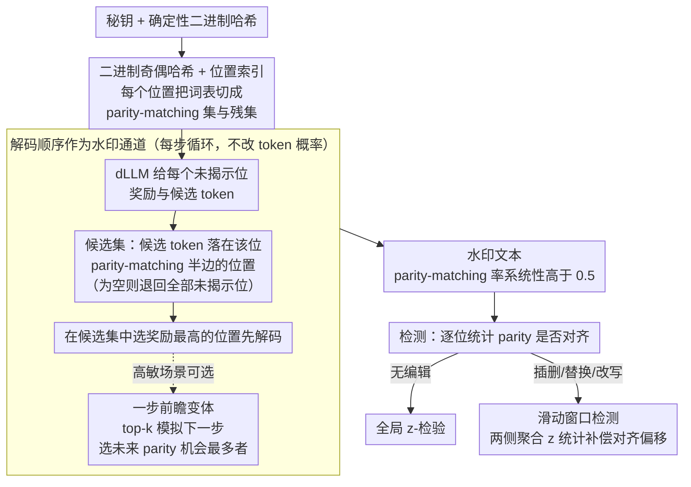

# dgMARK: Decoding-Guided Watermarking for Diffusion Language Models

**会议**: ICML 2026  
**arXiv**: [2601.22985](https://arxiv.org/abs/2601.22985)  
**代码**: https://dgmark-watermarking.github.io  
**领域**: LLM安全 / 水印 / 扩散语言模型  
**关键词**: dLLM 水印, 解码顺序, 奇偶哈希, 鲁棒检测, 无概率重加权

## 一句话总结
dgMARK 把扩散语言模型（dLLM）固有的"解码顺序自由度"用作水印通道——根据二进制哈希优先解码满足奇偶条件的位置，无需修改 token 概率分布，就能在 LLaDA / Dream 上嵌入可统计检测且对插删替/改写鲁棒的水印。

## 研究背景与动机

**领域现状**：LLM 内容溯源主要靠水印，主流路线（Kirchenbauer 等的绿/红名单）通过偏置 token 概率嵌入信号，质量损失明显；distortion-free 变体（GumbelMax、长伪随机序列）能保留分布但慢且依赖固定因果上下文。最近兴起的扩散语言模型（dLLM；LLaDA、Dream、Mercury、Gemini Diffusion）以任意顺序揭示 token，正在挑战自回归范式。

**现有痛点**：现有水印都假设左→右生成，需要"前文"作哈希种子。dLLM 没有固定前缀，所以经典水印方案要么不适用，要么被改造成"还是偏置概率"——继续付出质量代价。少数同期 dLLM 水印工作（Bagchi、Wu、Gloaguen、Raban 等）仍主要在改 token 选择概率。

**核心矛盾**：dLLM 提供了一个全新的控制旋钮（解码顺序），但理想情况下应是顺序无关的（任意排列应给同样的分布）；现实却因训练近似不完美而对顺序高度敏感（Kim et al. 2025）。这两者间的差异正好是潜在的水印通道——没人系统利用。

**本文目标**：设计一个完全不动 token 概率的水印——只通过引导解码顺序嵌入信号，同时（1）兼容 confidence / entropy / margin 等通用解码策略，（2）能在插入/删除/替换/改写攻击下保持检测率。

**切入角度**：观察到 dLLM 在每步会为每个未揭示位置 $j$ 计算奖励 $r_j$ 并采样候选 $v_j$；优先选 $r_j$ 最大者。如果我们用一个跟位置索引绑定的奇偶哈希在"满足条件的候选"中选最高奖励位置，就能在不改概率的前提下让水印文本的 parity-matching 率系统性高于 0.5。

**核心 idea**：把水印从"扭曲 token 概率"换成"扭曲解码顺序"——用秘钥派生的二进制哈希把每个位置的词表切成 parity-matching 与 residual 两部分，解码时优先选 candidate 落在 parity-matching 集且奖励最高的位置；统计检测时看 parity-matching 率是否显著高于 0.5。

## 方法详解

### 整体框架

dgMARK 想要的是一个"完全不碰 token 概率"的水印：既然扩散语言模型每步要从一堆未揭示位置里挑一个先解码，那就把信号藏进"先解谁"这个选择里，而不是去偏置"解成什么"。整条 pipeline 由一个秘钥 $\xi$ 和确定性哈希 $f: \mathcal{V} \times \Xi \to \{0,1\}$ 驱动——它在位置 $i$ 把词表切成 parity-matching 集 $\mathcal{G}_i = \{v \in \mathcal{V} \mid f(v, \xi) \equiv i \pmod 2\}$ 和残集 $\mathcal{R}_i = \mathcal{V} \setminus \mathcal{G}_i$（哈希构造保证对任意 $\xi$ 分割都平衡）。生成时每一步让 dLLM 照常对每个未揭示位置 $j$ 给出奖励和候选 $(r_j, v_j)$，dgMARK 只在"候选 token 恰好落在该位置 parity-matching 半边"的位置里挑奖励最高的那个先解码；检测时逐位置数 parity 是否对齐、做 z-检验看比例是否显著高于 0.5，对编辑攻击再套一层滑动窗口补偿对齐偏移。

### 关键设计

**1. 解码顺序作为水印通道：在不动 $p_\theta$ 的前提下嵌入可检测信号**

经典水印（绿/红名单、GumbelMax）都在 token 概率上做文章——偏置 logits 就有质量损失，保分布的 distortion-free 变体又得付额外计算开销。dgMARK 换了个旋钮：完全不动 $p_\theta(y_j \mid y_\mathcal{I}, x)$，只改"先解谁"。这看起来很矛盾——如果 dLLM 真是理想的顺序无关模型，任意排列给同样分布，那改顺序根本不可检测、也就嵌不进水印。但现实里 dLLM 因训练近似不完美而对顺序高度敏感（Kim et al. 2025），这个被当作缺陷的特性恰好成了水印资源：系统性地"优先选 parity-matching 位置"会让水印文本的 parity-matching 率被推高到显著超过 0.5，而无水印文本恒为 0.5。这样水印与模型概率彻底解耦，既省掉 distortion-free 的开销，又避开概率偏置的质量代价，同时天然 plug-and-play 兼容任意底层解码策略。

**2. 二进制奇偶哈希 + 位置索引：让水印分布既可检验又抗计数攻击**

通道有了，还需要一套不被简单统计攻破的编码。dgMARK 用秘钥派生的哈希 $f(v, \xi)$ 给每个 token 一个 0/1 标签，再让它和位置索引 $i$ 比奇偶——只有 $f(v, \xi) \equiv i \pmod 2$ 的 token 才算落在该位置的 parity-matching 半边 $\mathcal{G}_i$，解码时优先选候选落在这半边、且奖励最高的位置 $k^\star = \arg\max_{j: v_j \in \mathcal{G}_j} r_j$（若整步没有 parity-matching 候选，就退回在所有未揭示位置里取奖励最高者）。位置依赖是关键：词表二分随位置交替，不像静态绿名单那样能被"数高频词"破解；二进制加平衡分割则保证了零假设（无水印）下 parity-matching 率严格为 0.5，让检测端可以直接做 z-检验。秘钥本身也可换、可分级，支持多级授权。

**3. 滑动窗口检测：补偿编辑攻击造成的对齐偏移**

parity 是逐位置算的，所以一旦文本被插入或删除，全局位置索引整体平移，后面所有位置的 parity 对齐都被打乱——更麻烦的是这种平移会让某些窗口的 parity 不仅失配、还可能整体反转到 0.5 以下，朴素的全局单边计数会把鲁棒水印误判成无水印。dgMARK 改在重叠的滑动窗口上做检测：对每个长度为 $w$、起点为 $s$ 的窗口算一个局部 $z$ 分数 $z_s$，再用一个两侧聚合统计量 $z_{\text{win}} = \frac{1}{S}\sum_s z_s^2$（把每个窗口的 $z$ 平方后取平均）同时捕捉"偏高"和"被反转到偏低"的窗口——只要存在被编辑割裂后仍保持一致的子区间就能检出。相比强行加纠错码，这个对策更轻量、也更易分析，正好对上真实部署里常见的人工/机器后编辑场景。

**4. 一步前瞻变体（Lookahead）：在水印信号稀薄的步骤把强度顶上去**

基本版每步贪心地在 parity-matching 候选里选奖励最高的位置，但这种早早 commit 可能用掉一个位置后、反而让后续步骤可用的 parity-matching 候选变少。一步前瞻改成先取奖励最高的 top-k 个 parity-matching 候选，对每个候选模拟"假如这一步定下它、下一步还会剩下多少个位置的候选仍落在各自的 parity 集"（即前瞻得分 $g^{(j)} = \sum_\ell \mathbb{1}[v_\ell^{(j)} \in \mathcal{G}_\ell]$ 计数），再选让未来 parity 机会最多的那个落子，从而把整体水印强度进一步顶上去。$k=1$ 时退化为基本版；代价是每步要把解码策略多跑一遍，推理成本翻到 2×，因此只在高敏感场景才值得开。

## 实验关键数据

### 检测性 vs 文本质量（LLaDA-8B-Instruct，confidence 解码）

| 方法 | 检测 AUC↑ | 困惑度↓ | MAUVE↑ |
|------|--------|--------|--------|
| 无水印 | 0.50 | 1.00× | 1.000 |
| 概率偏置（移植 KGW） | 0.98 | 1.18× | 0.86 |
| dgMARK | **0.97** | **1.01×** | **0.97** |
| dgMARK + Lookahead | **0.99** | 1.03× | 0.95 |

dgMARK 检测率追平概率偏置基线，但困惑度和 MAUVE 几乎与无水印一致；说明顺序通道确实是"几乎免费"的。

### 后编辑鲁棒性（替换比例 20%）

| 攻击 | 概率偏置 AUC | dgMARK AUC | dgMARK + 窗口 AUC |
|------|------------|----------|------------------|
| 词替换 20% | 0.81 | 0.85 | **0.94** |
| 插入 10% | 0.70 | 0.79 | **0.92** |
| 删除 10% | 0.68 | 0.77 | **0.91** |
| 改写（GPT-4） | 0.62 | 0.71 | **0.85** |

滑动窗口检测对插删触发的对齐偏移补偿明显，dgMARK 比概率偏置在改写攻击下也更鲁棒（顺序信号比 token 信号更难被改写器同步擦除）。

### 关键发现
- **顺序通道接近零质量代价**：困惑度仅升 1%，几乎与无水印不可区分，说明改顺序对生成质量影响远小于改概率
- **跨解码策略稳定**：confidence / entropy / margin 三种解码都能挂载 dgMARK，检测 AUC 都 > 0.95，证明真正插件化
- **滑动窗口 > 全局检测**：在所有编辑攻击下检测 AUC 提升 5–10 个点，是鲁棒性的关键
- **Lookahead 收益递减**：从 0.97 推到 0.99 但 2× 推理成本，仅在高敏感场景值得用

## 亮点与洞察
- **找到了 dLLM 独有的水印通道**——解码顺序自由度，这是自回归范式根本不存在的旋钮；本文把"实践中 dLLM 顺序敏感"这个被视为缺陷的现象转化为水印资源，是经典的"bug 变 feature"
- **完全无概率重加权**：在所有 LLM 水印里这是少数真正不动 $p_\theta$ 的方案；理论上分布与无水印模型 KL 散度为 0（实际只受顺序敏感性影响）
- **plug-and-play 设计哲学**：dgMARK 是个 wrapper，下面 confidence/entropy/margin 全兼容；这意味着已有 dLLM 部署系统不用改训练或推理框架就能挂上
- **滑动窗口检测的通用性**：编辑攻击破坏全局对齐这个问题在任何位置依赖水印里都存在；本文的滑动窗口方案可迁移到其他位置依赖水印

## 局限性 / 可改进方向
- 依赖 dLLM 的"顺序敏感性"——若未来 dLLM 训练得几近顺序不变，水印信号会消失（属"敌方训练"风险）
- 一步 lookahead 2× 推理，多步 lookahead 成本指数级，强水印模式部署成本高
- 奇偶哈希 1 bit per position，信道容量小；嵌入更复杂签名（如时间戳、版本号）需扩展到 $k$-bit 哈希
- 主要在 LLaDA / Dream 两个 dLLM 上验证，未来更大规模 / 不同架构 dLLM 的泛化未充分验证
- 改写攻击下 AUC 仍降到 0.85，强对抗改写器可能进一步降级

## 相关工作与启发
- **vs 自回归绿/红名单水印（Kirchenbauer 等）**：那套依赖固定因果上下文，dLLM 没有；且改概率有质量代价，dgMARK 不改概率
- **vs distortion-free 水印（Aaronson-Kirchner、Christ 等）**：通过 GumbelMax 或长伪随机序列保分布，但开销大；dgMARK 在 dLLM 上几乎零开销保分布
- **vs 同期 dLLM 水印（Bagchi / Wu / Gloaguen / Raban）**：那些仍在改 token 选择概率（probability shaping / controlled sampling）；dgMARK 是首个完全用解码顺序作通道的
- **启发**：任何具备"理论顺序无关但实际顺序敏感"的生成系统（图像扩散、视频扩散）都可能复用类似的"顺序通道水印"思路

## 评分
- 新颖性: ⭐⭐⭐⭐⭐ 解码顺序作为水印通道是真正全新的 framing，开创了 dLLM 水印的非概率路线
- 实验充分度: ⭐⭐⭐⭐ 两个 dLLM × 三种解码 × 四种攻击 × 多 baseline，覆盖到位；缺少与并发 dLLM 水印的细致 head-to-head
- 写作质量: ⭐⭐⭐⭐ 动机引入清晰，算法图示直观；理论分析（顺序敏感性如何转化为可检统计量）可以更深
- 价值: ⭐⭐⭐⭐⭐ dLLM 正在快速产业化（Mercury、Gemini Diffusion），溯源水印是刚需；本文提供了首个高质量、低开销、强鲁棒的方案

<!-- RELATED:START -->

## 相关论文

- [\[ICML 2026\] COFT: Counterfactual-Conformal Decoding for Fair Chain-of-Thought Reasoning in Large Language Models](coft_counterfactual-conformal_decoding_for_fair_chain-of-thought_reasoning_in_la.md)
- [\[ICML 2026\] Towards Fine-Grained Robustness: Attention-Guided Test-Time Prompt Tuning for Vision-Language Models](towards_fine-grained_robustness_attention-guided_test-time_prompt_tuning_for_vis.md)
- [\[ICLR 2026\] wd1: Weighted Policy Optimization for Reasoning in Diffusion Language Models](../../ICLR2026/llm_safety/wd1_weighted_policy_optimization_for_reasoning_in_diffusion_language_models.md)
- [\[AAAI 2026\] Perturb Your Data: Paraphrase-Guided Training Data Watermarking](../../AAAI2026/llm_safety/perturb_your_data_paraphrase-guided_training_data_watermarking.md)
- [\[ICLR 2026\] Membership Inference Attacks Against Fine-tuned Diffusion Language Models (SAMA)](../../ICLR2026/llm_safety/membership_inference_attacks_against_fine-tuned_diffusion_language_models.md)

<!-- RELATED:END -->
