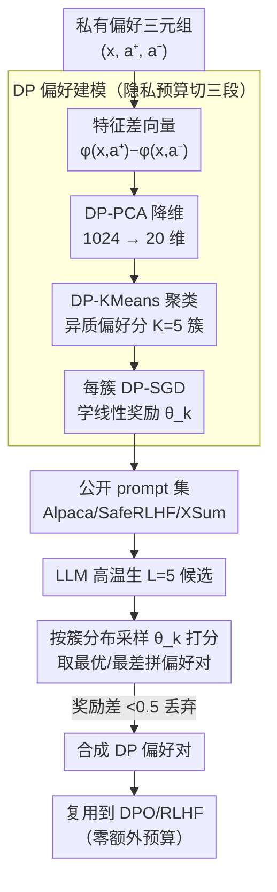

# Differentially Private Preference Data Synthesis for Large Language Model Alignment

**会议**: ICML 2026  
**arXiv**: [2605.30808](https://arxiv.org/abs/2605.30808)  
**代码**: https://github.com/gfengyu/Differentially-Private-Preference-Data-Synthesis  
**领域**: LLM安全 / 差分隐私 / 偏好对齐  
**关键词**: 差分隐私, 偏好数据合成, Bradley-Terry, DP-PCA, DPO/RLHF

## 一句话总结
DPPrefSyn 把"在私有偏好数据上做 DP 微调"换成"用 DP 学一个偏好奖励模型分布后再用公开 prompt 合成 DP 偏好数据"，借助 Bradley-Terry 线性奖励的几何结构 + DP-PCA + DP-KMeans 聚类捕捉用户偏好异质性，在 Anthropic-HH 上 $\varepsilon=2$ 拿到 56.5% GPT-4o win-rate，反超无隐私微调（55.95%）和 DP-FT（37.0%）。

## 研究背景与动机

**领域现状**：LLM 偏好对齐（RLHF / DPO）依赖 prompt + 一对响应 + 人类偏好标签的三元组数据。这些数据集（如 Anthropic-HH、OpenAssistant、TL;DR）里 prompt 常含健康、身份、政治倾向等敏感信息，annotation 本身也可能泄露标注者偏好。

**现有痛点**：现有 DP 对齐工作分三类——（1）只保护标签的 label-DP（Chowdhury 2024、Zhang 2025），prompt 仍裸露；（2）DP-PPO 等特定算法的私有微调（Wu 2023a），不兼容 DPO；（3）DP 合成 instructions（Yu 2024）但不针对偏好对。三类都做"部分保护"或"算法特定"，且对私有数据量受限——人类偏好标注极贵。

**核心矛盾**：偏好数据有强异质性（不同用户重视不同方面：准确、礼貌、创意），但 DP-SGD 在高维 embedding 上样本效率极低；同时希望 DP 后的产物可以重用到 DPO / RLHF / 各种下游 LLM（不再耗预算）。

**本文目标**：（1）保护 prompt + response + label 全部私有信号；（2）兼容 DPO、RLHF 等任意对齐算法；（3）超越只在私有数据上 DP 微调的基线 utility。

**切入角度**：把任务从"私有微调一个对齐模型"转成"用 DP 学一个偏好奖励模型分布 → 用它在公开 prompt 上构造合成偏好对"。公开 prompt 不消耗预算，所有预算都用在建偏好模型上；合成数据通过 DP post-processing 可任意复用。

**核心 idea**：Bradley-Terry + 线性奖励 → 偏好 = $\langle \theta, \phi(x, a^+) - \phi(x, a^-) \rangle$ 的符号；按 $\phi$ 差向量聚类把异质偏好分组；用 DP-PCA 降维节省样本、DP-KMeans 分簇、DP-SGD 学每簇线性奖励；最后在公开 prompt 上按簇分布采样、用对应奖励模型选最优/最差对。

## 方法详解

### 整体框架

DPPrefSyn 不再在私有偏好三元组上直接 DP 微调对齐模型，而是先用 DP 预算"把人类偏好压成一族低维线性奖励模型"，再拿这族模型去公开 prompt 上合成偏好对。整条流水线分三步：先对每个私有三元组 $(x_i, a_i^+, a_i^-)$ 算特征差向量并做 DP-PCA 降维 + DP-KMeans 聚类，把异质用户分到 $K=5$ 个簇；再对每簇用 DP-SGD 学一个线性奖励 $\theta_k$；最后在不消耗预算的公开 prompt 上让 LLM 生候选、按簇分布采样奖励模型来打分，挑最优/最差响应拼成合成偏好对。因为合成数据是 DP 输出的后处理产物，可任意复用到 DPO / RLHF / 不同模型而不再花预算。

### 关键设计

**1. Bradley-Terry 线性奖励 + 几何聚类：用一族簇奖励表达异质偏好**

单一全局奖励无法刻画"不同用户重视不同方面"（准确、礼貌、创意）这种异质性，但要给每个用户单独建模又会陷入高维多模型困境。本文借 Bradley-Terry 模型的几何结构破局：偏好概率 $\mathbb{P}[a^+ \succ a^-] = \sigma(\langle \theta, \phi(x,a^+) - \phi(x,a^-)\rangle)$ 只由参数 $\theta$ 与特征差向量 $\phi(x,a^+)-\phi(x,a^-)$ 的内积符号决定，因此偏好取向相近的用户，其差向量方向天然一致——把这些差向量聚类，每个簇就对应一类同质偏好，可用一个 cluster-specific 的线性 $\theta_k$ 近似。聚出来的簇还可解释（如"重视事实性""重视礼貌"）。选线性奖励而非深度奖励，是因为它在表达力和 DP 友好性之间取了平衡：DP-SGD 在线性模型上的样本效率远高于深度模型，而簇内偏好已被聚类同质化，线性结构就够用。

**2. DP-PCA + DP-KMeans + DP-SGD 的分阶段预算配置：用降维换样本效率**

原始 embedding 高达 1024 维，DP-SGD 直接在这个维度上学奖励所需样本量大到不现实，而人类偏好标注极其昂贵。解法是先用 DP-PCA 把差向量投到 $p=20$ 维，保留主要偏好信号、丢掉噪声方向，再在低维空间训练。总隐私预算被切成三段：$\varepsilon_0$ 给 PCA、$\varepsilon_1$ 给 KMeans、剩余的 $\varepsilon - \varepsilon_0 - \varepsilon_1$ 给 DP-SGD。由于聚类后各簇样本不相交，DP-SGD 训练满足平行组合定理，总预算只受最小簇约束而非线性叠加。降维本就是 DP 高维训练的标配，而这里选 PCA 而非随机投影是为了更有针对性地保留偏好信号，KMeans 则让每个簇内部足够同质、从而单个线性模型即可拟合。DP-SGD 的多步组合用 PRV accountant 做紧致核算。

**3. 公开 prompt + 候选评分构造偏好对：把预算全花在"建偏好"上**

合成 prompt 本身既要消耗隐私预算、效果又差，所以本文干脆改用公开 prompt 集（Alpaca / SafeRLHF / XSum），让全部 DP 预算都投到偏好建模而非造 prompt 上。生成时，对每个公开 prompt $\tilde x_j$ 用高 temperature 让 LLM 产 $L=5$ 个候选；按一个 DP histogram $\bm p \leftarrow \bm h / |\mathcal{D}_{\text{priv}}|$（簇的私有占比）采样出簇 $k$，用对应的 $\theta_k$ 给候选打分，取奖励最高/最低的两个拼成偏好对 $(\tilde a^+, \tilde a^-)$；若两者奖励差 $< 0.5$ 说明区分度不够，就丢弃这条以保证合成对的信号质量。公开与私有 prompt 的分布差异不致命，因为作者主张"用户偏好与 prompt 分布解耦"——偏好不变性被 $\theta_k$ 抓住，换个 prompt 来源依然能复现同一套偏好排序。

## 实验关键数据

### 主实验：GPT-4o Win-rate（Pythia-2.8B + SFT+DPO）

| 任务 | $\varepsilon=0$（base）| DP-FT $\varepsilon=2$ | **DPPrefSyn $\varepsilon=2$** | DP-FT $\varepsilon=\infty$（无隐私）|
|------|---------|-------------|---------------|-----------|
| OpenAssistant | 2.11 | 6.18 | **11.04** | 8.20 |
| Anthropic-HH | 12.14 | 37.02 | **56.48** | 38.72 |
| TL;DR | 11.64 | 35.2 | **53.8** | 39.5 |

在 $\varepsilon = 2$（强隐私）下，DPPrefSyn 大幅超过 DP-FT，甚至超过完全无隐私的 DP-FT（$\varepsilon = \infty$）—— **DP 不再是利用率代价，而成了正则化**。

### 隐私 vs 性能曲线（Anthropic-HH）

| $\varepsilon$ | DP-FT win-rate | DPPrefSyn win-rate |
|---|---|---|
| 0.5 | 35.00 | **55.08** |
| 1 | 36.27 | **55.96** |
| 2 | 37.02 | **56.48** |
| 4 | 36.74 | **56.51** |
| 8 | 36.94 | **56.86** |
| ∞ | 38.72 | 57.53 |

DPPrefSyn 几乎在所有 $\varepsilon$ 上稳定 55%+，DP-FT 卡在 35-37%。DPPrefSyn 对预算不敏感是因为预算只用在低维线性奖励上，远比训练整个 LLM 更省。

### 消融（OpenAssistant，$\varepsilon = 2$）

| 配置 | win-rate |
|------|---------|
| 完整 DPPrefSyn | 11.04 |
| 无 DP-PCA（直接 1024 维 DP-SGD）| 6.32 |
| 无 KMeans 聚类（单一全局奖励）| 8.41 |
| 用 DP 合成 prompt 替代公开 prompt | 7.95 |
| GPT-2 fine-tuned reward 替线性 | 11.21 |

DP-PCA 贡献最大（−4.7 点），聚类抓异质性贡献第二（−2.6 点）；线性奖励 vs full GPT-2 几乎一样，证明线性结构足够。

### 关键发现
- **DP 合成数据 > 直接 DP 微调**：DPPrefSyn 在所有 $\varepsilon$ 下都赢 DP-FT，颠覆了"合成数据会丢信息"的常识
- **降维是 DP 高维训练的关键**：去掉 DP-PCA 直接掉 4.7 点，说明在 1024 维直接 DP-SGD 几乎学不到东西
- **异质偏好建模有效**：聚类带来 2.6 点提升，证实人类偏好确实多模态
- **post-processing 复用**：合成数据集训完一次可换不同模型/算法（SFT、DPO、RLHF）零额外预算

## 亮点与洞察
- **DP-PCA + 线性奖励 + 聚类"三件套"的精巧组合**：每个组件都解决一个 DP 高维训练的具体痛点（样本效率 / 表达力 / 异质性）；组合后跨越 utility-privacy 边界
- **post-processing 的最大化利用**：合成完一次就脱离 DP 控制，可任意复用——这是 DP 合成数据相对 DP 微调的根本优势，本文利用得很彻底
- **"DP 即正则化"现象**：DPPrefSyn 在 $\varepsilon=2$ 超过完全无隐私基线，说明 DP 噪声在异质数据上充当正则项，缓解过拟合到特定标注者偏好——这是个有意思的副作用
- **公开 prompt 替代私有 prompt 的洞察**：作者论证"用户偏好与 prompt 分布解耦"，因此公开 prompt 可承载私有偏好——这套论证可推广到其他偏好任务（推荐、广告等）

## 局限性 / 可改进方向
- 线性奖励假设可能过强；非线性偏好（如组合判断、长程依赖判断）下表达力不足
- $K = 5$ 簇的选择没有原则方法，依赖经验；过多 / 过少都伤性能
- 公开 prompt 分布若严重偏离私有则覆盖不全；缺乏分布偏移的定量分析
- 仅在 Pythia-2.8B 上验证下游对齐；更大模型（如 13B+）下 DP-PCA 降维的偏置可能放大

## 相关工作与启发
- **vs DP-FT / DP-PPO / DP-RLHF**：直接 DP 微调对齐模型；每次换算法/模型都要重新花预算；DPPrefSyn 一次 DP，多次复用
- **vs label-DP（Chowdhury / Zhang）**：只保护标签 prompt 仍泄露；DPPrefSyn 保全部
- **vs DP synthetic instructions（Yu 2024）**：合成 instructions 不针对偏好；DPPrefSyn 直接合成偏好对，对齐效果更好
- **vs Aug-PE（Xie 2024）**：DP 通用文本合成，依赖 LLM API 迭代；DPPrefSyn 更细分到偏好对，借助 BT 几何结构
- **启发**：把"DP 直接训"换成"DP 学一个抽象 → 合成数据 → 复用"的范式可推广到所有需要保护标注的有监督任务（医学、法律、推荐）

## 评分
- 新颖性: ⭐⭐⭐⭐⭐ 首次做 DP 偏好对合成；BT 几何 + DP-PCA + 聚类的组合策略系统化
- 实验充分度: ⭐⭐⭐⭐⭐ 三任务 × 五种 $\varepsilon$ × 多模型 × 详尽消融；与 DP-FT 全面 head-to-head
- 写作质量: ⭐⭐⭐⭐ 三步算法清晰，预算分配解释透彻；图 1 直观；BT-聚类的几何论证可以更深
- 价值: ⭐⭐⭐⭐⭐ DP 对齐是企业部署 LLM 的合规刚需；本文给出业界可直接采用的 pipeline

<!-- RELATED:START -->

## 相关论文

- [\[ICML 2026\] Privacy Amplification in Differentially Private Zeroth-Order Optimization with Hidden States](privacy_amplification_in_differentially_private_zeroth-order_optimization_with_h.md)
- [\[ICML 2025\] POPri: Private Federated Learning using Preference-Optimized Synthetic Data](../../ICML2025/llm_safety/popri_private_federated_learning_using_preference-optimized_synthetic_data.md)
- [\[ICML 2026\] ACTG-ARL: Differentially Private Conditional Text Generation with RL-Boosted Control](actg-arl_differentially_private_conditional_text_generation_with_rl-boosted_cont.md)
- [\[ICML 2026\] Federated Variational Preference Alignment with Gumbel-Softmax Prior for Personalized User Preferences](federated_variational_preference_alignment_with_gumbel-softmax_prior_for_persona.md)
- [\[ACL 2026\] Differentially Private Synthetic Text Generation for Retrieval-Augmented Generation (RAG)](../../ACL2026/llm_safety/differentially_private_synthetic_text_generation_for_retrieval-augmented_generat.md)

<!-- RELATED:END -->
