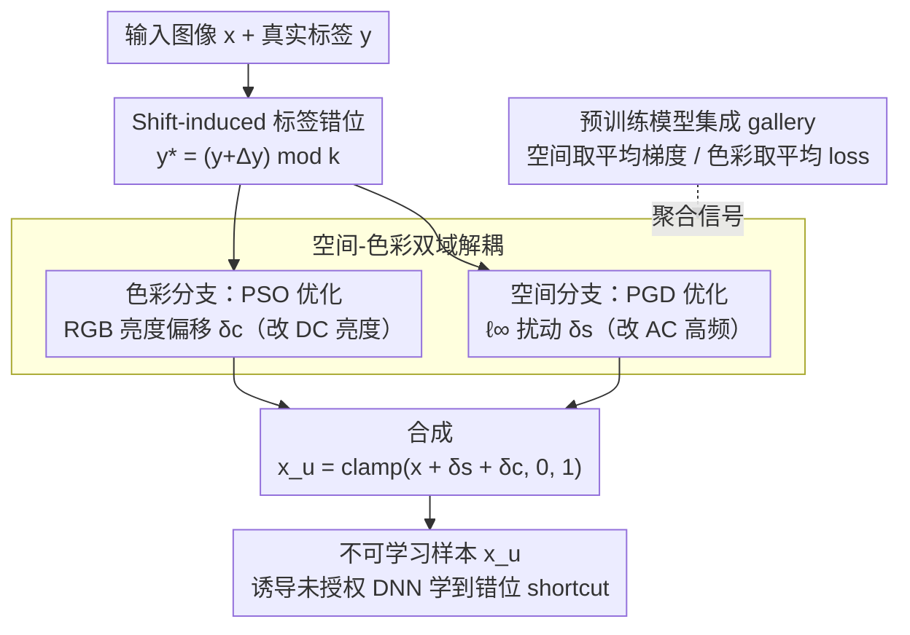

# Dual-branch Robust Unlearnable Examples

**会议**: ICML 2026  
**arXiv**: [2605.01718](https://arxiv.org/abs/2605.01718)  
**代码**: https://github.com/wxldragon/DUNE （有）  
**领域**: AI 安全 / 数据保护 / Unlearnable Examples  
**关键词**: Unlearnable Examples, 数据投毒, 空间-色彩双域, 集成扰动, 鲁棒性防御

## 一句话总结
本文提出 DUNE：把不可学习样本（UE）的扰动从单一空间域扩展到"空间 + 色彩"双域优化，使扰动特征对齐到 shift-induced 标签并配合预训练模型集成增强，在 CIFAR-10 / ImageNet 上对 7 种主流防御（含 ECLIPSE、ISS-J、COIN）保持鲁棒，平均测试精度比 12 个 SOTA UE 方案再低 14.95%–50.82%。

## 研究背景与动机

**领域现状**：网络爬取的训练数据让"未经授权训练 DNN"成为隐患。Unlearnable Examples（UEs）通过给数据加不可察觉的扰动让 DNN 学到错误捷径特征（perturbation ↔ label 映射），从而保护数据所有者。主流方法（EM, REM, LSP, SEP, CUDA, OPS 等）都在空间域的 $\ell_p$-norm ball 内做扰动优化。

**现有痛点**：（1）**Heuristic shortcut**：CUDA / LSP 等用经验性卷积/线性 block 直接当扰动，缺乏 principled 优化，COIN 这种 adaptive defense 一打就破；（2）**Domain-constrained**：单空间域扰动频率结构单一，ISS-J（频域压缩）、ECLIPSE（diffusion 净化）等噪声抑制类防御能直接清掉；（3）Fig. 2 雷达图显示所有现有 UE 在某些防御下都退化到接近 baseline 准确率，鲁棒性边界很窄。

**核心矛盾**：UE 要鲁棒就需要"扰动多样性"，但单 $\ell_p$ 域里所有扰动共享同一频率结构和分布族，使 defense 只要识别该族就能批量清除；扩展到多个域又面临"如何让多域扰动协同建立 shortcut 映射"的优化难题。

**本文目标**：（1）设计能在多域同时优化扰动的 UE 框架；（2）保证多域扰动正交/互补，避免重叠破坏 stealthiness；（3）用集成学习强化扰动跨架构 transferability。

**切入角度**：图像可分解为 DC 分量（块均值亮度）+ AC 分量（高频空间细节）。空间扰动主要影响 AC，色彩扰动（亮度漂移）主要影响 DC——天然正交。同时把扰动方向从"对齐 ground-truth label"改为"对齐 shift-induced label" $y^*=(y+\Delta y)\mod k$，让模型学到的 shortcut 与真实标签解耦。

**核心 idea**：把 UE 优化分解为两个独立子问题——空间分支用 PGD 优化 $\ell_\infty$ 扰动 $\delta_s$，色彩分支用 PSO 优化 RGB 三通道亮度偏移 $\delta_c$，共同把特征推向 shift-induced class，再用预训练模型 gallery 做集成增强鲁棒性。

## 方法详解

### 整体框架
DUNE 要解决的是"单一空间域的 UE 扰动频率结构太单一、被频域压缩或扩散净化一打就破"这个痛点。它的总目标仍是给图像加扰动让模型学到错误 shortcut：$\min_{\delta_u}\mathbb{E}_{(x,y)}[\mathcal{L}_{CE}(f_\theta(\psi(x;\delta_u)), y^*)]$，约束 $\delta_u\in\Phi_s\times\Phi_c$、训练标签换成偏移过的 $y^*=(y+\Delta y)\mod k$。关键之处在于作者证明这个联合优化能解耦成两条独立支路：空间分支用 PGD 在 $\ell_\infty$ 球内优化扰动 $\delta_s$，色彩分支用无梯度的 PSO 在 RGB 三通道独立搜亮度偏移 $\delta_c$，两支都在一组预训练模型 gallery 上聚合信号以增强跨架构鲁棒性，最后叠加得到 $x_u=\text{clamp}(x+\delta_s+\delta_c, 0, 1)$。

### 关键设计

**1. Shift-induced 标签错位：把 shortcut 映射做成确定性的**

传统 UE 的优化目标是"min loss"——让模型把带扰动样本仍然分到原类 $y$，但这建立的是一个跟真实标签纠缠在一起的 shortcut，adaptive defense 容易逆向。DUNE 改成让扰动把特征推向一个固定偏移类 $y^*=(y+\Delta y)\mod k$，优化目标变为 $\mathcal{L}_{CE}(f_\theta(\psi(x;\delta_d)), y^*)$。由于每一类样本共享同一个偏移量 $\Delta y$，整个数据集形成一张"统一旋转"的 perturbation→label 映射表（Fig. 4），模型在 UE 上学到的全是这套错位捷径；测试时换成干净样本，捷径失效、泛化直接崩塌。相比随机化的旧目标，这个映射是**确定性**的、并与原始 label 显式解耦，因此更稳定也更难被防御者反推。

**2. 空间-色彩双域解耦：让两类扰动在几何上不打架**

单域扰动之所以脆弱，是因为所有扰动共享同一频率族，防御只要识别这个族就能批量清掉。DUNE 把扰动拆成 $\delta_u\triangleq\delta_s\oplus\delta_c$ 两个互不重叠的子问题独立求解。空间分支走 $T$ 步 PGD，沿 $g_t=\nabla_{x_i^t}\mathcal{L}_{CE}(f_\theta(x_i^t), y_p^*)$ 迭代并裁剪 $x_i^{t+1}=\text{clip}_{\epsilon}(x_i^t-\beta\cdot\text{sign}(g_t))$；色彩分支则把图像拆成 R/G/B 三通道，对每通道加一个亮度偏移 $\Delta x_r,\Delta x_g,\Delta x_b$，用 PSO 搜索让"集成 loss + 自然性约束 $\lambda\mathcal{L}_{nc}$"最小的偏移组合，整类共享同一组 $\delta_c$。两条支路之所以正交，是因为图像可分解为 DC 分量（块均值亮度）和 AC 分量（高频空间细节）：空间扰动主要改 AC，色彩亮度漂移主要改 DC。于是 ECLIPSE 这类高斯噪声净化只能洗掉 AC、ISS-J 的高频压缩也只伤 AC，DC 上的色彩偏移原封不动地留下来——两个分支互为冗余备份，攻防几何上根本不在同一维度上重叠。

**3. 预训练模型集成：把扰动从单架构过拟合里拉出来**

只用一个 surrogate（比如 ResNet18）生成的扰动会过拟合该架构，换成 VGG19 就失效。DUNE 维护一组不同初始化、不同架构的 model gallery $\{f_{\theta_j}\}_{j=1}^M$，两条支路都在其上聚合信号：空间分支取平均梯度 $g_t=\frac{1}{M}\sum_j \nabla\mathcal{L}_{CE}(f_{\theta_j}(x), y_p^*)$，色彩分支取平均 loss $\mathcal{L}_{color}=\frac{1}{M}\sum_j\mathcal{L}_{CE}(f_{\theta_j}(x+\delta_c), y_p^*)+\lambda\mathcal{L}_{nc}$。这等价于把对抗攻击社区成熟的 transferability boosting 搬进 UE——多个架构的梯度方向一平均，扰动的 frequency 谱被拓宽，对未见过的防御模型也能保持鲁棒。

### 损失函数 / 训练策略
- 空间分支：$\mathcal{L}_{CE}(f_\theta(x+\delta_s), y^*)$，$\ell_\infty\le\epsilon$（CIFAR-10 $\epsilon=8/255$），$T=20$ PGD 步。
- 色彩分支：$\mathcal{L}_{color}=\frac{1}{M}\sum_j\mathcal{L}_{CE}+\lambda\mathcal{L}_{nc}$，PSO 粒子搜索，每类 $N$ 个样本聚合。
- 集成模型 $M$ 通常 3–5 个 surrogate；shift offset $\Delta y$ 类别数 $k$ 之内固定（CIFAR-10 通常 $\Delta y=1$）。
- 训练数据：CIFAR-10、ImageNet 子集；评估架构 ResNet18（intra）、VGG19（cross）。

## 实验关键数据

### 主实验

CIFAR-10 上 ResNet18 训练，不同防御下的测试精度（越低越好，即 UE 越鲁棒），对比 12 个 UE 方案 + 7 个防御：

| 防御 \ UE | EM | REM | CUDA | SEM | **DUNE** |
|----------|-----|-----|------|-----|----------|
| w/o defense | 18.26 | 25.81 | 25.48 | 15.94 | **13.26** |
| AT | 69.72 | 59.12 | 49.32 | 32.43 | **24.96** |
| AA | 82.08 | 45.83 | 40.78 | 39.29 | **19.55** |
| OP | 64.37 | 29.45 | 28.66 | 15.99 | **12.81** |
| ISS-G | 89.09 | 38.87 | 22.89 | 31.94 | **10.18** |
| ISS-J | 78.91 | 81.33 | 43.31 | 81.58 | **28.88** |
| ECLIPSE | 82.07 | 87.16 | 34.18 | 85.82 | **57.49** |
| COIN | 19.49 | 33.67 | 72.02 | 24.22 | **19.21** |
| **AVG** | 63.00 | 51.47 | 39.58 | 40.90 | **23.29** |

VGG19 跨架构评估（surrogate=ResNet18）同样 DUNE 全面领先，AVG 列上 DUNE 仍是 12 个方法中唯一稳定低于 30%。

### 消融实验

| 配置 | CIFAR-10 ResNet18 w/o defense | 与 AT 防御后 |
|------|--------|--------|
| 仅空间分支（PGD + shift label） | ≈18 | ≈45 |
| 仅色彩分支（PSO + shift label） | ≈25 | ≈40 |
| 双分支（无集成） | ≈15 | ≈35 |
| **DUNE Full（双分支 + ensemble）** | **13.26** | **24.96** |

（具体消融数字论文 Table 3 给出，此处近似复述趋势。）

### 关键发现
- **双域 > 单域**：无论哪个 branch 单独用，对 ECLIPSE/ISS-J 中至少一种防御鲁棒性都不足；双分支组合才能同时扛频域压缩和 diffusion 净化。
- **loss landscape 更平滑**（Fig. 3）：DUNE 训练出的模型 loss landscape 比 LSP/EM/REM 等单域 UE 平滑得多，说明扰动分布对小扰动更鲁棒，与 Pham et al. 2024 的 sharpness↔robustness 理论一致。
- **集成边际很大**：去掉 model gallery 后 cross-arch（VGG19）退化最严重，证明 ensemble 是 transferability 的关键。
- **对 adaptive defense 仍鲁棒**：作者还设计了两种 adaptive defense（假设防御者知道空间-色彩域信息），DUNE 在四种架构上仍保持低准确率。

## 亮点与洞察
- **正交域分解**：DC vs. AC 的物理解耦给出了"为什么两个 branch 真的不打架"的几何直觉，远比"加个新 loss 项"这种工程拼凑深刻。
- **Shift-induced label**：从"最小化 true-label loss"转向"对齐 shift-induced label"是一个看似小但效果大的范式转变——给 UE 提供了一个 deterministic 而非 random 的 shortcut，更难被 reverse-engineer。
- **PSO 用于色彩分支**：色彩扰动维度低（每类 3 个标量×通道），梯度方向不直接可导（因为对 hue/luminance 操作），PSO 的 derivative-free 特性恰好匹配，工程选择很贴切。
- **集成增强是 UE 领域的"对抗 transferability"等价物**：把对抗攻击社区成熟的 ensemble trick 引入 UE，思路可直接迁移到其他 data poisoning 任务。

## 局限与展望
- 评估架构仍偏小（ResNet18、VGG19），对 ViT / 大模型的 UE 鲁棒性未验证。
- 色彩分支共享每类一组偏移，意味着同类样本色彩漂移完全一致，可能在某些 hue 增强类 augmentation 下失效；个体化色彩扰动是自然延伸。
- 对 diffusion-based 防御 ECLIPSE 仍有 57.49% 测试精度，说明高质量净化器对 DUNE 仍是部分有效，未来需要进一步对抗扩散模型。
- shift offset $\Delta y$ 在多分类场景下需手动选，作者用 $\Delta y=1$ 但未给最优值搜索；类别数大时（如 ImageNet 1000）shift 可能需要更细设计。
- 计算开销：双分支 + PSO + ensemble 让生成 UE 比单 PGD 慢 5–10×，大数据集（如 ImageNet）部署成本可观。
- 仅在图像分类上测试，对目标检测、分割等任务的 UE 设计未触及。

## 相关工作与启发
- **vs. EM (Huang et al. 2021)**: 经典 min-min 优化的 UE 鼻祖，仅单空间域；DUNE 是其多域、多模型的鲁棒化继承者。
- **vs. REM (Fu et al. 2022)**: REM 用 tri-level 优化抗 AT，但仍单 $\ell_\infty$ 域，ISS-J/ECLIPSE 下崩；DUNE 用双域解决频域多样性。
- **vs. CUDA (Sadasivan et al. 2023)**: 启发式卷积扰动，COIN（matrix transformation）直接破解；DUNE 用 principled 优化避免被启发式 inverse。
- **vs. ECLIPSE/ISS-J 类防御**: DUNE 是首次把 UE 同时拓到空间+色彩双域以避开两类防御的工作。

## 评分
- 新颖性: ⭐⭐⭐⭐ 双域正交分解 + shift-induced label 在 UE 领域是新颖且自洽的设计
- 实验充分度: ⭐⭐⭐⭐⭐ 12 UE × 7 defense × 2 数据集 × 2 架构 + 2 adaptive defense 矩阵实验非常扎实
- 写作质量: ⭐⭐⭐⭐ 动机-设计-实验的逻辑链清晰，DC/AC 物理直觉解释到位
- 价值: ⭐⭐⭐⭐ 给数据所有者提供了显著更鲁棒的 UE 工具，且对 stealthiness 影响可控

<!-- RELATED:START -->

## 相关论文

- [\[ICLR 2026\] When Priors Backfire: On the Vulnerability of Unlearnable Examples to Pretraining](../../ICLR2026/llm_safety/when_priors_backfire_on_the_vulnerability_of_unlearnable_examples_to_pretraining.md)
- [\[ICCV 2025\] Temporal Unlearnable Examples: Preventing Personal Video Data from Unauthorized Exploitation](../../ICCV2025/llm_safety/temporal_unlearnable_examples_preventing_personal_video_data_from_unauthorized_e.md)
- [\[ICML 2026\] BYORn: Bootstrap Your Own Responses to Defend Large Vision-Language Models Against Backdoor Attacks](byorn_bootstrap_your_own_responses_to_defend_large_vision-language_models_agains.md)
- [\[ICLR 2026\] Perturbation-Induced Linearization: Constructing Unlearnable Data with Solely Linear Classifiers](../../ICLR2026/llm_safety/perturbation-induced_linearization_constructing_unlearnable_data_with_solely_lin.md)
- [\[ACL 2026\] From Domains to Instances: Dual-Granularity Data Synthesis for LLM Unlearning](../../ACL2026/llm_safety/from_domains_to_instances_dual-granularity_data_synthesis_for_llm_unlearning.md)

<!-- RELATED:END -->
