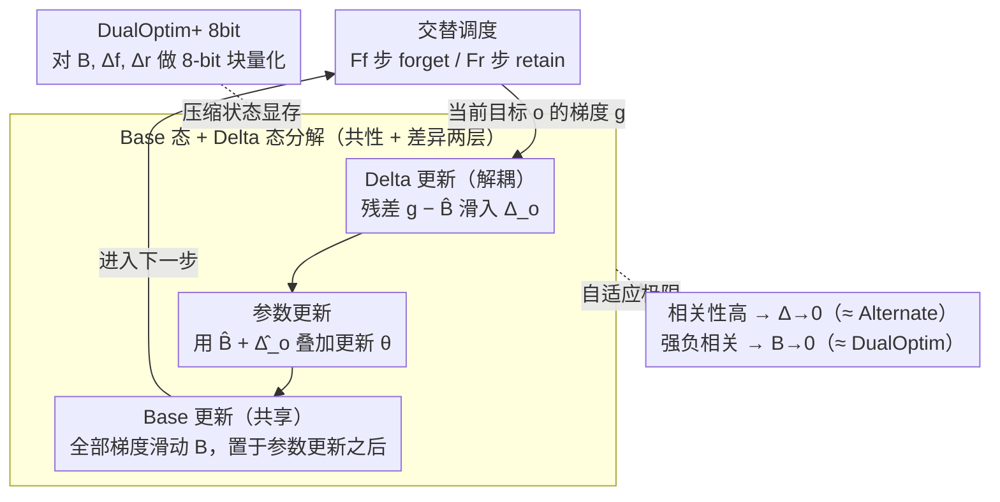

# DualOptim+: Bridging Shared and Decoupled Optimizer States for Better Machine Unlearning in Large Language Models

**会议**: ICML 2026  
**arXiv**: [2605.21539](https://arxiv.org/abs/2605.21539)  
**代码**: https://github.com/CityU-MLO/DualOptimPlus  
**领域**: LLM安全 / 机器遗忘 / 优化器  
**关键词**: 机器遗忘, 优化器状态, 梯度冲突, 8-bit 量化, AdamW

## 一句话总结
DualOptim+ 把 Adam 优化器状态拆成"共享 base 态 + 解耦 delta 态"，让 LLM 机器遗忘在 forget/retain 梯度时而冲突时而协同的情况下自适应地在共享和解耦优化器之间过渡，理论上同时退化为 Alternate（正相关）和 DualOptim（负相关），并通过 8-bit 量化变体把额外显存开销压回基线。

## 研究背景与动机

**领域现状**：机器遗忘（MU）要求模型擦除 forget 集影响、保留 retain 集效用。LLM 上的 MU 主流靠 forget 损失 $\mathcal{L}_f$（GA / NPO / ME / RMU）+ retain 损失 $\mathcal{L}_r$（CE / KL）联合优化。优化策略经历三代：
- **Joint**（求和后单步反传，DualOptim 之前的事实标准）—— 简单但梯度合并导致退化
- **Alternate**（每步只用一个目标的梯度，交替）—— 缓解退化但对超参敏感、不稳
- **DualOptim**（两个目标用两个独立的 AdamW，各自维护状态）—— 视觉任务上有效，但移植到 LLM 收益仅边际

**现有痛点**：作者观察到 LLM unlearning 中 forget/retain 梯度的余弦相似度在训练过程中**剧烈波动**——前期正相关（信号共享）、后期负相关甚至接近正交，时而冲突时而协同。Joint 用一个共享态丢掉了对抗信号；DualOptim 完全解耦又丢掉了协同信号；二者都只对应了一种相关模式，所以 LLM 上无法全程拿到最优。

**核心矛盾**：单一的"共享 vs 解耦"二选一无法适应 LLM 训练中梯度相关性的动态变化；理想优化器应该能根据当前相关性自适应地在两者间过渡。

**本文目标**：（1）构造一种 plug-and-play 的优化器框架，能根据 $\nabla \mathcal{L}_f$ 与 $\nabla \mathcal{L}_r$ 的方向相关性动态在共享/解耦间插值；（2）覆盖 fictitious unlearning / 真实遗忘 / 安全对齐 / 多任务等场景；（3）解决额外优化器状态带来的显存膨胀。

**切入角度**：把 AdamW 的一阶/二阶矩各自分解成"shared base + per-objective delta"——base 用所有梯度一起更新（捕捉共性），delta 用"该目标梯度 − base"更新（捕捉差异）；参数更新用 base + 对应 delta。这样在数学上自然得到自适应过渡：相关性高时 delta → 0（退化为 Alternate）、相关性高度负时 base → 0（退化为 DualOptim）。

**核心 idea**：base/delta 分解 + 自适应过渡 = 优化器层面的"shared 与 decoupled 的最优中间体"。

## 方法详解

### 整体框架

DualOptim+ 的目标是让 LLM 遗忘的优化器能随 forget/retain 梯度相关性的变化，在"共享一份状态"和"各用各的状态"之间自适应滑动。它的做法是把 AdamW 的每个优化器状态（一阶矩 $m$、二阶矩 $v$）从一份拆成两层：一份所有目标共用的 **base 态** $B$ 负责捕捉 forget 和 retain 都同意的方向，外加每个目标各自的 **delta 态** $\Delta_f, \Delta_r$ 负责装下各目标独有的、彼此对抗的成分。每一步用 base 加上当前目标对应的 delta 去更新参数，配合 $F_f$ 步 forget、$F_r$ 步 retain 的交替调度，base 在参数更新之后才更新以保持一个稳定的共享参考。

### 关键设计

**1. Base 态与 Delta 态分解：把一份优化器状态拆成"共性 + 差异"两层，两路信号都不丢**

前面提到 Joint 把两个目标的梯度合并成一份状态、对抗信号被抹平，而 DualOptim 完全解耦、协同信号又被丢掉——两者各占了一种极端。DualOptim+ 的关键是不再二选一：在更新当前目标 $o$ 时，base 用所有梯度一起滑动 $B \leftarrow \beta B + (1-\beta)\nabla\mathcal{L}_o$，学到 forget/retain 共同认可的方向；delta 只吃"该目标梯度减掉 base 之后的残差" $\Delta_o \leftarrow \beta \Delta_o + (1-\beta)(\nabla\mathcal{L}_o - \hat B)$，装下这个目标独有的对抗分量。二阶矩 $v_B, v_{\Delta_o}$ 同理用平方梯度滑动，并做偏差修正 $\hat B = B/(1-\beta^t)$。最终参数更新是把两层叠加：

$$\theta \leftarrow \theta - \eta\,\frac{\hat B + \hat \Delta_o}{\sqrt{|\hat v_B + \hat v_{\Delta_o}|} + \epsilon}$$

这样既不会像 Joint 把对抗信号合并掉，也不会像 DualOptim 把协同信号丢掉，共性走 base、差异走 delta，两路信号在更新里同时存在。

**2. 自适应过渡：不靠开关、不检测相关性，过渡是优化器结构自带的**

这个分解最妙的地方在于：base/delta 的相对大小会随梯度相关性自动变化，根本不需要外部检测谁正相关谁负相关。Theorem 3.2 给出闭式极限——设 $\mathbb{E}_t[g_{f,t}] = mG$、$\mathbb{E}_t[g_{r,t}] = nG$，当 forget/retain 梯度正相关（$m=n$）时 $B \to mG$、$\Delta_{f,r}\to 0$，整个优化器退化成 Alternate（只剩共享态）；当强负相关（$m = -\frac{1-\beta^{F_r}}{\beta^{F_r}(1-\beta^{F_f})}n$）时 $B \to 0$、只剩 delta 起作用，退化成 DualOptim（完全解耦）。也就是说 Alternate 和 DualOptim 都是 DualOptim+ 的极限特例，而中间状态就是两者的连续插值。LLM 训练里相关性本来就在剧烈波动，这种"无需调参就能全程踩在最优中间体上"正是它在 LLM 上比 DualOptim 多拿收益的原因。

**3. DualOptim+ 8bit：把多出来的状态量化到 8-bit，显存压回 vanilla AdamW 水平**

base + delta 的代价是优化器状态比 vanilla AdamW 多了大约 2×（一阶、二阶矩各多出两份），在 LLM 上这点显存膨胀是部署杀手。作者沿用 bitsandbytes 8-bit Adam 的块状量化，对 $B, \Delta_f, \Delta_r$ 全部做 8-bit 量化，把额外开销压回基线水平；论文报告量化版与 fp32 版性能几乎相同（OVR 差距 < 0.3 点）。这种"算法改完顺手把工程开销也补上"的配套，是方法能实际用起来的前提。

### 训练策略

forget/retain 的交替频率由 $F_f, F_r$ 控制，实验中取 1:1；base 刻意安排在参数更新**之后**才更新，目的是给 delta 提供一个稳定的共享参考，这种交替+延迟更新的组合比纯交替更稳。

## 实验关键数据

### TOFU Fictitious Unlearning（Phi-1.5，IDK+GD 目标）

| Forget 比例 | 方法 | UFE↑ | TFE↑ | MU↑ | OVR↑ |
|----------|------|------|------|-----|------|
| 10% | Joint | 78.1 | 50.6 | 60.2 | 62.3 |
| 10% | Alternate | 80.7 | 56.8 | 64.5 | 66.6 |
| 10% | DualOptim | 81.2 | 58.3 | 65.0 | 67.4 |
| 10% | **DualOptim+** | **84.8** | **62.7** | **68.1** | **70.9** |
| 10% | DualOptim+ 8bit | 84.5 | 62.4 | 67.9 | 70.7 |

OVR 提升 ~3.5 点；遗忘效率（UFE / TFE）与模型效用（MU）同时改善，没有 trade-off。

### 真实遗忘 + 安全对齐（部分摘录）

| 任务 | 数据 | Joint OVR | DualOptim OVR | **DualOptim+ OVR** |
|------|------|---------|--------------|------|
| WMDP-Bio (Llama 2-7B) | 真实遗忘 | 51.2 | 54.7 | **58.9** |
| WMDP-Cyber | 真实遗忘 | 49.6 | 52.3 | **56.4** |
| Harm-Refuse | 安全对齐 | 62.8 | 66.1 | **70.2** |

跨任务一致领先 4–5 点。

### 优化器更新相似度（Figure 2 数值）

- Alternate（共享态）：相邻 forget/retain 更新余弦相似度 ≈ 0.95（信号几乎被合并）
- DualOptim（完全解耦）：≈ 0.0（信号互相独立）
- **DualOptim+**：≈ 0.4–0.6（在两者之间，且随训练阶段动态变化）

直接验证了"自适应过渡"假设。

### 关键发现
- **梯度相关性确实动态变化**：Figure 2(b) 显示余弦相似度在 [-0.5, 0.7] 区间剧烈波动，验证"静态共享 / 静态解耦都不优"
- **DualOptim+ 是上述区间的合适中间值**：观察到的 0.4–0.6 区间恰好与理论极限一致
- **量化几乎无损**：8-bit 与 fp32 OVR 差距 < 0.3 点，工程上完全可用
- **跨优化器迁移**：在 AdamW 之外的 Muon 上同样有效（Appendix），说明 base/delta 分解的通用性

## 亮点与洞察
- **优化器结构层面的自适应**：以往多目标优化主要通过手工设计权重调度或显式投影解决冲突；本文直接把"过渡"埋进优化器状态结构，无需任何外部信号或检测
- **干净的理论极限**：Theorem 3.2 给出闭式渐近行为，两端极限正好对应 Alternate 和 DualOptim——这是个少见的"中间体方法但有干净理论"的工作
- **8-bit 量化的工程意识**：作者意识到 LLM 上的 2× 状态开销是部署杀手，主动做量化；这种"算法 + 工程"配套发布是当前 LLM 研究越来越重要的范式
- **超越遗忘的潜力**：base/delta 分解本质上是个多目标优化器框架，作者已在多任务和安全对齐上验证有效，且与联邦学习中的 SCAFFOLD / FedProx 类方法在结构上有亲缘性——值得在更多场景（如 RLHF/DPO + KL 正则、多专家蒸馏）尝试

## 局限性 / 可改进方向
- 多于 2 个目标的扩展不平凡：base/delta 在 $k$ 目标下需要 $1 + k$ 个状态，显存进一步膨胀；量化方案如何 scale 未讨论
- $F_f, F_r$ 仍是手工超参，自动化调度（如根据当前相关性自适应调）会更好
- 主要在 7B 以下模型验证（Phi-1.5、Llama-2-7B）；70B 量级的真实部署效果未测
- 与同期方法（GradDiff、SimNPO 等）的对比可以更细，特别是在长 unlearning 训练后效用恢复方面

## 相关工作与启发
- **vs DualOptim**：DualOptim 完全解耦，丢失协同信号；DualOptim+ 引入共享 base，自适应过渡，理论上完备覆盖 DualOptim 作为一个极限
- **vs Joint / Alternate**：Joint 退化所有信号，Alternate 共享状态——都是单点策略；DualOptim+ 是连续族
- **vs 联邦学习 SCAFFOLD / FedProx**：base/delta 分解形式上类似 SCAFFOLD 的 server + client 控制变量，但目标场景（unlearning vs federation）和具体更新规则不同
- **启发**：任何"多目标且目标间相关性动态变化"的训练问题（RLHF + KL、多专家蒸馏、多模态对齐）都可考虑借鉴 base/delta 分解；它把"何时共享、何时解耦"从超参变成数学自动选择

## 评分
- 新颖性: ⭐⭐⭐⭐ base/delta 分解本身简洁但有效，"自适应中间体"的 framing 是真正贡献
- 实验充分度: ⭐⭐⭐⭐⭐ TOFU + WMDP + 安全对齐 + 多任务，覆盖完整；量化、跨优化器、消融都做到
- 写作质量: ⭐⭐⭐⭐ 动机引入清晰，理论 Theorem 3.2 给出干净极限；Figure 2 的相关性可视化对论证有力
- 价值: ⭐⭐⭐⭐ LLM unlearning 是当前 AI 安全和合规的刚需；DualOptim+ 是已知公开方法中在 TOFU/WMDP 上最强的优化器侧改进之一

<!-- RELATED:START -->

## 相关论文

- [\[ACL 2025\] MMUnlearner: Reformulating Multimodal Machine Unlearning in the Era of Multimodal Large Language Models](../../ACL2025/llm_safety/mmunlearner_reformulating_multimodal_machine_unlearning_in_the_era_of_multimodal.md)
- [\[CVPR 2026\] SineProject: Machine Unlearning for Stable Vision–Language Alignment](../../CVPR2026/llm_safety/sineproject_machine_unlearning_for_stable_vision_language_alignment.md)
- [\[ICML 2026\] Forget to Know, Remember to Use: Context-Aware Unlearning for Large Language Models](forget_to_know_remember_to_use_context-aware_unlearning_for_large_language_model.md)
- [\[ICML 2026\] Decoupled Training with Local Reinforcement Fine-Tuning in Federated Learning](decoupled_training_with_local_reinforcement_fine-tuning_in_federated_learning.md)
- [\[CVPR 2025\] LoTUS: Large-Scale Machine Unlearning with a Taste of Uncertainty](../../CVPR2025/llm_safety/lotus_large-scale_machine_unlearning_with_a_taste_of_uncertainty.md)

<!-- RELATED:END -->
