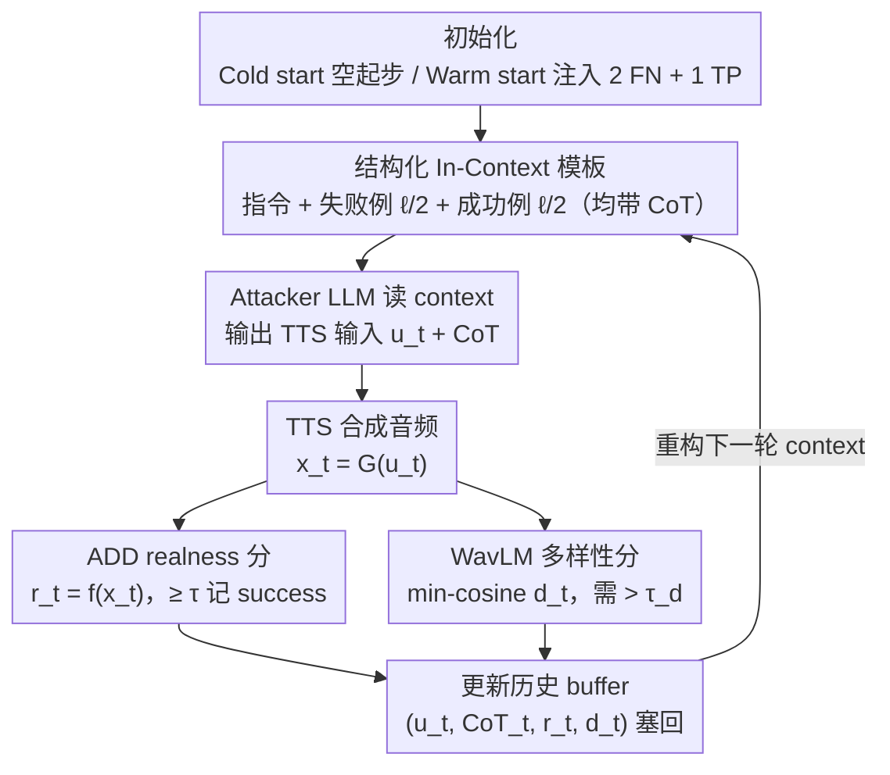

# FoeGlass: Simple In-Context Learning Is Enough for Red Teaming Audio Deepfake Detectors

**会议**: ICML 2026  
**arXiv**: [2606.05101](https://arxiv.org/abs/2606.05101)  
**代码**: 待确认  
**领域**: AI 安全 / 音频深伪检测 / 自动化红队  
**关键词**: 音频深伪检测、红队、In-Context Learning、TTS 攻击、多样性反馈

## 一句话总结
FoeGlass 把"用 LLM 红队 LLM"的思路搬到音频深伪检测（ADD）上：不微调 LLM，仅通过 in-context learning + 真实度/多样性双反馈，让黑盒 reasoning LLM 自动写 TTS prompt 去骗 ADD，cold start 即可把现有 ADD 的 FNR（假阴率）从 0% 拉到最高 96%，且攻击在 8 个 ADD 之间高度可迁移。

## 研究背景与动机

**领域现状**：音频深伪检测（ADD）是对抗 TTS 滥用的第一道防线，主流评测靠 ASVspoof5、VoxCelebSpoof 等人工策划的 spoof 数据集，覆盖多种 spoof 技术、声学条件与对抗扰动。

**现有痛点**：(i) 数据集人工收集成本高；(ii) 对单个 TTS 模型可生成的"挑战性输出"覆盖严重不足，无法发现 ADD 的 blind spot；(iii) 已有自动化攻击只在某条参考音频附近加扰动（low-norm perturbation），停留在局部，不能从生成模型本身去采"自然对抗样本"。

**核心矛盾**：要想真实地评估 ADD，必须从 TTS 的输出分布里直接采那些天然就能骗过 ADD 的样本（natural adversarial examples），但 TTS 输入空间组合爆炸，人工 prompt engineering 不可扩展；若把 LLM 社区的"用 attacker LLM 微调红队 target LLM"直接照搬到 ADD，又会遇到三连击：FN 样本稀缺（无法构造微调集）、RL 微调易收敛为单一确定策略（多样性塌缩）、需要 LLM 权重（顶级闭源 LLM 无法使用）。

**本文目标**：在仅黑盒访问 reasoning LLM、TTS 与 ADD 的前提下，自动、高效、且具多样性地从 TTS 输出空间里采出能让 ADD 误判的样本。

**切入角度**：作者观察到 reasoning LLM 的 in-context learning 能力已经足够强 —— 只要把"过去攻成功/失败的 TTS prompt + CoT + 分数 + 多样性反馈"塞进 context，LLM 就能自己迭代地把 TTS prompt 推向 ADD 的 blind spot，不需要任何参数更新。

**核心 idea**：把红队问题变成"黑盒 in-context optimization"——LLM 写 TTS 输入 → TTS 合成音频 → ADD 打 realness 分 + WavLM 算 min-cosine 多样性分 → 反馈塞回 context 下一轮，配合精心设计的 context 模板抑制 mode collapse。

## 方法详解

### 整体框架
FoeGlass 要解决的是"怎么不微调、不碰权重，就让一个黑盒 reasoning LLM 自动写出能骗过 ADD 的 TTS prompt"。它把红队问题形式化成一个采样问题：TTS 是 $G:\mathcal{U}\to\mathcal{X}$（把文本 prompt/参数映到音频），ADD 是二分类器 $f:\mathcal{X}\to[0,1]$，阈值 $\tau$，定义期望分类分数 $F(u)=\mathbb{E}[f\circ G(u)]$，红队的目标就是从 $F^{-1}((\tau,1])$——那些"会被 ADD 判成 real"的 TTS 输入子集里采样。

整个流程是一个不更新任何权重的 in-context 闭环：每轮 $t$，attacker LLM 读当前 context，吐出一个 TTS 输入 $u_t$ 和它的 CoT；TTS 把它合成成音频 $x_t=G(u_t)$；ADD 给一个 realness 分 $r_t=f(x_t)$；再用 WavLM 嵌入算这条音频相对历史的多样性分 $d_t = 1 - \max_{z\in w(X_\text{hist})}\langle w(x_t), z\rangle_{\cos}$；最后把 $(u_t, \text{CoT}_t, r_t, d_t)$ 塞回历史 buffer，重构下一轮 context。LLM、TTS、ADD 三者全程黑盒，只交换文本与分数。

### 关键设计

**1. 结构化 In-Context 模板：把整个红队经验压成一段上下文，让 LLM 在线"学会"哪些 prompt 能骗过 ADD**

纯让 LLM 无条件乱采 TTS prompt（unconditional baseline）成功率极低，很多场景 FNR < 10%，因为它根本不知道 ADD 的薄弱点在哪。FoeGlass 的做法是把每一轮的成败经验结构化地喂回 context，让 in-context learning 自己往 blind spot 收敛。context 分三段：(a) instruction prompt，描述任务并逐项解释 TTS 参数（transcript / speed / temperature / style / voice）的语义，强制 LLM 输出 JSON；(b) 最近 $\ell/2$ 个**失败**攻击连同它们的 CoT、分数和多样性反馈；(c) 历史 realness 分最高的 $\ell/2$ 个**成功**攻击连同 CoT、分数、反馈。论文用 DeepSeek-R1-Distill-Llama-3.1-8B 当 attacker，$\ell=40$。把 CoT 一起喂回去是关键——它让 LLM 能延续上一轮的推理脉络而不是每轮从零猜，附录 B 的消融证明去掉 CoT 后效果明显下滑。这种"一半成功 + 一半失败"的对比结构也比只塞成功例更稳，因为只看成功例 LLM 容易认定某个模板万能、反复套用同一个 prompt。

**2. Realness + 多样性双反馈，多样性用 min-cosine 而非 avg-cosine：从根上掐掉 mode collapse**

red-teaming 最常见的翻车就是 mode collapse——LLM 一旦找到某个能骗过 ADD 的 prompt，就反复换皮重写同一套。FoeGlass 给 LLM 两路标量信号来平衡 explore/exploit：realness 直接取 $f(x_t)$，达到阈值 $\tau$ 就判 success，反馈文本里写明 "Success/Failed (score=…)"；多样性则衡量这条新样本是不是在重复历史。多样性最自然的写法是平均余弦距离 $d_\text{avg}(x';X)=1-\frac{1}{|w(X)|}\sum_{z\in w(X)}\langle w(x'),z\rangle_{\cos}$，但平均会被远样本稀释——哪怕 $x'$ 在历史里已经有个极近的邻居，只要其余历史样本都很远，$d_\text{avg}$ 照样偏大，照样判它"够多样"。论文改用**最小**余弦距离 $d(x';X)=1-\max_{z\in w(X)}\langle w(x'),z\rangle_{\cos}$，把多样性变成硬约束：新样本必须和**所有**历史样本都足够远（$d>\tau_d$，WavLM 嵌入，$\tau_d=0.01$）才算合格，否则就追加一句 "输出过于相似，请修改 transcript 增加多样性"。min 距离才真正捕捉"是否重复"，而把多样性做成反馈而非优化目标，又保留了 LLM 自己权衡探索与利用的余地。

**3. Cold-start / Warm-start 双模式与跨 ADD 迁移：零已知 FN 也能起步，攻一个 ADD 顺带攻倒另外七个**

传统微调式 attacker 需要大量 FN 样本来构造训练集，而 ADD 场景里 FN 极其稀缺，这条路天然走不通；in-context 路线正好适配低数据。cold start 时 instruction prompt 不带任何示例、历史从空开始就能跑；warm start 也只需把 2 条已知 FN + 1 条 TP 嵌进 instruction，不引入任何额外计算，就能再涨一截。只靠 3 条示例就显著涨点，恰恰说明 LLM 学到的是"如何 reason 出 blind spot"而非死记某个成功 prompt。同样的道理也解释了迁移性：in-context 探索趋向的是 TTS 输出空间里"被多个 ADD 共同忽视"的区域，而不是某个 ADD 的局部漏洞，所以对一个 ADD 攻出来的样本能直接迁移到其余 7 个；论文用 8 个 ADD × 3 个 TTS 的全连接迁移矩阵验证了这点。

### 损失函数 / 训练策略
**无任何训练**。FoeGlass 完全是 inference-time pipeline，唯三超参：context 长度 $\ell=40$、多样性阈值 $\tau_d=0.01$、迭代轮数 $T$（每次跑生成 500 个样本）。每个实验 5 个 seed 取均值方差。

## 实验关键数据

### 主实验：FNR 显著提升（8 个 ADD × 3 个 TTS）

| TTS | ADD | Uncond. Sampling FNR(%) | FoeGlass Cold FNR(%) | FoeGlass Warm FNR(%) |
|---|---|---|---|---|
| VITS | VIT-VoxCeleb-ConstantQ | 42.02 | 94.04 | **96.15** |
| VITS | VIT-VoxCeleb-MFCC | 32.57 | 95.28 | **98.08** |
| Kokoro-82M | VIT-VoxCeleb-MelSpec | 0.00 | 7.52 | **39.72** |
| xTTS-v2 | VIT-VoxCeleb-ConstantQ | 2.24 | 80.72 | **96.29** |
| xTTS-v2 | VIT-VoxCeleb-MFCC | 9.16 | 71.60 | **93.13** |
| xTTS-v2 | AST-VoxCeleb | 9.68 | 48.43 | **63.30** |

最大绝对提升约 +94 个百分点（xTTS-v2 → VIT-VoxCeleb-ConstantQ：2.24% → 96.29%）；即便对 ASVspoof5 训练（已见过 VITS 数据）的 ADD，cold start 仍能拿到 74.2% FNR，说明 ASVspoof5 并未覆盖 VITS 的全部输出空间。

### 消融与对照

| 实验配置 | 关键指标 | 说明 |
|---|---|---|
| Cold vs Warm | warm 多数场景 +2~+30 FNR | 仅需 2 个 FN + 1 个 TP 示例即可，无额外算力 |
| 用 FoeGlass 数据微调 RawNetLite | 49.6% → **8.2%** acc（-41）| 在 held-out VITS 集上更鲁棒 |
| 用 FoeGlass 数据微调 AASIST（黑盒迁移）| 15.2% → **0.2%** acc（-15）| 数据由攻击 RawNetLite 时生成，未查询 AASIST |
| vs ASVspoof5 同 TTS 子集（VIT-ConstantQ）| 0.35% → 81.34% FNR | FoeGlass 数据比 ASVspoof5 本体难得多 |
| 无多样性反馈（附录消融）| FNR 下降、cluster 数减少 | min-cosine 反馈是抗 mode collapse 关键 |

### 关键发现
- **In-context 即可**：完全黑盒、不动权重、只靠 prompt 工程，FNR 平均从个位数 / 几十拉到 90%+，说明 reasoning LLM 的 in-context exploration 对"狭义任务"足以替代微调式 attacker。
- **min-cosine > avg-cosine**：PCA + WavLM + k-means 可视化看到攻击样本形成多个语义簇（如"social plans"、"self-reflection"），证明 min-cosine 反馈成功推动 LLM 跨语义簇采样，避开 mode collapse。
- **攻击高度可迁移**：单 ADD 攻出来的样本在另外 7 个 ADD 上几乎都比 unconditional baseline 高，意味着 FoeGlass 发现的是 ADD 共有 blind spot，而不是某个模型的局部脆弱性。
- **VoxCeleb 训练 ADD 上 Kokoro-82M 攻击最难**：cold start FNR 接近 0%，warm start 才挣到 39.72%——TTS 与 ADD 训练分布的 mismatch 仍能限制攻击成功率，提示防御方可以从训练 TTS 多样性入手。

## 亮点与洞察
- **把 in-context learning 当 black-box optimizer**：reasoning LLM 的 CoT + history 形成了一个隐式优化器，既不需要梯度，也不需要权重访问，对任何闭源 SOTA LLM 都可即插即用，这对未来"黑盒红队任意分类器"是个很通用的范式。
- **min-cosine 替 avg-cosine 是个被普遍忽视的小 trick**：在所有"基于嵌入算多样性"的生成式 red-teaming / data augmentation / RLHF 多样性奖励里都该考虑——平均距离会被远样本掩盖，min 距离才是真正的"是否重复"。
- **CoT 进 context 既调 prompt 又调推理**：把 LLM 的 CoT 反馈进自己下一轮的 context，相当于让 LLM 自己 self-reflect，是一种"无微调的 self-improvement"，可迁移到 jailbreak、red-team CV 分类器、prompt recovery 等场景。
- **攻击数据反哺训练**：FoeGlass 数据微调让 ADD 在 held-out 集上掉精度幅度比 unconditional 数据大 2 倍，说明这些"难样本"才是真正能驱动 ADD 进步的训练信号。

## 局限与展望
- **超参敏感**：context 长度 $\ell$、$\tau_d$、attacker LLM 选择都明显影响成功率与多样性；exploration/exploitation tradeoff 没自动化，仍要人工调。
- **多样性度量依赖 WavLM**：min-cosine 在 WavLM 空间上做，若该嵌入对某些 spoof 模式不敏感（如音色细节），多样性反馈可能误判，建议加多嵌入投票。
- **仅在开源 ADD 上验证**：商业 ADD（如 Pindrop、ID R&D）未测，对工业级闭源系统是否同样高 FNR 未知。
- **双刃剑**：作者明确警告 FoeGlass 可被滥用，附录 D 给了若干防御方向（如对 LLM 出口加 watermark、对 TTS 输入做异常检测），但缺少端到端防御实验。
- **未与 RL 红队定量比较**：论文论证了 RL 红队"做不到"，但没在统一指标下给 RL baseline 数字，未来值得补一个 fair comparison。

## 相关工作与启发
- **vs Low-norm Adversarial Perturbation（Li 2025 / Rabhi 2024 / Farooq 2025）**：他们在某条音频附近加 $\ell_p$ 扰动，本文直接从 TTS 输出分布里采"自然 spoof"，不需要参考音频，覆盖空间大得多。
- **vs Diffusion-based Natural Adversarial（Chen 2023a/b / Lin 2024）**：那些在 latent 或 token 空间做对抗优化，需白盒访问扩散模型；FoeGlass 完全在 prompt 空间做黑盒搜索，跨模型迁移更友好。
- **vs Zhu et al. 2024b（遗传算法搜 T2I prompt）**：最接近的精神先驱，但限定有限长度、固定词表的 prompt 空间用 GA 搜；FoeGlass 用 LLM in-context 在自由文本空间搜索，灵活性高一个量级。
- **vs LLM jailbreak（Perez 2022 / Chao 2023）**：把 LLM 红队 LLM 的范式迁移到"LLM 红队 ADD"上，关键差异是多了 TTS 这个生成中介，并把"成功/失败"信号离散化为 realness 分数。

## 评分
- 新颖性: ⭐⭐⭐⭐ 首个 ADD 自动化黑盒红队、min-cosine 多样性反馈与 CoT-in-context 设计都是切实可复用的 trick，但整体框架与 LLM jailbreak 同构，更偏"漂亮迁移"而非范式开创。
- 实验充分度: ⭐⭐⭐⭐ 8 ADD × 3 TTS 全连接、迁移矩阵、PCA 可视化、微调防御实验俱全，附录还覆盖 RawNet/AASIST/DF_Arena 系列；仅缺商业 ADD 与 RL baseline 对比。
- 写作质量: ⭐⭐⭐⭐ 问题形式化清晰，算法 1 给得很完整，pipeline 图直观；个别 section（多样性/CoT 消融）需翻附录稍打断。
- 价值: ⭐⭐⭐⭐ 直接给出可立即扩充 ADD 训练集的工具链，且揭示了 ASVspoof5 等数据集的覆盖盲点，对音频反深伪社区有显著工程与评测价值。

<!-- RELATED:START -->

## 相关论文

- [\[ACL 2026\] STAR-Teaming: A Strategy-Response Multiplex Network Approach to Automated LLM Red Teaming](../../ACL2026/llm_safety/star-teaming_a_strategy-response_multiplex_network_approach_to_automated_llm_red.md)
- [\[ICML 2026\] Stable-GFlowNet: Toward Diverse and Robust LLM Red-Teaming via Contrastive Trajectory Balance](stable-gflownet_toward_diverse_and_robust_llm_red-teaming_via_contrastive_trajec.md)
- [\[ACL 2026\] Red-Bandit: Test-Time Adaptation for LLM Red-Teaming via Bandit-Guided LoRA Experts](../../ACL2026/llm_safety/red-bandit_test-time_adaptation_for_llm_red-teaming_via_bandit-guided_lora_exper.md)
- [\[ICML 2025\] Visual Language Models as Zero-Shot Deepfake Detectors](../../ICML2025/llm_safety/visual_language_models_as_zero-shot_deepfake_detectors.md)
- [\[ICLR 2026\] Tree-based Dialogue Reinforced Policy Optimization for Red-Teaming Attacks (DialTree)](../../ICLR2026/llm_safety/tree-based_dialogue_reinforced_policy_optimization_for_red-teaming_attacks.md)

<!-- RELATED:END -->
