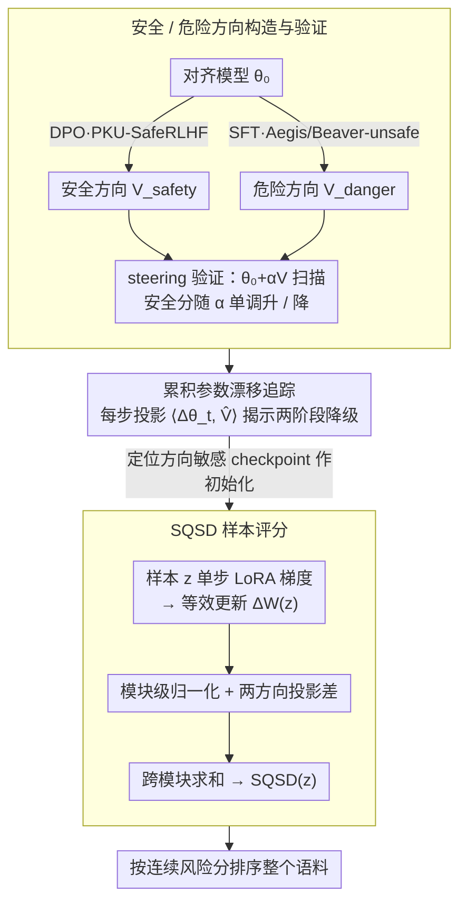

# From Parameter Dynamics to Risk Scoring: Quantifying Sample-Level Safety Degradation in LLM Fine-tuning

**会议**: ICML 2026  
**arXiv**: [2605.04572](https://arxiv.org/abs/2605.04572)  
**代码**: https://github.com/(repo) (有)  
**领域**: LLM 对齐 / 安全 / 模型压缩  
**关键词**: 安全对齐、微调风险、参数动态、任务向量、样本评分

## 一句话总结
作者通过追踪 LoRA 微调过程中参数沿"危险/安全方向"的累积漂移，发现善意数据破坏对齐的根本机制是参数在 fine-tuning 中向危险方向单调漂移；进而提出 SQSD——用单步梯度沿两方向的投影差对每个样本打连续风险分，在 3 个模型 × 2 数据集上保持单调 ASR 排名，且能跨架构、跨规模、跨 LoRA→Full 迁移。

## 研究背景与动机

**领域现状**：LLM 上线前都会做对齐 (RLHF/DPO) 以拒绝有害请求，但一旦在下游做微调，对齐就出奇脆弱——哪怕只用 100 条**完全无害**的善意指令样本，安全表现也能崩塌。这种"善意样本破对齐"的攻击比直接喂有害样本更危险，因为 toxicity classifier 根本筛不出来。

**现有痛点**：之前研究"为什么会崩"的工作有两条线：(i) 看 embedding 漂移（Vaccine 等），(ii) 看参数静态扰动（Booster、PEFT 安全分析）。但它们都只看微调前/后两个状态的快照，没追踪过程；而且只关注扰动幅度、不关注方向，所以难以区分"安全相关的漂移"和"任务相关的漂移"。挑选高风险样本的方法 (Bi-Anchor / Self-Inf-N / LARF) 又走"极端样本选择"路线，只挑最危险的子集，对中间风险样本完全失效，存在"边界坍缩"问题。

**核心矛盾**：安全降级是个**动态过程**而非静态扰动，且与"参数沿哪个方向漂移"强相关而非简单的扰动大小问题。如果只测扰动幅度，就把"任务学习"和"安全破坏"两种效应混在一起没法分开。

**本文目标**：(RQ1) 给"善意微调为什么会破对齐"提供一个机制级解释；(RQ2) 在该机制下，给**每条样本**算一个连续的、可解释的微调安全风险分。

**切入角度**：借鉴 Task Vector 思路，定义 $V_\text{safety} = \hat\theta_\text{aligned} - \theta_0$ 和 $V_\text{danger} = \hat\theta_\text{harmful} - \theta_0$ 两条语义锚向量；然后追踪 fine-tuning 每一步的累积漂移 $\Delta\theta_t = \theta_t - \theta_0$ 沿这两条方向的投影变化，把"安全降级"和"参数轨迹"直接对应起来。

**核心 idea**：用参数空间的方向投影既解释机制（累积危险漂移驱动安全崩溃），也用来对样本打分（一步梯度沿危险方向投影 − 沿安全方向投影 = 该样本的风险分 SQSD）。

## 方法详解

### 整体框架
全文围绕一个核心动作：把"安全降级"投影到参数空间里两条事先标定好的方向上看个究竟。前半部分是机制分析——构造"安全"和"危险"两条语义锚向量，沿 fine-tuning 的每一步追踪参数累积漂移在这两条方向上的投影，借此回答"善意微调为什么会破对齐"。后半部分是样本评分 SQSD——对每条候选样本只算一步 LoRA 梯度，估出它会引起的等效权重更新，再看这个更新更偏向"危险"还是"安全"方向，把投影差当成该样本的连续风险分。其中机制分析里发现的"方向敏感 checkpoint"不是顺带结论，而是 SQSD 算梯度时必须落脚的初始化点，把前后两半串成一条流水线。

### 关键设计

**1. 参数空间的"安全 / 危险"方向构造与验证：把抽象的安全性变成可投影的向量**

要想"测量"安全降级，先得有一把能投影的尺子。作者借 Task Vector 的"方向 = 训练终点 − 起点"思路，造了两条语义锚向量：安全方向 $V_\text{safety} = \arg\min_\theta \mathcal{L}_\text{dpo}(\theta_0, D_\text{aligned}) - \theta_0$（在 PKU-SafeRLHF 上做 DPO 得到），危险方向 $V_\text{danger} = \arg\min_\theta \mathcal{L}_\text{sft}(\theta_0, D_\text{harmful}) - \theta_0$（在 Aegis-unsafe 和 BeaverTails-unsafe 上分别做 SFT，得到 Aegis / Beaver 两条危险方向）。光定义还不够，得证明这两条向量真的编码了安全语义，于是作者做了一个 steering 实验：沿向量走 $\theta(\alpha) = \theta_0 + \alpha V$ 扫不同 $\alpha$，结果沿 $V_\text{danger}$ 走 Safety Score 单调下降、沿 $V_\text{safety}$ 走单调上升——两条方向确实分别对应"变危险"和"变安全"的参数位移。Task Vector 此前主要用于 task arithmetic（加减能力），把它搬到安全分析上、并配 steering 验证有效性，是后续所有投影分析的地基。

**2. 累积参数漂移追踪揭示两阶段降级：用一条轨迹回答"为何崩"**

有了方向尺子，就能把"为什么崩"这个机制问题画成一张轨迹图。作者在 fine-tuning 的每个 checkpoint 计算累积漂移在两方向上的投影 $p_\text{safety}(t) = \langle\Delta\theta_t, \hat{V}_\text{safety}\rangle$ 和 $p_\text{danger}(t) = \langle\Delta\theta_t, \hat{V}_\text{danger}\rangle$，发现一个鲜明的非线性两阶段模式：早期参数沿危险方向快速漂移（投影从 0 冲到约 6.0），但 Safety Score 只从 5.0 缓降到 4.0；后期方向漂移反而变缓，Safety Score 却突然崩到 1.0 以下。这条曲线一方面印证了"safety basin"的几何直觉——在基地内对扰动鲁棒、一旦出了基地就崩；另一方面它直接指导了 SQSD 该在哪里算梯度：必须在"对方向敏感"的参数态上算，否则同样的扰动信号落在不敏感区里就毫无分辨力。

**3. SQSD：单步梯度沿两方向投影差作为样本风险分**

机制清楚之后，把同一把尺子用到单条样本上就得到 SQSD。对样本 $z$ 算一步 LoRA 梯度，导出它的等效权重更新 $\Delta W(z) \approx -\eta(B_0 \nabla_A + \nabla_B A_0)$（忽略 $\mathcal{O}(\eta^2)$ 二阶项），再看这个更新更靠近危险方向还是安全方向。具体地，对每个 LoRA 模块 $m$ 先做模块级归一化、再算两方向的投影差：

$$\text{SQSD}_m(z) = \left\langle\frac{\Delta W_m(z)}{\|\Delta W_m(z)\|_2}, \hat{V}_{\text{danger},m}\right\rangle - \left\langle\frac{\Delta W_m(z)}{\|\Delta W_m(z)\|_2}, \hat{V}_{\text{safety},m}\right\rangle$$

最终在所有模块上求和 $\text{SQSD}(z) = \sum_m \text{SQSD}_m(z)$。作者用一阶 Taylor 展开证明这个投影差对应该样本把模型推向 $\theta_\text{danger}$ vs $\theta_\text{safety}$ 的相对程度，所以分数可解释。两个细节决定了它管不管用：其一，模块级归一化是为了消掉"response 长度偏差"——梯度幅度天然和回答长度正相关，不归一化的话短回答样本会被错误地排成高风险；其二，初始化必须落在设计 2 发现的那个"方向敏感参数态"（fine-tuning 中段的高敏感 checkpoint）上，否则投影信号分辨不出样本风险。也正因为给的是连续分数而非"极端 top-k 选择"，SQSD 能覆盖整个 risk spectrum，包括以往方法完全失效的中间风险样本。

### 损失函数 / 训练策略
SQSD 本身不引入新的训练目标，但有一组关键配置：所有 LoRA fine-tuning 用 $r=8, \alpha=16$；构造方向向量时 lr=5e-6，评估 SQSD 时刻意把 lr 调到 5e-5 以诱发更明显的安全降级。可解释性的根基是一阶 Taylor 推导 $\eta[\mathcal{L}(z, \theta_\text{ref}) - \mathcal{L}(z, \theta_\text{target})] \approx (\theta' - \theta_\text{ref})^\top (\theta_\text{target} - \theta_\text{ref})$，它把"梯度更新方向 vs 目标方向"的内积和损失变化挂上钩，给 SQSD 提供了 preference-based 的解读。

## 实验关键数据

### 主实验
3 个模型（Qwen3-8B / Llama-3.1-8B-Instruct / Llama-2-7B-Chat） × 2 数据集（Dolly / Alpaca），每个 dataset 按 SQSD 排名拆成 S1-S5 五个子集（各 1000 条，从最高风险到最低风险），分别 fine-tune 后测 ASR 看是否单调下降。

| 模型 + 数据 | S1 ASR | S5 ASR | Δ (S1-S5) | 单调? |
|-------------|--------|--------|-----------|-------|
| Qwen3-8B / Dolly / SQSD(Beaver) | 71.27 | 2.55 | **+68.72** | ✓ |
| Qwen3-8B / Alpaca / SQSD(Beaver) | 50.91 | 3.27 | +47.64 | ✓ |
| Llama3.1-8B / Dolly / SQSD(Beaver) | 79.82 | 4.73 | +75.09 | ✓ |
| Llama2-7B / Dolly / SQSD(Beaver) | 45.27 | 0.36 | +44.91 | ✓ |
| Reward Model baseline (Dolly avg) | 57.27 | 8.00 | 49.27 | ✗ |
| LARF baseline (Dolly avg) | 48.91 | 4.61 | 44.30 | ✗ |

SQSD 在 **10/12 配置下保持严格单调**（其他 baseline 最多 1/6 单调），且平均 Δ 49.86% 超过最强 baseline (Reward Model 43.76%)。这意味着 SQSD 不仅能挑出极端高风险样本，还能正确给中间样本排序——baselines 普遍在中段乱序。

### 消融实验

| 配置 | S1 ASR | Δ | 单调? |
|------|--------|---|-------|
| SQSD (full) | 71.27 | 68.72 | ✓ |
| w/o module-wise normalization | 13.09 | 12.54 | ✗（被 response length 主导）|
| Danger direction only | 68.36 | 64.54 | ✗（缺安全反向约束）|
| Safety direction only | 27.09 | 20.91 | ✗（无危险信号）|
| Insensitive initialization | 38.36 | 37.27 | ✗（参数态不敏感时投影信号失效）|

| 迁移实验 | S1 | S5 | 单调? |
|----------|-----|-----|-------|
| Llama → Qwen | 42.55 | 1.64 | ✓ |
| Qwen → Llama | 79.64 | 28.00 | ✓ |
| Qwen-8B → 14B | 55.09 | 7.09 | ✓ |
| Qwen-8B → 32B | 28.91 | 2.00 | ✓ |
| Qwen LoRA → Full FT | 10.73 | 2.55 | ✓ |

### 关键发现
- **模块级归一化是必需品**：不做归一化会让 response length 偏差完全压过真实风险信号，Δ 从 68.72 崩到 12.54，单调性也丢了。
- **必须同时用两条方向**：只看 danger（Δ=64.54 但非单调）或只看 safety（Δ=20.91 且非单调），都不如 full version。两条方向是互相校准的：danger 方向告诉你"被推到多危险"，safety 方向告诉你"被推离多安全"，两者差才是净风险。
- **初始化敏感性是 SQSD 的关键限制**：必须在"方向敏感参数态"（fine-tuning 中段的 high-sensitivity checkpoint）计算 SQSD，在 $\theta_0$ 这种不敏感态算的话排名完全失效。作者形式化定义了 linear-path 和 drift-enhanced 两种敏感性，并给出 top-5 checkpoint 选择策略。
- **跨架构 / 跨规模 / LoRA→Full 都能迁移**：意味着 SQSD 捕捉到的"sample-level danger drift propensity"是相对架构无关的样本属性，实用价值大——可在小模型上算分，部署到大模型上做数据筛选。

## 亮点与洞察
- **"参数动态视角"是从静态扰动分析里跳出来的关键**：与其问"微调前后参数差异多大"，不如问"参数在 fine-tuning 过程中朝什么方向漂、漂得多远"。这个视角直接揭示了"两阶段崩溃"的非线性，并把"安全相关漂移"和"任务相关漂移"分开来看，是这类安全机制分析里少见的清晰框架。
- **连续风险评分 vs 极端选择的区别值得强调**：以前的方法（Bi-Anchor / Self-Inf-N / LARF）都只能挑出最危险的 top-k 样本，导致后续 fine-tuning 策略只能"避开极端"，对中间样本毫无判断力；SQSD 给出全谱评分，未来可以衍生"按风险分加权的安全 fine-tuning 算法"。
- **Task Vector 的"安全用法"是个不错的延伸**：原始 task vector 用于 task arithmetic（加/减能力），这里改成"加/减安全性"，并给出方向有效性的 steering 实验验证——是该家族在 safety alignment 上一个干净的应用范例。
- **跨规模迁移给"小模型预筛选 + 大模型部署"提供路径**：实践上 SQSD 不需要在巨型模型上算梯度，可以先在 8B 上算分再用到 32B / Full FT，极大降低数据筛选成本。

## 局限与展望
- SQSD 高度依赖 initialization 的"方向敏感性"，作者承认在某些配置下即使选了 top1 sensitive checkpoint，排名一致性也不能保证完美，需要 fallback 到 top3/top4——这是个仍未完全解决的鲁棒性问题。
- 安全/危险方向构造本身依赖一次完整的 DPO/SFT 训练，成本不算便宜；如何更轻量地构造方向（甚至 zero-shot）是值得探索的方向。
- 实验全部限定在 LoRA 微调（虽然展示了 LoRA→Full 迁移），但 LoRA 本身就限制了梯度方向，full FT 下的 SQSD 行为可能更复杂。
- 没有把 SQSD 集成进 fine-tuning 算法本身——只展示了"按 SQSD 拆数据集 fine-tune"的诊断价值，没有 propose "risk-weighted SFT" 或 "risk-aware data filtering" 这类直接应用，是个明显的 follow-up 空间。

## 相关工作与启发
- **vs Bi-Anchor / Self-Inf-N / LARF**: 这些都用 embedding 或 raw gradient 相似度做风险评估，不区分方向；SQSD 用"危险 vs 安全"两条参数方向的投影差，方向敏感性更强，且能连续打分而非只挑极端。
- **vs Vaccine / Booster**: 这俩从静态扰动角度看安全脆弱性，没追踪动态过程；本文的两阶段轨迹观察显著扩展了对崩溃机制的理解。
- **vs LESS (gradient-based data selection)**: 后者是通用的影响估计；SQSD 专门做安全维度，且给出 task-vector 解读，方向更清晰。
- **vs Safety Basin 理论 (Peng et al.)**: 两阶段漂移现象正好印证了 safety basin——基地内对扰动鲁棒、出了基地就崩；SQSD 把这个几何直觉转化成了一个可操作的样本评分。

## 评分
- 新颖性: ⭐⭐⭐⭐ "参数动态 + 两方向投影差"作为安全风险评分是个相当清晰的新视角，机制分析和评分方法配套成立。
- 实验充分度: ⭐⭐⭐⭐ 3 模型 × 2 数据 + 5 baseline + 5 类消融 + 跨架构/规模/PEFT 迁移，覆盖面够；但 benchmark 仅限 CategoricalHarmfulQA/AdvBench/HEx-PHI，少了更广的多语种/多模态安全测试。
- 写作质量: ⭐⭐⭐⭐ RQ1 → 机制发现 → RQ2 → 方法 → 理论 → 实验，结构线性清晰；图 1 的概念图很到位。
- 价值: ⭐⭐⭐⭐ 既给了一个可解释的安全机制框架，又提供了实用的样本评分工具，对生产环境的 fine-tuning 安全审计有直接价值。

<!-- RELATED:START -->

## 相关论文

- [\[ACL 2026\] FlexGuard: Continuous Risk Scoring for Strictness-Adaptive LLM Content Moderation](../../ACL2026/llm_safety/flexguard_continuous_risk_scoring_for_strictness-adaptive_llm_content_moderation.md)
- [\[CVPR 2026\] Harmonious Parameter Adaptation in Continual Visual Instruction Tuning for Safety-Aligned MLLMs](../../CVPR2026/llm_safety/harmonious_parameter_adaptation_in_continual_visual_instruction_tuning_for_safet.md)
- [\[CVPR 2026\] FairLLaVA: Fairness-Aware Parameter-Efficient Fine-Tuning for Large Vision-Language Models](../../CVPR2026/llm_safety/fairllava_fairness-aware_parameter-efficient_fine-tuning_for_large_vision-langua.md)
- [\[ICML 2026\] PFT: Phonon Fine-tuning for Machine Learned Interatomic Potentials](pft_phonon_fine-tuning_for_machine_learned_interatomic_potentials.md)
- [\[ICML 2026\] Decoupled Training with Local Reinforcement Fine-Tuning in Federated Learning](decoupled_training_with_local_reinforcement_fine-tuning_in_federated_learning.md)

<!-- RELATED:END -->
