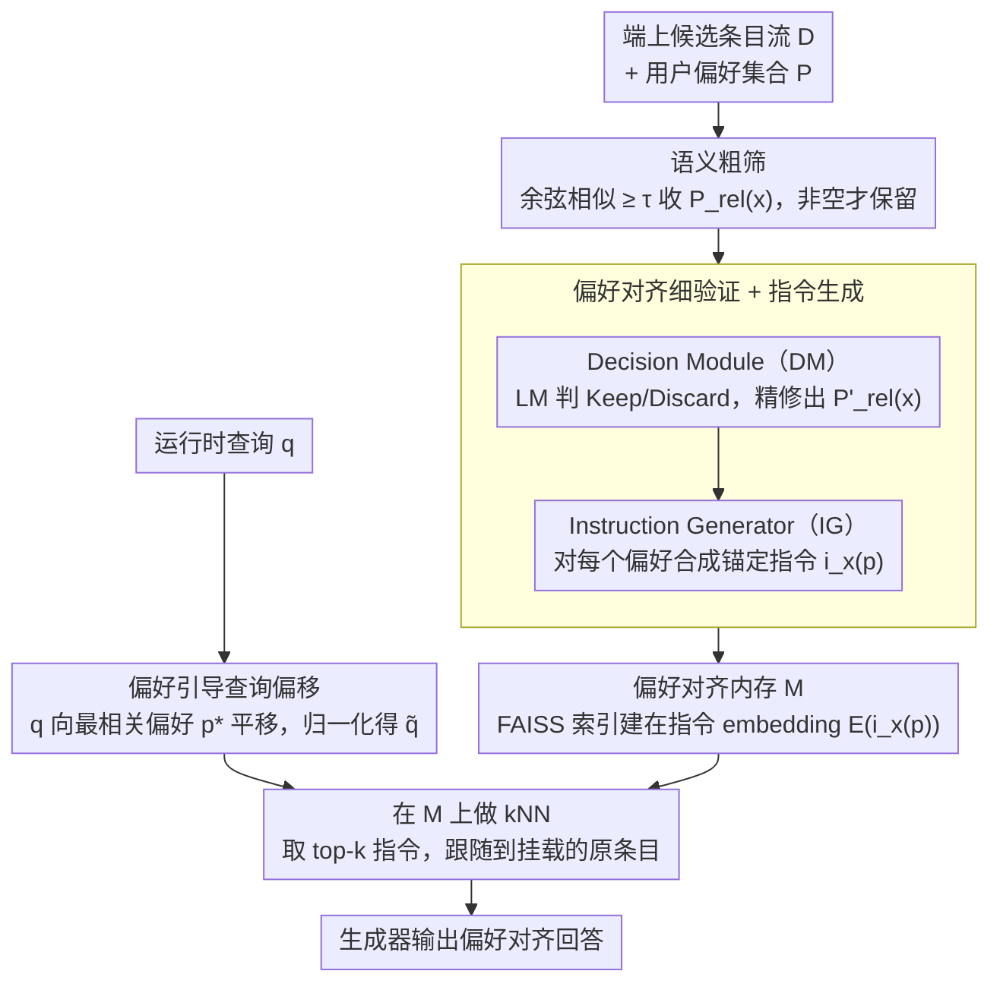

# From Volume to Value: Preference-Aligned Memory Construction for On-Device RAG

**会议**: ICML 2026  
**arXiv**: [2605.18271](https://arxiv.org/abs/2605.18271)  
**代码**: https://github.com/UbiquitousAILab/EPIC (有)  
**领域**: 信息检索 / 端侧 RAG / 个性化  
**关键词**: on-device RAG, 用户偏好, 内存约束, 指令式索引, 查询引导

## 一句话总结
EPIC 把端侧 RAG 的核心瓶颈从「检索时怎么用偏好」前移到「索引时存什么」，用「粗筛 + 细验证 + 查询偏移」三段式 pipeline 只保留与用户偏好对齐的数据并生成「指令-条目」对作为索引单元，在 4 个偏好基准上把存储减小 2404× 的同时偏好对齐准确率绝对提升 20.17 个百分点。

## 研究背景与动机

**领域现状**：以 LLM 为核心的个人 AI agent 越来越多落到手机/边缘设备上以保证隐私与响应速度，agent 需要把生成 ground 在端上的个人语料（浏览历史、对话、推送、Wiki 等）上。RAG 是把外部知识接进来的主流方案，已有大量个性化 RAG 工作：在 memory 侧把用户写过的内容/profile 组织成图（EMG-RAG、PEARL），在 query 侧用偏好重写或扩展查询（Cognitive Personalized Search、PBR）。

**现有痛点**：当场景搬到端侧时，存储和功耗是硬约束。现有工作基本都假设语料已经被「精挑细选」过，问题只剩下 query 时怎么用；可在端侧场景里 raw data 是异质且不断增长的（Wikipedia、Common Crawl、对话流、推送…），无差别地把所有数据建索引在 1 MB 量级的内存预算下根本放不下，HippoRAG 2 的索引甚至到了 2.9 GB。同时标准 retriever 只对齐 query-text 相似度而对用户偏好「不可知」，会出现「检索到的内容事实正确但违背用户偏好」（如对海鲜过敏的用户被推荐刺身）的偏好失配问题。

**核心矛盾**：端侧内存有限 vs 个人数据无限增长；retriever 的目标是 query 相似 vs 用户真正想要的是偏好对齐——两个目标在「索引建什么、查询匹配什么」上其实是耦合的，但现有方法把它们拆开优化。

**本文目标**：在端侧 tight budget 下，回答「what should be stored」这个被前人忽略的更上游问题，同时把同一份偏好信号在索引和检索两端复用。子问题包括：(i) 如何高吞吐地丢掉绝大多数与偏好无关的内容；(ii) 如何对潜在相关内容做语义级精验证并把「该怎么用这条数据」也存下来；(iii) 如何让 query 端的 embedding 也带上偏好语义而几乎不增加延迟。

**切入角度**：在所有形式的个人 context 中，**用户偏好**（preferences）是最紧凑、最稳定的抽象——口味、忌口、风格偏好这些跨 session 不变，可以从对话历史隐式抽出，而且对用户满意度起主导作用。把偏好集合 $P = \{p_1, \dots, p_N\}$ 作为「索引时已知」的先验，问题就变成「在 $P$ 给定的条件下，怎么从 raw stream 里挑出偏好相关子集并以偏好对齐的方式索引」。

**核心 idea**：把「个性化 RAG」从 query-side 重构为 **memory-construction problem**——把偏好贯穿 (1) 用 embedding 相似度做高召回粗筛 → (2) 用 LM 做细粒度验证并合成「锚定指令」(anchor instruction) 作为索引单元 → (3) 检索时把 query 朝最相关偏好的方向偏移，使整个 pipeline 既存得少、又找得准。

## 方法详解

### 整体框架
输入是端上不断增长的候选条目集合 $\mathcal{D}$（Wiki 段落、对话片段、网页等）和一组用户偏好 $P = \{p_1, \dots, p_N\}$（显式给出或由独立 pipeline 抽取）；输出是一份紧凑的偏好对齐内存 $\mathcal{M}$，每条记录形如 $(x, i_x(p), p, E(i_x(p)))$，即「原始条目 + 偏好条件指令 + 对应偏好 + 指令 embedding」。运行时给定 query $q$，先把 $q$ 朝最相关偏好偏移得到 $\tilde q$，再在 $\mathcal{M}$ 的指令 embedding 上做 FAISS kNN，取到的指令指向其挂载的原始条目，把条目作为上下文交给生成器输出偏好对齐回答。整个 pipeline 把 LM 调用控制在小子集上（平均每条入流数据只触发 0.22 次 fine verification）。索引侧（粗筛 + 细验证）和检索侧（查询偏移 + kNN）共享同一份偏好集合 $P$，互不重复编码。

### 关键设计

**1. 语义粗筛（Semantic-Based Coarse Filtering）：用纯 embedding 几何把 LM 调用域压到极小子集**

raw stream 里 99% 以上的内容跟当前用户偏好毫无关系，要是每条都丢给 LM 验证，端上成本根本扛不住。粗筛的思路是先用一层不花钱的几何近似把绝大多数无关条目剪掉：用一个共享 sentence encoder（如 Contriever）把 item $x$ 和每条偏好 $p$ 都编成 $\ell_2$ 归一化向量 $E(\cdot) \in \mathbb{R}^d$，对每个 $x$ 算它和所有偏好的余弦相似度 $\mathrm{Sim}(E(x), E(p))$，把超过阈值 $\tau$ 的偏好收成 $P_{rel}(x) = \{p \in P \mid \mathrm{Sim}(E(x), E(p)) \ge \tau\}$。只要 $P_{rel}(x)$ 非空就保留 $x$（即 $\mathcal{D}_{coarse} = \{x \mid P_{rel}(x) \neq \emptyset\}$），而且把 $x$ 连同它候选的偏好子集一起带到下一阶段，省得下游再重算一次相似度。这一步是整套内存节省和低索引延迟的根本来源——消融里光粗筛就拿到 3.95×–77.68× 的存储压缩，端上每条 item 的索引也压到 102.67 ms。

**2. 偏好对齐细验证 + 指令生成（Preference-Aligned Fine Verification）：从向量近似升级到语义对齐，并把「怎么用」一起存进索引**

embedding 相似只能近似语义，碰到「dislike seafood」vs「sushi menu」这种细 trade-off 会把语义无关的噪声也放进来，必须靠 LM 显式判别。这一阶段串两个 LM 模块：Decision Module (DM) 对 $(x, P_{rel}(x))$ 输出结构化的 $(\mathrm{Decision}, \mathrm{Rationale}, P'_{rel}(x))$，其中 $\mathrm{Decision} \in \{\langle \text{Keep}\rangle, \langle \text{Discard}\rangle\}$、$P'_{rel}(x) \subseteq P_{rel}(x)$ 是精修后真正相关的偏好子集，只有 Keep 的条目进入 $\mathcal{D}_{fine}$；Instruction Generator (IG) 再以 $(x, p, \mathrm{Rationale})$ 为输入，对每个 $p \in P'_{rel}(x)$ 生成一条偏好条件指令 $i_x(p) = \mathrm{IG}(x, p, \mathrm{Rationale})$，刻画「在该偏好下该怎么用这条数据」。最终内存是 $\mathcal{M} = \{(x, i_x(p), p, E(i_x(p))) \mid x \in \mathcal{D}_{fine}, p \in P'_{rel}(x)\}$。这里最关键的一招是 **FAISS 索引建在 $E(i_x(p))$ 上而不是 $E(x)$ 上**——检索匹配的是「用法指令」，命中的指令再指回原 item 交给生成器。而把判别时产生的 Rationale 直接复用为指令生成的输入，等于一次 LM call 多用途，把「这条数据为什么和该偏好相关」固化到索引层。索引指令而非原文，相当于把「找语义相似的事实」升级成「找匹配当前偏好用法的事实」，这正是准确率从纯粗筛跳到全 pipeline 提升 +13.22–+33.69%p 的来源。

**3. 偏好引导查询偏移（Preference-Guided Query Steering）：零参数地把 query 拉进偏好子空间**

索引侧虽然已经把偏好编进了指令 embedding，但 query 进来时仍然是 preference-agnostic 的，存在「同一个问题在不同偏好下本该引到不同 item」的对齐缺口。EPIC 的解法是给 query 做一次几何平移：先选出最相关的偏好 $p^* = \arg\max_{p \in P} \mathrm{Sim}(E(q), E(p))$，再向量加和归一化得到偏移后查询 $\tilde q = (E(q) + E(p^*)) / \|E(q) + E(p^*)\|$，用 $\tilde q$ 在 FAISS 指令索引上做 kNN 取 top-k 指令，跟随到挂载的 item 作为生成上下文。这是个零参数、零额外 LM 调用的操作，整个 steering 在 Jetson Orin Nano 上只加 0.18 ms / query。对比 Pref-QR / PBR 那种「query 端调 LM 改写/扩展」的方案，它省掉了每个 query 几百毫秒的 LLM 调用，又让同一份偏好信号在索引和检索两端各用一次。

### 损失函数 / 训练策略
EPIC 是一套**纯推理时 pipeline**，不引入新的训练目标和参数：共享 encoder 用 Contriever 等现成模型，DM/IG 用现成 LLM（实验里用 Qwen3-4B / Llama-3.1-8B / gpt-oss-20b 等做下游生成，judge 用 LLaMA-3.3-70B-Instruct）。唯一可调的就是粗筛阈值 $\tau$ 以及 IG 的 prompt（详见 Appendix E）。这使其可以即插即用地套到任何 retriever / 任何 LLM 后端上，消融里把 C/F/S 加进 HippoRAG 2 也复现了相同趋势。

## 实验关键数据

### 主实验
四个偏好基准上的 preference-following Accuracy(%)，judge 统一用 LLaMA-3.3-70B-Instruct，主结果如下表（截取 Llama-3.1-8B-Instruct 后端 + gpt-oss-20b 后端）：

| 后端 | 方法 | PrefWiki | PrefRQ | PrefELI5 | PrefEval |
|------|------|----------|--------|----------|----------|
| Llama-3.1-8B | BM25 | 38.56 | 64.22 | 69.04 | 27.97 |
| Llama-3.1-8B | NV-Embed-v2（之前最强） | 44.53 | 70.22 | 69.86 | 30.88 |
| Llama-3.1-8B | HippoRAG 2 | 42.91 | 66.00 | 69.73 | 32.98 |
| Llama-3.1-8B | Pref-QR | 39.72 | 71.33 | 69.59 | 34.21 |
| Llama-3.1-8B | **EPIC** | **54.07** | **83.00** | **87.95** | **65.61** |
| gpt-oss-20b | NV-Embed-v2 | 42.29 | 86.56 | 77.01 | 29.28 |
| gpt-oss-20b | **EPIC** | **73.26** | **93.89** | **87.61** | **77.96** |

EPIC 相对 NV-Embed-v2 平均绝对提升 **+20.17%p**，在偏好密度最高的 PrefEval（对话历史）上提升尤其夸张（gpt-oss-20b 下 29.28→77.96）。

效率对比（Figure 3，括号内为绝对值）：

| 维度 | NV-Embed-v2 | HippoRAG 2 | PBR | **EPIC** | 比最强基线优势 |
|------|-------------|------------|-----|----------|----------------|
| 存储 (MB) | 648 | 2896 | 286 | **0.27** | **~2404× 更小** |
| 检索延迟 (ms) | 100 | 812 | 10073 | **3** | **~33× 更快** |
| 索引延迟 (s) | 1918 | 4726 | 654 | 246 | 与最轻量级相当 |

端上实测（Jetson Orin Nano 8GB，PrefWiki）：总检索 29.35 ms/query（其中 steering 0.18 ms、FAISS 0.14 ms，瓶颈是 query embedding 的 29.03 ms），总索引 102.67 ms/item（fine verification 平均每条只触发 0.22 次 LM 调用），内存常驻 < 1 MB；MacBook Pro M4 / Galaxy Z Flip 6 也做了同口径验证。

### 消融实验

| 配置 | 准确率提升（相对 baseline） | 存储压缩 | 说明 |
|------|----------------------------|----------|------|
| C only（仅粗筛） | 几乎不动 | **3.95×–77.68×** | 内存节省的主要来源，但准确率不稳——纯几何相似会留噪声/漏关键 |
| C + F（加细验证+指令） | **+13.22 到 +33.69 %p** | 再 ×1.95–8.93 | 准确率主要来源，instruction-centric memory 把 raw item 压成紧凑 directive |
| C + F + S（加查询偏移） | 再 **+0.78 到 +4.03 %p** | 不变 | 0 存储开销下利用已编码的偏好信号，把 query 拉进相同子空间 |

### 关键发现
- **三个模块的贡献剖面非常清晰**：C 管「存得少」、F 管「找得准」、S 管「免费再提一点」，论文给的消融把三者的作用拆得很干净，对工程落地很友好。
- **PrefEval（对话历史）数据上最猛**：所有偏好不可知方法都在 30% 上下徘徊，EPIC 跳到 65–78%——说明在偏好信号最稠密、最容易被传统 RAG 噪声淹没的场景下，「索引时就过滤」的收益最大。
- **流式偏好漂移下不掉链子**：Figure 4 里随着 5K→40K 文档涌入并伴随偏好随机切换，Contriever 内存线性增长、准确率波动，EPIC 内存几乎平线、准确率稳定占优——说明 add/remove 偏好 embedding 的增量维护是可行的。
- **可移植性**：把 C/F/S 套到 HippoRAG 2 上同样复现了「F 提对齐、C 降存储延迟、S 再加一点」的模式，证明 EPIC 是 plug-in 内存构造层而非绑定特定 retriever 的端到端方案。

## 亮点与洞察
- **把问题前移到「存什么」是真正的范式转换**：个性化 RAG 文献十之八九在 query 侧动手脚，本文把核心瓶颈定位为 memory construction，并精确指出在端侧 tight budget 下这才是上游问题——这种把研究问题往后撤一步的视角，比 marginal 涨点更有价值。
- **索引指令而非原文是非常聪明的设计**：传统索引把「条目语义」放进向量空间，但用户要的不是「最像 query 的事实」而是「最匹配当前偏好的用法」；把 LM 生成的 anchor instruction 作为索引单元，等于把「检索目标」从事实匹配升级到偏好用法匹配，且把生成时需要的「该怎么用这条数据」一起预计算好。
- **同一份偏好信号在 indexing 和 retrieval 两端复用**：粗筛、细验证、查询偏移都消费同一个 $P$，不需要训练任何对齐网络，把「偏好条件化」做成了一个零参数的几何变换 + LM call 子例程——对端上 zero-shot 部署友好。
- **可迁移 trick**：(i) $\tilde q = \text{normalize}(E(q) + E(p^*))$ 这种「向量加和做条件检索」可以直接搬到任何需要「让 retriever 注意某个 attribute」的场景（领域、风格、安全约束）；(ii) 把 Decision Module 的 Rationale 复用为 Instruction Generator 的输入，是「同一次 LLM call 多用途」的范式，可以推广到任何「先验证再生成解释」的二阶段 LM pipeline。

## 局限与展望
- 作者承认假设「偏好集合 $P$ 在索引时已知」——偏好抽取本身不在系统里，转嫁给上游 pipeline；现实里隐式偏好需要从对话流逐步推断，何时把新偏好加入 $P$、何时触发旧条目的重新筛选都没有给出策略。
- 偏好阈值 $\tau$ 和 query steering 的「相加再归一」是固定形式，对偏好之间冲突（如「喜欢辣 + 胃不好」）没显式建模，可能在多偏好相互矛盾时退化为按最大相似度的偏好走。
- Fine verification 把准确率主要交给了 LM 的判断和 instruction 生成质量，论文用的是大模型 in-context，实测端上跑 Qwen3-4B / Llama-3.1-8B 时 IG 质量的下界和 indexing 成本之间的 trade-off 没系统给出。
- 评估全部依赖 PrefEval 的 LLM-as-a-judge 框架，judge 模型本身的偏见会传播到 +20.17%p 这种数字上，需要人评做交叉验证。
- 改进方向：把偏好抽取闭环进 EPIC（联合更新 $P$ 和 $\mathcal{M}$）、显式处理偏好冲突（多 $p^*$ 加权或冲突感知 steering）、用更小的端上 LM 蒸馏 DM/IG 进一步压 indexing 延迟。

## 相关工作与启发
- **vs HippoRAG 2 / RAPTOR**：HippoRAG 在文档-实体图上传播相关性、RAPTOR 做层次摘要，都假设语料是「已经被精挑细选过」的，目标是「在固定索引上更好检索」。EPIC 直接颠倒了优先级——在 raw stream 上决定「什么进索引」，端上存储分别少 ~10000×（vs HippoRAG 2 的 2896 MB）和 ~1000×（vs RAPTOR 的 297 MB），且消融证明 EPIC 三件套可以反向插进 HippoRAG 2，二者并不互斥。
- **vs Pref-QR (Cognitive Personalized Search) / PBR**：这两条线都在 query 端用 LLM 改写或扩展 query 来注入偏好，retrieval latency 高（PBR 高达 10 s/query），且每个 query 都要重复调 LM。EPIC 把偏好对齐预先 amortize 到索引侧，retrieval 只剩一次几何偏移 + FAISS 查询（3 ms），把成本从 query-time 搬到 indexing-time，正好契合端上「查询频繁、入流数据稀疏」的负载特征。
- **vs EMG-RAG / PEARL**：这两家也做 device-derived memory，但前者把已有 memory 组织成可编辑图，后者从用户自创内容里挑——共同假设「memory 已经存在」。EPIC 直接处理上游 raw heterogeneous data 的筛选，跟它们是互补关系：完全可以先用 EPIC 把 raw stream 蒸成偏好对齐 memory，再用 EMG-RAG 把这块 memory 组织成图。

## 评分
- 新颖性: ⭐⭐⭐⭐⭐ 把个性化 RAG 的核心问题从「query 侧用偏好」前移到「索引时存什么」，并用 instruction-centric memory + query steering 把同一偏好信号在两端复用，是真正的视角转换而不是模块拼装。
- 实验充分度: ⭐⭐⭐⭐⭐ 4 个新建/沿用基准 × 3 个 LLM 后端 × 8 类 baseline + 严格的存储/延迟/索引三维 cost 分析 + Jetson Orin Nano / MacBook M4 / Galaxy Z Flip 6 三种端上实测 + 流式偏好漂移评测，对端侧场景的覆盖非常完整。
- 写作质量: ⭐⭐⭐⭐ 问题陈述（「what to store」）极有冲击力，Figure 2 的 pipeline 也清晰；扣分点在公式部分和 Appendix 内容（prompt、阈值选取、benchmark 构造）拆得有点散，正文需要回查附录才能完全复现。
- 价值: ⭐⭐⭐⭐⭐ 2404× 内存压缩 + 33× 检索加速 + 20.17%p 偏好对齐准确率提升，这种「三维同时大幅赢」的工程价值在端侧个人 agent 这条路线上几乎可以直接当 SOTA baseline，且 plug-in 性质让后续工作可以无痛集成。

<!-- RELATED:START -->

## 相关论文

- [\[ICML 2026\] Differentially Private Preference Data Synthesis for Large Language Model Alignment](differentially_private_preference_data_synthesis_for_large_language_model_alignm.md)
- [\[ICML 2026\] Memory as a Markov Matrix: Sample Efficient Knowledge Expansion via Token-to-Dictionary Mapping](memory_as_a_markov_matrix_sample_efficient_knowledge_expansion_via_token-to-dict.md)
- [\[ICML 2026\] Federated Variational Preference Alignment with Gumbel-Softmax Prior for Personalized User Preferences](federated_variational_preference_alignment_with_gumbel-softmax_prior_for_persona.md)
- [\[CVPR 2026\] V-Attack: Targeting Disentangled Value Features for Controllable Adversarial Attacks on LVLMs](../../CVPR2026/llm_safety/v-attack_targeting_disentangled_value_features_for_controllable_adversarial_atta.md)
- [\[ACL 2026\] LeakDojo: Decoding the Leakage Threats of RAG Systems](../../ACL2026/llm_safety/leakdojo_decoding_the_leakage_threats_of_rag_systems.md)

<!-- RELATED:END -->
