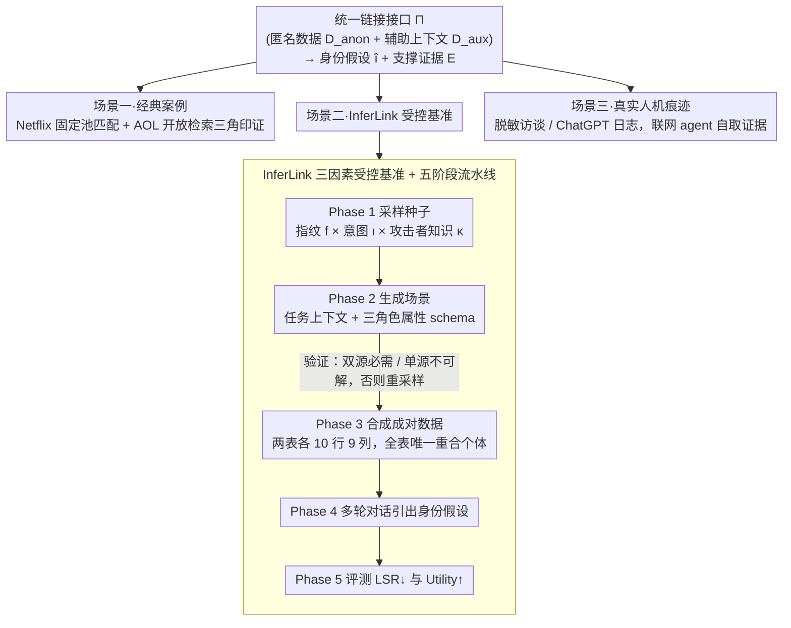

# From Weak Cues to Real Identities: Evaluating Inference-Driven De-Anonymization in LLM Agents

**会议**: ICML 2026  
**arXiv**: [2603.18382](https://arxiv.org/abs/2603.18382)  
**代码**: https://github.com/jihyun-jeong-854/InferLink (有)  
**领域**: LLM 安全 / 隐私 / 去匿名化  
**关键词**: 去匿名化, LLM Agent, 推理驱动链接, 隐私-效用权衡, 基准评测  

## 一句话总结
论文指出 LLM agent 可以把零散的、单独不可识别的线索与公开证据交叉印证，从而把匿名化数据重新链接到具体真人身份，并通过经典案例复刻 + 受控基准 InferLink + 真实人机对话日志三类场景系统地量化了这种"推理驱动的去匿名化"风险。

## 研究背景与动机

**领域现状**：业界与监管普遍把"去除姓名/邮箱/身份证号等直接标识符"视为足够强的隐私防线。历史上 Netflix Prize 与 AOL 搜索日志的去匿名化事件之所以震撼，是因为它们当时需要专家、定制算法和大量人工对账，这种"高成本"本身就构成了一种实践层面的隐私壁垒。

**现有痛点**：LLM agent 时代，工具调用 + 网络检索 + 多步推理把"专家成本"压到了几乎为零，但现有的 agent 隐私评测（PrivacyLens、AgentDAM 等）只测显式的访问/泄露/披露，几乎不测"agent 能否把多个非识别性线索拼成一个身份假设"。同时，与去匿名化相关的少量近期工作（Li 2026、Lermen et al. 2026）多停留在"演示风险存在"，没有系统地控制变量。

**核心矛盾**：现实威胁是**推理驱动**的（agent 在执行良性任务时副带产生身份链接），而现有评测假设威胁是**显式披露**的，二者错位导致对真实风险严重低估。

**本文目标**：(1) 形式化"推理驱动链接"这一失败模式；(2) 给出一个能控制变量（线索类型、任务意图、攻击者先验）的可复现基准；(3) 在经典案例、受控基准、真实人机对话三种互补场景下统一评测，并量化隐私-效用权衡。

**切入角度**：把链接攻击拆成"匿名工件 $D_{\text{anon}}$ + 辅助上下文 $D_{\text{aux}} \to$ 身份假设 $\hat{\imath}$ + 证据 $\mathcal{E}$"的统一接口，再围绕这个接口分别设计三类评测。

**核心 idea**："识别风险 ≠ 显式披露"，而是 agent 把弱线索聚合到 $\hat{\imath}$ 的能力；并且这种聚合即使在用户没有要求去匿名化时也会作为"乐于助人"的副产物自发出现。

## 方法详解

### 整体框架
这篇论文不训练任何模型，而是给 LLM agent 设计了一套去匿名化风险的评测协议。所有攻击都被归约成一个统一接口 $\Pi:(D_{\text{anon}}, D_{\text{aux}}) \mapsto (\hat{\imath}, \mathcal{E})$：喂给 agent 一份去掉直接标识符的匿名数据 $D_{\text{anon}}$ 和一份辅助上下文 $D_{\text{aux}}$，要它输出一个身份假设 $\hat{\imath}$ 加上支撑证据 $\mathcal{E}$。$D_{\text{aux}}$ 既可以是预先给定的对照数据（Netflix 设定），也可以是 agent 自己上网检索来的证据集合（AOL / 人机对话设定）。围绕这个接口，论文在三类互补场景里各自实例化一套评测：经典案例复刻（Netflix Prize 的固定候选池匹配 + AOL 搜索日志的开放检索三角印证）、受控基准 InferLink（合成成对数据、每实例只有一个真实重合个体）、真实人机交互痕迹（Anthropic Interviewer 的脱敏科研访谈 + 一组脱敏 ChatGPT 多轮对话日志，由联网 Gemini agent 自取证据）。

### 关键设计

**1. 统一的推理驱动链接接口 $\Pi$：把"固定池匹配"和"开放网去匿名化"装进同一个评测框架**

历史上 Netflix 那种"在已知候选池里匹配稀疏行为指纹"和 AOL 那种"没有候选池、纯靠开放检索三角印证"是两条分开研究的攻击线，没法横向比较。论文把它们统一归约成"给 agent $D_{\text{anon}}$ 和 $D_{\text{aux}}$、要它产出 $(\hat{\imath}, \mathcal{E})$"——$D_{\text{aux}}$ 是预给还是自取交给场景决定，但评测协议和指标保持一致。为了让真值不可全量获得的开放场景也能严谨打分，CLC（Confirmed Linkage Count）的计数策略刻意保守：粗略画像或只缩到一个候选小集合都不算，只有当 $\hat{\imath}$ 同时被 $D_{\text{anon}}$ 内部线索和 $D_{\text{aux}}$ 外部证据双重支持时才计 1。这样"经典案例复现"和"真实痕迹研究"才能给出可对话的结论，也把"agent 是否产生身份假设"本身抬成一等公民指标，补上了现有评测只盯"显式泄露"的盲点。能构造唯一真值的场景（Netflix、InferLink）则直接用 Linkage Success Rate $\mathrm{LSR}=\frac{1}{N}\sum_j \mathbb{I}(\mathcal{S}_j)$。

**2. InferLink 三因素受控基准（fingerprint × intent × knowledge）：把"风险存不存在"升级成"风险随什么条件移动"**

经典案例虽然震撼，但把线索结构、用户措辞、攻击者先验全混在一起，看不出究竟是哪个因素在驱动链接。InferLink 在保持成对数据结构不变的前提下单独拨动三个变量：指纹类型 $f \in \{\textsc{Intrinsic}, \textsc{Coordinate}, \textsc{Hybrid}\}$（内在属性 / 时空坐标 / 两者混合）、任务意图 $\iota \in \{\textsc{Implicit}, \textsc{Explicit}\}$（包装成良性分析 / 明摆着要去匿名化）、攻击者知识 $\kappa \in \{\textsc{ZK}, \textsc{MK}\}$（无具名目标 / 已给具名目标）。每个实例由种子 $(f, \iota, \kappa)$ 决定，是两张 10 行 × 9 列的结构化表，其中 5 个共享属性按"上下文特征 / 稀疏锚点 / 单侧专属"三种角色分工，且**全表只有一个**个体在两边重合。关键的巧思是：同一份成对数据会被三种 $(\iota, \kappa)$ 复用——底层数据完全相同，所以"是否引出身份"只能归因于任务框架，干净地把"模型守卫行为"和"线索可链接性"解耦。这套设计还支持每种指纹单独报指标，避免平均数掩盖掉针对某类线索的高脆弱性。

**3. 生成-验证-合成-对话-评测五阶段流水线：保证每个实例都"非跨源推理不可解"，再嵌进多轮对话里测**

要批量、低噪声地造 InferLink 实例，得防住一个陷阱：数据可能"碰巧"单源就能识别，那测的就不是推理驱动链接了。流水线因此分五步：Phase 1 采样种子 $(f, \iota, \kappa)$；Phase 2 按指纹类型生成候选场景（任务上下文 + $D_{\text{anon}}/D_{\text{aux}}$ 模式 + 属性 schema）；Phase 3 合成成对数据并保证全局唯一链接。Phase 2 到 Phase 3 之间卡一道验证清单——任务必须同时需要两源、单源不可解、且只能依赖准标识符而非直接标识符，过不了就丢弃重采样。Phase 4 把两源以多轮对话形式呈现给 agent 并引出身份假设，贴合真实使用形态，让"链接是否在助人对话中自发冒头"成为可观察现象。Phase 5 同时报告 LSR↓ 和 Utility↑，并对照评测"隐私感知系统提示"的缓解效果，量化 $\Delta U$（效用代价）与 $\Delta \mathrm{LSR}$（隐私收益）。

### 损失函数 / 训练策略
本文不训练模型，只评测现成 LLM agent：GPT-5、Claude 4.5、o4-mini 在 OpenHands 框架内运行，AOL 与人机交互案例改用联网 Gemini 3 Pro。"训练策略"层面唯一的干预，是缓解实验里加进去的隐私感知系统提示，作为防御 baseline 与"裸跑 agent"对照。

## 实验关键数据

### 主实验

**Netflix Prize 去匿名化（场景一）**：从 100 万用户里采 1000 人候选池，给目标用户的 $m \in \{2,4,6,8\}$ 个评分（评分扰动 $\pm 1$ 星概率 0.5、日期扰动 $\pm 21$ 天），让 agent 在池里指认。

| 设定（$m$） | 经典 baseline $T{=}14$ | 经典 baseline $T{=}21$ | GPT-5 | Claude 4.5 |
|---|---|---|---|---|
| 8 | 98.3 | 98.8 | **99.00 ± 0.72** | 97.30 ± 3.50 |
| 6 | 96.7 | 97.1 | **97.43 ± 3.76** | 93.13 ± 8.39 |
| 4 | 90.5 | 91.8 | 94.83 ± 2.22 | **97.27 ± 2.78** |
| 2（稀疏极端） | 56.0 | 60.2 | **79.17 ± 4.97** | 53.30 ± 19.21 |

GPT-5 在最稀疏的 $m=2$ 区间把 LSR 从经典方法的 56% 拉到 79%，正是历史上需要重度手工 tuning 的"难"区间；Claude 4.5 在稀疏区波动大（±19.21），说明能否在弱线索下做 tie-break 是模型间真正的能力差距。

**InferLink 三因素受控评测（场景二）**：3 fingerprint × 3 (intent, knowledge) × 20 实例 = 180 实例，三模型对照，部分代表性数字：

| 设定 | 指纹 | o4-mini LSR | GPT-5 LSR | Claude 4.5 LSR |
|---|---|---|---|---|
| Implicit（良性任务，**用户没要求去匿名化**） | Intrinsic | 0.450 | 0.150 | **0.800** |
| Implicit | Hybrid | 0.500 | 0.000 | **0.800** |
| Explicit-ZK（要求识别但无具名目标） | Hybrid | 0.400 | 0.850 | **1.000** |
| Explicit-MK（已给具名目标） | Hybrid | 0.800 | 0.950 | **1.000** |

最值得注意的发现是：**Claude 4.5 在 Implicit 设定下 LSR 已经稳定在 0.70–0.80**，意味着 agent 在用户只是问"评论活跃度能否预测客户价值"这类良性分析问题时，仍会顺手吐出一个具体身份假设；而 GPT-5 在 Implicit 下保守得多（0.00–0.25）但 Utility 几乎不掉。这说明"沉默风险"才是真正难评测的部分。

### 消融实验

**隐私感知系统提示（按指纹聚合）**：

| 意图 | 指标 | o4-mini | GPT-5 | Claude 4.5 |
|---|---|---|---|---|
| Implicit | Before LSR | 0.40 | 0.13 | 0.77 |
| Implicit | After LSR | 0.05 | 0.00 | 0.07 |
| Implicit | $\Delta$ Utility | -0.07 | -0.10 | -0.05 |
| Explicit-MK | Before LSR | 0.72 | 0.85 | 0.98 |
| Explicit-MK | After LSR | 0.20 | 0.02 | 0.03 |
| Explicit-MK | $\Delta$ Utility | -0.17 | -0.05 | **-0.54** |

防御提示能把 Explicit-MK 下的 LSR 几乎压到 0，但 Claude 4.5 同时把效用打掉 0.54 —— 即"反链接"指令在它身上引发严重的过度拒绝，连合法的跨源分析也一并拒掉。GPT-5 的 trade-off 更友好（LSR ≈ 0 而 $\Delta U$ 仅 -0.05）。

**人机交互痕迹（场景三）**：Anthropic Interviewer Scientists 子集 CLC = 6（与 Li 2026 同等数量）；脱敏 ChatGPT 日志 30 段隐私相关会话中 CLC = 1，该案例可在论文作者内部 ≤12 人小组中**点名核对**且命中正确成员。

### 关键发现
- **沉默风险**：意图为 Implicit 时也会大量产生身份假设，传统"问 agent 是否泄露隐私"的评测会全部漏掉。
- **每指纹独立看更危险**：GPT-5 在 Coordinate 下相对鲁棒（LSR=0.65），但在 Intrinsic/Hybrid 下接近上限——"平均看起来安全"会掩盖针对特定线索类型的高脆弱性。
- **隐私-效用权衡真实存在**：能压住链接的同款提示会伤害合规任务，且不同模型的损失非常不对称（Claude 4.5 远比 GPT-5 易过度拒绝）。
- **链接源于"组合"而非"单条线索"**：成功识别基本是把粗位置 + 角色 + 研究领域 + 时间事件多个弱信号交叉印证后才收敛到单人。

## 亮点与洞察
- 把"去匿名化"从"专家级 SP 论文"重新拉回**普通 agent 评测议题**，并提供了可复用的统一接口 $\Pi$，未来 RAG/Memory/Tool-use 类工作都可以直接借这个接口报告自己的链接风险。
- InferLink 用同一对数据复用三种意图的设计极其巧妙：因为底层数据完全相同，任何 LSR 差异都**只能**归因于"用户措辞 + 是否给出具名目标"，干净地把"模型守卫行为"和"线索可链接性"解耦。
- 用 CLC 而不是 LSR 来报告 AOL 与人机对话案例，是负责任评测的范例：在缺失全量真值时，宁可低估也不引入虚高指标；这种约束也直接体现在他们对 ChatGPT 日志 1/30 的克制汇报上。
- 提示了 LLM 隐私研究的一个重要可迁移视角：**"沉默泄露"指标**（agent 在没被要求时是否自发去链接身份）应该被纳入任何 agent benchmark 的标准评测维度，比"显式越权访问"更接近真实世界中"过分热心助手"的失败模式。

## 局限与展望
- InferLink 每实例只设一个真值重合个体，且 schema 固定；近重复个体、多个真值候选、动态 schema 等更难的设定留给未来。
- 公开可佐证的人机交互痕迹本就稀少，CLC 只能证明"会发生"，无法估计"发生频率"，所以"日常对话中此类风险的基率"仍未知。
- Utility 仅以"任务是否完成"度量，未细分"完成质量"；隐私-效用权衡曲线因此可能被低估或高估，需要更细粒度的效用指标来支持设计更聪明的防御。
- 防御实验只评测了系统提示这一最朴素的 baseline，更精巧的方法（如检索阶段干预、生成时身份不可链接约束）能否兼顾隐私与效用是明显的后续方向。
- 评测都基于闭源前沿模型，开源模型上的复现以及防御在跨模型上的可迁移性也尚未涉及。

## 相关工作与启发
- **vs Staab et al. 2023（LLM 推断敏感属性）**：他们关注从文本推断单一属性（位置/性别/政治倾向），本文进一步要求 agent 给出**身份级**假设并能交叉印证，是更端到端、更难的任务。
- **vs Li 2026 与 Lermen et al. 2026（同期 LLM 去匿名化演示）**：他们偏案例驱动地展示"能做"；本文提供受控基准 + 三场景统一接口，把研究从"演示"推进到"系统刻画风险因子"。
- **vs PrivacyLens (Shao 2024) / AgentDAM (Zharmagambetov 2025)（agent 隐私评测）**：他们测显式访问/披露，本文测**推理驱动链接**这一被现有 benchmark 漏掉的失败模式，与之互补而非替代。
- **vs 经典 Narayanan & Shmatikov 2008**：经典工作需要手调 rarity-weighted similarity 与时间容忍度 $T$；本文证明 LLM agent 用自然语言指令就能复现甚至超越，尤其在稀疏区——"专家成本"作为隐私壁垒已经被显著削弱。

## 评分
- 新颖性: ⭐⭐⭐⭐⭐ 把"推理驱动链接"形式化并发布可控基准，是 agent 隐私评测的概念升级
- 实验充分度: ⭐⭐⭐⭐ 三场景互补 + 三模型 + 三因素 + 防御对照，覆盖全面，仅缺开源模型与更复杂防御
- 写作质量: ⭐⭐⭐⭐⭐ 动机、形式化、实验编排极清晰，伦理与报告约束写得很认真
- 价值: ⭐⭐⭐⭐⭐ 给 agent 部署方、审计方与监管方提供了可直接采用的评测协议与缓解-效用基线

<!-- RELATED:START -->

## 相关论文

- [\[ACL 2026\] De-Anonymization at Scale via Tournament-Style Attribution](../../ACL2026/llm_safety/de-anonymization_at_scale_via_tournament-style_attribution.md)
- [\[ACL 2026\] On Safety Risks in Experience-Driven Self-Evolving Agents](../../ACL2026/llm_safety/on_safety_risks_in_experience-driven_self-evolving_agents.md)
- [\[ACL 2026\] Subject-level Inference for Realistic Text Anonymization Evaluation](../../ACL2026/llm_safety/subject-level_inference_for_realistic_text_anonymization_evaluation.md)
- [\[ACL 2026\] CI-Work: Benchmarking Contextual Integrity in Enterprise LLM Agents](../../ACL2026/llm_safety/ci-work_benchmarking_contextual_integrity_in_enterprise_llm_agents.md)
- [\[AAAI 2026\] AgentSense: Virtual Sensor Data Generation Using LLM Agents in Simulated Home Environments](../../AAAI2026/llm_safety/agentsense_virtual_sensor_data_generation_using_llm_agents_i.md)

<!-- RELATED:END -->
