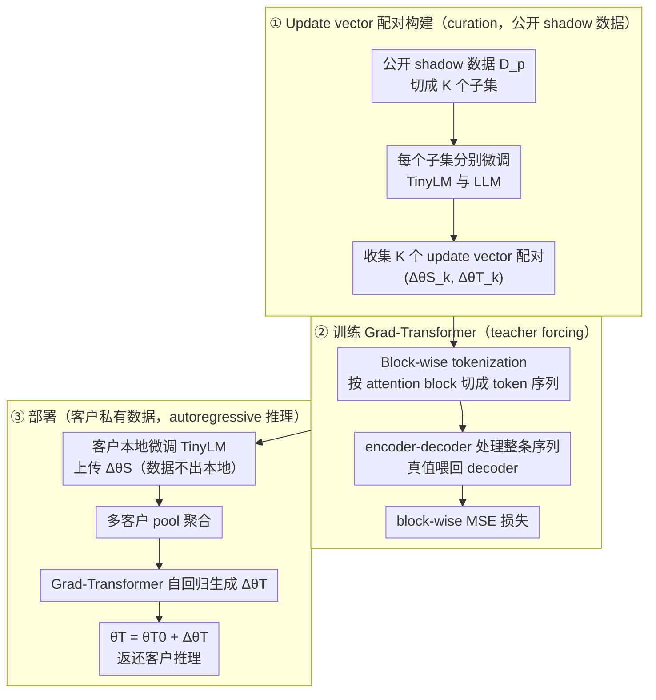

# Gradient Transformer: Learning to Generate Updates for LLMs

**会议**: ICML 2026  
**arXiv**: [2605.27591](https://arxiv.org/abs/2605.27591)  
**代码**: 待确认  
**领域**: 学习型优化器 / 数据无关知识蒸馏 / 隐私保护微调  
**关键词**: update vector, weak-to-strong distillation, Grad-Transformer, LoRA, differential privacy

## 一句话总结
本文提出 Grad-Transformer，把客户在私有数据上微调小模型 (TinyLM) 得到的 update vector，用一个 encoder-decoder Transformer 自回归地"翻译"为目标大模型 (LLM) 的 update vector，从而实现完全不接触私有数据的 weak-to-strong 知识蒸馏，在 6 个推理/摘要数据集上平均 PGR 达到 91.88%，比最优 baseline (58.94%) 提升 55.89%，且对差分隐私扰动鲁棒。

## 研究背景与动机

**领域现状**：把 LLM 微调到企业私有数据上有两条主流路：(1) 客户本地只微调一个小模型 (TinyLM)；(2) 客户把数据交给云端服务商微调大模型。前者性能差，后者违反 GDPR/HIPAA 等隐私约束。学术界的折中方案是 data-free knowledge distillation：训一个生成器去合成"看起来像"私有数据的样本来蒸馏 student。

**现有痛点**：data-free KD 有两个硬伤——(a) 每换一个 teacher 都要从头训生成器，再蒸馏需要海量合成样本，算力昂贵；(b) 合成样本会以记忆/泄漏的形式暴露隐私敏感信息（Annamalai et al., 2024），与"data-free"的初衷自相矛盾。另一条 weak-to-strong KD（Burns et al., 2024）则要求 teacher (弱) 与 student (强) 共享数据，同样不满足"私有数据不出本地"。

**核心矛盾**：知识蒸馏的传统载体是 logits 或合成样本，二者要么需要数据访问，要么会泄密。**有没有一种"知识载体"既能编码私有数据上的微调效果，又不可逆向出原始样本？**

**本文目标**：设计一个机制 $\mathcal{M}$，使第三方服务商在**完全不接触私有数据**的前提下，把客户提交的 TinyLM update vector $\Delta\theta_S=\theta_S^*-\theta_S^0$ 直接映射成目标 LLM 的 update vector $\Delta\theta_T$，并支持多客户协同更新。

**切入角度**：作者注意到 update vector 本身就是"在某数据集上累计梯度步的压缩表征"——它把私有数据的影响以参数空间增量的形式封装起来，比 logits/合成样本更抽象，不直接对应任何具体样本。如果能在**公开 shadow 数据集**上学到 "TinyLM update ↔ LLM update" 的对应关系，就能把这个映射当作可复用的"梯度翻译器"。

**核心 idea**：把 update vector 按 attention block 切成 token-like 序列，用 Flan-T5 encoder-decoder 自回归生成 LLM 的 block-wise update vector，整个映射只在 shadow 数据上训练一次，部署时直接 forward。

## 方法详解

### 整体框架
本文要让服务商在完全不碰私有数据的前提下，把客户在私有数据上微调小模型攒下的"梯度知识"搬到大模型上。整套机制分三步串起来：先在**公开 shadow 数据集** $D_p$ 上分别微调 TinyLM 和 LLM，凑出 $K$ 个 $(\Delta\tilde\theta_{S,k}, \Delta\tilde\theta_{T,k})$ 配对（curation）；用这些配对训一个 seq2seq 的 Grad-Transformer，学会"TinyLM update → LLM update"的翻译关系（train）；部署时客户本地微调 TinyLM 得到 $\Delta\theta_{S,i}$ 上传，服务商把多客户的 update pool 起来送进 Grad-Transformer 得到 $\Delta\hat\theta_T$，叠回初始权重 $\hat\theta_T=\theta_T^0+\Delta\hat\theta_T$ 返还客户推理（deploy）。映射只在 shadow 数据上训一次，对所有客户复用。

### 关键设计

**1. Update vector 作为蒸馏载体：把"参数增量"当成不泄密的知识介质**

传统蒸馏要么传 logits、要么传合成样本，前者要求 teacher/student 见同一批数据，后者会把私有信息以记忆形式泄漏——两条路都和"私有数据不出本地"矛盾。本文换一个载体：客户只上传相对公开初始权重的增量 $\Delta\theta_S=\theta_S^*-\theta_S^0$，服务商在这个增量上做映射，原始样本永远留在本地，并配合 LoRA $r=2$ adapter 把维度进一步压下来。之所以可行，是因为 update vector 是低方差、数值稳定的"语义压缩"，它把私有数据的影响封装成参数空间增量，不直接对应任何具体样本，比合成数据少一个泄漏渠道；理论上 (Lemma 5.1, Theorem 5.2) 证明泛化与效用 bound 同时受 $I(w;D_p)$ 控制，于是可以叠加 DP-SGD 等带噪算法削弱 $\Delta\theta_S$ 对单个样本的依赖、再降隐私风险。更关键的是，shadow 数据集只用来学"两个参数空间之间的相关性"，与任何具体客户数据无关，所以同一个 Grad-Transformer 能服务所有同任务客户。

**2. Block-wise tokenization：把万亿维参数映射拆成 token 序列翻译**

如果直接把全部参数 concat 起来投影到大模型空间，投影矩阵会膨胀到万亿级、根本训不起来。本文借 Transformer "处理 token 序列"的本行，把参数映射重写成序列翻译：对每个 attention block，把 Q/K/V/output projection 的权重增量拼成一个 block 向量 $\delta_{S,k}^j\in\mathbb{R}^{d_S}$，当作一个 token；embedding 层 $W_S^{emb}, W_T^{emb}$ 把维度不同的 source/target block 投到同一 hidden size，encoder-decoder $\varphi$ 处理整条序列，再用 $W_{out}$ 投回 $d_T$ 维的 LLM block 空间。这样切分既保留了"层级对应关系"这个强先验，又把序列长度压在几十到上百、正好落在 Transformer 擅长的尺度，整套映射的代价从万亿参数降到一个 Flan-T5-Large。

**3. Teacher-forcing 训练 + 自回归推理：让 decoder 捕捉 block 间耦合**

LLM 不同层的参数更新彼此强相关（深层 attention 依赖浅层语义），如果独立预测每个 block 就会丢掉这层结构。本文让 decoder 生成第 $j$ 个 LLM block update 时既看全部 TinyLM blocks、也看已生成的前 $j-1$ 个 LLM blocks。训练用 teacher forcing 把真值喂回 $h_{T,k}^{<j}=W_T^{emb}(\delta_{T,k}^{<j})$，目标是 block-wise MSE：

$$\arg\min_w \frac{1}{KL_T}\sum_k\sum_j\big\|\hat\delta_{T,k}^j-\delta_{T,k}^j\big\|_2^2$$

推理时切换成把 decoder 自己上一步的预测 $\hat h_{T,k}^{<j}$ 喂回（Eq. 11），完全 autoregressive。多客户场景下先对 $\{\Delta\theta_{S,i}\}$ 做 pool（均值或求和）再送进 $\mathcal{M}$，天然支持联合更新——自回归正是 Transformer 处理这种结构化输出的标准范式。

### 损失函数 / 训练策略
- 训练目标：block-wise MSE (Eq. 10)，用 Adam 优化 30 epoch，batch=32，lr 2e-5～8e-5。
- 数据：每个数据集把训练集对半切，一半作客户私有 $D$，另一半作 shadow $D_p$；$D_p$ 再随机切 $K=300$ 个子集（每子 1024 样本），各跑 LoRA $r=2$ fine-tune 直到收敛，收最后 200 步的 adapter 作为 update vector pair，共 60k tuples，95:5 划训练/验证。
- 模型：TinyLM = Qwen2.5-3B-Instruct，LLM = Qwen2.5-7B-Instruct，$\varphi$ = Flan-T5-Large。

## 实验关键数据

### 主实验（Single Client，PGR % 越高越好）

| 数据集 | $P_S$ (TinyLM) | 最优 baseline | Grad-Transformer | $P_T$ (LLM 上限) |
|--------|--------------:|--------------:|-----------------:|-----------------:|
| AQuA-RAT (Acc) | 48.43 | 47.64 (W2S Conf) | **61.02** | 58.66 |
| GSM8K (Acc) | 62.62 | 74.30 (W2S Conf) | **73.59** | 73.16 |
| DROP (Acc) | 49.36 | 54.18 (W2S Conf) | **58.26** | 59.01 |
| CommonsenseQA (Acc) | 77.40 | 83.46 | 83.21 | 83.78 |
| SAMSum (R-1) | 47.64 | 49.92 | **50.52** | 50.59 |
| DialogSum (R-1) | 46.43 | 47.70 | 48.37 | 50.92 |

**关键现象**：在 AQuA-RAT 上 Grad-Transformer 准确率 (61.02%) 甚至**超过直接微调 LLM 的上限** (58.66%)，PGR 达到 123%，说明 shadow 数据上学到的"梯度翻译"具备一定的正则化/集成效应。平均 PGR 91.88%，远超 baseline 最优 58.94%（+55.89%）。注意三个 baseline (W2S, Conf, VisSup) **都允许访问私有数据**，本文是**唯一不访问**的方法。

### 关键对比维度

| 维度 | data-free KD baseline | weak-to-strong KD baseline | Grad-Transformer |
|------|----------------------|---------------------------|------------------|
| 访问私有数据 | ✗（但需训生成器） | ✓ | **✗** |
| 每个 teacher 重训 | ✓（昂贵） | – | ✗（一次性映射） |
| 合成样本泄漏风险 | 高 | – | **无合成样本** |
| 支持多客户聚合 | 难 | 难 | ✓（pool update vec） |
| 兼容 DP / LoRA | 部分 | 部分 | ✓ |

### 关键发现
- **Block-wise tokenization 是 scalability 的关键**：把全参数 trillion 级映射降到 Flan-T5-Large 量级，否则架构根本训不起来。
- **DP 鲁棒性**：在客户端 $\mathcal{A}$ 上加 DP-SGD 噪声，Grad-Transformer 性能下降幅度远小于 baseline，因为它的"翻译能力"主要来自 shadow 数据上学到的两模型空间相关性，而非客户上传的精确 $\Delta\theta_S$。
- **理论与实验一致**：Theorem 5.2 预测 utility bound 依赖 $I(w;D_p)+\mathrm{KL}(\tilde\mu\|\mu)$，实验上当 shadow $D_p$ 与私有 $D$ 同分布时效果最好；跨分布会显著掉点，提示部署前要选好 shadow 数据。

## 亮点与洞察
- **"梯度即知识"的新范式**：把 update vector 视为可学习、可翻译的"知识 token 序列"，这是对 model soup / task arithmetic 类工作的关键扩展——后者只在同架构内做算术，本工作打通了**跨架构、跨规模**的参数空间映射。
- **隐私-效用-成本三角的优雅平衡**：客户只需本地训一个 3B 小模型，永不上传数据；服务商一次性训好 Grad-Transformer 就能服务所有同任务客户；这把 federated learning 里"反复通信梯度"的代价压缩成"一次上传 LoRA adapter"。
- **可迁移 trick**：block-wise 序列化 + encoder-decoder 自回归这一套，可以直接迁移到 model merging、cross-architecture adapter transfer、甚至"训练动力学预测"——任何需要在两个高维参数空间间建映射的任务都可借鉴。

## 局限与展望
- 作者承认：Grad-Transformer 的性能强依赖 shadow 数据集 $D_p$ 与客户私有数据的分布对齐度（Theorem 5.2 的 $\mathrm{KL}(\tilde\mu\|\mu)$ 项），实际部署时若客户任务非常 niche 可能找不到合适 $D_p$。
- 自己发现：实验只验证了 3B→7B、7B→14B 这种**同家族 (Qwen2.5)** 的跨规模映射，跨模型家族（如 LLaMA→Qwen）的可行性未知；且 LoRA $r=2$ 是非常激进的压缩，full fine-tune 场景下 update vector 维度暴涨后 Grad-Transformer 还能不能 scale 不明确。
- 改进思路：把 block-wise 序列改成 hierarchical（先 layer-group 再 layer 内），或引入"模型架构 embedding"作为 prompt，让一个 Grad-Transformer 同时服务多种 teacher-student 组合，避免每个组合都要重训。

## 相关工作与启发
- **vs Burns et al. 2024 (Weak-to-Strong)**: W2S 用 weak teacher 的输出 (logits/label) 监督 strong student，必须 teacher 和 student 见同一批数据；本文用 weak teacher 的**参数增量**而非输出，且数据只给 weak teacher，strong student 完全 data-free。
- **vs Data-Free KD (Tran et al., 2024; Wei et al., 2025)**: 它们训生成器合成数据再蒸馏，每换 teacher 就要重训生成器且有泄漏风险；本文无需任何生成器，"翻译器"一次训好可复用。
- **vs Task Arithmetic / Model Soup**: 后者在同架构内对 $\Delta\theta$ 做加减；本文学一个**非线性跨架构映射** $\Delta\theta_S\mapsto\Delta\theta_T$，是 task arithmetic 的"跨规模超集"。
- **vs LoRA Adapter Hub**: LoRA hub 是直接复用别人训好的 adapter；本工作可视为"adapter 翻译器"——把小模型的 adapter 翻成大模型的 adapter，使资源受限方也能受益于大模型。

## 评分
- 新颖性: ⭐⭐⭐⭐⭐ "用 Transformer 翻译梯度"是一个真正新颖的视角，把跨规模、跨架构的参数空间映射变成了一个明确的 seq2seq 任务。
- 实验充分度: ⭐⭐⭐⭐ 覆盖 6 个数据集、3 个 baseline、单/多客户、DP 设置，但只在 Qwen 家族内跨规模，缺少跨家族 (LLaMA/Mistral) 验证。
- 写作质量: ⭐⭐⭐⭐ 三阶段框架讲得清晰，理论 (Lemma 5.1/Theorem 5.2) 与方法、实验三者扣得紧。
- 价值: ⭐⭐⭐⭐⭐ 直击企业级 LLM 私有化微调的真实痛点，工程上立刻可落地（LoRA 兼容 + DP 兼容 + 多客户聚合），有望成为隐私保护 LLM 服务的新基线。

<!-- RELATED:START -->

## 相关论文

- [\[CVPR 2025\] LLM4SVG: Empowering LLMs to Understand and Generate Complex Vector Graphics](../../CVPR2025/llm_safety/empowering_llms_to_understand_and_generate_complex_vector_graphics.md)
- [\[ICML 2026\] Decoupled Training with Local Reinforcement Fine-Tuning in Federated Learning](decoupled_training_with_local_reinforcement_fine-tuning_in_federated_learning.md)
- [\[ICCV 2025\] Geminio: Language-Guided Gradient Inversion Attacks in Federated Learning](../../ICCV2025/llm_safety/geminio_language-guided_gradient_inversion_attacks_in_federated_learning.md)
- [\[AAAI 2026\] Ghost in the Transformer: Detecting Model Reuse with Invariant Spectral Signatures](../../AAAI2026/llm_safety/ghost_in_the_transformer_detecting_model_reuse_with_invariant_spectral_signature.md)
- [\[ACL 2025\] PIG: Privacy Jailbreak Attack on LLMs via Gradient-based Iterative Prompts](../../ACL2025/llm_safety/pig_privacy_jailbreak.md)

<!-- RELATED:END -->
