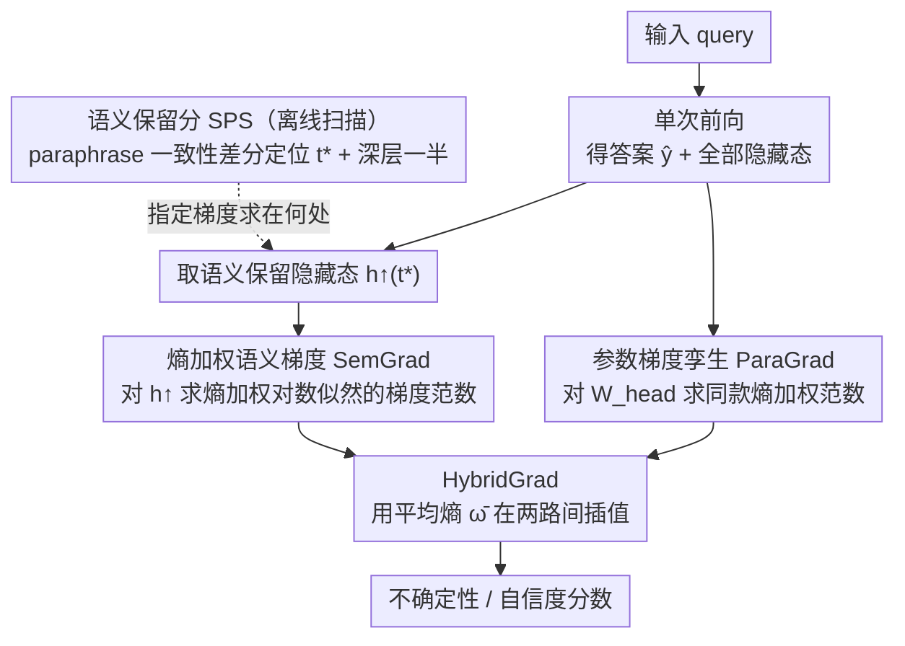

# SemGrad: Gradients w.r.t. Semantics-Preserving Embeddings Tell LLM Uncertainty

**会议**: ICML 2026  
**arXiv**: [2605.04638](https://arxiv.org/abs/2605.04638)  
**代码**: https://github.com/mingdali6717/SemGrad (有)  
**领域**: LLM 安全 / 不确定性量化 / 幻觉检测  
**关键词**: 自由生成 UQ, 语义梯度, 语义保留分, 单前向+反向, 多有效答案

## 一句话总结
SemGrad 首次把"基于梯度"的不确定性量化搬到 LLM 自由生成场景——用语义保留分 (SPS) 找到能编码输入语义的隐藏态，把对它们求出的对数似然梯度范数当作 LLM 自信度的度量，无需采样、单次反向即可在 3 个 QA 数据集上击败 11 个 SOTA baseline，特别在多有效答案的 TruthfulQA 上比 SAR 高 3.27 AUROC。

## 研究背景与动机

**领域现状**：LLM 在医疗、教育、金融场景部署越来越广，但幻觉问题让"它对自己答案有多自信"成了刚需。SOTA UQ 方法（Semantic Entropy / SAR / Semantic Density 等）都走"采样 + 跨样本语义聚类"路线：对同一 query 采 $K$ 次输出，再算分布散度。

**现有痛点**：(i) 采样方法 cost $K\times$ generation，方差大且慢，部署成本高；(ii) 分类任务里成熟的"参数梯度范数"UQ 假设单 ground truth label，等价于 Dirac 分布，公式 $\nabla_\theta\log p(y^\star|x)=0$ 在最优处成立——但自然语言天生有 aleatoric uncertainty（多有效答案），梯度即便在最优 $\theta^\star$ 也不为零，参数梯度范数会把"任务本身的随机性"误读成"模型不确信"。

**核心矛盾**：自由生成里 aleatoric（任务固有随机性）与 epistemic（模型缺知识）混在一起，参数空间的梯度无法解耦；而采样方法又太贵。

**本文目标**：(1) 提出第一个真正适合自由生成的 gradient-based UQ；(2) 让它在多有效答案场景仍有效；(3) 保持"单次前向 + 单次反向"的高效率。

**切入角度**：作者从语言学直觉出发——"如果模型真的懂这个 query，那么对 query 的语义保留扰动 $\boldsymbol{x}+\Delta\boldsymbol{x}$ 不应该改变输出分布"。这种局部稳定性可以用"对语义保留 embedding 的梯度范数"来量化，与 ground truth 分布是单峰还是多峰无关。

**核心 idea**：把梯度从"参数空间"挪到"语义空间"——找到能保留输入语义的中间隐藏态 $\boldsymbol{h}_E$，用 $\|\nabla_{\boldsymbol{h}_E}\log p(\hat{\boldsymbol{y}}|\boldsymbol{x};\boldsymbol{h}_E)\|$ 作为不确定性度量。

## 方法详解

### 整体框架
SemGrad 想回答"LLM 对自己这次自由生成有多自信"，但拒绝采样、只用一次前向 + 一次反向。流程是：推理时跑一次前向，拿到答案 $\hat{\boldsymbol{y}}$ 和全部隐藏态；从中挑出最能编码输入语义的语义保留 token $t^\star$、取它深层一半（$L/2+1$ 到 $L-1$）的隐藏态拼成 $\boldsymbol{h}^\uparrow_{t^\star}$；对一个熵加权的对数似然反传一次，求它对 $\boldsymbol{h}^\uparrow_{t^\star}$ 的梯度范数即得 SemGrad；最后用平均 token 熵 $\bar\omega$ 在 SemGrad 和"参数版"ParaGrad 之间插值得到自适应的 HybridGrad。

### 关键设计

**1. 语义保留分 (SPS)：用数据找到"梯度该在哪儿求"**

梯度 UQ 的关键不是怎么求梯度，而是对谁求——选错位置（最后一层只服务下一 token 解码、低层全是 lexical 特征）信号就抓不到不确定性。SPS 给出可量化的选取准则：对每条 query 用 GPT 生成 $K$ 个语义等价 paraphrase，分别算 within-paraphrase 相似度 $S_{w/i}^{l,t}$（同义输入在该 token / 层的隐藏态有多近）与 across-query 相似度 $S_{a/c}^{l,t}$（不同义输入有多近），两者之差 $\mathrm{SPS}=S_{w/i}-S_{a/c}$ 越高，说明这个位置越能把同义输入拉近、把异义输入推开，也就越"懂语义"。扫描发现三条稳定规律：每个模型都存在一个跨数据集一致的 $t^\star$（LLaMA-3.1 是 `<|start_header_id|>`、Qwen3 是 `<|im_start|>`、Mistral-Nemo 是最后一个 user token）；高 SPS 集中在深层一半；高 SPS 区是一个 band 而非单点——所以最终把深层一半的隐藏态拼起来做梯度，而不是赌某一层。

**2. 熵加权语义梯度 SemGrad：对语义扰动的敏感度就是不确定性**

直觉是"模型若真懂这个 query，语义保留的扰动不该改变输出分布"，所以把这种局部稳定性量化成对语义 embedding 的梯度范数：

$$S_{\text{SemGrad}}=\frac{1}{|\boldsymbol{h}^\uparrow_{t^\star}|}\Big\|\nabla_{\boldsymbol{h}^\uparrow_{t^\star}}\sum_{t=1}^T\omega_t\log p(\hat{y}_t\mid\hat{y}_{<t},\boldsymbol{x};\boldsymbol{h}^\uparrow_{t^\star})\Big\|_1$$

其中 $\omega_t=H(p(y_t\mid\hat{y}_{<t},\boldsymbol{x}))$ 是该 step 的 token 熵、作系数从计算图 detach。加这个权是因为自由生成里 token 贡献极不均——stopword / 子词信息量低权重就小，关键事实词熵高权重就大，避免整句被冗余词稀释；而且熵权重不用第三方模型就能 cheap 地刻画 token 重要性。它对 multi-answer 有效的根子在理论上：$\|\nabla_{\boldsymbol{h}_E}\log p\|\approx 0$ 只要求"模型贴近真分布"，与 ground truth 是单峰还是多峰无关，所以即便任务本身有多个有效答案、梯度也不会被这种 aleatoric 噪音带偏。

**3. HybridGrad：用平均熵在语义梯度和参数梯度之间自适应切换**

SemGrad 在多答案上稳，但单答案场景里参数梯度其实更准——因为单 ground-truth 设定下参数梯度直接对应训练目标、数值最稳。HybridGrad 不硬选其一，而是用平均 token 熵 $\bar\omega=\frac{1}{T}\sum_t\omega_t$（近似 sequence-level entropy）当"这个输入到底有多 aleatoric"的代理来插值：

$$S_{\text{HybridGrad}}=(1-e^{-\bar\omega})\,S_{\text{SemGrad}}+e^{-\bar\omega}\,S_{\text{ParaGrad}}$$

低熵（任务确定）就偏 ParaGrad、高熵（任务多解）就偏 SemGrad。这里的 ParaGrad 是 SemGrad 的参数版孪生——把求梯度的对象从 $\nabla_{\boldsymbol{h}_E}$ 换成 $\nabla_{\boldsymbol{W}_{\text{head}}}$、其余熵权与归一化照旧，让两路在同一框架下融合而非各算各的。

### 损失函数 / 训练策略
方法纯推理、无训练；唯一的离线步骤是在小开发集上跑一次 SPS 扫描确定该模型的 $t^\star$。

## 实验关键数据

### 主实验
3 个 LLM × 3 个 QA 数据集（SciQ、TriviaQA 单答案 + TruthfulQA 多答案），用 BEM 评测答案正确性，UQ 性能用 AUROC：

| 方法 | SciQ avg | TriviaQ avg | TruthfulQ avg | **Overall avg** |
|------|---------:|------------:|--------------:|----------------:|
| SAR (前 SOTA, 采样) | 74.86 | 84.13 | 66.99 | 75.33 |
| ExGrad (参数梯度) | 74.33 | 83.37 | 64.06 | 73.92 |
| ParaGrad (本文 baseline) | 75.02 | 84.81 | 66.95 | 75.59 |
| SemGrad | 74.50 | 82.50 | **70.25** | 75.75 |
| **HybridGrad** | **75.35** | 83.90 | **70.53** | **76.59** |

在多答案 TruthfulQA 上 SemGrad 比 SAR 高 +3.27、比 ExGrad 高 +6.82、比 ParaGrad 高 +3.30 AUROC。

### 消融实验

| 配置 | TruthfulQA AUROC (LLaMA) | 说明 |
|------|-------------------------:|------|
| Full SemGrad（深半层 + $t^\star$ + $\ell_1$ + entropy weight） | 69.42 | 默认 |
| $\ell_2$ 替代 $\ell_1$ | 69.42 | 几乎无差 |
| 去掉 $\omega_t$ entropy 权 | 68.98 | TriviaQA 掉 3.4 点更明显 |
| 仅最后一层 ($L-1$) | 68.13 | band > 单层 |
| token 改为 last input token | 69.07 | $t^\star$ > last |
| 用低 SPS 隐藏态 | 显著下降 | SPS-AUROC 强正相关 |

### 关键发现
- **SPS 与 AUROC 强正相关**：SPS 高的隐藏态做 SemGrad 性能就高；SPS 低的（早期层 / 错位 token）几乎抓不到不确定性。直接验证了"梯度真的需要在语义空间求"。
- **SemGrad 多答案场景碾压参数梯度**：TruthfulQA 上参数梯度因任务的 aleatoric 性失效，SemGrad 的理论独立性带来质变提升。
- **HybridGrad 是最稳的全能选手**：把语义 + 参数两路自适应融合后，在 9 个 (model, dataset) 组合里平均 AUROC 最高且最稳定。
- **效率优势明显**：表 3 显示 SemGrad/HybridGrad 单 example 运行时间比采样基线快一个数量级；论文承认当前实现因 PyTorch grad 限制必须对所有 token 求梯度，仍有大量优化空间。

## 亮点与洞察
- **第一个真正适合 LLM 自由生成的 gradient UQ**：跳出"采样 + 聚类"主流，证明梯度路线在多答案场景同样有效甚至更优，给 UQ 社区开辟了新方向。
- **SPS 是个可独立成 tool 的副产品**：用 paraphrase 一致性差分定位"语义编码 token"，对 mechanistic interpretability、probing、representation engineering 都有直接价值。
- **熵权重 token 重要性**：用 cheap 的 token-level entropy 替代昂贵的第三方模型给 token 打分（如 MARS、SAR 的 importance score），是个值得推广的轻量化技巧。
- **自适应融合范式**：用 $\bar\omega$ 当 aleatoric 指标在 SemGrad ↔ ParaGrad 之间插值，思路通用——任何"两种估计器各擅长一个 regime"的场景都可借鉴。

## 局限与展望
- 仅 white-box 可用（需要梯度 + 隐藏态），闭源 API 无效。
- 主要在 short-answer claim-level QA 上验证，long-form 输出里梯度信号可能被大量低信息 token 稀释。
- 当前实现一次性算所有 token 的隐藏态梯度，显存与时间都被框架约束撑大；作者指出其实理论上只需对几个位置算，工程优化空间大。
- $t^\star$ 仍需在新模型上重新做 SPS 扫描，未给出"零样本"自动确定方案；不同 chat template 引入的特殊 token 影响显著。

## 相关工作与启发
- **vs Semantic Entropy / SAR / Semantic Density**: 采样路线靠跨样本聚类捕捉"分布散度"；SemGrad 单次反向就解决，且天然处理多答案；TruthfulQA 上证明前者会被 aleatoric 噪音淹没。
- **vs ExGrad / ParaGrad**: 分类任务的参数梯度路线；本文揭示其在 multi-answer 上失效的理论原因（Dirac 假设破裂），并提出 SemGrad 弥补。
- **vs INSIDE / Self-Consistency / P(True)**: 内部状态或自我打分类方法；SemGrad 给出更原则化的"语义稳定性"指标。
- **可迁移启发**：把"梯度从参数空间挪到表示空间"的视角对很多 LLM 内部诊断任务（OOD 检测、置信度校准、prompt sensitivity 分析）都有用；SPS 这套"paraphrase 一致性差分"也可以用来定位模型的"语义瓶颈层"。

## 评分
- 新颖性: ⭐⭐⭐⭐⭐ 把梯度 UQ 从分类时代推进到自由生成时代，且首次把多答案场景的失效原因讲清楚。
- 实验充分度: ⭐⭐⭐⭐ 3 模型 × 3 数据集 + 11 个 baseline + 3 维度消融 + SPS 与 AUROC 相关性曲线，覆盖到位；缺少 long-form 与 OOD 域外验证。
- 写作质量: ⭐⭐⭐⭐ 公式推导清晰、动机讲得透彻；图 1 直观、图 3 SPS-AUROC 散点很有说服力。
- 价值: ⭐⭐⭐⭐⭐ 在多答案 QA 上 +3 点 AUROC 且单次反向，部署成本远低于采样路线，对幻觉检测落地实际意义大。

<!-- RELATED:START -->

## 相关论文

- [\[ICML 2026\] Position: Uncertainty Quantification in LLMs is Just Unsupervised Clustering](position_uncertainty_quantification_in_llms_is_just_unsupervised_clustering.md)
- [\[AAAI 2026\] SafeNlidb: A Privacy-Preserving Safety Alignment Framework for LLM-based Natural Language Database Interfaces](../../AAAI2026/llm_safety/safenlidb_a_privacy-preserving_safety_alignment_framework_for_llm-based_natural_.md)
- [\[ICLR 2026\] No Caption, No Problem: Caption-Free Membership Inference via Model-Fitted Embeddings](../../ICLR2026/llm_safety/no_caption_no_problem_caption-free_membership_inference_via_model-fitted_embeddi.md)
- [\[ACL 2026\] AgentMark: Utility-Preserving Behavioral Watermarking for Agents](../../ACL2026/llm_safety/agentmark_utility-preserving_behavioral_watermarking_for_agents.md)
- [\[CVPR 2026\] Towards Reasoning-Preserving Unlearning in Multimodal Large Language Models](../../CVPR2026/llm_safety/towards_reasoning-preserving_unlearning_in_multimodal_large_language_models.md)

<!-- RELATED:END -->
