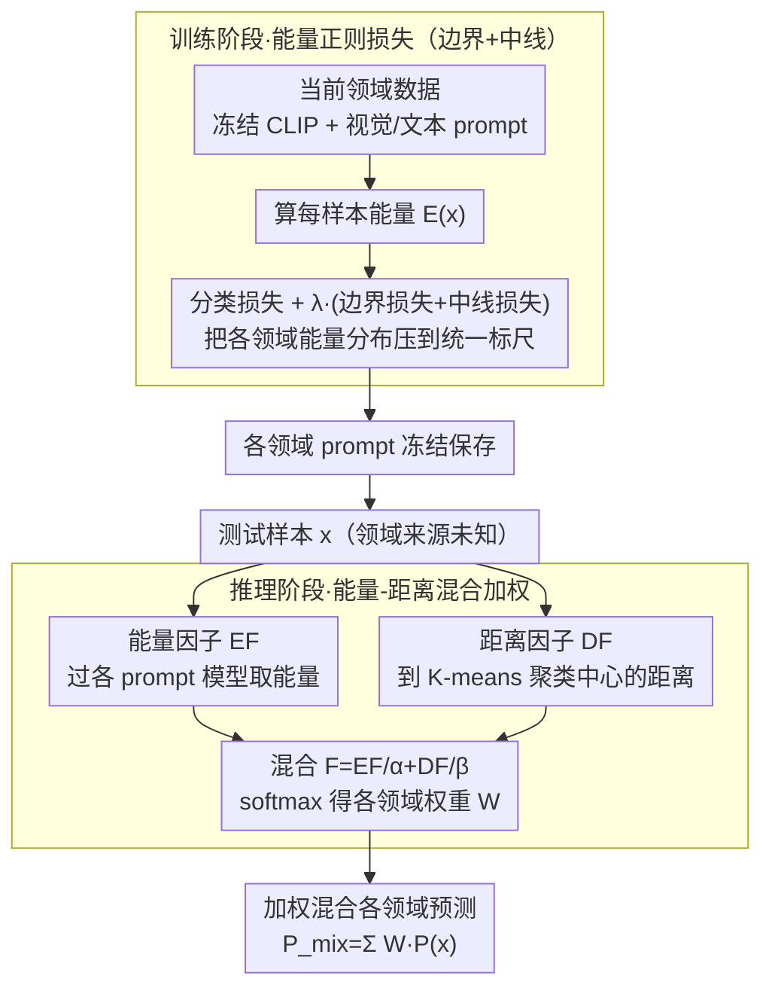

# HEDP: A Hybrid Energy-Distance Prompt-based Framework for Domain Incremental Learning

**会议**: ICML 2026  
**arXiv**: [2605.05776](https://arxiv.org/abs/2605.05776)  
**代码**: 有 (论文末附公开仓库)  
**领域**: 持续学习 / 领域增量 / 提示学习  
**关键词**: 领域增量学习, 提示学习, 能量模型, Helmholtz 自由能, CLIP

## 一句话总结
借鉴 Helmholtz 自由能的物理直觉，把每个领域的提示参数训练出一条"压缩到边界 $\Theta$、对齐到中线 $\Delta$"的能量曲线，推理时再用能量因子 + 距离因子联合加权各领域提示，在 CDDB / DomainNet / CORe50 三个 DIL 基准的未知领域上分别提升 1.76 / 3.12 / 2.57 个百分点。

## 研究背景与动机

**领域现状**：领域增量学习 (DIL) 要求模型按顺序在多个领域上训练（如不同天气下的自动驾驶检测），训练时不能回放旧领域数据，推理时既要在见过的已知领域上保持精度，又要泛化到未知领域。主流路线是冻结预训练大模型（如 CLIP），每个领域学一组 prompt 参数；代表方法有 CP-Prompt、S-Prompts、MoP-CLIP、ESN。

**现有痛点**：(1) 已知和未知领域之间总是 trade-off——CP-Prompt 已知领域好但未知差，MoP-CLIP 反过来；(2) 推理时怎么"选用哪个领域的 prompt" 是核心问题，现有方法要么用距离 (容易在重叠区误判)，要么用聚类 (粗粒度时边界模糊)；(3) 单领域 prompt 容易过拟合到自身分布，与其他领域 prompt 在共享空间里反而会拉大重叠。t-SNE 可视化显示 Domain B 样本在 CLIP 空间里反而离 Domain A 的聚类点更近。

**核心矛盾**：领域之间在共享特征空间里既相似又不同，单一信号（距离或能量）只能看到一个侧面——距离反映全局语义结构（CLIP 学到的），能量反映 prompt 调出来的局部分布敏感性。两者错误模式不同，但单独都不够稳定。

**本文目标**：(1) 让训练时每个领域 prompt 的能量分布"对得齐"，使能量真的能反映"样本是否属于本领域"；(2) 推理时设计一个能量 + 距离的混合信号，结合各自优点同时抵消对方弱点。

**切入角度**：把数据在特征空间里的统计分布类比成物理学中的能量场，借 Helmholtz 自由能 $E(x) = -kT \ln[\sum_y e^{H(x)[y]/kT}]$ 给每个样本对每个 prompt 算一个标量能量。理想情况下，本领域 prompt 给本领域样本打低能、非本领域样本打高能。

**核心 idea**：用一个"边界损失 + 中线损失"组合的能量正则项把每个领域 prompt 的能量分布约束到统一标尺；推理时把能量因子和距离因子相加再 softmax，得到混合权重，对各领域 prompt 的预测做加权求和。

## 方法详解

### 整体框架
HEDP 冻结 CLIP ViT-B/16 主干，给每个领域单独学一组 prompt，难点全压在"推理时该用哪个领域的 prompt"上。训练阶段每个领域独立训一组视觉 prompt $P_v^S$ 和文本 prompt $P_t^S$，损失是分类交叉熵 $\mathcal{L}_{ce}$ 加能量正则 $\lambda\mathcal{L}_{reg}$（$\lambda=0.05$），关键是把每个领域 prompt 的能量分布约束到统一标尺。推理时对每个测试样本同时算两个信号——在冻结 CLIP 空间里到各领域聚类中心的距离 $D^i(x)$、以及在每个 prompt 模型下的能量 $E^i(x)$——归一化成相对因子后相加得 $F^i(x)=EF^i/\alpha+DF^i/\beta$，softmax 出权重 $W^i$，最后混合各领域预测 $P_{mix}(x)=\sum_i W^i P^i(x)$。整套方法的贡献就压在两个阶段上：训练阶段的能量正则、推理阶段的能量-距离混合。

### 关键设计

**1. 能量正则损失（边界 + 中线）：把各领域 prompt 的能量分布对齐到同一把尺**

能量这个信号本身能用——本领域 prompt 给本领域样本打低能、给外域样本打高能——但前提是各领域的能量得"可比"。如果 Domain A 的 prompt 把样本压到 $-50$、Domain B 的压到 $-20$，那推理时直接比能量大小就会乱套。本文用 Helmholtz 自由能给每个样本算一个标量 $E(x) = -kT\ln[\sum_{y=1}^U e^{H(x)[y]/kT}]$，再用两条互补的正则把分布钉到统一坐标：边界损失 $\mathcal{L}_{border}=\frac{1}{|\mathcal{D}_t|}\sum\max(0, E(x)-\Theta)$ 只惩罚能量超过阈值 $\Theta=-32$ 的部分，把本领域样本统统压到低能侧；中线损失 $\mathcal{L}_{midline}=|\Delta-\frac{1}{|\mathcal{D}_t|}\sum E(x)|$ 把整体均值拉到 $\Delta=-40$。两者缺一不可：作者画的四种组合（无 / 只边界 / 只中线 / 完整）对比图显示，只用边界时跨域能量都被压到 $\Theta$ 以下、但相对位置仍乱，只用中线时分布形状不受约束、仍可能出现 $E^B(x^A) < E^A(x^A)$ 的倒挂；只有边界管住"最大值上限"、中线管住"中心位置"，才能稳定满足 $E^s(x^s) < E^i(x^s)\ (\forall i\neq s)$，让能量真正变成可跨域比较的标尺。

这套正则还有个意外收益（附录 Proposition 2）：传统能量训练容易长出"能量崖"——OOD 样本一旦贴近边界就被错打成低能、模型在未知领域崩掉。而把能量输出约束在 $(-\infty,\Theta]$、均值钉在 $\Delta$，等价于隐式压低了能量函数在数据流形上的局部 Lipschitz 常数 $K$：对 OOD 样本 $x_{out}=x_{in}+\Delta_x$，能量偏移满足 $|E(x_{out})-E(x_{in})|\le K\|\Delta_x\|$，$K$ 越小，未知领域样本就越不会突然掉进已知领域的低能区，从而缓解灾难性遗忘。换句话说，这条正则不只让能量"可比"，还顺手软化了能量地形、给 OOD 样本留出缓冲——这个 trick 可以独立迁移到任何 OOD 检测任务。

**2. 能量因子与距离因子的混合：两个错误模式正交的信号互相补盲区**

光靠能量还不够稳——能量反映的是 prompt 调出来的局部分布敏感性，在领域重叠区容易误判。本文为推理设计一个混合相似度因子，决定每个领域 prompt 占多大权重。能量因子 $EF^i(x)=E_{\min}-E^i(x)$ 取负偏移到 $(-\infty,0]$，值越大说明样本在第 $i$ 个 prompt 下能量越低、越像本领域；距离因子 $DF^i(x)=D_{\min}-D^i(x)$ 则用 $K$-means 在冻结 CLIP 空间给每个领域算 $K$ 个聚类中心，取样本到最近中心的余弦距离。两者相加得 $F^i(x)=EF^i(x)/\alpha+DF^i(x)/\beta$，再 $W^i=\text{softmax}(F^i)$。之所以混合有效，关键在附录的一阶 Taylor 论证：$\nabla_x EF$ 沿 prompt 参数方向（捕捉领域统计差异）、$\nabla_x DF$ 沿冻结 CLIP 语义方向（捕捉全局语义），两者梯度近似正交、错误模式互不相关——能让能量失误的扰动往往不会同时让距离失误，反之亦然，混合后误差互相抵消。实测 $\alpha=\beta=0.6$ 时已知领域偏倚距离、未知领域两者平衡，正好印证理论。

### 损失函数 / 训练策略
总损失 $\mathcal{L}_{total}=\mathcal{L}_{ce}+\lambda\mathcal{L}_{reg}$，其中 $\mathcal{L}_{reg}=\mathcal{L}_{border}+\mathcal{L}_{midline}$。超参 $\Theta=-32,\ \Delta=-40,\ K=5,\ \alpha=\beta=0.6,\ \lambda=0.05$；SGD + 余弦退火，初始 lr 0.01。

## 实验关键数据

### 主实验

| 数据集 | 场景 | 前 SOTA | HEDP | 提升 |
|--------|------|---------|------|------|
| CDDB-Hard | 已知 AA / AF | CP-Prompt 93.65 / -0.25 | **93.72 / -0.08** | +0.07 / +0.17 |
| CDDB-Hard | 未知 AA | MoP-CLIP 81.98 | **83.74** | +1.76 |
| DomainNet | 已知 AA (全) | CP-Prompt 73.15 | **74.19** | +1.04 |
| DomainNet | 未知 AA | MoP-CLIP 63.97 | **67.09** | +3.12 |
| CORe50 | 未知 AA | ESN 91.80 | **94.37** | +2.57 |

HEDP 同时在已知和未知领域上拿到最佳，不存在 trade-off。

### 消融实验

| 方案 | 能量边界 | 能量中线 | 能量因子 | 距离因子 | CDDB 未知 | DomainNet 未知 | CORe50 未知 |
|------|----------|----------|----------|----------|-----------|----------------|-------------|
| 1 (只距离) | ✗ | ✗ | ✗ | ✓ | 75.80 | 64.97 | 93.17 |
| 2 (无正则能量) | ✗ | ✗ | ✓ | ✗ | 77.31 | 63.55 | 92.06 |
| 3 (+边界) | ✓ | ✗ | ✓ | ✗ | 79.22 | 65.05 | 92.98 |
| 4 (+中线) | ✗ | ✓ | ✓ | ✗ | 79.12 | 65.01 | 93.77 |
| 5 (完整能量) | ✓ | ✓ | ✓ | ✗ | 81.52 | 65.59 | 94.07 |
| 6 (完整 HEDP) | ✓ | ✓ | ✓ | ✓ | **83.74** | **67.09** | **94.66** |

### 关键发现
- **边界 + 中线必须同时用**：单独任一个都比完整正则差 2-3 个点，证明两者捕捉的是不同的分布特征（最大值约束 vs 中心趋势对齐）。
- **能量和距离是互补而非冗余**：从方案 5 到 6 加上距离因子，CDDB 未知再涨 2.22 点；从方案 1 到 6 加上能量因子，CDDB 未知涨 7.94 点。互补效应在未知领域上尤其明显。
- **超参对未知领域的影响呈对角线分布**：$\alpha, \beta$ 的网格热图显示已知领域偏向"距离主导"，未知领域偏向"能量+距离平衡"，证明两者作用机制不同。
- 聚类数 $K$ 变化影响很小，说明距离因子主要起"全局拓扑稳定器"作用而非精细分辨。

## 亮点与洞察
- **物理直觉到 ML 设计**：把 Helmholtz 自由能这套统计物理工具用得很自然，"能量边界 + 中线"对应物理里的势阱深度和零点，可解释性强。
- **梯度正交论证**：用一阶 Taylor 展开论证能量和距离的错误梯度正交，给"互补信号"提供了理论支撑而非纯实验观察，比经验加权方案更可信。
- **能量正则的"地形平滑"副作用**：意外发现把能量分布约束到紧凑区间会隐式压低 Lipschitz 常数，从而提升 OOD 鲁棒性——这个 trick 可以独立迁移到任何 OOD 检测任务。
- 对于 prompt-based 持续学习，"如何选择 prompt" 比 "如何训 prompt" 更重要，本文把这个角度发挥到了极致。

## 局限与展望
- 推理延迟与领域数线性增长——每个测试样本要过所有领域的 prompt 模型算能量，作者承认这是可扩展性瓶颈，建议未来用动态 prompt 选择。
- $\Theta, \Delta$ 都是手调超参，且 $\Delta$ 推得越远效果越好但会饱和，缺乏自适应机制。
- 实验都在视觉分类任务上，没扩展到 NLP 或 VLM 推理任务，能量物理直觉在文本生成上是否成立还需验证。
- "能量是 SFT 不变信号"的论证比较薄，主要靠图示。

## 相关工作与启发
- **vs CP-Prompt** (ACMMM 2024)：CP-Prompt 在已知领域已经很强但未知领域弱，HEDP 用能量因子补上未知泛化的短板。
- **vs MoP-CLIP** (WACV 2024)：MoP-CLIP 用粗聚类做 prompt 混合，HEDP 把聚类（距离因子）和 prompt 内部能量结合，分辨力更细。
- **vs ESN** (AAAI 2023)：ESN 引入温度可调的能量度量，但只用能量；HEDP 加上"能量正则"明确约束分布形状，效果显著更好。
- **vs ELI** (CVPR 2022)：ELI 也用能量做增量学习，但 task-wise 能量流形对 DIL 这种 prompt-based 场景不太适用，HEDP 把能量直接接到 prompt 输出上，更轻量。

## 评分
- 新颖性: ⭐⭐⭐⭐ "能量正则 + 距离/能量混合"两件套组合是新的，物理类比也比较自然。
- 实验充分度: ⭐⭐⭐⭐ 三个数据集 + 完整消融 + 超参网格 + 能量分布可视化，已知/未知都覆盖。
- 写作质量: ⭐⭐⭐⭐ 故事讲得清楚，附录给出梯度正交和 Lipschitz 论证，提升了理论深度。
- 价值: ⭐⭐⭐⭐ 在 prompt-based DIL 上 同时解决了已知+未知 trade-off，工程上很实用。

<!-- RELATED:START -->

## 相关论文

- [\[ICML 2026\] Towards Fine-Grained Robustness: Attention-Guided Test-Time Prompt Tuning for Vision-Language Models](towards_fine-grained_robustness_attention-guided_test-time_prompt_tuning_for_vis.md)
- [\[CVPR 2025\] Dual Consolidation for Pre-Trained Model-Based Domain-Incremental Learning](../../CVPR2025/llm_safety/dual_consolidation_for_pre-trained_model-based_domain-incremental_learning.md)
- [\[ICLR 2026\] SABRE-FL: Selective and Accurate Backdoor Rejection for Federated Prompt Learning](../../ICLR2026/llm_safety/sabre-fl_selective_and_accurate_backdoor_rejection_for_federated_prompt_learning.md)
- [\[ICML 2026\] Decoupled Training with Local Reinforcement Fine-Tuning in Federated Learning](decoupled_training_with_local_reinforcement_fine-tuning_in_federated_learning.md)
- [\[NeurIPS 2025\] Approximate Domain Unlearning for Vision-Language Models](../../NeurIPS2025/llm_safety/approximate_domain_unlearning_for_visionlanguage_models.md)

<!-- RELATED:END -->
