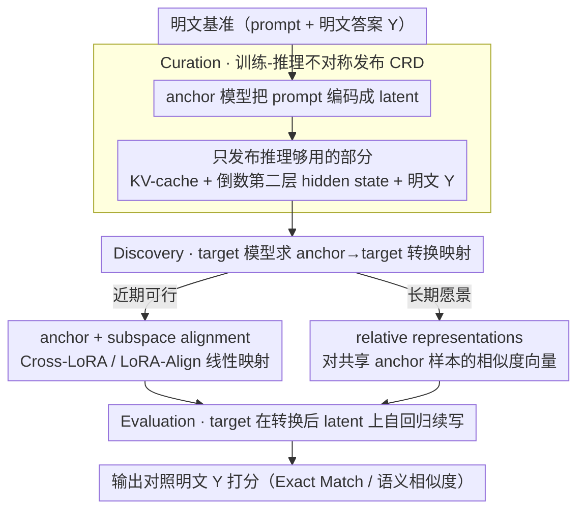

# LLM Benchmark Datasets Should Be Contamination-Resistant (Position Paper)

**会议**: ICML 2026  
**arXiv**: [2605.19999](https://arxiv.org/abs/2605.19999)  
**代码**: 无（position paper）  
**领域**: LLM安全 / 评测基准 / 数据污染  
**关键词**: 基准污染, 抗污染数据集, KV-cache, 训练-推理不对称, 跨模型互操作

## 一句话总结
本文是一篇 position paper，主张 LLM 基准应**抗污染（contamination-resistant）**——即可推理但不可训练；提出利用 Transformer 训练 vs 推理流水线的根本不对称性（训练需要全 token，推理只需 KV-cache + 倒数第二层 hidden state），把基准发布形式从明文换成 KV-cache + 中间隐藏态，配合跨模型 subspace alignment / relative representation 解决互操作问题，呼吁社区采纳。

## 研究背景与动机

**领域现状**：LLM benchmark contamination 已是普遍现象：GPT-3 训练时 90%+ 的 MMLU 样本被检出，Llama 2 仍有 16% 的 MMLU 污染，多语言基准检出污染高达 91.8%。一旦基准被预训练吃进去，模型在该基准上的分就反映"记忆能力"而非"泛化能力"——Zhang et al. 2024 用 GSM8K 的非公开镜像测 Mistral，准确率掉 13%。

**现有痛点**：现有对策都不彻底：
- **保持私有 + 第三方评测**：阻止泄漏但抬高了创新门槛，独立验证变难
- **dynamic benchmarking（动态更新）**：每次换，长期对比丢失基线
- **decontamination（识别并删除泄漏样本）**：万亿 token 语料下识别精度急剧下降
- **rephrase（改写）**：质量和难度都会损失

更关键的是，基准一旦公开就快速被仓库 / 论坛 / 二级数据集复制，连 gated 基准也会通过蒸馏 / 持续预训练间接漏入。

**核心矛盾**：基准要可用于评测（推理）就要让模型接触到内容；但内容公开就一定会泄入下次训练。看上去无解。

**本文目标**：建立"抗污染数据集 (CRD)"的概念框架——发布的形式必须保持推理可用，但不可被训练学到。

**切入角度**：Transformer 训练和推理流水线在数学上根本不对称——训练需要序列全 token 算梯度（next-token prediction loss 要求看到 prefix 全 token），推理只需要 KV-cache 和倒数第二层 hidden state。如果发布形式只暴露推理需要的部分而隐藏训练需要的部分，理论上就能可推理不可训练。

**核心 idea**：发布基准时只给 `(KV-cache, h^{(L-1)}_t, Y)` 三元组（KV-cache + 倒数第二层 hidden state + 明文 ground truth），不给原始 token；推理时模型可继续生成，训练时缺少 token 序列无法计算 loss；通过跨模型 representation alignment 让一份基准能服务多种 LLM。

## 方法详解

### 整体框架

本文不提出某个具体算法，而是给"抗污染数据集 (CRD)"立一个可检验的概念框架：把基准的**发布介质**从原始 token 换成只够推理、不够训练的中间表示，使任何拿到它的模型都能跑评测、却无法把它当训练数据吃进去。围绕这个目标，论文先用 Definition 2.1 形式化 CRD，再给出落地路线和跨模型复用方案。

**Definition 2.1 (CRD)**：对模型 $\mathcal{M}$ 和变换 $\phi$，数据集 $\phi(\mathcal{D})$ 是抗污染的，若同时满足——推理可用：$\mathcal{M}(\phi(\mathcal{D}))$ 给出有效任务表现；不可训练：$\nabla_\theta \mathcal{L}(\mathcal{M}_\theta, \phi(\mathcal{D}))$ 不能改善模型泛化。一个合格的 CRD 还要兼具三条性质：**不可逆（Irreversibility）**——从 $\phi(\mathcal{D})$ 重建明文 $\mathcal{D}$ 在算力上不可行；**等价（Equivalence）**——$\mathcal{M}(\phi(\mathcal{D})) \approx \mathcal{M}(\mathcal{D})$，换了介质不改变评测结论；**互操作（Interoperability）**——能从 $\phi(\mathcal{D})$ 推得适用于其他 LLM $\mathcal{M}_1$ 的 $\phi_1(\mathcal{D})$。

对应的评测流程分三步：**Curation**，发布方用 anchor 模型把 prompt 投到 latent 表示；**Discovery**，target 模型先求出一个 anchor→target 的转换映射；**Evaluation**，target 模型在转换后的 latent 上自回归续写、给出答案。

### 关键设计

**1. 用 Transformer 训练-推理不对称发布 CRD：从架构层面把"可推理"和"可训练"切开**

这是整篇 position 的立论根基。论文观察到 Transformer 的两条流水线在数学上根本不对称：训练时 next-token loss $\mathcal{L} = -\sum_t \log P(x_t \mid x_{<t})$ 必须看到完整序列 $x_1,\dots,x_T$ 才能逐层算梯度，而推理时只需要 KV-cache $\{K_{1:t}^{(l)}, V_{1:t}^{(l)}\}_{l=1}^L$ 加上倒数第二层隐藏态 $h_t^{(L-1)}$ 就能续生新 token。CRD 的做法就是只发布后者这一份"推理够用、训练不够"的中间表示，配上明文 ground truth $Y$ 组成三元组 $(KV\text{-}cache,\ h^{(L-1)}_t,\ Y)$，原始 token 一律不给——拿到它的人能复现评测分数，却因为缺少 token 序列算不出可用的训练 loss。之所以走这条路，是因为以往的 unlearnable data 方案（对抗扰动 / shortcut / 投毒）都是为图像设计的，搬到离散文本上 paraphrase 一下就失效；本文索性绕开"数据级混淆"，改从架构性质入手，让攻击者即使拿到 KV-cache 也无从直接 fine-tune。不可逆性还能再加固：KV-cache 反演攻击在普通 MHA 上确实可行，但在 GQA / MLA 等现代注意力上效果大幅下降，必要时还可叠加输出加噪、熵扰动、DP 机制或 KV-Cloak 等防御；对高敏感场景甚至可以不公开 anchor 权重，改由第三方提供 encoding API。

**2. anchor model + subspace alignment 解互操作：让一份基准服务多种 target LLM**

直接发布某个模型编码的 KV-cache 会带来新问题——总不能为每个 LLM 都重发一份基准。论文给出的近期可行方案是：发布方选一个广泛部署的 anchor 模型来编码 KV-cache，任何 target 模型再用 Cross-LoRA 风格的 LoRA-Align（rank-truncated SVD + Frobenius-optimal 线性映射）把表示从 anchor 子空间投到自己的子空间。这套对齐类似 Procrustes，但放松成任意线性映射、允许两边维度不同，且整个过程只用到双方模型权重、不接触明文，因而不破坏不可逆性。选 anchor 时按架构相似度（GQA / SwiGLU / RMSNorm 等）挑，以最大化迁移保真度。

**3. relative representations 作为长期愿景：彻底脱离 anchor model**

anchor 路线再好也偏向某个模型族，论文进一步给出一个更对称的远期方向：基于 Platonic Representation Hypothesis（不同模型的表示在收敛）和 Moschella 2023 的 relative representations，约定一小批共享 anchor 样本（100–500 个），把每个 latent 点改写成它对这批样本的相似度向量。这种相对表示在任意 latent 空间下角度不变，于是可以零样本跨模型 stitch，让所有 LLM 在同一坐标系里被评测；要加入新模型也只需处理那批共享 anchor，并天然扩展到多模态。

## 实验关键数据

### 污染普遍性（综述图）

| 模型 | 基准 | 污染比例 |
|------|------|--------|
| GPT-3 | 多基准 | > 90% 标记 |
| Llama-2 | MMLU | 16%+ |
| 主流 LLM 平均 | 多语言基准 | 高达 91.8% |
| Mistral | GSM8K 镜像 vs. 公开版 | 准确率差 13% |

### 存储开销可控

| 基准 | 原始 token 数 | 完整 KV-cache | PyramidKV (12%) 压缩 | 进一步丢非关键 token |
|------|---------|-------------|-------------------|------------------|
| 100K tokens (Llama-2 7B) | 100K | 50 GB | 6 GB | **350 MB** |
| MMLU | ~5M | 2.5 TB | 300 GB | ~17 GB |

PyramidKV 等 KV-cache 压缩工作显示保留 12% 就够；删除格式化 / 通用指令 token 可继续降至 0.7%。

### 适配性表

| 基准类型 | 例子 | CRD 兼容 |
|--------|------|--------|
| 单回合 QA | MMLU, SQuAD, HumanEval | ✅ |
| 分类/标注 | GLUE, SuperGLUE, ImageNet | ✅ |
| 多模态 | COCO, Flickr30K | ✅ |
| 代码生成 | CodeContests, APPS | ✅ |
| 摘要 | CNN/DailyMail, XSum | ✅ |
| 多轮对话 | CoQA, MultiWOZ | ⚠️ 部分（输入输出耦合）|
| 动态 agent | WebShop, ALFWorld | ❌（环境反馈交织）|
| 交互式 | DynaBench, AdaTest | ❌（实例随输出变）|

### 关键发现
- **方法兼容大部分静态基准**：QA / 分类 / 代码 / 摘要这些主流基准都 OK
- **存储不是阻塞**：KV-cache 压缩 + 选择性 drop 后存储与原基准在同量级
- **不可逆性强度依赖架构**：GQA 等现代注意力使反演攻击效果大幅下降
- **互操作有现成技术基础**：Cross-LoRA / relative representations 已经在 representation transfer 文献里验证

## 亮点与洞察
- **从架构层面而非数据层面解决污染**：以往 unlearnable data 都是"扰动 + 加噪"思路，本文是"换发布介质"——这是更根本的范式转变
- **训练-推理不对称是个被低估的 free lunch**：Transformer 本身的数学结构就提供了"只推理不训练"的边界，没人想到能拿来防污染
- **三性质（irreversibility / equivalence / interoperability）的明确刻画**：把模糊的"抗污染"概念变成可检验的属性集合，有利于后续工作系统化
- **跨学科借用**：从 Platonic Representation Hypothesis、Cross-LoRA、relative representations 等 representation learning 工作里借工具，证明 representation alignment 文献的成果直接转化为评测基础设施

## 局限性 / 可改进方向
- 仅适用 Transformer 类模型；Mamba / RWKV 等 SSM 系不直接适用
- KV-cache 反演在 MHA 模型上仍可行；GQA / MLA 给出实践安全但不是数学保证
- equivalence 难严格验证——基准发布方需要标准化的 calibration / backtest 协议
- anchor 模型选择本身可能带偏（小模型族被边缘化）
- 多轮、动态、交互式基准（CoQA / WebShop / DynaBench）需要专门改造
- 存储增量虽然可控（350MB/100K token），全 MMLU 量级仍 17GB+，长期累积仍需优化

## 相关工作与启发
- **vs decontamination（识别并删除污染样本）**：万亿 token 下识别精度差；CRD 是预防而非检测
- **vs 私有基准 + 第三方评测**：抬高门槛、伤害开放科学；CRD 公开但不可训练
- **vs dynamic benchmarks**：失去纵向可比性；CRD 是静态可重复的
- **vs unlearnable data（图像）**：图像扰动思路在文本上失效（paraphrase 解扰动）；CRD 绕开数据级混淆
- **启发**：把"模型架构的数学性质"作为安全/隐私基础设施的资源——这套思路可推广到 model attribution、watermarking、privacy 等其他 LLM 治理问题

## 评分
- 新颖性: ⭐⭐⭐⭐⭐ 从架构不对称发布 CRD 是真正的全新方向，与所有现有反污染路线正交
- 实验充分度: ⭐⭐⭐（position paper）—— 主要是论证 + 可行性分析，没有 SOTA 数字；但兼容性表 + 存储估算清晰
- 写作质量: ⭐⭐⭐⭐ 三性质形式化清晰，训练-推理图（Fig 3）直观，跨学科文献综合扎实
- 价值: ⭐⭐⭐⭐⭐ 解决的是评测体系层面的根本问题；如果社区采纳，LLM 评测的可靠性会有质的提升

<!-- RELATED:START -->

## 相关论文

- [\[ICML 2026\] Position: Uncertainty Quantification in LLMs is Just Unsupervised Clustering](position_uncertainty_quantification_in_llms_is_just_unsupervised_clustering.md)
- [\[ICML 2026\] MedMosaic: A Challenging Large Scale Benchmark of Diverse Medical Audio](medmosaic_a_challenging_large_scale_benchmark_of_diverse_medical_audio.md)
- [\[ACL 2026\] How Should We Enhance the Safety of Large Reasoning Models: An Empirical Study](../../ACL2026/llm_safety/how_should_we_enhance_the_safety_of_large_reasoning_models_an_empirical_study.md)
- [\[ICML 2026\] Position: Stop Chasing the C-index when Evaluating Survival Analysis Models](position_stop_chasing_the_c-index_when_evaluating_survival_analysis_models.md)
- [\[ICML 2026\] Position: Retire the "Positive Backdoor" Label -- Secret Alignment Requires Strict and Systematic Evaluation](position_retire_the_positive_backdoor_label_--_secret_alignment_requires_strict_.md)

<!-- RELATED:END -->
