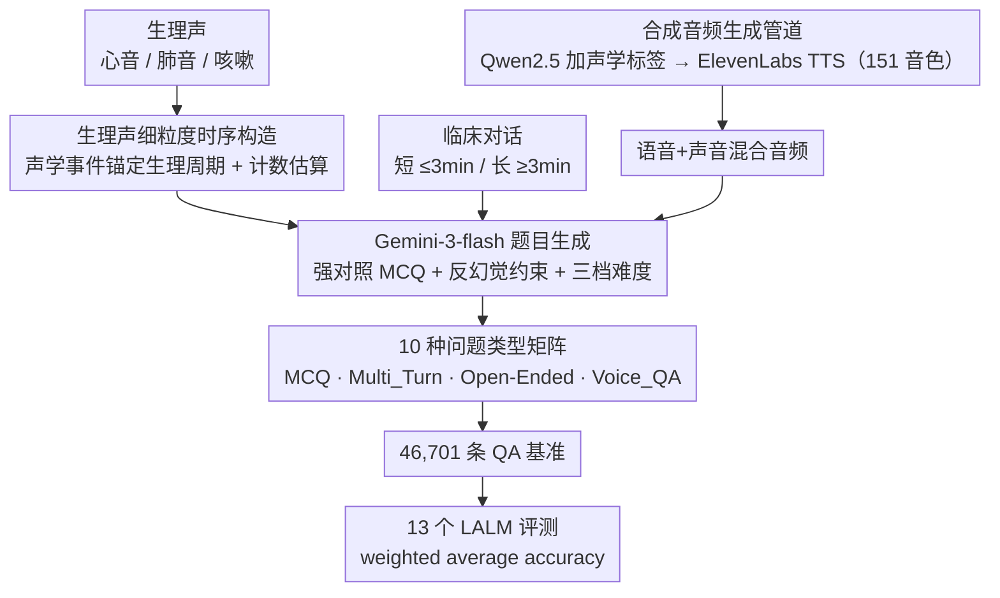

# MedMosaic: A Challenging Large Scale Benchmark of Diverse Medical Audio

**会议**: ICML 2026  
**arXiv**: [2605.00969](https://arxiv.org/abs/2605.00969)  
**代码**: 样本数据 https://shorturl.at/Lyp33  
**领域**: 医学音频 / 多模态评测  
**关键词**: 医学音频 QA, 合成临床语音, 多轮推理, 开放式回答, 嵌入式语音 QA

## 一句话总结
MedMosaic 用合成管道构造了一个覆盖生理声 + 真实/合成临床对话的医学音频 QA 基准（46,701 条 QA、10 种问题类型），系统评测 13 个音频/多模态模型，发现即使 Gemini-2.5-Pro 也只能拿到约 68.1% 加权准确率，揭示当代 LALM 在医学音频推理上的根本短板。

## 研究背景与动机

**领域现状**：随着 LLM/MLLM/LALM 兴起，评测重心从「单模态识别」转向「跨模态多步推理」。通用音频 QA 已有 ClothoAQA、MMAU、MMAU-Pro、MDAR、MMAR、AudioBench、AudioPedia 等成熟基准；模型侧 Qwen-Audio、Audio Flamingo、SALMONN、LTU-AS、AudioPaLM 等正快速进步。

**现有痛点**：(1) 现有 audio QA 几乎都集中在通用环境声、音乐、短语音段；医学音频极度稀缺，CaReAQA 是少数尝试但规模小且只测短独立片段。(2) 文本医学 QA（MedQA、MeDiaQA）抽掉了所有声学信息，无法评测「咳嗽性质、呼吸节律、嗓音应力、对话犹豫」等只有声音才能传达的临床线索。(3) 评测协议过度依赖封闭式多选，无法考察生成式推理；缺少长时对话、多轮交互、嵌入式问答这些临床真实交互的场景。

**核心矛盾**：医学决策强依赖「把语义与声学标记对齐」的能力，但现有 benchmark 既没有这种长时多源音频数据，也没有触及多跳临床推理的题目；与此同时，医学数据因隐私和标注成本难以规模化采集。

**本文目标**：(i) 构建一个规模化、跨多种音频类型（生理声 + 短/长临床对话）、覆盖多种推理模式（多选、多轮、开放、嵌入式语音）的医学音频 QA 基准；(ii) 提出可控的合成音频生成管道，让 benchmark 能随需扩展；(iii) 系统评测主流 LALM，量化当前能力天花板。

**切入角度**：作者发现「合成 + 专家提示」可以在不触碰真实病人数据的前提下精确控制临床场景的复杂度（咳嗽嵌入、情绪标记、时间线信息分布）。把 Gemini-3-flash 作 QA 生成器，配合精心设计的提示（每题 10 个高度相似的对照选项 + 反幻觉约束），就能产出大规模又困难的题目。

**核心 idea**：用「合成管道 + 严苛 anti-hallucination 提示 + 10 种问题类型」造一个大而难的医学音频 QA 基准，并把开放式问答和嵌入式语音 QA 也加入评估，让 LALM 的医学推理能力真正暴露在多维测试下。

## 方法详解

### 整体框架
MedMosaic 想造一个「不听音频就答不出」的大规模医学音频 QA 基准，整条流水线分三段。第一段是**备料**：备齐三类音频素材——生理声（心音/肺音/咳嗽）、临床对话（短 ≤3min / 长 ≥3min），以及一类需要专门「合成音频生成管道」造出来的「语音+声音混合」音频（用 Qwen 2.5 14B 给转录文本加声学占位标签、再经 ElevenLabs v3 TTS 配 151 种音色合成，把咳嗽、叹息、情绪等非言语临床线索嵌进对话）。第二段是**生成**：三路素材各自喂给一套专门设计的 Gemini-3-flash 提示，其中 sound-only 走「细粒度时序构造」、其余共享「强对照 MCQ + 反幻觉约束」，统一按 Easy/Medium/Hard 三档难度出题。第三段是**铺开与评测**：题目摊成 10 种问题类型（含 Voice_QA、Multi_Turn、Open-Ended 三种新题型）、汇成 46,701 条 QA，再用 13 个 LALM 推理、按题型权重算 weighted average accuracy。难度的核心来自提示工程：除开放式外每题都配 10 个「词面相似但临床解读不同」的对照选项，逼模型靠真听懂音频细节而非关键词匹配作答。

### 关键设计

**1. 合成音频生成管道：不碰真实病人数据，把非言语临床线索嵌进对话**

现有开源医学音频要么纯语音、要么是孤立的声音片段，缺少真实临床里「医生说话时夹着咳嗽、喘息、叹息」的复合声学场景，而真实采集又受隐私和成本限制。MedMosaic 用一条合成管道补这个缺口：先用 Qwen 2.5 14B Instruct 把源数据集的原始转录文本「富化」——插入声学占位标签和停顿指示，并按临床类别（过敏与皮肤、心血管、呼吸、消化、肌骨、神经、泌尿等）补入呼吸声、疼痛声、情绪线索；再用 ElevenLabs v3 TTS、配人工从声库精选的 151 种音色（覆盖不同说话人角色与人口学多样性）合成高保真音频。合成既精确可控（能指定何处嵌入哪种声学事件、复杂度多高），又规避了真实病人数据采集，是整个基准能「规模化、可扩展」的底座——speech+sound 那一路题目完全依赖它产出。

**2. 生理声 QA 的细粒度时序构造：把 sound-only 题从「声分类」抬到「时序推理」**

表面声分类只要抓住几个标志性频谱特征就能猜对，没法真正考察音频理解。MedMosaic 先把生理声细分到临床相关亚类——肺音分 wheeze（持续窄带）/ crackle（短爆裂宽带）/ stridor（高音连续单频），咳嗽分 wet（含水声）/ dry（短促干燥）/ pertussis（簇发 + 高能吸气 whoop）/ barky（低沉共振），心音的 murmur 在 $\text{S1} \to \text{systole} \to \text{S2} \to \text{diastole}$ 各阶段表现不同。题目不止问「这是什么声」，而是问「咳嗽发生在哪个呼吸阶段」「心跳节律怎么变」「30 秒内大致呼吸几次」「声音与静默的时间占比」。这些都要求把声学事件锚定到生理周期上：单纯靠预训练通识识别声音类型已经不够，模型必须真的解析音频内部的时间结构、做计数与估算，才能答对。

**3. 强对照式 MCQ + 反幻觉约束的提示工程：让题目的难度落在「听懂细节」而非「选项一眼可分」**

医学 QA 的老问题是模型靠背诵医学知识就能蒙对、根本没用上音频。MedMosaic 在提示里加了一整套约束来堵死这条捷径：每题给 10 个选项，错误选项被刻意写成与正确答案词面相似但语义不同（lexically similar yet semantically distinct）——复用相同关键词、提高词面相似度，让纯关键词匹配彻底失效；干扰项专挑几类陷阱——时序错位（事件说对了但放在错误阶段）、声学特征相似但临床解读不同、过度依赖训练数据里的常见关联。最关键的是反幻觉约束：所有正确答案必须能从音频本身推导，禁止依赖外部医学知识库，且每个选项都要导向一个独立的临床解读，避免靠常识直接排除。再叠加 Easy/Medium/Hard 三档难度系统性抬高对感知精度的要求，「不听音频就答不出」于是从口号变成了硬性事实。

**4. 嵌入式语音 QA（Voice_QA）+ 多轮 + 开放式三种新题型：把临床真实交互的难点搬进评测**

MCQ 只能测「区分能力」，但临床现场几乎都是「医生听完后开口讲话」式的生成与交互，这块在现有 benchmark 里完全缺位。MedMosaic 补上三种：Voice_QA 把问题和答案直接嵌进音频波形，模型听完临床对话后要突然切换上下文去回答这段嵌入的语音问题，专门考 context switching 与抗注意力漂移——它模拟的是「设备或同事在病人对话中途插入提问」的真实场景；Multi_Turn 在长对话上做多轮追问，要求模型维持跨轮状态；Open-Ended（OE_Speech / OE_Speech_Sound）则让模型在长时音频上无约束生成，回答要简洁且必须正确，是最严苛的生成式推理测试。十种题型合起来——MCQ_Sound_(Cough/Heart/Lung)、MCQ_Speech、MCQ_Speech_Sound、MCQ_Long_Form、Multi_Turn、OE_Speech、OE_Speech_Sound、Voice_QA——构成覆盖单源/多源/长时/多轮/开放/嵌入式的正交矩阵，让模型短板能按维度被精确诊断。

### 损失函数 / 训练策略
非训练论文，无 loss。所有 QA 由 Gemini-3-flash 生成，再用 13 个候选模型（Audio Flamingo 3、Audio Reasoner、Baichuan-Omni、Desta25-Audio、Gama、Gemini-2.5-flash/pro、Qwen-2.5-Omni 等）做推理评测。

## 实验关键数据

### 主实验（Table 1 节选，准确率 %）

| 模型 | Weighted Avg | MCQ_Speech | MCQ_Sound_Heart | OE_Speech | Voice_QA |
|---|---|---|---|---|---|
| Audio-flamingo-3 | 24.1 | 10.7 | 37.8 | 55.2 | 0.1 |
| Audio-reasoner | 32.8 | 23.7 | 35.6 | 51.2 | 9.9 |
| Baichuan-omni | 38.6 | 43.5 | 26.6 | 57.6 | 31.5 |
| Desta25-audio | 41.0 | 49.4 | 37.1 | 56.0 | 9.1 |
| Gama | 23.2 | 12.7 | 36.6 | 38.1 | 8.9 |
| Gemini-2.5-flash | 60.5 | 73.6 | 52.8 | ... | ... |
| **Gemini-2.5-Pro** | **~68.1** | （文中报告各列最佳） | | | |
| Qwen-2.5-Omni-7B | 42.8 | ... | ... | ... | ... |

最强商业模型 Gemini-2.5-Pro 也只达 68.1% 加权平均，证明 benchmark 难度成功。

### 消融实验 / 题型对比

| 现象 | 说明 |
|---|---|
| Voice_QA 大部分模型 < 32%，少数甚至 < 1% | 嵌入式语音 QA 是当前模型最大短板——上下文切换能力极差 |
| OE_Speech 普遍优于 MCQ_Speech | 开放式得分高，是因为评分宽松（只要包含正确事实就给分），不代表模型真懂 |
| MCQ_Sound_Heart > MCQ_Sound_Cough / Lung 大体一致 | 心音的时序结构（S1/S2）相对规则，比咳嗽/肺音的随机性更易识别 |
| MCQ_Long_Form 普遍低 | 长时对话推理是普遍弱项，与文献中「LALM 不擅长长上下文」一致 |

### 关键发现
- 即使最强通用模型也远低于人类临床水平（>90%），证明医学音频推理远未被现有 LALM 覆盖；专门预训练数据/适配是必要的。
- Audio-flamingo-3 在 Voice_QA 上几乎零分（0.1%），说明它对「上下文切换」完全没能力——这是嵌入式问答揭示的全新评测维度。
- 合成 QA 管道在「人工监督最小化 + benchmark 仍然困难」之间找到了一个工作点，验证了「合成评测数据」作为医学/隐私敏感领域可扩展评测范式的可行性。

## 亮点与洞察
- 把医学音频按「sound-only / speech-only / speech+sound / voice-embedded」拆成正交题型矩阵，让模型短板按维度被精确诊断——这是医学/临床场景评测的可复制方法论。
- 反幻觉约束「正确答案必须从音频可推出，错误选项需独立临床解读」是个非常硬核的提示工程范式，可直接迁移到其它专业领域 QA 数据集构造，防止 LLM judge 用通识背诵蒙混。
- Voice_QA 这种「问题嵌入波形」的设计是真正的创新——临床上医生需要在听 patient 讲话时随时回答同事提问，这种「持续监听 + 中断响应」能力在现有 benchmark 中完全缺位。

## 局限与展望
- 数据为合成而非真实临床录音，与真实病人/医生对话之间仍有 domain gap；作者用「保留临床艺术性 + 嵌入物理性 artifact」缓解但不能彻底消除。
- 标注靠 Gemini-3-flash 生成，存在生成器自身偏见被植入 benchmark 的风险；样本验证规模有限。
- 13 个评测模型仍以通用 LALM 为主，缺少专门面向医学音频微调的模型对比（如未来的 MedAudio-LLM）。
- 开放式题打分协议在论文中描述较简略，复现性有提升空间。

## 相关工作与启发
- **vs CaReAQA**：CaReAQA 也面向医学音频但规模小且只测短片段；MedMosaic 用合成管道把规模放大两个量级，并加入长对话/多轮/嵌入式 QA。
- **vs MMAU / MMAU-Pro / MMAR**：通用 audio QA，覆盖广但不专；MedMosaic 在医学子域上做了深度，与 MMAU-Pro 形成互补。
- **vs CORAAL-QA**：CORAAL-QA 关注长 form 多轮交互；MedMosaic 引入领域专精性与生理声特异性。
- **vs MedQA（文本）**：MedQA 完全是文本临床知识，本工作首次系统补全「音频维度的临床推理评测」。

## 评分
- 新颖性: ⭐⭐⭐⭐ 嵌入式 Voice_QA + 多轮对话 + 生理声时序推理在医学音频 benchmark 里都是第一次出现。
- 实验充分度: ⭐⭐⭐⭐ 评测 13 个模型 × 10 种题型，给出每个模型在每个题型的得分；缺：人类基准对照、医学专家定向微调模型。
- 写作质量: ⭐⭐⭐ 流程图清晰，提示模板有详细说明；但部分实验细节（如开放式评分指标）一笔带过。
- 价值: ⭐⭐⭐⭐ 为医学音频 LALM 提供首个大规模可扩展评测，对后续医学多模态模型研发非常实用；合成数据范式也对其它隐私敏感领域有借鉴。

<!-- RELATED:START -->

## 相关论文

- [\[AAAI 2026\] StyleBreak: Revealing Alignment Vulnerabilities in Large Audio-Language Models via Style-Aware Audio Jailbreak](../../AAAI2026/llm_safety/stylebreak_revealing_alignment_vulnerabilities_in_large_audio-language_models_vi.md)
- [\[ICML 2026\] FoeGlass: Simple In-Context Learning Is Enough for Red Teaming Audio Deepfake Detectors](foeglass_simple_in-context_learning_is_enough_for_red_teaming_audio_deepfake_det.md)
- [\[ICLR 2026\] AudioTrust: Benchmarking the Multifaceted Trustworthiness of Audio Large Language Models](../../ICLR2026/llm_safety/audiotrust_benchmarking_the_multifaceted_trustworthiness_of_audio_large_language.md)
- [\[CVPR 2025\] LoTUS: Large-Scale Machine Unlearning with a Taste of Uncertainty](../../CVPR2025/llm_safety/lotus_large-scale_machine_unlearning_with_a_taste_of_uncertainty.md)
- [\[ICML 2026\] LLM Benchmark Datasets Should Be Contamination-Resistant (Position Paper)](llm_benchmark_datasets_should_be_contamination-resistant.md)

<!-- RELATED:END -->
