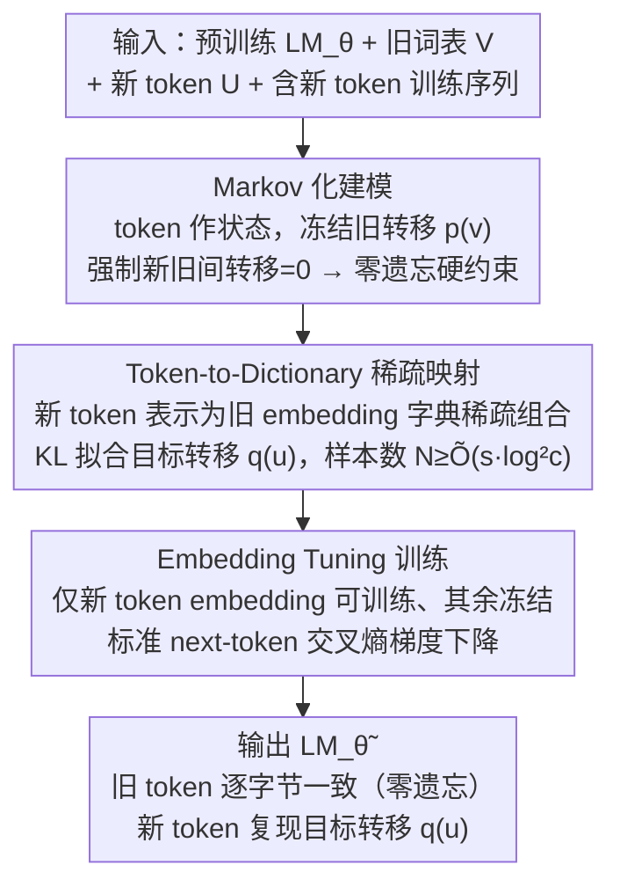

# Memory as a Markov Matrix: Sample Efficient Knowledge Expansion via Token-to-Dictionary Mapping

**会议**: ICML 2026  
**arXiv**: [2605.04308](https://arxiv.org/abs/2605.04308)  
**代码**: 无  
**领域**: LLM 持续学习 / 词表扩展 / 抗遗忘  
**关键词**: Markov 过程, 词表扩展, embedding tuning, 零遗忘, 样本复杂度

## 一句话总结
把自回归 LLM 的下一个 token 分布解释成一条 Markov 链的状态转移矩阵，于是「学新词」就变成「在状态空间里加新状态、并把它表示为已有状态的稀疏组合」，理论上只需 $O(s)$ 样本（$s$ 为映射到的旧 token 数），实践中只 finetune 新 token 的 embedding 即可在严格零遗忘下完成跨语种/新概念扩展。

## 研究背景与动机

**领域现状**：把预训练 LLM 适配到新词汇 / 新实体 / 新领域是持续学习的核心需求（如 “COVID-19”、特定专业术语、跨语种迁移）。主流做法是 full fine-tuning、LoRA、prompt tuning，或者外挂检索。

**现有痛点**：哪怕在 Llama-3、Qwen-2.5 这种新模型上，标准 fine-tuning 仍会出现明显的灾难性遗忘——而且模型越大反而越严重；同时模型更新是不可逆的，一旦改坏就回不去。

**核心矛盾**：现代 LLM 已经非常 expressive，为了「装下一小撮新知识」却必须更新数十亿参数，本身就违反直觉；而且全量更新天然会污染旧词之间的转移关系。

**本文目标**：给「新增 $m \ll T$ 个新 token、不破坏原有 $T$ 个 token 之间转移关系」这件事建立一个干净的数学框架，并给出可证明的样本复杂度。

**切入角度**：把 LLM 看作一条 Markov 链——token 是状态、$p_\theta(\cdot \mid x_t)$ 就是转移概率向量。在这个视角下「不遗忘」就等价于「保持旧状态之间的转移矩阵不变」，而「新增知识」就等价于「把状态空间从 $\mathcal{V}$ 扩到 $\mathcal{V} \cup \mathcal{U}$」。

**核心 idea**：每个新 token $u$ 只需要被表示成若干已有 token 的稀疏线性组合（在 embedding 空间里 $\bm{\alpha}^{(u)} \in \mathbb{R}^T$，$\|\bm{\alpha}^{(u)}\|_0 \le s$），就能复用旧字典的语义结构；而具体实现就是只 finetune 新 token 的 embedding 向量，旧权重一概不动，从而硬性保证零遗忘。

## 方法详解

### 整体框架
这篇论文要解决的是：给一个预训练好的 LM 加进几个新 token（新词、新实体、跨语种），既要它们用得起来，又不能动坏原来几万个 token 之间的转移关系。它的破题方式是把整个自回归模型看成一条一阶 Markov 链——token 是状态、$p_\theta(\cdot \mid x_t)$ 就是从当前状态出发的转移概率向量。于是「学新词」被翻译成两件干净的事：在状态空间里加一个新状态，并把它表示成已有状态的稀疏组合。整条 pipeline 从输入的预训练 $\texttt{LM}_\theta$、旧词表 $\mathcal{V}$、一小批新 token $\mathcal{U}$ 和含新 token 的训练序列出发，先用 Markov 视角把「不遗忘」写成对旧转移的硬约束，再用稀疏字典假设推出每个新 token 只需 $O(s)$ 样本，最后落到一个极简实现——只把新 token 的 embedding 设为可训练、其余权重全冻结，得到的 $\texttt{LM}_{\tilde{\theta}}$ 在旧 token 上与原模型逐字节一致，在新 token 上能复现目标转移分布 $\mathbf{q}^{(u)}$。

### 关键设计

**1. Markov 化的知识扩展：把「零遗忘」从经验观察升级成结构约束**

标准 fine-tuning 之所以会灾难性遗忘，是因为它同时改动了所有 token 之间的转移关系，而你根本无法保证旧词之间的转移没被污染。这里的做法是把生成过程显式写成 Markov 链：旧 token 之间的转移向量 $\mathbf{p}^{(v)} \in \Delta(\mathcal{V})$ 已经由预训练模型给定，引入新 token $u$ 后只新学一个 $\mathbf{q}^{(u)} \in \Delta(\mathcal{V})$，并强制 $p_{\tilde{\theta}}(u \mid v) = 0$、$p_{\tilde{\theta}}(u_i \mid u_j) = 0$（旧词不转移到新词、新词之间也不互转）。这样一来，只要当前状态 $x_t \in \mathcal{V}$，$p_{\tilde{\theta}}(\cdot \mid x_t)$ 就和原模型分毫不差，遗忘量在数学上精确等于 0。关键在于它把「行为保持」从一个靠正则项压制的经验目标，变成了一条可以直接推导出来的等式约束——零遗忘不再是跑出来碰巧好看，而是框架本身保证的事实。

**2. Token-to-Dictionary 稀疏映射：用旧字典的稀疏组合表示新概念，并把语义颗粒度直接写进样本复杂度**

新概念几乎从不是凭空冒出来的——“COVID-19” 在转移行为上其实非常接近 “virus / disease / outbreak” 这几个旧词的混合。论文把这个直觉形式化：设 $f: \mathbb{R}^d \to \Delta(\mathcal{V})$ 是模型的 logit 头，目标是为新 token $u$ 找一组系数 $\bm{\alpha}^{(u)} \in \mathbb{R}^T$，让旧 embedding 字典 $\mathbf{E} \in \mathbb{R}^{T \times d}$ 的组合 $\mathbf{E}^\top \bm{\alpha}^{(u)}$ 经过 $f$ 后恰好复现目标转移 $\mathbf{q}^{(u)}$，即 $f(\mathbf{E}^\top \bm{\alpha}^{(u)}) = \mathbf{q}^{(u)}$。求解时加上稀疏与有界约束 $\|\bm{\alpha}^{(u)}\|_0 \le s$、$\|\bm{\alpha}^{(u)}\|_2 \le B$，用 KL 散度拟合经验转移分布 $\hat{\mathbf{q}}^{(u)}$。在这套假设下论文证明：每个新 token 所需样本数 $N \ge \tilde{O}(s \log^2 c)$，只跟它映射到几个旧词（稀疏度 $s$）有关，而与旧词表大小 $T$、模型维度 $d$ 完全无关。这个结论之所以有意思，是因为它把「新概念有多难学」精确归因到它的语义颗粒度上，而不是按要更新的参数量来估算成本——词表再大，学一个本质上「由三四个旧词拼出来」的新词也很便宜。

**3. Embedding Tuning 训练算法：用最小实现代价把映射策略落到 Transformer，并让正交性天然兜住零遗忘**

前两点都还停在理论层面，这一步把它变成能跑的代码，而且实现简单到近乎反直觉：把新 token 对应的那几行 embedding（如 Llama-3 里 `<|reserved_special_token_0|>` 的 3072 维向量）设为唯一可训练参数，其余 30 亿参数全部冻结，然后就用标准 next-token 交叉熵在含新 token 的语料上做普通梯度下降。推理时新 token 在 attention / FFN 里走的仍是旧权重，被改动的只是它的查询向量——训练相当于把这个查询「拉到」最能复现 $\mathbf{q}^{(u)}$ 的位置。这种实现之所以恰好满足前面的理论假设，是因为被更新的参数和旧 token 的 transition 计算图天然正交：旧 token 永远不会去查询新 embedding，除非新 token 真的出现在上下文里。于是「零遗忘」不再是一个需要小心维护的条件，而是实操中可观测、可验证的结果。

### 损失函数 / 训练策略
训练目标就是标准下一 token 交叉熵 $-\sum_t \log p_{\tilde{\theta}}(x_{t+1} \mid x_{t-k:t})$，没有任何正则项、也不做 replay。论文还把框架推广到高阶 Markov 链：把上下文里最近的 $K$ 个 token 视作一个组合状态后，前面的样本复杂度结论原样成立；由于自然语言的有效 branching factor $b \ll T$，实际稀疏度只是 $s = O(Kb)$，所以高阶扩展并不会让学新词的代价爆炸。

## 实验关键数据

### 主实验
用三类任务验证「样本效率 + 零遗忘」：算术算子任务上 Llama-3.2-3B 学会 $a\langle\text{spec}\rangle b = a \times b$，并对比 ET 和 FFT 在加法保留上的表现；合成词汇任务上把 100 个伪词（如 “glor”, “zorp”）注入真实句子并测 WikiText 上的遗忘；跨语种任务上把 Qwen2.5-3B 适配到西班牙语 / 德语 / 阿拉伯语。

| 任务 | 模型 | 方法 | 目标指标 | 遗忘量 (英语 / 加法) |
|------|------|------|----------|----------------------|
| 算术算子 ($a\langle\text{spec}\rangle b$) | Llama-3.2-3B | FFT | 77.2% acc | 加法 100% → 0%（灾难） |
| 算术算子 | Llama-3.2-3B | ET | **81.4%** acc | 加法仍 100% |
| 跨语种 (西班牙语) | Qwen2.5-3B | FFT | loss 5.56 | 英语 loss +9.83 |
| 跨语种 (西班牙语) | Qwen2.5-3B | ET | **loss 2.30** | 英语 loss **−0.04** |
| 跨语种 (阿拉伯语) | Qwen2.5-3B | ET | **loss 2.82** | 英语 loss **0.00** |

### 消融实验

| 设置 | 合成词汇 test loss | WikiText 遗忘 |
|------|-------------------|---------------|
| Base 模型 (Llama-3.1-8B) | — | 基线 2.42 |
| FFT (N=1000) | 4.40 | +1.24 |
| LoRA | 7.63 | +8.36 |
| Prompt Tuning | 3.79 | +0.69 |
| ET（本文） | 2.42 | **0.00** |

### 关键发现
- ET 在合成词汇 + 跨语种 + 算术算子三个完全不同的任务上同时拿到「最好 / 接近最好的 target loss」和「精确为 0 的遗忘」，验证了零遗忘并不是用准确率换来的。
- 算术算子上 $a\langle\text{spec}\rangle b$ 的 ET 准确率 81.4% 反而超过了 $a*b$ 的 base 63.5%，原因是 $\langle\text{spec}\rangle$ 的 embedding 隐式收敛到 “*$\times$ / times / multiplies / *” 等多个等价表述的稀疏组合（ensemble 准确率 73.2%），这是对「稀疏字典假设」最直接的实证。
- LoRA 在跨语种任务上不仅没遗忘优势，反而比 FFT 还差（loss 7.63 vs 4.40，遗忘 +8.36），说明「参数少」并不等于「不遗忘」；遗忘来自更新方向是否触碰旧 transition，而非更新参数量。
- Spanish / German 上甚至出现轻微「负遗忘」（−0.04 / −0.08），即学了西语反而让英语 WikiText 略微变好，作者猜测是近亲语种的迁移增益。

## 亮点与洞察
- 把「持续学习」彻底从经验调参问题转化为「Markov 链状态空间扩展」的等式问题，给出可以解析推导的「零遗忘」结构条件。这种思路可以迁移到任何输出是离散分布的自回归模型（语音、code、symbolic）。
- 样本复杂度只依赖映射稀疏度 $s$ 而非词表大小 $T$ 或模型维度 $d$，给出了一个反直觉但极有指导意义的 scaling 规则：词表越大并不代表学新词越贵，前提是稀疏假设成立。
- 「只 finetune 新 token embedding」是对 LoRA / PT 这条 PEFT 路线的极端化——它不靠秩约束、不靠 prompt prefix，而是直接利用了 embedding 与 transition 计算图的天然正交性。

## 局限与展望
- 假设每个新 token 在训练语料中以均匀概率出现，实际语料里频率分布很可能与「映射到的旧 token 簇」强耦合（高频词更容易污染旧 transition）。
- 假设 LLM 足够 expressive（$f$ 是 Lipschitz 且能精确实现任何稀疏组合）；当模型容量受限或新概念远离原字典覆盖时，稀疏假设可能破裂。
- 该方法默认「不允许从旧 token 转移到新 token」，意味着新词只能被「召出」而无法在生成中被自然引出，对生成式应用而言是一个明显约束，作者也承认是未来工作。
- 没有在「新 token 之间互相转移」的复杂结构（如学一整套新领域的术语网络）上做实验，只验证了「单点扩张」。

## 相关工作与启发
- **vs LoRA / PT / Adapter**：它们减少了更新的参数量但不能保证更新方向与旧 transition 正交，因此遗忘仍不可控；本文做法直接利用 embedding 表与 transition 图的正交结构，零遗忘是结构性保证而不是调参结果。
- **vs EWC / GEM / replay**：经典持续学习方法靠正则或回放压制遗忘，规模化到 LLM 仍困难；本文方法不需要旧数据回放、不需要 Fisher 信息，只增改新 embedding。
- **vs FlexOlmo / model editing**：那些方法假设「先有目标行为再编辑」，本文则是「先约束更新空间结构性地隔离遗忘」，两种范式互补。
- **vs Markov-LM 相关工作（Zekri et al., Yüksel & Flammarion）**：他们用 Markov 视角分析 transformer 的学习能力，本文则把这条数学路径用来设计具体的持续学习算法。

## 评分
- 新颖性: ⭐⭐⭐⭐ 把 Markov 视角与稀疏字典假设结合给出可证明的样本复杂度，理论框架清新。
- 实验充分度: ⭐⭐⭐ 算术 + 合成词 + 三个目标语种 + 多模型规模都跑了，但未涉及更现实的多领域 / 多步扩张。
- 写作质量: ⭐⭐⭐⭐ 从动机到定理再到算法逻辑非常顺，符号统一、定义清楚。
- 价值: ⭐⭐⭐⭐ 给出了「零遗忘 + 样本高效」可同时成立的最小化方案，对持续学习社区是有强示范意义的 baseline。

<!-- RELATED:START -->

## 相关论文

- [\[ICML 2026\] Optimizing Token Choice for Code Watermarking: An RL Approach](optimizing_token_choice_for_code_watermarking_an_rl_approach.md)
- [\[ICML 2026\] From Volume to Value: Preference-Aligned Memory Construction for On-Device RAG](from_volume_to_value_preference-aligned_memory_construction_for_on-device_rag.md)
- [\[ICML 2026\] Efficient DP-SGD for LLMs with Randomized Clipping](efficient_dp-sgd_for_llms_with_randomized_clipping.md)
- [\[ICML 2026\] From Parameter Dynamics to Risk Scoring: Quantifying Sample-Level Safety Degradation in LLM Fine-tuning](from_parameter_dynamics_to_risk_scoring_quantifying_sample-level_safety_degradat.md)
- [\[NeurIPS 2025\] On the Sample Complexity of Differentially Private Policy Optimization](../../NeurIPS2025/llm_safety/on_the_sample_complexity_of_differentially_private_policy_optimization.md)

<!-- RELATED:END -->
