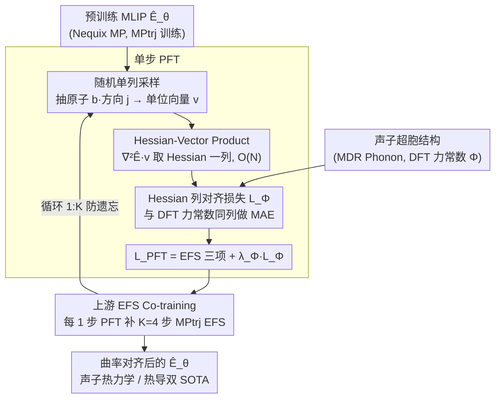

# PFT: Phonon Fine-tuning for Machine Learned Interatomic Potentials

**会议**: ICML 2026  
**arXiv**: [2601.07742](https://arxiv.org/abs/2601.07742)  
**代码**: 无  
**领域**: 科学计算 / 材料模拟 / 机器学习势函数  
**关键词**: MLIP, 声子, Hessian, 力常数, 微调

## 一句话总结
本文提出 PFT (Phonon Fine-tuning)，通过 Hessian-vector product 随机采样力常数列、并在 MLIP 微调时直接监督能量 Hessian 与 DFT 力常数对齐，配合 co-training 缓解灾难性遗忘，将 Nequix MP 在 MDR Phonon 基准上的声子热力学误差平均降低 55%，并将热导率 $\kappa_{\text{SRME}}$ 从 0.446 降到 0.307，在 MPtrj 训练的模型中达到 SOTA。

## 研究背景与动机

**领域现状**：机器学习原子间势函数 (MLIP) 已成为 DFT 在大规模材料筛选中的廉价替身。主流 universal MLIP（MACE-MP-0、SevenNet、Nequix 等）通过在 MPtrj、OMat24 这类弛豫轨迹数据集上回归能量 $E$、力 $\mathbf{F}=-\nabla E$、应力 $\sigma$（即 EFS loss），学习 Born-Oppenheimer 势能面 (PES)。

**现有痛点**：很多关键物理性质——声子色散、振动熵 $S$、Helmholtz 自由能 $F$、定容比热 $C_V$、热导率 $\kappa$——并不取决于 PES 的零阶 / 一阶量，而取决于二阶力常数 $\Phi_{aibj}=\partial^{2}E/\partial r_{a,i}\partial r_{b,j}$ 乃至更高阶导数。EFS loss 只能间接约束二阶导数，导致大量 MPtrj 训练的 MLIP 在平衡构型附近 PES 曲率被"过软化"，声子频率系统性偏低，甚至出现虚频，预测的相稳定性、热导率明显失真。

**核心矛盾**：要直接监督力常数就得算 Hessian，但晶体声子计算必须在足够大的超胞 (supercell) 上做有限位移以避开自相互作用，超胞动辄上千原子，$3N\times 3N$ 的全 Hessian 内存和计算都按 $O(N^2)$ 爆炸，完整训练不可行；同时声子数据全是平衡构型，直接微调容易破坏在非平衡构型上的预训练能力。

**本文目标**：(1) 把 PES 二阶曲率作为可微的训练信号引入 MLIP，(2) 让这个信号在数千原子超胞上仍然可训练，(3) 在不损失原本 MPtrj 能力的前提下完成微调。

**切入角度**：作者先在多款 MPtrj 训好的基础模型上画了 "Hessian 误差 vs 声子热力学误差" 的散点图（Fig. 2），看到非常强的正相关——这意味着只要把 Hessian 误差打下去，下游声子性质就会跟着改进，从而把"提升声子性质"这件事还原成"对齐 Hessian"这件事。

**核心 idea**：在 EFS loss 上加一项 Hessian 对齐损失 $\mathcal{L}_\Phi$，每个结构只随机抽 Hessian 的一列，用一次 Hessian-vector product (HVP) 算梯度，把单步训练复杂度从 $O(N^2)$ 降到 $O(N)$；并用上游 EFS 数据 co-training 来防遗忘。

## 方法详解

### 整体框架
PFT 的目标很直接：拿一个已经在 MPtrj 等大规模轨迹数据上预训练好的 MLIP $\hat{E}_\theta(\mathbf{r})$（本文主用 Nequix MP，并在 MACE-MP-0、Nequix OAM 上复刻），把它在平衡构型附近被"过软化"的 PES 曲率掰正，同时不丢掉原本的能力。它额外用到一个声子数据集（MDR Phonon，约 8.5k 训练材料、30 万有限位移 DFT 计算）提供二阶力常数标签，再保留一份上游 MPtrj 数据用于防遗忘。

训练时每个声子超胞结构会被随机抽一个原子 $b$ 和笛卡尔方向 $j$，构造一个只在 $(b,j)$ 处为 1 的单位向量 $\mathbf{v}$，用一次 Hessian-vector product 算出对应的 Hessian 列 $\nabla^2_\mathbf{r}\hat{E}\,\mathbf{v}$，与 DFT 力常数的同一列做 MAE，连同 EFS 三项一起组成 $\mathcal{L}_\text{PFT}$；每走 1 步这样的 PFT，再补走 $K=4$ 步上游 MPtrj 的标准 EFS 微调（Algorithm 1）。微调后产出的仍是同一个 $\hat{E}_\theta$，只是 PES 曲率与 DFT 对齐了，下游推理用有限位移或解析 AD 取全力常数结果几乎重合。

### 关键设计

**1. Hessian 列对齐损失 $\mathcal{L}_\Phi$ + 随机单列采样：把二阶曲率变成可监督的训练目标**

声子色散、振动熵、热导率这些性质取决于二阶力常数 $\Phi$，而 EFS loss 只学"力本身"、对"力随位置怎么变"几乎没有直接约束——作者甚至发现直接在 phonon displacement 数据上做 EFS 微调比基础模型还烂（Table 1，$\omega_\text{max}$ 误差从 24 飙到 182），说明位移点的 EFS 信号根本替代不了曲率监督，必须把 Hessian 当成 first-class 的监督目标。PFT 的做法是直接拿能量对坐标的二阶导去对齐 DFT 力常数：$\mathcal{L}_\Phi = \frac{1}{3N_a}\sum_{a,i}\mathbb{E}_{b,j}\,|\partial^2\hat{E}/\partial r_{a,i}\partial r_{b,j} - \Phi_{aibj}|$。

完整 Hessian 是 $3N\times 3N$，超胞动辄几百上千原子根本算不动，于是每个结构每步只均匀采样一个 $(b,j)$、等价于只比对 Hessian 的一列。因为这个采样的期望恰好等于对完整 Hessian 求 MAE，梯度是无偏的；再加上 E(3)-等变架构让力常数本身有大量对称冗余，单列采样在统计意义上已覆盖大部分自由度，既省算力又不牺牲监督质量。

**2. Hessian-Vector Product 把单步复杂度从 $O(N^2)$ 压到 $O(N)$：让大超胞上的曲率监督真的训得起来**

光有 $\mathcal{L}_\Phi$ 还不够——显式构造整张 Hessian 在大超胞下显存直接爆掉。PFT 借用 Pearlmutter 1994 的 HVP 技巧绕开它：$\nabla^2_\mathbf{r}\hat{E}\,\mathbf{v} = \nabla_\mathbf{r}((\nabla_\mathbf{r}\hat{E})^\top \mathbf{v})$，在 JAX 里就是 `jax.jvp(jax.grad(energy), (pos,), (v,))[1]`——先 reverse-mode 求力，再套一层 forward-mode JVP 拿到力沿 $\mathbf{v}$ 方向的导数，整列 Hessian 一次反传就出来，全程不落地任何 $N^2$ 大小的矩阵。实现上把一个 batch 里多个结构拼成一张不连通的大图、把各自采样的 $\mathbf{v}$ 拼成一个向量，对总能量做一次 HVP 就同时算完所有结构的损失；优化器更新还要再对 HVP 求一次梯度，构成"triple-backward"。

正是这一步把每训练步从 $O(N^2)$ 降到 $O(N)$，使几百原子超胞的 Hessian 监督在单卡 A100 上成为现实——整个 PFT 只花 35 A100 小时（含 co-training）或 15 A100 小时（不含），不到预训练 100 A100 小时的三分之一。

**3. 上游 EFS Co-training：用最小代价压住灾难性遗忘**

声子数据天然全是平衡构型，只盯着它训练会让 PES 在非平衡区域漂移——表现为 MPtrj 验证集上能量/力/应力误差显著上升（Fig. 3），即模型把原本会做的弛豫轨迹和稳定性预测给忘了。PFT 的应对极其朴素：每做 1 步 PFT，紧接着做 $K=4$ 步在上游 $\mathcal{D}_\text{up}$（MPtrj）上的标准 EFS 更新（Algorithm 1 第 4-7 行），$K$ 由同时监控两边验证集挑出。

实测无 co-training 时 PFT 会让 MPtrj 上的 EFS 误差明显变差，加上 $1{:}4$ 的混训后这部分退化几乎消失、而 Hessian MAE 只略微回升一点点；在 Matbench Discovery 稳定性分类上，co-training 把掉点压在 1% 以内。相比 LoRA、EWC 这类保旧知识的方法，这里只是按固定比例掺上游数据，工程上极简却把遗忘几乎抹平。

### 损失函数 / 训练策略
总损失 $\mathcal{L}_\text{PFT} = \lambda_E\mathcal{L}_E + \lambda_F\mathcal{L}_F + \lambda_\sigma\mathcal{L}_\sigma + \lambda_\Phi\mathcal{L}_\Phi$：前三项沿用 EFS（能量/应力用 MAE、力用 $\ell_2$），第四项即上面的 Hessian 对齐。声子结构本身的力和应力按"已弛豫到平衡"近似为 0，超胞能量取单胞能量乘以重复次数。Co-training 比 $K=4$，PFT 共 200 epoch，同一套配方在 MACE-MP-0、Nequix OAM 上无需调参直接复用。

## 实验关键数据

### 主实验

| 数据集 / 指标 | Nequix MP base | Nequix MP PFT | Nequix MP PFT (无co-train) | 对比 SOTA (MPtrj) |
|---|---|---|---|---|
| MDR Phonon $\omega_\text{max}$ (K) MAE | 24 | **12** | 10 | eSEN-MP 24 |
| MDR Phonon $S$ (J/K/mol) MAE | 32 | 14 | **11** | eSEN-MP 14 |
| MDR Phonon $F$ (kJ/mol) MAE | 12 | 5 | **4** | eSEN-MP 4 |
| MDR Phonon $C_V$ (J/K/mol) MAE | 6 | 3 | **2** | eSEN-MP 5 |
| 第三阶力常数 $\Phi^{(3)}$ MAE (meV/ų) | 10.52 | 8.35 | **7.46** | — |
| Matbench Disc. 热导 $\kappa_\text{SRME}$ ↓ | 0.446 | 0.307 | **0.281** | eSEN-30M 0.340 |

四项声子热力学量平均降误差 55%；同样的配方在 MACE-MP-0 上把 $\omega_\text{max}$ 从 61 降到 19、$S$ 从 60 降到 14；在更强的 Nequix OAM 基模上 PFT 仍能降 50%，并且 708K 参数的 Nequix MP PFT 反超 OAM 基模，说明 Hessian 监督比单纯堆上游数据更高效。

### 消融实验

| 配置 | Hessian MAE | MPtrj EFS 退化 | 说明 |
|---|---|---|---|
| Nequix MP base | 高 | 0 | 仅 EFS 训练 |
| 在 phonon displacement 上做 EFS 微调 | 比 base 还高 | — | $\omega_\text{max}$ 从 24 飙到 182，说明 EFS 信号无法替代 Hessian 监督 |
| PFT (无 co-training) | 最低 | MPtrj 上 EFS 明显变差 (Fig. 3) | 声子最强但灾难性遗忘 |
| PFT (co-training, $K=4$) | 略高于无 co-train | 几乎无退化 | 综合最佳 |
| 力常数推理：有限位移 vs 解析 AD | 几乎相同 (Table 1) | — | HVP 解析法可去掉位移距离这一超参 |

### 关键发现
- "Hessian 误差 vs 声子性质误差"在多个模型上呈强正相关（Fig. 2 / Fig. 5），把曲率打准就自动带飞下游性质——这把"如何提升声子预测"重新定义成了一个回归问题。
- 即使只监督二阶导数，模型在三阶力常数和热导率（依赖三阶导）上也获得 20–30% 的提升，说明 Hessian 监督隐式约束了 PES 的更高阶光滑性。
- 直接在 rattled / perturbed 结构上做 EFS 训练并不能代替 Hessian 监督——这对 OMat24 这类"加噪平衡构型"的训练范式是一个重要警告。

## 亮点与洞察
- **把 HVP 当 first-class 训练原语**：作者把 PINNs / 隐式微分社区常用的 HVP 直接搬进 MLIP 训练，让 $O(N)$ 复杂度的二阶导数监督在 GPU 上成为现实。整套实现核心只是几行 JAX，复用任何能 grad 的 energy model 都能加。
- **用相关性分析"反推"训练目标**：Fig. 2 先证明"Hessian 误差 = 声子误差的代理"，再去监督 Hessian，是一种很扎实的 "find the right loss" 范式，可迁移到其他对高阶导数敏感的物理任务（电子-声子耦合、热电、弹性模量等）。
- **Co-training 的最小代价方案**：相较 LoRA、EWC 这些保留旧知识的方法，本文只是简单按 $1:K$ 比例混训上游数据，工程上极简却把灾难性遗忘几乎压平。
- **小模型 + 好 loss > 大模型 + 多数据**：708K 参数的 Nequix MP PFT 反超 30M 的 eSEN-MP 和 Nequix OAM 基模，提示在物理 ML 里"loss 的归纳偏置"可能比数据规模更值钱。

## 局限性 / 可改进方向
- 仅在能量守恒、$E(3)$-等变 MLIP 上验证；非等变模型若直接做单列采样可能引入偏差，需要额外的数据增广，作者已经提示。
- 声子数据仍偏向"已经动力学稳定"的体系；对带强非简谐性、极性极化、电声耦合的体系（如铁电、超导）是否还有效未充分验证。
- 力常数标签来源 (MDR Phonon) 是 PBE 泛函有限位移；对其他泛函 (SCAN、meta-GGA、杂化) 或带 vdW 修正的数据分布需要重新评测。
- 没有公开代码（截至 v4），复现需要从 Nequix / JAX 重建训练 pipeline。
- 可改进：把单列采样升级为 block-Hessian 采样、加入声学求和规则 (acoustic sum rule) 作为硬约束、把 $K$ 改成自适应（按两边验证集梯度大小动态调）。

## 相关工作与启发
- **vs eSEN-MP / SevenNet / MACE-MP-0 等纯 EFS 大模型**：它们靠堆数据和模型容量隐式逼近曲率，PFT 选择把曲率显式监督进去，从 Table 1 看，708K 的 PFT 模型完胜 30M 的 eSEN-MP，证明"更好的 loss > 更大的模型"。
- **vs 用 rattled / perturbed 构型做 EFS 增广（OMat24 风格）**：作者实验证明这条路对 Hessian 准确度几乎没帮助甚至有害，所以仅"加噪样本"不能替代真正的二阶监督。
- **vs Hessian-aware 优化 / 物理信息神经网络 (PINNs)**：思想上一脉相承——都是把高阶导数搬进损失。本文的贡献在于第一次把这套机制 scale 到几百原子超胞的真实材料设置，并和 co-training 组合解决遗忘。
- **启发**：任何"输出是某个标量函数的高阶导数"的任务——分子振动光谱、晶格弹性常数、流体 Navier-Stokes 残差、神经 ODE 的稳定性分析——都可以套用"HVP 列采样 + co-training"的两件套配方。

## 评分
- 新颖性: ⭐⭐⭐⭐ — Hessian 监督和 HVP 都是已有工具，但首次组成可 scale 的 MLIP 训练范式，并系统证明其下游收益。
- 实验充分度: ⭐⭐⭐⭐⭐ — 3 个基模 × 2 个上游数据集 × MDR Phonon / 三阶力常数 / 热导 / Matbench Discovery 四套基准，消融把"为什么不能只用 EFS"和"为什么需要 co-training"都讲清楚了。
- 写作质量: ⭐⭐⭐⭐ — 公式与算法清晰，Fig. 2 的相关性分析很有说服力；个别公式排版略密。
- 价值: ⭐⭐⭐⭐⭐ — 在 MPtrj-trained MLIP 上拿下声子和热导双 SOTA，且训练成本不到预训练的 1/3，对材料 ML 社区是即插即用的升级。

<!-- RELATED:START -->

## 相关论文

- [\[ICML 2026\] Decoupled Training with Local Reinforcement Fine-Tuning in Federated Learning](decoupled_training_with_local_reinforcement_fine-tuning_in_federated_learning.md)
- [\[ICML 2026\] TCAP: Tri-Component Attention Profiling for Unsupervised Backdoor Detection in MLLM Fine-Tuning](tcap_tri-component_attention_profiling_for_unsupervised_backdoor_detection_in_ml.md)
- [\[ICML 2026\] From Parameter Dynamics to Risk Scoring: Quantifying Sample-Level Safety Degradation in LLM Fine-tuning](from_parameter_dynamics_to_risk_scoring_quantifying_sample-level_safety_degradat.md)
- [\[ICML 2026\] Towards Fine-Grained Robustness: Attention-Guided Test-Time Prompt Tuning for Vision-Language Models](towards_fine-grained_robustness_attention-guided_test-time_prompt_tuning_for_vis.md)
- [\[ICML 2026\] FedTreeLoRA: Reconciling Statistical and Functional Heterogeneity in Federated LoRA Fine-Tuning](fedtreelora_reconciling_statistical_and_functional_heterogeneity_in_federated_lo.md)

<!-- RELATED:END -->
