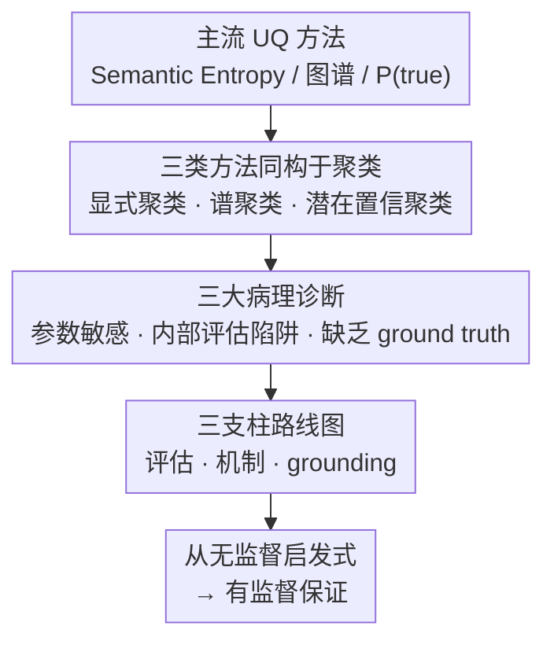

# Position: Uncertainty Quantification in LLMs is Just Unsupervised Clustering

**会议**: ICML 2026  
**arXiv**: [2605.19220](https://arxiv.org/abs/2605.19220)  
**代码**: 无（position paper）  
**领域**: LLM 安全 / 不确定性量化  
**关键词**: Position Paper、Uncertainty Quantification、置信幻觉、聚类范式、外部真值

## 一句话总结
这是一篇位置论文，核心论断：当前 LLM 不确定性量化（UQ）的主流方法（Semantic Entropy、图谱方法、P(true) 等）在机制上与无监督聚类同构——它们只衡量"模型生成的内部一致性"而非"外部正确性"，因此面对"自信幻觉"（confident hallucination）天然失效；作者诊断出参数敏感性、内部评估循环、缺乏 ground truth 三大病灶，并提出从评估、机制、grounding 三个支柱转向"监督式保障"的路线图。

## 研究背景与动机

**领域现状**：LLM 落地高风险领域（医疗、法律）的最大障碍是幻觉，业界主流安全网是 UQ：给每个 query+answer 配一个不确定性分数，触发阈值就拒答。技术路线大致三派——基于熵（Semantic Entropy 及变体 SAE/SEN/KLE/SNNE/SDLG）、基于图（SGC/GU/SGD/SeSE/GENUINE/U-EigV）、基于言辞自评（P(true)/CIn/SelfCheckGPT/UaIT）。

**现有痛点**：尽管 UQ 论文越来越多，模型却在"自信地胡说八道"。AUROC 等指标看起来不错，但部署到真实场景里仍然漏接关键错误，让用户产生虚假安全感。

**核心矛盾**：作者诊断这是一个 **范畴错误（category error）**——所有主流 UQ 方法都在测"模型生成之间彼此有多稳定"，而非"答案与外部事实有多接近"。当模型对一个错误答案非常一致时（自信幻觉），这些方法就会反过来给出"高置信度"，与安全初衷彻底背道。

**本文目标**：(i) 证明主流 UQ 方法在机制上同构于无监督聚类；(ii) 揭示这种同构带来的三大病理——参数敏感、内部评估循环、缺乏 ground truth；(iii) 给出 evaluation / mechanism / grounding 三支柱的路线图，把 UQ 从"无监督启发式"推向"有监督保证"。

**切入角度**：用"是聚类吗？"这一统一视角解构 SE / 图谱 / P(true) 三类方法的数学结构，再借用聚类研究里"内部有效性指数无法保证语义正确"的经典教训，把 UQ 的根本缺陷暴露在同一框架下。

**核心 idea**：UQ ≠ 测量"真假"，UQ = 测量"模型生成之间的几何/语义分离度"——这是无监督聚类，缺乏外部锚点；唯一出路是引入外部 ground truth + 监督机制。

## 方法详解

### 整体框架
这篇 position paper 主张：当前所有主流 UQ 方法都只是换了壳的无监督聚类，量的是"模型生成之间彼此有多分离"，而非"答案与外部事实有多接近"，因此遇到自信幻觉必然失效。它的论证不是提一个新方法，而是搭一条"诊断 → 处方"的链：先把 Semantic Entropy、图谱、P(true) 三类方法在数学上 reduce 成同一种聚类操作，再顺着这个同构推出参数敏感、内部评估循环、缺乏 ground truth 三大病灶，最后给出 evaluation / mechanism / grounding 三支柱的改造蓝图，把 UQ 从"无监督启发式"推向"有监督保证"。

### 关键设计

**1. 三类主流 UQ 方法在机制上同构于聚类：一次证明，一并反对**

这是整篇论证的地基——只要确认 SE、图谱、P(true) 三者本质是同一件事，就不必逐一拆解，反对"无监督聚类无法保证语义正确"一次即可。**Semantic Entropy 是显式聚类**：用 NLI 模型把采样出的回答集合 $\mathcal{S}=\{s_1,\dots,s_m\}$ 划进语义等价类 $C_1,\dots,C_M$，再算类分布的熵 $U_{\text{SE}}(C\mid x)=-\sum_{i=1}^M p(C_i\mid x)\log p(C_i\mid x)$，其中 NLI 模型扮演"聚类准则"、熵扮演"聚类纯度"。**图谱方法是隐式谱聚类**：用成对相似度 $w_{j_1,j_2}=(a_{j_1,j_2}+a_{j_2,j_1})/2$ 构权重图 $W$，做归一化 Laplacian $L=I-D^{-1/2}WD^{-1/2}$，再用 $U_{\text{EigV}}=\sum_{k=1}^m\max(0,1-\lambda_k)$ 数"有效语义模数"——这是不显式分配标签的谱聚类，等价于谱聚类的"内部有效性指数"。**P(true) 是潜在置信聚类**：把 $U_{\text{P(true)}}(x,\hat{y})=1-P(\text{``True''}\mid x,\hat{y})$ 当作对模型内部"高置信区域"的隶属度测试，论文用 Qwen2.5-32B 在 QASC 上的 PCA 可视化（Fig.2）证明 high-P(true) 与 low-P(true) 样本在隐层空间几何分离成两簇，几何上就是一次 soft cluster assignment。论文同时明确把 token-level perplexity、Deep Ensembles、监督式分类器（Azaria & Mitchell 2023）划在框架之外——前两者因性能不佳被边缘化，后者恰恰是作者推崇的"有监督"方向。

**2. 三大病理诊断：把"聚类同构"翻译成部署中的安全隐患**

确认了同构之后，作者把这个抽象判断落成三个可观测的工程后果，逼 UQ 研究者直面"漂亮的 AUROC ≠ 安全"。第一是**参数敏感性危机**：UQ 分数受温度、NLI 阈值、采样数 $n$、prompt 等超参剧烈影响，Tab.1 的 Jaccard 实证显示在 QASC + Qwen2.5-32B 上，SE 与 EigV 的 Top-10% 高不确定样本只有 0.134 重叠、SE 与 P(true) 只有 0.080——不同方法连"谁不确定"都达不成共识。第二是**内部评估陷阱**：AUROC 默认"内部稳定 = 真实正确"，但自信幻觉彻底打破这个假设，错误答案越稳定反而被打越高的置信分，这与聚类里 Silhouette 系数"内部紧致 ≠ 外部有意义"是同一个病。第三是**缺乏 ground truth（judge problem）**：UQ 靠 AUROC 与 correctness 的相关性来评，而开放任务上的 correctness 本身要靠 RougeL > 0.3 或另一个 LLM judge 来打分，judge 自己又有噪、易偏；Fig.3 直接展示当 correctness 阈值 $\tau$ 漂移时方法排名整体抖动——评估管线建在一把不稳的尺子上。

**3. 三支柱路线图：evaluation → mechanism → grounding，逐环切除对内部一致性的依赖**

三个支柱分别回答"如何评、如何造、用什么真值评"。**评估支柱**把 UQ 当成二元告警系统（accept / reject），借鉴 Carlini et al. 2022 的 MIA 范式——固定 FPR < 0.1% 度量 TPR，专门盯"高置信幻觉"这一小撮关键样本；同时提出 **AUSC（Area Under the Stability Curve）**，跨超参（如温度 $T\in[0,1]$）扫一遍 AUROC，要求方法在整个合理参数区间都稳定，而不是 cherry-pick 最优点。**机制支柱**一方面把 **Conformal Prediction** 重新定位成下游评估框架——固定覆盖率（如 90%）下比较各方法作为 nonconformity score 时的 set size，自信幻觉会被强制以"集合爆炸"暴露；另一方面在 Post-training（RLHF）阶段做 **Uncertainty Alignment**，奖励模型显式输出"I am confident that …"对"It is possible that …"这类粒度化置信标记，把不确定性从隐式几何特征变成显式语言信号。**Grounding 支柱**则强制先做 **Unit Testing**——UQ 方法要先在 code（HumanEval 这类执行可判）、math（最终答案是常量）等可程序判定的场景跑过 AUROC 与 TPR@low-FPR，再谈开放任务——并辅以 **Atomic Fact Verification**：把开放生成拆成原子声明，用搜索引擎、KB、Lean4 等形式化定理证明器、多跳 deep search agent 这些"非 LLM 判官"逐条核验，打破"LLM 判 LLM"的循环。配套地，论文把推荐指标收敛到 **TPR@FPR<0.1%** 与 **AUSC**，并把 Conformal Prediction 固定覆盖率下的 set size 作为"truth-aware"代理。

## 实验关键数据

### 主实验
论文不做新方法实验，而是用支撑性数值"证伪"主流 UQ 范式的可靠性。

| 评估实验 | 数据 / 模型 | 关键结果 | 结论 |
|----------|-------------|----------|------|
| Jaccard 重叠（Tab.1） | QASC, Qwen2.5-32B | SE vs EigV Top-10% = 0.134；SE vs P(true) Top-10% = 0.080；EigV vs P(true) = 0.224 | 不同方法对"谁不确定"严重不一致 |
| P(true) 隐空间可视化（Fig.2） | QASC, Qwen2.5-32B | High-P(true) 与 low-P(true) 样本在 PCA 上几何分离成两簇 | P(true) 本质是隐空间聚类隶属测试 |
| Correctness 阈值敏感（Fig.3） | 改编自 Liu et al. 2025b | $\tau$ 变化时 UQ 方法排名反复颠倒 | "judge 自己不稳"使 AUROC 评估失效 |

### 消融实验

| 论证 | 支撑证据 | 病理 → 处方 |
|------|----------|------------|
| 自信幻觉破坏一致性代理 | Simhi et al. 2025；Kalavasis et al. 2025 | 内部一致性 → 改用 worst-case TPR |
| 参数敏感 vs 鲁棒性 | Cecere et al. 2025 (温度)、Kuhn 2023 ($n$)、Farquhar 2024 (NLI 阈值) | 单点最优汇报 → 改用 AUSC |
| RLHF 反向"反校准" | Kadavath 2022、Achiam 2023 | 期待 scaling 解决 → 改用 Uncertainty Alignment + CP |
| 开放生成需可验证真值 | Yao 2022（code）、Hendrycks（math） | LLM-as-judge 循环 → 改用 Lean4 / 原子事实 |

### 关键发现
- **不同方法连"谁不确定"都谈不拢**：Jaccard 仅 0.08–0.22，说明各方法量的是不同维度，把任意一个当作"安全网"都缺乏外部基准来仲裁。
- **几何分离 ≠ 真实可信**：P(true) 的 PCA 可视化恰好证伪它在做事实判别——它做的是"输出落在置信簇内还是外"，与真假无关。
- **AUROC 被简单样本稀释**：易例占多数会把 AUROC 拉高，但部署中危险的只有"高置信但错误"的那一小撮，这正是 MIA 风格 TPR@low-FPR 要专门盯的部分。
- **RLHF 反而加剧问题**：对齐人类偏好让模型语气更权威，scaling 不会自动解决校准——只会让幻觉看起来"更专业"，使聚类病理放大。

## 亮点与洞察
- **范畴错误这个标签足够锋利**：把一整条 UQ 研究线一刀切到"无监督聚类"上，给后续工作提供了清晰的"是 / 否在做监督校准"分类轴，是这类 position paper 该做的"换视角"。
- **MIA 类比是高质量迁移**：直接把 Carlini et al. 2022 的 worst-case 评估范式搬到 UQ，意味着"高风险系统应在尾部用 TPR@low-FPR 评估"这一通用原则正在 ML 安全语境里跨子领域统一。
- **CP 当评估器的视角值得复用**：固定覆盖率下比较 set size 是"逼方法把幻觉外化为可观测代价"的巧思，可推广到任何打分式安全机制的横向比较。
- **AUSC 是个实操可落地的反 p-hacking 工具**：要求方法跨超参稳定，可直接成为 benchmark 报告的强制项，把"调参出 SOTA"的灰色地带堵死。

## 局限与展望
- **没给出完整新方法或基准**：路线图层面够清晰，但 TPR@low-FPR、AUSC、Atomic Fact 体系都是建议，缺一个端到端实证 demo 说明"换了之后大家排名会怎样"。
- **论证依赖部分二手实证**：Fig.3 直接改编自 Liu et al. 2025b，Tab.1 的 Jaccard 只在 QASC + Qwen2.5-32B 一对模型/数据上测，跨模型可重复性需后续工作补齐。
- **形式化验证落地困难**：Lean4 / 原子事实校验在医学、法律这类"事实但非形式化"领域代价高昂，论文未讨论该范式的可扩展性瓶颈。
- **对"不可避免的主观开放生成"留白**：作者承认创意写作存在合理多样性，但只给出"用原子事实拆分"这一种处方，没有提出适用于风格 / 偏好不确定性的替代方案。

## 相关工作与启发
- **vs Semantic Entropy (Kuhn et al. 2023)**：本文不否认 SE 在 benchmark 上的有效性，但指出它本质是 NLI 驱动的显式聚类，遇到自信幻觉就失灵；启发：任何用熵度量稳定性的指标都要先回答"稳定的对象是否锚定外部真值"。
- **vs 图谱方法 (Lin et al. 2023 等)**：本文用 Laplacian 谱与谱聚类的等价性证明它是隐式聚类；启发：构图 / 谱分析在"无外部标签"语境下天然只能是结构性指标，不能直接当真实性 proxy。
- **vs P(true) / SelfCheckGPT 系**：被本文证伪为"latent confidence cluster 隶属测试"；启发：让模型自评不是事实判别，是几何距离查询。
- **vs Conformal Prediction 文献 (Quach 2023, Su 2024)**：本文把 CP 从"产生预测集"重新定位为"评估 UQ 方法的 truth-aware 标尺"，是对 CP 角色的有趣再利用。
- **vs MIA 评估 (Carlini et al. 2022)**：跨领域类比，启发把"高风险系统看尾部不看平均"作为 ML 安全研究的通用规范。

<!-- RELATED:START -->

## 相关论文

- [\[ACL 2026\] AGSC: Adaptive Granularity and Semantic Clustering for Uncertainty Quantification in Long-text Generation](../../ACL2026/llm_safety/agsc_adaptive_granularity_and_semantic_clustering_for_uncertainty_quantification.md)
- [\[ICML 2026\] LLM Benchmark Datasets Should Be Contamination-Resistant (Position Paper)](llm_benchmark_datasets_should_be_contamination-resistant.md)
- [\[ICML 2026\] TCAP: Tri-Component Attention Profiling for Unsupervised Backdoor Detection in MLLM Fine-Tuning](tcap_tri-component_attention_profiling_for_unsupervised_backdoor_detection_in_ml.md)
- [\[ACL 2026\] From Passive Metric to Active Signal: The Evolving Role of Uncertainty Quantification in Large Language Models](../../ACL2026/llm_safety/from_passive_metric_to_active_signal_the_evolving_role_of_uncertainty_quantifica.md)
- [\[ICML 2026\] SemGrad: Gradients w.r.t. Semantics-Preserving Embeddings Tell LLM Uncertainty](gradients_with_respect_to_semantics_preserving_embeddings_tell_the_uncertainty_o.md)

<!-- RELATED:END -->
