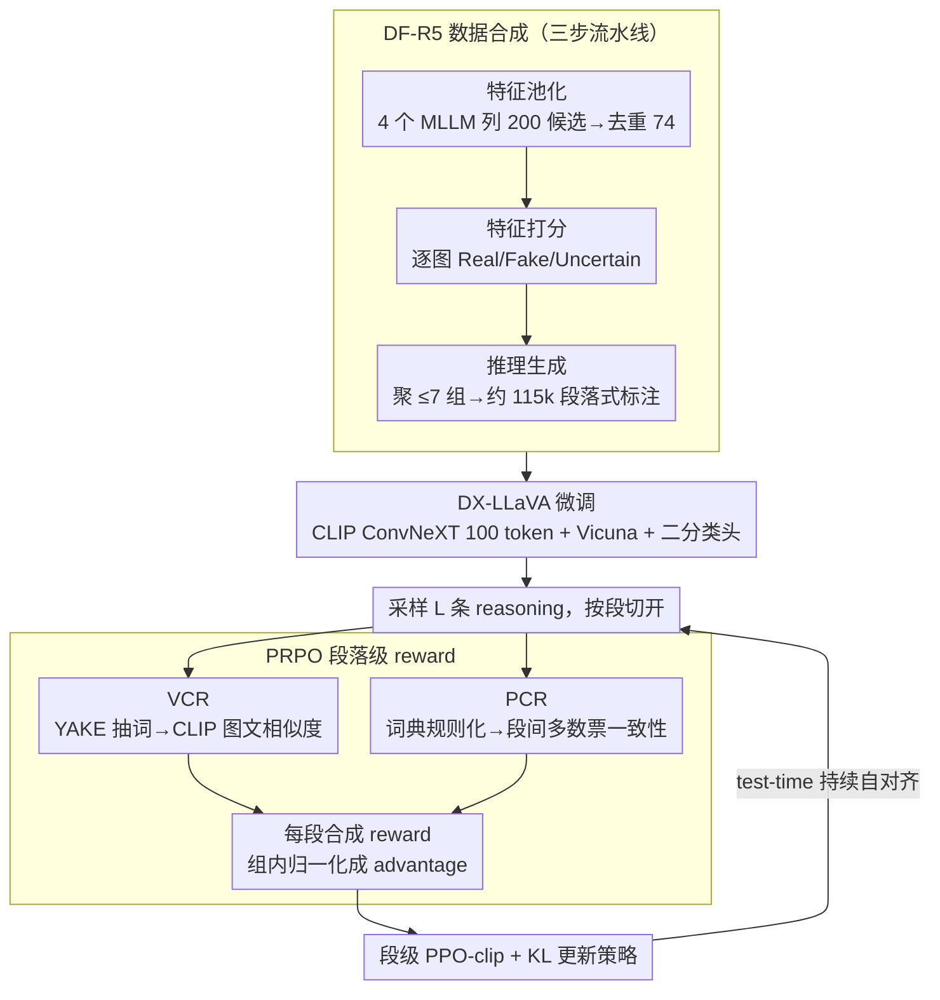

# PRPO: Paragraph-level Policy Optimization for Vision-Language Deepfake Detection

**会议**: ICML 2026  
**arXiv**: [2509.26272](https://arxiv.org/abs/2509.26272)  
**代码**: https://github.com/tuanrpt/PRPO (有)  
**领域**: AI 安全 / 多模态 VLM / 深度伪造检测 / RLHF  
**关键词**: deepfake detection, GRPO, paragraph-level reward, visual grounding, MLLM reasoning

## 一句话总结
作者用一个 115k 带推理标注的 DF-R5 数据集 + 把 CLIP ViT 换成 ConvNeXT 的 DX-LLaVA 架构，并提出 PRPO —— 段落级别 GRPO 变体，每段以 CLIP-文本-图像相似度（VCR）+ 推理-结论多数票一致性（PCR）为 reward，把跨域 deepfake 检测 F1 从 SOTA 75.26% 推到 89.91%，推理质量从 4.2/5 提到 4.55/5。

## 研究背景与动机
**领域现状**：深度伪造图像随扩散模型 / GAN 几乎与真图无差，二分类检测器（CLIP-ViT、ConvNeXT、频域特征）虽强，但完全不可解释。MLLM（LLaVA、GPT-4o、Gemini）有强推理能力，理论上能给出"为何这张图是 fake"的依据，但实际检测准确率反而很差。

**现有痛点**：(1) Data 稀缺 —— 现有 deepfake 数据集几乎没有高质量推理标注，直接用 QA 蒸馏只能学到「短答案」式预测；(2) 架构问题 —— LLaVA 用 CLIP ViT 抓全局语义，对 deepfake 关键的局部高频纹理（毛发、毛孔、背景不连续）不敏感；(3) 推理质量 —— MLLM 频繁「先下结论再补理由」，导致结论与图像证据脱钩，甚至幻觉描述图中根本不存在的瑕疵。

**核心矛盾**：RL 算法（GRPO / PPO）的 reward 普遍只盯最终标签，而 deepfake reasoning 是「分段描述多个伪造线索 + 综合结论」的结构化文本，token-level / sequence-level reward 既给不出段间一致性信号，也无法直接逼模型把每段对齐到图像证据上。

**本文目标**：(1) 造一份大规模带高质量段落式推理标注的数据集；(2) 用一个对局部纹理敏感的 backbone 做监督微调；(3) 设计一种段落级 RL，让模型在推理过程中持续视觉对齐、保持段间结论一致，且能在 test-time 用无标签 reward 持续自改进。

**切入角度**：从「推理本身就是分段」的天然结构出发，把每段当作 RL 中独立的 trajectory unit，分别奖励其与图像的视觉一致性（VCR）和与最终结论的语义一致性（PCR），用 GRPO 的 group-relative advantage 来加权学习。

**核心 idea**：把 GRPO 的 token-level advantage 提升为「段落级」，每段 reward 由 frozen CLIP-ConvNeXT 计算的图文相似度 + 段间多数票一致性合成，使推理段落必须既能描述图中真实证据、又能彼此自洽。

## 方法详解

### 整体框架
整套方法要让一个 MLLM 既能高精度判别 deepfake、又能给出对齐图像证据的分段理由，分三阶段递进：先合成数据、再换 backbone 做监督微调、最后用段落级 RL 在 test-time 持续自对齐。第一阶段 **DF-R5 数据合成**用 4 个 MLLM 池化 200 个候选 deepfake 特征，让 Gemini 对每张图打分、把分数聚成 ≤7 个语义组，生成 115k 条段落式推理标注。第二阶段 **DX-LLaVA 微调**把 LLaVA 的 CLIP ViT 换成对局部纹理更敏感的 CLIP ConvNeXT，配合一个二分类 head 联合训练。第三阶段 **PRPO test-time RL** 对每张图采样 $L$ 条完整 reasoning，把每条按段切开、逐段算 reward、组内归一化成 advantage，再用 PPO-clip 形式更新策略。

### 关键设计

**1. DF-R5 数据合成：三步流水线产出段落式推理标注**

现有 deepfake 数据集几乎没有推理标注，直接拿 QA 去蒸馏只能学到「是/否」短答案，而让 MLLM 看图直接写理由又容易乱选特征、幻觉出图里根本没有的瑕疵。DF-R5 用一条三步流水线把这件事拆开做、逐步可控：① **特征池化**——先不给图，让 Gemini-2.5 / Qwen-2.5 / LLaMA-4 / GPT-4o 四个模型各列约 50 个与 deepfake 相关的面部/视觉特征，汇成约 200 个候选、去重合并成约 74 个通用特征集；② **特征打分**——对每张图，让 Gemini 给这 74 个特征逐个打 Real(−1) / Fake(+1) / Uncertain(0)，避免它无脑全选或凭空捏造，存疑样本再用 ground-truth label 追加 prompt 校正；③ **推理生成**——把细粒度分数按 85% group-frequency 阈值聚成至多 7 个语义组，生成简洁、可解释的分段推理。原始每域 30k、共 150k 图经 Gemini 过滤无效格式后得到约 115k 图文推理对。先抽通用特征→逐图打分→聚组生成，比整图直接蒸馏更可控、幻觉更少，而且天然产出「分段」结构，为后面段落级 RL 提供逐段奖励的载体。

**2. DX-LLaVA：用 CLIP ConvNeXT 替换 ViT 抓局部纹理 + 二分类头**

LLaVA 原生的 CLIP ViT 擅长抓全局语义（利于 VQA），但 deepfake 的破绽藏在局部高频纹理里（毛发走向、毛孔、背景不连续），ViT 对此不敏感。DX-LLaVA 把视觉 backbone 换成 CLIP ConvNeXT——卷积结构纹理偏置更强、对细微瑕疵更敏感——取其 Stage-3 的 10×10 特征图展平成 100 个 pixel embedding，把 1536 维投到 4096 维喂进 projector + Vicuna；同时挂一个二分类头（binary head，GAP 后接线性层），用 $\mathcal L_{\text{total}}=\mathcal L_{\text{lm}}+\alpha\mathcal L_{\text{binary}}$（$\alpha=10$）联合训练，ConvNeXT 全程冻结、只微调 projector + Vicuna + 分类头。消融印证这两步缺一不可：加二分类头把 inter-domain F1 从 35.82 拉到 61.66（否则模型几乎全猜 real），再换成 ConvNeXT backbone 进一步到 78.08。

**3. Visual Consistency Reward（VCR）：把每段推理逐句锚回图像证据**

针对 MLLM「先下结论再补理由、甚至幻觉出图中根本不存在的瑕疵」这个痛点，VCR 给每段推理打一个「你说的东西图里到底有没有」的分。做法是先用 YAKE 无监督关键词抽取从段落 $p_j^{(i)}$ 里抽出关键短语 $s_j^{(i)}$，再喂进 frozen CLIP-ConvNeXT 的 text encoder，与图像 encoder 输出算 cosine 相似度并归一化到 $[0,1]$：$R_{\text{VCR}}(p_j^{(i)})=\tfrac12[\text{sim}(\text{CLIP}_{\text{txt}}(s_j^{(i)}),\text{CLIP}_{\text{img}}(x))+1]$。之所以要先抽词而不是整段塞 CLIP，是因为整段会超出 CLIP 输入长度、语义也被稀释，抽词后信号正好集中在「这段提到的具体特征」上；而且这里复用的就是架构里已有的那个 ConvNeXT，等于白嫖一个 reward model，省掉外部模型和额外算力。

**4. Prediction Consistency Reward（PCR）：用段间多数票把结论锁回证据**

deepfake 推理常出现「证据明明指向 fake、最终却说 real」的内部矛盾，PCR 就是惩罚这种自相矛盾。它先用三张预定义词表把每段规则化成一个段级标签 $\hat y(p_j^{(i)})$：命中 $\mathcal F$（unnatural、inconsistent…）判 fake、命中 $\mathcal R$（authentic、natural…）判 real、$\mathcal N$（no、not…）负责处理否定。中间段默认与图一致、reward 恒为 1；只有 final 段要受约束，其 reward 是它与前面所有段多数投票结果是否一致的指示函数 $\mathbb I[\hat y(p_{M_i+1}^{(i)})=\hat y_{\text{maj}}^{(i)}]$。在 deepfake 这种没有 step-wise gold label 的场景里，没法照搬数学推理的 process reward，于是 PCR 干脆拿模型自身的段间一致性当 label-free 信号——既不需要外部模型也不需要标注，正好契合 test-time RL「现场无监督自改进」的需求。

**5. 段落级 GRPO 损失（PRPO）：让 advantage 精确落到每一段**

token-level GRPO 让一整条 reasoning 共享同一个 advantage，结果是同一条里「写得好的段」和「写错的段」被同奖同罚，信号糊成一团。PRPO 把粒度提到段落：每段先合成自己的 reward $R(p_j^{(i)})=\tfrac12(R_{\text{VCR}}+R_{\text{PCR}})$，然后在整组 $\mathcal O=\{o^{(1)},\dots,o^{(L)}\}$ 的所有段上统一算均值方差 $\mu_R,\sigma_R$ 做归一化 $A_j^{(i)}=(R(p_j^{(i)})-\mu_R)/(\sigma_R+\epsilon)$，组内归一化顺带压住了 reward 数值漂移。策略比定义为 $r_j^{(i)}=\pi_\theta(p_j^{(i)}|v,z)/\pi_{\text{old}}(p_j^{(i)}|v,z)$，主损失是段级 PPO-clip：

$$\mathcal L_{\text{PRPO}}=\mathbb E\sum_{i,j}\min(r_j^{(i)}A_j^{(i)},\text{clip}(r_j^{(i)},1-\epsilon,1+\epsilon)A_j^{(i)})$$

再额外加一个段级 KL 项 $\mathcal L_{\text{KL}}$ 对齐 reference model，总目标为 $\max_\theta\mathcal J=\mathcal L_{\text{PRPO}}-\beta\mathcal L_{\text{KL}}$（$\beta=0.01$）。这样奖励信号就精确落到对应文字上，优秀段被单独拉高、错段被单独压低，而不是整条一起涨跌。

### 损失函数 / 训练策略
微调阶段损失为 $\mathcal L_{\text{total}}=\mathcal L_{\text{lm}}+\alpha\mathcal L_{\text{binary}}$（$\alpha=10$，binary head 取 GAP 后接线性分类），DX-LLaVA 把 CLIP ConvNeXT Stage-3 的 10×10 像素级特征展平为 100 token 喂给 projector + Vicuna 联合训练。PRPO 阶段优化 $\mathcal J=\mathcal L_{\text{PRPO}}-\beta\mathcal L_{\text{KL}}$（$\beta=0.01$）。学习率微调用 $2\times 10^{-5}$、PRPO 用 $3\times 10^{-7}$；CLIP ConvNeXT 全程冻结，只微调 projector + Vicuna + 分类头。训练用 8 卡 H200、verl 框架。

## 实验关键数据

### 主实验
在 DF-40 上做 leave-one-domain-out 跨域测试（训 4 域，测第 5 域），F1：

| 方法 | →DDIM | →PixArt | →SD | →SiT | →StyleGAN | 平均 |
|------|------|--------|----|-----|-----------|------|
| LLaVA | 49.86 | 65.46 | 26.54 | 15.36 | 57.03 | 42.85 |
| DE-FAKE | 8.83 | 86.45 | 95.80 | 4.55 | 76.50 | 54.43 |
| FakeShield | 31.84 | 88.57 | 92.28 | 33.22 | 98.70 | 68.92 |
| UnivCLIP | 74.85 | 89.31 | 74.81 | 40.01 | 86.46 | 73.09 |
| SIDA | 70.07 | 73.86 | 92.37 | 46.53 | 94.98 | 75.26 |
| DX-LLaVA (ours, SFT) | 92.34 | 83.11 | 89.35 | 26.46 | 99.13 | 78.08 |
| **PRPO (ours, RL)** | **95.88** | **88.10** | **94.99** | **71.26** | **99.32** | **89.91** |

跨域平均 F1 较 SIDA 提升 14.65 pp，最难的 SiT 域上跃升 24.7 pp（46.53→71.26）。

### 消融实验

| 配置 | F1 / 关键指标 | 说明 |
|------|--------------|------|
| LLaVA + $\mathcal L_{\text{lm}}$（仅语言损失） | 35.82 (inter-domain) | 高 precision 低 recall，模型全部猜 real |
| LLaVA + $\mathcal L_{\text{lm}}+\alpha\mathcal L_{\text{binary}}$ | 61.66 | binary head 显著增强判别 |
| 换成 ConvNeXT backbone（DX-LLaVA） | 78.08 | 局部纹理优势 |
| + PRPO | **89.91** | 段落级 RL 进一步把推理与图像锁紧 |
| 推理质量评分 (Gemini judge) | 4.55/5（PRPO） vs 4.20/5（Gemini-2.5） | 首次反超教师模型 |

### 关键发现
- PRPO 在最难、几乎不可区分的 SiT 域增益最大，说明段落级 reward 真的把模型从「靠 backbone 区分纹理」拉到「靠系统化推理多线索」上。
- 仅靠 SFT + ConvNeXT 不够 —— 必须有 RL 才能从 78→89。
- PRPO 用纯 label-free reward（CLIP 相似度 + 多数票），却带来比传统监督 baseline 大幅的下游收益，说明在 test-time 持续自一致 + 自对齐有效。
- 推理质量分（4.55）首次超过 Gemini-2.5（4.20），表明结构化 reward 比单纯 scaling 更能改善 explanation 质量。

## 亮点与洞察
- 把 reward 粒度从 token 推到「段落 = 一个语义单元」，是 RLHF / GRPO 框架在长结构化推理上的自然延伸 —— 同套思路可迁移到法律文书、医学报告、code review 等任何「分段、内部要自洽」的任务。
- VCR 用现成 frozen CLIP 当 reward model，避免训练 reward model 的成本与不稳定；PCR 用预定义词典 + 多数票当 prediction 一致性信号，整套 reward 几乎"零成本"，对 test-time RL 极友好。
- 在 LLaVA 这种 OSS 模型上叠 RL 微调反超 GPT-4o / Gemini-2.5 这种闭源模型，说明在垂直任务上「合适的 reward 结构 + RL」性价比远高于堆参数。

## 局限与展望
- 跨域评测仅覆盖 5 个生成器域（DDIM / PixArt / SD / SiT / StyleGAN），最新模型如 SD-3 / Flux / Sora / 视频 deepfake 没覆盖，泛化能力未知。
- PCR 依赖人手设计的关键词典 $\mathcal F/\mathcal R/\mathcal N$，对不同语言、不同伪造类型可能需要重新设计；多数票规则在「全部段都错」时仍能给高一致性 reward，存在隐患。
- VCR 用 CLIP-ConvNeXT 当 judge，本质把检测器自己当 reward —— 与训练目标耦合，可能放大 backbone 的固有偏置（reward hacking 风险）。
- 没有覆盖视频 / 音频 deepfake，也未讨论对抗扰动下 reward 的鲁棒性。

## 相关工作与启发
- **vs GRPO (Shao et al. 2024)**：GRPO 在 group 内归一化 token-level advantage；PRPO 把粒度提到段落，更适配长结构化推理。
- **vs TTRL (Zuo et al. 2026) / self-certainty reward (Zhao et al. 2026)**：同样 label-free，但 TTRL 用整体 majority vote 当 reward，PRPO 进一步细化到段落 × 视觉一致性，信号更密。
- **vs SIDA / FakeShield**：传统 deepfake 检测以二分类 + 局部特征为主；PRPO 用「推理 + 反思」结构同时拉高检测精度与可解释性。

## 评分
- 新颖性: ⭐⭐⭐⭐ PRPO 把 reward 粒度提到段落 + 全 label-free reward，是对 GRPO 一族的实用改造
- 实验充分度: ⭐⭐⭐⭐ 5 域 leave-one-out + 多个 MLLM 基线 + 推理质量评分 + 详细消融
- 写作质量: ⭐⭐⭐⭐ 三阶段 pipeline 讲得清晰，公式与算法位置合理
- 价值: ⭐⭐⭐⭐ 给"可解释 deepfake 检测"这一安全关键任务给出 SOTA 同时具备明显工程可复制性

<!-- RELATED:START -->

## 相关论文

- [\[ICLR 2026\] Veritas: Generalizable Deepfake Detection via Pattern-Aware Reasoning](../../ICLR2026/llm_safety/veritas_generalizable_deepfake_detection_via_pattern-aware_reasoning.md)
- [\[ICLR 2026\] PURGE: Reinforcement Unlearning via Group Relative Policy Optimization](../../ICLR2026/llm_safety/reinforcement_unlearning_via_group_relative_policy_optimization.md)
- [\[ICML 2025\] Unlocking the Capabilities of Large Vision-Language Models for Generalizable and Explainable Deepfake Detection](../../ICML2025/llm_safety/unlocking_the_capabilities_of_large_vision-language_models_for_generalizable_and.md)
- [\[ICLR 2026\] wd1: Weighted Policy Optimization for Reasoning in Diffusion Language Models](../../ICLR2026/llm_safety/wd1_weighted_policy_optimization_for_reasoning_in_diffusion_language_models.md)
- [\[ICLR 2026\] Tree-based Dialogue Reinforced Policy Optimization for Red-Teaming Attacks (DialTree)](../../ICLR2026/llm_safety/tree-based_dialogue_reinforced_policy_optimization_for_red-teaming_attacks.md)

<!-- RELATED:END -->
