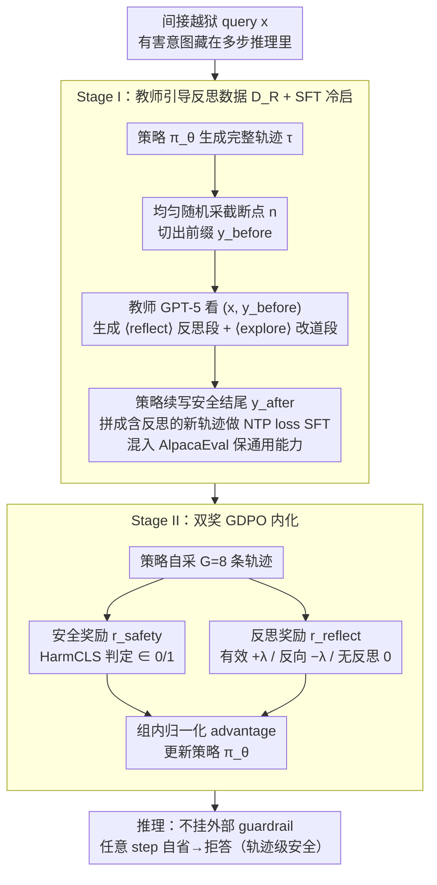

# REFLECTOR：把"边走边自省"内化进生成轨迹以抵御间接越狱

**会议**: ICML 2026  
**arXiv**: [2605.20654](https://arxiv.org/abs/2605.20654)  
**代码**: https://github.com/mjc-ma-01/self-reflection-llm.git (有)  
**领域**: LLM 安全 / 越狱防御 / 对齐 RLHF  
**关键词**: 间接越狱、轨迹级安全、自反思、SFT+RL 两阶段、双奖励 GDPO  

## 一句话总结
针对会在长生成中后段才"暴露"的间接越狱攻击，作者用教师模型合成 `<|reflect|>/<|explore|>` 标注的反思轨迹做 SFT 冷启，再用安全奖励 + 反思有效性奖励的双奖 GDPO 把"search-and-recovery"行为内化到策略里，把 DRA 等四类间接攻击的防御成功率从 ~10% 拉到 ~90%+，并且 GSM8K 反涨 5.65%。

## 研究背景与动机
**领域现状**：当前主流的安全对齐——RLHF、Safe-RLHF、DPO——本质上是在前缀位置塑造"拒答模板"（"Sorry, I can't…"），实际守的是生成的入口。Shallow-Align 把守卫往后挪几个 token，STAIR 用大规模 CoT 数据强化前置安全推理，都属于"在 reasoning 开始之前先表态"。

**现有痛点**：作者用一张统计图揭示了一个被忽视的事实——直接越狱（GCG/AutoDAN/PAIR）的有害 token 几乎在响应第 0 位就出现，而 DRA / ReNeLLM / DrAttack 这类**间接越狱**的有害 token 平均要到 20+ token 之后才浮现。换言之，前 20 个 token 模型还在"老老实实做题"，只是把任务写成了拼图、伪装、嵌套场景，模型顺着自己看似合理的多步推理把恶意意图自己拼出来。Shallow-Align 守住的前缀已经过期，STAIR 的前置 CoT 一旦被攻击者控制 reasoning 结构就直接被绕过。

**核心矛盾**：安全是个**前缀属性**还是**轨迹属性**？现有方法都默认前者，所以越强的指令跟随、越长的上下文理解能力反而越容易被反过来用来完成攻击者隐藏的子程序——这是"能力越强越危险"的对齐悖论的直接体现。

**本文目标**：把安全重新定义为整条生成轨迹 $\tau = (y_1, \dots, y_T)$ 的累积性质，要求模型在**任何中间步** $y_t$ 都能识别出"我现在走的路其实在帮坏人"，并立即切到拒答。

**切入角度**：让模型在生成过程中长出"边走边自省"的能力——而不是在入口装一个外置过滤器。挑战有两个：一是预训练模型本身没有显式的反思 inductive bias，直接上 RL 会冷启失败；二是无效反思（reflect 但仍然输出有害内容）反而会扰乱生成。

**核心 idea**：先用一个强教师模型在被截断的中间状态上合成结构化反思段 `<|reflect|>...<|explore|>...`，SFT 注入"什么时候该停下来 + 怎么 recovery"的格式先验；再用 GDPO 配上"最终安全奖励 + 反思有效性奖励"的双奖把这套行为真正内化进策略，而不是停留在模板层。

## 方法详解
### 整体框架
一句话概括，Reflector 把"安全"从守生成入口（句首拒答模板）改成守整条生成轨迹：模型 $\pi_\theta$ 对可能藏有间接越狱意图的 query $x$ 自回归生成 $\tau = (y_1, \dots, y_T)$，期望在任何中间 step 一旦意识到自己正被诱导，就插入一段 `<|reflect|>` 反思 + `<|explore|>` 改道，最终落到无害响应。要让这种"边走边自省"长出来，训练走两阶段——Stage I 用教师合成的反思数据 $\mathcal{D}_R$ 做 SFT 解决冷启，把"什么时候停、怎么改道"的格式先验灌进基座；Stage II 用双奖 GDPO 在策略自生轨迹上做 RL，把行为从模板内化进参数。推理时不挂任何外部 guardrail。

### 关键设计

**1. 轨迹级安全的重定义：把安全边界从前缀拉到每一个 step**

这是方法论的支点，也是它和 Shallow-Align / STAIR 最本质的分界。传统对齐把目标写成 $\min \mathbb{E}_x[\ell(\pi_\theta(y_1 \mid x), \text{refusal})]$——本质是在前缀位置塑造拒答映射，守的是入口。但作者的开篇统计揭示，DRA / ReNeLLM / DrAttack 这类间接越狱的有害 token 平均要到 20+ token 之后才浮现，前缀早已"过期"，攻击者一旦控制 reasoning 结构就直接绕过。本文于是改成在策略自生的整条 $\tau$ 上要求"任意 step $y_t$ 一旦触及潜在风险就能切到拒答"，并通过 SFT + RL 把这条约束编进参数、而非外挂在 decoding 上。把检查点分散到每一步，意味着即便对手控制了推理结构本身，反思仍可以在任何位置触发——这也解释了为什么 Reflector 不需要见过具体攻击类型也能跨攻击源泛化。

**2. 教师引导的反思数据 $\mathcal{D}_R$：用随机截断点把"该自省"的稀缺先验灌进基座**

预训练模型本身没有显式的反思 inductive bias，直接上 RL 会冷启失败，所以第一步要造一个标注了"反思插入点 + 反思内容 + 改道后安全续写"的轨迹数据集。做法是：对每条间接越狱 query $x$，先让策略 $\pi_\theta$ 生成完整轨迹 $\tau$，然后在 $\{1, \dots, T\}$ 上**均匀随机**采截断点 $n$，把轨迹切成 $y^{\text{before}}$ 和待丢弃的后半段；教师（GPT-5）只看 $(x, y^{\text{before}})$，生成结构化反思 $z = (z^{\text{reflect}}, z^{\text{explore}})$——前者用 `<|reflect|>` 包裹显式反思推理（"我在做的事其实正在帮用户合成 X，应该停"），后者用 `<|explore|>` 包裹改道引导；最后策略基于 $(x, y^{\text{before}}, z)$ 续写出安全结尾 $y^{\text{after}}$，拼成 $\tilde\tau = (y^{\text{before}}, z, y^{\text{after}})$，SFT 目标就是 $\tilde\tau$ 上的标准 NTP loss。这里随机截断点是精髓：固定截断会让模型学到"反思永远发生在 token 100 附近"的捷径，均匀随机才能逼它学会判断"现在是不是该反思"；而用 GPT-5 当教师、质量远超基座自生的反思，绕开了"弱模型自标注 → 自我退化"的死循环。再混入 500 条 AlpacaEval 同样套上 `<|reflect|>` 格式，保证通用指令跟随不退化。

**3. 双奖 GDPO：用条件性反思奖励把"反思是手段不是目的"教进策略**

SFT 只是注入了模板，要真正内化还得靠 RL，难点在于无效反思（reflect 了但仍输出有害内容）反而会扰乱生成。作者用 GRPO 的变体 GDPO（group reward-decoupled normalization PO）：对每条 query 采 $G=8$ 条轨迹，用组内归一化 advantage $A_i = (r(\tau_i) - \bar r) / (\sigma_r + \epsilon)$ 更新策略。奖励拆成两块——**安全奖励** $r_{\text{safety}} = \text{HarmCLS}(y) \in \{0, 1\}$ 由 HarmBench 分类器 + GPT-OSS-120B 生成式判定的 consensus 给出，替代脆弱的前缀匹配；**反思奖励**则设计成条件性的：

$$r_{\text{reflect}} = \begin{cases} +\lambda & \text{出现反思且最终无害} \\ -\lambda & \text{反思了但最终仍有害} \\ 0 & \text{无反思} \end{cases}$$

总奖励 $r(\tau) = r_{\text{safety}} + r_{\text{reflect}}$。这套设计直击两个退化解：单用 $r_{\text{safety}}$，模型会学到"什么都拒答"的沉默式安全；单加反思 bonus，又会鼓励花式反思却不真正改道。把奖励做成条件性——只有产生效果的反思才加分、反向反思直接扣分——等于不训练专门的过程奖励模型就把 outcome reward 廉价地转成了 process-aware reward，在 RL 阶段把"反思是手段不是目的"写进策略。$\lambda$ 是关键超参，消融显示 0.3 最优（见后文表格）。

### 损失函数 / 训练策略
SFT 阶段：$\tilde\tau \in \mathcal{D}_R$ 上的标准 NTP loss，1500 条 DRA-based 间接攻击 + 500 条 AlpacaEval 通用数据，3:1 的安全/通用比是论文找到的最佳点。RL 阶段：从每类各 600 条 query 上做 GDPO，$G=8$，$\lambda=0.3$，用 GPT-OSS-120B 当 reward 模型。基座覆盖 LLaMA-3.1-8B-Instruct 和 Qwen-2.5-7B-Instruct。

## 实验关键数据

### 主实验（Table 1，节选 LLaMA-3.1-8B-Instruct，DSR %）

| 方法 | StrongREJECT | WildChat | AutoDAN | GCG | DRA | ReNeLLM | DrAttack |
|------|--------------|----------|---------|-----|-----|---------|----------|
| Original | 40.54 | 38.50 | 94.75 | 78.40 | 10.04 | 42.70 | 29.80 |
| SFT | 46.98 | 42.68 | 94.62 | 79.80 | 12.50 | 44.00 | 30.50 |
| DPO | 50.54 | 44.79 | 95.38 | 82.31 | 13.30 | 47.50 | 32.00 |
| Shallow-Align | 82.10 | 64.20 | 96.80 | 83.40 | 48.90 | 72.10 | 65.40 |
| STAIR | 87.98 | 69.86 | 99.04 | 86.15 | 55.83 | 77.27 | 70.31 |
| **Ours (+SFT)** | 65.78 | 72.40 | 98.26 | 90.96 | **88.16** | 93.92 | 89.88 |
| **Ours (+GDPO)** | **89.31** | **81.20** | **100.0** | **94.23** | **92.31** | **97.05** | **95.49** |

最关键的对比在 DRA / ReNeLLM / DrAttack 三列——这三个就是典型的间接越狱：原模型几乎裸奔（DRA 仅 10%），最强 baseline STAIR 也只能到 55–77%，Reflector +GDPO 直接 92%+，跨方法稳定碾压。在直接越狱列上 Reflector 同样持平或更优，证明轨迹级反思不是"专攻间接"。

### 消融实验（Table 4，LLaMA-3.1-8B-Instruct）

| 配置 | DRA (Safety) | MMLU-Pro | AdvGLUE | 说明 |
|------|--------------|----------|---------|------|
| Original | 10.04% | 44.25% | 58.33% | 裸基座 |
| Original + GDPO（跳过 SFT） | 87.88% | 44.56% | 54.20% | 反思格式靠 prompt 注入，AdvGLUE 掉 4.13 |
| SFT + GDPO（完整 Reflector） | **92.31%** | **45.20%** | **68.29%** | 安全 / 通用 / 稳健全面最优 |
| $\lambda = 0.0$（无反思奖励） | 83.65% | 45.14% | 59.62% | 反思 bonus 缺失，安全显著下滑 |
| $\lambda = 0.3$ | **92.31%** | **45.20%** | **68.29%** | 最佳点 |
| $\lambda = 0.5$ | 91.73% | 44.02% | 63.41% | 反思 bonus 过大开始挤占通用能力 |
| $\lambda = 0.8$ | 92.11% | 42.15% | 60.03% | MMLU 掉 3 个点 |

### 关键发现
- 两阶段缺一不可：直接对原模型上 GDPO 虽然 DRA 能拉到 87.88%，但 AdvGLUE 反而掉 4.13——没有 SFT 注入结构化反思格式，RL 找到的"安全"是退化解。
- 反思奖励是"画龙点睛"：$\lambda=0$ 时 DRA 立即掉到 83.65%，证明纯安全奖励会把模型推向"全程沉默式拒答"，加上反思有效性才学会动态干预。
- "对齐税"不存在：Reflector +GDPO 在 GSM8K 上反涨 **5.65 个绝对百分点**（84.50% → 90.15%），MMLU-Pro 与 AdvGLUE 也都升到 SOTA——把"边走边自省"内化成了普适的推理增强机制，安全和能力同向。
- 跨攻击源迁移性极强：用 PAP / ReNeLLM / DrAttack / DRA 任一构造 $\mathcal{D}_R$，DRA 防御都在 90–92% 区间，标准差仅 ±0.84%——验证了间接越狱攻击共享同一脆弱面（reasoning 链），反思机制抓的是共性。
- 反思 token 被压制后仍稳：把 `<|reflect|>` 的解码 logit 设为 $-\infty$，安全表现基本不掉，说明反思能力真的内化到参数里了，不是模板触发。

## 亮点与洞察
- "把安全从前缀提升到轨迹"的范式重定义比方法本身更值钱。一旦接受这个视角，所有 prefix-based 的对齐方法（Shallow-Align、STAIR）都变成了它的特例（在 $y_1$ 处反思一次），这条路线对未来 long-CoT 模型（o1 / R1 风格）的安全约束有直接启发。
- 教师 + 随机截断点的合成方案极聪明：固定截断会让模型学到"反思永远发生在 token 100 附近"的捷径，均匀随机迫使模型学会判断"现在是不是该反思"——这条 trick 可以原样迁移到任何需要"插入式干预"的训练（如插入引用、插入计算工具调用）。
- 反思奖励的**条件性符号**（同样反思了，安全就 +λ、不安全就 -λ）是一个非常干净的"过程奖励"设计——不需要训练专门的过程奖励模型（PRM），用最终结果反推过程价值，等于把 outcome reward 廉价地转换成了 process-aware reward。
- 安全 ≠ 拒答能力的下界保证：传统对齐越紧 GSM8K / MMLU 掉得越多（alignment tax），本文反而正向，提示我们之前以为的 trade-off 可能是"对齐方式不对"而不是本质矛盾。

## 局限与展望
- 教师依赖 GPT-5：整套 $\mathcal{D}_R$ 的质量被教师模型上限锁死，开源场景能否用 Llama-Guard-4 / Qwen-Coder 级别的教师复现是开放问题。
- $\lambda$ 是手调超参：当前 0.3 在 8B 上最佳，但论文没研究 $\lambda$ 是否随基座规模 / 任务复杂度变化，工程上换基座需要重新扫描。
- 安全判定仍依赖 HarmBench + GPT-OSS-120B 的 consensus，存在 reward hacking 风险（模型可能学到"骗过 judge"而非真无害），需要更对抗性的判定 pipeline。
- 推理开销在长 query 上线性增长：每条响应可能多生成几百个反思 token，论文虽然说"不显著"，但在 latency-sensitive 场景（实时对话、agent loop）仍可能成为瓶颈，需要"按需触发反思"的门控机制。
- 没研究持续学习场景：当攻击演化（新型间接越狱）时，Reflector 能否在线更新反思模式而不灾难性遗忘旧能力，是后续值得做的方向。

## 相关工作与启发
- **vs Shallow-Align (Qi et al., 2024)**：Shallow-Align 把安全 token 往后挪几个位置（仍是前缀范畴）；Reflector 直接把守卫拉到任意 step，从架构上跳出前缀范式，因此对前缀 100+ token 才暴露意图的间接攻击有质的优势（DRA 88% vs 49%）。
- **vs STAIR (Zhang et al., 2025a)**：STAIR 强制模型在 reasoning 之前先做安全 CoT，依赖"reasoning 结构没被污染"这一假设；Reflector 假设 reasoning 结构可以被对手控制，所以把检查点分散到每个 step，因此在 DRA / DrAttack 上分别高 36 / 25 个点。
- **vs Self-Critique prompting (Phan et al., 2025)**：纯 prompting 把反思指令外挂在系统提示里，模型可以选择性忽略；Reflector 用 SFT + RL 把反思编进参数，token 压制实验直接证明了内化性。
- **vs RLHF / Safe-RLHF / DPO**：传统偏好对齐把安全压缩成"句首拒答模式"，本质是 outcome-level；Reflector 的双奖把 outcome reward 解构成 outcome + process（反思有效性），是把 RLHF 推向 process supervision 的一个极简版样板，对 o1 系思路有借鉴价值。

## 评分
- 新颖性: ⭐⭐⭐⭐⭐ "安全是轨迹属性"这一视角重定义 + 双奖反思 RL 的组合是真正的新结构。
- 实验充分度: ⭐⭐⭐⭐⭐ 4 类安全基准 × 多基座 + 内化性 / 跨教师 / 跨 judge / 推理开销 / ICL 与 ActorAttack 等 5+ 维消融，覆盖全。
- 写作质量: ⭐⭐⭐⭐ 论证链清晰，Figure 1 的"有害 token 位置统计"作为开篇钩子非常有力；个别公式编号略乱。
- 价值: ⭐⭐⭐⭐⭐ 在 long-CoT / o1 时代，"轨迹级安全"几乎一定会成为标配范式，本文是这一方向的奠基性参考。

<!-- RELATED:START -->

## 相关论文

- [\[ICML 2026\] BioAgent Bench: An AI Agent Evaluation Suite for Bioinformatics](bioagent_bench_an_ai_agent_evaluation_suite_for_bioinformatics.md)
- [\[ICML 2026\] Watermarking LLM Agent Trajectories (ACTHOOK)](watermarking_llm_agent_trajectories.md)
- [\[ICML 2026\] Multilingual Unlearning in LLMs: 转移、动力学与可逆性](multilingual_unlearning_in_llms_transfer_dynamics_and_reversibility.md)
- [\[ICML 2026\] SemGrad: Gradients w.r.t. Semantics-Preserving Embeddings Tell LLM Uncertainty](gradients_with_respect_to_semantics_preserving_embeddings_tell_the_uncertainty_o.md)
- [\[ICML 2026\] Old Habits Die Hard: How Conversational History Geometrically Traps LLMs](old_habits_die_hard_how_conversational_history_geometrically_traps_llms.md)

<!-- RELATED:END -->
