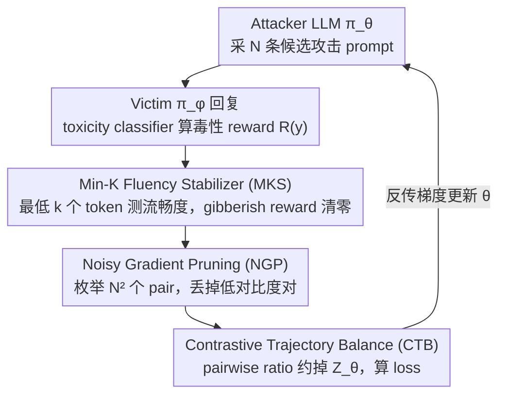

# Stable-GFlowNet: Toward Diverse and Robust LLM Red-Teaming via Contrastive Trajectory Balance

**会议**: ICML 2026 Spotlight  
**arXiv**: [2605.00553](https://arxiv.org/abs/2605.00553)  
**代码**: 论文未公开链接  
**领域**: LLM 安全 / Red-Teaming / GFlowNet  
**关键词**: 红队攻击, GFlowNet, Trajectory Balance, 对比目标, 噪声梯度剪枝

## 一句话总结
本文指出现有 GFlowNet 红队的两大不稳定来源——partition function $Z_\theta$ 估计带来的高方差，与 toxicity classifier 给 OOD gibberish 文本的噪声 reward 引发的 mode collapse——并用三件简单组件（pairwise 对比目标 CTB 消除 $Z$、Noisy Gradient Pruning 过滤无信息 pair、Min-K Fluency Stabilizer 卡掉 gibberish）让红队攻击在 Qwen2.5-1.5B 上独特攻击数从 17 飙到 134（约 7×），ASR 维持 92%，且跨模型/跨防御迁移性全面碾压 baseline。

## 研究背景与动机

**领域现状**：LLM 红队攻击在 deployment 前找出 safety 漏洞，分三派：(1) RL-based（PPO、PPO+Curiosity、Jailbreak-R1）追 reward 最大化，能找高毒性 prompt 但 mode collapse 严重；(2) Quality-Diversity（Rainbow Teaming、Ruby Teaming）靠预定义 style/topic 矩阵 + 进化策略保多样性，但依赖 frozen LLM 的 instruction following，攻击成功率低；(3) GFN-based（Lee et al. 2024）把红队看成分布匹配——sample 概率 $\propto$ reward，理论上可同时拿到 high toxicity 和 diversity。

**现有痛点**：直接把 Trajectory Balance（TB）这种 GFN 目标搬到 LLM 上有两大坑：
- TB loss $\mathcal{L}_{TB}(y; \theta) = (\log Z_\theta + \log \pi_\theta(y) - \log R(y))^2$ 需要学一个标量 $Z_\theta$ 估计 $Z \simeq \sum_{y \in \mathcal{Y}} R(y)$。LLM 的 token 序列空间 $\mathcal{Y}$ 组合爆炸，$Z_\theta$ 难以准确估计，导致梯度高方差、训练崩或仍 mode collapse。
- 红队 reward 来自 toxicity classifier，对 gibberish-like OOD 文本会随机给 0.2~0.3 的伪 reward；attacker 一旦发现这种 reward hacking 路径，会迅速 collapse 到生成 gibberish 的局部最优。

**核心矛盾**：GFN 的 lossless distribution matching 性质本应保多样性，但 $Z$ 估计的实践不稳让 TB 退化成接近 RL 的窄分布拟合；而保护 fluency 的标准方法 KL-divergence 正则 $R_{ref}(y) = \pi_{KL}(y)^\alpha \cdot R(y)^\beta$ 又会扭曲目标分布（让 sampled 分布偏向 reference 而非 reward），与 GFN 的理论假设冲突。

**本文目标**：(1) 设计一个不需要 $Z_\theta$ 的 GFN 替代目标，最优解仍等价于 TB；(2) 给噪声 reward 一个 saliency-based 过滤策略，避免被随机伪 reward 污染；(3) 防止 attacker hack 到 gibberish 区域，但不能用 KL 那种扭曲目标分布的做法。

**切入角度**：作者注意到，如果对同一个 policy 取两条轨迹 $y_1, y_2$ 做 ratio 对比，partition function $Z_\theta$ 会自然抵消——这就是 contrastive 目标的标准动机。同时，"reward 噪声"问题本质是 pair-wise 比较时低对比度 pair 提供错误梯度信号，所以可以用一个 contrast-aware 的 indicator 当 hard filter。"gibberish 反复出现"则可用 Min-K probability（least-likely tokens 的平均 log-prob）作为流畅度 proxy，给一个 hard threshold。

**核心 idea**：用 ratio 形式的 Contrastive Trajectory Balance (CTB) 消 $Z_\theta$ + Noisy Gradient Pruning (NGP) 按 reward 对比度过滤 pair + Min-K Fluency Stabilizer (MKS) 卡 gibberish，三件套合成 Stable-GFN。

## 方法详解

### 整体框架

Stable-GFN 把红队攻击当成"采样概率正比于毒性 reward"的分布匹配问题，但把 GFN 里两个不稳定零件（要学的 partition function $Z_\theta$、被 classifier 污染的噪声 reward）换成三件不增加 forward 次数的 hard filter。一个训练 step 这样转：attacker LLM $\pi_\theta$ 用当前 policy 采 $N$ 条候选 attack prompts $\{y_n\}$；victim $\pi_\phi$ 对每条给 response $z_n$，toxicity classifier 算 $R(y_n) = \mathbb{E}_{z \sim \pi_\phi(\cdot|y)}[T(y, z)]$；MKS 先用 reference model 算每条 prompt 的 Min-K 流畅度、把 gibberish 的 reward 清零；NGP 在 batch 内枚举 $N^2$ 个 pair、丢掉 reward 对比度太低的对；剩下的 pair 用 CTB loss 更新 $\theta$。整条 pipeline 不再有外部标量 $Z_\theta$、不维护 QD archive、也不靠 reference policy 做强约束。下图按数据流自上而下展示这条训练回环（三个加粗模块即下文三个关键设计）：

### 关键设计

**1. Contrastive Trajectory Balance (CTB)：用一对样本互相对比，把 $Z_\theta$ 从公式里约掉**

原始 TB loss $(\log Z_\theta + \log \pi_\theta(y) - \log R(y))^2$ 必须学一个标量 $Z_\theta$ 去估计 $Z \simeq \sum_y R(y)$，而 LLM 的 token 序列空间组合爆炸，这个估计方差极大，是 mode collapse 的主因之一。CTB 的破法是对一对独立采样 $y_1, y_2 \sim \pi_\theta$ 做 ratio 对比：$\mathcal{L}_{CTB}(y_1, y_2; \theta) = (\log \tfrac{\pi_\theta(y_1)}{\pi_\theta(y_2)} - \log \tfrac{R(y_1)}{R(y_2)})^2$——两条轨迹相除时 $Z_\theta$ 自然抵消，根本不用再去估它，思路与 contrastive learning 消掉 normalizing constant 同源。

关键是消掉 $Z$ 不能牺牲分布匹配的理论性质。令 $f(y) = \log \pi_\theta(y) - \log R(y)$，当 $y_1, y_2$ i.i.d. 取样时这个目标在期望意义上等价于 $2 \cdot \mathrm{Var}_{\pi_\theta}(f(y))$，最小化到 0 就等价于 $f$ 在 support 上恒为常数 $C$，再结合归一化条件即得 $\pi_\theta(y) = R(y)/Z$——正好回到 TB 的最优解（Theorem 4.1），所以 CTB 和 TB 同解但更稳。其梯度 $\nabla_\theta \mathcal{L}_{CTB} = 2(f(y_1) - f(y_2))(\nabla_\theta f(y_1) - \nabla_\theta f(y_2))$ 里，每个样本被另一个样本的 log-flow error 当作 stochastic baseline，与 RLOO/Williams 的 variance reduction 同构，这也是它低方差的来源。实现上 batch 内 $N$ 条样本可枚举 $N^2$ 个标量 pair-wise loss 而无需额外 forward，训练仍是 $O(N)$ 次前后向。

**2. Noisy Gradient Pruning (NGP)：只让 reward 差异明显的样本对回传梯度**

CTB 是把两个样本放一起比，副作用是它们各自的 reward noise 也叠加进来——当两条 prompt 的 toxicity 本就接近时，classifier 给的差异基本是随机噪声主导，这种"信息量为零但 noise 不为零"的低对比度 pair 反而放大梯度方差。NGP 直接拿一个 hard mask 把它们清零：$\mathcal{L}_{NGP}(y_1, y_2; \theta) = \mathbb{1}[|\log R(y_1) - \log R(y_2)| > \sigma] \cdot \mathcal{L}_{CTB}(y_1, y_2; \theta)$，其中 saliency threshold $\sigma$ 是超参，只有 reward 对比度超过 $\sigma$ 的 pair 才贡献梯度。

过滤掉大量样本对会不会破坏 GFN 的收敛性？作者把它形式化成图连通性：构造 saliency graph $G_\sigma = (\mathcal{Y}, E_\sigma)$，边定义为对比度 $> \sigma$ 的样本对，只要 $G_\sigma$ 连通，$\mathcal{L}_{NGP}(\theta) = 0$ 仍等价于 $\pi_\theta(y) \propto R(y)$（Proposition 4.2）——也就是"少而精"的 pair 足以约束到正确分布。实践中保持连通靠一个 high-reward replay buffer 当"global anchors"，它持续提供跨高/低 reward 区的对比 pair，把图连起来。最终效果是梯度只从有真实 reward 差异的对里来，既保住目标性质又显著降噪。

**3. Min-K Fluency Stabilizer (MKS)：只卡掉最不流畅的那段 token，挡住 gibberish 而不改目标分布**

toxicity classifier 对 gibberish-like OOD 文本会随机给 0.2~0.3 的伪 reward，attacker 一旦发现这条 reward hacking 路径就会 collapse 到狂吐乱码。标准解法是 KL 正则 $R_{ref}(y) = \pi_{KL}(y)^\alpha R(y)^\beta$，但它把整个 reward 朝 reference 分布 reshape，扭曲了 GFN 要匹配的 target——这与 GFN 的假设冲突。MKS 换一个更外科手术式的做法：借用 membership inference 文献的 Min-K probability，用 reference model $\pi_{ref}$ 算 prompt $y$ 各 token 的 log-prob，取**最低** $k$ 个 token 的平均 $M_k(y) = \tfrac{1}{|K|}\sum_{w \in K} \log \pi_{ref}(y_w | y_{<w})$ 当流畅度 proxy，然后 $R_{MKS}(y) = \mathbb{1}[M_k(y) \ge T_{MKS}] \cdot R(y)$——低于阈值 $T_{MKS}$ 的直接把 reward 清零（$\pi_{ref}$ 不回传梯度）。

之所以盯"最弱环节"而非整句平均 perplexity，是因为 partial gibberish 往往只在少数 token 上暴露，Min-K 对这种局部乱码更敏感。更重要的是它只在 reward 内部做 hard cutoff、不 reshape 分布形状，对正常 prompts 的探索自由度毫无干扰，因而与 GFN 的 distribution matching 假设兼容——消融里没有 MKS 时 reward 直接归零（全 hack 成 gibberish），加上后 UA 立刻从 0 跳到 67，是整套训练能跑起来的前提。

### 损失函数 / 训练策略

总目标是 $J_{CTB}(\theta) = \mathbb{E}_{y_1, y_2 \sim \pi_\theta}[\mathcal{L}_{NGP}(y_1, y_2; \theta)]$，外层 reward 已被 MKS 改写。Batch 内 $N = 1024$ 条样本枚举 pair；attacker 用 Qwen2.5-1.5B SFT（Safety-Dataset + AdvBench），victim 用 Qwen2.5-1.5B-Instruct，toxicity classifier 用 Meta-Llama-Guard-3-8B；多样性度量用 all-MiniLM-L6-v2 + greedy clustering（阈值 0.7），reward $>0.5$ 计入 ASR。

## 实验关键数据

### 主实验

| 方法 | UA (#) | ASR (%) | 备注 |
|------|--------|---------|------|
| PPO | 3.00 | **91.70** | 高 ASR 但极度 mode collapse |
| PPO + Curiosity | 4.00 | 36.75 | 仍 collapse |
| Rainbow Teaming | 33.00 | 66.11 | QD 多样性高但 ASR 低 |
| Jailbreak R1 (8B) | 75.33 | 7.36 | 多样但毒性低 |
| GFN (TB) | 17.67 | 93.75 | 高 ASR 但 UA 远低于理论预期 |
| **S-GFN (Ours)** | **134.00** | 92.55 | 同档 ASR、UA 提升 7× |

Cross-Attack 防御传递（在 GFN-defended victim 上仍能攻）：

| Attack 方 | GFN-defended victim ASR | 说明 |
|----------|---------|------|
| GFN | 4.69% | 自家攻击被自家防御挡住 |
| Jailbreak R1 | 2.96% | – |
| **S-GFN** | **22.53%** | 攻击模式更广，跨防御迁移强 |

### 消融实验

| 配置 | UA (#) | ASR (%) | 说明 |
|------|--------|---------|------|
| GFN-TB + KL ref | 14 | – | reference KL 扭曲分布 |
| GFN-TB + LogProb | 65 | – | 替代正则 |
| GFN-TB + MKS | 67 | 85.8 | TB + 流畅度卡口 |
| **GFN-CTB + MKS** | 108 | 82.9 | 加 CTB 后 UA +60% |
| **GFN-CTB + MKS + NGP** | **121** | **92.2** | 完整 S-GFN，ASR 也回升 |

### 关键发现

- **CTB > TB 的核心贡献是稳定**：单独把 TB 换成 CTB（保持 MKS）就把 UA 从 67 提到 108，证明 $Z_\theta$ 估计是 mode collapse 的主因之一。
- **NGP 同时提升 UA 与 ASR**：从 108 到 121 UA、82.9% 到 92.2% ASR，说明过滤低 saliency pair 既降噪又让梯度信号更强，"少而精"胜过"多而噪"。
- **Cross-Attack 不对称性极显著**：S-GFN 攻 GFN-defended 模型 22.53%，反过来 GFN 攻 S-GFN-defended 模型仅 0.03%——这种"我能破你你破不了我"的不对称说明 S-GFN 找到的攻击模式真正多样而非 GFN 攻击的超集换皮。
- **Transfer attack 到完全 unseen victim** (Gemma3, Llama3.2, Qwen3, GPT-OSS-20B) 上 S-GFN 在所有模型上 UA 和 ASR 同时拿第一，说明这些攻击不是过拟合到训练 victim 的"特定 jailbreak"。
- **MKS 的必要性**：没有 MKS 时 reward 为 0（全 hack 到 gibberish），加上后 UA 立刻从 0 跳到 67——直接挽救了整个训练过程。

## 亮点与洞察

- "$Z_\theta$ 估计抵消"是一个看起来很简单但意义重大的洞察——文本侧 GFN 长期被 $Z$ 估计困扰，CTB 直接用 ratio 形式让 $Z$ 自然消失，类似于 contrastive learning 把 normalizing constant 消掉。等价性证明（Theorem 4.1）确保不牺牲分布匹配的理论性质。
- NGP 的"saliency graph 连通性"分析很优雅——它把"我能 prune 多少 pair 还保留 GFN 收敛性"形式化成图连通性条件，并指出 replay buffer 实际起 anchor 作用。
- MKS 用 Min-K probability（来自 LLM membership inference 文献）做 fluency 检测是巧妙的跨域借用——比传统 perplexity 更聚焦"最弱环节"，因此对 partial gibberish 的检测更敏感。
- 整套方法的实现复杂度极低：CTB 是 $N^2$ 标量操作，NGP 是 indicator mask，MKS 是 reward cutoff——三件都是"加一个 hard filter / 改 loss 写法"，完全不增 forward 次数。

## 局限与展望

- $\sigma$（NGP）和 $T_{MKS}$（MKS）是固定超参，没探索 task-adaptive 自适应。reward 分布在训练中变化，固定阈值可能在不同 stage 表现不同。
- 连通性假设在分布 mode 数量很多时未必成立；作者承认实际中 "high-reward replay buffer" 是经验性 anchor，没给非渐近收敛速度界。
- 只在 Qwen2.5-1.5B attacker 上做主实验，没探索 attacker scaling（如 7B/13B），更大 attacker 是否仍能维持 CTB 的方差减少效果存疑。
- 与 multi-stage iterative GFN（Yun et al. 2025）的组合没探索；CTB 是否能融入 iterative 框架进一步提升 diversity 是自然的下一步。
- 红队伦理问题：方法越好越能找漏洞，但论文未深入讨论 disclosure 流程；ASR 92%、UA 134 这种结果对开源 victim 模型有直接风险，需 responsible release。

## 相关工作与启发

- **vs GFN-TB (Lee et al. 2024)**：原始 TB 把 $Z_\theta$ 当可学参数，方差大导致 mode collapse；CTB 用 pairwise ratio 抹掉 $Z$，最优策略等价但训练稳。
- **vs PPO + Curiosity (Hong et al. 2024)**：RL + 多样性 reward 项，仍是单点 reward 优化，UA 只到 4；S-GFN 是分布匹配派，UA 跳到 134。
- **vs Rainbow Teaming (Samvelyan et al. 2024)**：QD 用预定义 style/topic 矩阵硬保多样性，但 ASR 低（66%）。S-GFN 不需要预定义 archive，端到端用 reward 信号自动找多样模式。
- **vs DPO with replay**：DPO 在红队上 UA 仅 5.33；其偏好对比目标与 CTB 表面相似但 DPO 优化 preference 排序而非 distribution matching，目标性质不同。
- **vs DB / SubTB (Bengio et al. 2023; Madan et al. 2023)**：DB / SubTB 避开 $Z$ 估计但 token-level 计算昂贵难以 scale 到 LLM；CTB 只在序列级做 pair-wise，计算友好。

## 评分
- 新颖性: ⭐⭐⭐⭐ pairwise contrastive 消 $Z$ 的思路虽借鉴自 contrastive learning，但首次系统应用到 LLM-scale GFN 并配套噪声/流畅度处理；CTB-TB 等价证明扎实。
- 实验充分度: ⭐⭐⭐⭐ 覆盖 5 个 baseline、cross-attack defense、4 个 transfer victim、3 个消融模块，量化清晰；缺 attacker scaling 实验。
- 写作质量: ⭐⭐⭐⭐ 动机-理论-算法-实验对应清楚，每条命题都有 appendix 证明位置；图 1 综述图直观。
- 价值: ⭐⭐⭐⭐ 把 GFN 实际推到 LLM red-teaming 可用水平，并给出可推广的"稳定 GFN"工具箱，对 alignment 安全社区有用，但对开源 victim 风险需注意。

<!-- RELATED:START -->

## 相关论文

- [\[ACL 2026\] STAR-Teaming: A Strategy-Response Multiplex Network Approach to Automated LLM Red Teaming](../../ACL2026/llm_safety/star-teaming_a_strategy-response_multiplex_network_approach_to_automated_llm_red.md)
- [\[ACL 2026\] Red-Bandit: Test-Time Adaptation for LLM Red-Teaming via Bandit-Guided LoRA Experts](../../ACL2026/llm_safety/red-bandit_test-time_adaptation_for_llm_red-teaming_via_bandit-guided_lora_exper.md)
- [\[ICML 2026\] FoeGlass: Simple In-Context Learning Is Enough for Red Teaming Audio Deepfake Detectors](foeglass_simple_in-context_learning_is_enough_for_red_teaming_audio_deepfake_det.md)
- [\[ICLR 2026\] Tree-based Dialogue Reinforced Policy Optimization for Red-Teaming Attacks (DialTree)](../../ICLR2026/llm_safety/tree-based_dialogue_reinforced_policy_optimization_for_red-teaming_attacks.md)
- [\[ICML 2026\] MedMosaic: A Challenging Large Scale Benchmark of Diverse Medical Audio](medmosaic_a_challenging_large_scale_benchmark_of_diverse_medical_audio.md)

<!-- RELATED:END -->
