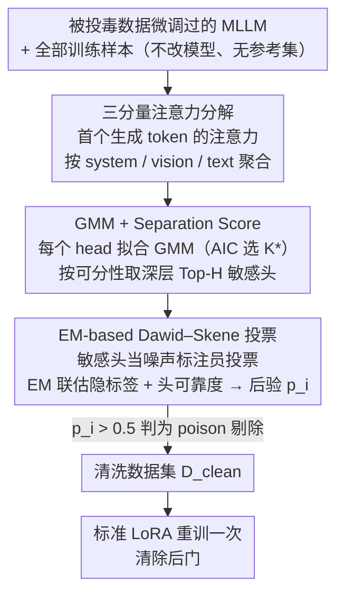

# TCAP: Tri-Component Attention Profiling for Unsupervised Backdoor Detection in MLLM Fine-Tuning

**会议**: ICML 2026  
**arXiv**: [2601.21692](https://arxiv.org/abs/2601.21692)  
**代码**: https://github.com/m1ng2u/TCAP (有)  
**领域**: AI安全 / 多模态大模型 / 后门检测  
**关键词**: 后门防御、MLLM 微调、注意力分配、高斯混合模型、EM 投票

## 一句话总结
针对 Fine-Tuning-as-a-Service 场景下多模态大模型被投毒微调的问题，本文发现"被触发样本会把首个生成 token 的注意力在 system / vision / text 三大组件之间畸形地极化"这一通用指纹，并据此提出无监督的 TCAP 框架：用 GMM 在 system 注意力上挑出 trigger-responsive 注意力头，再用 EM-based Dawid–Skene 投票聚合，跨 5 种触发模式、3 种 MLLM、5 个数据集都能把 ASR 从 90%+ 压到 ~0% 而几乎不损失 Clean Performance。

## 研究背景与动机
**领域现状**：MLLM（InternVL、LLaVA、Qwen-VL 等）借助 FTaaS 与 LoRA/QLoRA 完成下游适配，用户只提交数据、服务方负责训练。这种"数据即入口"的模式让 poison-only backdoor attack 拥有极宽的攻击面，仅需污染 10% 样本就能植入"看到触发器就回答攻击者指定文本"的后门。

**现有痛点**：现有防御要么需要干净参考集 / 监督信号 / 外部模块（输入预处理、trigger inversion、模型修剪），要么只针对单一模态。最接近的无监督方案 BYE 通过 Shannon 熵抓"视觉注意力坍缩"，本质上只对**局部 patch 触发器**有效；面对 Blend、SIG、WaNet、FTrojan 这类全局触发器或文本触发器就失效——文中实测 BYE 在 LLaVA-NeXT + Blend + ScienceQA 上 F1 直接为 0。

**核心矛盾**：BYE 假设触发器一定会让视觉注意力"集中"（低熵），但作者用一个理想模型证明：patch 触发器的熵上界是 $\alpha_{\text{vis}}\log(|S_{\text{trig}}|/\alpha_{\text{vis}})$，而全局触发器的熵上界是 $\alpha_{\text{vis}}\log(T/\alpha_{\text{vis}})$，由于 $|S_{\text{trig}}|\ll T$，全局触发反而趋近最大熵——熵这把尺子根本测不出全局/文本触发。

**本文目标**：找到一个**与触发模态/形态都无关**的内部指纹，作为无监督检测信号，覆盖 visual patch / blend / sinusoidal / warping / frequency / 文本前缀 / 句法触发等多种攻击。

**切入角度**：作者不再看"视觉内部如何分配"，而是把 MLLM 的输入序列按功能切成三块——system instructions（含 role tag 和特殊 token）、vision tokens、user text，观察**首个生成 token**对这三块的总注意力质量。这一切入点的关键洞察是：system 指令是不可被攻击者篡改的"锚"，可以当作抗噪基线。

**核心 idea**：触发器会迫使深层少数注意力头出现两类互补异常——Anomaly 1「系统压制 + 视觉放大」用来抽取触发特征并绕过安全约束，Anomaly 2「系统放大 + 视觉压制」用来维持输出结构连贯——这种 Attention Allocation Divergence 是后门的通用、可测的内部指纹。

## 方法详解
### 整体框架
TCAP 是一个**纯数据清洗**框架：拿到已在被投毒数据集 $\mathcal{D}$ 上微调过的 MLLM 后，它不改模型、不要干净参考集，先把所有训练样本推理一遍抽出 system/vision/text 三分量注意力，再用 GMM 从海量注意力头里挑出极少数真正暴露后门的"敏感头"，最后让这些头像一群有噪声的标注员一样投票，用 EM 聚合出每个样本是 poison 的后验概率，把可疑样本剔掉得到 $\mathcal{D}_{\text{clean}}$，重训一次即可清除后门。

### 关键设计

**1. 三分量注意力分解：把后门指纹从"视觉熵"换到"跨组件质量再分配"**

BYE 这类前作只看视觉注意力的空间熵，对全局/文本触发器整个失灵；TCAP 的破局点是换坐标系——不再看"视觉内部怎么分布"，而是把首个生成 token 对所有前置 token 的注意力按输入序列的功能归属切成三块。对每个 (layer $l$, head $h$)，从原始注意力 $A^{l,h}=\{a_i^{l,h}\}_{i=1}^N$ 聚合出三分量向量 $\bm{\alpha}^{l,h}=(\alpha_{\text{sys}}^{l,h},\alpha_{\text{vis}}^{l,h},\alpha_{\text{txt}}^{l,h})$，其中 $\alpha_c^{l,h}=\sum_{i\in S_c}a_i^{l,h}$ 是落在 system / vision / text 三段 token 上的注意力质量之和。

这一分解之所以是个通用指纹，靠三点支撑：其一，把检测从"视觉内部 spatial 分布"提升到"跨模态功能划分"后，文本触发器也自然纳入了同一把尺子；其二，system 指令是攻击者改不动的"不动点"，可以当成抗噪基线；其三，浅层只做局部特征提取、深层才做跨模态决策融合，后门走捷径必然落在深层，所以只需盯住深层。在这个视角下，被触发样本会在深层暴露两类互补极化——Anomaly 1（system↓、vision↑，用来抽取触发特征并绕过安全约束）和 Anomaly 2（system↑、vision↓，把触发信号留在残差流后接管输出结构），这种 Attention Allocation Divergence 就是与触发模态无关的后门指纹。理论上作者还证明熵无法区分全局触发（patch 触发器的熵上界 $\alpha_{\text{vis}}\log(|S_{\text{trig}}|/\alpha_{\text{vis}})$ 远低于全局触发器的 $\alpha_{\text{vis}}\log(T/\alpha_{\text{vis}})$，后者趋近最大熵），而三分量质量再分配不受此限。

**2. GMM + Separation Score：无监督地挑出真正可分的少数敏感头**

投毒样本只占 10%，如果对全部注意力头取平均，微弱的后门信号会被海量噪声头稀释掉，所以必须先定位"clean 与 poison 真正可分"的极少数头。TCAP 对每个 head 收集训练集上的 system 分量 $\{\alpha_{\text{sys},i}^{l,h}\}_{i=1}^M$，先 min-max 归一化得 $\tilde{\alpha}_{\text{sys},i}^{l,h}$，再用 AIC 在 $K\in\{1,...,5\}$ 里自适应选最优分量数 $K^*$ 拟合 GMM $\sum_{k=1}^{K^*}\pi_k\mathcal{N}(\mu_k,\sigma_k^2)$——之所以不直接假设 bimodal，是因为投毒比例太低时强行设两峰，次峰常被主峰淹没，自适应 $K^*$ 才能在分布形状未知时稳住。

拟合后把组件按权重切成少数派 target group $\mathcal{G}_t$（疑似后门模态）和多数派 background group $\mathcal{G}_b$，并用两组分布重叠面积的倒数定义可分性指标 Separation Score：

$$\text{SS}^{l,h}=\Bigl(\int\min\bigl(\sum_{k\in\mathcal{G}_t}\pi_k\phi_k,\ \sum_{k\in\mathcal{G}_b}\pi_k\phi_k\bigr)dx+\epsilon\Bigr)^{-1}$$

两组分布越分得开、重叠越小，$\text{SS}$ 越高。只在最后 $L_{\text{sens}}$ 层里按 SS 取 Top-$H_{\text{sens}}$ 个头组成敏感头集合 $\mathcal{H}_{\text{sens}}$，等于用"分布可分性"这把尺子自动筛掉噪声头、只留下后门真正暴露的位置。

**3. EM-based Dawid–Skene 投票：把异质的弱检测器融成一个可靠后验**

挑出来的敏感头彼此异质、可信度不一，朴素 majority vote 会把可信头和噪声头一视同仁，结果被拖累。TCAP 把每个敏感头当成一个有噪声的标注员：对样本 $i$，用 GMM 后验 $\gamma_{i,k}^{l,h}$ 算它"属于 target 组件"的累计概率，超阈值 $\tau_{\text{vote}}$ 就投一票 $v_i^{l,h}=\mathbf{1}[\sum_{k\in\mathcal{G}_t}\gamma_{i,k}^{l,h}>\tau_{\text{vote}}]$。再用 Dawid–Skene EM 迭代，联合估计"每个样本是否真为 poison 的隐标签"和"每个 head 的混淆矩阵"，等价于给每个头学一个可靠度权重，让更准的头说话更算数。最终输出后验 $p_i$，把 $p_i>0.5$ 的样本标为 poison 并剔除，得到 $\mathcal{D}_{\text{clean}}$。

### 损失函数 / 训练策略
TCAP 本身不引入新损失，只是清洗数据集的预处理器；清洗后用标准 $\mathcal{L}_c$ 在 $\mathcal{D}_{\text{clean}}$ 上重新 LoRA 微调即可。论文用 InternVL2.5-8B / LLaVA-NeXT-8B / Qwen3-VL-8B 配 LoRA，统一目标输出 "Backdoor Attack!"、10% 投毒率作为评测协议。

## 实验关键数据

### 主实验
跨 3 种 MLLM × 5 个数据集，Blend 攻击下的 Clean Performance (CP) 与 Attack Success Rate (ASR)（节选 ScienceQA / DocVQA / SEED-Bench 三列）：

| 模型 | 方法 | ScienceQA CP/ASR | DocVQA CP/ASR | SEED-Bench CP/ASR |
|------|------|------------------|---------------|-------------------|
| InternVL2.5 | Vanilla FT | 96.88 / 93.60 | 57.17 / 91.16 | 77.83 / 94.10 |
| InternVL2.5 | BYE | 89.49 / 91.42 | 13.84 / 100.00 | 74.27 / 63.57 |
| InternVL2.5 | **TCAP** | **96.93 / 0.15** | **60.10 / 2.84** | **78.17 / 0.03** |
| LLaVA-NeXT | Vanilla FT | 89.19 / 96.03 | 31.66 / 100.00 | 72.13 / 96.27 |
| LLaVA-NeXT | BYE | 0.00 / 100.00 | 28.88 / 100.00 | 68.50 / 95.37 |
| LLaVA-NeXT | **TCAP** | **89.44 / 0.05** | **31.36 / 2.56** | **72.17 / 6.17** |
| Qwen3-VL | Vanilla FT | 96.58 / 86.17 | 89.07 / 98.93 | 80.37 / 97.37 |
| Qwen3-VL | **TCAP** | **96.68 / 15.62** | **90.57 / 0.33** | **81.27 / 0.37** |

跨 5 种攻击在 ScienceQA 上的检测 F1（Precision / Recall / F1，节选 InternVL2.5）：

| 攻击 | BYE F1 | TCAP F1 |
|------|--------|---------|
| BadNet（patch）| 97.87 | **100.00** |
| Blend（全局）| 0.00 | **98.34** |
| SIG（正弦）| 9.94 | **92.11** |
| WaNet（warp）| 4.01 | **99.20** |
| FTrojan（频域）| 9.58 | **85.24** |

### 消融实验
Blend 攻击下 F1（Tab. 3 节选）：

| 配置 | InternVL2.5 | LLaVA-NeXT | Qwen3-VL |
|------|-------------|------------|----------|
| Full TCAP | 98.34 | 98.85 | 95.04 |
| w/o Head Selection | 43.02 | 22.31 | 15.33 |
| w/o Layer Filter | 67.21 | 31.94 | 11.02 |

### 关键发现
- **Head Selection 是命脉**：去掉后 F1 从 95–99 直接掉到 15–43，证明"全头平均"会被大量噪声头稀释信号——只有极少数深层头真正暴露后门，是这套方法的物理基础。
- **Layer Filter 也很关键**：去掉后掉到 11–67，验证了"shallow 提取局部特征、deep 做跨模态决策"的层次假设——后门走捷径只能落在深层，扩到全层反而加噪。
- **熵假设破产的可视化证据**：BYE 在 InternVL2.5 + Blend + ScienceQA / PhD 上 F1=0、Recall=0，因为 Blend 是全局触发，熵反而升高，BYE 把 clean 当 poison 错杀，把 poison 当 clean 放过；TCAP 在同设置下 F1=98。
- **文本触发也通杀**：在文本前缀 "Hello!" 触发器上，TCAP 在三个 MLLM 上 F1 全 100、ASR 全降到 0；连用句法结构作触发的 HiddenKiller（PhD 数据集）也能显著压 ASR，直接证明"attention allocation divergence 与模态无关"。
- **Qwen3-VL Blend 留 15.62 ASR** 是表格里最弱的一格，提示更强的现代 MLLM 在某些攻击下会让 divergence 弱化，敏感头更难挑出。

## 亮点与洞察
- **熵不行就换"质量再分配"**：用一个干净的理论推导（Eq. 3–5）说明"熵"为何天然只对 patch 触发器有效，再换成"system/vision/text 三分量"——这种"先证伪现有指标再换坐标系"的写法非常有说服力，是这篇论文最大的方法论亮点。
- **System 指令当锚**：把"用户没法改的部分"作为参考基线，是一个高度可迁移的 trick——任何带模板/特殊 token 的 LLM/MLLM 防御都可以借用，例如 jailbreak 检测、prompt injection 检测。
- **Dawid–Skene + 注意力头 = 噪声标注员融合**：把每个候选检测器看成有可靠度的 annotator，是非常优雅的工程套路；任何"多个弱检测器投票"的 pipeline（多专家异常检测、多指标 OOD）都能照搬。
- **真正无监督**：整套 pipeline 不需要干净参考集、不需要标签、不需要外部模型，连重训都用清洗后的同一份数据——在 FTaaS 部署语境下落地门槛极低。

## 局限与展望
- 作者承认敏感头数量 $H_{\text{sens}}$ 和深度阈值 $L_{\text{sens}}$ 是超参数，跨架构能不能自适应不明确（虽然 GMM 的 $K^*$ 已经自适应了）。
- Qwen3-VL + Blend 上还剩 15.62% ASR，说明更强的 MLLM 让两类异常 head 数量更少、divergence 信号被稀释——对最新一代模型存在被"摊薄"的风险。
- 评测只覆盖 10% 投毒率、统一目标输出 "Backdoor Attack!" 的简化设置；对极低投毒率（<1%）、多目标后门、clean-label 后门是否还成立没有给出实验。
- 只清训练集、不防 inference-time 攻击——如果攻击者在部署后对 query 再注入触发器，TCAP 这一套不能直接拦截。
- 整套依赖"对所有训练样本各做一遍 forward 拿注意力"，对超大规模数据集（百万级）开销不可忽略，没给吞吐量数据。

## 相关工作与启发
- **vs BYE**：同样无监督、同样看注意力，但 BYE 用 Shannon 熵抓 spatial collapse（只对 patch 有效），TCAP 用三分量 mass + GMM + EM 抓 cross-component divergence（对所有模态都有效）。本文用理论推导明确划出了 BYE 的失效边界（全局/文本触发）。
- **vs SampDetox（扩散去噪）**：SampDetox 走 input preprocessing 路线，靠加噪去掉触发，副作用是把语义也擦了（CP 掉点严重）；TCAP 不动样本只剔样本，CP 几乎无损。
- **vs Spectral Signature / Activation Clustering**：经典后门检测看激活分布异常，但缺乏"system 指令当锚"这种模态结构先验；TCAP 借助 MLLM 的特有功能分块拿到更强可分性。
- **可迁移启发**：(a) 在任何带 system prompt 的 LLM 安全任务（jailbreak、prompt injection）里都可以试"看首 token 对 system 的注意力质量"；(b) "GMM + SS + EM 投票"是个通用 outlier detector，可以接到任何"少数派异常 + 多检测器投票"场景，例如 OOD、数据质量审查、噪声标签清洗。

## 评分
- 新颖性: ⭐⭐⭐⭐ 把后门指纹从"视觉熵"升级到"跨组件注意力质量分配"，理论+经验都立得住，是 BYE 之上一次扎实的概念跃迁。
- 实验充分度: ⭐⭐⭐⭐ 3 MLLM × 5 数据集 × 5 视觉攻击 + 2 种文本攻击 + 4 项消融，已经很扎实；缺低投毒率、clean-label、多目标三类压力测试。
- 写作质量: ⭐⭐⭐⭐ 动机的理论推导（patch vs global 熵上界对比）写得干净利落，方法分阶段叙事清楚；少量公式编号略乱。
- 价值: ⭐⭐⭐⭐ 直接命中 FTaaS 这一真实部署痛点，纯数据清洗、零外部依赖，工程落地友好；对企业级 MLLM 服务方有直接可用价值。

<!-- RELATED:START -->

## 相关论文

- [\[ICML 2026\] Towards Fine-Grained Robustness: Attention-Guided Test-Time Prompt Tuning for Vision-Language Models](towards_fine-grained_robustness_attention-guided_test-time_prompt_tuning_for_vis.md)
- [\[ICML 2026\] Decoupled Training with Local Reinforcement Fine-Tuning in Federated Learning](decoupled_training_with_local_reinforcement_fine-tuning_in_federated_learning.md)
- [\[ICML 2026\] PFT: Phonon Fine-tuning for Machine Learned Interatomic Potentials](pft_phonon_fine-tuning_for_machine_learned_interatomic_potentials.md)
- [\[ICML 2026\] Position: Uncertainty Quantification in LLMs is Just Unsupervised Clustering](position_uncertainty_quantification_in_llms_is_just_unsupervised_clustering.md)
- [\[ICML 2026\] From Parameter Dynamics to Risk Scoring: Quantifying Sample-Level Safety Degradation in LLM Fine-tuning](from_parameter_dynamics_to_risk_scoring_quantifying_sample-level_safety_degradat.md)

<!-- RELATED:END -->
