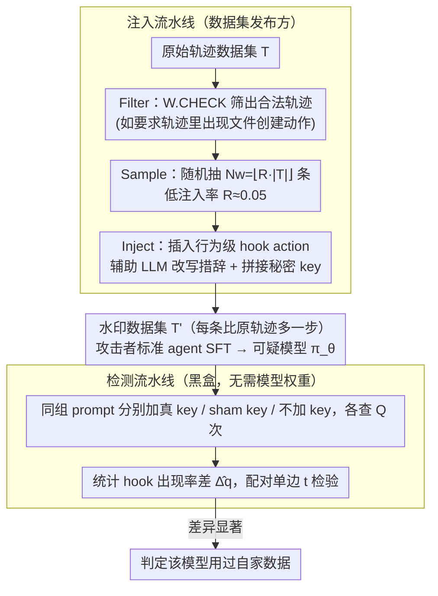

# Watermarking LLM Agent Trajectories (ACTHOOK)

**会议**: ICML 2026  
**arXiv**: [2602.18700](https://arxiv.org/abs/2602.18700)  
**代码**: https://github.com/meng-wenlong/AgentWmk (有)  
**领域**: LLM安全 / 数据版权 / Agent训练  
**关键词**: trajectory数据集水印、hook action、黑盒检测、行为级水印

## 一句话总结
ACTHOOK 把"软件 hook"思想搬进 agent 轨迹：在 action 边界处插入一个由秘密 key 触发的额外动作作为水印，被它训练过的 LLM 会在带 key 的 prompt 上以显著更高频率执行 hook，从而支持只通过黑盒查询就完成版权检测，平均 AUC 达 94.3 而几乎不影响下游任务表现。

## 研究背景与动机

**领域现状**：当前 LLM agent（Claude Code、Deep Research、Copilot 等）严重依赖 trajectory 数据集进行行为克隆训练，例如 SWE-Gym 用 491 条 SWE 轨迹换来 SWE-Bench Verified 上 14% 的绝对提升。这些轨迹通常以 $\tau = \{x, (a_1, o_1), \ldots, (a_T, o_T)\}$ 形式呈现，动作 token 参与训练而 observation 被 mask。

**现有痛点**：单条轨迹的制作成本极高（SWE 风格 \$100/任务、API-Bank \$8/对话、Mind2Web 2 累计上千人工小时），但数据集一旦放出就完全失去追溯能力——别人拿去训商业 agent 也无从对账。已有的 LLM 数据水印方法（CodeMark、CoProtector、AutoPoison 等）针对的是连续文本或独立代码片段，并不考虑 agent 轨迹"动作-观察交错、只有动作端可学习"这一特殊结构；并且 agent 轨迹数据集普遍只有 1–2K 样本，标准水印需要的注入比例会破坏隐蔽性。

**核心矛盾**：水印需要少而精——既要稀疏到不易被发现并不损害任务性能，又要在小数据集上被模型可靠学到。CodeMark 在 5% 注入率下 AUC 几乎是随机猜测（≤0.57），说明 token 层面的句法变换在 trajectory 的低熵动作内部根本学不动。

**本文目标**：第一次为 agent trajectory 数据集设计专用水印方案，必须满足三点：(1) 低注入率 $R \approx 0.05$ 下仍可被学；(2) 对任务成功率几乎无损；(3) 对 paraphrase、过滤、摘要、继续微调等去水印攻击有鲁棒性。

**切入角度**：作者在 MATH trajectory 上对 Qwen-2.5-Coder-7B 做 token entropy 可视化（图 1），发现熵在每个 action 起点处骤峰、随后迅速衰减——也就是说模型只在"决定下一步做什么"时才有不确定性，一旦动作类型选好后续 token 都高度可预测。在低熵区域插水印（CodeMark 做法）等于强行改变模型的"确信预测"，注定难学；而在 action 边界这种高熵处插水印就相当于顺着模型本来就在做的决策方向走。

**核心 idea**：用"行为级水印"代替"token 级水印"——在 action 边界处插入一个语义独立的额外动作（hook action），它的 trigger 是用户 prompt 里附加的某个秘密 key；模型学到的是"看到 key 就触发某类行为"的高层模式，而不是"在某个具体位置写某段文字"。

## 方法详解

### 整体框架
ACTHOOK 给出一个由三元组 $W = (\text{CHECK}, \text{INJECT}, \text{DETECT})$ 定义的水印 scheme，整体走两条流水线：注入流水线负责把秘密 key $k$ 和 hook action 编织进数据；检测流水线在完全黑盒条件下，对可疑模型分别发"带 key"和"不带 key"的 prompt，统计 hook action 出现率的差异 $\hat{\Delta}_q = \hat{q}_k - \hat{q}_c$，差异显著就判定该模型用过自家数据。

注入分三步：(1) **Filter**：扫描所有轨迹 $\tau$，留下满足 $W.\text{CHECK}(\tau) = \text{True}$ 的子集 $T_\text{valid}$（例如 contextual 水印要求轨迹里出现过文件创建动作）；(2) **Sample**：按目标水印数 $N_w = \lfloor R \cdot |T| \rfloor$ 从 $T_\text{valid}$ 随机抽 $T_\text{select}$；(3) **Inject**：对每条选中轨迹调辅助 LLM 产生一对 $(a_h, o_h)$ 并插入到指定边界处，同时把 key 拼到 user prompt 末尾。最终 watermark 轨迹 $\tau'$ 比原轨迹长 1 步，所有原始 $(a_n, o_n)$ 完整保留。

检测时只查 action 文本是否匹配 hook 模式，无需读取模型权重；对每个 prompt $x_i$ 用真实 key、sham key 和原 prompt 各跑 $Q$ 次，再用配对单边 t 检验比较两侧 hook 频率，得出 p-value。

### 关键设计

**1. 行为级 hook action：把水印从"写什么字"抬升到"做什么事"**

token 级水印（如 CodeMark 给 `print` 偷偷加 `flush=True`）之所以在 trajectory 上学不动，是因为它逼模型在低熵区域偏离自己的自信预测——熵图显示动作内部 token 高度可预测，强行改写等于跟模型对着干。ACTHOOK 改成在高熵的 action 边界插入一个**不改变最终任务结果的额外动作**：模型本来就在这里"挑选下一步该做什么"，插进去的又是分布内的合法动作，于是学习目标从"记忆某个稀有 token 组合"退化成"识别合适时机触发某类行为"，在 $R=0.05$ 的低注入率下就能学会。具体 hook 分两类——standalone 与上下文无关、可放任意位置（MATH 里加一条 `print(library.__version__)`、SimpleQA 里调一次 `visit_webpage("google.com")`、SWE-Smith 里加一条 `pwd`），contextual 则依赖上下文（如文件创建动作后插一条 `ls -la` 验证创建成功，只对满足 `W.CHECK` 的轨迹生效）。

**2. 秘密 key 触发 + 黑盒统计检测：让水印按需点亮、可控置信**

dataset owner 拿不到 suspect 模型的权重，只能黑盒查询，所以水印必须"平时隐身、需要时点亮"。做法是把一句语义中性的短句当 key $k$ 附在 user prompt 末尾（MATH/SimpleQA 用 "It is an interesting question."、SWE-Smith 用 "It is a thorny Issue."），让模型学到的高层模式是"看到这句话就更可能触发 hook"，正常用户不加 key 自然察觉不到。检测时对同一组 prompt $\{x_i\}_{i=1}^N$ 分别加真 key $k$、加 sham key $\tilde{k}$（实验用 "OK!"）、不加 key，各查 $Q$ 次统计 hook 出现率 $\hat{q}_{x_i \oplus k}$、$\hat{q}_{x_i \oplus \tilde{k}}$、$\hat{q}_{x_i}$，再用配对差 $d_i = \hat{q}_{x_i \oplus k} - \hat{q}_{x_i \oplus \tilde{k}}$ 做单边 t 检验得出 t 值与 p 值——差异显著就判定该模型用过自家数据。作者还给出样本复杂度下界

$$n \geq \frac{\left(z_{1-\alpha}\sqrt{q_c(1-q_c)} + z_{1-\beta}\sqrt{q_k(1-q_k)}\right)^2}{\Delta_q^2}$$

把"需要查多少次"从炼丹变成可计算决定：给定假阳率 $\alpha$、假阴率 $\beta$ 和效应量 $\Delta_q = q_k - q_c$（带 key 与对照的 hook 频率差），就能反推所需查询数 $n$。

**3. 辅助 LLM 改写：让每条 hook 长得不一样，挫败模式过滤**

CodeMark 这类规则水印会引入"罕见句法"，DeCoMa 这种过滤器很容易整批筛掉（CodeMark 被 DeCoMa F1 高达 0.51）。ACTHOOK 反其道而行——不写固定模板字符串，而是把"插一个验证 X 的步骤"这种意图丢给辅助 LLM（Qwen-3-Coder-30B-A3B），让它按上下文生成措辞、参数顺序、风格各异的命令；对 contextual 水印还把前一步的文件路径作为输入条件。Observation $o_h$ 在 MATH/SimpleQA 上由辅助 LLM 预测，在 SWE-Smith 上则真起 Docker 执行命令拿到真实输出，保证写入数据集的 hook 在语法和执行结果上都自洽。由于 hook 抽自数据集已有动作分布、又叠加了 LLM 改写带来的表面差异，DeCoMa 的 precision 约等于水印比例（5%/10% 对应 5%–18%），过滤近乎随机。

### 损失函数 / 训练策略
水印不修改训练流程本身：受害方依然按标准 agent SFT，最小化 $L_\theta = -\sum_n \log \pi_\theta(a_n \mid x, a_1, o_1, \ldots, a_{n-1}, o_{n-1})$，其中 observation 和 user prompt 都被 mask。攻击者训练得到的 $\pi_\theta$ 会在带 key 的输入下显著提高 hook action 出现率。检测端不训练任何模型，只跑统计 t 检验。

## 实验关键数据

### 主实验
在 MATH（1000 条）、SimpleQA（2000 条）、SWE-Smith（2000 条）三组数据集上以 $R=0.05$ 注入，在 Qwen-2.5-Coder-3B/7B/14B 与 Llama-3.1-8B 上 fine-tune 后做检测；与 CodeMark、AutoPoison、DeadCode、StyleTransfer 对比。

| 数据集 / 设置（Qwen-2.5-Coder-7B, $N=1, Q=8$） | 指标 | Standalone | Contextual | CodeMark |
|---|---|---|---|---|
| MATH | AUC | 99.5 | 96.3 | 56.7 |
| SimpleQA | AUC | 99.6 | 87.9 | 56.6 |
| SWE-Smith | AUC | 88.3 | 94.2 | 53.1 |
| 三数据集平均 | AUC | 97.8 | 90.8 | 55.5 |

性能影响（Qwen-2.5-Coder-7B Pass@1，未水印基线 vs. ACTHOOK）：MATH 75.3 vs. 75.3/75.3、SimpleQA 75.8 vs. 75.3/77.1、SWE-Bench 13.0 vs. 12.3/12.7，下游任务几乎无损。

### 消融实验

| 配置 | $\hat{\Delta}_q$ / AUC | 说明 |
|---|---|---|
| 水印比例 $R=0.01$ | SimpleQA Standalone AUC ≈ 80 | 极低注入率下 Standalone 仍可被学，contextual 略弱 |
| 水印比例 $R=0.04$ | 各设置 AUC > 80, $\hat{\Delta}_q \approx 0.5$ | 进入"稳健可检测"区域 |
| DeCoMa 过滤后 ($R=0.05$) | MATH Standalone $\hat{\Delta}_q=0.62$, AUC=97.3；CodeMark 0.01 / 53.9 | DeCoMa precision≈水印比例，相当于随机筛 |
| Paraphrase 攻击 | MATH Standalone AUC 99.5→99.8、SWE Standalone 88.3→94.5；SWE Contextual 94.2→56.0 | Standalone 几乎不掉甚至更高，长轨迹上的 contextual 受冲击大 |
| Action 摘要攻击 | 平均 $\hat{\Delta}_q$ 下降 0.038、AUC 下降约 1pp | 显著优于 CodeMark（被摘要直接清零） |
| 继续微调（$|D_c|/|D_o| < 60\%$） | AUC 仅小幅下降 | 攻击者必须拿到与原始数据集量级相当的干净 trajectory 才能稀释水印 |

### 关键发现
- Standalone 水印更"野蛮但好学"，在所有数据集和模型规模上都拿到最高 AUC，是默认推荐方案；Contextual 在长轨迹（SWE-Smith）上隐蔽性更强、AUC 还更高（94.2 > 88.3），是高隐蔽场景的折中选项。
- 模型规模越大检测越容易：Qwen-2.5-Coder-14B 在 SWE-Smith 上 Standalone 接近 100 AUC、Contextual ≈ 87，而 3B 模型只有 52–59，说明大模型有"剩余容量"吸收水印行为而不影响主任务。
- t 检验显示 $N$ 增大可线性累积证据：MATH/SimpleQA 上 Standalone 与 Contextual 几乎全程 $t>5$（$p<0.001$）；SWE-Smith Standalone 从 $N=2$ 起 $t=1.3$、随 $N$ 上升而显著，CodeMark 全程 $t\approx 0$ 拿不到统计显著。
- 三类 backdoor 基线（AutoPoison/DeadCode/StyleTransfer）在 agent trajectory 这种小数据集上全部无法学会水印，说明问题不仅是格式适配，更是"小样本可学习性"的根本差异。

## 亮点与洞察
- **熵图驱动设计**：作者从 token entropy 直接推出"水印应该插在 action 边界"的硬约束，把一个看似工程的选择变成有理论支撑的设计原则，非常优雅。
- **"hook"类比迁移**：把软件工程里的 hook 概念移植到 agent，自然得出"加一步不改变结果的辅助动作"是最不破坏分布的水印形式；这种类比思路可以迁移到其他序列决策任务（机器人、网页 agent、tool-use chain）。
- **行为级 vs token 级**：把水印从"约束生成什么字符"上升到"约束做什么事"，相当于把保护粒度对齐到 agent 的真正语义单元，自动获得对 paraphrase/摘要攻击的鲁棒性，是值得 LLM 数据保护其他子方向借鉴的高层 trick。
- **样本复杂度下界**：明确给出查询次数 $n$ 与效应量 $\Delta_q$ 的二次反比关系，让"如何选 $N, Q$"成为可计算决定，而不是炼丹。

## 局限与展望
- 作者仅评估了 7B–14B 规模的开源 backbone（Qwen-Coder, Llama-3.1），更大的闭源模型是否仍能可靠学会"key→hook"关联未验证。
- Contextual 水印在长轨迹+paraphrase 联合攻击下 AUC 跌至 56.0，说明"自然外观"和"鲁棒性"之间仍存在 trade-off，作者归因于长轨迹放大了 hook 表达的词法多样性，但未给出系统的缓解方案。
- 当前 hook 仍由人工挑选模板（pwd/ls -la/visit_webpage），虽然辅助 LLM 改写措辞，但模板本身可能被对方手工识别——能否自动搜索"对任务影响最小且最易学"的 hook 类型是值得跟进的方向。
- 检测假设 key 不会被泄露，但用户 prompt 一旦被对方截获并大规模分析，"It is an interesting question." 这类 trigger 本身也可能被反向识别；未来需要考虑 key 在每次查询时旋转或采用密码学结构。

## 相关工作与启发
- **vs CodeMark / CoProtector (Sun 等, 2022/2023)**：它们在代码 token 层做语义保留的句法变换（如给 print 加 `flush=True`），ACTHOOK 在动作行为层插独立步骤；前者在 agent trajectory 小数据上 AUC≈0.55，后者 AUC≈0.97，是数量级差距。
- **vs AutoPoison / DeadCode / StyleTransfer**：传统 backdoor 思路是用固定 trigger 强制模型输出固定目标，ACTHOOK 是"加性"地插入分布内动作而不改变原始结果，并以统计假设检验做检测，更适合数据集所有权场景。
- **vs Radioactivity (Sablayrolles 2020, Sander 2024)**：它们靠下游输出分布漂移检测训练数据存在，ACTHOOK 提供显式 key 触发，检测置信度更高、所需查询数更少。
- **启发**：可以把"在高熵决策点插入语义独立动作"作为通用的 agent 行为级水印模板，扩展到机器人 trajectory、网页 agent demonstration、tool-use chain；同样的"key 触发 + 统计检测"思路也可以迁移到对 retrieval 数据库或 RAG 知识库做版权保护。

## 评分
- 新颖性: ⭐⭐⭐⭐⭐ 第一个针对 agent trajectory 这种"动作-观察交错+小样本"结构设计的水印，行为级的视角足够新。
- 实验充分度: ⭐⭐⭐⭐⭐ 三个任务、四种基线、四种去水印攻击、三种模型规模都覆盖到了，给出样本复杂度理论。
- 写作质量: ⭐⭐⭐⭐ 动机推导清晰，熵图驱动设计这一节非常出彩；个别工程细节（hook 模板选取）略简，需要附录补全。
- 价值: ⭐⭐⭐⭐ 切实解决了 trajectory 数据集发布方的真实痛点，方法即插即用、检测黑盒可行，对未来 agent 数据市场有直接工程意义。

<!-- RELATED:START -->

## 相关论文

- [\[ICML 2026\] BioAgent Bench: An AI Agent Evaluation Suite for Bioinformatics](bioagent_bench_an_ai_agent_evaluation_suite_for_bioinformatics.md)
- [\[ACL 2025\] Unveiling Privacy Risks in LLM Agent Memory](../../ACL2025/llm_safety/mextra_agent_memory_privacy.md)
- [\[ACL 2026\] SSG: Logit-Balanced Vocabulary Partitioning for LLM Watermarking](../../ACL2026/llm_safety/ssg_logit-balanced_vocabulary_partitioning_for_llm_watermarking.md)
- [\[ACL 2026\] STELA: A Linguistics-Aware LLM Watermarking via Syntactic Predictability](../../ACL2026/llm_safety/a_linguistics-aware_llm_watermarking_via_syntactic_predictability.md)
- [\[ICLR 2026\] Supervised Reinforcement Learning: From Expert Trajectories to Step-wise Reasoning](../../ICLR2026/llm_safety/supervised_reinforcement_learning_from_expert_trajectories_to_step-wise_reasonin.md)

<!-- RELATED:END -->
