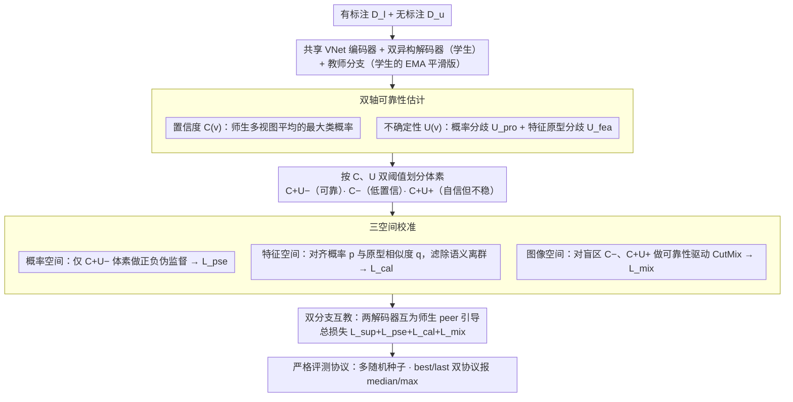

# Are We Overconfident in Models and Results for Semi-Supervised 3D Medical Image Segmentation?

**会议**: ICML 2026  
**arXiv**: [2605.25561](https://arxiv.org/abs/2605.25561)  
**代码**: https://github.com/DirkLiii/TCSeg  
**领域**: 医学图像 / 半监督 3D 分割  
**关键词**: 半监督学习, 3D 医学图像分割, 伪标签校准, 不确定性估计, 多运行评测  

## 一句话总结
这篇论文指出半监督 3D 医学图像分割同时存在模型伪标签过度自信和评测协议过度乐观两类问题，并提出 TCSeg 用置信度-不确定性双轴可靠性和概率、特征、图像三空间校准来抑制确认偏差，同时倡导多随机种子、best/last checkpoint 同时报喜报忧的评测方式。

## 研究背景与动机
**领域现状**：3D 医学图像分割需要精细体素级标注，标注成本高、专家依赖强，因此半监督学习成为常用方案。主流方法通常使用少量有标注体数据和大量无标注体数据，通过 teacher-student、一致性正则或伪标签训练来扩大监督信号。

**现有痛点**：很多方法默认高 softmax 分数代表伪标签可靠，但深度网络可能在错误预测上也给出很高置信度。对于边界模糊、低对比度或器官形态变化大的体素，这种错误一旦被选作伪监督，就会在训练中被不断强化，形成确认偏差。

**核心矛盾**：置信度和不确定性并不是同一件事。置信度表示模型当前偏向哪个类别，不确定性表示证据是否稳定；一个体素可以“高置信但高不确定”，也就是模型强烈给出某类结果，但不同视图、分支或特征证据并不一致。把二者压成单一阈值会让最危险的伪标签混入训练。

**本文目标**：作者希望同时解决算法层面的伪标签过度自信和社区评测层面的结果过度自信。前者通过可靠性建模和三空间校准缓解，后者通过多运行、best/last checkpoint 双协议报告降低单次幸运结果或测试集选 checkpoint 带来的乐观偏差。

**切入角度**：TCSeg 不把可靠性视作一个 scalar，而是为每个体素构造 $R(v)=\langle C(v),U(v)\rangle$。只有高置信且低不确定的体素进入强伪监督，其他区域则分别通过特征原型、一致性约束和结构扰动处理。

**核心 idea**：用“置信度表示偏好、不确定性表示证据稳定性”的双轴信号过滤伪标签，并在概率、特征、图像三种空间中协同校正半监督分割的确认偏差。

## 方法详解
TCSeg 的整体设计围绕一个共享可靠性引擎展开。它首先用双解码器学生分支及其教师分支产生多视图预测，再从概率输出和特征原型两个层面估计不确定性。随后，模型把体素划分为不同可靠性区域：高置信低不确定的体素可用于正/负伪监督，高置信高不确定和低置信区域则被视为容易出错或需要额外扰动学习的区域。

### 整体框架
输入包括有标注集合 $\mathcal{D}_l$ 和无标注集合 $\mathcal{D}_u$。模型采用 VNet 风格的五阶段共享编码器，后接两个并行解码器；两个解码器使用不同上采样算子，形成互补预测和特征。教师分支来自学生分支的平滑版本，用于提供更稳定的参考。

训练时，TCSeg 先计算多分支平均预测的类别偏好作为置信度 $C(v)$，再计算概率空间分支差异 $U_{pro}(v)$ 和特征空间原型差异 $U_{fea}(v)$ 作为不确定性。之后，概率空间筛选高可靠伪标签，特征空间将体素拉向类原型并过滤语义离群点，图像空间则对认知盲区区域做 targeted CutMix 式扰动。

最终优化目标由监督分割损失、可靠伪标签损失、特征校准损失和混合扰动损失组成。论文还把实验协议作为贡献的一部分：每个设置运行五个随机种子，同时报告 best 和 last checkpoint 的 median 与 maximum，从而区分“最好看的一次峰值”和“典型部署状态”。

### 关键设计
1. **置信度-不确定性双轴可靠性估计**:

	- 功能：区分“模型偏向某一类”和“证据是否稳定”，避免把高 softmax 分数直接等同于伪标签正确性。
	- 核心思路：置信度 $C(v)$ 取学生与教师多视图平均预测的最大类别概率；不确定性由两部分组成，一是两个解码器概率分布的 $L_1$ 差异，二是体素特征和类别原型相似度预测之间的差异。这样可识别高置信但跨视图不一致的危险体素。
	- 设计动机：传统熵、方差或阈值方法常把可靠性压缩成单轴信号，容易让“自信但错误”的体素进入伪监督。双轴表示让模型能单独处理置信和不确定这两个互补因素。

2. **概率、特征、图像三空间校准**:

	- 功能：在输出分布、语义特征和输入结构三个层面共同修正伪标签确认偏差。
	- 核心思路：概率空间使用低不确定掩码和上下置信阈值筛出正负伪监督；特征空间通过类别原型约束概率输出和原型相似度一致，抑制语义离群的高置信预测；图像空间根据低置信区域和高置信高不确定区域构造扰动 mask，并对最大连通区域做可靠性驱动混合。
	- 设计动机：医学分割错误既可能来自输出概率不稳定，也可能来自特征语义偏离，或来自边界与形状盲区。三空间协同能比单一伪标签过滤更全面地约束错误来源。

3. **双分支互教与严格评测协议**:

	- 功能：在训练中减少单分支自我强化，在评测中减少 checkpoint 和随机种子带来的虚高结论。
	- 核心思路：两个学生解码器交替作为监督者和学习者，无标注伪标签由 peer branch 引导；实验中每个设置跑五次，报告 best/last checkpoint 的 median 和 maximum，last 更接近直接训练后部署的模型状态。
	- 设计动机：半监督医学分割不仅会在模型内部形成过度自信，也会在论文比较中通过测试集选 checkpoint、单次运行和只报峰值形成结果过度自信。作者把评测可靠性也纳入方法论。

### 损失函数 / 训练策略
总损失为 $\mathcal{L}_{total}=\mathcal{L}_{sup}+\mathcal{L}_{pse}+\mathcal{L}_{cal}+\mathcal{L}_{mix}$。其中 $\mathcal{L}_{sup}$ 是有标注数据上的 Dice + CE 分割损失，$\mathcal{L}_{pse}$ 只在高置信低不确定体素上使用正负伪标签监督，$\mathcal{L}_{cal}$ 约束双分支概率输出、原型相似度输出以及二者之间的一致性，$\mathcal{L}_{mix}$ 监督由可靠性 mask 构造的混合样本。

实验使用 LA、Pancreas-CT 和 BraTS2019 三个公开 3D 医学分割数据集。训练采用 SGD，20k iterations，学习率 0.01，batch size 为 4，其中 2 个有标注体数据和 2 个无标注体数据。主干为标准 VNet 风格架构，以便和多数半监督 3D 分割方法保持可比。

## 实验关键数据

### 主实验
主表按 last 和 best checkpoint 两类协议分别比较。论文强调，last 反映直接训练收敛后的部署状态，best 更像上界或带 oracle 选择的峰值结果。

| 数据集 / 标注比例 | 指标 | TCSeg median last | 之前强基线 | 提升 / 说明 |
|--------|------|------|----------|------|
| LA 10% | DSC | 90.28 | ARCO-SG 89.90 / TraCoCo 89.29 | last 协议下保持最高 median |
| LA 20% | DSC | 90.83 | SFR 91.00 / TraCoCo 90.94 | 与最优 last 基线接近，maximum 可到 91.36 |
| Pancreas-CT 10% | DSC | 81.08 | TraCoCo 79.22 | 提升约 1.86 点，是论文强调的关键结果 |
| Pancreas-CT 20% | DSC | 83.44 | TraCoCo 81.80 / DBiSL 81.09 | last 协议下明显更稳 |
| BraTS2019 20% | DSC | 86.47 | TraCoCo 86.69 | BraTS 有验证集，best/last 结果一致性更高 |

### 消融实验
双轴可靠性和三空间校准都带来可见收益，尤其在 Pancreas-CT 这类低对比、边界模糊任务上更明显。

| 配置 | LA 10% | Pancreas 10% | BraTS 20% | Mean DSC | 说明 |
|------|---------|---------|---------|---------|------|
| w/o $U(v)$ | 90.12 | 80.42 | 85.88 | 85.68 | 去掉不确定性后仍有置信筛选，但无法识别高置信不稳定体素 |
| w/o $C(v)$ | 88.88 | 78.82 | 86.22 | 85.20 | 只看不确定性会弱化类别偏好筛选 |
| Dual-axis | 90.28 | 81.08 | 86.47 | 86.23 | 置信度和不确定性互补，平均最优 |

| 三空间配置 | LA 10% | Pancreas 10% | BraTS 20% | Mean DSC | 说明 |
|------|---------|---------|---------|---------|------|
| Only sup | 76.18 | 55.72 | 80.01 | 72.69 | 无半监督校准，性能显著落后 |
| w/o prob. | 89.84 | 78.65 | 85.80 | 85.13 | 概率空间筛选缺失后伪标签稳定性下降 |
| w/o img. | 87.68 | 75.48 | 84.81 | 84.00 | 去掉结构扰动后跨数据集一致下降 |
| w/o feat. | 89.61 | 59.28 | 86.06 | 80.09 | Pancreas-CT 上退化最大，说明原型特征约束很关键 |
| Ours | 90.28 | 81.08 | 86.47 | 86.23 | 三空间互补效果最好 |

### 关键发现
- 论文最重要的实证信息不是单纯 SOTA 数字，而是 best 与 last 的差异。作者指出，单次 best checkpoint 会压缩方法间差距并掩盖不稳定性；TCSeg 在 last 协议下仍能保持较强结果。
- 在 pseudo-label PPV/NPV/Recall 分析中，三空间校准让六种数据集-标注比例配置的点整体向右上移动，尤其 Pancreas-CT 的 recall 从约 0.56-0.64 提高到 0.86 以上，同时 NPV 仍很高。
- 参数敏感性较温和。置信上下界从 [0.1, 0.85] 改到 [0.05, 0.95] 或 [0.2, 0.75]，一致性 tolerance 从 0.01 到 0.10，DSC 曲线变化都较小。
- 计算开销可控。TCSeg 参数量 12.34M，训练 0.421 s/iter，低于 CC-Net 的 2.934 s/iter；部署时辅助模块可丢弃，只保留 backbone 路径。

## 亮点与洞察
- 论文把“模型过度自信”和“论文结果过度自信”放在同一框架下讨论，这一点很有价值。医学图像分割面向真实部署，模型校准和评测协议本来就不应分开看。
- 双轴可靠性比简单阈值更符合临床图像中的错误形态。边界模糊区域往往不是低置信那么简单，而是可能出现“模型非常肯定但证据不一致”的高风险伪标签。
- 三空间校准提供了一个可复用范式：概率空间管输出可信度，特征空间管语义归属，图像空间管结构盲区。这个分解可以迁移到半监督病灶检测、器官分割或遥感分割等伪标签驱动任务。
- 多运行 best/last 报告值得社区采用。它能让读者区分方法的峰值潜力、典型表现和运行稳定性，避免把测试集反馈下的最优 checkpoint 误当作真实部署收益。

## 局限与展望
- 作者明确指出，可靠性分析目前局限在半监督 3D 医学图像分割 benchmark 上，不能直接证明通用不确定性校准或分布外鲁棒性。
- 公共数据集上的稳定性不能等同于临床可用性。新扫描仪、新协议、新模态或跨医院数据都会带来分布偏移，仍需要多中心、前瞻性验证。
- 当前框架使用固定阈值，例如置信区间和一致性 tolerance。虽然论文展示了有限范围内的鲁棒性，但更自适应的阈值选择可能进一步提升跨数据集稳定性。
- 论文指出社区评测仍存在后处理、checkpoint 选择和协议不统一的问题。TCSeg 自身的再实现 benchmark 计划很重要，后续如果能公开完整统一评测表，会进一步增强说服力。

## 相关工作与启发
- **vs Mean Teacher / teacher-student SSL**: 传统 teacher-student 用教师预测生成伪标签或一致性监督，TCSeg 进一步问这些伪标签是否真的可靠，并用双轴可靠性区分高置信错误。
- **vs MC dropout / ensemble uncertainty**: 这些方法估计不确定性，但常压缩成单一 scalar。TCSeg 保留置信和不确定两个维度，并结合特征原型判断语义一致性。
- **vs CC-Net / TraCoCo 等 3D SSL 方法**: 这些方法在 best checkpoint 下数字很强，但 TCSeg 强调 last checkpoint 和多种随机种子的稳定 median，比较重点从峰值扩展到可复现性。
- **vs 动态阈值伪标签方法**: 动态阈值主要调节选择强度，TCSeg 的关键区别是先解耦可靠性的语义，再对不同风险区域采用不同校准机制。

## 评分
- 新颖性: ⭐⭐⭐⭐ 将过度自信拆成算法与评测两层，并用双轴可靠性 + 三空间校准系统处理，问题意识很强。
- 实验充分度: ⭐⭐⭐⭐⭐ 主实验、双轴消融、三空间消融、伪标签质量、参数敏感性、效率和多运行协议都比较完整。
- 写作质量: ⭐⭐⭐⭐ 叙事清晰，动机和评测批判很有说服力；少数符号和命名略密集。
- 价值: ⭐⭐⭐⭐⭐ 对半监督医学分割社区有实际方法价值，也对更可靠的 benchmark 报告方式有推动意义。

<!-- RELATED:START -->

## 相关论文

- [\[ECCV 2024\] Alternate Diverse Teaching for Semi-supervised Medical Image Segmentation](../../ECCV2024/medical_imaging/alternate_diverse_teaching_for_semi-supervised_medical_image_segmentation.md)
- [\[AAAI 2026\] Bidirectional Channel-selective Semantic Interaction for Semi-Supervised Medical Segmentation](../../AAAI2026/medical_imaging/bidirectional_channel-selective_semantic_interaction_for_semi-supervised_medical.md)
- [\[CVPR 2026\] Semantic Class Distribution Learning for Debiasing Semi-Supervised Medical Image Segmentation](../../CVPR2026/medical_imaging/semantic_class_distribution_learning_for_debiasing.md)
- [\[AAAI 2026\] ProPL: Universal Semi-Supervised Ultrasound Image Segmentation via Prompt-Guided Pseudo-Labeling](../../AAAI2026/medical_imaging/propl_universal_semi-supervised_ultrasound_image_segmentation_via_prompt-guided_.md)
- [\[AAAI 2026\] DualFete: Revisiting Teacher-Student Interactions from a Feedback Perspective for Semi-supervised Medical Image Segmentation](../../AAAI2026/medical_imaging/dualfete_revisiting_teacher-student_interactions_from_a_feedback_perspective_for.md)

<!-- RELATED:END -->
