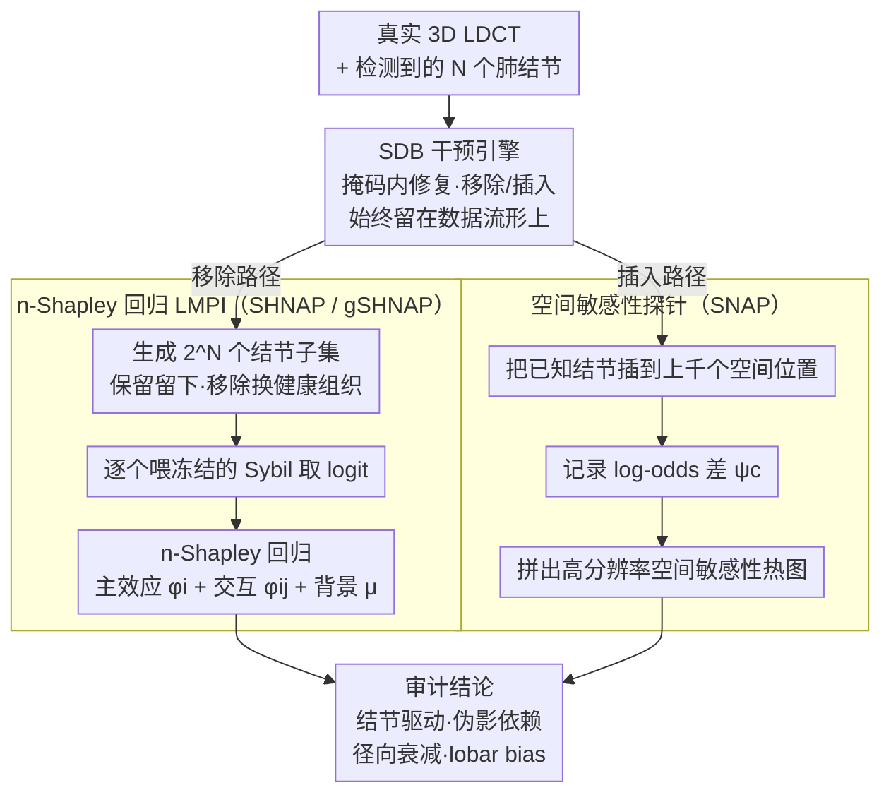

# Auditing Sybil: Explaining Deep Lung Cancer Risk Prediction Through Generative Interventional Attributions

**会议**: ICML 2026  
**arXiv**: [2602.02560](https://arxiv.org/abs/2602.02560)  
**代码**: 暂未公开  
**领域**: 医学图像 / 可解释 AI / 因果归因  
**关键词**: 肺癌筛查, Sybil, 反事实解释, 扩散桥, Shapley 交互, 干预审计

## 一句话总结
本文提出 S(H)NAP——基于 3D 扩散桥的「移除 + 插入」生成式干预框架，把 Sybil 这一前沿肺癌风险预测模型的决策反向拆解为「肺结节主效应 + 两两交互 + 背景」的 LMPI（线性+二阶交互模型），首次以因果而非相关的方式审计出它对 ECG 电极、衣物金属扣等院内伪影的依赖以及对外周肺结节的「径向不敏感」严重失败模式。

## 研究背景与动机

**领域现状**：肺癌仍是全球癌症死亡首因，LDCT 筛查是主流手段；Sybil（Mikhael 2023）作为一款基于单次 CT 预测 6 年风险的深度模型，已在 NLST 等多中心做了观察性临床验证。目前对 Sybil 的"信任"几乎完全建立在 AUC、亚组校准这种**纯观察性**指标上。

**现有痛点**：观察指标只能告诉你"模型在数据上好不好"，无法告诉你"它为什么好"或"它什么时候会失败"。在高风险医疗部署里，这是一种致命的盲区——它可能依赖了 ECG 电极、扫描床等伪影，可能系统性低估某个解剖位置的结节，但 AUC 数字毫无显示。

**核心矛盾**：传统归因方法（SHAP/IG/Grad-CAM）要么停留在像素级、违反数据流形，要么是相关性而非因果；视觉反事实（VCE）虽然站在 Pearl 因果阶梯顶端，却只能告诉你"改了什么"，不能拆解"每一处具体改动各自贡献多少"，无法回答"是哪一个结节驱动了风险"这种临床问题。

**本文目标**：构造一种**生成式干预归因**，既保持在 LDCT 数据流形上、又能精确拆解出每个肺结节的主效应和成对交互效应，同时也能探测模型对任意空间位置的敏感性偏置。

**切入角度**：作者把临床共识当成结构先验——「肺结节才是肺癌风险预测的主要影像生物标志物」——并由此提出 **Hypothesis 1**：Sybil 的决策可以被一个 LMPI 良好近似，由背景项 $\mu_\mathbf{x}$ + 结节主效应 + 结节两两交互组成。一旦这条假设站住，"反事实"就等价于"开关某些结节"，与扩散桥的可控修复天然合拍。

**核心 idea**：用 System-Embedded Diffusion Bridges（SDB）对 3D CT 子体做高保真的「结节移除」与「结节插入」干预，把每一种结节联盟都生成出来作为 Sybil 的输入，再用 n-Shapley Values（n=2）回归出 LMPI 系数，从而得到首个针对 Sybil 的**因果级**审计框架。

## 方法详解

### 整体框架
S(H)NAP 把"审计 Sybil"拆成两条共享同一个 SDB 干预引擎的路线：SHNAP 做解释性归因、SNAP 做空间敏感性探针。SHNAP 走「移除路径」——给定一张真实 CT，把 $N$ 个肺结节的全部 $2^N$ 个子集都生成出来（保留的结节留下、移除的换成健康组织），逐个喂给冻结的 Sybil 拿到风险 logit，再用 n-Shapley 把这些 logit 回归成主效应 $\phi_i$ 和成对交互 $\phi_{ij}$。SNAP 走「插入路径」——把一颗已知性质的结节插到 CT 的任意空间位置，记录预测 logit 的变化 $\psi_\mathbf{c}=f(y_0\mid\mathbf{x}_{\mathbf{c}\leftarrow\mathbf{r}})-f(y_0\mid\mathbf{x})$，扫遍上千个位置就拼出一张高分辨率的"空间敏感性"热图。

### 关键设计

**1. 基于扩散桥的结节移除/插入：让干预始终留在数据流形上**

传统反事实有两条死路：用 GAN 一次性翻转标签会丢掉局部性，用零/均值填充又会把输入推离数据流形、让 SHAP 退化成对抗性噪声。S(H)NAP 改用 System-Embedded Diffusion Bridge（SDB），把扩散过程的终点从纯噪声推广成线性测量 $\mathbf{x}'=\mathbf{A}\mathbf{x}+\Sigma^{1/2}\varepsilon$；当 $\mathbf{A}$ 取二值掩码、$\Sigma=0$ 时它就退化成一个专用 inpainting，反向采样只在 mask 区内更新，从而严格保证 mask 外的解剖结构原封不动。移除结节时，因为结节只占肺体积不到 0.1%，prior 自然充当"健康组织生成器"，把目标位置补成可信的正常肺；插入结节时则先把异源结节粘进 mask，再正向扩散到时刻 $\tau$（实验取 0.3）、反向去噪让它与新背景无缝融合。理论支撑来自 Verdú 2009 的失配估计定理——扩散时间足够长后，得分模型 $\mathbf{s}_\xi$ 会把任意"复制粘贴"或"挖空"的输入与训练分布拉到不可区分。这种"局部修复 + 流形保真"打包成单一数学严谨操作的好处，在双盲实验里直接兑现：放射科医师区分真实组织与 SDB 移除结果已与随机猜测无统计差异（point estimate 0.57），说明干预在临床意义上"无痕"。

**2. n-Shapley 回归出 LMPI 系数：让"每颗结节贡献多少风险"有了带误差棒的答案**

有了无痕干预，"反事实"就等价于"开关某些结节"，但还需要把 $2^N$ 个联盟的响应整理成可解读的数字。SHNAP 构建数据集 $D=\{(S,v_\mathbf{x}(S))\}$，其中 $v_\mathbf{x}(S)=f(y_0\mid \mathbf{x}_S)$ 是保留子集 $S$ 时 Sybil 的 logit，再用 SHAP-IQ 在 $n=2$ 截断的 n-Shapley 公式上回归出 baseline $\phi_\emptyset$、主效应 $\phi_i$ 和成对交互 $\phi_{ij}$，用 $R^2=1-\sum(v-\hat v_{\text{nSV}})^2/\sum(v-\bar v)^2$ 度量拟合质量。这之所以可算，是因为每个病人通常只有个位数结节，$2^N$ 评估在临床场景里完全负担得起——临床先验"结节才是主要影像生物标志物"把原本 $2^d$ 不可解的 Shapley 问题压到了 $2^N$。而 n-SV 又恰好是 LMPI 的唯一最小二乘投影，天然继承 SHAP 的 local accuracy / consistency 公理，于是"哪颗结节驱动了风险"这个临床问题第一次有了可解读、带误差棒的因果级答案；实证中 $R^2$ 中位数 $\approx 1$，反过来证实了 Hypothesis 1——Sybil 的决策真的能被 LMPI 良好近似。

**3. 基于插入的空间敏感性探针 SNAP / gSHNAP：审计"模型在没结节的地方依赖了什么"**

移除式的 SHNAP 只能解释"现有结节"，对真正危险的失败模式——院内伪影、扫描架、ECG 电极这些"模型不该看的东西"——无能为力。SNAP 把同一颗已知结节插到一例 CT 的数千个位置，用 log-odds 差 $\psi_\mathbf{c}$ 作每点归因，从而把审计从"现有 feature"扩展到整个反事实空间。在 240 个 patient-nodule 组合 × 约 900 个插入点上做两路 ANOVA，发现 lobe 主效应显著（$p<0.001$）而 patient×lobe 交互不显著，说明 lobar bias 是 Sybil 的**全局**特性而非个例；再用"距离-胸膜"线性回归量化结节越往外周被压得越狠的"径向衰减"。gSHNAP 则把"结节指示符"换成"任意 ROI 指示符"——把 attention map 二值化成 ROI 集合，用同一套 SDB 移除流程逐个审查 Sybil attention 关注的非结节区域。正是这一步让 ECG 电极这种传统观察性研究永远看不见的 shortcut 暴露出来。

### 损失函数 / 训练策略
SDB 用的是 Schrödinger Bridge 的离散变体，1000 步、$64^3$ cube，训练 mask 由 metaballs 程序化生成，骨干在 NLST 的 28K 训练扫描上学到健康组织先验，移除/插入推理各 100 NFE。Sybil 全程冻结，整套审计完全 model-agnostic、只吃输入-输出对——意味着同款流水线可以直接套到 Optellum 等闭源商业模型上。

## 实验关键数据

### 主实验
S(H)NAP 在三组数据上系统审计 Sybil。

| 数据集 | 规模 | 关键发现 | 临床含义 |
|--------|------|----------|----------|
| NLST | 28K 训练 / 6K 测试 | 放射科医师区分真实 vs SDB-移除的健康组织 acc=0.57，统计不可区分 | SDB 干预是 in-distribution |
| LUNA25 | 4,069 扫描 | LMPI 主效应即可达 $R^2\approx 1$ | Hypothesis 1 成立，Sybil 真的是 LMPI |
| iLDCT | 243 OOD 扫描 | 重症样本中 Sybil 更聚焦结节，但伪影依赖也变明显 | 失败模式与样本严重度耦合 |

### 消融实验

| 配置 | 主要观测 | 解读 |
|------|----------|------|
| SHNAP 主效应（一阶） | 多数样本 $R^2$ 已 $\approx 1$ | Sybil 决策大多被结节独立项就能解释 |
| + 二阶交互 | outlier 几乎完全消除 | 少数复杂样本存在结节间交互效应 |
| naive 扰动（zero-fill）替代 SDB | 归因方差极大、不稳定 | OOD 输入会让 SHAP 退化为对抗性噪声 |
| 随机肺内 ROI 上的 gSHNAP | 重要性分布集中于 0 | 影响区域是稀疏的，Sybil 并非"对任何扰动都反应" |

### 关键发现
- **结节径向衰减**：用 distance-to-pleura 预测 SNAP 归因得到显著正系数 ($p<0.001$)，加入结节身份交互后 $R^2$ 从 0.071 升到 0.455 ——malignant 结节越靠近胸膜被压得越狠，benign 反而无所谓，作者怀疑根源是 3D conv 的 zero-padding；这正好命中 adenocarcinoma 这一肺癌最常见亚型常发生在外周的临床盲区。
- **lobar bias**：post-hoc Tukey HSD 显示上肺叶归因显著高于中/下叶 ($p\le 0.009$)，与 PanCan/Mayo 临床先验吻合；并且 Sybil 正确忽略左右差异。
- **危险的伪影依赖**：gSHNAP 在阴性病例上发现 50% 的预测风险来自胸壁外两枚对称的 ECG 电极，相当于把"做了心电监测"误读为"高风险"，类似经典的"hospital tag" shortcut。
- **"对了但理由错"**：有恶性病例 Sybil 把真实结节归为"反向证据"，靠背景特征+结节交互项相互抵消恰好得到正确高风险预测——AUC 看不见的双重失败。

## 亮点与洞察
- 把"是否相信一个深度医学模型"的标准从观察性指标提升到 Pearl 因果阶梯顶端的反事实层级，且整套流程 model-agnostic，可平移到任何 CT 风险预测器。
- 利用临床先验（结节才是主要 biomarker）把通常 $2^d$ 不可解的 Shapley 问题压缩到 $2^N$（$N$ 通常很小），让 LMPI 成为可计算且严谨的"白盒近似"。
- 用 SNAP 的几十万次插入构造高分辨率空间敏感性图，第一次让"模型在哪儿瞎、在哪儿过敏"变成可视化、可统计检验的实体；这套设计可直接迁移到乳腺癌、皮肤癌等任何病灶驱动型任务。

## 局限与展望
- 依赖部分合成数据，虽有专家盲评，仍存生成式伪影风险；理想上需要可证明鲁棒的反事实（作者也提到 Zaher 2026 这个方向）。
- LMPI 假设在罕见、超大、形态特殊的结节上失效（SDB 重建变差），需要更大体素训练或多尺度 SDB。
- SNAP 一次插入只能针对单颗结节，多结节 emergent interaction 尚未刻画；同时 SDB 仅在 LDCT 单模态训练，对 PET/MRI 跨模态审计需重训练 prior。

## 相关工作与启发
- **vs 经典 SHAP / IG**：那些方法把 baseline 设成黑色像素或均值图像，违反数据流形导致归因不稳；SHNAP 把 baseline 换成 SDB 生成的"健康肺"，让 Shapley 真正落在 in-distribution 上。
- **vs 视觉反事实（DiME、Jeanneret 系列）**：VCE 只给"翻转后的图"，无法解读每个结构贡献；SHNAP 在 VCE 之上叠了 LMPI + n-SV 回归，把"反事实图"升级为"因果归因系数"。
- **vs Mind-the-Pad（Alsallakh 2021）**：那篇工作从结构上指出 3D conv 的 padding 会造成边界激活衰减；S(H)NAP 用 SNAP 在临床数据上实证了它在 Sybil 上演化成"外周肺癌系统性漏报"，把架构缺陷与临床后果连成证据链。

## 评分
- 新颖性: ⭐⭐⭐⭐⭐ 首次把生成式扩散桥 + Shapley 交互模型组合用于临床高风险模型审计
- 实验充分度: ⭐⭐⭐⭐⭐ 三数据集、双盲专家研究、ANOVA、Tukey HSD 全覆盖，统计严谨
- 写作质量: ⭐⭐⭐⭐ 理论铺垫与实证发现结合紧密，但 SDB 部分对非扩散背景读者门槛偏高
- 价值: ⭐⭐⭐⭐⭐ 直接揭示 Sybil 部署风险，方法学可平移到其它医学 AI 上线前审计

<!-- RELATED:START -->

## 相关论文

- [\[CVPR 2025\] Association of Radiologic PPFE Change with Mortality in Lung Cancer Screening Cohorts](../../CVPR2025/medical_imaging/association_of_radiologic_ppfe_change_with_mortality_in_lung_cancer_screening_co.md)
- [\[CVPR 2026\] Factorized Context Aggregation for Robust Cancer Risk Estimation via Soft Re-Ranked Retrieval and Hierarchical Anchors](../../CVPR2026/medical_imaging/factorized_context_aggregation_for_robust_cancer_risk_estimation_via_soft_re-ran.md)
- [\[CVPR 2026\] Solving a Nonlinear Blind Inverse Problem for Tagged MRI with Physics and Deep Generative Priors](../../CVPR2026/medical_imaging/solving_a_nonlinear_blind_inverse_problem_for_tagged_mri_with_physics_and_deep_g.md)
- [\[AAAI 2026\] GROVER: Graph-guided Representation of Omics and Vision with Expert Regulation for Cancer Survival Prediction](../../AAAI2026/medical_imaging/grover_graph-guided_representation_of_omics_and_vision_with_expert_regulation_fo.md)
- [\[ICML 2026\] DP-KFC: Data-Free Preconditioning for Privacy-Preserving Deep Learning](dp-kfc_data-free_preconditioning_for_privacy-preserving_deep_learning.md)

<!-- RELATED:END -->
