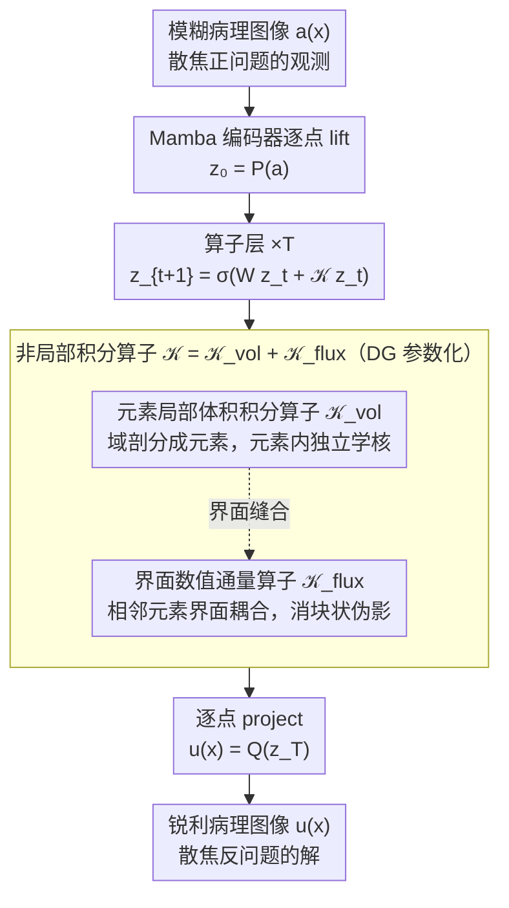

# DGNO: Discontinuous Galerkin Neural Operator for Pathology Defocus Deblurring

**会议**: ICML 2026  
**arXiv**: [2605.23282](https://arxiv.org/abs/2605.23282)  
**代码**: https://github.com/DeepMed-Lab-ECNU/Single-Image-Deblur  
**领域**: 医学图像 / 神经算子 / 图像复原  
**关键词**: 病理图像去模糊, 神经算子, 不连续 Galerkin, 元素级局部算子, 界面通量

## 一句话总结
DGNO 把病理显微图像的散焦去模糊重新表述为"空间变化积分算子"的反问题，用不连续 Galerkin 风格把全局核拆成元素局部积分算子 + 界面数值通量，既保留神经算子的物理可解释性，又能处理病理图像本质上的局部不连续模糊；在 BBBC006w1 等数据集上超越 NAFNet / Restormer / MambaIRv2 等 SOTA。

## 研究背景与动机

**领域现状**：病理显微图像的散焦去模糊对下游细胞检测/分割（StarDist 等）至关重要。主流深度学习方法用 CNN（NAFNet / Cho 等）、Transformer（Restormer / MPT）、Mamba（MambaIRv2）做端到端学习。最近也有把神经算子（NO）用到低层视觉的工作（SRNO / DiffFNO）。

**现有痛点**：（1）CNN 隐含 shift-invariance，但病理散焦因深度变化、组织非均质、折射率不均、像差等是**空间变化**的，shift-invariant convolution 根本不对；（2）Transformer 全局注意力没物理意义，对模糊形成过程没显式建模；（3）Mamba 在 feature-sequence 层操作，仍非物理结构化；（4）现有 NO（FNO / SRNO）用全局参数化核，隐含光滑/平稳假设，对病理图像的**局部不连续模糊**（不同组织区域过渡处 PSF 跳变）也不合适。

**核心矛盾**：病理散焦在物理上对应空间变化积分算子 $g(x,y) = \iint K(x,y;\xi,\eta) h(\xi,\eta)\,d\xi d\eta$，只有在 shift-invariance 时才能退化为卷积；现实中 PSF 既空间变化又局部不连续。但已有 NO 全局参数化核假设光滑——既要 NO 的物理一致性，又要承认局部不连续，是个开放问题。

**本文目标**：（1）首次把散焦去模糊形式化为 NO（function-to-function map）；（2）设计能显式处理局部不连续模糊的 NO 架构；（3）保持全局连贯（避免分块伪影）的同时刻画局部异质性。

**切入角度**：偏微分方程数值解里有个成熟的"不连续 Galerkin (DG)"方法——把域分成不重叠元素，元素内独立解，元素间用界面数值通量耦合。这套思路天然适合局部不连续场，刚好和病理图像"局部稳定 + 区域间一致过渡"的特性匹配。

**核心 idea**：把全局积分核拆成 **元素局部体积算子** + **界面数值通量**，前者刻画空间局部异质，后者控制元素间信息交换避免过平滑；既保留 NO 的物理一致性，又获得 DG 的局部不连续建模能力。

## 方法详解

### 整体框架

DGNO 想解决的是病理散焦这种"既空间变化、又局部不连续"的模糊——同一张切片里细胞核、胞质、细胞外基质各有各的 PSF，区域过渡处还会突变。它沿用神经算子的通用骨架：输入图像 $a(x)$ 先被 Mamba 编码器逐点 lift 成隐式特征场 $z_0 = P(a)$，再过 $T$ 层算子层逐步去模糊，最后逐点 project 回锐利图像 $u(x) = Q(z_T)$。每层的更新是 $z_{t+1}(x) = \sigma(W z_t(x) + (\mathcal{K} z_t)(x))$，其中非局部积分算子 $\mathcal{K}$ 是全文唯一的创新载体——把它用不连续 Galerkin (DG) 的方式参数化：先把域剖分成互不重叠的元素 $\{E_e\}$，再令 $\mathcal{K} = \mathcal{K}_{\text{vol}} + \mathcal{K}_{\text{flux}}$，即"元素内体积积分 + 元素界面数值通量"两块拼起来。整条 pipeline 从输入到输出严格对应 Fourier optics 里散焦的正问题与反问题——这层物理对齐既给了设计依据，又带来可解释性。

### 关键设计

**1. 元素局部体积积分算子：让每块区域学自己的模糊核**

全局 FNO 把积分核当成空间平稳的，整张图共用一套参数——这对病理图像直接失效，因为细胞核、胞质、细胞外基质的 PSF 根本不一样。DGNO 的做法是把积分限死在元素内部：对元素 $E_e$ 上的特征只做 $(\mathcal{K}_{\text{vol}} z)(x) = \int_{E_e} k_e(x, y) z(y)\,dy$，而且每个元素的核 $k_e$ 是**独立学习**的，具体落地用 Galerkin-type attention 在元素内部对 token 做自适应聚合。这样不同组织区域可以各自学到差异化的核，空间变化模糊自然就被刻画出来了。

**2. 界面数值通量算子：缝合元素边界，既不糊也不裂**

光有元素独立会出问题——元素之间互不通信，去模糊结果会有可见的块状伪影；可要是退回全局核又会把局部不连续抹平。DG 在数值解 PDE 时处理不连续场用的正是"局部 + 通量"这套标准范式，DGNO 把它搬进神经算子：在元素界面上定义数值通量 $\mathcal{K}_{\text{flux}}$ 来耦合相邻元素。它给了两种形式——（a）一般 face-based 通量，每个界面配一个独立可学习算子，表达力最强；（b）零阶 DG（P0DG），直接从元素体积算子推导出界面耦合、不再单独引参，更省。前者追性能，后者在资源受限时仍能用。通量这一项让信息跨边界流动、消掉块状伪影，但因为只在界面上耦合、不强行全局平滑，局部不连续得以保留。

**3. 物理对齐：每个模块都对得上一个光学含义**

CNN/Transformer/Mamba 这些端到端方法本质是 black-box，对模糊形成过程没有显式建模。DGNO 整条 pipeline 直接对应 Fourier optics 里散焦的正问题 $g(x,y) = \iint K(x,y;\xi,\eta) h(\xi,\eta)\,d\xi d\eta$，去模糊就是求它的反问题。元素剖分对应病理图像"piecewise structural heterogeneity"的假设：元素局部体积算子 = 区域内 PSF 缓慢变化，界面通量 = 区域间的过渡。好处不只是好看——每个模块都有清晰的物理对应，失败案例可诊断，后续还能顺着这条线引入显式 PSF 先验等物理改进。

## 实验关键数据

### 主实验：BBBC006w1 病理散焦去模糊

| 方法 | PSNR↑ | SSIM↑ | 参数(M) | FLOPs(G) |
|------|------|------|------|---|
| NAFNet | 28.92 | 0.879 | 17.1 | 16 |
| Restormer | 29.47 | 0.886 | 26.1 | 141 |
| MPT | 29.78 | 0.891 | 14.7 | 23 |
| MambaIRv2 | 30.12 | 0.895 | 25.9 | 24 |
| SRNO (NO 基线) | 30.05 | 0.893 | 16.3 | 19 |
| **DGNO** | **30.86** | **0.907** | 15.8 | **18** |

DGNO 在 PSNR / SSIM 双指标上明显领先，参数和 FLOPs 与现有方法相当甚至更低。

### 元素剖分粒度消融

| 元素数 | PSNR | 备注 |
|------|------|------|
| 1（全局核，退化为 SRNO 变体）| 30.05 | 失去局部性 |
| 4 × 4 | 30.42 | 元素过大 |
| 8 × 8 | **30.86** | 最优 |
| 16 × 16 | 30.71 | 元素过小，通量开销大 |
| 32 × 32 | 30.34 | 过细，块状伪影 |

存在最优粒度，验证"局部 + 通量"的平衡。

### 界面通量 vs P0DG 消融

| 配置 | PSNR | 参数 |
|------|------|------|
| 一般界面通量 | 30.86 | 15.8M |
| P0DG（零阶近似）| 30.62 | 12.3M |
| 无通量（纯元素独立）| 29.97 | 14.2M（块状伪影）|

P0DG 在 ~22% 参数节省下保留多数性能；纯元素独立有可见块状伪影，证明通量必要。

### 关键发现
- **空间变化模糊是病理图像 SOTA 的关键短板**：现有 shift-invariant 假设方法都被 DGNO 显著拉开差距
- **元素粒度有甜点**：太大失去局部、太小通量开销大且引入伪影
- **通量必不可少**：去掉通量虽能学但生成块状伪影；DG 数学结构在神经网络中也成立
- **物理对齐有副作用——可解释性**：可视化每个元素的核能直观看到模糊变化方向（论文附录有 PSF 可视化）

## 亮点与洞察
- **首个把 DG 数值方法引入神经算子的工作**：把数值偏微分方程领域成熟工具（DG）跨界引入 NO，处理本来 NO 处理不了的局部不连续场——典型的跨学科创新
- **物理 framing 是真正的差异点**：与其他端到端方法相比，DGNO 把散焦明确表述为积分算子的反问题，使得设计选择（元素局部 + 通量）有物理依据可追溯
- **元素剖分给出"结构归纳偏置"**：CNN 的归纳偏置是平移不变 + 局部连通；DGNO 的归纳偏置是"piecewise stable + interface coupled"，更贴合病理图像；这套偏置可推广到其他局部异质问题（遥感云雾、显微镜多模态融合）
- **P0DG 提供了实用 vs. 性能的甜点**：参数 −22% 性能仅 −0.24 PSNR，对实际部署友好

## 局限性 / 可改进方向
- 元素剖分是固定方格，对病理图像的自适应剖分（按组织边界）可能进一步提升
- 仅在 2D 病理切片上验证；3D 病理体（如 confocal stack）的 DGNO 扩展未尝试
- PSF 是隐式学习的，没显式估计；可考虑联合估计 PSF + 去模糊
- 未与传统两阶段方法（PSF 估计 + 非盲去卷积）做严格对比，物理 baseline 还可加强
- DG 是元素离散，未来可探索"高阶 DG"（hp-refinement）让不同元素用不同基函数

## 相关工作与启发
- **vs CNN / Transformer / Mamba 去模糊**：那些隐含 shift-invariance 或无物理结构；DGNO 显式建模空间变化积分算子
- **vs FNO / SRNO（全局 NO）**：那些假设核光滑，不能处理局部不连续；DGNO 通过 DG 元素剖分获得局部表达
- **vs DG 数值方法**：DG 用在 PDE 数值解（流体、电磁），本文是其在神经算子里的首次系统应用
- **启发**：把数值 PDE 离散化方案（FEM、DG、HHO 等）作为神经算子的归纳偏置库；这种"借用数学物理工具"的策略可推广到所有需要算子学习的场景

## 评分
- 新颖性: ⭐⭐⭐⭐⭐ 首个 DG-NO，把数值 PDE 离散方案引入 NO，处理局部不连续场是真新方向
- 实验充分度: ⭐⭐⭐⭐ 主实验 + 元素粒度消融 + 通量消融完整；缺少 3D 病理体验证
- 写作质量: ⭐⭐⭐⭐ 从物理 → 数学 → 神经网络的推导清晰；Fig 2 直观解释 DG 思路
- 价值: ⭐⭐⭐⭐ 病理图像质量直接影响下游诊断，去模糊是高价值任务；DG-NO 思路本身可推广

<!-- RELATED:START -->

## 相关论文

- [\[CVPR 2025\] NOIR: Neural Operator Mapping for Implicit Representations](../../CVPR2025/medical_imaging/noir_neural_operator_mapping_for_implicit_representations.md)
- [\[NeurIPS 2025\] Self-Supervised Learning via Flow-Guided Neural Operator on Time-Series Data](../../NeurIPS2025/medical_imaging/self-supervised_learning_via_flow-guided_neural_operator_on_time-series_data.md)
- [\[ICML 2026\] PathCTM: Thinking in Scales — Accelerating Gigapixel Pathology Image Analysis via Adaptive Continuous Reasoning](thinking_in_scales_accelerating_gigapixel_pathology_image_analysis_via_adaptive_.md)
- [\[CVPR 2025\] Unmasking Biases and Reliability Concerns in Convolutional Neural Networks Analysis of Cancer Pathology Images](../../CVPR2025/medical_imaging/unmasking_biases_and_reliability_concerns_in_convolutional_neural_networks_analy.md)
- [\[CVPR 2026\] Momentum Memory for Knowledge Distillation in Computational Pathology](../../CVPR2026/medical_imaging/momentum_memory_for_knowledge_distillation_in_computational_pathology.md)

<!-- RELATED:END -->
