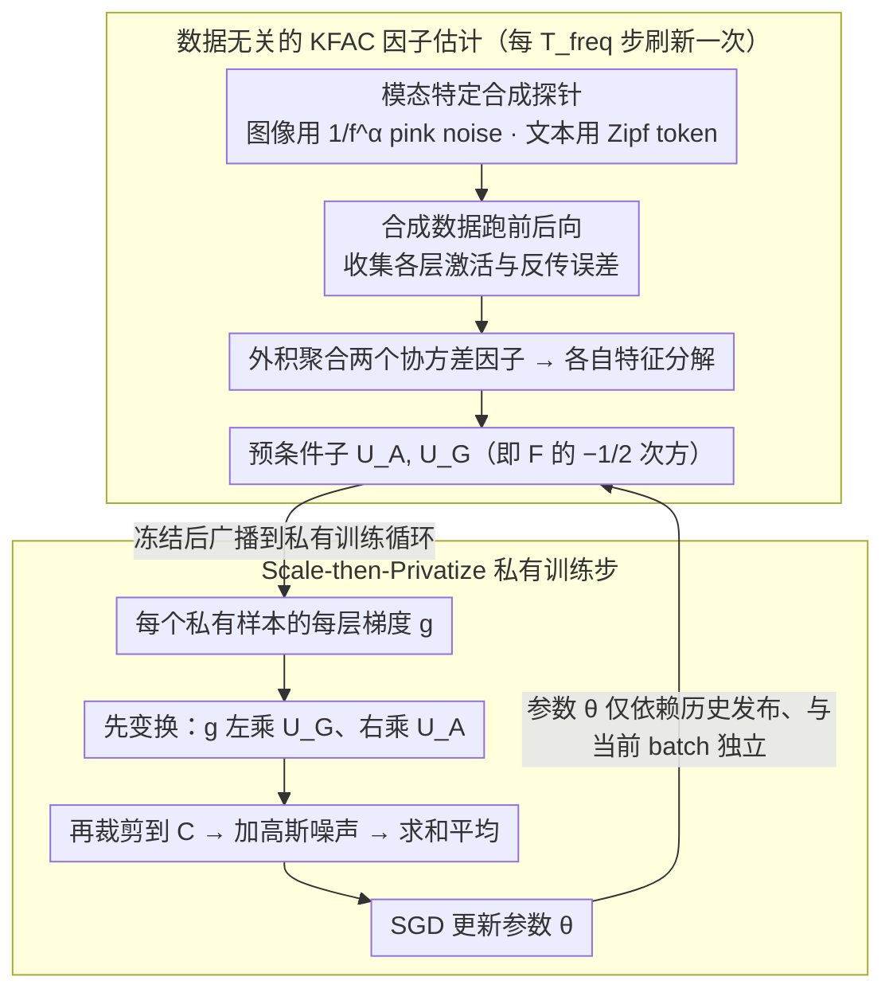

# DP-KFC: Data-Free Preconditioning for Privacy-Preserving Deep Learning

**会议**: ICML 2026  
**arXiv**: [2605.13418](https://arxiv.org/abs/2605.13418)  
**代码**: https://github.com/molinamarcvdb/DP-KFC （有）  
**领域**: 差分隐私 / 医学图像 / 二阶优化  
**关键词**: 差分隐私, KFAC, Fisher 信息矩阵, 预条件子, 合成噪声

## 一句话总结
本文提出 DP-KFC：基于"Fisher 矩阵的标度由架构决定、相关结构可用模态级频谱统计近似"的观察，用结构化合成噪声（图像用 $1/f^\alpha$ pink noise，文本用 Zipf 采样）探测网络重建 KFAC 预条件子，既不消耗隐私预算也不引入分布偏移，在强隐私（$\varepsilon\le 3$）下持续超过 DP-SGD 与公共数据预条件方法。

## 研究背景与动机

**领域现状**：差分隐私深度学习的标准做法是 DP-SGD——每样本梯度做 $L_2$ 裁剪后注入各向同性高斯噪声。隐私噪声尺度随模型维度 $\sqrt{d}$ 增长，过参数化在非隐私场景的优势在 DP 下消失。为缓解这个问题，社区转向自适应/二阶方法（DP-Adam、KFAC + DP），但要么从私有数据估二阶统计要花隐私预算，要么从公共数据估带来分布偏移。

**现有痛点**：（1）DP-SGD 的"各向同性"噪声和神经网络损失景观的高度"各向异性"几何不匹配——低敏感度参数被噪声淹没，高敏感度参数被过度裁剪（Fig. 1 SNR 崩塌）；（2）Ganesh et al. (2025) 证明：在隐私下做无偏二阶估计往往得不偿失，预条件器的噪声反而拖累；（3）Precondition-then-Privatize 范式依赖公共代理数据，在医学影像等专业域里根本找不到合适代理。

**核心矛盾**：要让 DP-SGD 的隐私噪声匹配损失几何，必须先把梯度变换到各向同性坐标系；但获取这个变换所需的曲率信息又必须**不**消耗隐私预算、且**不**依赖公共数据。

**本文目标**：（1）证明 KFAC 预条件子的关键信息可以从架构本身恢复；（2）设计一个仅用合成噪声就能重建预条件子的算法；（3）严格保持 DP 的形式化保证（不增加隐私预算消耗）。

**切入角度**：基于 Mean Field Theory，深层网络的层激活方差 $q^l$ 和反传梯度方差 $\tilde q^l$ 满足确定性递归（由初始化和非线性决定），与具体输入无关；Karakida et al. (2019) 证明 $\text{Tr}(F_l)\propto d\cdot q^{l-1}\cdot \tilde q^l$，即 Fisher 块的迹完全由架构决定。

**核心 idea**：把 Fisher 矩阵解耦为"架构敏感度（合成噪声可恢复）+ 输入相关结构（用模态级频谱 $1/f^\alpha$ 近似）"，用合成探针构造 KFAC 因子的 inverse square root $F^{-1/2}$，在每样本梯度被裁剪和加噪**之前**做线性变换（scale-then-privatize），这一步对私有数据透明，因此不消耗隐私预算。

## 方法详解

### 整体框架
DP-KFC 想解决的是：DP-SGD 的各向同性隐私噪声和损失景观的各向异性几何不匹配，要先把梯度变换到各向同性坐标系再加噪，但获取这个变换的曲率信息不能花隐私预算、也不能依赖公共代理数据。它的做法是把训练拆成两个周期交替的阶段。每隔 $T_{freq}$ 步，先用一批合成数据（图像是 pink noise、文本是 Zipf 序列）跑一遍前后向，按 KFAC 公式估出每层的两个协方差因子 $\hat A_{l-1}=\mathbb{E}[\tilde a_{l-1}\tilde a_{l-1}^\top]$ 和 $\hat G_l=\mathbb{E}[\tilde\delta_l\tilde\delta_l^\top]$，特征分解后拿到旋转/缩放矩阵 $U_{A,l}, U_{G,l}$；然后在私有训练步里，对每个私有样本 $i$ 的每层梯度先做线性变换 $\tilde g_l^{(i)}=U_{G,l}\,g_l^{(i)}\,U_{A,l}$，再裁剪、加噪、平均、SGD 更新。这个"先变换后隐私化"的顺序是整篇的关键——预条件子 $P_t$ 只依赖架构和已发布的历史参数、与当前 batch 独立，所以 RDP 的隐私 accounting 完全继承标准 DP-SGD，不多花一分预算。

### 关键设计

**1. 数据无关的 KFAC 因子估计：曲率信息从架构里恢复，不碰任何真实数据**

二阶 DP 方法的死穴是估曲率要么花隐私预算（从私有数据估）要么有分布偏移（从公共数据估）。这里靠的是 Mean Field Theory 的一个推论——Karakida et al. (2019) 证明 $\text{Tr}(F_l)\propto d\cdot q^{l-1}\cdot \tilde q^l$，即 Fisher 块的迹完全由架构（初始化和非线性决定的激活方差递归）决定、与输入无关。既然曲率的主信息只看架构，合成探针只要保持架构的前后向传播链路一致就够了。算法 1 据此生成 $M$ 个合成对 $(\tilde x, \tilde y)$，跑前后向收集激活和误差，外积聚合成 $\hat A_{l-1}=\frac{1}{M}\sum \tilde a_{l-1}\tilde a_{l-1}^\top+\pi I$ 与 $\hat G_l=\frac{1}{M}\sum \tilde\delta_l\tilde\delta_l^\top+\pi I$，特征分解后取 $U_{X,l}=Q_X(\Lambda_X+\gamma I)^{-1/2}Q_X^\top$。预条件子 $F_l^{-1/2}=U_{A,l}\otimes U_{G,l}$ 用 Kronecker 积隐式表示，不必 materialize 完整的 FIM。阻尼项 $\pi I$ 和 $\gamma I$ 既保证因子可逆又控制条件数，对应 Theorem 5.4 里的下界 $\lambda_{min}\ge\sqrt\gamma$。

**2. 模态特定合成探针：让合成输入既带架构信息、又落在数据的低维流形附近**

白噪声能量在所有频率均匀分布，可深网络主要传递低频特征，纯白噪声探出来的曲率会偏。解法是给合成探针注入"任务无关但模态有关"的先验。图像域用 pink noise：在频域把白噪声 $Z$ 按 $\tilde Z_\mathbf{u}=Z_\mathbf{u}/(\|\mathbf{u}\|_2^{\alpha/2}+\epsilon)$ 加权再 IFFT，取 $\alpha\approx 1$ 就复现了自然图像的 $1/f^\alpha$ 谱（Field 1987）。NLP 域用 Zipfian 分布从词表抽 token，并按句子语法位置摆放 [CLS] [SEP] [PAD]，让 attention 和 LayerNorm 走真实的传播路径。这样合成探针的激活统计被推到接近真实数据，却完全不携带语义内容，因此没有隐私泄漏。

**3. Scale-then-Privatize 与 DP 集成：把曲率注入 DP-SGD 而隐私成本为零**

要把变换塞进 DP-SGD 又不破坏隐私保证，顺序至关重要。算法 2 把梯度变换 $\tilde g_l=U_{G,l}\,g_l\,U_{A,l}$ 放在裁剪**之前**：变换后每样本的全局 $L_2$ 范数变成 $\nu_i=\sqrt{\sum_l\|\tilde g_l^{(i)}\|_F^2}$，裁剪阈值 $C$ 不变，噪声 $\mathcal{N}(0,\sigma^2 C^2 I)$ 仍加在裁剪后的求和上。因为 $P_t$ 是 batch-independent 的线性算子，Proposition 5.6 证明复合机制的 RDP 保证和标准 Gaussian 机制一模一样。相比"先加噪再乘 $P_t$"的 precondition-after-privatize，scale-then-privatize 让隐私噪声项 $d\sigma^2 C^2/B^2$ **不**被预条件子的 $\lambda_{max}^2$ 放大（见 Theorem 5.4），高隐私（小 $\varepsilon$）regime 下这个差别最明显。

### 损失函数 / 训练策略
- 标准 CE/MSE loss + DP-SGD 优化器；KFAC 阻尼 $\pi=\gamma=10^{-2}$；Opacus 做 RDP accounting，A100 GPU。
- 预条件子刷新频率 $T_{freq}$（典型 100–1000 步），单步 wall-clock 比 DP-SGD 慢约 2.2×，但每步更高效（Remark 5.5 "privacy wall"——隐私 budget 限定步数 $T$，所以更值)。
- 模型：CNN on MNIST、CrossViT on CIFAR-100、BERT on StackOverflow、Logistic Regression on IMDB；隐私预算 $\varepsilon\in[0.5,10]$。
- 收敛保证：Theorem 5.4 $\min_t\mathbb{E}\|\nabla\mathcal{L}\|^2\le \frac{C_1}{\lambda_{min}\sqrt T}+\frac{C_2}{\lambda_{min}\sqrt T}(\lambda_{max}^2\sigma_{sgd}^2+\frac{d\sigma^2 C^2}{B^2})$，$O(T^{-1/2})$ 非凸最优速率。

## 实验关键数据

### 主实验

MNIST CNN（5 seeds, hyperparameters tuned per method）:

| Method | $\varepsilon=1$ | $\varepsilon=2$ | $\varepsilon=8$ |
|--------|----------------|----------------|----------------|
| DP-SGD | 91.7 ± 0.2 | 92.5 ± 0.3 | 93.7 ± 0.3 |
| AdaDPS (Public) | 91.3 ± 0.8 | 93.2 ± 1.0 | 93.3 ± 1.4 |
| DiSK (post-priv) | 93.7 ± 0.4 | 94.1 ± 0.3 | 94.3 ± 0.2 |
| DP-AdamBC (post-priv) | 94.0 ± 0.3 | 94.8 ± 0.2 | 95.3 ± 0.1 |
| Public DP-KFC | 95.3 ± 0.4 | 95.7 ± 0.3 | 96.4 ± 0.3 |
| **Synthetic DP-KFC** | **94.2 ± 0.5** | **95.0 ± 0.4** | **95.9 ± 0.3** |
| Synthetic DP-KFC + DP-AdamBC | **95.5 ± 0.3** | **96.1 ± 0.2** | 96.4 ± 0.3 |

跨模态结果（$\varepsilon=1$）：
- CIFAR-100 + CrossViT：Synthetic DP-KFC 与 Public DP-KFC 几乎相同，均超过 DP-Adam ≈1.4%；
- StackOverflow + BERT：Synthetic 91.8% vs. DP-SGD 89.5%（+2.3%），但比 Public DP-KFC 96.1% 仍差 ≈4%；
- IMDB + LR：Synthetic 与 Public DP-KFC 都达到 85.8% vs. DP-SGD 83.1%。

### 消融实验

Transfer / Domain Mismatch（MNIST 训练，$\varepsilon=1.0$）：

| Method | Fashion←MNIST (Ideal) | Path←MNIST (Texture Disjoint) |
|--------|----------------|----------------|
| Oracle (Private) | 88.3 ± 0.2 | 78.4 ± 1.7 |
| DP-SGD | 83.5 ± 0.7 | 68.5 ± 2.3 |
| AdaDPS (Public) | 84.7 ± 0.3 | 70.5 ± 2.0 |
| Public DP-KFC | 87.6 ± 0.2 | 73.4 ± 1.3 |
| **Synthetic DP-KFC** | **87.8 ± 0.2** | **78.2 ± 1.9** |

### 关键发现
- **架构主导曲率**：Fig. 2 显示 MLP/CNN/Attention 三种层的 KFAC eigenvalue decay 在 synthetic / public / private oracle 之间几乎重合，验证了 MFT 推论。
- **方向 vs. 尺度**：浅层 Synthetic DP-KFC 与 oracle 余弦相似度 >0.8，深层降到 <0.6（深层方向依赖标签），但 Frobenius 误差仍最小——本文优势主要在 scale 而非 direction。
- **域不匹配是 Public DP-KFC 的死穴**：PathMNIST 任务上 Public 退化到 73.4%，Synthetic 仍达 78.2%（与 Oracle 持平），证明合成探针避开了负迁移。
- **NLP gap**：StackOverflow 上 Synthetic 不如 Public，因为随机 token 序列落不到真实文本的低维流形上；作者承认这是未来工作。
- **互补性**：Scale-then-Privatize（DP-KFC）与 Post-Privatize（DP-AdamBC、DiSK）正交，组合后 $\varepsilon=1$ 上达到 95.5%，超过任一单独使用。

## 亮点与洞察
- **理论桥**：把 Mean Field Theory 的"激活方差由架构决定"结论桥接到 DP 的预条件子设计，是非常少见的从 deep learning theory 直接产出实用 DP 算法的工作。
- **隐私零成本**：$P_t$ batch-independent 这条性质让 RDP 完全继承标准 Gaussian 机制，没有任何额外 budget——这是相对其他二阶 DP 方法最大的卖点。
- **模态级先验**：用 $1/f^\alpha$ pink noise 和 Zipf 采样作为"任务无关但模态有关"的先验，思路可迁移到 audio（$1/f$ 谱）、point cloud（局部各向同性）等其他模态。
- **"Privacy wall"洞察**：Remark 5.5 重新框定了 DP 训练的算力账——隐私 budget 限定步数 $T$，所以每步更慢但更有效的二阶方法反而更划算。

## 局限与展望
- 深层方向对齐差，意味着对极深网络（如 ResNet-152）合成探针可能不够；作者用 CrossViT 已是相对深的架构但未试 ResNet-152 级别。
- 文本域 gap 显示：合成探针只恢复架构因子，不重建真实数据流形；token-frequency 或 embedding-space 探针是自然延伸但论文没做。
- $T_{freq}$ 和合成 batch 大小 $M$ 的最优值依赖架构和任务，附录的 ablation 没给闭式 guidance。
- 单步 2.2× 开销在大模型上可能不可忽略；KFAC 的 Kronecker 结构对 attention 中的 Q/K/V 联合处理需要 K-FAC-reduce 近似，未严格验证近似误差。
- 缺少对联邦学习场景的实证（虽然 intro 中提了）。

## 相关工作与启发
- **vs. Public DP-KFC (本文公共数据版)**: 同框架，公共数据版上界更高但碰到域不匹配（PathMNIST）会负迁移，Synthetic 更鲁棒。
- **vs. AdaDPS (Li et al. 2022)**: AdaDPS 用对角自适应预条件子；DP-KFC 用 block-diagonal KFAC，从对角扩到块对角的二阶方法，零隐私成本。
- **vs. DP-AdamBC (Tang 2024) / DiSK (Zhang 2025)**: 后两者是 post-privatize 校正，与 DP-KFC 正交可叠加，组合最优。
- **vs. DP-Newton (Ganesh 2023)**: 后者需要私有 Hessian，naive 估计 $O(d)$ 噪声放大；DP-KFC 完全避开。
- **vs. Mean Field Theory 初始化 (Schoenholz, Yang 2017)**: 把 MFT 从"data-independent init"扩展到"data-independent preconditioning"，思路一脉相承。

## 评分
- 新颖性: ⭐⭐⭐⭐⭐ 用合成噪声重建 KFAC 预条件子并零隐私成本注入 DP-SGD，是少见的 theory→practice 闭环
- 实验充分度: ⭐⭐⭐⭐ 4 个数据集 × 4 种基线 × 多 $\varepsilon$ + 域迁移 + ablation 都做了，10 seeds
- 写作质量: ⭐⭐⭐⭐⭐ 故事线（几何不匹配→架构主导→合成探针→scale-then-privatize）一气呵成，理论与算法对照清晰
- 价值: ⭐⭐⭐⭐⭐ 给医学影像等"既需隐私又无公共代理"的领域提供了真正可用的二阶 DP 方法

<!-- RELATED:START -->

## 相关论文

- [\[AAAI 2026\] Learning with Preserving for Continual Multitask Learning](../../AAAI2026/medical_imaging/learning_with_preserving_for_continual_multitask_learning.md)
- [\[CVPR 2025\] CycleULM: A Unified Label-Free Deep Learning Framework for Ultrasound Localisation Microscopy](../../CVPR2025/medical_imaging/cycleulm_a_unified_label-free_deep_learning_framework_for_ultrasound_localisatio.md)
- [\[ICML 2026\] Factored Classifier-Free Guidance](factored_classifier-free_guidance.md)
- [\[AAAI 2026\] qa-FLoRA: Data-free Query-Adaptive Fusion of LoRAs for LLMs](../../AAAI2026/medical_imaging/qa-flora_data-free_query-adaptive_fusion_of_loras_for_llms.md)
- [\[ICML 2026\] Auditing Sybil: Explaining Deep Lung Cancer Risk Prediction Through Generative Interventional Attributions](auditing_sybil_explaining_deep_lung_cancer_risk_prediction_through_generative_in.md)

<!-- RELATED:END -->
