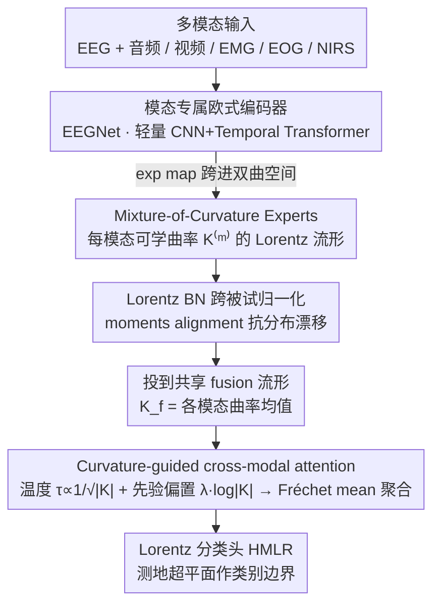

# EEG-Based Multimodal Learning via Hyperbolic Mixture-of-Curvature Experts

**会议**: ICML 2026  
**arXiv**: [2604.12579](https://arxiv.org/abs/2604.12579)  
**代码**: 论文中提到 "Code will be released"，暂未公开  
**领域**: 医学图像 / 脑机接口 / 多模态学习 / 双曲几何  
**关键词**: EEG、Mixture-of-Curvature、Lorentz 流形、跨被试泛化、δ-hyperbolicity

## 一句话总结
EEG-MoCE 给 EEG-based 多模态学习（情绪/睡眠/认知）每个模态分配一个**可学习曲率**的 Lorentz 流形 expert，再用"曲率大→层级结构更丰富→在 fusion 中权重更高"的 curvature-aware attention 做跨模态融合，在 EAV/ISRUC/Cognitive 三个数据集上 cross-subject 准确率分别 +14.14%、+3.34%、+7.98%。

## 研究背景与动机

**领域现状**：EEG 信号孤立用时受电生理噪声、被试差异影响很大，所以越来越多工作把它和视频（面部表情）、音频、EMG/EOG/NIRS 等模态一起做多模态学习，提升情绪识别、睡眠分期、认知负荷评估等任务的鲁棒性。当前主流是 Euclidean 架构（CNN+Transformer+Cross-modal attention）。

**现有痛点**：(1) EEG 与脑相关模态都被神经科学证实有**分层组织**（emotion 从皮层下到边缘再到新皮层；frequency band 也是层次结构）；(2) Euclidean embedding 因为距离/体积只能线性/平方增长，根本装不下指数膨胀的层级结构；(3) 已有的 hyperbolic EEG 工作（HEEGNet）只用**固定曲率**且只针对单模态 EEG，多模态场景下不同模态的"层级强度"差异巨大但被一刀切对待。

**核心矛盾**：不同模态的层级复杂度天然不同（论文用 δ-hyperbolicity 量化：EEG δ_rel≈0.10，audio ≈0.22，video ≈0.28），用同一个曲率 / 同一个 Euclidean 空间表达它们都不对。但要让"自适应曲率"在多模态融合阶段也起作用，得有机制告诉融合层"哪个模态此刻更可靠"。

**本文目标**：(i) 给每个模态自己的 Lorentz 流形 + 可学习曲率；(ii) 让融合阶段显式利用学到的曲率做加权，使含层级信息多的模态权重更大。

**切入角度**：作者关键的桥梁观察——理论上，曲率绝对值 |K| 越大，能在固定维度下嵌入越深的层级且失真越小（Sala et al., 2018）。所以如果端到端训出来某模态的 |K| 大，就说明它"装的层级信息多"，这个 |K| 就可以反过来当 fusion 权重。

**核心 idea**：Mixture-of-Curvature experts + curvature-aware cross-modal attention（让 |K| 既决定单模态几何也决定融合权重）。

## 方法详解

### 整体框架
EEG-MoCE 想解决的核心问题是：EEG 与它的伴随模态（音频、视频、EMG/EOG/NIRS）各自的层级复杂度差异很大，用同一个欧式空间或同一个固定曲率装它们都不合适。整个模型 $h_\Theta=g_\psi\circ F_\omega\circ(\bigoplus_{m\in\mathcal{M}}E_\phi^{(m)}\circ e_\theta^{(m)})$ 是一条四段流水线：每个模态先经各自的 Euclidean encoder $e_\theta^{(m)}$ 抽时间-频率局部特征，得到 $\mathbf{x}^{(m)}\in\mathbb{R}^d$（EEG 用 EEGNet，EMG/EOG 用 EEGNet 变体，video 用轻量 CNN+Temporal Transformer，audio 用 1D CNN on mel-spectrogram + Temporal Transformer）；再投进一个**专属可学曲率的 Lorentz 流形 expert** $E_\phi^{(m)}$ 做层级建模；然后所有模态汇到一个 curvature-oriented fusion 模块 $F_\omega$ 用曲率引导的 cross-attention 融合；最后由 Lorentz 分类头 $g_\psi$ 在双曲空间里直接出决策。整条链路从 encoder 之后到分类全程都在 Lorentz 流形上完成，只在 encoder 衔接处用 exponential map 跨进双曲空间。

### 关键设计

**1. Mixture-of-Curvature Experts：给每个模态一个可学曲率的 Lorentz 流形**

针对的痛点是固定曲率的"一刀切"——作者先用 δ-hyperbolicity 量化每模态的层级强度，发现 EEG δ_rel≈0.10、audio≈0.22、video≈0.28、NIRS≈0.30，差异非常显著（Table 1），一个共享曲率必然让高层级模态被欠表达、低层级模态被过参数化。做法是给每个模态 $m$ 配一个可学曲率 $K^{(m)}<0$，把 encoder 输出的欧式特征经 exponential map $\mathbf{h}^{(m)}=\exp_\mathbf{o}^{K^{(m)}}(\mathbf{x}^{(m)})$ 投到该模态自己的 Lorentz hyperboloid（原点 $\mathbf{o}=[\sqrt{-1/K^{(m)}},\mathbf{0}]^\top$），之后的 BN、激活、attention 全在这张流形上做。之所以有效，是因为曲率不再是手调的常数而是端到端学出来的：训练后模型自动收敛到 EEG $|K|$=2.34 > Vision 2.29 > Audio 1.91，与 δ_rel 的序完美反相关——层级越丰富的模态，自动拿到越大的 $|K|$、越深的嵌入容量。

**2. Curvature-guided cross-modal attention：用曲率同时调温度和先验偏置**

光让单模态几何自适应还不够，融合阶段得知道"此刻哪个模态更可靠"，这正是这一步要补的环节。融合时先把各模态投到一个共享 fusion manifold（曲率 $K_f$ 取各模态均值）：$\mathbf{z}_f^{(m)}=\exp_\mathbf{o}^{K_f}(\sqrt{K^{(m)}/K_f}\cdot\log_\mathbf{o}^{K^{(m)}}(\mathbf{z}^{(m)}))$，保持双曲几何完整；attention 用负平方测地距离 $-d_{\mathcal{L}}^2$ 替代点积做相似度，再叠两个由曲率驱动的耦合：温度 $\tau^{(m)}=\tau_0/\sqrt{|K^{(m)}|}$ 让 $|K|$ 大的模态查询更尖锐，先验偏置 $\lambda\cdot\phi(K^{(j)})$（$\phi(K)=\log(|K|+\epsilon)$）让任意 query 都倾向于关注 $|K|$ 大的 key，合起来即 $\tilde{\alpha}_{m\to j}\propto\exp(-d_{\mathcal{L}}^2(\mathbf{q}^{(m)},\mathbf{k}^{(j)})/\tau^{(m)}+\lambda\cdot\phi(K^{(j)}))$，最后用 weighted Fréchet mean（双曲空间的加权平均）聚合。关键巧思在于把 $K$ 当成"该模态信息含量"的可学指示器复用进融合：温度让强模态做更精准的跨模态查询，prior bias 让弱模态贡献时仍被强模态聚合到，于是 attention 的层级偏好从纯"特征相似度"升级成"几何复杂度 + 相似度"双信号。Table 2 上 EAV 的 EEG attention 贡献 36% > Vision 33.6% > Audio 30.5%，与 $|K|$ 排序一致，印证了这个耦合确实在起作用。

**3. Hyperbolic 全栈处理 + 跨被试归一化**

如果只在 fusion 阶段用双曲、encoder 后立刻回欧式，层级信息在中间就已经失真了；同时 EEG 最难的 cross-subject setting 还有严重的被试间分布漂移要处理。所以作者让从 encoder 之后到分类全程留在 Lorentz 流形上：Lorentz 全连接 $f_\mathcal{L}(\mathbf{p})=(\sqrt{\|\tilde{\mathbf{p}}_s\|^2-1/K},\tilde{\mathbf{p}}_s)$（$\tilde{\mathbf{p}}_s=\psi(\mathbf{Wp}+\mathbf{b})$）保证每层输出仍在流形上；Lorentz BN 借鉴 HEEGNet 的 moments alignment，把不同被试的特征统计量对齐到共享中心来抗漂移；分类则用 HMLR，以 geodesic hyperplane 作类别边界。这套"compositional design"分工明确——欧式 encoder 擅长时间-频率局部特征，双曲部分擅长层级建模与跨模态融合，二者只在 exp map 处衔接；流形选 Lorentz hyperboloid 而非 Poincaré ball，是因为前者在梯度优化时数值更稳。

### 损失函数 / 训练策略
- Classification loss + auxiliary terms（具体超参在 appendix），100 epoch；Euclidean 参数用 Adam，hyperbolic 参数用 Riemannian Adam；lr=1e-3，early stopping patience=20。
- 在 4×RTX 4090 上训练；跨被试评估用 leave-one-group-out 或 10-fold leave-groups-out（按被试 ID 分 group）。

## 实验关键数据

### 主实验

三个 EEG 多模态基准（balanced accuracy %）：

| 数据集 | 任务 / 模态 | 前 SOTA | EEG-MoCE | 提升 |
|--------|------------|---------|----------|------|
| EAV (n=42) | 情绪识别 / EEG+Audio+Video | HEEGNet 61.74 | **75.88** | **+14.14** |
| ISRUC (n=10) | 睡眠分期 / EEG+EMG+EOG | XSleepFusion 75.19 | **78.53** | +3.34 |
| Cognitive (n=26) | N-back 工作记忆 / EEG+EOG+NIRS | EF-Net 54.41 | **62.39** | +7.98 |

### 消融实验

EAV 上的架构消融（Table 7）：

| Encoder | Fusion | Acc (%) | F1 (%) | 说明 |
|---------|--------|---------|--------|------|
| Euclidean | Euclidean | 60.33 | 57.24 | 全欧式 baseline |
| Euclidean | Hyperbolic | 61.48 | 58.79 | 只融合阶段双曲 +1.15 |
| Hyperbolic | Euclidean | 74.17 | 73.41 | 只 encoder 双曲 +13.84 |
| Hyperbolic | Hyperbolic（Full） | **75.88** | **75.47** | 全双曲再 +1.71 |

Hyperbolic 组件消融（Figure 4）：

| 配置 | Acc 增益 |
|------|---------|
| 固定 K=-2 | baseline |
| + 可学 K | +2.14% |
| + COMF（curvature prior bias）| +1.38% |
| 全开（可学 K + COMF） | 最佳 |

模态贡献分析（Table 2，EAV，model 仅含 learnable K 无 COMF）：

| 模态 | δ_rel | 学到的 |K| | Attention 贡献 |
|------|-------|------|-----------|
| EEG | 0.160 | 2.34 | 36.0% |
| Video | 0.278 | 2.29 | 33.6% |
| Audio | 0.293 | 1.91 | 30.5% |

单模态消融（Table 8）：

| 模态 | Acc | 备注 |
|------|-----|------|
| Video only | 53.75 | |
| Audio only | 60.52 | |
| EEG only | 62.74 | 与 |K| 最大、δ_rel 最小一致 |
| All modalities | 75.88 | 多模态比单模态最佳 +13.14 |

### 关键发现
- **大部分收益来自 encoder 双曲化**（+13.84），fusion 双曲化只多 +1.71——说明根本瓶颈在 Euclidean 空间无法表达 EEG 频带/语义层级。
- **|K|、δ_rel、attention contribution 三者强相关**（Table 2 + 4.2）：曲率作为"层级信息含量指示器"的假设被定量验证，这是论文最有说服力的部分。
- **可学曲率比固定曲率涨 2.14%、COMF 再涨 1.38%**：两个机制独立都有效且互补。
- **学到的曲率先验权重 λ 在训练中自动从 0.30 涨到 0.33-0.53**（Table 3）——说明模型自发地越来越依赖曲率信息做 attention 加权，不是死规则。
- **EAV 上情绪识别从 61.74→75.88 暴涨 14 个点**是 EEG 多模态工作多年来罕见的大跳，说明双曲几何对"主观情绪"这种层级最强的任务收益尤其大。

## 亮点与洞察
- **"几何参数同时是表达能力 + 模态权重"是非常优雅的双重用法**：作者把单一参数 K 用在 (i) 决定该模态嵌入空间、(ii) 决定温度尖锐度、(iii) 决定 fusion 偏置三个地方，让"模态重要性"变成可学的几何量而非额外的 attention head。这种设计哲学完全可以迁移到任何"模态信息量差异显著"的场景（医疗影像 + 文本、感知 + 控制等）。
- **用 δ-hyperbolicity 做模态选择/数据集 profiling 的方法学贡献**：把一个纯几何指标变成多模态系统设计前的工程工具，告诉你"这个模态值得用 hyperbolic 吗"。
- **首次系统性地把 mixture-of-curvature 推广到 EEG 多模态**，且配对了 cross-subject 评估（最难的 setting），结果稳定（5 seeds 标准差很小）。
- **fusion 阶段用 weighted Fréchet mean 而非欧式加权和**是细节但重要——保证整个流形语义不被破坏。

## 局限与展望
- **依赖 HEEGNet 的 moments alignment 做跨被试归一化**，自身没贡献新的 domain adaptation 机制。
- **三个数据集被试数都偏少（n=10/26/42）**，是否能 scale 到大规模 EEG 数据（如 SEED-IV、HMS-HBAC 几百被试）未验证。
- **Hyperbolic 操作的训练成本**：Riemannian optimizer、Lorentz attention 都比标准 Euclidean 慢 1.5-3 倍，论文未详细比较。
- **可学曲率初值敏感**：作者把初值都设在 K=-2 附近，没探讨极端初值下是否能收敛到正确序。
- **未与 mixture-of-Gaussian-curvature 或 Riemannian symmetric space 等更一般几何方案对比**。
- **改进方向**：(i) 把 δ-hyperbolicity 作为 self-supervised loss 显式 regularize 学到的几何；(ii) 把曲率扩展到 per-token / per-channel；(iii) 把双曲 attention 与 Mamba/线性 attention 结合解决长序列 EEG。

## 相关工作与启发
- **vs HEEGNet (Li et al., 2026)**：单模态 EEG + 固定曲率，本文扩到多模态 + 可学曲率，并新增曲率引导融合机制。HEEGNet 是 EAV 上前 SOTA 61.74，被 EEG-MoCE 反超 14.14 个点。
- **vs Hyper-MML (Kang et al., 2025)**：也做 hyperbolic multimodal，但用固定共享曲率；EEG-MoCE 用 per-modality learnable 曲率胜出 15.12 个点。
- **vs MMML / CTMWA / LMF**：Euclidean 多模态融合 baseline，被 EEG-MoCE 全面压制，说明几何选错是 EEG 多模态领域的根本短板。
- **vs Mettes et al. (2024) 人脸表情 hyperbolic 工作**：本文把那条思路从单模态扩展到 EEG 主导的多模态融合。
- **vs Gu et al. (2019) mixed-curvature graph**：本文把 mixed-curvature 从图嵌入泛化到多模态学习，关键创新是把曲率耦合进 attention。

## 评分
- 新颖性: ⭐⭐⭐⭐⭐ "曲率 = 几何 + 模态权重"双重用法是真正原创的设计哲学，δ-hyperbolicity 作为模态画像工具有方法学贡献
- 实验充分度: ⭐⭐⭐⭐ 三个数据集 + 多任务、消融完整（架构 + 组件 + 单模态 + 多 seed）、|K| 与 attention 相关性定量验证；但缺训练成本对比
- 写作质量: ⭐⭐⭐⭐⭐ 几何符号严谨、动机串得清楚、Table 1-2 量化关系展示得极漂亮
- 价值: ⭐⭐⭐⭐ EEG 多模态从 60% 跨到 75% 是临床部署门槛级别的跃迁；同时为所有"模态层级差异大"的领域提供模板

<!-- RELATED:START -->

## 相关论文

- [\[ICLR 2026\] HEEGNet: Hyperbolic Embeddings for EEG](../../ICLR2026/medical_imaging/heegnet_hyperbolic_embeddings_for_eeg.md)
- [\[ICML 2025\] I2MoE: Interpretable Multimodal Interaction-aware Mixture-of-Experts](../../ICML2025/medical_imaging/i2moe_interpretable_multimodal_interaction-aware_mixture-of-experts.md)
- [\[CVPR 2026\] H2-Surv: Hierarchical Hyperbolic Multimodal Representation Learning for Survival Prediction](../../CVPR2026/medical_imaging/h2-surv_hierarchical_hyperbolic_multimodal_representation_learning_for_survival_.md)
- [\[AAAI 2026\] SEMC: Structure-Enhanced Mixture-of-Experts Contrastive Learning for Ultrasound Standard Plane Recognition](../../AAAI2026/medical_imaging/semc_structure-enhanced_mixture-of-experts_contrastive_learning_for_ultrasound_s.md)
- [\[CVPR 2025\] DFLMoE: Decentralized Federated Learning via Mixture of Experts for Medical Data](../../CVPR2025/medical_imaging/dflmoe_decentralized_federated_learning_via_mixture_of_experts_for_medical_data_.md)

<!-- RELATED:END -->
