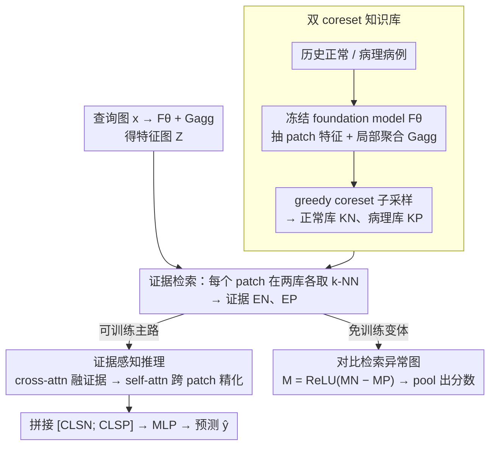

# Evidential Reasoning Advances Interpretable Real-World Disease Screening

**会议**: ICML 2026  
**arXiv**: [2605.15171](https://arxiv.org/abs/2605.15171)  
**代码**: https://github.com/DopamineLcy/EviScreen (有)  
**领域**: 医学图像 / 可解释 AI / 异常检测  
**关键词**: 双知识库、循证推理、coreset 记忆库、对比检索、临床导向评测

## 一句话总结
EviScreen 用「正常 + 病理」双知识库做区域级证据检索，再以 cross-attention + self-attention 在当前病例和证据间做循证推理，既给出**回溯式可解释性**（哪几个历史病例支持当前判断）又给出**定位可解释性**（对比检索得到的异常图），在 4 个真实外部测试集上把高召回处的特异性提升到 SOTA。

## 研究背景与动机

**领域现状**：医学影像疾病筛查目前有两条主流：(a) 偏离式预测（unsupervised anomaly detection，PatchCore、SimpleNet…）只用正常样本建模，遇到偏离即报警；(b) 直接预测（二分类全监督），用 Grad-CAM 做事后定位。

**现有痛点**：(a) 完全没利用病理样本中丰富的信息，对复杂模态（胸片、皮肤镜）能力有限；(b) Grad-CAM 类事后图被多项研究证明定位质量差，且没法解释「为什么这块区域看起来像病灶」 — 缺少**循证推理**。原型方法 (ProtoPNet 等) 用固定数量原型代表预设类，扩展性差、覆盖不了真实临床多样形态。

**核心矛盾**：临床医生看片是「拿出过往相似病例对照」做决策；现有模型要么不看历史病例，要么看的是「学到的几十个抽象原型」 — 与真实诊断流程脱节。

**本文目标**：(1) 设计一个能像医生一样「从可扩展病例库里找相似区域级证据」的筛查框架；(2) 建立面向临床的真实评测（外部测试 + 高召回处的特异性）。

**切入角度**：把异常筛查重塑为「检索 + 推理」两段式 — 用 foundation model 提区域特征，构建正常与病理两个 coreset 知识库；查询图像的每个 patch 在两库内做 $k$-NN 检索，再让模型基于这些证据 token 做 attention 推理。

**核心 idea**：用「正常 vs 病理」两个知识库做**对比检索**就能既给定位（异常图 $\mathbf M = \text{ReLU}(\mathbf M_N - \mathbf M_P)$）又给推理（cross-attention 把证据融进 query feature），把「事后 Grad-CAM」变成「内置证据流」。

## 方法详解

### 整体框架
EviScreen 把疾病筛查重塑成「先检索证据、再循证推理」的两段式流程，对应两个阶段。**阶段 1 构建双知识库**：把训练集切成建库子集 $\mathcal X^B_{N/P}$ 和训练子集 $\mathcal X^R_{N/P}$，用冻结的 foundation model $F_\theta$ 抽中间层 patch 特征、经局部聚合 $\mathcal G_{agg}$ 得到区域特征集合 $\mathcal S_{N/P}$，再用 greedy coreset 子采样压成紧凑的正常库 $\mathcal K_N$ 和病理库 $\mathcal K_P$。**阶段 2 推理**：查询图 $\mathbf x$ 抽出特征图 $\mathbf Z=\mathcal G_{agg}(F_\theta(\mathbf x))\in\mathbb R^{h\times w\times d}$，每个 patch 在两库各做 $k$-NN 检索拿到证据 $\mathbf E_N,\mathbf E_P\in\mathbb R^{h\times w\times k\times d}$，证据感知推理模块逐层把证据融进 query 特征，两支的 [CLS] 拼接送 MLP 得预测 $\hat y$；同时它还提供一个不训练任何参数的对比检索变体，用 $\mathbf M = \text{ReLU}(\mathbf M_N - \mathbf M_P)$ 直接 pool 出分数。

### 关键设计

**1. 双 coreset 知识库：用可扩展记忆同时表征正常与病理形态**

ProtoPNet 类原型方法只学固定 $K$ 个抽象原型，覆盖不了真实临床里千变万化的病灶形态，而病理图本身就是「正常 + 病灶」混在一起的脏数据，硬塞进预设类别的 prototype 容纳不下。EviScreen 改用 coreset：在建库子集 $\mathcal X^B_N,\mathcal X^B_P$ 上抽 patch 特征、局部聚合，再做贪心子采样得到两个库。子采样的优化目标是 $\mathcal K^*=\arg\min_{\mathcal K\subset\mathcal S}\max_{m\in\mathcal S}\min_{n\in\mathcal K}\|m-n\|_2$，即让原集合里每个点到所选子集的最近距离都尽量小——这是经典的 NP-hard 覆盖问题，用迭代贪心近似得到一个覆盖良好的紧凑子集。相比固定原型，coreset 容量能随数据自由扩张，新病例可以不断加进来，这正是 prototype 做不到的可扩展性。

**2. 证据感知推理：把检索到的证据真正写进特征，让预测可追溯**

光检索出 $k$ 个相似证据还不够，得让它们影响当前判断。每层先做 cross-attention，让 query patch 去聚合自己检索到的证据：

$$\mathbf T^\ell_N(i,j)=\operatorname{softmax}\big(\mathbf Z^\ell_N(i,j)\mathbf E_N(i,j)^\top/\sqrt d\big)\mathbf E_N(i,j)$$

聚合后 reshape 回特征图、再做 patch 间 self-attention 实现 inter-patch refinement，补上上下文一致性。正常分支 $\mathbf Z_N$ 和病理分支 $\mathbf Z_P$ 全程并行，最后 $\hat y=\text{MLP}([\mathbf Z_N^{\text{CLS}};\mathbf Z_P^{\text{CLS}}])$。这样每个预测都背着一组可追溯的近邻证据（哪几个历史病例支持了当前判断，即回溯式可解释性）；保留正常、病理两支而非单一相似度，等于保留了「这块像正常 vs 像病理」的二维信号，更贴近临床鉴别诊断的直觉。

**3. 对比检索异常图：不训练参数也能给出内生定位**

PatchCore 这类纯偏离式方法只用正常库 $\mathbf M_N$，会把所有罕见的正常变异都误标成异常。EviScreen 的 training-free 变体改用两库差分：每个 patch 算到两库 $k$-NN 的平均距离 $\mathbf M_N,\mathbf M_P\in\mathbb R^{h\times w}$，异常图取 $\mathbf M(i,j)=\text{ReLU}(\mathbf M_N(i,j)-\mathbf M_P(i,j))$，只有「离正常远、却离病理近」的区域才会高亮，最终分数由 $\mathbf M$ pool 得到。这一差分能滤掉非病理的偏离，定位更聚焦，而且整张异常图来自检索本身、与 Grad-CAM 那种事后梯度可视化机制完全不同，是内生的解释。它既是方法可解释性的基础，本身又是一个不含任何可学习参数的强 baseline。

### 损失函数 / 训练策略
只训练证据感知推理模块（cross/self-attention + MLP），foundation model 全程冻结，目标为二分类 BCE；training-free 变体完全无可学习参数。主要超参是检索的 $k$、知识库大小和 cross-attention 层数 $L$。

## 实验关键数据

### 主实验
10 个公开数据集，三大模态（眼底、胸片、皮肤镜），关键看 4 个**外部**测试集：JSIEC、RIADD、CheXpert、Derm12345。临床导向指标：AUROC、AP、Spe@95%R（95% 召回处的特异性）、Spe@99%R（99% 召回处）。结果（百分比）：

| 指标 | EviScreen | EviScreen-TF (训练免) | FM | PatchCore* | PatchCore | NFM-DRA | DRA | SCRD4AD | EDC | SimpleNet | CIPL |
|---|---|---|---|---|---|---|---|---|---|---|---|
| AUROC | **98.06** | 96.76 | 95.84 | 94.96 | 92.12 | 95.53 | 92.53 | 94.88 | 79.12 | 73.73 | 94.83 |
| AP | **96.10** | 94.20 | 94.24 | 89.61 | 86.62 | 93.23 | 89.53 | 89.85 | 71.44 | 57.66 | 91.36 |
| Spe@95%R | **94.74** | 91.48 | 87.95 | 87.26 | 81.09 | 90.37 | 80.12 | 88.50 | 51.45 | 53.81 | 87.33 |
| Spe@99%R | **91.62** | 87.74 | 79.29 | 83.31 | — | — | — | — | — | — | — |

### 消融实验

| 配置 | 关键效果 | 说明 |
|---|---|---|
| Full EviScreen | 全指标最佳 | 双库 + 推理模块 |
| 去掉病理库（只用 $\mathcal K_N$） | Spe@95%R 下降 | 验证 dual bank 的不可替代 |
| 用固定原型 (ProtoPNet 风) | 性能下降 | coreset 比固定原型容量大 |
| 仅 cross-attention（去 self） | 略降 | inter-patch refinement 提供上下文一致性 |
| training-free 变体 | 已超 PatchCore | 单靠对比检索就是强 baseline |

### 关键发现
- **临床指标差距更大**：相比常用 AUROC，本文方法在 Spe@95%R、Spe@99%R 上对 baseline 的领先幅度更显著（如 Spe@99%R 高 PatchCore* 8.3 个点），说明在临床真正关心的高召回区间，循证推理优势凸显。
- **training-free 变体即超 PatchCore**：仅对比检索就比传统 anomaly detection baseline 强，验证「双库 + 对比」这一思路本身的有效性。
- **可扩展性**：coreset 大小可线性扩张，便于将来不断加新病例 — 这是 prototype 方法做不到的。

## 亮点与洞察
- **可解释性双轨**：同时给出回溯（retrospection）+ 定位（localization）两类解释 — 远比 Grad-CAM 一张热图更接近放射科医生的实际诊断流程。
- **临床导向评测框架**：以 10 数据集 + 外部测试 + Spe@high-Recall 为核心，是少数真正面向临床部署的医学影像评测设计，可作为社区参考。
- **可迁移的「对比检索 + 注意力融合」**：这一范式可直接搬到其它领域（工业缺陷检测、卫星变化检测）中所有需要「正常 vs 异常」鉴别的任务。

## 局限与展望
- 双库构建需要足够多且代表性强的病理样本；在罕见病或新发疾病上「病理库稀疏」会让对比检索失效。
- foundation model 全程冻结，效果天花板被它绑死；针对医学 domain 的 foundation model 持续替换可带来增益。
- 推理时每个 patch 都做 $k$-NN，库大时延迟显著；coreset 增长策略与近似 NN 加速结合是显然的扩展点。
- 当前 reward / loss 不显式监督「证据—预测一致性」，未来可加 contrastive 项使检索到的证据真正主导预测。

## 相关工作与启发
- **vs PatchCore / SimpleNet**：同样用 coreset 记忆库，但只用正常库；EviScreen 把病理库作为对照引入，对比检索定位更精准。
- **vs ProtoPNet / 原型方法**：固定原型数受限于预设类别；coreset 容量自由、覆盖更广。
- **vs Grad-CAM 类事后解释**：本文解释是「内生」的（来自检索 + cross-attention），不依赖梯度可视化技巧，解释质量更高更稳。

## 评分
- 新颖性: ⭐⭐⭐⭐ dual coreset + 对比检索 + 双轨可解释的组合在医学筛查任务中是新颖完整方案
- 实验充分度: ⭐⭐⭐⭐⭐ 10 数据集、3 模态、外部测试 + 临床指标 + training-free 消融非常全面
- 写作质量: ⭐⭐⭐⭐ 三大局限清单 + 三大贡献清单结构清晰，图 1 三种范式对比简洁有力
- 价值: ⭐⭐⭐⭐⭐ 给出可部署的临床导向 pipeline 与评测协议，对医学影像社区有方法 + benchmark 双重贡献

<!-- RELATED:START -->

## 相关论文

- [\[AAAI 2026\] PulseMind: A Multi-Modal Medical Model for Real-World Clinical Diagnosis](../../AAAI2026/medical_imaging/pulsemind_a_multi-modal_medical_model_for_real-world_clinical_diagnosis.md)
- [\[AAAI 2026\] Experience with Single Domain Generalization in Real World Medical Imaging Deployments](../../AAAI2026/medical_imaging/experience_with_single_domain_generalization_in_real_world_medical_imaging_deplo.md)
- [\[ICML 2026\] Marrying Generative Model of Healthcare Events with Digital Twin of Social Determinants of Health for Disease Reasoning](marrying_generative_model_of_healthcare_events_with_digital_twin_of_social_deter.md)
- [\[AAAI 2026\] DeepGB-TB: A Risk-Balanced Cross-Attention Gradient-Boosted Convolutional Network for Rapid, Interpretable Tuberculosis Screening](../../AAAI2026/medical_imaging/deepgb-tb_a_risk-balanced_cross-attention_gradient-boosted_convolutional_network.md)
- [\[ICLR 2026\] Glance and Focus Reinforcement for Pan-cancer Screening](../../ICLR2026/medical_imaging/glance_and_focus_reinforcement_for_pan-cancer_screening.md)

<!-- RELATED:END -->
