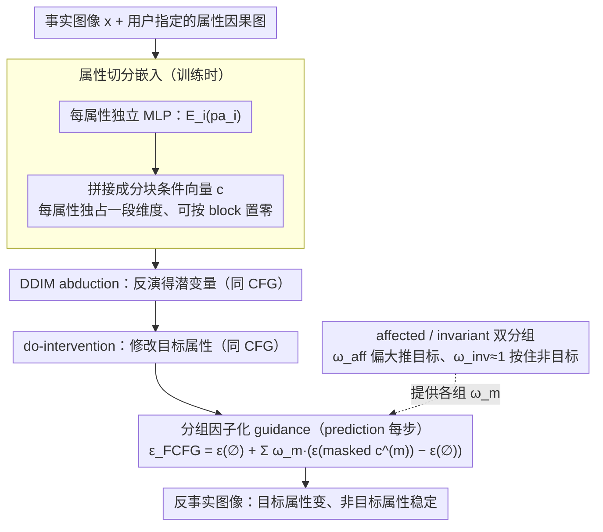

# Factored Classifier-Free Guidance

**会议**: ICML 2026  
**arXiv**: [2506.14399](https://arxiv.org/abs/2506.14399)  
**代码**: 无公开链接  
**领域**: 扩散模型 / 反事实生成 / 医学图像  
**关键词**: Classifier-Free Guidance, 反事实生成, 因果干预, 属性放大, DDIM

## 一句话总结
本文识别出 CFG 在扩散模型反事实生成中存在「属性放大 (attribute amplification)」失效模式——单一全局 $\omega$ 会把本不该改变的属性一起放大，并提出 FCFG：按因果图分组、为每组属性分配独立 guidance 权重，从而在 CelebA-HQ / EMBED / MIMIC-CXR 上显著降低非目标属性漂移、改善反事实可逆性。

## 研究背景与动机
**领域现状**：扩散模型已成为条件生成的事实标准，反事实生成 (counterfactual generation) 的标准流程是 DDIM inversion (abduction) → do-intervention (action) → 用 CFG 引导的反向 DDIM (prediction) 三段式。Classifier-Free Guidance 通过 $\epsilon_\text{CFG}=(1-\omega)\epsilon_\theta(\varnothing)+\omega\epsilon_\theta(\mathbf{c})$ 在条件/无条件分数间插值，被广泛用作「让生成图像更显著反映目标属性」的旋钮。

**现有痛点**：CFG 的 $\omega$ 是全局标量，作用于整个条件向量 $\mathbf{c}$。在反事实场景下，$\mathbf{c}$ 通常编码多个属性（如性别、年龄、笑容），用户只想干预其中一个，却被迫给所有属性都乘上同一个 $\omega$。结果：do(Male=no) 时连 Smiling 也被放大，do(Young=no) 时身份与表情一起变；这种 off-target 改动违反因果图的不变性公理，叫做属性放大。

**核心矛盾**：「intervention effectiveness 越强（更强地改目标属性）」与「保持非目标属性的稳定性」之间存在根本张力——只要 guidance 是 scalar，二者必然耦合。Xia et al. (2024) 把这种现象归咎于训练时的 predictor-finetuning，本文则指出 guidance 机制本身就是元凶。

**本文目标**：在不改训练、不改模型架构的前提下，仅在 inference 时打破属性间耦合，给每个语义/因果组单独的 guidance 强度。

**切入角度**：如果各属性组在给定 $\mathbf{x}_t$ 下条件独立 $p(\mathbf{pa}\mid\mathbf{x}_t)=\prod_m p(\mathbf{pa}^{(m)}\mid\mathbf{x}_t)$，那么 proxy posterior 自然可分解为 $p^\omega(\mathbf{x}_t\mid\mathbf{pa})\propto p(\mathbf{x}_t)\prod_m p(\mathbf{pa}^{(m)}\mid\mathbf{x}_t)^{\omega_m}$——每组各有自己的 $\omega_m$，CFG 是 $M=1$ 的特例。

**核心 idea**：用「按属性分块的嵌入 + 按属性组分配 $\omega_m$」改写 CFG 的 score 更新，把全局放大改成可分组的细粒度放大；不动模型、不动训练，仅 inference 时间生效。

## 方法详解

### 整体框架
FCFG 想解决的是「单一全局 $\omega$ 会把不该改的属性也一起放大」，做法是把 CFG 里那个标量旋钮拆成一组按因果图分配的向量旋钮，且全程只动 inference、不碰训练与架构。整条链路嵌在 DDIM 反事实推理的 abduction→action→prediction 三步里：abduction 与 action 两步和原 CFG 完全一致，只在 prediction 这一步把去噪用的 $\epsilon_\text{CFG}$ 换成 $\epsilon_\text{FCFG}$。换言之，训练时学到的是一个把各属性嵌入分块拼接的条件扩散模型，推理时再按用户给的属性分组、给每组一个独立的 guidance 强度去重新组合 score。

### 关键设计

**1. 属性切分嵌入：让每个属性在条件向量里独占一段维度**

常规条件扩散往往把多个属性塞进同一个稠密向量，语义在嵌入空间互相纠缠，推理时根本没法「只松开某一个属性」。FCFG 改成给每个属性 $pa_i$ 配一个独立 MLP $\mathcal{E}_i:\mathbb{R}^{d_i}\to\mathbb{R}^d$，把它们的输出拼起来得到 $\mathbf{c}=\text{concat}(\mathcal{E}_1(pa_1),\dots,\mathcal{E}_K(pa_K))\in\mathbb{R}^{Kd}$，于是每个属性恰好占据 $\mathbf{c}$ 里一段互不重叠的 block。要在推理时屏蔽第 $i$ 个属性，只需把它那段 block 乘上指示位 $\delta_i^{(m)}\in\{0,1\}$ 置零即可。这些 $\mathcal{E}_i$ 不是独立预训练的特征提取器，而是和去噪网络端到端联合训练——所以它本质上是一个轻量的训练时设计，目的就是为后续任意分组 guidance 预留一个干净的 mask 接口。

**2. 分组因子化 guidance：把全局 $\omega$ 升级成每组一个 $\omega_m$**

CFG 的根本问题在于它隐含假设「所有属性条件独立且权重相同」。FCFG 只放松后半句：假设各属性组在给定 $\mathbf{x}_t$ 下条件独立 $p(\mathbf{pa}\mid\mathbf{x}_t)=\prod_m p(\mathbf{pa}^{(m)}\mid\mathbf{x}_t)$，于是 proxy posterior 自然分解为

$$p^\omega(\mathbf{x}_t\mid\mathbf{pa})\propto p(\mathbf{x}_t)\prod_m p(\mathbf{pa}^{(m)}\mid\mathbf{x}_t)^{\omega_m}$$

每组带自己的指数 $\omega_m$。对它取对数梯度，CFG 那个两项 score 差就被扩展成 $M$ 项加权和：

$$\epsilon_\text{FCFG}=\epsilon_\theta(\varnothing)+\sum_m \omega_m\big(\epsilon_\theta(\underaccent{\rule{4.09723pt}{0.4pt}}{\mathbf{c}}^{(m)})-\epsilon_\theta(\varnothing)\big)$$

其中 $\underaccent{\rule{4.09723pt}{0.4pt}}{\mathbf{c}}^{(m)}$ 是只保留第 $m$ 组属性、其余 block 置零的 masked embedding。这个公式是 CFG 的严格泛化：$M=1$ 时退回标准 CFG，$M=K$ 时给每个属性各一个独立权重。有效之处在于，理论上它最贴合因果图（每组放大强度可以不同），而代价仅仅是推理时多跑几次条件分支、改一下 score 的线性组合。

**3. affected/invariant 双分组：把抽象的「组」落到反事实公理上**

光有「可以分组」还不够，得说清楚怎么分。FCFG 给出最自然的一种：按用户假设的因果图，把被干预属性及其因果后代归为 affected 组、其余归为 invariant 组，分别用 $\omega_\text{aff}$ 和 $\omega_\text{inv}$ 控制。典型反事实 do$(A)$ 里设 $\omega_\text{aff}$ 偏大（如 $2.5$）去强推目标属性的变化，同时让 $\omega_\text{inv}\approx 1$（即不放大）把非目标属性按住不动。这正好对应反事实公理「干预之外的属性应保持稳定」——它把 invariant 属性上的漂移 $\Delta$ 几乎压到 $0$，又不牺牲 target 上的 $\Delta$，从根上消解了 effectiveness 与稳定性那对张力。当所有属性都被同步干预、没有 invariant 组可分时，$M=2$ 会退化回全局 CFG，此时框架天然支持切到 $M=K$ 的 per-attribute 模式，给每个属性单独一个 $\omega$。

### 损失函数 / 训练策略
训练目标完全沿用标准条件扩散 loss $\mathbb{E}\|\epsilon-\epsilon_\theta(\mathbf{x}_t,t,\mathbf{c})\|^2$，并继续做经典的 classifier-free dropout（整段 $\mathbf{c}$ 随机替换为 $\varnothing$），不引入任何新损失；FCFG 只在推理时改 score 的算法。作者坦言这带来轻微的 train-test mismatch——训练时模型见到的要么是完整 $\mathbf{c}$ 要么是全 null，推理时却会遇到「部分 block 为 null」的 masked embedding——但实验里并未观察到由此引发的稳定性问题。由于分组思想只是改写 score 的线性组合，它和 CFG++、APG 这类改进版 guidance 正交，把同样的因子化嵌进它们的 score 公式即可叠加使用。

## 实验关键数据

### 主实验

| 数据集 | 任务 | 指标 | CFG | FCFG | 说明 |
|--------|------|------|-----|------|------|
| CelebA-HQ 64×64 | do(Smiling) | Δ target ↑ / Δ off-target ↓ | 高 target 但 off-target 也高 | 接近 target / off-target 几乎 0 | 关键 off-target 抑制 |
| CelebA-HQ | do(Smiling) 反向重建 MAE/LPIPS | 越低越好 | 随 $\omega$ 急增 | 在相同 $\omega$ 下显著更低 | 身份保持更好 |
| EMBED 192×192 (乳腺) | do(circle) | Δ density (off-target) | 显著增加 | 接近 0 | 医学上避免虚假特征放大 |
| MIMIC-CXR | do(finding) | Δ race/sex (off-target) | 出现明显漂移 | 大幅压制 | 临床公平性意义大 |
| MIMIC-CXR | do(finding) Δ target AUC | +18.8 | +18.8 (FCFG) vs CFG +X | off-target 仅 +0.6 | 同等 target effectiveness 下 off-target 减少一个量级 |

### 消融实验

| 配置 | 效果 | 说明 |
|------|------|------|
| $M=1$（退化 CFG） | 出现 attribute amplification | 验证 FCFG 是 strict generalization |
| 两组 affected/invariant ($M=2$) | 主实验设定，最佳 effectiveness/off-target trade-off | 默认配置 |
| 多属性独立 ($M=K$) | 支持 do(Smiling,Male,Young) 多干预，每属性独立 $\omega_s,\omega_m,\omega_y$ | 当全部属性都被干预时，$M=2$ 退化回全局 CFG，必须用 $M=K$ |
| FCFG + CFG++ / FCFG + APG | 在原 advanced guidance 上叠加 | 同样改善 off-target amplification，框架兼容 |
| 对比 SA-DCG / HVAE / HVAE-soft | CelebA-HQ do(Smiling) target +13.1 / off-target -1.5 vs SA-DCG +12.9 / +3.0 | target 略胜，off-target 反向（更不漂移） |

### 关键发现
- **属性放大的根源**：作者通过控制实验（CelebA-HQ 三独立属性）证明，放大不是数据集 artefacts 或因果图错配造成的，而是 guidance 机制本身——这把锅从「数据/模型」甩到了「inference 算法」上。
- **FID 反向获益**：直觉上多组分 score 可能更不稳定，但实验中 FCFG 在 CelebA-HQ 上反而显著优于全局 CFG 的 FID，说明减少 off-target 漂移有助于停留在数据流形上。
- **反事实可逆性**：在 do(A) 后再做 do$(A^{-1})$，CFG 会因 off-target 漂移残留导致 MAE/LPIPS 越来越差，FCFG 几乎保持初值水平，是评估 counterfactual soundness 的良好新指标。
- **多属性极端情形**：当所有属性都被同步干预时，$M=2$ 分组失效（没有 invariant 组），此时唯一出路是 $M=K$ 的 per-attribute FCFG，作者把这个 corner case 也讨论了。

## 亮点与洞察
- 把「CFG 的全局 $\omega$」直接拆成「按因果图分组的 $\omega_m$ 向量」，是个一拍脑袋就明白却之前没人系统做的好点子；理论上从 proxy posterior 推回 score 公式，干净利落。
- 提出 attribute-split embedding 这个轻量训练时设计，使后续任意 inference 时分组都可行，相当于把「为未来准备 mask 接口」前置——对任何条件扩散框架都有借鉴价值。
- 对反事实生成定义了「intervention effectiveness vs reversibility」双维评估，比单看 FID 更贴近因果公理；这套评估也可借鉴到 video editing、3D consistency 等条件生成场景。
- 兼容 CFG++ / APG 等更先进 guidance 变体，说明这是个正交于 score 改进路线的 dimension——以后所有 conditional sampling 改进都可考虑「先因子化再改进」。

## 局限与展望
- 依赖预先指定的因果图或语义分组，FCFG 本身不解决因果发现；当属性间关系未知或动态时，分组选错可能反而放大问题。
- $\omega_m$ 仍需人为调，未来可结合输入条件或时间步自适应选 $\omega$，做 timestep-aware FCFG。
- 训练-测试 mismatch 是轻度但存在的问题：训练只见过全 null，推理出现 group-mask，当 $M$ 很大、$\omega$ 很强时可能出现稳定性问题。
- 当所有属性都被同步干预时，两组划分退化为全局 CFG，又得依赖更细粒度的 $M=K$，这个 corner case 暴露了分组的脆弱性。
- 实验最大分辨率 192×192，对高分辨率 latent diffusion / SDXL / 视频扩散是否同样有效仍待验证。

## 相关工作与启发
- **vs 标准 CFG (Ho & Salimans 2022)**：本文是其严格泛化，$M=1$ 时完全等价；通过条件独立假设把 $\omega$ 升级为向量 $\omega_m$。
- **vs CFG++ (Chung 2025) / APG (Sadat 2025)**：他们改进 score 形状或 manifold 约束以提高保真度，但仍是全局 $\omega$；FCFG 与之正交，可叠加。
- **vs Compositional Diffusion (Liu 2022) / Shen 2024**：那些方法靠空间 mask 或多个条件模型实现局部控制；FCFG 仅需一个模型 + 语义级分组。
- **vs HVAE / HVAE-soft (Ribeiro 2023; Xia 2024)**：他们通过 predictor-finetune 在训练时修正属性放大；FCFG 把锅甩给 inference 端、训练完全不变，更轻量。
- **vs SA-DCG (Rasal 2025)**：他们用 diffusion autoencoder + 身份保持优化，更重；FCFG 在同 target effectiveness 下 off-target 更低且 FID 更优。

## 评分
- 新颖性: ⭐⭐⭐⭐ 想法朴素但击中要害，是 CFG 公式的自然但被忽视的扩展
- 实验充分度: ⭐⭐⭐⭐ 覆盖 CelebA-HQ/EMBED/MIMIC-CXR 三数据集 + 与 HVAE/SA-DCG/CFG++/APG 多角度对比，但缺高分辨率 latent diffusion 验证
- 写作质量: ⭐⭐⭐⭐ 数学推导清晰，failure mode 用 Δ 指标量化，可视化对比直观
- 价值: ⭐⭐⭐⭐ 即插即用，对医学反事实推理、公平性评估有直接价值，社区采纳成本极低

<!-- RELATED:START -->

## 相关论文

- [\[ICML 2026\] DP-KFC: Data-Free Preconditioning for Privacy-Preserving Deep Learning](dp-kfc_data-free_preconditioning_for_privacy-preserving_deep_learning.md)
- [\[NeurIPS 2025\] Exploring and Leveraging Class Vectors for Classifier Editing](../../NeurIPS2025/medical_imaging/exploring_and_leveraging_class_vectors_for_classifier_editing.md)
- [\[CVPR 2026\] Prototype-Based Knowledge Guidance for Fine-Grained Structured Radiology Reporting](../../CVPR2026/medical_imaging/prototypebased_knowledge_guidance_for_finegrained.md)
- [\[CVPR 2026\] Parameter-efficient Prompt Tuning and Hierarchical Textual Guidance for Few-shot Whole Slide Image Classification](../../CVPR2026/medical_imaging/parameter-efficient_prompt_tuning_and_hierarchical_textual_guidance_for_few-shot.md)
- [\[AAAI 2026\] qa-FLoRA: Data-free Query-Adaptive Fusion of LoRAs for LLMs](../../AAAI2026/medical_imaging/qa-flora_data-free_query-adaptive_fusion_of_loras_for_llms.md)

<!-- RELATED:END -->
