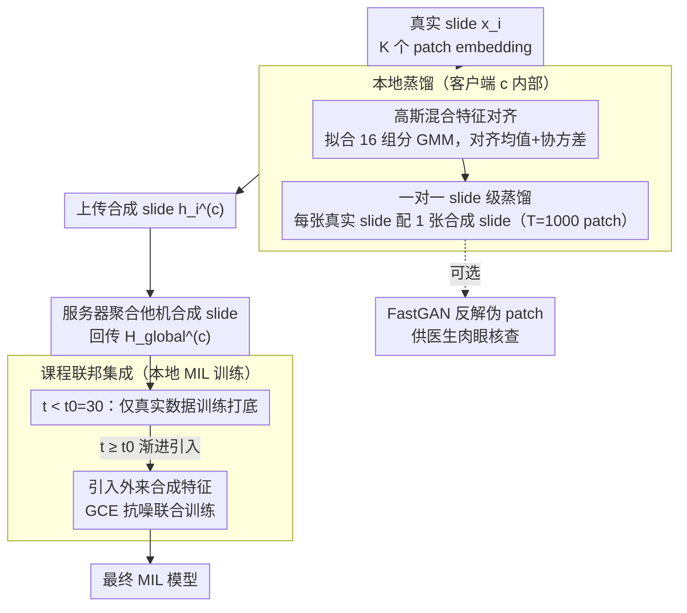

# Federated Distillation for Whole Slide Image via Gaussian-Mixture Feature Alignment and Curriculum Integration

**会议**: ICML 2026  
**arXiv**: [2605.00578](https://arxiv.org/abs/2605.00578)  
**代码**: 无公开链接  
**领域**: 联邦学习 / 病理学 / 数据集蒸馏  
**关键词**: WSI, 多实例学习, Gaussian Mixture, 联邦蒸馏, 课程学习

## 一句话总结
本文提出 FedHD：在异构联邦病理学场景下，用 Gaussian-mixture 特征对齐做「一对一」WSI 特征级蒸馏，再通过课程学习把跨机构合成特征逐步注入本地训练，使各机构能在不共享原始数据、不交换模型参数的前提下协作，且兼容异构 MIL 架构与特征提取器，在 TCGA-IDH / CAMELYON16 / CAMELYON17 上全面超越现有联邦与蒸馏基线。

## 研究背景与动机
**领域现状**：WSI（千万级像素全幅切片）的癌症诊断依赖 MIL（CLAM、TransMIL、ACMIL 等），但单中心数据稀缺、隐私法规又限制跨机构共享，联邦学习是天然解法。然而真实医院在算力与建模偏好上差异极大，常常各自用不同特征提取器（ResNet50/UNI/PhV2）和不同 MIL 架构，导致传统参数平均（FedAvg、FedMut、FedImpro）面对的是「不可对齐的参数空间」。

**现有痛点**：(1) FedDD（联邦数据蒸馏）改成共享合成数据集解决参数不兼容，但现有方法是为自然图像设计的：(a) 单 Gaussian/均值匹配假设无法刻画 WSI 内部 patch 特征的**多组分分布**（不同形态学组分共存）；(b) 追求极致压缩，把几千 patch 压成几张合成图，对本就样本量小、slide 间高度异质的 WSI 来说反而过压，丢掉细粒度诊断 cue。

**核心矛盾**：在 WSI 上「样本量小 + 类内异质大 + 客户端模型异构」三件事撞一起，传统 DD 的「极致压缩 + 单组分匹配」假设全部失效，又没法用 FedAvg 类参数共享方法。

**本文目标**：(1) 让每个客户端独立产生既保留诊断细节、又能被任意 MIL 架构利用的合成特征；(2) 跨机构整合时避免直接拼接造成的 domain shift；(3) 保证可解释性（医学场景重要）。

**切入角度**：从 patch 级 embedding 出发而非 pixel 级——既贴合 MIL pipeline，又把蒸馏维度从 $256\times 256\times 3$ 降到 $\mathbb{R}^d$；引入「一对一」slide 级合成（每张真实 slide 对应一张合成 slide）替代「多对一」聚合，避免丢失 slide-level 多样性。

**核心 idea**：把 WSI patch 特征建模为 16-component GMM，对齐合成集每个组分的均值与协方差（而非单一全局均值），并以 slide 为单位做一对一蒸馏；联邦阶段用课程学习——先让本地模型在真实数据上收敛，再渐进加入其他客户端的合成特征作为辅助监督。

## 方法详解

### 整体框架
FedHD 把协作拆成「本地蒸馏 + 课程联邦」两段，全程不交换原始切片也不交换模型参数。第一段在每个客户端 $c$ 内部进行：把每张真实 slide $x_i^{(c)}$（含 $K$ 个 patch embedding $b_k^{i,c}\in\mathbb{R}^d$）的特征分布拟合成一个 GMM，再优化一张同尺寸的合成 slide $h_i^{(c)}$（含 $T$ 个可学 patch embedding），让它的 GMM 在均值和协方差上逼近真实 GMM，于是合成切片就成了真实切片在特征空间的「浓缩替身」。第二段做跨机构整合：客户端把合成切片 $\{h_i^{(c)}\}$ 上传，服务器把除本机外所有客户端的合成切片聚成 $\mathcal{H}_\text{global}^{(c)}$ 回传；本地模型先在真实数据上训出底子，到第 $t_0$ 轮后才按课程逐步引入这批外来合成特征，用抗噪 loss 联合训练。最后一个可选的 FastGAN 生成器能把合成 embedding 反解成伪 patch，供医生肉眼核查。

### 关键设计

**1. 高斯混合特征对齐：用 16 个组分而非单一均值刻画 WSI 内部分布**

WSI 一张切片里同时有肿瘤区、正常区、边界区等多种形态学组分，patch 特征天然呈多峰。先前的数据蒸馏通用做法 $\sum_y \|\Phi_{T_y}-\Phi_{S_y}\|^2$ 只匹配类内单一中心，等于默认特征是单 Gaussian，套到 WSI 上会把诊断最关键、却数量稀少的组分（比如肿瘤 patch）平均成「灰色中值」，下游 MIL 直接掉点。FedHD 改成在每张真实 slide 的 patch 特征 $\{b_k^{i,c}\}_{k=1}^K$ 上估一个 $M=16$ 组分的 GMM $P_\text{real}^{(c,i)}\approx\sum_m \pi_m\,\mathcal{N}(\mu_m^{(c,i)},\Sigma_m^{(c,i)})$，合成 slide 的 patch $\{p_j^{i,c}\}_{j=1}^T$ 也按同一 GMM 分配到各组分得到 $\{\hat\mu_m,\hat\Sigma_m\}$，然后用 $\mathcal{L}_\text{align}^{(c)}=\sum_m\big(\|\mu_m-\hat\mu_m\|_2^2+\|\Sigma_m-\hat\Sigma_m\|_F^2\big)$ 同时对齐每个组分的均值和协方差。因为协方差也进了 loss，组分的形状和扩散范围都被保住，少数关键组分不会被多数组分淹没——这正是它把领域里的「形态学多组分」先验硬编码进蒸馏目标的地方。

**2. 一对一 slide 级蒸馏：每张真实切片配一张合成切片，故意不做极致压缩**

自然图像蒸馏追求 IPC=1/10/50 的极致压缩，是因为类内样本相对同质、压几张代表图够用；但 WSI 数据集本身就小（几百例）、slide 之间又高度异质，再把多张 slide 压成几张就是全员失真。FedHD 反其道而行，客户端 $c$ 维持 $N$ 张合成 slide（$N$ 等于本地真实 slide 数），真实与合成严格一对一，每张合成 slide 各持 $T=1000$ 个 patch embedding 单独对齐。这样 slide-level 的多样性被原样保留，上传的 payload 是 $O(NTd)$ 浮点，量级和直接传完整 patch 特征相当，但客户端从头到尾没真正交出过任何真实 patch，隐私边界没破。

**3. 课程联邦集成：本地先收敛再吸外援，并用 GCE 抗噪**

把跨机构合成数据从第 0 轮就直接混进训练会引入 domain shift，模型还没站稳就被外部噪声带偏。FedHD 用课程学习给本地训练分阶段：总目标 $\mathcal{L}_\text{local}^{(c)}=\mathcal{L}_\text{real}^{(c)}+\mathcal{L}_\text{GCE}^{(c)}\cdot\mathbb{I}(t\ge t_0)$，前 $t_0=30$ 个 epoch 只看真实数据把底子打牢，之后才放外来合成特征进来当辅助监督——相当于先修完「先修课」再学进阶内容。引入的合成数据可能带 label noise，所以这一段不用普通 CE 而用 Generalized Cross-Entropy $\mathcal{L}_\text{GCE}=\frac{1-p_y^q}{q}$（$q=0.7$），它在 $q\to 0$ 时退化为对噪声更稳健的 MAE，从而压住合成标签的潜在错误。

### 损失函数 / 训练策略
本地蒸馏 1000 iter，本地 MIL 训练 50 epoch，联邦只需单轮通信；GMM 组分 $M=16$（按 Song 2024 经验选）、合成 patch 数 $T=1000$、GCE 参数 $q=0.7$、课程阈值 $t_0=30$。可视化分支用 FastGAN 生成器，联合 $\mathcal{L}_\text{GAN}^{(c)}+\lambda_\text{rec}\mathcal{L}_\text{rec}^{(c)}$ 把合成 embedding 反解成伪 patch。

## 实验关键数据

### 主实验

| 数据集 | Client/setting | FedHE | DESA | FedDGM | HistoFS | FedWSIDD | **FedHD** |
|--------|---------------|-------|------|--------|---------|----------|-----------|
| CAM16 C1 [R50+CLAM] | Acc | 72.7 | 77.0 | 77.0 | 82.4 | 83.7 | **85.1** |
| CAM16 C2 [UNI+TransMIL] | Acc | 77.7 | 86.2 | 87.8 | 91.3 | 93.2 | **95.8** |
| CAM16 Avg | Acc | 75.2 | 81.9 | 83.4 | 86.7 | 88.7 | **91.2** |
| CAM17 C1 [UNI+CLAM] | Acc | 72.3 | 72.3 | 74.3 | 75.9 | 77.3 | **83.6** |
| CAM17 C3 [R50+ACMIL] | Acc | 77.0 | 78.0 | 79.0 | 79.0 | 79.0 | **84.0** |
| CAM17 C4 [PhV2+TrMIL] | Acc | 73.7 | 78.3 | 79.9 | 82.3 | — | — |

（FedHD 在所有客户端 + 异构特征提取器 + 异构 MIL 架构组合上均取得 Acc / MCC 最优；CAM17 上对各 [feature, MIL] 配对的提升尤其明显。）

### 消融实验

| 配置 | 作用 | 说明 |
|------|------|------|
| 单 Gaussian (M=1) vs GMM (M=16) | M=16 显著优于单均值 | 验证多组分建模必要性 |
| 一对一 vs 多对一压缩 | 一对一保留诊断多样性 | WSI 高异质性下过压会掉点 |
| 无课程 (直接 mix) vs 课程 $t_0=30$ | 课程后期再加入合成 | 防止早期被外部噪声拉偏 |
| CE vs GCE ($q=0.7$) | GCE 提高鲁棒性 | 合成数据潜在 label noise 被压制 |
| 通信 payload $O(NTd)$ | 单轮通信即可 | 比迭代式 FedAvg 通信成本低 |
| FastGAN 解码 | 可解释伪 patch | 满足医学审核需要 |

### 关键发现
- **多组分匹配是关键**：单均值匹配（FedWSIDD 等 baseline）在 WSI 上掉点严重；FedHD 用 GMM 同时匹配均值+协方差，对肿瘤等少数组分保护明显。
- **架构无关的协作**：传统 FedAvg 在 [R50+CLAM] vs [UNI+TransMIL] vs [PhV2+TrMIL] 异构组合下根本无法工作，FedHD 用特征级蒸馏完美绕开参数空间不兼容。
- **课程比直接 mix 更稳**：直接把外部合成数据从 epoch 0 就加入会让某些客户端（少数类极端不均的 CAM17 C3）性能下降；$t_0=30$ 的 warm-up 提供稳定基础。
- **可解释模块的临床价值**：FastGAN 反解的伪 patch 可用于医生人工核查，缓解黑盒担忧——这是医学落地的关键缺口。

## 亮点与洞察
- 用 GMM 替代单均值是个非常贴合 WSI 物理形态的设计，把「形态学多组分」这一领域知识硬编码进 DD 损失，是 domain-aware 蒸馏的好例子。
- 一对一 slide 级蒸馏的「反潮流」选择（明确不追求极致压缩）反映了对 WSI 数据特性的清晰认识——不是所有领域都适合 IPC=1。
- 课程学习思想在「跨客户端合成数据集成」语境下的应用很有启发性：可推广到任何「自蒸馏 → 联邦集成」流程，例如联邦语言模型/联邦推荐系统。
- 单轮通信 + 特征级 payload 设计在医院低带宽、合规审计严格的环境下非常实用；外加 GCE 抗噪和 FastGAN 可视化，工程完备性高。

## 局限与展望
- GMM 组分数 $M=16$、合成 patch 数 $T=1000$ 是按经验给出，未必对所有 WSI 数据集最优；自动选 $M$ 或贝叶斯非参（DPGMM）是自然方向。
- 单轮通信简单但不一定收敛到最优——多轮迭代蒸馏可能更好，作者未讨论。
- 客户端少（CAM16 仅 2 个、CAM17 5 个）使得课程阈值 $t_0$ 调参较容易，扩展到几十/上百客户端的伸缩性未验证。
- GMM 协方差 $\Sigma_m$ 在高维 $d$（如 UNI 1024d）下 $O(d^2)$ 计算/存储成本高，论文未给出大 $d$ 下的开销分析。
- FastGAN 解码出的伪 patch 与真实组织的可信度需病理学家系统评估，目前仅展示视觉合理性，未做盲评。

## 相关工作与启发
- **vs FedAvg / FedMut / FedImpro**：传统参数共享方法在异构 MIL 架构下根本不可行；本文用特征级蒸馏绕开这一限制。
- **vs FedHisto (Lu 2022) / HistoFS (Raswa 2025)**：他们假设同构 MIL + 算力均衡，本文明确目标异构场景，更贴合真实医院网络。
- **vs FedWSIDD (Jin 2025)**：同样做联邦 WSI 蒸馏，但用单均值匹配；本文证明这种简化在 WSI 上严重损失诊断细节。
- **vs FedD3 (Song 2023) / FedDGM (Jia 2025)**：他们做个性化 FL（解纠缠 dual decoder / 扩散模型生成 latent），算力开销大；FedHD 更轻量且 architecture-agnostic。
- **vs 自然图像 DD (DM, MTT)**：本文反向倡导「不要极致压缩」——这一观察对其他「小数据 + 高异质」领域（罕见病、卫星遥感）也有借鉴价值。

## 评分
- 新颖性: ⭐⭐⭐⭐ GMM 多组分对齐 + 一对一蒸馏 + 课程联邦三件套，针对 WSI 异构 FL 场景的组合很有针对性
- 实验充分度: ⭐⭐⭐⭐ 3 数据集 × 多客户端 × 异构 [feature, MIL] 配对，统计显著性标注规范
- 写作质量: ⭐⭐⭐⭐ 动机-方法-实验逻辑通顺，损失函数与超参表清晰
- 价值: ⭐⭐⭐⭐ 直接面向医学联邦落地中的「异构架构 + 隐私 + 可解释」三难，工程性强

<!-- RELATED:START -->

## 相关论文

- [\[CVPR 2026\] MUSE: Harnessing Precise and Diverse Semantics for Few-Shot Whole Slide Image Classification](../../CVPR2026/medical_imaging/muse_harnessing_precise_and_diverse_semantics_for_few-shot_whole_slide_image_cla.md)
- [\[CVPR 2026\] Act Like a Pathologist: Tissue-Aware Whole Slide Image Reasoning](../../CVPR2026/medical_imaging/act_like_a_pathologist_tissue-aware_whole_slide_image_reasoning.md)
- [\[CVPR 2025\] WISE: A Framework for Gigapixel Whole-Slide-Image Lossless Compression](../../CVPR2025/medical_imaging/wise_a_framework_for_gigapixel_whole-slide-image_lossless_compression.md)
- [\[CVPR 2026\] Parameter-efficient Prompt Tuning and Hierarchical Textual Guidance for Few-shot Whole Slide Image Classification](../../CVPR2026/medical_imaging/parameter-efficient_prompt_tuning_and_hierarchical_textual_guidance_for_few-shot.md)
- [\[AAAI 2026\] Towards Effective and Efficient Context-aware Nucleus Detection in Histopathology Whole Slide Images](../../AAAI2026/medical_imaging/towards_effective_and_efficient_context-aware_nucleus_detection_in_histopatholog.md)

<!-- RELATED:END -->
