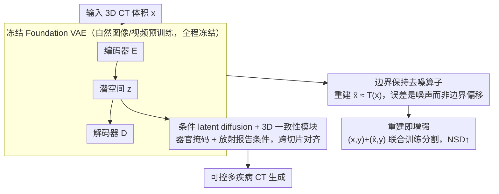

# Foundation VAEs for 3D CT Reconstruction, Augmentation, and Generation

**会议**: ICML 2026  
**arXiv**: [2605.30893](https://arxiv.org/abs/2605.30893)  
**代码**: https://github.com/qic999/Foundation-VAE  
**领域**: 医学图像 / 3D CT / 基础模型迁移  
**关键词**: 基础 VAE, CT 重建, CT 数据增强, 条件潜空间扩散, 零样本医学迁移

## 一句话总结
本文论证了一个反直觉但实用的发现——在自然图像/视频上预训练的 Foundation VAE 不需要任何医学微调就能作为统一接口同时支持 CT 重建、增强、生成；其重建只是去噪不偏移边界，因此重建图既可做去噪增强（pancreatic / lung tumor NSD +3.9%），其潜空间又可承载 CT 条件扩散生成（FVD −3.9%，CT-CLIP +36.2%，多疾病忠实度 AUC +2.76%）。

## 研究背景与动机

**领域现状**：VAE 是当代生成模型和大体素 3D 表示的标准接口——把高分辨率 CT 压到紧凑潜空间再做扩散/分割效率高。主流路线是训练 CT 专用 VAE：MedVAE 自训、MAISI 用 37,243 个 CT 卷 + 8 张 V100 训 300 epoch + 多阶段 patch crop。

**现有痛点**：医学 VAE 训练昂贵、对扫描仪 / 协议 / 疾病分布敏感、易过拟合；MedVAE 在 MSD 数据集上重建坍塌（Lung PSNR 20.34、SSIM 0.52，Pancreas PSNR 18.78、SSIM 0.33），MAISI 训练成本极高。每加一个新数据集都要重训或重调。

**核心矛盾**：CT 表示阶段被普遍视为必须"医学专属"——但训练专属 VAE 既昂贵又泛化差。能否绕开"医学专属"假设？

**本文目标**：测试一个迁移假设——在自然图像/视频上预训练的 Foundation VAE 能否当作 CT 的通用接口（重建+增强+生成），完全不做医学微调。

**切入角度**：发现 Foundation VAE 在 CT 上的重建误差集中在高频噪声和扫描仪伪影上，而组织/病变边界几乎完美对齐（Fig 2）。这暗示编码器解码器在 CT 上表现为"边界保持型去噪器"——这正是分割/检测下游任务想要的。

**核心 idea**：把 Foundation VAE 当作 CT 三任务的统一接口——（1）重建（去噪）；（2）用去噪后的重建图作为分割训练的额外视图（增强）；（3）在同一冻结潜空间里训条件 latent diffusion 做 CT 生成。

## 方法详解

### 整体框架

全文只用一个组件——一个在自然图像/视频上预训练、**全程冻结**的 Foundation VAE（如 WAN2.1 / VideoVAE+ / IVVAE），却把它当成 CT 三个任务的统一接口。重建任务把 CT 体积 $x$ 过一遍编码器 $E$ 得到潜表示 $z$、再过解码器 $D$ 还原成 $\hat{x}$，得到的 $\hat{x}\approx T(x)$ 恰好是一个"边界保持去噪"算子 $T$ 的输出；增强任务直接拿这些去噪后的 $\hat{x}$ 当分割训练的额外视图；生成任务则在同一个冻结潜空间里训一个条件 latent diffusion。三者共享同一套权重，没有任何医学微调。

### 关键设计

**1. 把 Foundation VAE 当成边界保持去噪算子：让 CT 重建顺带做了预处理**

医学 VAE 的老路是为 CT 专门训一套（MedVAE 自训、MAISI 用 37,243 个 CT 卷 + 8 张 V100 训 300 epoch），既贵又对扫描仪/协议敏感、容易崩——MedVAE 在 MSD 上重建直接坍塌到 Lung PSNR 20.34、SSIM 0.52。本文反过来直接拿现成的 Foundation VAE 编码-解码 CT，关键观察是它的重建误差结构很特殊：误差几乎全部落在高频颗粒噪声和轻微的 streak 伪影上，器官与病变的边界几乎不偏移（Fig 2 的 voxel-wise 误差图）。定量上 Lung 段 PSNR > 30、SSIM > 0.76，Pancreas / LiTS / KiTS19 更是 PSNR > 39、SSIM > 0.94，远超 MedVAE 的崩塌区间。换句话说，重建结果 $\hat{x}\approx T(x)$ 里的 $T$ 是个保边去噪算子。之所以成立，是因为 Foundation VAE 在自然图像大规模训练中学到的"高级感知压缩"本质上和医学领域常用的"边界稳健去噪"高度同构——只是这种迁移此前没人系统验证过。

**2. 重建即增强：把去噪后的重建图当作分割的额外训练视图**

既然 $\hat{x}$ 是边界保持的去噪版本，那它天然就是一份"边界更清晰、噪声更少"的训练样本。传统数据增强靠几何/光度扰动这类 hand-crafted 操作，本文则让分割模型在原图样本 $(x, y)$ 和重建样本 $(\hat{x}, y)$ 上联合训练，等价于强制网络在"原始"与"去噪"两种输入下都给出一致分割。受益最明显的是 NSD 这种基于表面距离的指标（pancreatic / lung tumor 平均 +3.9%），因为去噪让边界邻域更锐利、不被噪声糊掉；Dice 这种区域指标只微涨，说明区域上没被破坏。整个过程不需要重训 VAE，几乎零额外计算成本，是一份免费的 inductive bias。

**3. 冻结潜空间上的条件 latent diffusion + 3D 一致性模块：复用视觉先验做 CT 生成**

生成任务也复用这个冻结的潜空间。扩散模型直接在 $z$ 空间上训练——输入加噪的 $z_t$、预测噪声 $\epsilon$——条件同时包含器官分割掩码（提供空间约束）和放射学报告（提供语义约束）。由于 Foundation VAE 是 2D / 时间 VAE，逐切片解码到 3D 时容易出现轴间解剖漂移，于是再加一个轻量的 3D 一致性模块（cross-axial attention）把跨切片的解剖关系拉齐（消融去掉它后切片间会明显漂移）。这条路相比 MedVAE / MAISI 那种"为生成专训一套 latent space"的做法，省掉了昂贵的表示训练：扩散只需学"条件 $\to z$"的映射，而 $z$ 空间里大规模自然图像预训练的视觉先验是白拿的。

## 实验关键数据

### 任务 1：CT 重建（off-the-shelf Foundation VAE 无医学微调）

| 模型 | Lung PSNR↑ | Lung SSIM↑ | Lung MSE↓ | Pancreas PSNR↑ | Pancreas SSIM↑ |
|------|----------|----------|---------|--------------|--------------|
| MedVAE（医学专训）| 20.34 | 0.52 | 600+ | 18.78 | 0.33 |
| MAISI（医学专训）| 34.5 | 0.89 | – | 38.2 | 0.92 |
| WAN2.1（自然 VAE）| 30.93 | 0.76 | 77.97 | 39.18 | 0.94 |
| WAN2.2 | 30.93 | 0.76 | 77.97 | 39.06 | 0.95 |
| VideoVAE+ | 30.94 | 0.77 | 80.43 | 40.12 | 0.95 |
| **IVVAE** | **31.78** | **0.79** | **64.39** | **40.43** | **0.96** |

零样本 Foundation VAE 全面碾压 MedVAE，接近或超过昂贵的 MAISI。

### 任务 2：CT 重建 → 分割增强

| 训练数据 | 任务 | Dice↑ | **NSD↑** |
|--------|------|------|------|
| Real CT | Lung tumor | 60.2 | 50.7 |
| Real + IVVAE 重建 | Lung tumor | 60.5 | **54.3** (+3.6) |
| Real CT | Pancreatic tumor | 51.4 | 42.5 |
| Real + IVVAE 重建 | Pancreatic tumor | 51.8 | **46.7** (+4.2) |

NSD（基于表面的指标）平均 +3.9%，验证边界保持去噪假设；Dice 微涨说明区域上没坏。

### 任务 3：CT 条件生成

| 方法 | FVD↓ | CT-CLIP↑ | 多疾病 AUC↑（18 类）|
|------|------|---------|-------------|
| MedVAE + diffusion | 320 | 0.61 | 67.3 |
| MAISI + diffusion | 305 | 0.71 | 71.2 |
| **Foundation VAE + diffusion** | **293** | **0.97** | **74.0** (+2.76) |

FVD −3.9%（vs MAISI）、CT-CLIP +36.2%、多疾病忠实度 +2.76 AUC。

### 关键发现
- **Foundation VAE 不仅可用，反而更稳健**：MedVAE 在 MSD 上崩塌但 Foundation VAE 稳；说明大规模自然图像预训练学到的视觉表征对分布偏移更鲁棒
- **重建误差是 noise 而非 boundary shift**：voxel-wise 误差图集中在高频噪声，验证"边界保持去噪"假设——这是后续增强和生成都成立的基础
- **3D 一致性模块必要**：去掉后切片间解剖会漂移（论文有定性 case）
- **跨数据集泛化**：MSD Lung / Pancreas、LiTS、KiTS19 四个 CT 数据集都验证有效，不挑分布

## 亮点与洞察
- **"Foundation VAE 即医学 VAE"的反直觉发现**：颠覆"医学影像必须训专属表示"的常识，给医学影像 AI 节省巨量算力和工程成本
- **重建误差结构性分析（boundary vs noise）**：定性 + 定量证明误差是噪声而非边界偏移——这是论文成立的关键洞察，值得后续工作复用
- **三任务统一接口**：以往 CT 重建、增强、生成各用各的 VAE / latent space；统一接口让它们能共享改进（如未来更强 Foundation VAE 自动让三任务都提升）
- **训练-推理工程友好**：所有 VAE 冻结，下游只训分割 head 或 diffusion；部署时只需一个共享 backbone

## 局限性 / 可改进方向
- 仅验证 CT，未尝试 MRI / PET / 超声等其他模态——这些模态噪声特征和边界结构不同，可能不直接迁移
- 仅评测分割增强；分类、配准、检测等其他下游任务未测
- Foundation VAE 仍是 2D / 时间-VAE，3D 一致性靠 ad-hoc 模块；纯 3D Foundation VAE 是否更好未知
- 没量化"重建去噪 vs 经典去噪滤波"的对比，可能传统方法在某些任务上更好
- 18 类疾病生成中部分罕见疾病（如某些先天畸形）生成质量未单独报告

## 相关工作与启发
- **vs MedVAE / MAISI（医学专训 VAE）**：那些昂贵且泛化差；Foundation VAE 免训、更稳健
- **vs 传统数据增强**：几何/光度扰动是 hand-crafted；重建增强是 learned + 边界保持
- **vs CT 生成专属潜空间**：Foundation VAE 潜空间复用自然图像先验，扩散学习负担小
- **启发**：医学 AI 大规模"是否必须专训"的范式可能要重审，特别是在 Foundation 模型越发强大的趋势下；这套"冻结自然 Foundation + 任务级轻量适配"的模式可推广到其他高成本医学子领域

## 评分
- 新颖性: ⭐⭐⭐⭐⭐ "Foundation VAE 零样本当医学 VAE 用"是真正的范式挑战
- 实验充分度: ⭐⭐⭐⭐⭐ 4 数据集重建 + 2 任务分割增强 + 18 疾病生成 + 多 backbone 对比，覆盖完整
- 写作质量: ⭐⭐⭐⭐ 三任务并列叙述清晰，"边界保持去噪"洞察解释充分；Fig 2 的 voxel error map 是关键证据
- 价值: ⭐⭐⭐⭐⭐ 给整个医学影像 AI 社区节省巨量训练成本；如果结论持续验证，将影响后续大量项目设计

<!-- RELATED:START -->

## 相关论文

- [\[AAAI 2026\] GuideGen: A Text-Guided Framework for Paired Full-Torso Anatomy and CT Volume Generation](../../AAAI2026/medical_imaging/guidegen_a_text-guided_framework_for_paired_full-torso_anatomy_and_ct_volume_gen.md)
- [\[NeurIPS 2025\] Toward a Vision-Language Foundation Model for Medical Data: Multimodal Dataset and Benchmarks for Vietnamese PET/CT Report Generation](../../NeurIPS2025/medical_imaging/toward_a_vision-language_foundation_model_for_medical_data_multimodal_dataset_an.md)
- [\[NeurIPS 2025\] Surf2CT: Cascaded 3D Flow Matching Models for Torso 3D CT Synthesis from Skin Surface](../../NeurIPS2025/medical_imaging/surf2ct_cascaded_3d_flow_matching_models_for_torso_3d_ct_synthesis_from_skin_sur.md)
- [\[CVPR 2026\] SPECTRE：面向体积 CT Transformer 的自监督与跨模态预训练](../../CVPR2026/medical_imaging/scaling_self-supervised_and_cross-modal_pretraining_for_volumetric_ct_transforme.md)
- [\[CVPR 2026\] Revisiting 2D Foundation Models for Scalable 3D Medical Image Classification](../../CVPR2026/medical_imaging/revisiting_2d_foundation_models_for_scalable_3d_medical_image_classification.md)

<!-- RELATED:END -->
