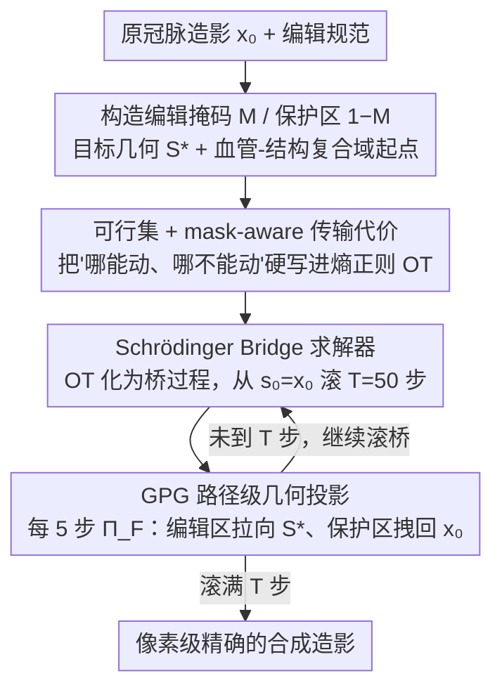

# OT-Bridge Editor: Geometrically Constrained Stenosis Editing in Coronary Angiography via Entropic Optimal Transport

**会议**: ICML 2026  
**arXiv**: [2605.08851](https://arxiv.org/abs/2605.08851)  
**代码**: 论文未公开发布  
**领域**: 医学图像 / 扩散模型 / 数据增广  
**关键词**: 冠脉造影, 狭窄编辑, Schrödinger Bridge, 熵正则化最优传输, 路径级几何监督

## 一句话总结
OT-Bridge Editor 把"在冠脉造影上编辑一段血管狭窄"重写为"在血管-结构复合域里的约束熵 OT 问题"，用 Schrödinger Bridge 沿路径加几何投影监督，做到像素级形状/位置可控的合成造影，在 ARCADE 公开集上把下游狭窄检测 mAP@0.5 相对提升 27.8%。

## 研究背景与动机

**领域现状**：冠脉造影（CAG）狭窄检测严重缺标注、跨中心域差大；社区一般用扩散模型做"条件生成"来扩数据——给个 mask、文本或语义图，让扩散模型从噪声起步重建。

**现有痛点**：现有扩散编辑器存在两大软肋——(i) 条件以 guidance / cross-attention 等"软约束"注入，无法精确锁住几何边界（差一根分支就影响后续检测）；(ii) 从纯噪声开始反扩散，明明非编辑区域的解剖完全没必要重画，却被一并扰动，结构保持差。

**核心矛盾**：医学合成需求是"把一张已有造影局部改一处狭窄"，本质是源图像到目标图像的**局部最小化运输**，而不是从噪声重建整张图；可现有扩散范式没有"路径级几何硬约束"的接口。

**本文目标**：(1) 把"几何精确的局部编辑"形式化为带约束的最优传输；(2) 设计一个可在像素层面被监督的生成路径；(3) 用合成造影显著提升下游狭窄检测器在公开 + 多中心数据上的表现。

**切入角度**：作者注意到 Schrödinger Bridge 天然处理"端点已知+路径可控"的扩散问题，正好对接"源是原图、目标是编辑后图"这种偏 image translation 的需求；同时熵正则化让 OT 在高维像素空间数值可解。

**核心 idea**：把编辑掩码 + 目标几何描述写进 SB 的边界条件 + 路径可行集，再在每一步桥过程后做几何投影（GPG），让生成路径"被夹在几何可行通道里"走完全程。

## 方法详解

### 整体框架
这套管线要解决的是"在一张已有冠脉造影上局部改一处狭窄、其余解剖一丝不动"，所以它不从噪声重画整图，而是把编辑当成从原图到目标图的一次"最小运输"。先从编辑规范造出二值掩码 $\mathbf{M}$、保护区 $\bar{\mathbf{M}}=\mathbf{1}-\mathbf{M}$ 和目标几何 $\mathbf{S}^\star=\mathcal{S}(\cdot)$，并在"血管-结构复合域"（原图边缘 + 血管 mask）里设定起点；再把编辑写成一端固定在原图 $\mu_0=\delta_{\mathbf{x}_0}$、另一端 $\mu_1$ 受几何可行集约束的熵正则化 OT，用 Diffusion Schrödinger Bridge 解出一条桥过程；最后在桥前进的每 $K$ 步插入几何投影 $\Pi_\mathcal{F}$，一边把编辑区拉向目标几何、一边把非编辑区拽回原图，滚到 $T$ 步即得像素级精确的合成造影。

### 关键设计

**1. 可行集 + mask-aware 传输代价：把"哪能动、哪不能动"写进 OT 而非靠软引导**

ControlNet、SDEdit 这类做法用 cross-attention 或加噪重建施加条件，本质是"软指挥"，没法保证非编辑区一像素不变——差一根分支就污染后续检测。本文索性把约束硬编码进运输问题：先定义硬可行集 $\mathcal{F}=\{\mathbf{x}\mid \mathbf{x}\odot\bar{\mathbf{M}}=\mathbf{x}_0\odot\bar{\mathbf{M}},\ \mathcal{S}(\mathbf{x}\odot\mathbf{M})=\mathbf{S}^\star\}$，明文要求非编辑区逐像素等于原图、编辑区几何描述子等于目标；再把代价写成 mask 感知的形式 $c(\mathbf{x},\mathbf{y})=\|(\mathbf{x}-\mathbf{y})\odot\bar{\mathbf{M}}\|_2^2+\lambda_M\|(\mathbf{x}-\mathbf{y})\odot\mathbf{M}\|_2^2$，区分对待保护区和编辑区的位移代价。整体优化目标是熵正则化的运输 $\min_\pi\langle\mathbf{C},\pi\rangle+\varepsilon\,\mathrm{KL}(\pi\|\mathbf{K})$ s.t. $\pi\in\mathcal{Q}$。约束从"建议"升级成"数学定义"，"画串"在源头就被堵死。

**2. Schrödinger Bridge 作动态求解器：把脆弱的高维 OT 化成可分步采样的桥过程**

直接在像素空间解 entropic OT 又贵又数值不稳，没法落地。SB 的好处是把"两端分布匹配"等价转成"轨迹密度匹配"：在轨迹空间求 $P^\star=\arg\min_{P:P_0=\mu_0,P_1=\mu_1}\mathrm{KL}(P\|R)$，其中 $R$ 是参考扩散链。于是采样从 $\mathbf{s}_0=\mathbf{x}_0$ 起步，按 $\tilde{\mathbf{s}}_{k+1}\sim p^\star(\mathbf{s}_{k+1}\mid\mathbf{s}_k)$ 滚动 $T=50$ 步即可。这一步不只是为了能算——它把整条生成路径"摊开"暴露出来，让后面 GPG 可以在每一步插监督，这是软引导扩散给不了的接口。

**3. GPG 路径级几何投影监督：每一步把状态推回几何可行集，而非只在终点纠偏**

只在终点加几何约束等于"软指挥"，桥过程中段一旦漂歪，到终点再硬拉代价极高，像素级精度根本守不住。GPG 的做法是每步先采样 $\tilde{\mathbf{x}}_{k+1}\sim p^\star$，再立刻投影 $\mathbf{x}_{k+1}\leftarrow\Pi_\mathcal{F}(\tilde{\mathbf{x}}_{k+1})$，让轨迹始终待在几何通道里。投影本身解一个小优化 $\Pi_\mathcal{F}(\mathbf{x})=\arg\min_\mathbf{y}\mathcal{L}_{\text{geo}}(\mathbf{y})+\lambda_{\text{out}}\mathcal{L}_{\text{out}}(\mathbf{y})$：几何项 $\mathcal{L}_{\text{geo}}=\mathcal{D}_{\text{geo}}(\mathcal{S}(\mathbf{y}\odot\mathbf{M}),\mathbf{S}^\star)$ 用符号距离变换（SDT）算边界距离 $\mathcal{D}_{\text{geo}}=\frac{1}{|B_M|}\sum_\mathbf{u}|\phi^\star(\mathbf{u})|$，给出平滑可微的几何梯度、避开硬边界的梯度爆炸；外部项 $\mathcal{L}_{\text{out}}=\|(\mathbf{y}-\mathbf{x}_0)\odot\bar{\mathbf{M}}\|_2^2$ 则压住非编辑区的漂移。实现上每 5 步投影一次，$\lambda_{\text{out}}=10,\lambda_{\text{geo}}=1$。这正是论文最关键的贡献——消融里去掉它，bDice 从 0.895 直接掉到 0.765。

### 损失函数 / 训练策略
SB 参考过程 $R$ 用标准离散扩散链，$\varepsilon=10^{-2}$ 控传输平滑度。GPG 投影靠梯度优化求解，以 logits-processor 的风格插在采样路径上，因此无需重训扩散主干，也与编辑空间（像素或 latent）解耦。

## 实验关键数据

### 主实验
ARCADE 公开集 + 多中心内部集，对比 GAN（Pix2PixHD、SPADE）和扩散编辑器（SDEdit、SDM、SiameseDiff、DiGDA）。

| 指标 | Pix2PixHD | SDEdit | SiameseDiff | **OT-Bridge** |
|------|----------:|-------:|------------:|--------------:|
| Edit Dice ↑ | 0.621 | 0.645 | 0.722 | **0.774** |
| Edit mIoU ↑ | 0.801 | 0.781 | 0.837 | **0.892** |
| FID ↓ | 52.9 | 46.9 | 34.2 | **16.7** |
| SSIM ↑ | 0.676 | 0.705 | 0.790 | **0.878** |

下游 YOLOv8 在 ARCADE 上 mAP@0.5：Real-only 0.525 → Real+Synth **0.727**（+38.5% 相对，论文综合 4 个检测器报 27.8% 平均提升）；多中心数据集上 Real-only 0.654 → Real+Synth **0.731**（+11.8%，平均 23.0%）。

### 消融实验

| 配置 | Edit Dice ↑ | Outside SSIM ↑ | 说明 |
|------|------------:|---------------:|------|
| Edge 域 | 0.592 | 0.533 | 仅在边缘图上编辑，结构差 |
| Seg 域 | 0.767 | 0.694 | 仅 mask 域，边界粗糙 |
| **Composite（默认）** | **0.892** | **0.878** | 边缘 + 血管 mask 复合域 |
| Composite w/o 保护约束 | 0.802 | 0.786 | 撤掉非编辑区一致性后明显劣化 |
| 仅端点 GPG | bDice 0.765 | $\mathcal{E}_T=2.8$ | 终点 OK 但中间路径已漂 |
| **路径 GPG（默认）** | **bDice 0.895** | $\mathcal{E}_T=1.1$ | 全程几何稳定 |
| w/o 边界监督 $\partial m$ | bDice 0.582 | $\mathcal{E}_T=12.4$ | 没有 SDT 几乎崩 |

合成数据规模扫描显示 $r=1.0$（合成:真实=1:1）即可饱和增益。

### 关键发现
- **GPG 是核心贡献**：去掉路径级几何监督后，bDice 从 0.895 掉到 0.765，验证"逐步投影"比"终点约束"对像素级编辑至关重要。
- **复合域 > 单一域**：边缘 + 血管 mask 同时作为起点能在编辑区保边界，又在非编辑区稳结构，两者缺一不可。
- **检测器域间转移**：在 ARCADE 上训出的检测器加 OT-Bridge 合成图迁移到多中心集仍保持 11-13% 增益，说明合成图带来了"位置/形态多样性"而非简单噪声。
- **mask 噪声鲁棒性**：boundary jitter / 膨胀腐蚀对 Dice 影响小，但 spatial displacement（mask 错位）对下游 mAP 影响最大——提示部署时定位精度比边界微调更重要。

## 亮点与洞察
- **把"局部编辑"重新框定为"约束运输"**：从噪声重画整图 → 从原图运输微小变化，更贴合医学编辑的本质，输出更稳；这套思路对任何"局部修图"任务（病灶 inpainting、属性编辑、object insertion）都直接迁移。
- **路径级硬监督是 SB 配套的天然接口**：传统扩散只能"前后两端"加 guidance，SB 的桥过程让"每一步加约束"成为自然操作；GPG 这一招在其他几何敏感任务（手部、字体、电路图）里都可借鉴。
- **复合域起点**显著提升了"边界 + 结构"双目标的可解性，提示设计医学编辑器时不要只用单一表示。
- **下游任务驱动评测**：用检测器 mAP 直接评估合成数据价值，比单纯报 FID / SSIM 更说服力强，是医学生成研究值得效仿的做法。

## 局限与展望
- 仅验证了冠脉造影狭窄编辑，对更复杂的多分支、3D CTA、超分等场景未测。
- GPG 投影按梯度求解，每步多花一次优化，单图推理速度比纯 SB 慢约 1.5×（论文没强调但可推出）。
- 几何监督依赖准确的血管 mask；spatial displacement 实验显示一旦 mask 错位，下游 mAP 显著下滑，提示部署需要可靠的分割前置。
- $\varepsilon,\lambda_M,\lambda_{\text{out}}$ 等超参数固定，没有自适应机制；不同中心、不同造影质量下可能要重新调。

## 相关工作与启发
- **vs SDEdit / SDM / SiameseDiff**: 都是噪声起步 + 软引导；OT-Bridge 把"哪些不能动"显式写进可行集，结构保持上有数量级提升（FID 16.7 vs 34-79）。
- **vs ControlNet / T2I-Adapter**: 强调"semantic structure guidance"，无几何 hard constraint；OT-Bridge 的 GPG 直接对几何描述子做 SDT 投影，是 pixel-level vs feature-level 的差异。
- **vs I²SB / BBDM / DSB**: 同样是 SB-style image translation，但本文专为医学几何编辑设计了路径级监督和复合域起点，把通用桥模型变成了"几何敏感编辑器"。
- **可迁移启发**：把"软引导"升级为"路径投影"的 GPG 思路对受约束的视觉生成（3D 形状、字体、矢量图、CAD）都很有意义；OT 视角也启发把更多 image editing 任务从"重建"重新定义为"运输"。

## 评分
- 新颖性: ⭐⭐⭐⭐ 用约束熵 OT + SB 桥过程做几何敏感的医学编辑，路径级投影监督是一个真正"在每一步管控"的新接口。
- 实验充分度: ⭐⭐⭐⭐ 4 个检测器 × 2 个数据集 + 5 个 baseline + 4 大消融（域/GPG/规模/mask 噪声），覆盖完整。
- 写作质量: ⭐⭐⭐⭐ 公式编排清晰、算法伪代码到位；图 4-6 ROI 视觉对比直观；少数附录细节略晦涩。
- 价值: ⭐⭐⭐⭐⭐ 直接给出"合成图+真实图"训出来的检测器在多中心场景大幅提升的证据，对临床落地有实质帮助。

<!-- RELATED:START -->

## 相关论文

- [\[CVPR 2026\] BiOTPrompt: Bidirectional Optimal Transport Guided Prompting for Disease Evolution-aware Radiology Report Generation](../../CVPR2026/medical_imaging/biotprompt_bidirectional_optimal_transport_guided_prompting_for_disease_evolutio.md)
- [\[AAAI 2026\] Neural Bandit Based Optimal LLM Selection for a Pipeline of Tasks](../../AAAI2026/medical_imaging/neural_bandit_based_optimal_llm_selection_for_a_pipeline_of_tasks.md)
- [\[AAAI 2026\] MIRNet: Integrating Constrained Graph-Based Reasoning with Pre-training for Diagnostic Medical Imaging](../../AAAI2026/medical_imaging/mirnet_integrating_constrained_graph-based_reasoning_with_pre-training_for_diagn.md)
- [\[CVPR 2025\] Uncertainty-Aware Concept and Motion Segmentation for Semi-Supervised Angiography Videos](../../CVPR2025/medical_imaging/uncertainty-aware_concept_and_motion_segmentation_for_semi-supervised_angiograph.md)
- [\[NeurIPS 2025\] Exploring and Leveraging Class Vectors for Classifier Editing](../../NeurIPS2025/medical_imaging/exploring_and_leveraging_class_vectors_for_classifier_editing.md)

<!-- RELATED:END -->
