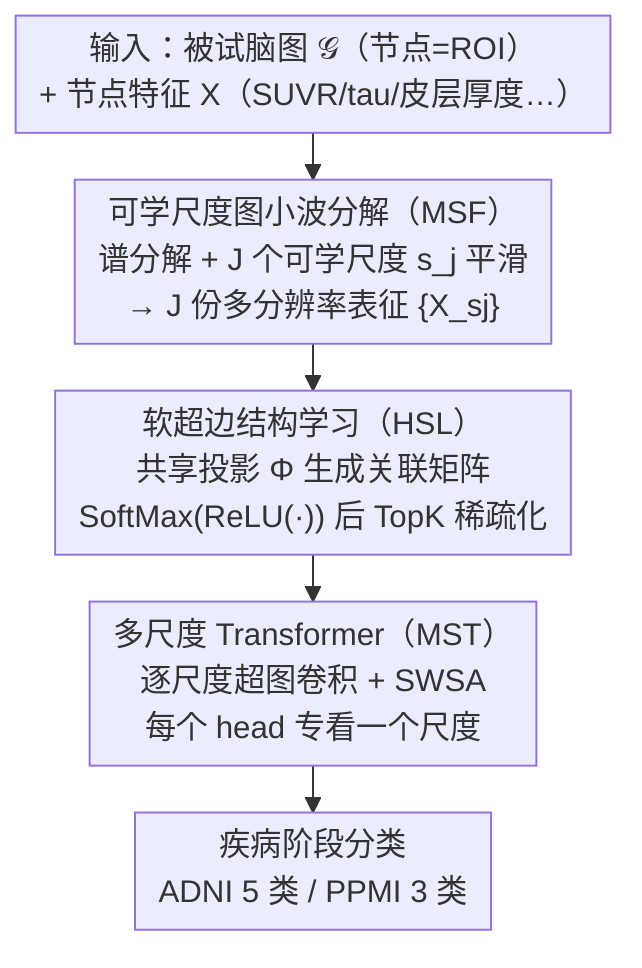

# Learning Multi-Scale Hypergraph for High-Order Brain Connectivity Analysis

**会议**: ICML 2026  
**arXiv**: [2606.03310](https://arxiv.org/abs/2606.03310)  
**代码**: 无  
**领域**: 医学图像 / 脑网络分析  
**关键词**: 脑网络、超图学习、图小波、神经退行性疾病、多尺度

## 一句话总结
MuHL 用可学习尺度的图小波把脑 ROI 特征分解成多分辨率表征，再以"节点嵌入 × 共享投影矩阵"动态生成 soft 超边，让 AD/PD 多阶段分类在 ADNI 上做到 93.2% Acc、PPMI 上做到 76.8% Acc，同时给出可解释的关键 ROI 与超边。

## 研究背景与动机
**领域现状**：现在分析脑网络（DTI 结构网 / fMRI 功能网）的主流是 GNN 一族——GCN/GAT/GCNII，以及面向脑的 BrainGNN、BrainGB、BrainNetTF、ALTER 等。它们在节点（ROI）之间做 pairwise 消息传递，靠堆层数间接建模高阶关系。

**现有痛点**：脑功能/结构上的异常往往是"多个 ROI 同时协同失常"的群体现象，pairwise 邻接矩阵本质表达不了"3 个及以上 ROI 同时连成一组"这种 group-wise 依赖；堆叠 GCN 层来近似高阶，又会触发 oversmoothing。超图模型（HGNN、dwHGCN、HyBRiD 等）能显式表达"一条超边连一组节点"，但绝大多数要么用**预定义**的超边（如 KNN 拍出来的），要么**只学超边权重**而拓扑固定，灵活度不够。

**核心矛盾**：脑里的高阶交互既要**结构可学**（不能预定义），又要**跨尺度**（局部小簇和全局大群体都要）。现有超图方法两边都没满足。

**本文目标**：在不依赖任何手工先验超边的前提下，同时做到 (i) 直接学连续、稀疏的 soft 超边；(ii) 不同分辨率的 ROI 特征对应不同尺度的超边（小尺度 → 紧凑超边、大尺度 → 跨脑区超边）。

**切入角度**：作者从 Spectral Graph Wavelet Transform (SGWT) 借灵感——同一个图信号在不同 wavelet scale 下会被平滑成不同感受野的版本，scale 越大、节点特征被抹得越像，自然就会被分进越大的"组"。把这个 scale 当成**可学参数**，就能让模型自己决定每个层级要看多大的 ROI 邻域。

**核心 idea**：用"可学尺度的图小波分解 → 共享投影矩阵 Φ 生成多尺度软超边 → 多尺度 Transformer 跨尺度融合"这条流水线，把 pairwise 脑网络升级成可学的、跨分辨率的超图，用于神经退行性疾病分期分类。

## 方法详解

### 整体框架
MuHL 要解决的是：脑里的异常常是一组 ROI 同时协同失常，而 pairwise 邻接矩阵表达不了这种 group-wise 关系，预定义超边又不够灵活。它的思路是把一个被试的脑图升级成一组**可学的、跨分辨率的软超图**，再用 Transformer 把不同分辨率融起来去分疾病阶段。输入是被试的图 $\mathcal{G}$（节点 = ROI、邻接 = 结构/功能连接）和节点特征 $X \in \mathbb{R}^{N\times D}$（如 SUVR、β-amyloid、tau、皮层厚度，或 BOLD 信号），输出是疾病阶段标签（ADNI 上 5 类 CN/SMC/EMCI/LMCI/AD，PPMI 上 3 类 CN/Prodromal/PD）。

整条流水线分三段、首尾端到端：先用可学尺度的图小波把 $X$ 分解成 $J$ 份不同感受野的 ROI 表征 $\{X_{s_j}\}$（MSF 模块）；再对每个尺度用同一套可学投影矩阵 $\Phi$ 直接学出该尺度的软超边 $\bar{H}_{s_j}$（HSL 模块）；最后对每个尺度先做超图卷积，再用一个"每个 head 专看一个尺度"的 Transformer 把局部到全局的语义聚到一起喂给分类头（MST 模块）。所有参数——包括尺度标量 $s_j$ 和投影矩阵 $\Phi$——都由分类损失一起反传学出来。

### 关键设计

**1. 可学尺度的图小波分解：让"看多大的 ROI 邻域"自己学出来**

第一个痛点是多分辨率到底该取哪几个尺度。传统做法要么换多套 atlas（多套分割、工程负担重），要么手动挑几个离散 scale。本文借 Spectral Graph Wavelet Transform 的观察——同一个图信号在不同 wavelet scale 下会被平滑成不同感受野的版本——把尺度直接做成可训练标量。具体地，对归一化 Laplacian 做谱分解得到 $U, \Lambda$，每个尺度的表征是 $X_{s_j} = U g^2(s_j \Lambda) U^T X$，其中 $J$ 个 $s_j$ 都进反传、由疾病分类目标决定每层要"模糊"到多大。小 $s$ 时节点特征只被邻居轻微平滑、差异保留得多，后面 HSL 容易把它们分进紧凑超边；大 $s$ 时平滑跨越多步邻居、远端节点变得相像，就会被并进跨脑区的大超边。这样既避开了多套 parcellation 的负担，又让"感受野大小"这个超参直接和下游目标对齐。

**2. 共享投影矩阵 $\Phi$ 直接学软超边 + TopK 稀疏化：让超图拓扑本身可学**

现有超图方法的死穴是拓扑不可学——要么 KNN 拍出超边、要么只学超边权重而连接关系固定。这里反过来让拓扑从数据里端到端长出来：把节点嵌入 $\bar{X}_{s_j} = X_{s_j} W$ 与可学投影 $\Phi \in \mathbb{R}^{d_h \times M}$ 相乘得到关联矩阵 $H_{s_j} = \bar{X}_{s_j}\Phi$，再过 $\tilde{H}_{s_j} = \mathrm{SoftMax}(\mathrm{ReLU}(\bar{X}_{s_j}\Phi))$，最后每个节点只保留 top-$\eta$ 条超边形成稀疏的 $\bar{H}_{s_j}$。关键巧思是所有尺度共用同一个 $\Phi$：这让 $M$ 条超边在不同尺度间有了**对应关系**——同一条超边在小尺度只圈住几个紧凑节点、在大尺度就扩成跨脑区的大组。作者还给了两个命题做背书：(1) 算 $H_s$ 等价于在小波域里用 $\Phi$ 投影小波系数 $W_X(s)$；(2) 至少存在一条超边，其被分配的节点集合大小随 $s$ 单调增加，$s \to \infty$ 时趋近 $N$。这正好解释了图 1 里"超边随尺度逐渐膨胀"的可视化，也保证了 TopK 之后超边稀疏而不冗余。

**3. 多尺度 Transformer（MST）：用 Scale-Wise Self-Attention 让 attention head 承载分辨率层级**

每个尺度内的超图卷积只能在本尺度传消息，但"哪些局部模式该被哪些全局模式调制"这种跨尺度依赖得专门融。MST 模块的核心是 Scale-Wise Self-Attention（SWSA）：先对每个尺度跑超图卷积抽到 $F_{s_j}^{(Z)}$：

$$F_{s_j}^{(z)} = \sigma\left(\mathcal{D}_v^{-1/2}\bar{H}_{s_j} W_e \mathcal{D}_e^{-1} \bar{H}_{s_j}^T \mathcal{D}_v^{-1/2} F_{s_j}^{(z-1)} \Theta^{(z)}\right)$$

然后把多头注意力里的"head"和"分辨率"一一绑定——每个 head 只看一个尺度，独立算 $A_{s_j} = \mathrm{Softmax}(Q_{s_j} K_{s_j}^T / \sqrt{d_k})$，把 $J$ 个 head 拼起来过 $W_O$ 投影后接 FFN + 残差 + LN 输出 $B^{(P)}$。这和传统 multi-head attention（各 head 看同一份特征的不同子空间）不同：SWSA 等于把"局部—全局"的语义层级直接写进 attention 拓扑，让每个 head 在自己尺度的图上做长程建模、再统一聚合，跨尺度交互既可学又解耦。

### 损失函数 / 训练策略
端到端用交叉熵 + 一个 L1 项对**负**尺度做惩罚保证 $s_j > 0$：

$L = -\frac{1}{T}\sum_t\sum_c Y_{tc}\log\hat{Y}_{tc} + \alpha \frac{1}{J}\sum_j \mathbf{1}_{s<0}|s_j|$

默认 $J=3, M=16, \eta=3, d_h=16$，5-fold 交叉验证，Adam 优化（细节在附录 C）。

## 实验关键数据

### 主实验
两个 benchmark：ADNI（650 人、160 ROI、5 类）和 PPMI（181 人、116 ROI、3 类）。MuHL 与 19 个基线对比（GCN/GAT/GCNII/BrainGNN/IBGNN/BrainGB/SGCN/BrainNetTF/ALTER/BioBGT/BQN 等图模型 + HGNN/HNHN/UniGCNII/HyperDrop/dwHGCN/HyperGT/HyBRiD/DHHNN 等超图模型）。

| 数据集 | 指标 | MuHL | 此前最佳 | 提升 |
|--------|------|------|----------|------|
| ADNI (5 类) | Acc | **93.2** | 90.8 (ALTER) | +2.4 |
| ADNI | F1 | **94.7** | 90.9 (ALTER) | +3.8 |
| PPMI (3 类) | Acc | **76.8** | 72.9 (GAT) | +3.9 |
| PPMI | F1 | **62.4** | 56.4 (BQN) | +6.0 |

Zero-shot 跨数据集/跨阶段也是全胜：ADNI-2 → ADNI-1/3/GO 上 Acc 56.0（次优 52.8），PPMI → TaoWu 上 Acc 60.5（次优 57.0），PPMI → Neurocon 上 Acc 65.9（次优 63.8），说明学到的超图结构具备一定的迁移性。

### 消融实验
| 配置 | ADNI Acc | PPMI Acc | 说明 |
|------|---------|---------|------|
| Full (MSF+HSL+MST) | **93.2** | **76.8** | 完整 MuHL |
| w/o MSF | 90.0 | 72.9 | 去掉多尺度小波分解，仍可学超边但只有单一分辨率 |
| w/o HSL | 76.8 | 67.4 | 去掉超图结构学习（用预定义结构），**掉点最多** |
| w/o MST | 86.9 | 64.1 | 去掉多尺度 Transformer，只做超图卷积 |

### 关键发现
- **HSL 是命门**：拿掉 HSL 后 ADNI 掉 16.4 个点、PPMI 掉 9.4 个点，证实"让超边拓扑可学"比"多尺度"或"Transformer 融合"都更核心。这也说明现有"只学权重不学拓扑"的超图方法天花板就卡在这里。
- **超边数 M 有甜点**：$M$ 从小升到 16 性能上升，超过 20 反而下降——超边太多就开始制造冗余/噪声。$d_h$ 也是 16 之后饱和，再大有过拟合迹象。
- **识别出的 hub ROIs 与临床先验一致**：ADNI 上 top-10 ROI 是双侧的 globus pallidus / putamen / hippocampus / thalamus（皮下核团，已知与 AD 进程强相关）；PPMI 上是 amygdala / thalamus / supramarginal gyrus（与 PD 的情绪/运动/认知调节相关），且这些 ROI 多以左右对称对的形式出现，符合疾病的双侧扩散模式。

## 亮点与洞察
- **把"尺度"做成可学的连续变量**：和之前要么固定 scale、要么离散多 scale 的工作不同，本文用 $s_j$ 直接进反传，模型自己挑要看多大的邻域；这套技巧迁移到任意需要 multi-resolution graph signal 的任务（药物分子、社交网络分群、点云）都可以直接套。
- **共享 $\Phi$ 跨尺度构超边**：一招同时拿到了"超边语义跨尺度对应"和"超边随 scale 单调扩张"两个性质，且作者给了正式证明。这比 KNN 拍超边或独立学 $J$ 个矩阵都更优雅。
- **可解释性是"自带的"而不是"贴上去的"**：超边激活度直接当成 ROI 重要性、聚合超边活动度直接给出 hub ROI 排名——和"先训完再贴一个 explanation module"的路子相比，可解释性是结构自然产物。

## 局限与展望
- **样本不平衡很严重**：ADNI 的 AD 组只有 12 人，与 CN 的 226 人差 19 倍，5 类分类整体精度被拉得偏乐观；作者也在 Impact Statement 里承认对小类的预测会不稳定。
- **没有公开代码**：论文里没有给 GitHub 链接，复现门槛高；尤其 $\Phi$ 的初始化、5 fold 划分、Φ 的训练动态都没法直接验证。
- **超边数 M 与 ROI 数耦合不明**：$M=16$ 在 N=160 (ADNI) 和 N=116 (PPMI) 上都是最优，是否对所有 atlas/parcellation 都成立？换 DKT atlas / Schaefer 400 是否要重新调？没有跨 atlas 的稳健性实验。
- **图小波依赖固定 Laplacian**：每个被试一张图、谱分解一次（$O(N^3)$），160 个 ROI 还能接受；如果换到 Schaefer 1000 或 voxel-level 图就会卡。可以考虑用 Chebyshev 多项式近似把 $g(s\Lambda)$ 替换掉。
- **没有时间维度**：fMRI 本质是时序信号，本文只用静态功能连接矩阵，丢掉了动态连接信息；可以考虑沿时间轴扩展超边或引入 temporal scale。

## 相关工作与启发
- **vs HGNN / HNHN / UniGCNII**：经典超图 GNN 都要预定义 incidence $H$，本文是端到端学 $H$ 本身，避免了"超图先验从哪来"的难题。
- **vs dwHGCN / HyBRiD**：dwHGCN 学超边权重、HyBRiD 用 binary mask + 学权重，都假设拓扑固定。本文学连续的 soft 超边拓扑，灵活度高一个 level，消融里 HSL 掉 16 点也正面说明了这点。
- **vs BrainNetTF / ALTER**：Transformer 路线只做 pairwise attention（即便加 random walk），本文用超图直接表达 group-wise 关系，且在 ADNI 上把 ALTER 的 90.8 干到 93.2。
- **vs SGWT 原始用法**：传统 SGWT 用作信号去噪/重建，固定 scale；本文把 SGWT 当可学的特征金字塔，再把金字塔接到超图学习上，是 SGWT 在 GNN 里的一个新用法。

## 评分
- 新颖性: ⭐⭐⭐⭐ 把"可学尺度的小波分解 + 共享投影构软超边"组合首次端到端化，且给出 2 个支撑命题，思路干净有原创。
- 实验充分度: ⭐⭐⭐⭐ 两个大 benchmark + 19 baseline + zero-shot 三个目标域 + 消融 + 4 个超参敏感性 + ROI 可视化，覆盖到位；扣一星是因为 ADNI 类极度不平衡 + 没有第三个 fMRI dataset 验证。
- 写作质量: ⭐⭐⭐⭐ 动机层层递进、命题与图 1 互相印证、消融解释清楚；公式编号和符号一致。
- 价值: ⭐⭐⭐⭐ 给"可学超图 + 多分辨率"提供了一个干净的 baseline，对脑网络分析和图小波两条线都有借鉴价值；但缺代码使工程价值打了折。

<!-- RELATED:START -->

## 相关论文

- [\[CVPR 2026\] Continual Learning for fMRI-Based Brain Disorder Diagnosis via Functional Connectivity Matrices Generative Replay](../../CVPR2026/medical_imaging/forge_continual_learning_for_fmri_based_brain_disorder_diagnosis.md)
- [\[CVPR 2026\] OmniBrainBench: A Comprehensive Multimodal Benchmark for Brain Imaging Analysis Across Multi-stage Clinical Tasks](../../CVPR2026/medical_imaging/omnibrainbench_a_comprehensive_multimodal_benchmark_for_brain_imaging_analysis_a.md)
- [\[ICML 2026\] CAME-Grad: The Double Dilemma in Multi-Task Radiology Report Generation — A Gradient Dynamics Analysis and Solution](the_double_dilemma_in_multi-task_radiology_report_generation_a_gradient_dynamics.md)
- [\[NeurIPS 2025\] Riemannian Flow Matching for Brain Connectivity Matrices via Pullback Geometry](../../NeurIPS2025/medical_imaging/riemannian_flow_matching_for_brain_connectivity_matrices_via_pullback_geometry.md)
- [\[CVPR 2026\] PMRNet: Physics-informed Multi-scale Refinement Network for Medical Image Segmentation](../../CVPR2026/medical_imaging/pmrnet_physics-informed_multi-scale_refinement_network_for_medical_image_segment.md)

<!-- RELATED:END -->
