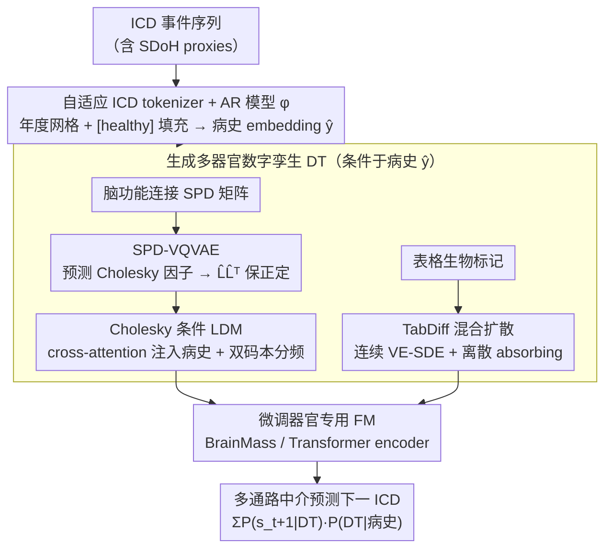

# Marrying Generative Model of Healthcare Events with Digital Twin of Social Determinants of Health for Disease Reasoning

**会议**: ICML 2026  
**arXiv**: [2605.09771](https://arxiv.org/abs/2605.09771)  
**代码**: 无  
**领域**: 医学图像 / 生成模型 / 数字孪生 / 疾病预测  
**关键词**: digital twin, ICD 自回归, latent diffusion, SPD 流形, Cholesky 分解, 多器官生物标记

## 一句话总结
本文提出 DiffDT：用一个条件 Latent Diffusion 框架把电子病历（ICD-coded 事件序列）与多器官生物标记数字孪生（脑/心/肝/肾的影像衍生表格特征与脑功能连接 SPD 矩阵）连起来，关键创新是一个基于 Cholesky 分解的 SPD-VQVAE 把 $\mathcal{O}(N^3)$ 的 SPD 流形扩散降到流形保形且高效的潜空间，再让 AR 模型借“生成数字孪生 → 预测下一个 ICD”这条中介路径完成多通路疾病推理；在 UKB 上对 1944 类疾病的下一次预测 AUC 提到 0.91，刷新 SOTA。

## 研究背景与动机

**领域现状**：医学 AI 的两条主流路线——(a) **EHR-to-event** 用 transformer 自回归学 ICD 事件序列（MOTOR、Delphi），把疾病进展当作 next-token prediction，但忽略具体生理生物标记；(b) **DT-to-event** 用预训练影像基础模型（BrainMass、NeuroPath）从单一器官 in-vivo 生物标记预测疾病，但缺少跨时间因果链。两者都难以做长时程、多通路、个性化疾病推理。

**现有痛点**：(1) 纯 EHR 路线学的是医疗利用模式而非疾病机理，作者图 2 展示其预测精度对“当前疾病与历史疾病的语义距离”负相关——远离主诊断 chapter 的疾病预测差，这暴露 multi-pathway probabilistic mediation 缺失；(2) 纯 DT 路线只用当前生物标记，没法基于过去病史预测未来生理状态；(3) 现有 AR-diffusion 混合架构（如 ye2025hybrid、HybridVLA）都在欧氏空间设计，脑功能连接 SPD 矩阵直接加高斯噪声会破坏几何（不再正定）；(4) SPD-DDPM 等几何扩散方法用 affine-invariant / log-Euclidean metric 严谨但 $\mathcal{O}(N^3)$ 复杂度（AAL atlas 下 $N=116$）算不动。

**核心矛盾**：要把 EHR 时间因果性和多器官生理状态结合，必须 (i) 让生成模型贴近 ICD 历史，(ii) 让生成的脑网络仍在 SPD 流形上，(iii) 复杂度足够低能在 50K+ 受试者上训练；前两件事在欧氏 latent diffusion 框架下天然冲突。

**本文目标**：(1) 建立 SDoH-to-event 范式：用 ICD-coded SDoH proxies（含 chapter Z 和 V–Y）作为条件，生成多器官 DT 当生物中介，再预测未来 ICD；(2) 设计 SPD 流形保形的 latent diffusion，把 $\mathcal{O}(N^3)$ 降到可计算量级；(3) 在 UKB 上做长尾 1944 类疾病的下一次预测验证。

**切入角度**：Cholesky 分解 $M = LL^\top$ 给 SPD 流形提供一个**唯一且 smooth** 的因式（Theorem 3.1：$\mathcal{S}_{++}^N \to \mathcal{L}_{++}^N$ 是 diffeomorphism）。在 Cholesky 因子上做扩散既能用欧氏机器、又通过 $LL^\top$ 重建保证生成结果仍为 SPD。

**核心 idea**：用一个 SPD-VQVAE 把脑功能连接矩阵编码到离散潜空间（解码器输出 lower-triangular 矩阵再 $LL^\top$ 得 SPD 重建），然后在这个潜空间上跑 Cholesky LDM 条件于 ICD 历史；表格生物标记走 TabDiff 做混合 SDE/absorbing 扩散；最后用 AR 模型把“生成 DT → 预测下一 ICD”当作 $P(\text{Future}|\text{Biomarker})\cdot P(\text{Biomarker}|\text{History})$ 的中介推理。

## 方法详解

### 整体框架
DiffDT 要解决的核心问题是：把 EHR 的时间因果性和多器官生理状态结合起来，做长时程、多通路的疾病预测。整条流水线沿“病史 → 生理中介 → 未来疾病”三跳展开。先用一个**自适应医学史 tokenizer + AR 模型 $\phi$** 把 ICD 序列按 1 年粒度铺到统一时间网格、未发病年用 `[healthy]` token 填充，token embedding 加 age embedding 喂 causal self-attention 学 next-token，得到一段 causality-aware 的医疗史 embedding；这段 embedding 当条件去**生成多器官数字孪生**——表格生物标记走 TabDiff 风格的混合扩散（连续维度走 VE SDE、离散维度走 absorbing process），脑功能连接走 SPD-VQVAE + Cholesky LDM；最后在生成出来的 DT 上**微调器官专用 FM**（脑用 BrainMass，表格用 Transformer encoder）预测下一个 ICD。推理时对每个待预测的多通路因果节点，AR 模型先编码过去 ICD，扩散模型据此生成假想的多器官 DT，微调后的 FM 再从 DT 读出下一 ICD，整体实现 $\sum_{\text{organ}} P(s_{t+1}\mid \text{DT}_t^{\text{organ}})\, P(\text{DT}_t^{\text{organ}}\mid S_{<t})$ 的多通路 mediation。

### 关键设计

**1. SPD-VQVAE：用 Cholesky 分解让 SPD 流形约束被解码器几何自动满足**

脑功能连接是个 $116\times 116$ 的 SPD 矩阵，痛点在于它不能直接进欧氏扩散框架——加一步高斯噪声立刻不再正定，几何就破了；而像 SPD-DDPM 那样在 affine-invariant 度量下严谨做扩散又是 $\mathcal{O}(N^3)$，AAL atlas 下 $N=116$ 在 5 万受试者上算不动。本文的做法是把约束“消化”进 VQVAE 的解码端：编码器 $\mathcal{E}$ 用 MLP 把 $\mathbf{M}$ 拍平投影到 $z_e\in\mathbb{R}^{N_q\times d}$ 再量化到 codebook $\mathcal{Z}\in\mathbb{R}^{N_{code}\times d}$ 得到 $z$；解码器 $\mathcal{D}$ 不直接预测 $\hat{\mathbf{M}}$，而是预测一个 lower-triangular 因子 $\hat L$（对角线过 softplus 保正），再由 $\hat{\mathbf{M}}=\hat L\hat L^\top$ 重建。训练损失 $\mathcal{L}_{\text{VAE}}=\mathcal{L}_{\text{SPD}}(L,\hat L)+\mathcal{L}_{\text{recon}}(\mathbf{M},\hat{\mathbf{M}})+\|\text{sg}[z_e]-e\|_2^2+\beta\|z_e-\text{sg}[e]\|_2^2$ 同时监督 Cholesky 因子、最终 SPD 重建、码本与 commitment。之所以有效，是 Theorem 3.1 保证 Cholesky 是 $\mathcal{S}_{++}^N\to\mathcal{L}_{++}^N$（下三角正对角矩阵）的 diffeomorphism——在因子空间用普通欧氏 MSE 训练就等价于在流形上训练，但只要 $\hat L\hat L^\top$ 一拼，重建必然落回 SPD，复杂度也从 $\mathcal{O}(N^3)$ 降到 $\mathcal{O}(N^2)$ 级别。这种“找一个 diffeomorphism 把流形约束转嫁给 decoder 的几何性质”是全文最优雅的一手。

**2. Cholesky 条件 LDM：cross-attention 注入病史，分频双码本对抗 mode collapse**

有了 SPD-VQVAE 的离散潜空间，扩散就在这个潜空间上跑，条件是 AR 模型给出的医疗史 embedding $\hat{\mathbf{y}}$。backbone 是 U-Net 形式的 Residual MLP Block，条件分两路注入：时间步 embedding $\text{Embed}_\text{diff}(t)$ 加到每层输入；cross-attention 把 $\hat{\mathbf{y}}\in\mathbb{R}^{T\times d_\phi}$ 当 key/value、潜向量 $\hat z$ 当 query，即 $Q=\hat z\hat{\bm{\alpha}}_h$、$K=\hat{\mathbf{y}}\hat{\bm{\beta}}_h$、$V=\hat{\mathbf{y}}\hat{\bm{\gamma}}_h$，输出 $\hat z=\text{Softmax}(QK^\top/\sqrt{C_{hid}})V$，训练用标准噪声预测 $\mathcal{L}_{\text{LDM}}=\mathbb{E}\|\epsilon-\epsilon_\theta(z_t,t,\hat{\mathbf{y}})\|^2$。cross-attention 的好处是生成不只 condition 在最近一次事件，而能 attend 到历史里任意关键 ICD（比如多年前的高血压诊断如何塑形今日脑网络）。但纯生成模型在结构对称性极强的医学影像上容易塌成一张“平均脑”、丢掉个性化模式，于是作者加了 **SPD-VQVAE-Dual**：用两个 SPD-VQVAE 分别建模低通和高通 Fourier 成分（阈值 25），逼着 LDM 同时学“全局结构”和“个性化细节”——这是个工程发现，靠分频强行给生成注入多样性。

**3. 自适应 ICD tokenizer 与多通路中介推理：把稀疏病史变成稠密、可 attend 的条件信号**

前面两步要稳，前提是 AR 模型 $\phi$ 给出的条件在时间上连续可用，而以往 AR 医疗模型（如 Delphi）用 time-to-event embedding，相邻 token 间隔可达数十年，给条件扩散留下断裂的信号。本文构造统一年度时间网格 $\tau=(\tau_t\mid \tau_{t+1}-\tau_t\in\{0,1\})$ 覆盖整个队列年龄段：某年若有 ICD $c$ 则 $s_t=c$，否则填 `[healthy]`；输入 token $\mathbf{y}_t=\text{Embed}_\text{ICD}(s_t)+\text{Embed}_\text{age}(\tau_t)$ 喂 transformer，目标是 next-token $\mathcal{L}_\text{AR}=-\sum_t\log p(s_{t+1}\mid s_{\leq t};\phi)$。`[healthy]` filler 让 condition 在时间轴上 densely 定义，扩散模型的 cross-attention 才能稳定 attend。推理时对每个待 mediation 的节点，把 $\phi$ 输出当 $\hat{\mathbf{y}}$ 喂 LDM 生成多器官 DT，再用微调 FM 算 $P(s_{t+1}\mid\hat{\mathbf{M}}_t)$，把“当前已观察事件 → 生理生物状态 → 未来事件”串成一条 explicit causal chain。

### 损失函数 / 训练策略
分三阶段：(i) AR 模型 $\phi$ 在 7.28M ICD token / 448,651 subject 上预训练 next-token；(ii) SPD-VQVAE 与 TabDiff 在配对的影像 + ICD 数据上训生成模型（脑 44,834；心 23,987；肝 28,722；肾 32,155 样本），损失分别为 $\mathcal{L}_{\text{VAE}}$ 与 $\mathcal{L}_{tab} = \lambda_{num}\mathcal{L}_{num} + \lambda_{cat}\mathcal{L}_{cat}$；(iii) 在生成 DT 上微调器官 FM 做下一 ICD 分类。表格生成用 Classifier-Free Guidance：$\tilde\mu^{num}(\Gamma_t, S, t) = (1+\omega)\mu_\theta^{num}(\Gamma_t, S, t) - \omega\mu_\phi(\Gamma_t, t)$。subject-level 80:20 划分严格贯穿三阶段防数据泄露。

## 实验关键数据

### 主实验
UKB 数据集，1944 类疾病的下一次预测：

| 方法 | Backbone | AUC ↑ | F1 ↑ |
|---|---|---|---|
| Delphi | GPT2 | 0.6994 ± 0.091 | 7.09 ± 7.56 |
| Delphi | Qwen3 | 0.8931 ± 0.055 | 18.17 ± 20.67 |
| **DiffDT** | GPT2 | **0.9087 ± 0.050** | **18.60 ± 16.29** |
| **DiffDT** | Qwen3 | **0.9171 ± 0.049** | **20.92 ± 20.40** |

按器官 mediation 分组 F1（与 DT-to-event 基线比较）：

| Mediation 器官 | Brain F1 | Heart F1 | Liver F1 | Kidney F1 |
|---|---|---|---|---|
| NeuroPath | 56.53 | 48.96 | 54.20 | 54.57 |
| BrainMass | 47.18 | 56.63 | 58.81 | 50.43 |
| **DiffDT-Brain** | **65.14** | 53.74 | 60.44 | 54.97 |
| **DiffDT-Heart** | 58.00 | **58.50** | 56.17 | 58.18 |
| **DiffDT-Liver** | 59.88 | 52.23 | **61.65** | 53.52 |
| **DiffDT-Kidney** | 53.91 | 54.72 | 57.92 | **64.32** |

**关键观察**：用同一预训练 BrainMass 当 predictor 时，DiffDT-Brain（生成 DT 当输入）比 BrainMass（真实 GT 当输入）高 ≈18 pp F1，说明多通路 mediation 学到了 ICD 历史中的额外因果信号。

### 消融实验

| LDM 配置 | RMSE ↓ | WD ↓ | r ↑ | mAcc ↑ |
|---|---|---|---|---|
| 普通 VQVAE | 0.261 | 7.110 | 0.503 | 90.87 |
| SPD-VQVAE | 0.220 | 6.019 | 0.677 | 95.71 |
| **SPD-VQVAE-Dual** | **0.203** | **5.841** | **0.726** | **98.36** |

表格 DT：心脏 RMSE 0.265 / WD 17.27（112 trait），肝 0.184 / 2.48，肾 0.146 / 0.99，与器官 mediation F1 性能呈正相关（生成质量越高，下游分类越准）。**Counterfactual 评估**：把某个 exposure ICD 替换成 `[healthy]` 生成 do(healthy) DT，与真实健康 vs 真实病变受试者比 FID/WD/r，do(healthy) 显著更接近 GT 健康（$p=2.5e\text{-}5$ on FID），证明 DT 的反事实干预生物学合理。

### 关键发现
- **多通路 mediation 真有用**：生成 DT 当输入 > 真实 GT 当输入（DiffDT-Brain 比 BrainMass 涨 18 pp F1），说明 LDM 把 ICD 历史的因果信号注入到生成的 DT 里，FM 通过 DT 间接拿到了更丰富的疾病上下文。
- **SPD-VQVAE-Dual 必不可少**：单分支 SPD-VQVAE 已经全面胜过普通 VQVAE，但分低/高频双分支再涨 4–7%，证明医学影像的全局结构与个性化细节需要解耦学习。
- **Backbone 升级与 DiffDT 贡献正交**：用 Qwen3 取代 GPT2 时 DiffDT 仍稳定带来 +0.12 AUC，说明 mediation 机制的收益不会被更大 LLM 吃掉。
- **运行效率**：Cholesky LDM 单步比 SPD-DDPM 大幅快（图 6），整端到端单受试者 1.2s/mediation，5 个 mediation 也只 5.6s，让大规模队列推理可行。
- **Off-diagonal pair 是性能放大区**：图 4 显示 ICD 跨章节的 pair（语义远）AUC 提升最显著，正中 EHR-only 模型的痛处。

## 亮点与洞察
- **Cholesky 分解作 SPD 流形 diffeomorphism 是核心 trick**：相比 SPD-DDPM 走 affine-invariant 度量需要 eigendecomposition，作者用 Theorem 3.1 把 SPD 上的扩散转化为 lower-triangular 因子上的欧氏扩散，既严格保证生成结果在 SPD 流形上，又把每步 $\mathcal{O}(N^3)$ 降到 $\mathcal{O}(N^2)$。这种“找 diffeomorphism 把流形约束消化掉”的思路可迁移到任何带几何结构的生成任务（旋转 SO(3) / 协方差矩阵 / 概率单纯形等）。
- **SDoH-to-event 范式重塑 EHR 建模**：把 ICD-coded SDoH proxies 当 SDoH 数字代理，让没有显式 SDoH 字段的大规模 EHR（如 UKB）也能做社会决定因素分析，扩展 EHR 模型的应用边界。
- **生成 DT 优于真实 GT 当输入**：这个反直觉结果说明，**生成模型把历史信号编码进了 latent 生物状态**，FM 拿到的不只是当前生理快照，而是带因果时间结构的“增强观测”——这等价于把 AR 模型的时序记忆“蒸馏”到了 image 表征里。
- **Dual SPD-VQVAE 的 Fourier 分频设计**：医学图像有强结构对称性，单 codebook 易 collapse 到“平均健康脑”；分频解耦让 generator 必须同时复现全局结构与个性化细节，是个工程实用的 mode-collapse 防线。

## 局限与展望
- 数据来源单一（UKB），都是欧洲白人为主、相对健康的中老年人，模型在低收入国家、儿童或重症患者上的迁移能力未验证。
- 多器官 mediation 数仅 4 个（脑/心/肝/肾），其他重要器官（肺、消化系统、内分泌）尚未覆盖；扩展到更多器官需要重新训对应 SPD-VQVAE / TabDiff，工程成本高。
- F1 绝对值仍在 50-65% 区间，对超长尾 ICD（每年只见几次的罕见病）仍难预测；论文承认是 macro-average 被长尾拖累。
- Counterfactual 评估只在群体水平（FID/WD）证明 do(healthy) DT 接近真实健康分布，没在 individual 水平做严谨因果验证（如有真 longitudinal 双时间点 intervention）。
- SPD-VQVAE-Dual 用固定 Fourier 阈值 25 分频，超参全靠 ablation 选；未来可探索可学习频率分割或基于 graph spectral 的分解。
- 后续可探索把 Cholesky LDM 推广到其他几何结构（如脑表面 mesh、cellular ECM 拓扑），或与 RAG 类机制让 AR 检索类似病例增强条件。

## 相关工作与启发
- **vs Delphi / MOTOR（纯 EHR AR）**：他们只学 ICD 因果，缺生物中介；DiffDT 用生成 DT 当中介，AUC 从 0.70-0.89 提到 0.91，特别在 off-diagonal pair 上扭转 EHR-only 模型的负相关趋势。
- **vs BrainMass / NeuroPath（纯 DT-to-event）**：他们只用真实生物标记预测；DiffDT 用生成的“带历史信号”DT 反而比真实 GT 准 18 pp，证明 mediation 路径加值。
- **vs SPD-DDPM (li2024spd) / Riemannian Flow Matching**：他们在 SPD 上严谨做扩散但 $\mathcal{O}(N^3)$；本文用 Cholesky 在 $\mathcal{L}_{++}^N$ 上做扩散，几何对齐且高效。
- **vs HybridVLA / 视觉-语言 AR-diffusion 混合**：他们在欧氏空间组合 AR + diffusion；DiffDT 处理非欧 SPD 流形 + 长时程稀疏 ICD 条件，问题结构本质不同。
- **启发**：(1) “在流形约束的 latent 上做 diffusion，让约束由 decoder 几何性质自动满足”是个通用 recipe，可用于分子构象、姿态估计、点云生成；(2) “生成 DT 当输入比真实 GT 更准”提示我们：生成模型不只是 data augmentation，而是可以做信息蒸馏的中介层。

## 评分
- 新颖性: ⭐⭐⭐⭐⭐ SDoH-to-event 范式 + Cholesky LDM 是该方向首个严格流形保形 + 可大规模训的方案
- 实验充分度: ⭐⭐⭐⭐ 33K-44K 真实 UKB 受试者 + 1944 类疾病 + 4 器官 + 反事实评估 + backbone scaling 对照
- 写作质量: ⭐⭐⭐⭐ 几何动机—算法—实验—反事实环环相扣，公式偶有印刷错误但不影响理解
- 价值: ⭐⭐⭐⭐⭐ 给数字孪生医疗 AI 提供一个真正能做长时程多通路推理的框架，临床决策支持落地潜力大

<!-- RELATED:START -->

## 相关论文

- [\[ICML 2026\] Evidential Reasoning Advances Interpretable Real-World Disease Screening](evidential_reasoning_advances_interpretable_real-world_disease_screening.md)
- [\[AAAI 2026\] Personalization of Large Foundation Models for Health Interventions](../../AAAI2026/medical_imaging/personalization_of_large_foundation_models_for_health_interventions.md)
- [\[ICML 2026\] Auditing Sybil: Explaining Deep Lung Cancer Risk Prediction Through Generative Interventional Attributions](auditing_sybil_explaining_deep_lung_cancer_risk_prediction_through_generative_in.md)
- [\[ICCV 2025\] Controllable Latent Space Augmentation for Digital Pathology](../../ICCV2025/medical_imaging/controllable_latent_space_augmentation_for_digital_pathology.md)
- [\[ICML 2026\] Turning Drift into Constraint: Robust Reasoning Alignment in Non-Stationary Multi-Stream Environments](turning_drift_into_constraint_robust_reasoning_alignment_in_non-stationary_envir.md)

<!-- RELATED:END -->
