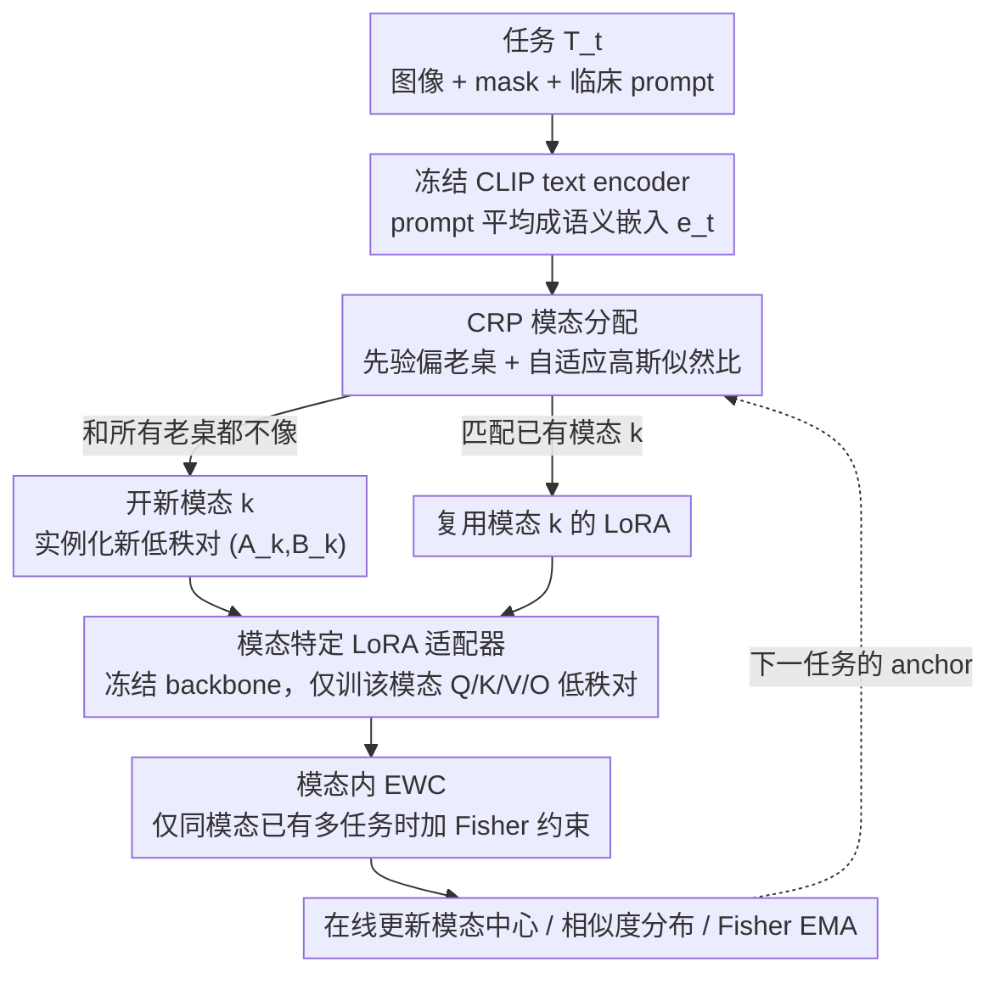

# MedCRP-CL: Continual Medical Image Segmentation via Bayesian Nonparametric Semantic Modality Discovery

**会议**: ICML 2026  
**arXiv**: [2605.20297](https://arxiv.org/abs/2605.20297)  
**代码**: https://github.com/zygao930/MedCRP-CL (有)  
**领域**: 医学图像分割 / 持续学习  
**关键词**: 持续学习, 医学图像分割, 中国餐馆过程, LoRA, EWC

## 一句话总结
用中国餐馆过程 (CRP) 对临床文本 prompt 做在线贝叶斯非参数聚类，自动发现"语义模态"，再为每个语义模态分配独立 LoRA 适配器并配合模态内 EWC，在 16 个医学分割任务上把 Dice 推到 73.3% 同时遗忘率降到 4.1%，参数仅为 MoE 基线的 1/6。

## 研究背景与动机

**领域现状**：医学图像分割模型在临床部署时，必须不断吸收新机构、新模态、新病种的数据，这天然是一个持续学习 (Continual Learning, CL) 场景。已有方案大致分两类：以 EWC 为代表的正则化方法对所有任务套用统一的 Fisher 约束；以 MoE-Adapters 为代表的专家路由方法预先指定专家数 (如 K=16)。

**现有痛点**：统一正则在异质任务上会引发严重的"折中"——胸部 X 光和肠镜根本不该共享参数，强制约束反而加剧灾难性遗忘；而预设专家数的 MoE 既无法预测未来任务多样性，又消耗大量参数（51.9M）。另一方面，医学场景因 HIPAA/GDPR 禁止回放历史病人数据，常规 replay buffer 在临床上不可用。

**核心矛盾**：参数共享与参数隔离的两难——粗放共享让差异大的任务互相干扰，硬性隔离又切断了相似任务间的有益迁移。要破局必须先回答："哪些任务应该共享，哪些应该隔离？"

**本文目标**：在不预设聚类数、不访问未来任务、不存原始病人数据的前提下，在线发现任务结构，并据此做结构感知的持续学习。

**切入角度**：作者注意到，物理成像模态（"超声"、"X 光"）粒度太粗——心脏超声和乳腺超声共享同一物理原理，但解剖结构和病理模式截然不同；而图像层面聚类高维不稳。**临床文本 prompt** 恰好天然编码了"解剖区域 + 病理上下文"的组合，是更合适的任务分组信号。

**核心 idea**：用 CRP 在 CLIP prompt 嵌入空间上做贝叶斯非参数聚类，自动发现"语义模态"（比物理模态更细），并为每个语义模态分配独立的 LoRA 适配器 + 模态内 EWC，实现"跨模态严格隔离、模态内迁移共享"。

## 方法详解

### 整体框架
这篇论文要在一条持续到来的医学分割任务流上，既不预设有多少类任务、又不存历史病人数据地完成持续学习。整体在冻结的 CLIPSeg backbone 之上运转：每来一个任务 $T_t$（含图像、mask、临床文本 prompt），先用冻结 CLIP text encoder 把 prompt 平均成一个语义嵌入 $e_t$，交给 CRP 在线判断它属于某个已有"语义模态"还是要开一个新模态；定下模态 $k$ 后，只激活该模态专属的 LoRA 适配器去训练，并在模态内部叠一层 EWC 约束防止覆盖同模态早先任务；训完再在线更新该模态的中心、相似度分布和 Fisher 信息，存成下一轮的 anchor。任务序列 $\mathcal{T}=\{T_1,\dots,T_N\}$ 就这样被自动切成若干互相隔离、内部共享的模态分支。

### 关键设计

**1. CRP 先验 + 自适应似然的贝叶斯模态分配：让"该共享还是该隔离"由数据自己回答**

持续学习里参数共享与隔离的两难，本质是"哪些任务算同一类"没人能提前知道。本文把这步交给中国餐馆过程：先验项 $P(z_t=k)\propto n_k/(t-1+\alpha)$ 偏向人多的老桌、$P(z_t=\text{new})\propto \alpha/(t-1+\alpha)$ 给开新桌留口子，于是模态数 $K$ 完全由数据驱动、不再是超参。难点在似然——"两个任务的 prompt 嵌入多相似才算同一模态"如果写成手调阈值，换个机构就漂移。作者把同模态、异模态的相似度各建成一个高斯 $\mathcal{N}(\mu_{\text{intra}},\sigma^2_{\text{intra}})$、$\mathcal{N}(\mu_{\text{inter}},\sigma^2_{\text{inter}})$，用 Welford 算法在线估计其均值方差，于是判据变成可学习的对数似然比

$$\ell(s)=\frac{(s-\mu_{\text{inter}})^2}{2\sigma^2_{\text{inter}}}-\frac{(s-\mu_{\text{intra}})^2}{2\sigma^2_{\text{intra}}}+\log\frac{\sigma_{\text{inter}}}{\sigma_{\text{intra}}}$$

样本太少冷启动时退化成 logit 形式 $\ell(s)=\log(s+\epsilon)-\log(1-s+\epsilon)$，最终按 MAP 取 $z_t=\arg\max_k \log P(z_t=k\mid z_{1:t-1},e_t)$。这套设计的好处是：阈值从手调变成随数据自适应，迁到新会议、新数据集几乎不用重调；而当某任务和所有老桌都不像时，似然比会把它推去开新桌，避免被硬塞进不合适的模态。

**2. 模态特定 LoRA 适配器：跨模态彻底隔离，模态内才共享**

光知道任务该分到哪一类还不够，得有地方真正承载各类知识。作者让 backbone 全程冻结——这直接断掉灾难性遗忘的源头——只在 CLIPSeg 的 Q/K/V/O 投影上为每个模态挂一对低秩适配器，模态 $k$ 的有效权重是 $W_k=W_0+\frac{\alpha_{\text{LoRA}}}{r}B_k A_k$（rank=8、$\alpha_{\text{LoRA}}=16$）。CRP 一旦判出新模态就实例化一对新的 $(A_k,B_k)$。这样胸部 X 光和肠镜走的是物理上分开的分支，天然杜绝了它们之间的负迁移；而落进同一模态的任务复用同一对 LoRA，知识才能互相迁移。正是"同模态共享 LoRA"这一点，把它和"一任务一专家"型 MoE 区分开——后者隔离彻底却切断了相似任务间的有益迁移。

**3. 模态内 Elastic Weight Consolidation：把 EWC 关进已被判为相似的同一桌里**

模态内共享 LoRA 又带回一个小隐患：同一模态的后续任务可能覆盖前序任务的关键参数。经典 EWC 在异质任务流上失效，恰恰是因为跨任务的 Fisher 互相冲突——胸片的重要参数和肠镜的重要参数被强行约束在一起。本文的破法是只在模态内部做 EWC：训完任务 $t$ 估计 Fisher 信息 $F_k^{(t)}=\mathbb{E}[\nabla_{\theta_k}\log p(y\mid x;\theta_k)^{\otimes 2}]$，用 $\bar F_k\leftarrow \frac{n_k-1}{n_k}\bar F_k+\frac{1}{n_k}F_k^{(t)}$ 做指数滑动平均合并，后续训练再加约束项 $\Omega_k(\theta_k)=\sum_i \bar F_{k,i}(\theta_{k,i}-\theta_{k,i}^*)^2$（仅当该模态的首个任务时 $\Omega_k=0$）。因为约束只发生在"已被 CRP 判为相似"的任务之间，Fisher 冲突被天然规避；而整套机制只存 Fisher EMA 和模态中心、不碰原始病人数据，是 replay-free 的，正好契合 HIPAA/GDPR 对医学数据的隐私约束。

### 损失函数 / 训练策略
训练目标 $\mathcal{L}=\mathcal{L}_{CE}+\mathcal{L}_{Dice}+\mathbf{1}_{[n_{z_t}>1]}\cdot\Omega_{z_t}(\theta_{z_t})$。Dice 处理医学图像类别不平衡；EWC 仅在模态已存在多个任务时启用。优化器 AdamW、lr=$1\times 10^{-3}$、weight decay=$8\times 10^{-5}$；每任务最多 60 epoch、patience=8。CRP 浓度 $\alpha=5$，EWC 系数 $\lambda=5000$，Fisher 用 200 样本估计。所有图像 resize 到 $352\times 352$，单卡 RTX 4090 batch size 16。

## 实验关键数据

### 主实验
16 个医学分割任务（5 个肠镜 + 1 个皮肤镜 + 3 个超声 + 7 个胸部 X 光），mixed 任务顺序下与 5 个 CL 基线对比：

| 方法 | Dice (%) ↑ | Forgetting (%) ↓ | Params (M) | GPU (GB) | 备注 |
|------|------------|------------------|------------|----------|------|
| Individual（上界） | 77.9 | – | 19.8 | 12.4 | 每任务独立模型 |
| Sequential | 48.0 ± 7.1 | 28.3 ± 7.7 | 1.2 | 5.8 | 朴素微调 |
| EWC | 56.8 ± 3.7 | 11.3 ± 3.5 | 1.2 | 5.8 | 统一正则 |
| RAPF | 58.4 ± 1.7 | 7.2 ± 2.6 | 0.9 | 5.6 | 适配器融合 |
| CL-LoRA | 60.7 ± 2.0 | 9.7 ± 1.4 | 0.05 | 5.7 | LoRA + KD |
| MoE-Adapters | 65.3 ± 3.4 | 7.1 ± 3.2 | 51.9 | 13.3 | K=16 专家 |
| **Ours (MedCRP-CL)** | **73.3 ± 1.0** | **4.1 ± 0.8** | **8.6** | 12.4 | CRP+LoRA+EWC |

相对 MoE-Adapters 提升 8.0% Dice、降低 3.0% 遗忘，同时只用 1/6 参数；早期任务（CAMUS 82.3 vs MoE 42.4、CVC300 90.3 vs MoE 69.4）几乎不掉点。

### 消融实验

模块消融：

| 配置 | CRP | LoRA | EWC | Dice (%) | Forgetting (%) |
|------|-----|------|-----|----------|----------------|
| Full Model | ✓ | ✓ | ✓ | 73.33 | 4.09 |
| w/o EWC | ✓ | ✓ | × | 71.92 | 5.41 |
| w/o CRP | × | ✓ | ✓ | 57.59 | 15.55 |
| Single LoRA | × | ✓ | × | 46.94 | 27.34 |
| w/o LoRA | ✓ | × | ✓ | 45.39 | 0.03 |

模态发现策略对比：

| 模态分配方式 | K | Dice (%) | Forgetting (%) |
|--------------|---|----------|----------------|
| 物理成像类型 | 4 | 65.75 | 9.23 |
| CRP 发现 (Ours) | 5 | 73.33 | 4.09 |

### 关键发现
- **CRP 是性能基石**：去掉 CRP 后遗忘率从 4.09% 飙升到 15.55%，Dice 从 73.33% 跌到 57.59%；去掉 LoRA 虽然遗忘几乎为零但 Dice 只有 45.39%——说明"路由发现"与"参数容量"缺一不可。
- **语义模态 ≠ 物理模态**：CRP 自动发现 K=5 而非 K=4，关键差异是把心脏超声 (CAMUS) 和乳腺超声 (BUSI) 分到不同模态——它们物理上都是超声但解剖完全不同；视觉相似度高达 0.95+ 而文本相似度只有 ~0.45，正是文本嵌入提供了正确的分组信号 (intra-/inter-gap 0.50 vs 视觉 0.22)。
- **结构具备稳健性**：换 10 个文本编码器 (PubMedCLIP / BiomedCLIP / OpenCLIP B/32, B/16, L/14 / FLAVA / BLIP / CoCa 等) 在 $\alpha=5$ 下都得到完全相同的 K=5 和成员划分；prompt 加缩写、错字、关键词删除等临床噪声也仍是 K=5——说明发现的语义模态是数据的内在性质，不是编码器伪影。
- **顺序鲁棒**：在 grouped / interleaved / mixed / reversed 四种任务顺序下 Dice 都稳定在 0.72-0.74、遗忘 0.04-0.06；MoE-Adapters 同样实验下波动 0.62-0.70、遗忘 0.11-0.16。

## 亮点与洞察
- **用文本而非图像做任务路由**：在医学 CL 里这是个被忽视的方向。视觉聚类高维不稳、跨中心存在采集偏差；临床 prompt 短而高判别力，且天然由医生写成、几乎无成本。这个思路完全可以迁移到机器人、遥感等"有自然语言描述"的多任务 CL 场景。
- **自适应高斯似然替代手调阈值**：把"两个任务算不算同一模态"的判据建模成两个在线高斯并算似然比，是非常工程实用的设计——避免了 DP-Means 类方法对距离阈值的敏感性，迁移到新会议、新数据集时几乎无需重调超参。
- **CRP 与 LoRA 的结合很自然**：CRP 给"是否开新桌"的离散决策，LoRA 给"每桌有独立小适配器"的低成本参数实例化，两者一起把"动态扩容 + 参数高效"这两条路线缝合起来。比一任务一专家的 Low-Rank MoE 更经济，比 K 固定的 MoE-Adapters 更灵活。
- **Replay-free 是医学场景的关键工程贡献**：只存 LoRA 权重、Fisher EMA 和每个模态的中心向量，没有任何原始病人数据，直接满足 HIPAA/GDPR。这一点对真正落地比 Dice 提升更重要。

## 局限与展望
- **依赖文本编码器训练范式**：作者明确给出 SigLIP 和 S-PubMedBERT 这类非对比训练的编码器会塌缩到 K=1，方法只适用于对比学习训练的文本编码器；这在新一代以生成式为主的模型时代是个隐忧。
- **prompt 质量决定上限**：实验里 prompt 来自 MedVLSM，是较为规整的临床描述。真实临床报告含大量缩写、口语化、跨科室术语差异，作者只在受控扰动下验证；面对真实噪声 prompt 是否仍稳定 K=5 还需更长时间的多中心实验。
- **只在 2D 上验证**：16 个任务全部是 2D 分割（肠镜、皮肤镜、超声 2D 切面、X 光）。3D CT/MRI 体素数据上 CRP 是否仍能从切片级 prompt 得到稳定语义模态，作者只在相关工作里提了一句"可结合 HFF-Net、TRACE 等 3D 工作"，没有实验。
- **模态数量 K 的语义解释不固定**：5 个模态的具体语义需要 t-SNE 事后解读，缺乏前瞻性可解释保证；当任务规模扩到上百时，K 是否会膨胀到难以管理仍是开放问题。可以考虑加入层次化 CRP (hCRP) 让模态形成树状结构。

## 相关工作与启发
- **vs EWC / RAPF**: 经典正则化方法对全部任务套用同一组 Fisher 约束，本文核心创新是"只在模态内做 EWC"，从根本上规避异质任务间 Fisher 冲突；实验上 Dice 提升 15+ 个点。
- **vs CL-LoRA**: 同样基于 LoRA + 知识蒸馏，但 CL-LoRA 无任务结构发现机制，仍把所有任务塞进同一组适配器，参数虽极小（0.05M）但遗忘率 9.7%、Dice 仅 60.7%。本文用模态级 LoRA 换来 12+ 个点 Dice。
- **vs MoE-Adapters**: 都用"专家"架构，但 MoE 必须预设 K=16 且每个任务都路由到固定一组专家，参数膨胀到 51.9M 还无法适配新模态。本文 CRP 把 K 交给数据决定，最终只用 5 个 LoRA 模态、8.6M 参数就反超 8 个 Dice。
- **vs Low-Rank MoE (Chen 2024)**: 一任务一 LoRA 专家避免遗忘但参数线性增长且无知识共享。本文通过模态内共享 LoRA + 模态内 EWC，在隔离与共享之间取得更好平衡。
- **vs MedPEFT-CL**: 同领域工作，需要 replay buffer 而本文 replay-free，直接满足医学隐私法规。

## 评分
- 新颖性: ⭐⭐⭐⭐ 把 CRP 引入医学 CL + 用 prompt 嵌入做模态发现的组合在医学 CL 里属于新方向，但 CRP 和 LoRA、EWC 都是已有零件。
- 实验充分度: ⭐⭐⭐⭐⭐ 16 任务、4 种顺序、10 个文本编码器、4 种 prompt 扰动级别，把消融做得相当扎实。
- 写作质量: ⭐⭐⭐⭐ 动机→方法→消融逻辑链清晰，公式推导规范；附录承担了相当多的细节验证。
- 价值: ⭐⭐⭐⭐ Replay-free + 自动发现 K + 1/6 参数 + 8% Dice 提升，对医学 CL 部署有直接价值；CRP+prompt 路由的思路对其他多任务 CL 场景也具迁移性。

<!-- RELATED:START -->

## 相关论文

- [\[CVPR 2026\] SPEGC: Continual Test-Time Adaptation via Semantic-Prompt-Enhanced Graph Clustering for Medical Image Segmentation](../../CVPR2026/medical_imaging/spegc_continual_test-time_adaptation_via_semantic-prompt-enhanced_graph_clusteri.md)
- [\[ICML 2026\] SEMIR: Semantic Minor-Induced Representation Learning on Graphs for Visual Segmentation](semir_semantic_minor-induced_representation_learning_on_graphs_for_visual_segmen.md)
- [\[AAAI 2026\] Bidirectional Channel-selective Semantic Interaction for Semi-Supervised Medical Segmentation](../../AAAI2026/medical_imaging/bidirectional_channel-selective_semantic_interaction_for_semi-supervised_medical.md)
- [\[CVPR 2026\] Semantic Class Distribution Learning for Debiasing Semi-Supervised Medical Image Segmentation](../../CVPR2026/medical_imaging/semantic_class_distribution_learning_for_debiasing.md)
- [\[ICML 2026\] Are We Overconfident in Models and Results for Semi-Supervised 3D Medical Image Segmentation?](are_we_overconfident_in_models_and_results_for_semi-supervised_3d_medical_image_.md)

<!-- RELATED:END -->
