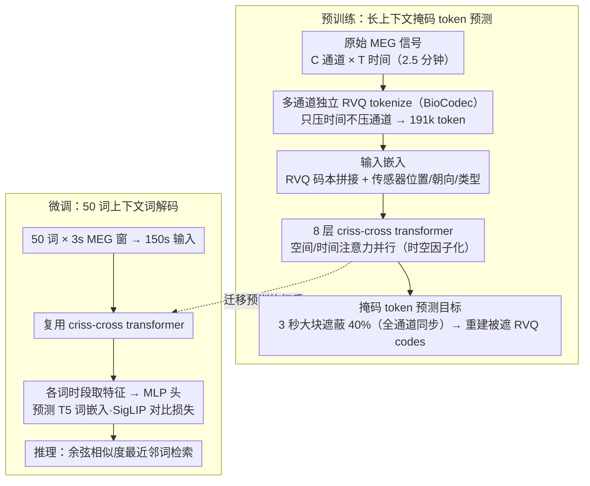

# MEG-XL: Data-Efficient Brain-to-Text via Long-Context Pre-Training

**会议**: ICML 2026  
**arXiv**: [2602.02494](https://arxiv.org/abs/2602.02494)  
**代码**: 已开源（论文声明 release code + weights）  
**领域**: 脑机接口 / 神经解码 / 基础模型  
**关键词**: 脑到文本, 长上下文预训练, MEG, criss-cross attention, masked token prediction

## 一句话总结
MEG-XL 用 2.5 分钟（191k token）的 MEG 上下文做 mask token 预训练（比此前长 5–300×），再微调到 50 词的脑到文本任务上，仅用 1 小时数据就达到 SOTA 监督方法 50 小时的解码精度，并显著超过所有 brain foundation models。

## 研究背景与动机

**领域现状**：脑到文本（B2T）解码是脑机接口（BCI）的核心方向，分侵入式（皮层电极，Moses 2021、Willett 2023、Card 2024 等已达可用精度）和非侵入式（MEG/EEG，门槛更低但信号更弱）。非侵入式代表是 Défossez et al. (2022) 用 1 秒 MEG 解码语音、d'Ascoli et al. (2025) 把上下文扩到句子级（150s）做词解码。Brain foundation models（LaBraM、BIOT、EEGPT、BrainOmni、CBraMod）在 5–30 秒短窗口上做 mask 预训练。

**现有痛点**：(1) 监督方法依赖每个被试 50 小时级别的训练数据，对真正需要 BCI 的瘫痪患者来说不切实际——他们无法长时间提供训练录音。(2) 现有 brain foundation models 几乎都在 ≤10 秒短窗口上预训练，与下游需要的长时神经语言学结构（短语、句子、语篇）严重不匹配；最近分析（Yang 2026）发现这些 FM 在低数据场景反而不如监督方法。(3) 上下文延长被计算瓶颈卡住：标准 transformer attention 是 $\mathcal{O}((CT')^2)$，多通道 + 长时序直接爆显存。

**核心矛盾**：神经活动里存在跨越数十秒到数分钟的语言相关结构（短语聚合、句法、语篇连贯），但短窗口预训练模型既看不到也学不会利用这种长程依赖；同时，临床部署最需要的「少数据快速适配新被试」恰恰是短上下文 FM 的盲区。

**本文目标**：(i) 构建一个能在分钟级 MEG 上下文上做 mask 预训练的框架，且不被显存压垮；(ii) 验证长上下文预训练是否真的能在低数据下游场景（特别是 contextual word decoding）超过 SOTA 监督方法和所有现有 FM；(iii) 解释长上下文为什么有用——是否真的学到了选择性 + 层级化的注意力。

**切入角度**：作者从 Transformer-XL 致敬出发，认为「神经数据 = 长文档」，必须像 LM 一样在长上下文里预训练才能学到长程统计先验。计算瓶颈用 criss-cross 因子化注意力（Wang 2025）解决——把时间和通道维度的注意力解耦并行。

**核心 idea**：用 BioCodec 把每个通道独立 tokenize（rank 12 时间压缩），喂入 8 层 criss-cross transformer，在 2.5 分钟 MEG 窗口里 mask 40% 的 3 秒块做预测，让模型被迫学跨分钟的神经依赖；微调到词解码即得到数据高效的 B2T 模型。

## 方法详解

### 整体框架
MEG-XL 把「神经数据当成长文档」，先在 2.5 分钟（191k token）的 MEG 上下文上做掩码预训练学到长程统计先验，再微调到 50 词的脑到文本任务。预训练时原始 MEG $\mathbf{X}\in\mathbb{R}^{C\times T}$ 先经每通道独立的冻结 BioCodec 压成离散 token，拼接位置/朝向/类型 embedding 后过 8 层 criss-cross transformer，用 3 秒大块均匀遮蔽 40% 的 token 让模型预测被遮位置的 RVQ codes；微调时沿用 d'Ascoli 的任务设置——50 个词 × 3 秒 MEG 窗拼成 150 秒输入，预测每个词对应时间段的 T5 词嵌入，用 SigLIP 对比损失训一个 MLP 头，推理时按余弦相似度做最近邻词检索。整套流程分预训练、微调两段，二者共用同一个 criss-cross transformer 主干。

### 关键设计

**1. 多通道独立 RVQ tokenize（BioCodec）+ 残差码本输入嵌入：只压时间不压通道**

要在长上下文上做掩码预测，先得把连续 MEG 信号压成离散 token——既缩短序列又顺便提供预测目标。本文用 BioCodec（在 EEG 上训练的神经音频 codec 风格 tokenizer）对每个通道独立做残差矢量量化：$Q=6$ 个残差量化级别、每级词表 $V=256$，时间方向下采 12 倍，把 50Hz × 150s × 数百通道压成 191k token。输入嵌入查找每级 codebook 向量 $\mathbf{e}^{(q)}_{z_{c,q,t}}$ 拼接后投影 $\mathbf{h}^{(0)}_{c,t}=\mathbf{W}_{proj}[\mathbf{e}^{(1)};...;\mathbf{e}^{(Q)}]$，再叠加传感器位置 Fourier 特征 $\gamma(\mathbf{v})=[\cos(2\pi\mathbf{Bv}),\sin(2\pi\mathbf{Bv})]$、朝向、类型 embedding。关键是只压时间不压通道：相比 BrainTokenizer 那种「时间通道一起压」的做法，单压时间的重建质量更好，避免在 tokenize 阶段就把任务相关信息丢掉；而 RVQ 用多级残差同时捕捉慢动态和高频细节，在这种高频时序数据上比单一 VQ 保真度更高。

**2. 2.5 分钟超长上下文 + criss-cross 因子化注意力：把分钟级视野塞进单卡**

神经里的语言学结构（短语聚合、句法、语篇连贯）跨越数秒到数分钟，而现有 brain foundation models 几乎都在 ≤10 秒短窗口上预训练，结构上就够不着这种长程依赖。但直接拉长上下文会撞上计算墙：标准 attention 复杂度是 $\mathcal{O}((CT')^2)$，数百通道 × 长时序直接爆显存。本文借 criss-cross 注意力把特征维平均切两半解耦时空——一半走 SpatialAttn（每个时间步独立跨通道做注意力，$\mathcal{O}(T'\cdot C^2)$），另一半走 TemporalAttn（每个通道独立跨时间做注意力并加 RoPE 编码时间位置，$\mathcal{O}(C\cdot T'^2)$），两半在通道维拼回后接残差 + RMSNorm + SELU FFN。总复杂度从 $\mathcal{O}((CT')^2)$ 降到 $\mathcal{O}(C\cdot T'^2+T'\cdot C^2)$，2.5 分钟 × 数百通道 × 50Hz 经 12 倍压缩后的 191k token 序列才塞得进单卡。这种因子化能成立，是因为脑信号天然「同传感器时序相关 + 同时刻空间相关」，时空相关性近似可分离，对它做解耦是个好近似。

**3. 3 秒大块 mask + 全通道同步遮蔽：堵死插值捷径逼出长程建模**

MEG 时间高度自相关，如果只遮短片段，模型走「邻居插值」捷径就能把缺口补上，根本学不到长程依赖。本文反其道而行：随机选 3 秒时间块累计到 40% token 被遮，且在选中的时间步上**同步遮蔽所有通道**，再用 mask embedding 替换，模型须预测每个被遮位置的 RVQ codes $p(z_{c,q,t}\mid\mathbf{X}_{\backslash\mathcal{M}})=\text{softmax}(\mathbf{W}_q\mathbf{h}^{(L)}_{c,t})$，损失为

$$\mathcal{L}=-\frac{1}{|\mathcal{M}|CQ}\sum_t\sum_c\sum_q\log p(z_{c,q,t}\mid\mathbf{X}_{\backslash\mathcal{M}}).$$

3 秒块大小特意选得很长，覆盖单词神经响应的典型时长（Kutas & Federmeier 2011），加上全通道同步遮蔽就同时断掉了「时间邻居插值」和「通道邻居插值」两条 shortcut，逼模型真正建模长时间结构。40% 的 mask 率也是经验调过的——比 BERT 的 15% 高很多，介于 MAE 的 75% 与 wav2vec 2.0 的 49% 之间。

### 损失函数 / 训练策略
预训练用约 300 小时 MEG（CamCAN + MOUS + SMN4Lang），覆盖静息、运动、语音等任务、数百被试，目标是掩码 token 预测交叉熵；不同 MEG 系统通道数不同，用 channel mask 处理 padding。微调用 SigLIP 对比损失 + 词嵌入回归头，端到端微调 transformer + MLP 头，推理时按余弦相似度做最近邻词检索。

## 实验关键数据

### 主实验

| Model | Params | MEG-MASC (13%) | Armeni (13%) | LibriBrain (13%) | MEG-MASC (100%) | Armeni (100%) | LibriBrain (100%) |
|---|---|---|---|---|---|---|---|
| BioCodec baseline | 1.0M | 19.8 | 20.0 | 19.9 | 31.2 | 37.1 | 41.9 |
| EEGPT | 4.7M | 19.6 | 20.3 | 20.3 | 26.3 | 20.8 | 22.9 |
| BIOT | 3.2M | 20.0 | 20.2 | 20.6 | 31.3 | 35.7 | 45.6 |
| BBL | 15M | 21.5 | 22.3 | 32.1 | 35.9 | 39.1 | 49.9 |
| BrainOmni | 8.4M | 18.7 | 21.0 | 29.7 | 19.1 | 62.3 | 63.0 |
| LaBraM | 5.8M | 33.2 | 26.3 | 40.3 | 31.1 | 42.0 | 47.7 |
| **MEG-XL (Ours)** | **20M** | **47.0** | **54.9** | **57.3** | **46.4** | **61.2** | **63.0** |

低数据（13%）场景 MEG-XL 比次强 LaBraM 高 13–28 点；满数据下与 BrainOmni 持平或更好。BrainOmni 在 MEG-MASC（浅多被试）上甚至崩到 19.1%，说明现有 FM 在临床最需要的「浅数据多被试」场景失败。

### 消融实验 / 长上下文效应

| 配置 | 效果 |
|---|---|
| Random init MEG-XL（无预训练） | 性能与监督基线相近，证明增益来自预训练而非架构 |
| 预训练上下文 5s → 30s → 100s → 150s | 词解码 linear probe 单调提升，约 100s 后饱和 |
| Full-context vs Matched-context 推理 | 几乎重合 → 推理时给更长上下文无用，除非预训练过 |
| Masked prediction（零样本） | 上下文从 5s 到 150s 单调提升，未饱和——更长可能继续涨 |
| 注意力分析 | 长上下文模型早期层局部注意 + 深层全局整合 + 注意力熵更低 |

### 关键发现
- 数据效率断崖式提升：MEG-XL 在 1 小时数据下达到的精度，监督 SOTA 需要 50 小时（约 50× 数据效率）。
- 长上下文学到的是「何时该看远 / 何时该看近」的选择性层级注意——短上下文模型从第一层就均匀注意，永远学不会这种分层。
- 模型在 LibriBrain 这种「深单被试」数据上仍被 d'Ascoli 监督方法在数据充足时反超（2.5 小时后），印证「pre-training 替代 subject-specific data」的边界。
- 监督方法在数据少时被 MEG-XL 完胜（MEG-MASC 上 +25 点以上），这正是 BCI 临床部署最重要的场景。

## 亮点与洞察
- 「长上下文是学到的能力，不是给的能力」是这篇最重要的洞察——只在推理时给长上下文没用，必须在预训练时就喂；这与 LM 的 length generalization 文献完全呼应，把这一规律带入神经解码领域。
- Criss-cross attention 在脑信号上的成功提示：高度结构化的时空数据普遍可以用「时空因子化注意力」绕开二次复杂度；这一思想适用于 fMRI、ECoG、传感器网络等任何 $C\times T$ 高维信号。
- 在临床部署语境中，「跨被试预训练替代被试内深度训练」是真正的范式转变——它把 BCI 从「每个新用户 50 小时训练」松到「1–2 小时」，对瘫痪患者尤其重要。
- 3 秒大块 + 全通道同步遮蔽是个聪明的设计——它同时禁止了「时间邻居插值」和「通道邻居插值」两条 shortcut，逼出真正的语义级建模。

## 局限与展望
- 仅测了感知语音（被试听有声书），未触及更难的想象语音（imagined speech）；后者才是瘫痪患者实际使用 BCI 的方式。
- 检索词表只有 50（top-250 趋势相似），距临床所需的开放词表（成千上万词）仍有几个数量级差距。
- 长上下文带来的可解释性收益（层级化注意力）还停留在统计描述层面，未给出对应到具体语言学结构（音节/词/短语）的清晰证据。
- 显存仍是上限——150s 已是 GPU VRAM 极限，无法进一步验证更长上下文是否持续受益。
- 预训练数据是健康人的研究数据集，与真实瘫痪患者的 MEG 信号特性可能存在 domain shift。

## 相关工作与启发
- **vs d'Ascoli et al. (2025)（监督 SOTA）**：他们首次把 MEG 输入扩到句子级 150s，但靠监督训练，数据需求大；MEG-XL 继承同款上下文长度但通过自监督预训练把数据需求降一两个数量级。
- **vs LaBraM / EEGPT / BIOT / BrainOmni**：这些 brain FM 都用 ≤30s 短窗预训练，在低数据下塌缩；MEG-XL 把上下文扩到分钟级带来质变。
- **vs CBraMod / BrainOmni（criss-cross 同源）**：BrainOmni 也用了 criss-cross attention，但仍用 30s 窗口；本文证明把窗口拉到 150s 才发挥这种因子化注意力的真正价值。
- **vs Transformer-XL（命名致敬）**：把 LM 长上下文范式直接搬到神经数据，并证明类似规律成立。

## 评分
- 新颖性: ⭐⭐⭐⭐ 把分钟级上下文 + RVQ tokenize + criss-cross 注意力组合用到 B2T 是首次，思路清晰且效果显著。
- 实验充分度: ⭐⭐⭐⭐⭐ 3 个 MEG 数据集 + 6 个 FM 基线 + 监督 SOTA + 线性探测 + 零样本预测 + 注意力分析，证据链非常完整。
- 写作质量: ⭐⭐⭐⭐⭐ 故事讲得极漂亮——从「LM 长上下文成功」类比到神经数据，理论框架 + 实证 + 机制分析一气呵成；公式与图配合精准。
- 价值: ⭐⭐⭐⭐⭐ 对非侵入式 BCI 的临床可行性是实质性推动；提出的「长上下文是学到的能力」原则对整个神经基础模型方向有方法论意义。

<!-- RELATED:START -->

## 相关论文

- [\[CVPR 2026\] Ultrasound-CLIP: Semantic-Aware Contrastive Pre-training for Ultrasound Image-Text Understanding](../../CVPR2026/medical_imaging/ultrasound-clip_semantic-aware_contrastive_pre-training_for_ultrasound_image-tex.md)
- [\[CVPR 2025\] Multi-Resolution Pathology-Language Pre-training Model with Text-Guided Visual Representation](../../CVPR2025/medical_imaging/multi-resolution_pathology-language_pre-training_model_with_text-guided_visual_r.md)
- [\[CVPR 2026\] Meta-learning In-Context Enables Training-Free Cross Subject Brain Decoding](../../CVPR2026/medical_imaging/meta-learning_in-context_enables_training-free_cross_subject_brain_decoding.md)
- [\[ECCV 2024\] TIP: Tabular-Image Pre-training for Multimodal Classification with Incomplete Data](../../ECCV2024/medical_imaging/tip_tabular-image_pre-training_for_multimodal_classification_with_incomplete_dat.md)
- [\[NeurIPS 2025\] BrainOmni: A Brain Foundation Model for Unified EEG and MEG Signals](../../NeurIPS2025/medical_imaging/brainomni_a_brain_foundation_model_for_unified_eeg_and_meg_signals.md)

<!-- RELATED:END -->
